```{r setup, include=FALSE}
knitr::opts_chunk$set(echo = T, message = F, warning = F)
```

---

```{r}
# devtools::install_github("derekmichaelwright/agData")
library(agData)
library(GGally) # ggpairs() 
library(latex2exp) # TeX()
```

# Introduction to Augmented Designs

Augmented designs were developed as a way of controlling error in plant breeding trials which often have many genotypes that need to be tested, and limited seed or resources to do proper replications of all material (Federer, 1956). Therefore, in order to control for the heterogeneity that exists within a field, a set of check cultivars are replicated in each *block*. The block effects and error estimated from the replicated checks, is then used to adjust the values of each new genotype being tested.

## Type I - Augmented RCBD

[**Federer, W.** (1956) Augmented (or hoonuiaku) designs. *Hawaiian Planters Record*.](https://ecommons.cornell.edu/handle/1813/32841)

<font size="5"> `r shiny::icon("save")` [data_augmented_designs_1.csv](data_augmented_designs_1.csv) </font>

## Type II - Modified

[**Lin, C.S. & Poushinsky, G.** (1985) A modified augmented design (type 2) for rectangular plots. *Canadian journal of plant science*. 65(3): 743-749.](https://cdnsciencepub.com/doi/abs/10.4141/cjps85-094)

[**You, F.M., Song, Q., Jia, G., Cheng, Y., Duguid, S., Booker, H. and Cloutier, S.** (2016) Estimation of genetic parameters and their sampling variances for quantitative traits in the type 2 modified augmented design. *The Crop Journal*. 4(2): 107-118.](https://www.sciencedirect.com/science/article/pii/S2214514116000179)

[Table S1 – The raw phenotypic data of a population with 243 RILs derived from a cross between ‘CDC Bethune’ and ‘Macbeth’ (BM) for the case study](https://data.nal.usda.gov/dataset/data-estimation-genetic-parameters-and-their-sampling-variances-quantitative-traits-type-2-modified-augmented-design)

<font size="5"> `r shiny::icon("save")` [data_augmented_designs_2.csv](data_augmented_designs_2.csv) </font>

---

# Type I - Augmented RCBD

## RCBD

In a **Randomized Complete Block Design** (**RCBD**), every genotype is present in each block, making each block a replicate with entries randomized within. As such, a field trial of 4 genotypes (A, B, C, D), with 4 replicates each (4 blocks) will look something like this: 

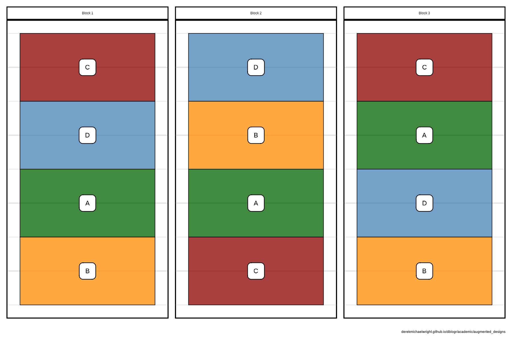

```{r echo = F}
# Prep data
genotypes <- c("A", "B", "C", "D")
myColors <- c("darkgreen", "darkorange", "darkred", "steelblue", "white")
dd <- read.csv("data_augmented_designs_1.csv") %>% 
  filter(Genotype %in% genotypes) %>%
  mutate(Row = rep(1:4, time = 3),
         Block = paste("Block", Block))
# Plot
mp <- ggplot(dd, aes(x = "", y = Row)) + 
  geom_tile(aes(fill = Genotype), color = "black", alpha = 0.75) + 
  geom_label(aes(label = Genotype), size = 6) +
  facet_grid(. ~ Block) +
  scale_fill_manual(values = myColors) +
  scale_y_reverse() +
  theme_agData(legend.position = "none",
               axis.text.y = element_blank(),
               axis.ticks = element_blank()) +
  labs(y = NULL, x = NULL, caption = "\u00A9 derekmichaelwright.github.io/dblogr/")
ggsave("aug_00_01.png", mp, width = 6, height = 4)
```

In an **Augmented RCBD**, the idea is to have a small set of check varieties which are present in each block, *i.e.*, an RCBD, augmented with unreplicated test varieties. *E.g.,* lets say we have 8 test varieties named: e, f, g, h, i, j, k, l. Our field trial might look like this:

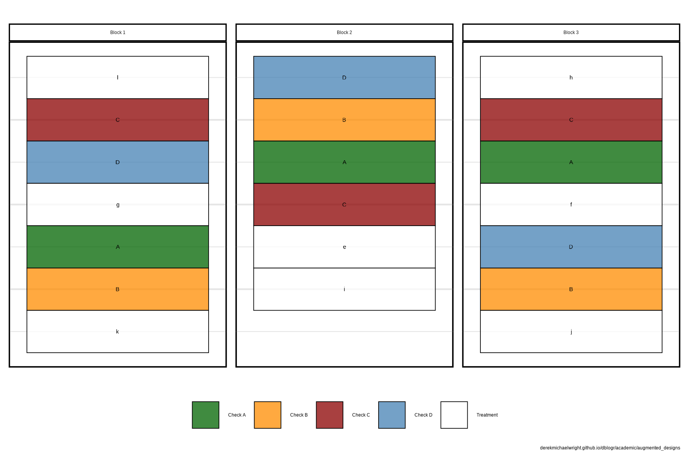

```{r echo = F}
# Prep data
checks <- c("Check A", "Check B", "Check C", "Check D")
genotypes <- c("A", "B", "C", "D", 
               "e", "f", "g", "h", "i", "j" ,"k", "l")
myColors <- c("darkgreen", "darkorange", "darkred", "steelblue", "white")
dd <- read.csv("data_augmented_designs_1.csv") %>%
  mutate(Color = ifelse(Genotype %in% genotypes[1:4], Genotype, "Treatment"),
         Color = plyr::mapvalues(Color, genotypes[1:4], checks),
         Color = factor(Color, levels = c(checks, "Treatment")),
         Type = ifelse(Color %in% checks, "Check", "Treatment"),
         Block = factor(paste("Block", Block)),
         Genotype = factor(Genotype, levels = genotypes))
# Plot
mp <- ggplot(dd, aes(x = "", y = Row)) + 
  geom_tile(aes(fill = Color), color = "black", alpha = 0.75) + 
  geom_text(aes(label = Genotype)) +
  facet_grid(. ~ Block) +
  scale_fill_manual(name = NULL, values = myColors) +
  scale_y_reverse() +
  theme_agData(legend.position = "bottom",
               axis.text.y = element_blank(),
               axis.ticks = element_blank()) +
  labs(title = "", y = NULL, x = NULL,
       caption = "\u00A9 derekmichaelwright.github.io/dblogr/")
ggsave("aug_00_02.png", mp, width = 6, height = 4)
```

---

## Federer Example

Now lets explore the data analysis for such a trial. This data comes from a trial on Field 78 at Pioneer Mill Sugar Company, 1931 (**Federer, 1956**), which had 3 different level ditches (blocks), and the recorded data was in tons of sugar cane per acre (TCA).

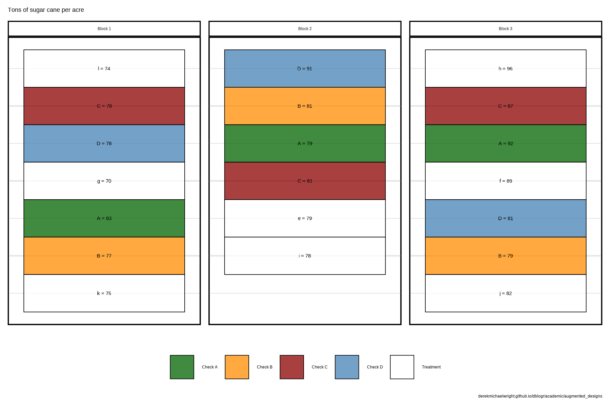

```{r}
# Prep data
checks <- c("Check A", "Check B", "Check C", "Check D")
genotypes <- c("A", "B", "C", "D", 
               "e", "f", "g", "h", "i", "j" ,"k", "l")
myColors <- c("darkgreen", "darkorange", "darkred", "steelblue", "white")
dd <- read.csv("data_augmented_designs_1.csv") %>%
  mutate(Type = ifelse(Genotype %in% genotypes[1:4], Genotype, "Treatment"),
         Type = plyr::mapvalues(Type, genotypes[1:4], checks),
         Type = factor(Type, levels = c(checks, "Treatment")),
         Block = factor(paste("Block", Block)),
         Genotype = factor(Genotype, levels = genotypes))
# Plot data
mp <- ggplot(dd, aes(x = "", y = Row)) + 
  geom_tile(aes(fill = Type), color = "black", alpha = 0.75) + 
  geom_text(aes(label = paste(Genotype, Yield, sep = " = "))) +
  facet_grid(. ~ Block) +
  scale_fill_manual(name = NULL, values = myColors) +
  scale_y_reverse() +
  theme_agData(legend.position = "bottom",
               axis.text.y = element_blank(),
               axis.ticks = element_blank()) +
  labs(title = "Tons of sugar cane per acre", y = NULL, x = NULL,
       caption = "\u00A9 derekmichaelwright.github.io/dblogr/")
ggsave("aug_01_01.png", mp, width = 6, height = 4)
```

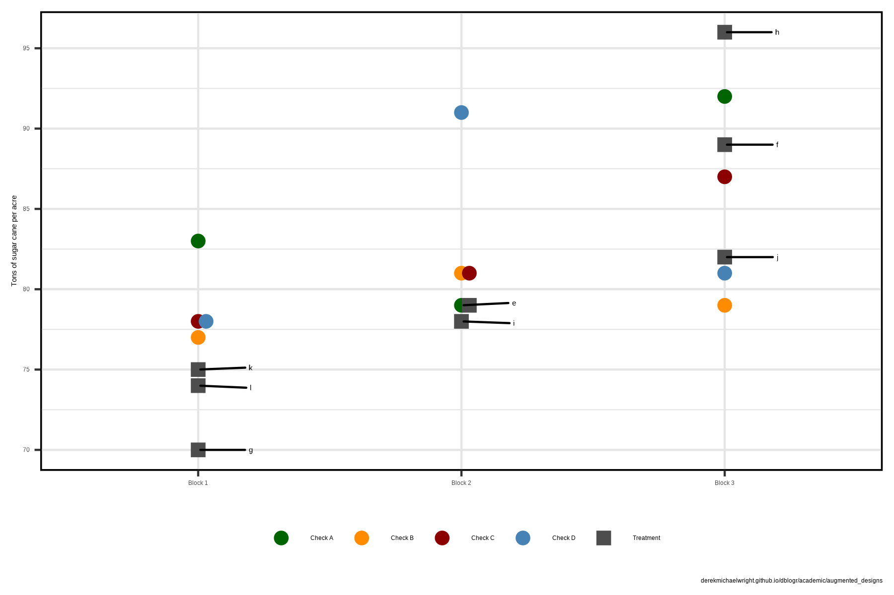

```{r}
# Prep data
myColors <- c("darkgreen", "darkorange", "darkred", "steelblue", "grey30")
xt <- dd %>% filter(Type == "Treatment")
xc <- dd %>% filter(Type != "Treatment")
# Plot
mp <- ggplot(dd, aes(x = Block, y = Yield)) + 
  geom_beeswarm(aes(color = Type, shape = Type), size = 3) +
  geom_text_repel(data = xt, aes(label = Genotype), nudge_x = 0.2) +
  scale_color_manual(name = NULL, values = myColors) +
  scale_shape_manual(name = NULL, values = c(16,16,16,16,15)) +
  scale_y_continuous(breaks = seq(70, 95, by = 5)) +
  theme_agData(legend.position = "bottom") +
  labs(y = "Tons of sugar cane per acre", x = NULL,
       caption = "\u00A9 derekmichaelwright.github.io/dblogr/")
ggsave("aug_01_02.png", mp, width = 6, height = 4)
```

But first lets focus on the unreplicated test varieties.

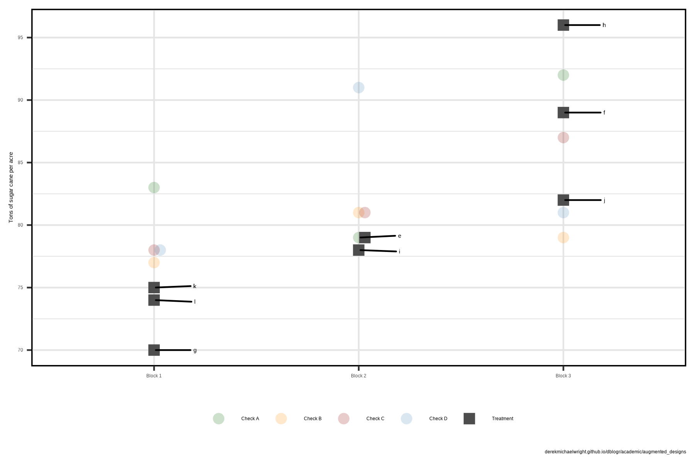

```{r}
# Plot
mp <- ggplot(dd, aes(x = Block, y = Yield)) + 
  geom_beeswarm(aes(color = Type, shape = Type, alpha = Type), size = 3) +
  geom_text_repel(data = xt, aes(label = Genotype), nudge_x = 0.2) +
  scale_color_manual(name = NULL, values = myColors) +
  scale_shape_manual(name = NULL, values = c(16,16,16,16,15)) +
  scale_alpha_manual(name = NULL, values = c(0.2,0.2,0.2,0.2,1)) +
  scale_y_continuous(breaks = seq(70, 95, by = 5)) +
  theme_agData(legend.position = "bottom") +
  labs(y = "Tons of sugar cane per acre", x = NULL,
       caption = "\u00A9 derekmichaelwright.github.io/dblogr/")
ggsave("aug_01_03.png", mp, width = 6, height = 4)
```

Clearly there are strong block effects, which is problematic since our test varieties are unreplicated, making comparions among genotypes from different blocks potentially unreliable. *E.g.,* is genotype **j** a higher yielding genotype than **k**? Or, is it just in a block where all genotypes yield higher? By runnaing an ANOVA on the replicated check varieties, we can get an estimate of the block effects and adjust our data accordingly.

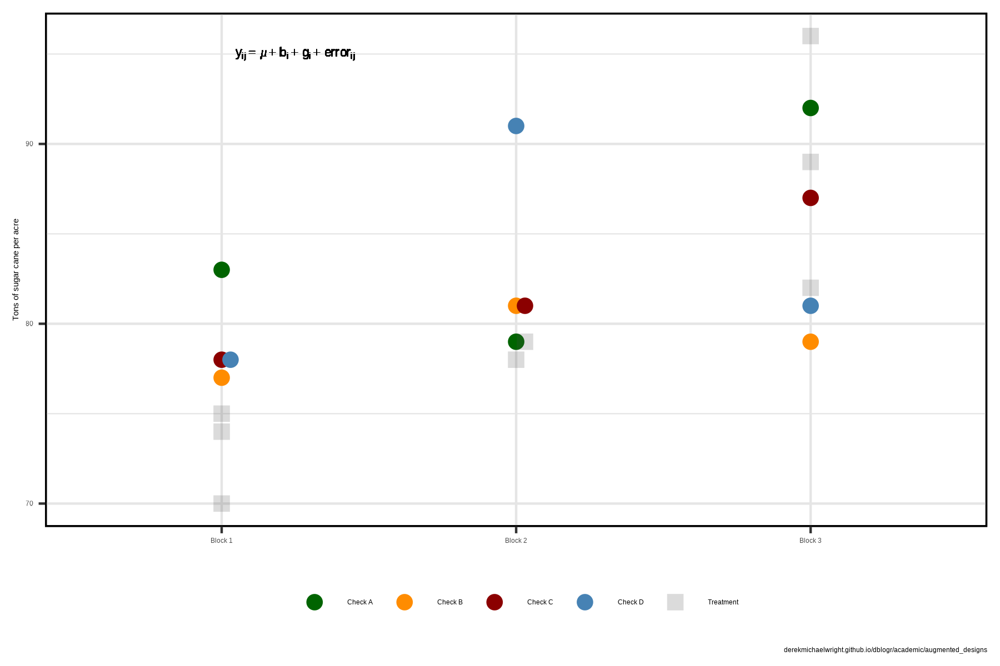

```{r}
# Plot
eq <- TeX("$y_{ij}=\\mu+b_i+g_i+error_{ij}$")
mp <- ggplot(dd, aes(x = Block, y = Yield)) + 
  geom_beeswarm(aes(color = Type, shape = Type, alpha = Type), size = 3) +
  geom_text(x = 1.25, y = 95, label = eq, parse = T, size = 6) + 
  scale_color_manual(name = NULL, values = myColors) +
  scale_shape_manual(name = NULL, values = c(16,16,16,16,15)) +
  scale_alpha_manual(name = NULL, values = c(1,1,1,1,0.2)) +
  ylim(c(70,96)) +
  theme_agData(legend.position = "bottom") +
  labs(y = "Tons of sugar cane per acre", x = NULL,
       caption = "\u00A9 derekmichaelwright.github.io/dblogr/")
ggsave("aug_01_04.png", mp, width = 6, height = 4)
```

$$y_{ij}=\mu+b_i+g_j+error_{ij}$$

where:

- $\mu$ = Mean
- $b_i$ = Block effect
- $g_j$ = Genotype effect
- $error_{ij}$ = random error

## Calculate Block Effects

```{r echo = F, eval = F}
#**!!!under construction!!!**
#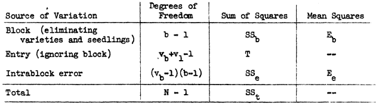
#
#yy <- xc
```

```{r}
# Run ANOVA on checks
fit <- lm(Yield ~ Block + Genotype, data = xc)
aov(fit)
# Coefficients
coef(fit)
# Block effects
blockeffects <- c(coef(fit)[2:3], sum(-as.numeric(coef(fit)[2:3])))
names(blockeffects)[3] <- "Block3"
blockeffects
```

$SS{b}$ = 69.5

$SS{t}$ = 69.5 + 214.75 = 284.25

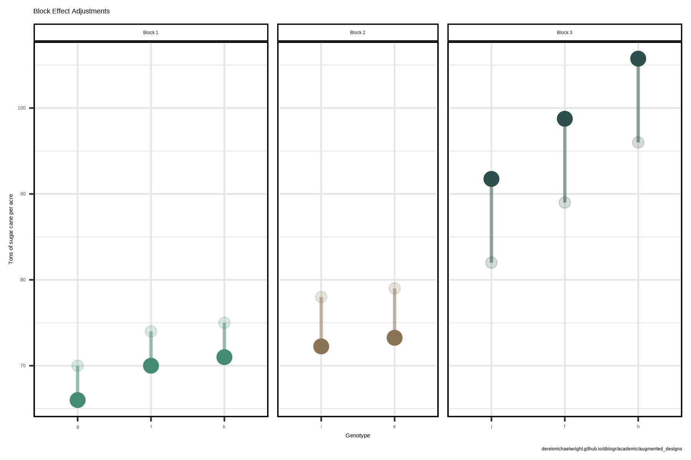

```{r}
# Prep data
myColors <- c("aquamarine4", "burlywood4", "darkslategrey")
blocks <- c("Block 1","Block 2","Block 3")
dd <- dd %>% 
  mutate(BlockEffect = plyr::mapvalues(Block, blocks, blockeffects),
         BlockEffect = as.numeric(as.character(BlockEffect)),
         Adj_Yield = Yield - as.numeric(BlockEffect))
xt <- dd %>% filter(Type == "Treatment") %>% arrange(Yield) %>% 
  mutate(Genotype = factor(Genotype, levels = unique(.$Genotype)))
# Plot
mp <- ggplot(xt, aes(x = Genotype, color = Block)) + 
  geom_point(aes(y = Yield), size = 3, alpha = 0.2) +
  geom_point(aes(y = Adj_Yield), size = 4) + 
  geom_errorbar(aes(ymin = Yield, ymax = Adj_Yield), 
                size = 1, width = 0, alpha = 0.5) +
  facet_grid(. ~ Block, scales = "free_x", space = "free_x") +
  scale_color_manual(values = myColors) +
  theme_agData(legend.position = "none") +
  labs(title = "Block Effect Adjustments", 
       y = "Tons of sugar cane per acre",
       caption = "\u00A9 derekmichaelwright.github.io/dblogr/")
ggsave("aug_01_05.png", mp, width = 6, height = 4)
```

This is important since the block effects can change the interpretation of the results. *E.g.*, lets compare a few genotypes before and after the adjustments.

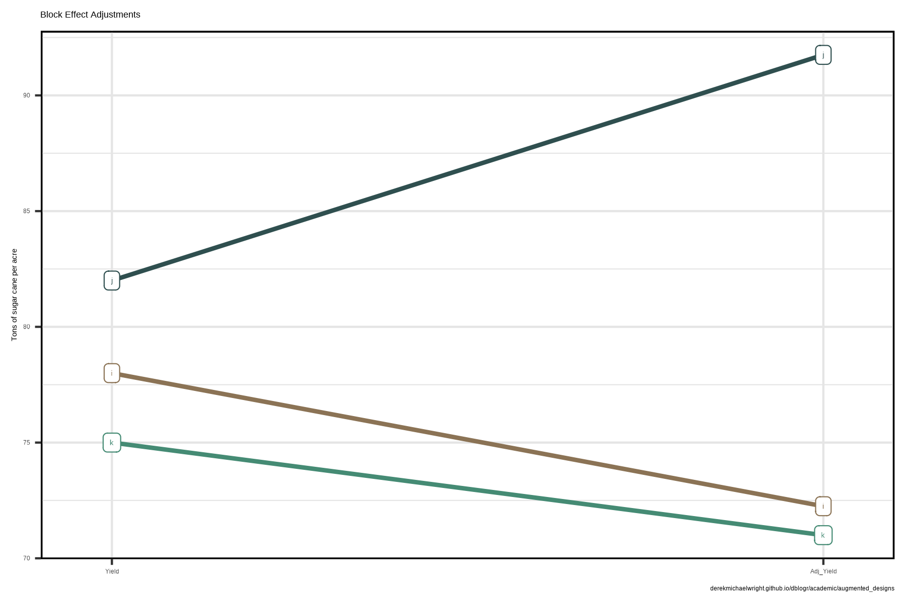

```{r}
# Prep data
xt <- xt %>% 
  filter(Genotype %in% c("i","j","k")) %>%
  select(Genotype, Yield, Adj_Yield) %>%
  gather(Trait, Value, Yield, Adj_Yield) %>% 
  mutate(Trait = factor(Trait, levels = c("Yield", "Adj_Yield")))
# Plot
mp <- ggplot(xt, aes(x = Trait, y = Value, 
                     group = Genotype, color = Genotype)) + 
  geom_line(size = 1) + 
  geom_label(aes(label = Genotype)) +
  scale_color_manual(values = myColors) +
  coord_cartesian(xlim = c(1.5, 1.5)) +
  theme_agData(legend.position = "none") +
  labs(title = "Block Effect Adjustments", 
       y = "Tons of sugar cane per acre", x = NULL,
       caption = "\u00A9 derekmichaelwright.github.io/dblogr/")
ggsave("aug_01_06.png", mp, width = 6, height = 4)
```

---

## augmentedRCBD Package

We can also do this with the `R` package [augmentedRCBD](https://aravind-j.github.io/augmentedRCBD/index.html) which contains a function `augmentedRCBD` that can carry make these adjustments.

```{r}
# devtools::install_github("aravind-j/augmentedRCBD")
library(augmentedRCBD)
out <- augmentedRCBD(block = dd$Block, treatment = dd$Genotype, y = dd$Yield, 
                     checks = c("A", "B", "C", "D"), group = F)
out[[2]] # Adjusted Means
out[[5]] # Block Effects
out[[6]] # Genotype Effects
out[[7]] # Standard Errors 
out[[8]] # Overal Mean
out[[9]] # CV
```

To help better understand, lets do these calculations ourselves.

Block Effects:

$$b_i=\frac{1}{n_c}*\left(\sum{y}_{bi}-\sum{\bar{y}}_c-\sum{y}_{ti}\right)$$
where

- $b_i$ = block effect
- $n_c$ = number of check varieties
- $\sum{y}_{bi}$ = sum of all measurements within block
- $\sum{\bar{y}}_c$ = sum of check means
- $\sum{y}_{ti}$ = measurement for individual treatment within block

Calculate Block 1 effect: $i = 1$

- $n_c = 4$
- $\sum{y}_{b1}=74+78+78+70+83+77+75=535$
- $\sum{\bar{y}}_c=84.67+79.00+82.00+83.33=329$
- $\sum{y}_{t1}=74+70+75=219$
- $b_1=\frac{1}{4}*\left(535-329-219\right)=-3.25$

Calculate Block 2 effect: $i = 2$

- $\sum{y}_{b2}=91+81+79+81+79+78=489$
- $\sum{y}_{t2}=79+78=157$
- $b_2=\frac{1}{4}*\left(489-329-157\right)=0.75$

Calculate Block 3 effect: $i = 3$

- $\sum{y}_{b3}=96+87+92+89+81+79+82=606$
- $\sum{y}_{t3}=96+89+82=267$
- $b_3=\frac{1}{4}*\left(606-329-267\right)=2.5$

```{r}
# Data prep
y_c <- dd %>% filter(Genotype %in% c("A","B","C","D")) %>%
  group_by(Genotype) %>% summarise(Mean = mean(Yield))
y_c
# Block1 effects
y_t1 <- dd$Yield[dd$Block=="Block 1" & dd$Type=="Treatment"]
y_b1 <- dd$Yield[dd$Block=="Block 1"]
b1 <- ( 1/4 ) * ( sum(y_b1, -y_c$Mean, -y_t1) ) 
# Block2 effects
y_t2 <- dd$Yield[dd$Block=="Block 2" & dd$Type=="Treatment"]
y_b2 <- sum(dd$Yield[dd$Block=="Block 2"])
b2 <- ( 1/4 ) * ( sum(y_b2, -y_c$Mean, -y_t2) ) 
# Block3 effects
y_t3 <- dd$Yield[dd$Block=="Block 3" & dd$Type=="Treatment"]
y_b3 <- sum(dd$Yield[dd$Block=="Block 3"])
b3 <- ( 1/4 ) * ( sum(y_b3, -y_c$Mean, -y_t3) ) 
bb <- data.frame(Block = c("Block 1","Block 2","Block 3"),
                 Block_Effect = c(b1, b2, b3))
bb
```

Mean Effect:

$$m=\frac{1}{n_c+n_t}*\left(\sum{y}-(n_b-1)*\sum{\bar{y}}_c-\sum{(n_{ti}*b_i)}\right)$$

- $m$ = mean effect
- $n_c$ = number of check varieties
- $n_t$ = number of treatments (test varieties)
- $\sum{y}$ = sum of all measurements
- $n_b$ = number of blocks
- $\sum{\bar{y}}_c$ = sum of check means
- $n_{ti}$ = number of treatments (test varieties) within block
- $b_i$ = block effect


Calculate mean effect:

- $n_c = 4$
- $n_t = 8$
- $\sum{y}=74+78+78...81+79+82=1630$
- $n_b = 3$
- $\sum{\bar{y}}_c=84.67+79.00+82.00+83.33=329$
- $\sum{(b_i*n_{ti}})=\left(3*(-3.25)+2*(0.75)+3*(2.5)\right)=-0.75$
- $m=\frac{1}{4+8}*\left(1630-(3-1)*329-(-0.75)\right)=81.0625$

```{r}
m <- ( 1/(4+8) ) * ( sum(dd$Yield) - (3 - 1) * sum(y_c$Mean) - sum(3 * b1 + 2 * b2 + 3 * b3) )
m
```

Calculate genotype effects

```{r}
dd <- dd %>% 
  left_join(y_c, by = "Genotype") %>%
  left_join(bb, by = "Block") %>%
  mutate(AdjMean = ifelse(Type == "Treatment", Yield - Block_Effect, Mean),
         Genotype_Effect = AdjMean - m)
```

The sum of block effects should add to zero, along with the sum of check effects and treatment effects

```{r}
sum(bb$Block_Effect)
check_Effects <- unique(dd$Genotype_Effect[dd$Type == "Check"])
treatment_Effects <- dd$Genotype_Effect[dd$Type == "Treatment"]
sum(check_Effects, treatment_Effects)
```

Calculate total sum of squares

$$SS_t=\sum{y}^2-\frac{(\sum{y})^2}{n}=133652-\frac{1630^2}{20}=807$$

```{r}
sum(dd$Yield^2) - (sum(dd$Yield)^2 / 20)
```

$n_g$ = number of genotypes

$$SS_t=1630^2$$

---

# Type II - Modified

Modified augmented design (type II) was developed to account for row and column and heterogeneity. A limitation of the Augmented RCBD method. The Type II design involves the use of a common "control plot" and "subcontrol plots" to attempt to control for row and column and heterogeneity.

```{r}
# Prep data
checks <- data.frame(Check = c("Check1","Check2","Check3"),
                     Name = c("CDC Bethune","Hanley","Macbeth"))
dd <- read.csv("data_augmented_designs_2.csv") %>% 
  arrange(Row, Col) %>%
  rename(MainCheck=Cp..plot.control., SubCheck=Csp..sub.plot.control.) %>%
  mutate(Type = ifelse(MainCheck == 1, "Check1", "Treatment"),
         Type = ifelse(SubCheck == 1, "Check2", Type),
         Type = ifelse(SubCheck == 2, "Check3", Type),
         Type = factor(Type, levels = c("Treatment","Check1","Check2","Check3")),
         Block = paste0(Row, Col),
         Block = plyr::mapvalues(Block, unique(Block), 1:49))
```

## Field Plans

This data set includes includes 8 field trials from 2 locations over 4 years.

```{r}
unique(dd$Environment)
# Plotting function
gg_FieldPlan <- function(env) {
  myColors <- c("white", "darkgreen", "darkorange", "darkred")
  xx <- dd %>% filter(Environment == env)
  mp <- ggplot(xx, aes(x = 1, y = SubPlotNum)) + 
    geom_tile(aes(fill = Type), color = "black", alpha = 0.5) + 
    geom_text(aes(label = Genotype)) +
    facet_grid(Row ~ Col) +
    scale_fill_manual(values = myColors) +
    scale_y_reverse() + 
    theme_agData(axis.text = element_blank(), 
                 axis.ticks = element_blank(),
                 legend.position = "none") +
    labs(title = paste("Field plan -", env), x = NULL, y = NULL,
         caption = "\u00A9 derekmichaelwright.github.io/dblogr/")
  ggsave(paste0("aug_02_01_", env, ".png"), mp, width = 10, height = 10)
}
gg_FieldPlan(env = "M2009") 
gg_FieldPlan(env = "M2010") 
gg_FieldPlan(env = "M2011") 
gg_FieldPlan(env = "M2012")
gg_FieldPlan(env = "S2009") 
gg_FieldPlan(env = "S2010") 
gg_FieldPlan(env = "S2011") 
gg_FieldPlan(env = "S2012")
```

```{r echo = F, eval = T}
#ggsave("featured.png", mp, width = 6, height = 4)
file.copy(from = "aug_02_01_M2009.png", to = "featured.png", overwrite = T)
```

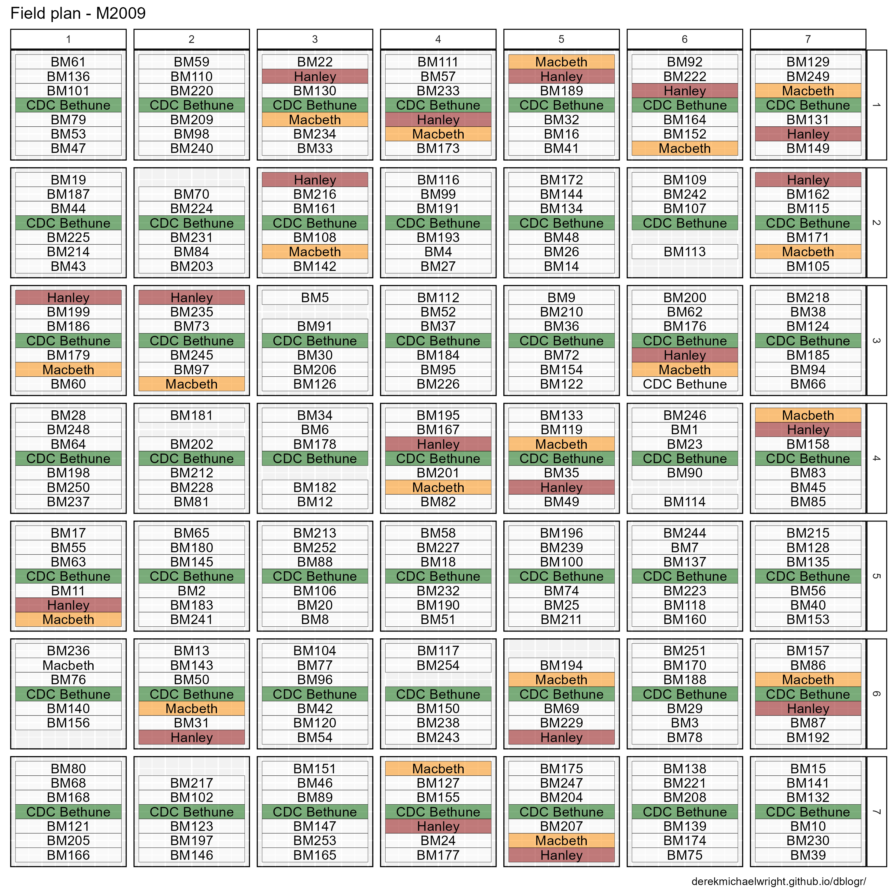

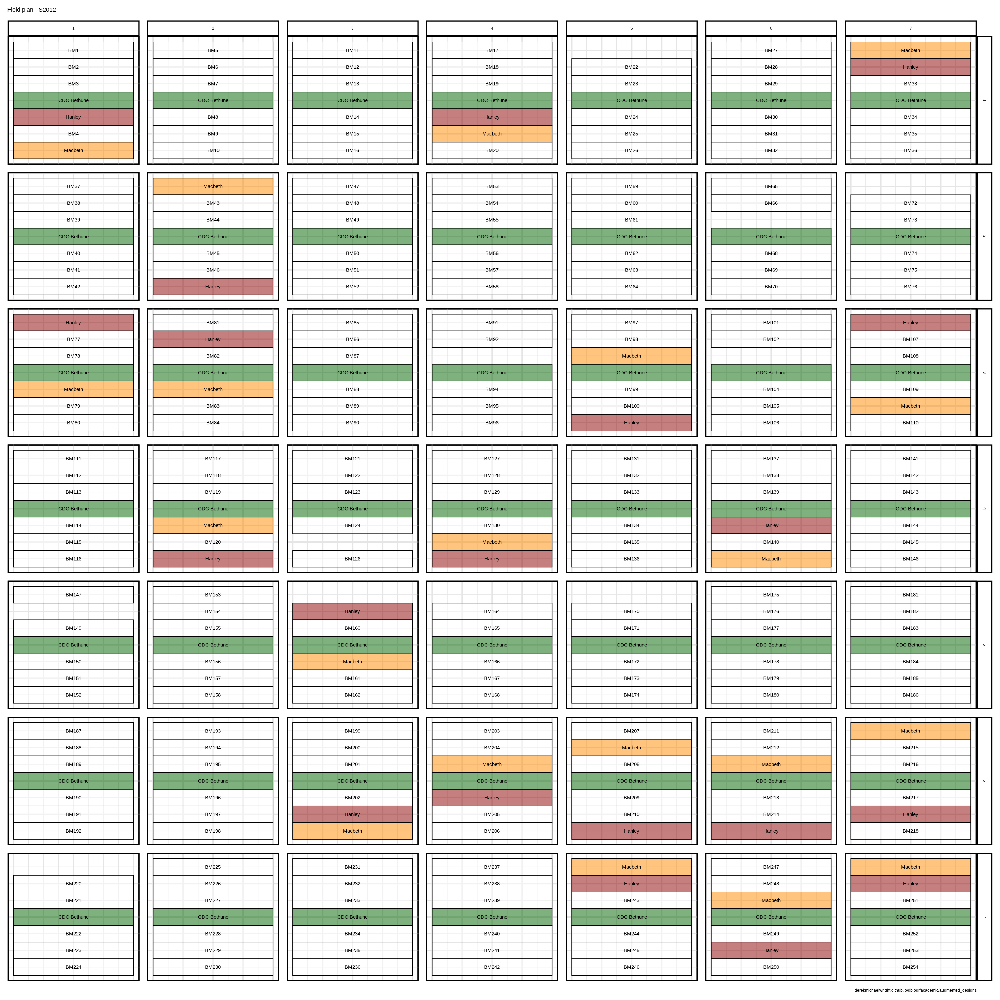

## Method I (adjustment by design structure)

$$Y`_{ij(k)}=Y_{ij(k)}-R_i-C_j$$

Where:

 - $Y`_{ij(k)}$ = adjusted value of the $k$th test line in the $ij$th block
 - $Y_{ij(k)}$ = observed value of the $k$th test line in the $ij$th block  
 - $X_{ij(A)}$ = observed value for the control plot in the *ij*th block (CDC Bethune)
 - $R_i=\frac{\sum^{c}_{j=1}X_{ij(A)}}{c}-\bar{X}_A$
 - $C_j=\frac{\sum^{r}_{ij}X_{ij(A)}}{r}-\bar{X}_A$
 - $\bar{X}_A=\frac{\sum_i\sum_jX_{ij(A)}}{(r*c)}$

**or** 

$$Y`_{ij(k)}=Y_{ij(k)}-(\bar{X}_i-\bar{X})-(\bar{X}_j-\bar{X})$$
where:

- $Y`_{ij(k)}$ = Adjusted mean
- $Y_{ij(k)}$ = Raw data of plot in row $_r$ and column $_c$
- $\bar{X}$ = Mean of all check1
- $\bar{X}_i$ = Mean of check1 in row $_i$
- $\bar{X}_j$ = Mean of check1 in column $_j$

```{r}
method_I <- function(env = "M2009") {
  traits <- c("Yield", "Oil.content", "Iodine", "Linolenic")
  xx <- dd %>% 
    filter(Environment == env) %>%
    gather(Trait, Value, traits) %>%
    mutate(AdjustedValue = NA,
           BlockEffect = NA )
  # Adjust Values
  i<-1
  for(i in 1:nrow(xx)) {
    x1 <- xx %>% filter(MainCheck == 1, Trait == xx$Trait[i])
    x1_bar <- mean(x1$Value, na.rm = T)
    Ri <- mean(x1$Value[x1$Row==xx$Row[i]]) - x1_bar
    Cj <- mean(x1$Value[x1$Col==xx$Col[i]]) - x1_bar
    xx$AdjustedValue[i] <- xx$Value[i] - Ri - Cj
    xx$BlockEffect[i] <- Ri + Cj
  }
  # Plot
  i <- "Yield"
  for(i in traits) {
    xi <- xx %>% filter(Trait == i)
    myMin1 <- min(xi$Value, na.rm = T)
    myMax1 <- max(xi$Value, na.rm = T)
    xA <- xi %>% filter(MainCheck == 1) 
    myMin2 <- min(xA$Value, na.rm = T)
    myMax2 <- max(xA$Value, na.rm = T)
    myColors <- c("black", "darkgreen", "darkorange", "darkred")
    xc <- xi %>% filter(MainCheck == 1)
    mp1 <- ggplot(xc, aes(x = Col, y = Row, fill = Value)) + 
      geom_tile() +
      geom_text(aes(label = round(Value, 1))) +
      scale_fill_continuous(name = NULL, low = "white", high = "darkgreen") +
      scale_x_continuous(breaks = 1:7) +
      scale_y_continuous(breaks = 1:7) +
      theme_agData(legend.position = "none") +
      labs(title = paste(env, "- Main Check", i))
    mp2 <- ggplot(xc, aes(x = Col, y = Row, fill = BlockEffect)) + 
      geom_tile() +
      geom_text(aes(label = round(BlockEffect, 3))) +
      scale_fill_continuous(name = NULL, low = "white", high = "darkgreen") +
      scale_x_continuous(breaks = 1:7) +
      scale_y_continuous(breaks = 1:7) +
      theme_agData(legend.position = "none") +
      labs(title = "Block Effects")
    mp3 <- ggplot(xi, aes(x = Value, y = AdjustedValue, 
                          color = Type, size = Type)) +
      geom_point(alpha = 0.7) +
      geom_abline(alpha = 0.5) +
      scale_color_manual(name = NULL, values = myColors) +
      scale_size_manual(name = NULL, values = c(1,2,2,2)) +
      scale_x_continuous(limits = c(min(myMin1,myMin2), max(myMax1, myMax2))) +
      scale_y_continuous(limits = c(min(myMin1,myMin2), max(myMax1, myMax2))) +
      theme_agData(legend.position = "none") +
      labs(x = i, y = paste("Adjusted", i),
           title = paste("Main Check Range =", myMin2, "-", myMax2))
    xi <- xi %>% rename(RawValue=Value) %>% 
      gather(Trait, Value, RawValue, AdjustedValue) %>%
      mutate(Trait = factor(Trait, levels = c("RawValue", "AdjustedValue")))
    mp4 <- ggplot(xi, aes(x = Type, y = Value, color = Type, shape = Trait)) +
      geom_quasirandom(dodge.width = 0.8) +
      scale_color_manual(name = NULL, values = myColors) +
      scale_shape_manual(name = NULL, values = c(16,17)) +
      theme_agData(legend.position = "none", legend.box="vertical") +
      labs(y = i, x = "unadjusted vs adjusted",
           title = paste("Tratment Range =", myMin1, "-", myMax1))
    mp <- ggarrange(mp1, mp2, mp3, mp4, ncol = 2, nrow = 2)
    ggsave(paste0("aug_02_02_", i, "_", env, "_MI.png"), mp, 
           width = 10, height = 8)
    }
  # Output
  xx
}
M2009_MI <- method_I(env = "M2009")
#M2010_MI <- method_I(env = "M2010")
#M2011_MI <- method_I(env = "M2011")
#M2012_MI <- method_I(env = "M2012")
```

## Method III (adjustment by regression)

Method III

$$Y`_{ij(k)}=Y_{ij(k)}-b(X_{ij(A)}-\bar{X}_A)$$ 

where

 - $Y_{ij(k)}$ = observed value of the $k$th test line in the $ij$th block  
 - $X_{ij(A)}$ = the observed value for the control plot in the $ij$th block (CDC Bethune)
 - $b$ = regression coefficient of the mean of the control subplots by the main control plot
 - $$


$$m_a=y_{rc}-slope*(\bar{c}_r-\bar{c})-(\bar{c}_c-\bar{c})=y_{rc}-\bar{c}_r-\bar{c}_c-2\bar{c}$$

```{r}
method_III <- function(env = "M2009") {
  traits <- c("Yield", "Oil.content", "Iodine", "Linolenic")
  xx <- dd %>% 
    filter(Environment == env) %>%
    gather(Trait, Value, traits) %>%
    mutate(AdjustedValue = NA,
           BlockEffect = NA )
  # Adjust Values
  i<-1
  for(i in 1:nrow(xx)) {
    x2 <- xx %>% filter(MainCheck == 1, Trait == xx$Trait[i]) %>%
      select(Row, Col, Type, Value) %>%
      spread(Type, Value)
    x3 <- xx %>% filter(SubCheck %in% 1:2, Trait == xx$Trait[i]) %>%
      select(Row, Col, Type, Value) %>%
      spread(Type, Value) 
    x123 <- left_join(x2, x3, by = c("Row","Col")) %>%
      filter(!is.na(Check2), !is.na(Check2)) %>%
      mutate(Check23 = (Check2 + Check3) / 2)
    bb <- as.vector(coefficients(lm(Check1 ~ Check23, data = x123))[2])
    #
    x1_bar <- mean(x123$Check1, na.rm = T) 
    # not the mean of all main checks, but only ones with subchecks in the block
    x1ij <- xx %>% 
      filter(Row == xx$Row[i], Col == xx$Col[i], 
             Type == "Check1", Trait == xx$Trait[i]) %>%
      pull(Value)
    xx$AdjustedValue[i] <- xx$Value[i] - bb * (x1ij - x1_bar)
    xx$BlockEffect[i] <- bb * (x1ij - x1_bar)
    #
    #mp <- ggplot(x123, aes(y = Check1, x = Check23)) +
    #  geom_point() + geom_smooth(method = "lm", se = F)
    #ggsave(paste0("aug_02_03_MIII_", xx$Trait[i], "_", env, ".png"), mp, width = 6, height = 4)
  }
  # Plot
  i <- "Yield"
  for(i in traits) {
    xi <- xx %>% filter(Trait == i)
    myMin1 <- min(xi$Value, na.rm = T)
    myMax1 <- max(xi$Value, na.rm = T)
    xA <- xi %>% filter(MainCheck == 1) 
    myMin2 <- min(xA$Value, na.rm = T)
    myMax2 <- max(xA$Value, na.rm = T)
    myColors <- c("black", "darkgreen", "darkorange", "darkred")
    xc <- xi %>% filter(MainCheck == 1)
    mp1 <- ggplot(xc, aes(x = Col, y = Row, fill = Value)) + 
      geom_tile() +
      geom_text(aes(label = round(Value, 1))) +
      scale_fill_continuous(name = NULL, low = "white", high = "darkgreen") +
      scale_x_continuous(breaks = 1:7) +
      scale_y_continuous(breaks = 1:7) +
      theme_agData(legend.position = "none") +
      labs(title = paste(env, "- Main Check", i))
    mp2 <- ggplot(xc, aes(x = Col, y = Row, fill = BlockEffect)) + 
      geom_tile() +
      geom_text(aes(label = round(BlockEffect, 3))) +
      scale_fill_continuous(name = NULL, low = "white", high = "darkgreen") +
      scale_x_continuous(breaks = 1:7) +
      scale_y_continuous(breaks = 1:7) +
      theme_agData(legend.position = "none") +
      labs(title = "Block Effects")
    mp3 <- ggplot(xi, aes(x = Value, y = AdjustedValue, 
                          color = Type, size = Type)) +
      geom_point(alpha = 0.7) +
      geom_abline(alpha = 0.5) +
      scale_color_manual(name = NULL, values = myColors) +
      scale_size_manual(name = NULL, values = c(1,2,2,2)) +
      scale_x_continuous(limits = c(min(myMin1,myMin2), max(myMax1, myMax2))) +
      scale_y_continuous(limits = c(min(myMin1,myMin2), max(myMax1, myMax2))) +
      theme_agData(legend.position = "none") +
      labs(x = i, y = paste("Adjusted", i),
           title = paste("Main Check Range =", myMin2, "-", myMax2))
    xi <- xi %>% rename(RawValue=Value) %>% 
      gather(Trait, Value, RawValue, AdjustedValue) %>%
      mutate(Trait = factor(Trait, levels = c("RawValue", "AdjustedValue")))
    mp4 <- ggplot(xi, aes(x = Type, y = Value, color = Type, shape = Trait)) +
      geom_quasirandom(dodge.width = 0.8) +
      scale_color_manual(name = NULL, values = myColors) +
      scale_shape_manual(name = NULL, values = c(16,17)) +
      theme_agData(legend.position = "none", legend.box="vertical") +
      labs(y = i, x = "unadjusted vs adjusted",
           title = paste("Tratment Range =", myMin1, "-", myMax1))
    mp <- ggarrange(mp1, mp2, mp3, mp4, ncol = 2, nrow = 2)
    ggsave(paste0("aug_02_02_", i, "_", env, "_MIII.png"), mp, 
           width = 10, height = 8)
    }
  # Output
  xx
}
M2009_MIII <- method_III(env = "M2009")
#M2010_MIII <- method_III(env = "M2010")
#M2011_MIII <- method_III(env = "M2011")
#M2012_MIII <- method_III(env = "M2012")
```

---

## Adjustments

### Yield

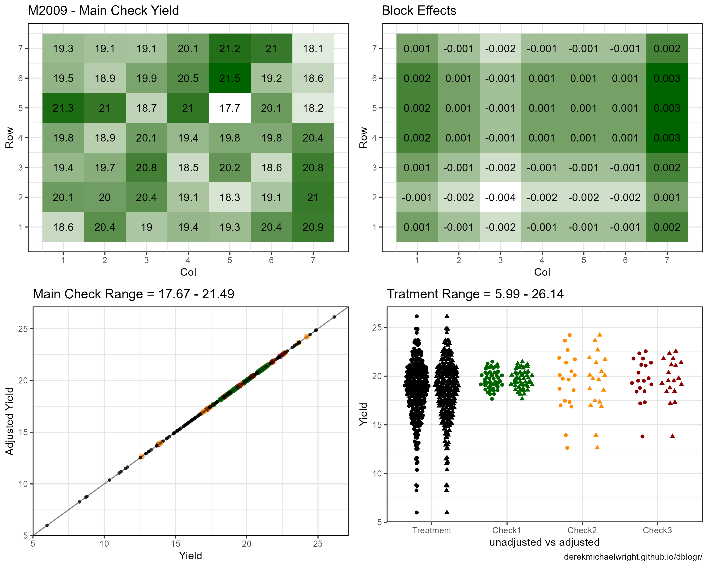

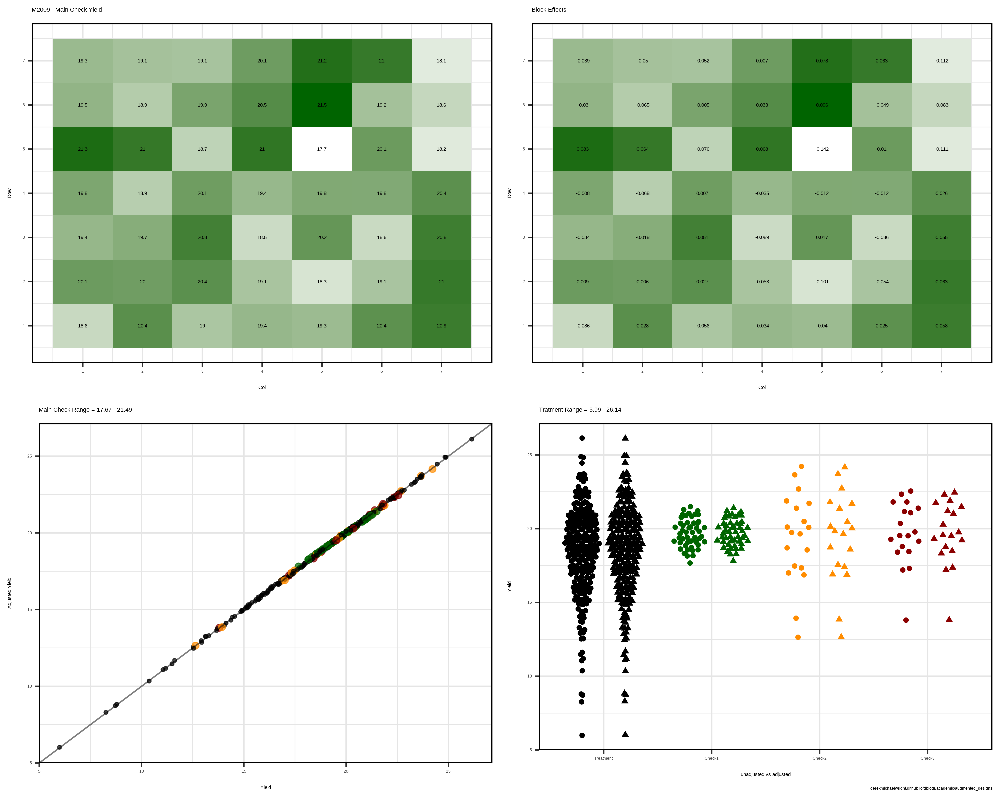

---

### Oil Content

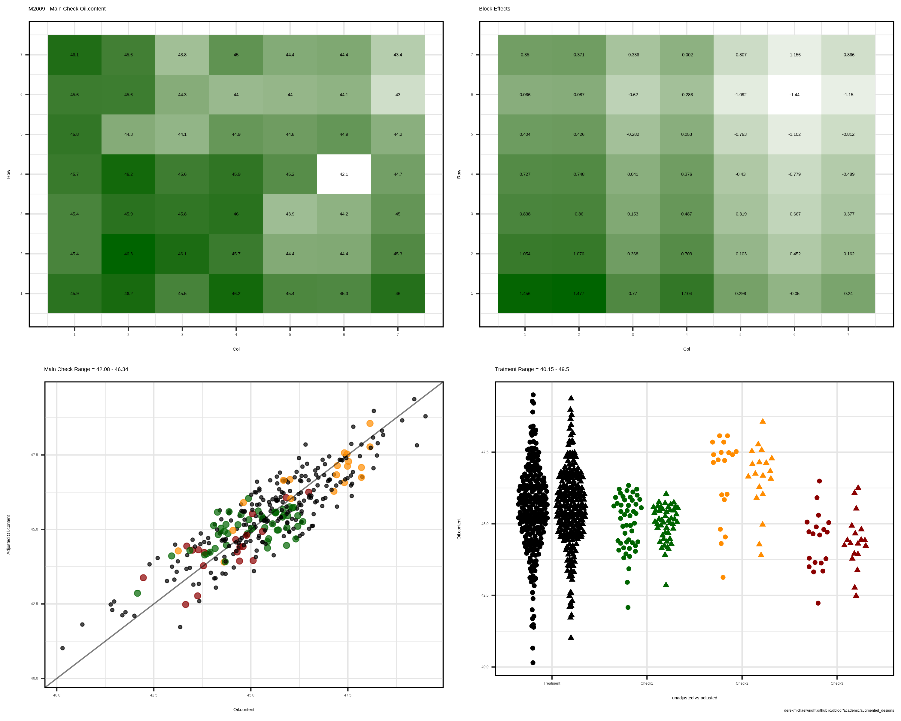

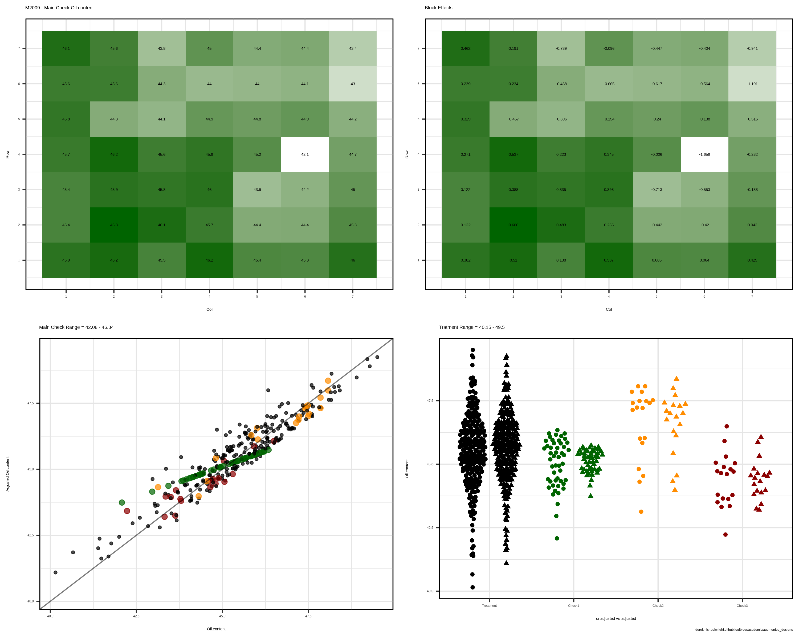

---

### Iodine

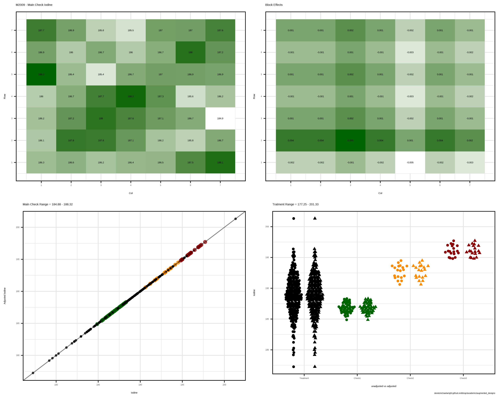

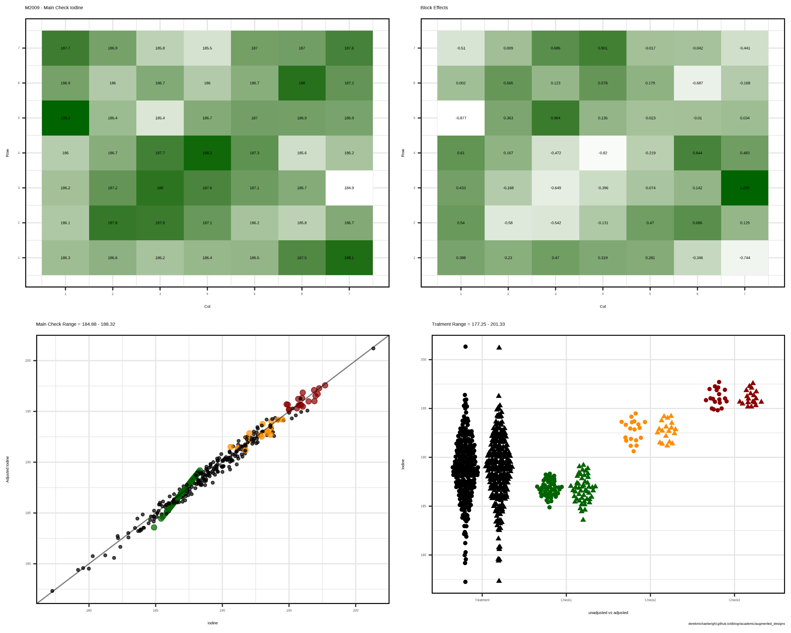

---

### Linolenic

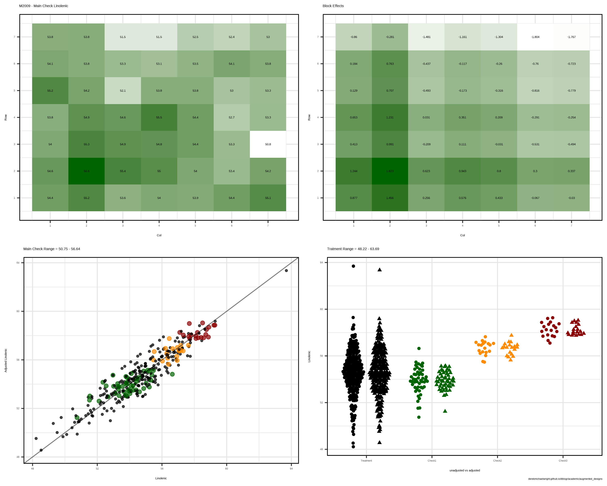

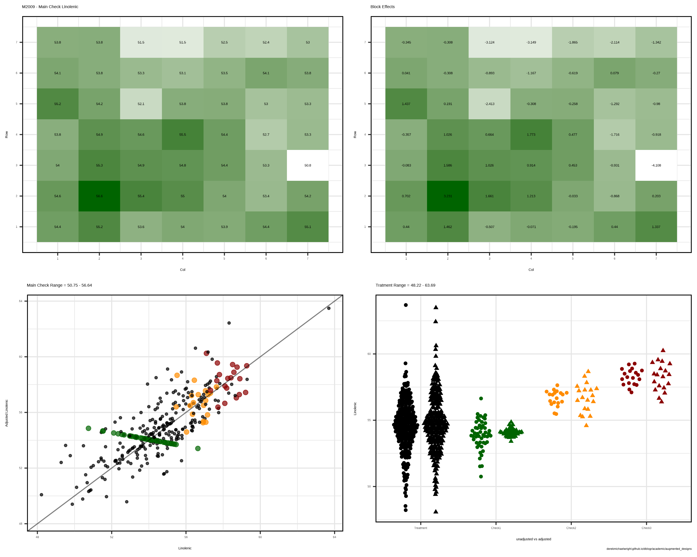

---

# Relative Efficiency

$$RE=\frac{IWPE_{unadj}}{IWPE_{adj}}*100$$

Where:

 - $RE=Relative Efficiency$
 - $IWPE_{unadj}=IntraWholePlotError_{unadjusted}=\sum^{c}_{j=1}X_{ij(A)}$
 - $IWPE_{adj}=IntraWholePlotError_{adjusted}=\sum^{c}_{j=1}X_{ij(A)}$

```{r}
#
RE <- function(xx = M2009_MI, myEnv = "M2009", myTrait = "Yield") {
  xx <- xx %>% filter(Environment == myEnv, Trait == myTrait)
  sc <- unique(xx$Genotype[xx$SubCheck != 0])
  i <- 1 #"Hanley"
  myRE1 <- NULL
  myRE2 <- NULL
  for(i in 1:length(sc)) {
    xi <- xx %>% filter(Genotype == sc[i])
    myRE1[i] <- sum((xi$Value - mean(xi$Value))^2) 
    myRE2[i] <- sum((xi$AdjustedValue - mean(xi$AdjustedValue))^2) 
  }
  myRE1 <- sum(myRE1) / (sum(xx$Genotype%in%sc) - length(sc))
  myRE2 <- sum(myRE2) / (sum(xx$Genotype%in%sc) - length(sc))
  100 * myRE1 / myRE2
}
#
RE(xx = M2009_MI,   myEnv = "M2009", myTrait = "Yield")
RE(xx = M2009_MIII, myEnv = "M2009", myTrait = "Yield")
#
RE(xx = M2009_MI,   myEnv = "M2009", myTrait = "Oil.content")
RE(xx = M2009_MIII, myEnv = "M2009", myTrait = "Oil.content")
#
RE(xx = M2009_MI,   myEnv = "M2009", myTrait = "Iodine")
RE(xx = M2009_MIII, myEnv = "M2009", myTrait = "Iodine")
#
RE(xx = M2009_MI,   myEnv = "M2009", myTrait = "Linolenic")
RE(xx = M2009_MIII, myEnv = "M2009", myTrait = "Linolenic")
```

It is important to note that the F-tests from the ANOVA results apply to Row and Column effects, which can be accounted for by Method 1 adjustments. The Row and Column effects generally are best at accounting for gradients that stretch across a substantial portion of the field.

Method 3 does not necessarily require gradients or any other type of pattern in the field to account for field effects; it only requires that the secondary checks are affected by the field in a way similar to how the primary checks are affected.

The type-2 modified augmented design intentionally makes the final selection of an adjustment method to be somewhat subjective, based on the user’s understanding of the biological system. Evidence on the appropriateness of each method includes:
- Relative efficiency of Method 1 vs Method 3
- ANOVA results for Row and Column effects
- Biological meaning of analysis parameters - I once had a relative efficiency of 112% for Method 3 but a negative Method 3 regression coefficient
- Heat maps or other semi-quantitative/qualitative evaluations of field effects
- Knowledge of the field or fieldbook notes from the experiment
- Knowledge of the lines used as checks - e.g., you may have more confidence in a marginal Method 1 relative efficiency when you know that your primary check used to calculate Method 1 adjustments is much less sensitive to field effects than most of the other lines in the experiment.

---

```{r eval = F, echo = F}
x1 <- dd %>% filter(Environment == "M2009")
#
xx <- x1
trait <- "Yield"
MAD2_M1 <- function(xx, trait) {
  yy <- rep(NA, nrow(xx))
  xc <- xx %>% filter(Type == "Check1")
  for(i in 1:nrow(xx)) {
    yrc <- xx[i,trait]
    c_m <- mean(xc %>% pull(trait), na.rm = T)
    c_r <- mean(xc %>% filter(Row == xx%>%slice(i)%>%pull("Row")) %>% pull(trait), na.rm = T)
    c_c <- mean(xc %>% filter(Col == xx%>%slice(i)%>%pull("Col")) %>% pull(trait), na.rm = T)
    #yy[i] <- yrc - (c_r - c_m) - (c_c - c_m)
    yy[i] <- yrc - c_r - c_c - (2 * c_m)
  }
  yy
}
xx <- xx %>% mutate(Yield_adj_M1 = MAD2_M1(., "Yield"))
ggplot(xx, aes(x = Yield, y = Yield_adj_M1)) + geom_point()
```

## Correlation Plots

```{r}
gg_Corr <- function(env = "M2009") {
  # Prep data
  xx <- dd %>% filter(Environment == env) %>%
    mutate(Genotype = ifelse(MainCheck > 0 | SubCheck > 0, Genotype, "Treatment"))
  myColors <- c("darkgreen", "darkorange", "darkred", alpha("black",0.3))
  # Plot
  mp <- ggpairs(xx, columns = 13:16, aes(color = Genotype)) +
    scale_color_manual(values = myColors) +
    scale_fill_manual(values = alpha(myColors,0.5)) +
    theme_agData()
  ggsave(paste0("aug_03_01_", env, ".png"), mp, width = 8, height = 6)
}
gg_Corr(env = "M2009")
gg_Corr(env = "M2010")
gg_Corr(env = "M2011")
gg_Corr(env = "M2012")
gg_Corr(env = "S2009")
gg_Corr(env = "S2010")
gg_Corr(env = "S2011")
gg_Corr(env = "S2012")
```

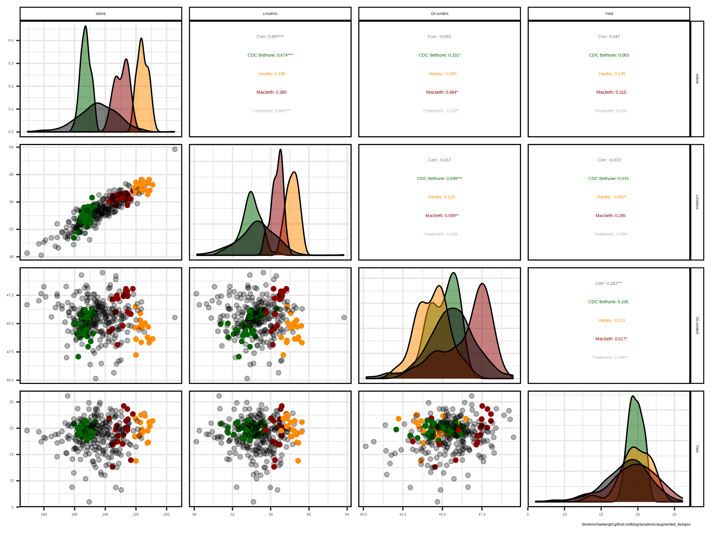

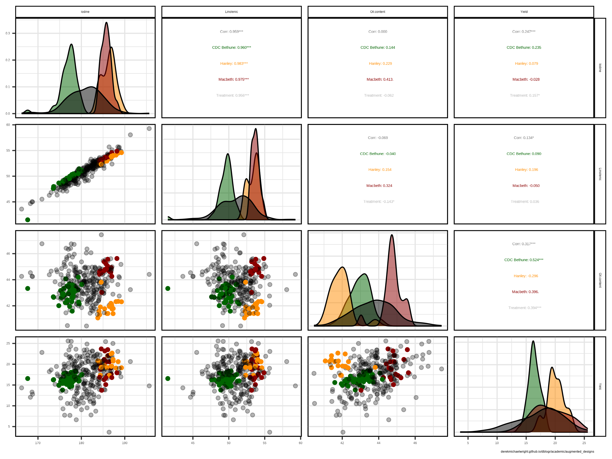

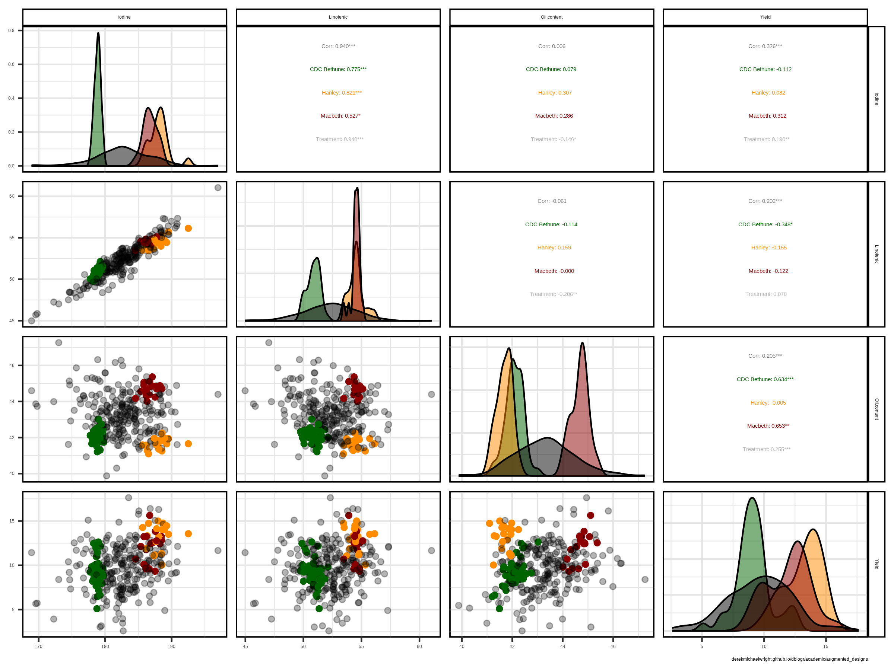

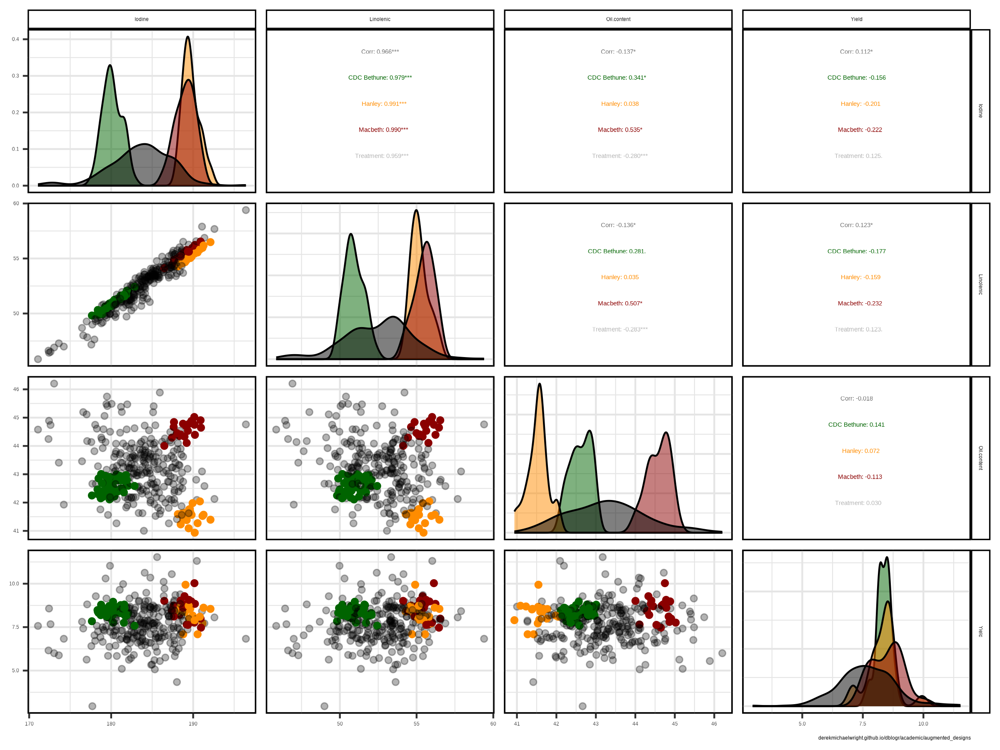

---

```{r echo = F, eval = F}
#
x1 <- dd %>% filter(Environment == "M2009")
length(4001:4343)
7*7*7
x2 <- x1 %>% filter(Type == "Check1") %>% arrange(Yield) 
x2 <- x1 %>% mutate(Block = factor(Block, levels = unique(x2$Block)))
#x2 <- xx %>% filter(Environment == "M2009", Type == "Check") %>% 
#  mutate(Block = factor(Block, levels = x2$Block))
mp <- ggplot(x2, aes(x = Block, y = Yield, color = Type, pch = Type)) + 
  geom_beeswarm() +
  scale_color_manual(values = c("darkgreen", "darkred","darkblue", "Black"))
ggsave("test4.png", mp, width = 15, height = 6)
x3 <- x2 %>% filter(Type != "Treatment")
mp <- ggplot(x2, aes(x = Block, y = Yield, color = Type, pch = Type)) + 
  geom_beeswarm() +
  geom_line(data = x3, aes(group = Type)) +
  scale_color_manual(values = c("darkgreen", "darkred","darkblue", "Black"))
ggsave("test5.png", mp, width = 15, height = 6)
```
