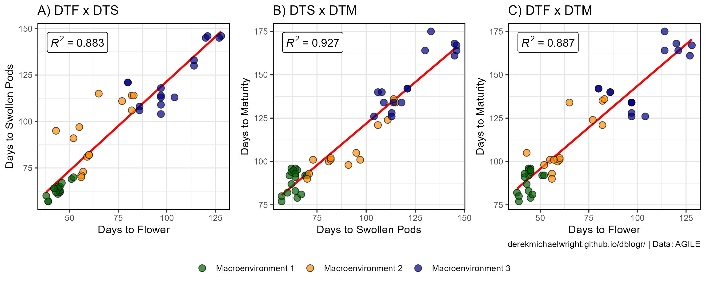
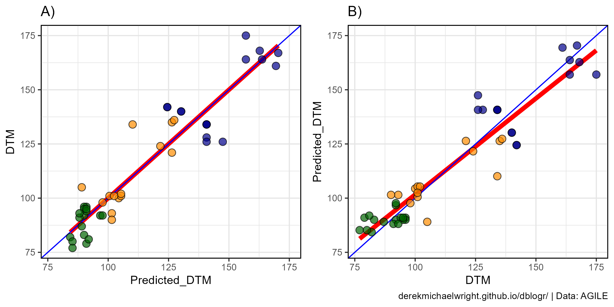
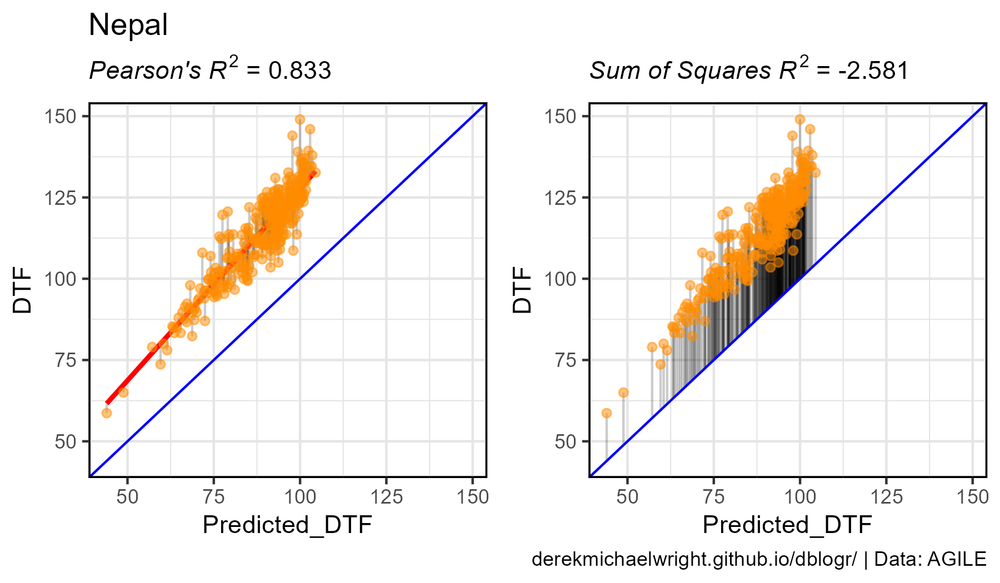
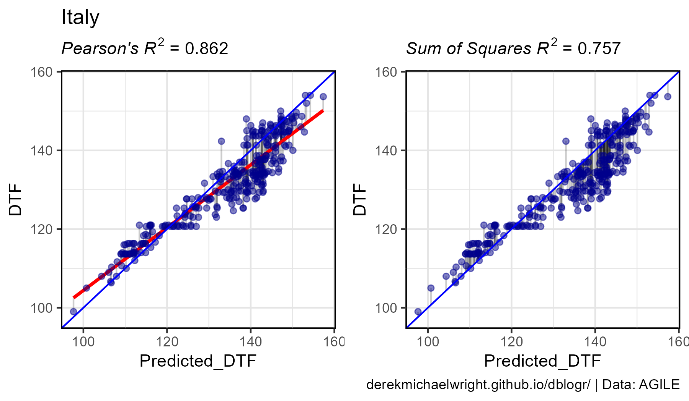
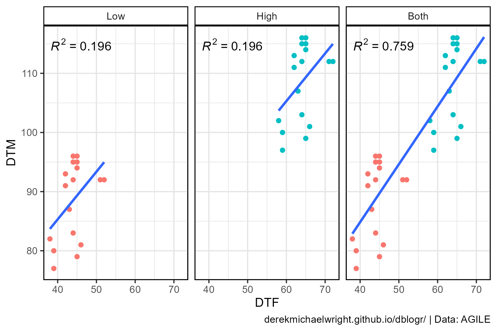
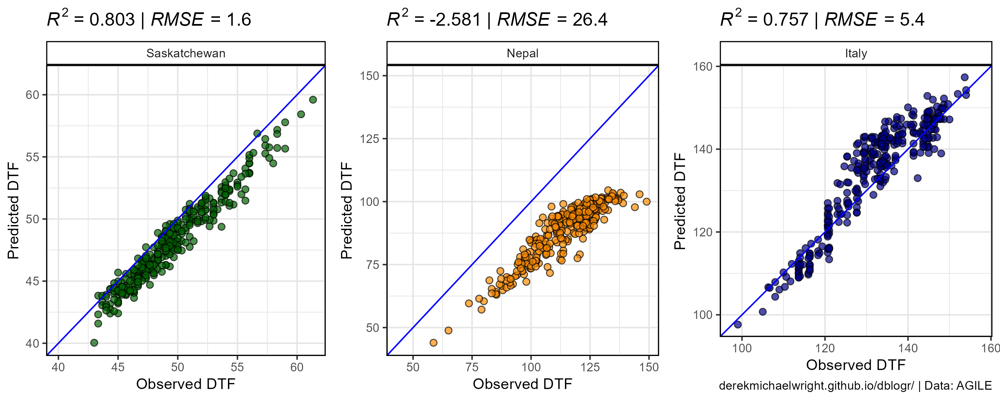
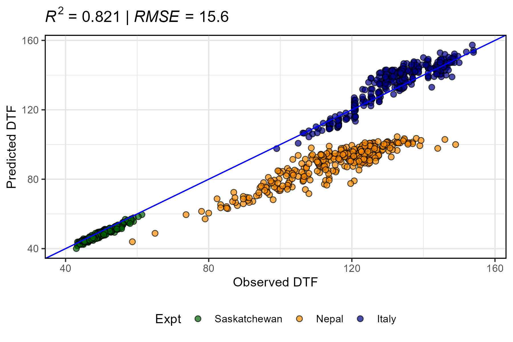
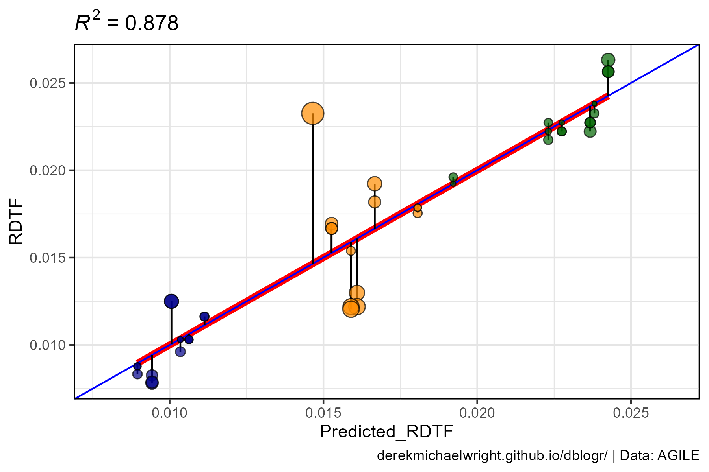

```{r setup, include=FALSE}
knitr::opts_chunk$set(echo = T, message = F, warning = F)
```

---

# Introduction

The correlation coefficient (***R^2^***), which indicates the proportion of variation explained by an independent variable or model, can be misused/incorectly used when evaluating predictive models. Depending on the situation, different calculations for *R^2^* can be used to convey different meanings. The goal of this vignette is to help clear up this confusion, with a few different examples.

```{r}
# devtools::install_github("derekmichaelwright/agData")
library(agData)
library(readxl)  # read_xlsx()
library(ggpmisc) # stat_poly_eq()
```

---

# Data

`r shiny::icon("save")` [data_correlation_coefficients.xlsx](data_correlation_coefficients.xlsx)

## Dataset 1

- `Entry`: 1 Lentil Genotype
- `Expt`: 18 Site-years
- `MacroEnv`: 3 Macroenvironments
- `Rep`: 1-3 Reps per site-year
- `T_mean`: Mean temperature
- `P_mean`: Mean photoperiod
- `DTF`: Days from sowing to flower
- `DTM`: Days from sowing to swollen pod
- `DTM`: Days from sowing to maturity
- `RDTF`: Rate of progress towards flowering = `1 / DTF`

```{r}
# Prep data
d1 <- read_xlsx("data_correlation_coefficients.xlsx", "data_1") %>%
  mutate(RDTF = 1 / DTF) # Rate of progress towards flowering
# Preview data
as_tibble(d1)
```

## Dataset 2

- `Entry`: 324 Genotypes
- `Expt`: 3 Site-years
- `MacroEnv`: 3 Macroenvironments
- `DTF`: Days from sowing to flower
- `Predicted_DTF`: Predicted values of DTF

```{r}
# Prep data
d2 <- read_xlsx("data_correlation_coefficients.xlsx", "data_2") %>%
  mutate(Expt = factor(Expt, levels = c("Saskatchewan", "Nepal", "Italy")))
# Preview data
as_tibble(d2)
```

---

# Correlation Between Two Traits

The most obvious correlation is that of two traits. For example, since `DTF`, `DTS`, and `DTM` are all phenology traits, we can assume they will be highly correlated. Lets plot this out and see how it looks.



**Interpretations**: 

- 88.3% of variation in `DTS` is explained by `DTF`.
- 92.7% of variation in `DTM` is explained by `DTS`.
- 88.7% of variation in `DTM` is explained by `DTF`.

```{r}
# Prep data
myCaption <- "www.dblogr.com/ or derekmichaelwright.github.io/dblogr/ | Data: AGILE"
myColors <- c("darkgreen","darkorange","darkblue")
# Remove any rows with missing data
d1 <- d1 %>% filter(!is.na(DTF), !is.na(DTS), !is.na(DTM))
# DTF - DTS
mp1 <- ggplot(d1, aes(x = DTF, y = DTS)) + 
  geom_smooth(method = "lm", se = F, color = "red") + 
  geom_point(aes(fill = MacroEnv), size = 3, pch = 21, alpha = 0.7) + 
  scale_fill_manual(name = NULL, values = myColors) +
  stat_poly_eq(aes(label = ..rr.label..), rr.digits = 3, size = 4,
               formula = y ~ x, parse = T, geom = "label_npc") +
  theme_agData() +
  labs(title = "A) DTF x DTS", x = "Days to Flower", y = "Days to Swollen Pods")
# DTS - DTM
mp2 <- ggplot(d1, aes(x = DTS, y = DTM)) + 
  geom_smooth(method = "lm", se = F, color = "red") + 
  geom_point(aes(fill = MacroEnv), size = 3, pch = 21, alpha = 0.7) + 
  scale_fill_manual(name = NULL, values = myColors) +
  stat_poly_eq(aes(label = ..rr.label..), rr.digits = 3, size = 4,
               formula = y ~ x, parse = T, geom = "label_npc") +
  theme_agData() +
  labs(title = "B) DTS x DTM", x = "Days to Swollen Pods", y = "Days to Maturity")
# DTF - DTM
mp3 <- ggplot(d1, aes(x = DTF, y = DTM)) + 
  geom_smooth(method = "lm", se = F, color = "red") + 
  geom_point(aes(fill = MacroEnv), size = 3, pch = 21, alpha = 0.7) + 
  scale_fill_manual(name = NULL, values = myColors) +
  stat_poly_eq(aes(label = ..rr.label..), rr.digits = 3, size = 4,
               formula = y ~ x, parse = T, geom = "label_npc") +
  theme_agData() +
  labs(title = "C) DTF x DTM", x = "Days to Flower", y = "Days to Maturity",
       caption = myCaption)
# Append and Save
mp <- ggarrange(mp1, mp2, mp3, nrow = 1, align = "h",
                common.legend = T, legend = "bottom")
ggsave("correlation_coefficients_01.png", mp, width = 10, height = 4, bg = "white")
```

---

# Calculating *R^2^*

## *Pearson's R^2^*

*R^2^* can be calculated using the `cor` function which has `method = "pearson"` as the default.

```{r}
cor(x = d1$DTF, y = d1$DTS, method = "pearson")^2
cor(x = d1$DTS, y = d1$DTM, method = "pearson")^2
cor(x = d1$DTF, y = d1$DTM, method = "pearson")^2
```

*R^2^* can also be manually calculated using the following formula to calculate *Pearson's r*:

$r=\frac{n\sum xy - (\sum x)(\sum y)}{\sqrt{(n\sum x^2 - (\sum x)^2)(n\sum y^2 - (\sum y)^2)}}$

where:

- $x$ = Independant variable
- $y$ = Dependant Variable
- $n$ = Number of observations

and

$R^2=r^2$

Now lets manually create a function to calculate *R^2^* using *Pearson's r*.

```{r}
pearsonsR2 <- function(x, y) {
  n <- length(x)
  r_numerator <- n * sum(x*y) - sum(x) * sum(y)
  r_denominator <- sqrt((n * sum(x^2) - sum(x)^2) * (n * sum(y^2) - sum(y)^2))
  r <- r_numerator / r_denominator
  r^2
}
pearsonsR2(x = d1$DTF, y = d1$DTS)
pearsonsR2(x = d1$DTS, y = d1$DTM)
pearsonsR2(x = d1$DTF, y = d1$DTM)
```

Switching the `x` and `y` variables gives the same result.

```{r}
pearsonsR2(x = d1$DTM, y = d1$DTF)
cor(x = d1$DTM, y = d1$DTF, method = "pearson")^2
```

Note that the `stat_poly_eq` function included the option `formula = y ~ x`, which creates a linear regression of the `x` and `y` variables. Our *R^2^* is a measure how how well the `DTM` data matches the *predictions of DTM* based on our `DTF` data and linear regression model.

```{r}
# Perform linear regression
myModel <- lm(DTM ~ DTF, data = d1)
summary(myModel)
summary(myModel)$r.squared
# Get predicted values and residual values from model
d1 <- d1 %>% mutate(Predicted_DTM = predict(myModel), 
                    Residuals_DTM = residuals(myModel) )
```

We can also calculate *R^2^* by replacing `DTF` with with the `Predicted_DTM` values from our linear regression model. 

```{r}
pearsonsR2(x = d1$Predicted_DTM, y = d1$DTM)
```

Again, switching the x and y variables gives the same result.

```{r}
pearsonsR2(x = d1$DTM, y = d1$Predicted_DTM)
```

## *Sum of Squares R^2^*

If you have *Observed* and *Predicted* values, *R^2^* can also be calculated using the *Sum of Squares* formula:

$R^2=1-\frac{SS_{residuals}}{SS_{total}}=1-\frac{\sum (o-p)^2}{\sum (o-\bar{o})^2}$ 

where:

- $o$ = Observed value
- $p$ = Predicted value
- $\bar{o}=\frac{\sum o}{n}$ = Mean of observed values

Now lets manually create a function to calculate *R^2^* using the *Sum of Squares*.

```{r}
SumOfSquaresR2 <- function(o, p) { 1 - ( sum((o - p)^2) / sum((o - mean(o))^2) ) }
```

Create a plot to visualize the *Total Sum of Squares* and *Residual Sum of Squares*

```{r}
# Prep data
xx <- d1 %>% filter(Expt %in% c("Ro17","Ne17","Sp17","It17"), Rep == 2)
# Total Sum of Squares Plot
mp1 <- ggplot(xx, aes(x = DTF, y = DTM)) +
  geom_text(x = 40, y = 120, size = 5, 
            label = expression(italic(bar("y"))), parse = T) +
  geom_rect(alpha = 0.3, fill = "coral", color = alpha("black",0.5),
            aes(xmin = DTF, xmax = DTF + (mean(d1$DTM, na.rm = T) - DTM), 
                ymin = DTM, ymax = mean(d1$DTM, na.rm = T))) +
  geom_hline(yintercept = mean(d1$DTM, na.rm = T), color = "coral") +
  geom_point(size = 2, ) + 
  geom_point(data = d1,alpha = 0.3) +
  theme_agData() +
  labs(title = "A) Total Sum of Squares",
       y = "Days to Maturity", x = "Days to Flower")
# Residual Sum of Squares Plot
mp2 <- ggplot(xx, aes(x = DTF, y = DTM)) + 
  geom_text(x = 70, y = 120, size = 5, 
            label = expression(italic("f")), parse = T) +
  geom_rect(alpha = 0.3, fill = "darkorchid", color = alpha("black",0.5),
            aes(xmin = DTF, xmax = DTF - Residuals_DTM, 
                ymin = DTM, ymax = Predicted_DTM)) +
  geom_smooth(data = d1, method = "lm", se = F, color = "darkorchid") +
  geom_point(size = 2) + 
  geom_point(data = d1, alpha = 0.3) +
  theme_agData() +
  labs(title = "B) Residual Sum of Squares",
       y = "Days to Maturity", x = "Days to Flower",
       caption = myCaption)
# Appened
mp <- ggarrange(mp1, mp2, ncol = 2, align = "h")
ggsave("correlation_coefficients_02.png", mp, width = 8, height = 4)
```

```{r echo = F}
ggsave("featured.png", mp, width = 8, height = 4)
```


In this case:

- $o$ = Observed value = `DTM`
- $p$ = Predicted value = `Predicted_DTM`
- $\bar{o}$ = Mean of observed values = `mean(DTM, na.rm = T)`

Now lets calculate *R^2^* using the *Sum of Squares* formula.

```{r}
SumOfSquaresR2(o = d1$DTM, p = d1$Predicted_DTM)
```

Now, Swaping the `x` and `y` variables results in different values. **Why?**

```{r}
SumOfSquaresR2(p = d1$DTM, o = d1$Predicted_DTM)
```

It is important to set `DTM` as the *observed* variable and `Predicted_DTM` as the *predicted* variable. This is becuase with the sum of squares model, our trendline has a `slope = 1` and `intercept = 0` (`geom_abline`), which is matched by `lm(DTM~Predicted_DTM)` but not `lm(Predicted_DTM~DTM)`.

```{r}
# Intercept = 0, Slope = 1
round(lm(DTM ~ Predicted_DTM, data = d1)$coefficients, 3)
# Intercept != 0, Slope != 1
round(lm(Predicted_DTM ~ DTM, data = d1)$coefficients, 3)
```

This can be visualized by showing how the trendline (`geom_smooth(method = "lm")`) devaites from the 1:1 line (`geom_abline()`).

```{r}
mymin <- min(c(d1$DTM, d1$Predicted_DTM))
mymax <- max(c(d1$DTM, d1$Predicted_DTM))
mp1 <- ggplot(d1, aes(y = DTM, x = Predicted_DTM)) + 
  geom_smooth(method = "lm", se = F, size = 2, color = "red") + 
  geom_abline(color = "blue") +
  geom_point(aes(fill = MacroEnv), size = 3, pch = 21, alpha = 0.7) +
  scale_fill_manual(values = c("darkgreen","darkorange","darkblue")) +
  xlim(c(mymin, mymax)) + 
  ylim(c(mymin, mymax)) +
  theme_agData() +
  labs(title = "A)")
mp2 <- ggplot(d1, aes(x = DTM, y = Predicted_DTM)) + 
  geom_smooth(method = "lm", formula = y ~ x, se = F, size = 2, color = "red") + 
  geom_abline(color = "blue") + 
  geom_point(aes(fill = MacroEnv), size = 3, pch = 21, alpha = 0.7) +
  scale_fill_manual(values = c("darkgreen","darkorange","darkblue")) +
  xlim(c(mymin, mymax)) + 
  ylim(c(mymin, mymax)) +
  theme_agData() +
  labs(title = "B)", caption = myCaption)
mp <- ggarrange(mp1, mp2, ncol = 2, legend = "none", align = "h")
ggsave("correlation_coefficients_03.png", mp, width = 8, height = 4)
```



**Why is this important?** Improper usage can lead to inncorrect interpretations. The example above involved inncorrectly calculating *R^2^* by swapping our observed and predicted variables within the *Sum of Squares* (*SS*) formula. Another example would be using the *Sum of Squares* formula without predictions vs. observations. *E.g.,* if we calculate *R^2^* using our `SumOfSquaresR2` function with `DTF` vs `DTM`.

```{r}
SumOfSquaresR2(o = d1$DTF, p = d1$DTM)
```

```{r}
mymin <- min(d1$DTF)
mymax <- max(d1$DTM)
mp1 <- ggplot(d1, aes(x = DTF, y = DTM)) +
  geom_abline(color = "blue") +
  geom_smooth(method = "lm", se = F, color = "red") + 
  geom_segment(aes(xend = DTF, yend = Predicted_DTM)) +
  geom_point(aes(fill = MacroEnv), size = 3, pch = 21, alpha = 0.7) +
  scale_fill_manual(values = c("darkgreen","darkorange","darkblue")) +
  xlim(c(mymin, mymax)) + ylim(c(mymin, mymax)) +
  theme_agData() +
  labs(title = substitute(paste("A) ", italic("Pearson's R")^2, " = ", r2), 
         list(r2 = round(pearsonsR2(x = d1$DTF, y = d1$DTM), 3))))
mp2 <- ggplot(d1, aes(x = DTF, y = DTM)) +
  geom_abline(color = "blue") +
  geom_smooth(method = "lm", se = F, color = "red") + 
  geom_segment(aes(xend = DTF, yend = DTF)) +
  geom_point(aes(fill = MacroEnv), size = 3, pch = 21, alpha = 0.7) +
  scale_fill_manual(values = c("darkgreen","darkorange","darkblue")) +
  xlim(c(mymin, mymax)) + ylim(c(mymin, mymax)) +
  theme_agData() +
  labs(title = substitute(paste("B) ", italic("Sum of Squares R")^2, " = ", r2), 
         list(r2 = round(SumOfSquaresR2(d1$DTF, d1$DTM), 3))),
       caption = myCaption)
mp <- ggarrange(mp1, mp2, nrow= 1, ncol = 2, legend = "none", align = "h")
ggsave("correlation_coefficients_04.png", mp, width = 8, height = 4)
```


However, the more common mistake happens when the *Pearson's* formula is used for evaluating the accuracy of a model used to predict values.

---

```{r}
mymin <- min(c(d2$DTF, d2$Predicted_DTF))
mymax <- max(c(d2$DTF, d2$Predicted_DTF))
mp <- ggplot(d2, aes(x = Predicted_DTF, y = DTF)) + 
  geom_point(aes(color = MacroEnv), alpha = 0.3) + 
  geom_abline(color = "blue") + 
  geom_smooth(method = "lm", se = F, color = "red") +
  facet_wrap(Expt~., scales = "free", ncol = 3) +
  stat_poly_eq(formula = y ~ x, parse = T, rr.digits = 7) +
  scale_color_manual(values = c("darkgreen","darkorange","darkblue")) +
  xlim(c(mymin, mymax)) + ylim(c(mymin, mymax)) +
  theme_agData(legend.position = "none") +
  labs(title = expression(paste("Incorrect usage of ", 
                                italic("Pearson's R")^2)),
       caption = myCaption)
ggsave("correlation_coefficients_05.png", mp, width = 8, height = 4)
```


```{r}
my_ggplot <- function(expt, color) {
  # Prep data
  xx <- d2 %>% filter(Expt == expt) 
  xx <- xx %>%
    mutate(Trendline = predict(lm(DTF ~ Predicted_DTF, data = xx)))
  mymin <- min(c(xx$DTF, xx$Predicted_DTF))
  mymax <- max(c(xx$DTF, xx$Predicted_DTF))
  # Plot
  mp1 <- ggplot(xx, aes(x = Predicted_DTF, y = DTF)) + 
    geom_segment(aes(xend = Predicted_DTF, yend = Trendline), alpha = 0.2) +
    geom_smooth(method = "lm", se = F, color = "red") +
    geom_point(color = color, alpha = 0.5) + 
    geom_abline(color = "blue") +
    xlim(c(mymin, mymax)) + ylim(c(mymin, mymax)) +
    theme_agData() +
    labs(title = expt,
         subtitle = substitute(paste(italic("Pearson's R")^2, " = ", r2), 
           list(r2 = round(pearsonsR2(x = xx$DTF, y = xx$Predicted_DTF), 3))))
  mp2 <- ggplot(xx, aes(x = Predicted_DTF, y = DTF)) + 
    geom_segment(aes(xend = Predicted_DTF, yend = Predicted_DTF), alpha = 0.2) +
    geom_point(color = color, alpha = 0.5) + 
    geom_abline(color = "blue") +
    stat_poly_eq(formula = y ~ x, parse = T, rr.digits = 7) +
    xlim(c(mymin, mymax)) + ylim(c(mymin, mymax)) +
    theme_agData() +
    labs(subtitle = substitute(paste(italic("Sum of Squares R")^2, " = ", r2), 
           list(r2 = round(SumOfSquaresR2(xx$DTF, xx$Predicted_DTF), 3))),
         caption = myCaption)
  ggarrange(mp1, mp2, ncol = 2, align = "h")
}
```

```{r}
mp <- my_ggplot("Saskatchewan", color = "darkgreen")
ggsave("correlation_coefficients_06.png", mp, width = 8, height = 4)
mp <- my_ggplot("Nepal", color = "darkorange")
ggsave("correlation_coefficients_07.png", mp, width = 8, height = 4)
mp <- my_ggplot("Italy", color = "darkblue")
ggsave("correlation_coefficients_08.png", mp, width = 8, height = 4)
```


---

# Negative *R^2^* values

Using *Pearson's* formula *R^2^* values will always fall between 0 and 1. However, when using the *Sum of Squares* formula (which has an intercept of 0), negative values can be aquired.  

```{r}
# Calculate R^2 for Ne17
xx <- d2 %>% filter(Expt == "Nepal")
SumOfSquaresR2(o = xx$DTF, p = xx$Predicted_DTF)
```

*R^2^* for `Ne17` is < 0, What does this mean? and how do we interpret it? 

*R^2^* = 1 = regression is perfect, no errors

since,

$R^2=1-\frac{SS_{residuals}}{SS_{total}}=1-\frac{0}{\sum (x-\bar{x})}=1$ 

```{r}
# Calculate R^2 of perfect regression
SumOfSquaresR2(o = xx$DTF, p = xx$DTF)
```

*R^2^* = 0 = regression is no better than using the mean

since,

$y=\bar{x}$

and,

$R^2=1-\frac{SS_{residuals}}{SS_{total}}=1-\frac{\sum (x-\bar{x})}{\sum (x-\bar{x})}=1-1=0$ 

```{r}
# Prep data
xx <- xx %>% mutate(Mean_DTF = mean(DTF))
# Calculate R^2 with mean
SumOfSquaresR2(o = xx$DTF, p = xx$Mean_DTF)
```

*R^2^* < 0 = regression is worse than using the mean.

$R^2=1-\frac{SS_{residuals}}{SS_{total}}=1-(>1)=(<0)$ 

```{r}
# Calculate the Sum of Squares for the residuals
sum((xx$DTF - xx$Predicted_DTF)^2)
# Calculate the total Sum of Squares
sum((xx$DTF - mean(xx$DTF))^2)
```

$SS_{residuals} > SS_{total}$

```{r}
t1 <- paste("Total Sum of Squares =", 
            round(sum((xx$DTF - mean(xx$DTF))^2)))
t2 <- paste("Residual Sum of Squares =", 
            round(sum((xx$DTF - xx$Predicted_DTF)^2)))
mp1 <- ggplot(xx, aes(x = Predicted_DTF, y = DTF)) + 
  geom_hline(yintercept = mean(xx$DTF), color = "coral", size = 2) +
  geom_segment(aes(xend = Predicted_DTF, yend = Mean_DTF), alpha = 0.2) +
  geom_point(alpha = 0.5) +
  theme_agData() +
  labs(title = "Nepal", subtitle = t1)
mp2 <- ggplot(xx, aes(x = Predicted_DTF, y = DTF)) + 
  geom_abline(color = "darkorchid", size = 2) +
  geom_segment(aes(xend = Predicted_DTF, yend = Predicted_DTF), alpha = 0.2) +
  geom_point(alpha = 0.5) +
  theme_agData() +
  labs(title = "", subtitle = t2, caption = myCaption)
mp <- ggarrange(mp1, mp2, ncol = 2, align = "h")
ggsave("correlation_coefficients_07.png", mp, width = 8, height = 4)
```



---

# Effect of Range

Another factor to keep in mind, when considering *R^2^*, is the effect of the range of the data.

```{r}
x1 <- d1 %>% filter(MacroEnv == "Macroenvironment 1") %>% mutate(Range = "Low")
x2 <- x1 %>% mutate(DTF = DTF + 20, DTM = DTM + 20, Range = "High",
                    MacroEnv = "Macroenvironment 2")
x3 <- bind_rows(x1, x2) %>% mutate(Range = "Both")
xx <- bind_rows(x1, x2, x3) %>% 
  mutate(Range = factor(Range, levels = c("Low","High","Both")))
mp <- ggplot(xx, aes(x = DTF, y = DTM)) + 
  geom_point(aes(color = MacroEnv)) + 
  geom_smooth(method = "lm", se = F) +
  stat_poly_eq(formula = y ~ x, parse = T, rr.digits = 3) +
  facet_grid(.~Range) +
  theme_agData(legend.position = "none") +
  labs(caption = myCaption)
ggsave("correlation_coefficients_08.png", mp, width = 6, height = 4)
```



---

# RMSE

The *The Root-Mean-Square Error* (*RMSE*) is a measure of the differences between observed and predicted, or an average deviation of the predicted vs observed values.

$RMSE=\frac{\sum (o-p^2}{n}$

- $o$ = Observed value
- $p$ = Predicted value
- $n$ = Number of observations

```{r}
# Create RMSE function
modelRMSE <- function(o, p) {
  sqrt(sum((o-p)^2) / (length(o)))
}
# Calculate RMSE for Ro17
xx <- d2 %>% filter(Expt == "Saskatchewan")
modelRMSE(xx$DTF, xx$Predicted_DTF)
# Calculate RMSE for Ne17
xx <- d2 %>% filter(Expt == "Nepal")
modelRMSE(xx$DTF, xx$Predicted_DTF)
```

**interpretation**: the standard deviation of the unexplained variance in `Ro17` is `0.95` and in `Ne17` is `24.4`.

---

# Final Plots

Note: for easier interpretation, the `x` and `y` axis have been swapped, since *overpredictions* will be above the `geom_abline` and *underpredictions* below.

```{r}
my_ggplot <- function(expts, colors) {
  # Prep data
  xx <- d2 %>% filter(Expt %in% expts)
  r2 <- round(SumOfSquaresR2(o = xx$DTF, p = xx$Predicted_DTF), 3)
  rmse <- round(modelRMSE(o = xx$DTF, p = xx$Predicted_DTF), 1)
  mymin <- min(c(xx$DTF, xx$Predicted_DTF))
  mymax <- max(c(xx$DTF, xx$Predicted_DTF))
  # Plot
  ggplot(xx, aes(x = DTF, y = Predicted_DTF)) +
    geom_point(aes(fill = Expt), pch = 21, size = 2, alpha = 0.7) + 
    geom_abline(color = "blue") + 
    ylim(c(mymin, mymax)) +
    xlim(c(mymin, mymax)) +
    scale_fill_manual(values = colors) +
    theme_agData(legend.position = "none") +
    labs(y = "Predicted DTF", x = "Observed DTF",
         title = substitute(
           paste(italic("R")^2, " = ", r2, " | ", italic("RMSE"), " = ", rmse), 
           list(r2 = r2, rmse = rmse)))
}
mp1 <- my_ggplot("Saskatchewan", "darkgreen")  + facet_grid(. ~ Expt)
mp2 <- my_ggplot("Nepal", "darkorange") + facet_grid(. ~ Expt)
mp3 <- my_ggplot("Italy", "darkblue")   + facet_grid(. ~ Expt) +
  labs(caption = myCaption)
mp <- ggarrange(mp1, mp2, mp3, ncol = 3)
ggsave("correlation_coefficients_09.png", mp, width = 10, height = 4)
```


```{r}
mp <- my_ggplot(expts = c("Saskatchewan","Nepal","Italy"), 
                colors = c("darkgreen","darkorange","darkblue")) + 
  theme(legend.position = "bottom")
ggsave("correlation_coefficients_10.png", mp, width = 6, height = 4)
```



---

# Model Evaluation

Next we will evaluate a **Photothermal Model** which describes the reciprical of DTF (`RDTF`) as a linear function of temperature and photoperiod:

$\frac{1}{f}=a+b\overline{T}+c\overline{P}$

where:

- $f$ = Days from sowing to flower (`DTF`)
- $\overline{T}$ = Mean temperature (`T_mean`)
- $\overline{P}$ = Mean photoperiod (`P_mean`)
- $a,b,c$ = Genotype specific constants

```{r}
# Perform linear regression
myModel <- lm(RDTF ~ T_mean + P_mean, data = d1)
summary(myModel)
```

In this case we now have multiple independant varables and cannot correlate `RDTF` with `T_mean` + `P_mean` using *Pearson's* formula. Instead we will correlate `RDTF` with the `Predicted_RDTF` values that come from the model.

```{r}
# Get predicted values and residual values from model
d1 <- d1 %>% mutate(Predicted_RDTF =     predict(myModel), 
                    Predicted_DTF  = 1 / predict(myModel),
                    Residuals_RDTF =     residuals(myModel),
                    Residuals_DTF  = abs( (1/DTF) - (1/Predicted_DTF) ))
```

Calculate *R^2^*

```{r}
# Calculate R^2 using cor function
cor(d1$RDTF, d1$Predicted_RDTF)^2
# Calculate R^2 using Pearson's formula
pearsonsR2(x = d1$RDTF, y = d1$Predicted_RDTF)
# Calculate R^2 using SS formula
SumOfSquaresR2(o = d1$RDTF, p = d1$Predicted_RDTF)
```

Each formula gives the same *R^2^* result.

```{r}
mymin <- min(c(d1$RDTF, d1$Predicted_RDTF))
mymax <- max(c(d1$RDTF, d1$Predicted_RDTF))
mp <- ggplot(d1, aes(x = Predicted_RDTF, y = RDTF)) +
  geom_smooth(method = "lm", se = F, size = 2, color = "red") +
  geom_abline(color = "blue") +
  geom_segment(aes(yend = Predicted_RDTF, xend = Predicted_RDTF)) +
  geom_point(aes(fill = MacroEnv, size = abs(Residuals_RDTF)), 
             pch = 21, alpha = 0.7) +
  scale_fill_manual(values = c("darkgreen","darkorange","darkblue")) +
  ylim(c(mymin, mymax)) +
  xlim(c(mymin, mymax)) +
  theme_agData(legend.position = "none") +
  labs(title = substitute(paste(italic("R")^2, " = ", r2), 
         list(r2 = round(SumOfSquaresR2(d1$DTF, d1$Predicted_DTF), 3))),
       caption = myCaption)
ggsave("correlation_coefficients_11.png", mp, width = 6, height = 4)
```



However, we are interested in `DTF` and not `RDTF`. Let see how *R^2^* changes when we calculate it for `DTF` instead of `RDTF`.

```{r}
# Calculate R^2 using cor function
cor(x = d1$DTF, y = d1$Predicted_DTF)^2
```

```{r}
# Calculate R^2 using Pearson's formula
pearsonsR2(x = d1$DTF, y = d1$Predicted_DTF)
```

```{r}
# Calculate R^2 using SS formula
SumOfSquaresR2(o = d1$DTF, p = d1$Predicted_DTF)
```

Notice the how the values of *R^2^* from `cor` or `pearssonR2` and `SumOfSquaresR2` do not match. Why is this occuring?

```{r}
mymin <- min(c(d1$DTF, d1$Predicted_DTF))
mymax <- max(c(d1$DTF, d1$Predicted_DTF))
mp <- ggplot(d1, aes(y = DTF, x = Predicted_DTF)) +
  geom_smooth(method = "lm", se = F, size = 2, color = "red") +
  geom_abline(color = "blue") + 
  geom_segment(aes(yend = Predicted_DTF, xend = Predicted_DTF)) +
  geom_point(aes(fill = Expt, size = abs(Residuals_DTF)), 
             pch = 21, alpha = 0.7) + 
  ylim(c(mymin, mymax)) +
  xlim(c(mymin, mymax)) +
  theme_agData(legend.position = "none") + 
  labs(title = substitute(paste(italic("R")^2, " = ", r2), 
         list(r2 = round(SumOfSquaresR2(d1$DTF, d1$Predicted_DTF), 3))),
       caption = myCaption)
ggsave("correlation_coefficients_12.png", mp, width = 6, height = 4)
```



Now that we've transformed the data, the `geom_abline` and `geom_smooth` lines no longer perfectly overlap, which causes the slight difference in *R^2^*. 

However, this still leaves open the questions of why `geom_abline()` and `geom_smooth` no longer overlap after transforming the data? Lets try and visualize this with test data.

```{r}
# Prep data
xx <- data.frame(x = 1:10, y = 1:10 + 0.5) %>% 
  mutate(Residuals = abs(y-x))
SSt <- sum((xx$x - mean(xx$x))^2)
SSr <- sum((xx$x - xx$y)^2)
r2 <- round(1 - SSr / SSt, 4)
# Plot
mp1 <- ggplot(xx, aes(x = x, y = y)) + 
  geom_abline() + 
  geom_segment(aes(xend = x, yend = x)) +
  geom_point(aes(size = Residuals), alpha = 0.7) +
  theme_agData() +
  labs(title = substitute(paste(italic("R")^2,
                                " = 1 - (", SSr, "/",SSt, ") = ", r2 ), 
         list(SSr = SSr, SSt = SSt, r2 = r2)))
# Prep data
xx <- xx %>% mutate(Residuals = abs((1/y)-(1/x)))
SSt <- sum((1 / xx$x - mean(1 / xx$x))^2)
SSr <- sum((1 / xx$x - 1 / xx$y)^2)
r2 <- round(1 - SSr / SSt, 4)
# Plot
mp2 <- ggplot(xx, aes(x = 1 / x, y = 1 / y)) + 
  geom_abline() +
  geom_segment(aes(xend = 1 / x, yend = 1 / x)) +
  geom_point(aes(size = Residuals), alpha = 0.7) +
  theme_agData() +
  labs(title = substitute(paste(italic("R")^2, 
                                " = 1 - (", SSr, "/",SSt, ") = ", r2 ), 
         list(SSr = round(SSr, 3), SSt = round(SSt, 3), r2 = r2)),
       caption = myCaption)
# Append Plots
mp <- ggarrange(mp1, mp2, ncol = 2, legend = "none", align = "h")
ggsave("correlation_coefficients_13.png", mp, width = 8, height = 4)
```



Visualizing the Photothermal model

```{r results="hide"}
x <- d1$T_mean
y <- d1$P_mean
z <- d1$RDTF
cv <- as.numeric(as.factor(d1$MacroEnv))
fit <- lm(z ~ x + y)
# Create PhotoThermal plane
fitpoints <- predict(fit)
grid.lines = 12
x.pred <- seq(min(x), max(x), length.out = grid.lines)
y.pred <- seq(min(y), max(y), length.out = grid.lines)
xy <- expand.grid(x = x.pred, y = y.pred)
z.pred <- matrix(predict(fit, newdata = xy), 
                 nrow = grid.lines, ncol = grid.lines)
# Plot with regression plane
png("correlation_coefficients_14.png", width = 1000, height = 1000, res = 200)
par(mar=c(1.5, 2.5, 1.5, 0.5))
plot3D::scatter3D(x, y, z, pch = 18, cex = 2, zlim = c(0.005,0.03),
  col = alpha(c("darkgreen","darkorange","darkblue"),0.5), 
  colvar = cv, colkey = F, col.grid = "grey", bty = "u",
  theta = 40, phi = 25, ticktype = "detailed", cex.lab = 1, cex.axis = 0.5,
  xlab = "Temperature", ylab = "Photoperiod", zlab = "1 / DTF",
  surf = list(x = x.pred, y = y.pred, z = z.pred, col = "black", 
  facets = NA, fit = fitpoints), main = "PhotoThermal Model")
dev.off()
```


---
