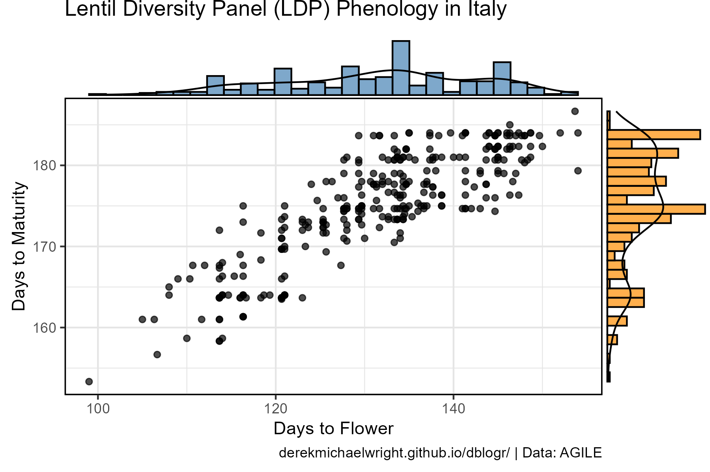
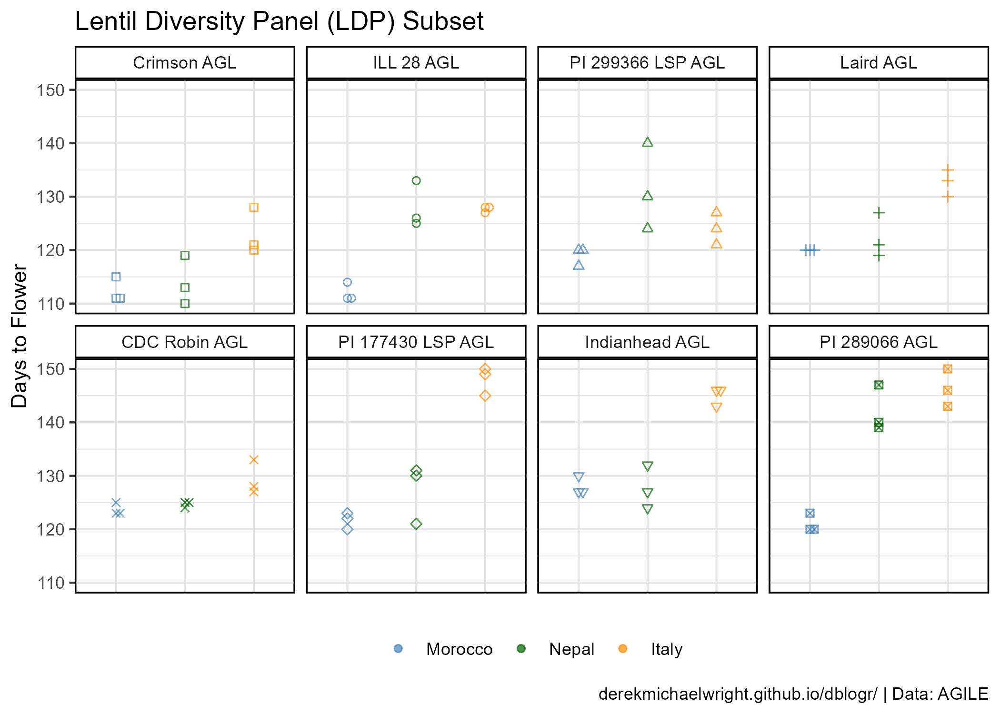

```{r setup, include=FALSE}
knitr::opts_chunk$set(echo = T, message = F, warning = F)
```

---

# Introduction

This vignette will explore several aspects of data visualization using a lentil phenology data set from [Wright *et al*. 2020](https://derekmichaelwright.github.io/dblogr/academic/ldp_phenology/){target="_blank"}. For further details on the lentil population and data visit: [https://derekmichaelwright.github.io/dblogr/academic/lentil_diversity_panel/lentil_diversity_panel.html](https://derekmichaelwright.github.io/dblogr/academic/lentil_diversity_panel/lentil_diversity_panel.html){target="_blank"}

---

# Data

> - `r shiny::icon("save")` [data_visualizations_1.csv](data_visualizations_1.csv)
> - `r shiny::icon("save")` [data_visualizations_2.csv](data_visualizations_2.csv)

---

# Prepare Data

```{r echo = F, eval = T}
library(agData)
expts <- c("Metaponto, Italy 2016",
           "Marchouch, Morocco 2017",
           "Bardiya, Nepal 2017")
locs <- c("Metaponto, Italy",
           "Marchouch, Morocco",
           "Bardiya, Nepal")
labels <- c("Italy","Morocco","Nepal")
myEntries <- c("Laird AGL", "Indianhead AGL", "CDC Robin AGL",
               "PI 299366 LSP AGL", "ILL 28 AGL", "PI 177430 LSP AGL",
                "PI 289066 AGL", "Crimson AGL")
# "PI 379368 LSP AGL", "ILL 4400 AGL",
#, "ILL 8072 AGL",  "CDC Rosie AGL","PI 212610 LSP AGL"
# "PI 320953 LSP AGL","PI 345627 LSP AGL"
#
xx <- read.csv("data_raw.csv") %>%
  filter(Name %in% myEntries, 
         Expt %in% expts) %>%
  mutate(Location = plyr::mapvalues(Location, locs, labels)) %>% 
  select(Entry, Name, Location, Rep, DTF) #%>% 
  #group_by(Entry, Name, Location) %>%
  #summarise(DTF = mean(DTF, na.rm = T))
write.csv(xx, "data_visualizations_2.csv", row.names = F)
#
x1 <- read.csv("data_raw.csv") %>%
  filter(Expt %in% expts) %>%
  mutate(Location = plyr::mapvalues(Location, locs, labels)) %>% 
  select(Entry, Name, Location, Rep, DTF) %>% 
  #filter(Location %in%  c("Italy", "Morocco")) %>%
  spread(Location, DTF)
#
xx <- read.csv("data_raw.csv") %>%
  filter(Expt == "Metaponto, Italy 2016") %>%
  select(Entry, Name, Rep, DTF, DTS, DTM) %>% 
  group_by(Entry, Name) %>%
  summarise_at(vars(DTF, DTS, DTM), funs(mean), na.rm = T)
write.csv(xx, "data_visualizations_1.csv", row.names = F)
```

```{r class.source = 'fold-show'}
# devtools::install_github("derekmichaelwright/agData")
library(agData)
myCaption <- "www.dblogr.com/ or derekmichaelwright.github.io/dblogr/ | Data: AGILE"
myColors <- c("steelblue","darkgreen","darkorange")
# Prep data
d1 <- read.csv("data_visualizations_1.csv")
#
myLocations <- c("Morocco", "Nepal", "Italy")
myEntries <- c("Crimson AGL", "ILL 28 AGL", "PI 299366 LSP AGL", 
               "Laird AGL", "CDC Robin AGL",
               "PI 177430 LSP AGL", "Indianhead AGL", "PI 289066 AGL")
d2 <- read.csv("data_visualizations_2.csv") %>%
  mutate(Location = factor(Location, levels = myLocations),
         Name = factor(Name, levels = myEntries) ) 
```

---

# Histograms

For this first example, we will illustrate the different ways to visualize histograms. This data set includes days from sowing to flower (**DTF**), days from sowing to swollen pod (**DTS**), and days from sowing to maturity (**DTM**), for 324 lentil accessions (**LDP**) grown in Metaponto, Italy in the 2016-2017 growing season.


```{r}
# Prep data
xx <- d1 %>%
  gather(Trait, Value, DTF, DTS, DTM) %>%
  mutate(Trait = factor(Trait, levels = c("DTF","DTS","DTM")),
         Trait = plyr::mapvalues(Trait, c("DTF","DTS","DTM"),
           c("Days to Flower","Days to Swollen Pod","Days to Maturity")))
# Plot
mp <- ggplot(xx, aes(fill = Trait, x = Value)) +
  theme_agData(legend.position = "none",
               axis.text.y = element_blank(),
               axis.ticks.y = element_blank()) +
  scale_fill_manual(values = myColors) +
  labs(x = NULL, y = NULL)
# (A)
mp1 <- mp + 
  geom_histogram(binwidth = 3, color = "black", alpha = 0.7) + 
  facet_grid(. ~ Trait) +
  labs(title = "Lentil Diversity Panel (LDP) Phenology in Italy",
       subtitle = "(A) Facetted histograms")
# (B)
mp2 <- mp + 
  geom_histogram(binwidth = 3, position = "dodge", 
                 color = "black", lwd = 0.4, alpha = 0.7) +
  labs(subtitle = "(B) Dodged histograms")
# (C)
mp3 <- mp + 
  geom_histogram(binwidth = 3, color = "black", alpha = 0.7) +
  labs(subtitle = "(C) Stacked histograms (binwidth = 3 days)")
# (D)
mp4 <- mp + 
  geom_histogram(binwidth = 1, lwd = 0.4, color = "black", alpha = 0.7) +
  labs(subtitle = "(D) Stacked histograms (binwidth = 1 day)")
# (E)
mp5 <- mp + 
  geom_density(alpha = 0.5) +
  labs(subtitle = "(E) Density plots", x = "Days After Planting",
       caption = myCaption)
#
mp <- ggarrange(mp1, mp2, mp3, mp4, mp5,  ncol = 1, nrow = 5, 
                heights = c(1.1,1,1,1,1.3))
ggsave("data_visualizations_01.png", mp, width = 6, height = 8)
```

```{r echo = F}
ggsave("featured.png", mp, width = 6, height = 8)
```

---

## Bonus - Histogram + scatterplot

Scatter plots and histograms can be combined to display histograms along with a correlation plot.



```{r}
# Prep data
library(ggExtra)
# Plot
mp <- ggplot(d1, aes(x = DTF, y = DTM)) +
  geom_point(alpha = 0.7) +
  theme_agData() +
  labs(title = "Lentil Diversity Panel (LDP) Phenology in Italy",
       x = "Days to Flower", y = "Days to Maturity",
       caption = myCaption)
mp <- ggMarginal(mp, type = "densigram",
           xparams = list(fill = alpha("steelblue",0.7)),
           yparams = list(fill = alpha("darkorange",0.7)))
ggsave("data_visualizations_02.png", mp, width = 6, height = 4)
```

---

# Boxplots

For the second example, we will use a subset of 8 accessions from the LDP grown in Morocco, Nepal and Italy with 3 replicates in each location. This data can be visualized in a number of different ways. 


```{r}
# Plot
mp <- ggplot(d2, aes(x = Location, y = DTF, fill = Location)) +
  theme_agData(legend.position = "none") +
  scale_fill_manual(values = myColors) +
  labs(x = NULL, y = NULL)
# (A)
mp1 <- mp + 
  geom_boxplot(alpha = 0.6, coef = 2.5) +
  stat_boxplot(geom = "errorbar", width = 0.25, coef = 2.5) +
  labs(subtitle = "(A) boxplots")
# (B)
mp2 <- mp + 
  geom_violin(alpha = 0.6) +
  labs(subtitle = "(B) violin plots")
# (C)
mp3 <- mp + 
  geom_violin(alpha = 0.6) +
  geom_boxplot(width = 0.1, fill = "white",
               outlier.shape = NA, coef = 0) +
  labs(subtitle = "(C) violins + boxplots")
# (D)
mp4 <- mp + 
  geom_violin(alpha = 0.6) +
  geom_beeswarm(aes(shape = Name), alpha = 0.7, cex = 1.5) +
  scale_shape_manual(values = 0:7) +
  labs(subtitle = "(D) violins + points", caption = myCaption)
#
mp <- ggarrange(mp1, mp2, mp3, mp4, ncol = 2, nrow = 2, align = "hv") %>%
  annotate_figure(text_grob("Lentil Diversity Panel (LDP) Subset - Days to Flower", hjust = 0.69))
ggsave("data_visualizations_03.png", mp, width = 6, height = 6, bg = "white")
```

---

## Bonus - Faceted

Additionally, if we want to compare individual genotypes instead of environments, we can change how we present the data.




```{r}
# Plot
mp <- ggplot(d2, aes(x = Location, y = DTF, 
                     color = Location, shape = Name)) +
  geom_beeswarm(alpha = 0.7, cex = 2, lwd = 2) +
  facet_wrap(Name ~ ., ncol = 4) +
  theme_agData(legend.position = "bottom",
               axis.text.x = element_blank(),
               axis.ticks.x = element_blank()) +
  scale_color_manual(name = NULL, values = myColors) +
  scale_shape_manual(values = 0:7, guide = F) +
  labs(title = "Lentil Diversity Panel (LDP) Subset",
       x = NULL, y = "Days to Flower", caption = myCaption)
ggsave("data_visualizations_04.png", mp, width = 7, height = 5)
```

---

## Bonus - G x E

Here we can see the various genotype by environment interactions (G x E).


```{r}
# prep data
xx <- d2 %>% group_by(Name, Location) %>%
  summarise(DTF = mean(DTF, na.rm = T))
myColors <- c("darkred", "darkgoldenrod2", "darkblue", "darkgreen", 
              "maroon4", "purple4", "black",  "steelblue" )
# plot
mp <- ggplot(xx, aes(x = Location, y = DTF, 
                     color = Name, shape = Name, group = Name)) +
  geom_point(size = 3, alpha = 0.8) + 
  geom_line(size = 1.25, alpha = 0.6) +
  scale_color_manual(name = NULL, values = myColors) +
  scale_shape_manual(name = NULL, values = 0:7) +
  theme_agData(legend.position = "bottom") +
  coord_cartesian(xlim = c(1.5,2.5)) +
  guides(color = guide_legend(nrow = 2, byrow = T)) +
  labs(title = "Lentil Diversity Panel (LDP) Subset",
       x = NULL, y = "Days to Flower", caption = myCaption)
ggsave("data_visualizations_05.png", mp, width = 7, height = 5)
```

---
