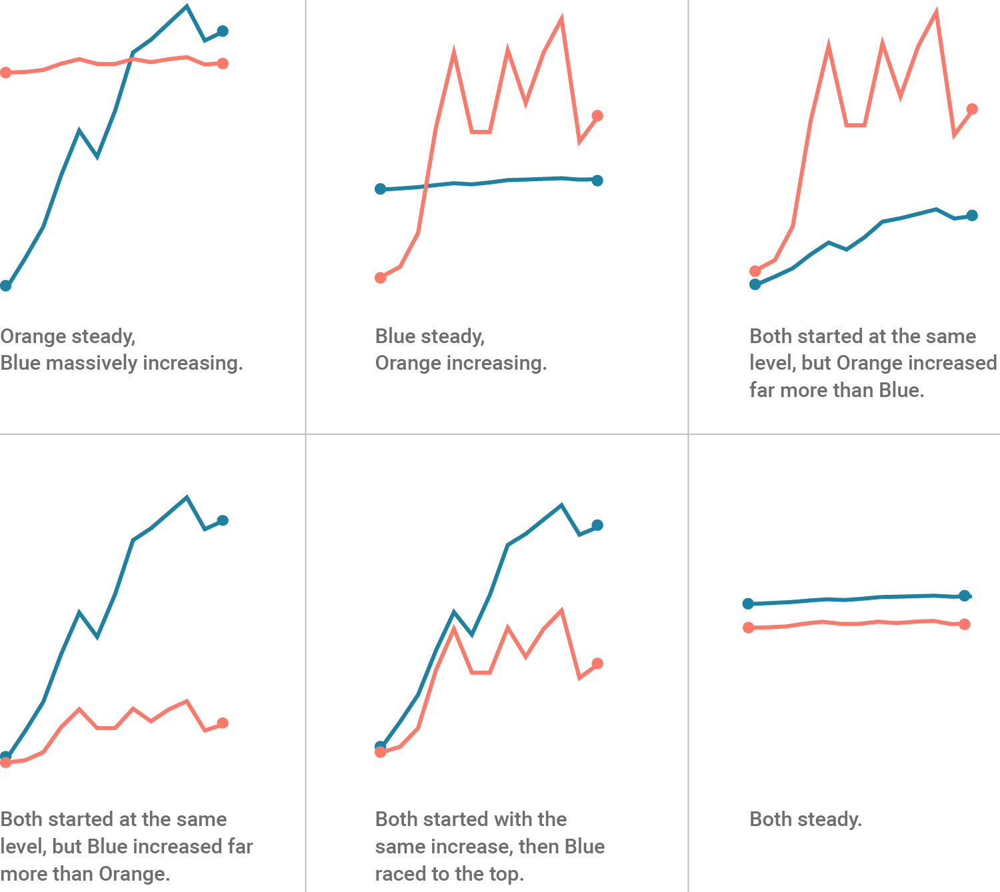

```{r setup, include=FALSE}
knitr::opts_chunk$set(echo = T, message = F, warning = F)
```

---

# Introduction

In some cases, a graph with two y-axes is desired for visualizing two different sets of data. However, this is sometimes frowned upon since the required scaling of the data can be adjusted to fit the desired narrative.



With that said, there still are situations were dual y-axes are appropriate. This vignette will show you how to do this in <i class="fab fa-r-project"></i> with `ggplot2`, despite [the package authors disagreements](https://stackoverflow.com/questions/3099219/ggplot-with-2-y-axes-on-each-side-and-different-scales/3101876#3101876).

---

# Data

> - `r shiny::icon("save")` [data_dual_y_axis.csv](data_dual_y_axis.csv)

---

# Prepare Data

```{r class.source = 'fold-show'}
# devtools::install_github("derekmichaelwright/agData")
library(agData)
```

```{r}
# Prep data
myCaption <- c("www.dblogr.com/ or derekmichaelwright.github.io/dblogr/ | Data: AGILE")
xx <- read.csv("data_dual_y_axis.csv") %>% 
  mutate(Date = as.Date(Date))
as_tibble(xx)
```

---

# Single y-axis

First lets create a plot of `Air Temperature`.

```{r}
mp1 <- ggplot(xx, aes(x = Date)) +
  geom_line(aes(y = Air.Temperature, color = "1"), 
            alpha = 0.7, size = 1.25) +
  scale_color_manual(name = NULL, values = "red", labels = "Air Temp") +
  scale_x_date(date_labels = "%b" , date_breaks = "1 month") +
  labs(title = "Environmental Data", x = NULL,
       y = "Temperature (\u00B0C)", caption = myCaption) +
  theme_agData(legend.position = "bottom")
mp1
```

Now lets add a second set of data (`Soil Temperature`), in this case it uses the same unit as the first (&deg;C).

```{r}
mp2 <- mp1 + 
  geom_line(aes(y = Soil.Temperature, color = "2"), 
            alpha = 0.7, size = 1.25) +
  scale_color_manual(name = NULL, values = c("red","darkred"), 
                     labels = c("Air Temp","Soil Temp"))
mp2
```

But when we add another data set (`Day Length`) using different units (hours), problems arise.

```{r}
mp3 <- mp2 + 
  geom_line(aes(y = Day.Length, color = "3"), 
            alpha = 0.7, size = 1.25) +
  scale_color_manual(name = NULL, values = c("red","darkred","steelblue"), 
                     labels = c("Air Temp","Soil Temp","DayLength"))
mp3
```

---

# Data Scaling

In this case, the range of `Day Length` and `Temperature` are drastically different.

```{r}
max(xx$Air.Temperature) - min(xx$Air.Temperature)
max(xx$Day.Length) - min(xx$Day.Length)
```

In order to present the data better, we need to rescale it

$$y_{scaled}=(y_{2i}-min(y_2))*\frac{max(y_1)-min(y_1)}{max(y_2)-min(y_2)}+min(y_1)$$

where:

- $y_1$ = Set of values you want to scale to
- $y_2$ = Set of values to be rescaled to min and max of y~1~
- $y_{2i}$ = Value from the $y_2$ set to be rescaled

in our case:

- $y_1$ = Air + Soil Temperature
- $y_2$ = Day Length
- $y_{2i}$ = Day Length on a specific day

```{r}
y1_min <- min(c(xx$Soil.Temperature, xx$Air.Temperature))
y1_max <- max(c(xx$Soil.Temperature, xx$Air.Temperature))
y2_min <- min(xx$Day.Length)
y2_max <- max(xx$Day.Length)
xx <- xx %>%
  mutate(Day.Length_scaled = (Day.Length - y2_min) * (y1_max - y1_min) / 
                                 (y2_max - y2_min) + y1_min )
```

Scaling the data can also be done with the `rescale` function from the `scales` package

```{r}
xx <- xx %>% 
  mutate(Day.Length_scaled = scales::rescale(Day.Length, to = c(y1_min, y1_max)))
```

```{r}
mp4 <- mp3 + 
  geom_line(data = xx, aes(y = Day.Length_scaled, color = "4"), 
            alpha = 0.7, size = 1.25) +
  scale_color_manual(name = NULL, 
    values = c("red","darkred","steelblue","darkblue"), 
    labels = c("Air Temp","Soil Temp","Day Length","Day Length*"))
mp4
```

That looks better. However, we still need to add the second y-axis, which will require some more math.

$$y_{2i}=(y_{scaled}-min(y_1))*\frac{max(y_2)-min(y_2)}{max(y_1)-min(y_1)}+min(y_2)$$

---

# Double y-axis

```{r}
# Prep sec_axis
mySA <- sec_axis(~(. - y1_min) * (y2_max - y2_min) / (y1_max - y1_min) + y2_min, 
                 name = "Hours", breaks = 9:14)
# Plot
mp5 <- mp2 +
  geom_line(data = xx, aes(y = Day.Length_scaled, color = "4"),
            alpha = 0.7, size = 1.25) +
  scale_color_manual(name = NULL, values = c("red","darkred","darkblue"), 
                     labels = c("Air Temp","Soil Temp","Day Length")) +
  scale_y_continuous(sec.axis = mySA)
mp5
```

```{r echo = F}
ggsave("featured.png", mp5, width = 6, height = 4)
```

To help better visualize this rescaling, we will use a simpler example.

$$y_{scaled}=(y_{2i}-min(y_2))*\frac{max(y_1)-min(y_1)}{max(y_2)-min(y_2)}+min(y_1)$$

$$y_{scaled}=(7.5-5)*\frac{40-20}{10-5}+20)=30$$


$$y_{2i}=(y_{scaled}-min(y_1))*\frac{max(y_2)-min(y_2)}{max(y_1)-min(y_1)}+min(y_2)$$

$$y_{2i}=(30-20)*\frac{10-5}{40-20}+5=7.5$$

```{r}
xx <- data.frame(x = 1:20, y = 1:20)
ggplot(xx, aes(x = x, y = y)) + 
  geom_hline(yintercept = 30, color = "blue", alpha = 0.7, size = 2) +
  theme_agData(axis.text.y = element_text(color = "red", size = 10)) +
  scale_y_continuous(limits = c(20, 40), 
                     sec.axis = sec_axis(~ (. - 20) * (10 - 5) / (20 - 0) + 5,
                        name = "y2", breaks = 5:10)) +
  labs(caption = myCaption)
```

---
