```{r setup, include = FALSE}
knitr::opts_chunk$set(echo = T, message = F, warning = F)
```

---

# Introduction

The purpose of this document is to provide a few examples of how to manipulate and plot the environmental data.

---

# Data

The data for this vignette comes from two sources:

1. Downloaded from `EnvRtype` and `geosphere` R packages.

> - `r shiny::icon("save")` [AGILE_Expts.csv](AGILE_Expts.csv)
> - `r shiny::icon("save")` [AGILE_R_EnvData.csv](AGILE_R_EnvData.csv)
> - `r shiny::icon("r-project")` https://github.com/allogamous/EnvRtype
> - `r shiny::icon("r-project")` https://github.com/rspatial/geosphere

2. Manually collected data from our lentil field trials in the AGILE project.

> - `r shiny::icon("save")` [AGILE_My_EnvData.csv](AGILE_My_EnvData.csv)
> - `r shiny::icon("github")` [academic/envdata/AGILE_EnvData/](https://github.com/derekmichaelwright/dblogr/tree/main/academic/envdata/AGILE_EnvData/)
> - `r shiny::icon("globe")` [**knowpulse.usask.ca/**](http://knowpulse.usask.ca/portal/)

---

# Prepare the data

```{r}
# devtools::install_github("derekmichaelwright/agData")
library(agData)
# devtools::install_github('allogamous/EnvRtype')
library(EnvRtype)
# install.packages("geosphere")
library(geosphere)
#
myCaption <- "www.dblogr.com/ or derekmichaelwright.github.io/dblogr/ | Data: AGILE"
myEs <- c("Ro16", "Ro17", "Su16", "Su17", "Su18", "Us18",
          "In16", "In17", "Ba16", "Ba17", "Ne16", "Ne17",
          "Mo16", "Mo17", "Sp16", "Sp17", "It16", "It17")
myColors <- c("darkgreen", "darkred", "coral3", "deeppink3", "darkcyan",
              "burlywood4", "darkslateblue", "darkmagenta", "darkgoldenrod3")
#
ee <- read.csv("AGILE_Expts.csv") %>%
  mutate(Expt = factor(Expt, levels = myEs))
DT::datatable(ee)
```

---

## EnvRtype and geosphere R packages

```{r}
# Prep data
d1 <- get_weather(env.id = ee$Expt, lat = ee$Lat, lon = ee$Lon,
                  start.day = ee$Start, end.day = ee$End) %>%
  mutate(DayLength = daylength(lat = .$LAT, doy = .$YYYYMMDD))
#
write.csv(d1, "AGILE_R_EnvData.csv", row.names = F)
DT::datatable(d1)
```

---

## Manual Data

```{r}
# Prep data from 
d2 <- list() # Create Empty list
files <- list.files("AGILE_EnvData/")[grepl(".csv", list.files("AGILE_EnvData/"))]
for (i in 1:length(files)) { 
  d2[[i]] <- read.csv(paste0("AGILE_EnvData/", files[i]), stringsAsFactors = T)
  #colnames(d2[[i]])[1] <- "Location"
}
# Bind files together
d2 <- do.call(rbind, d2)
# Filter data
d2 <- d2 %>% filter(!is.na(DaysAfterPlanting))
#
# Prep data for plotting
d2 <- d2 %>% 
  mutate(Value = as.numeric(Value)) %>% 
  filter(!is.na(Value)) %>%
  mutate(Time = ifelse(is.na(Time) | Time == "", 
                       "12:00:00", as.character(Time)),
         Date = as.Date(Date),
         DateTime = as.POSIXct(paste(Date, Time), 
                               format = "%Y-%m-%d %H:%M:%OS"),
         #Location = factor(Location, levels = locs),
         LoggerID = factor(LoggerID, levels = unique(.$LoggerID)) )
#
write.csv(d2, "AGILE_My_EnvData.csv", row.names = F)
#
DT::datatable(d2)
# View table
d2 %>% as_tibble()
# List experiments
d2 %>% distinct(Location, Year)
# List Measurements from a single experiment
d2 %>% filter(Location == "Sutherland, Canada", Year == 2016) %>% 
  distinct(Measurement)
# List data logger names from a single experiment
d2 %>% filter(Location == "Sutherland, Canada", Year == 2016) %>% 
  distinct(LoggerID)
```

---

# EnvRtype and geosphere R packages

## All Data

```{r}
# Prep data
xx <- d1 %>% mutate(DayLength_Rescaled = scales::rescale(DayLength, to = c(0, 45)))
# Plot
mp <- ggplot(xx, aes(x = YYYYMMDD)) +
  geom_col(aes(y = PRECTOT, color = "Rain"), fill = "steelblue") +
  geom_line(aes(y = T2M, color = "Temp")) +
  geom_line(aes(y = DayLength_Rescaled, color = "Day Length")) +
  geom_ribbon(aes(ymin = T2M_MIN, ymax = T2M_MAX), 
              fill = "red", alpha = 0.25) +
  scale_color_manual(values = c("red", "darkblue", "steelblue"), 
                     breaks = c("Temp", "Day Length", "Rain")) +
  scale_x_date(date_breaks = "month", date_labels = "%b") +
  scale_y_continuous(name = "\u00B0Celcius / mm Rain",
    sec.axis = sec_axis(~ . * (16.62-9.11) / (45-0) + 9.11, 
                        breaks = c(10, 12, 14, 16), name = "Hours") ) +
  coord_cartesian(ylim = c(-5, 45)) +
  facet_wrap(. ~ env, ncol = 6, scales = "free_x") +
  theme_agData() +
  labs(title = "EnvRtype and geosphere R packages", 
       y = "Degree C / mm rain", x = NULL, caption = myCaption)
ggsave("envdata_1_01.png", mp, width = 12, height = 8)
```

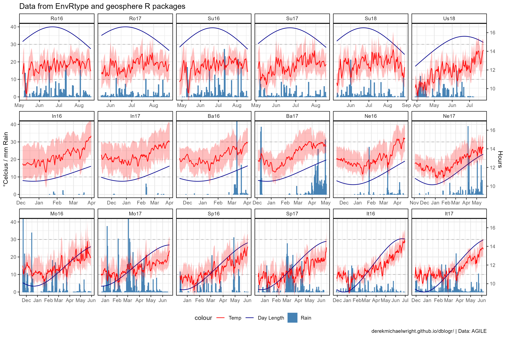

---

## trials

```{r}
# Prep data
xx <- d1 %>% mutate(DayLength_Rescaled = scales::rescale(DayLength, to = c(0, 45)))
# Plot
mp <- ggplot(d1, aes(x = daysFromStart)) +
  geom_col(aes(y = PRECTOT), fill = "steelblue") +
  geom_line(aes(y = T2M)) +
  geom_line(aes(y = DayLength), color = "darkblue") +
  geom_ribbon(aes(ymin = T2M_MIN, ymax = T2M_MAX), 
              fill = alpha("Red", 0.25), 
              color = alpha("Red", 0.25) ) +
  coord_cartesian(ylim = c(-5, 45)) +
  facet_grid(env ~ ., scales = "free_x", space = "free_x") +
  theme_agData() +
  labs(title = "EnvRtype and geosphere R packages", 
       y = "Degree C / mm rain", x = NULL, caption = myCaption)
ggsave("envdata_1_02.png", mp, width = 6, height = 12)
```

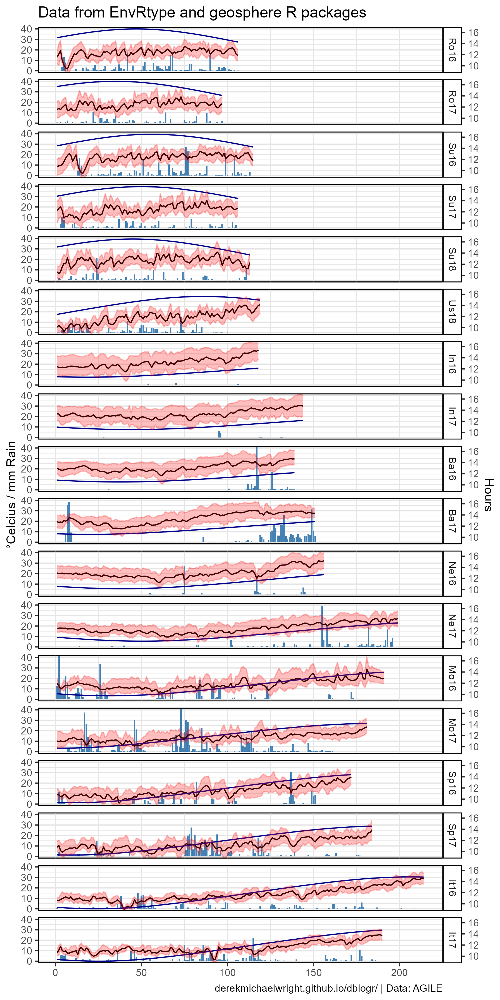

---

```{r}
# Prep temperature data
x1 <- d1 %>% select(Expt=env, Date=YYYYMMDD, T_mean=T2M, T_min=T2M_MIN, T_max=T2M_MAX)
x2 <- d2 %>% 
  filter(Measurement == "Temperature") %>% 
  group_by(Expt, Measurement, Date) %>% 
  summarise_at(vars(Value), funs(min, mean, max)) %>%
  ungroup() %>%
  rename(T_mean=mean, T_min=min, T_max=max)
xx <- bind_rows(x1, x2)
# Plot graph
mp <- ggplot(x1, aes(x = Date, y = T_mean)) + 
  facet_wrap(Expt ~ ., ncol = 6, scales = "free_x") + 
  geom_line(color = "Red") +
  geom_ribbon(aes(ymin = T_min, ymax = T_max), 
              fill = alpha("blue", 0.25), 
              color = alpha("blue", 0.25) ) +
  geom_line(data = x2, color = "blue") +
  geom_ribbon(data = x2, aes(ymin = T_min, ymax = T_max), 
              fill = alpha("Red", 0.25), 
              color = alpha("Red", 0.25) ) +
  scale_x_date(name = NULL, date_labels = "%b" , date_breaks = "1 month") +
  theme_agData() +
  labs(title = "Environmental Data", caption = myCaption)
ggsave("envdata_1_03.png", mp, width = 12, height = 8)
```

```{r}
# Prep data
xx <- d1
# Plot
mp <- ggplot(d1, aes(x = daysFromStart)) +
  geom_line(aes(y = T2M)) +
  geom_line(aes(y = DayLength), color = "darkblue") +
  geom_ribbon(aes(ymin = T2M_MIN, ymax = T2M_MAX), 
              fill = alpha("Red", 0.25), 
              color = alpha("Red", 0.25) ) +
  geom_col(aes(y = PRECTOT), fill = "steelblue") +
  #scale_x_date(date_breaks = "month", date_labels = "%b") +
  facet_grid(env ~ ., scales = "free_x", space = "free_x") +
  theme_agData()
ggsave("envdata_1_03.png", mp, width = 6, height = 12)
```


---

# Manaul Data

## Summarize data

Calculcate min, mean and max for each measurement

```{r}
xx <- d2 %>% 
  group_by(Location, Year, Date, Measurement) %>%
  summarise_at(vars(Value), funs(min, mean, max)) %>%
  ungroup()
str(xx)
```

```{r echo = F, eval = F}
# Remove specified data loggers from a particular experiment, 
# then calucate min, mean and max for each measurement.
xx <- d2 %>% 
  filter(paste(LoggerID, Location, Year, sep="_") != 
           "Weather Station_Rosthern, Canada_2016") %>% 
  group_by(Location, Year, Date, Measurement) %>%
  summarise_at(vars(Value), funs(min, mean, max)) %>%
  ungroup() 
str(xx)
```

---

## Plot all data

```{r}
# Filter data
xx <- d2 %>% filter(Location == "Sutherland, Canada", Year == 2016)
# Plot graph
mp <- ggplot(xx, aes(x = DateTime, y = Value, color = LoggerID)) +
  geom_line(alpha = 0.7) + 
  geom_point(alpha = 0.7, size = 0.5) +
  facet_wrap(Measurement + Unit ~ ., scales = "free_y", switch = "y",
             ncol = 1, labeller = label_wrap_gen(width = 10)) +
  theme_agData(strip.placement = "outside", legend.position = "bottom") +
  scale_x_datetime(date_breaks = "1 month", date_minor_breaks = "1 day",
                   date_labels = "%b %Y") +
  scale_colour_manual(values = myColors) +
  labs(title = "Sutherland, Canada 2016", y = NULL, x = NULL,
       caption = myCaption)
ggsave("envdata_2_01.png", mp, width = 12, height = 15, limitsize = F)
```

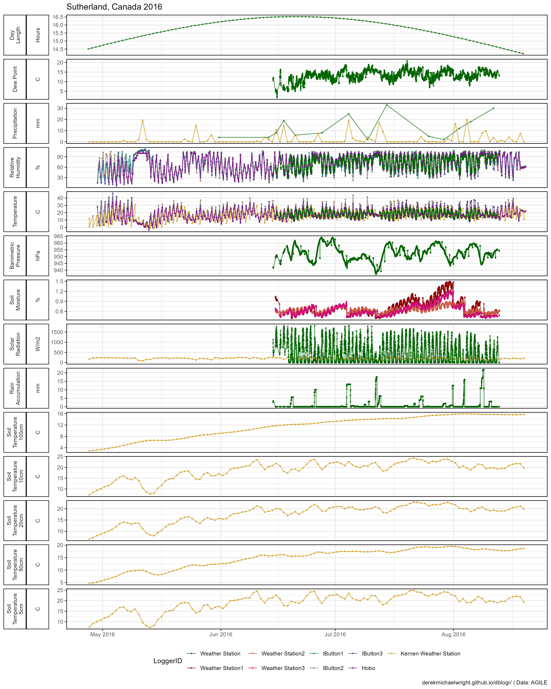

---

## Temperature

Plot and calculate daily min, mean and max

```{r}
# Filter data
xx <- d2 %>% filter(Location == "Sutherland, Canada", Year == 2016,
                    Measurement == "Temperature")
# Plot graph
mp <- ggplot(xx, aes(x = DateTime, y = Value, color = LoggerID)) +
  geom_line(alpha = 0.7) + 
  geom_point(alpha = 0.7, size = 0.5) +
  theme_agData(legend.position = "bottom") +
  scale_colour_manual(values = myColors) +
  scale_x_datetime(date_labels = "%b %Y" , date_breaks = "1 month") +
  labs(title = "Sutherland, Canada 2016", y = "Temperautre (C)", x = NULL,
       caption = myCaption)
ggsave("envdata_2_02.png", mp, width = 7, height = 5)
```


---

Plot temperatures for one month (July 2016)

```{r}
mp <- mp + 
  scale_x_datetime(date_breaks = "1 month", date_minor_breaks = "1 day", 
                   date_labels = "%b %Y" , 
                   limits = as.POSIXct(c("2016-07-01","2016-08-01"))) +
  ylim(c(5,45))
ggsave("envdata_2_03.png", mp, width = 7, height = 5)
```

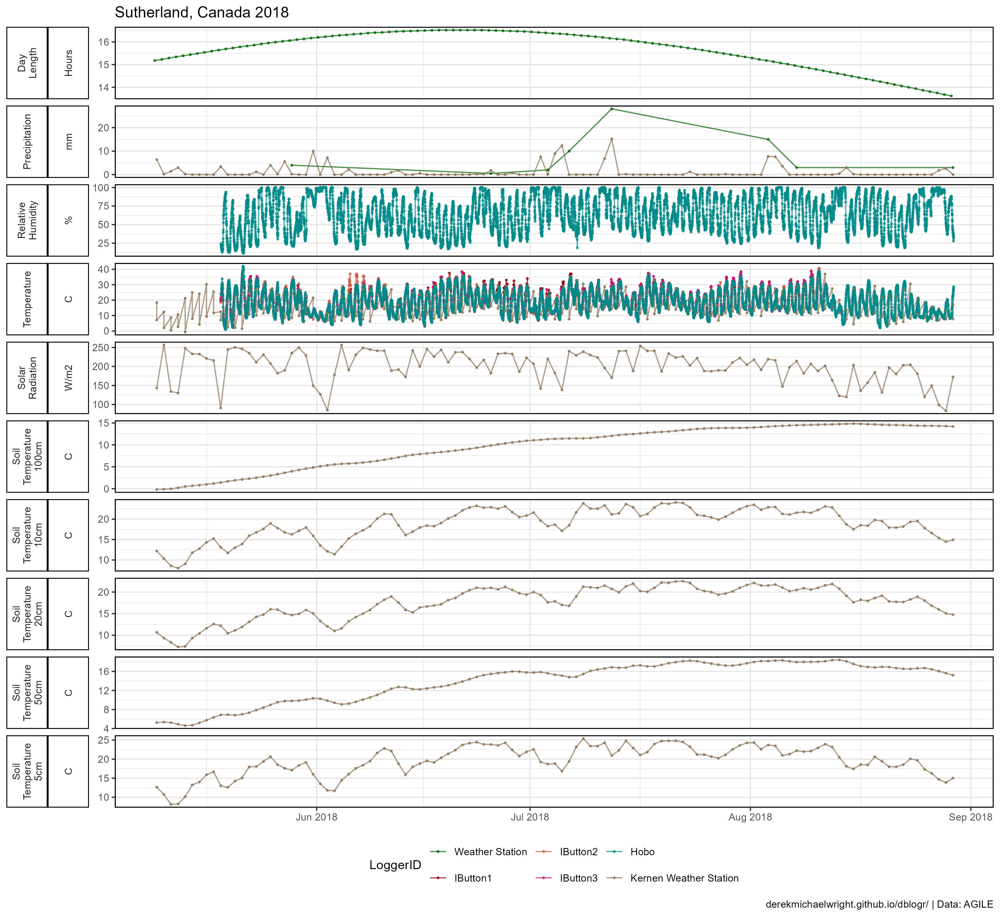

---

Calculate daily mean for each data logger

```{r}
yy <- xx %>% 
  group_by(LoggerID, Date) %>%
  summarise(Value = mean(Value)) %>%
  spread(LoggerID, Value) %>% 
  mutate(Temp_Mean = rowMeans(select(.,-Date), na.rm = T))
str(yy)
```

Calculate daily min, mean and max from specific data loggers

```{r}
yy <- xx %>% 
  filter(LoggerID %in% c("Ibutton2","IButton3","Hobo")) %>% 
  group_by(Location, Date) %>% 
  summarise_at(vars(Value), funs(min, mean, max), na.rm = T) %>%
  rename(Temp_min = min, Temp_mean = mean, Temp_max = max)
str(yy)
```

Plot daily mean temperatures for each experiment

```{r}
# Prep data
xx <- d2 %>% 
  filter(Measurement == "Temperature", Year != 2018) %>% 
  group_by(Location, Year, Expt, DaysAfterPlanting) %>% 
  summarise(Mean = mean(Value))
# Plot graph
mp <- ggplot(xx, aes(x = DaysAfterPlanting, y = Mean, color = Location)) + 
  stat_smooth(geom = "line", method = "loess", se = F, alpha = 0.7, size = 2) + 
  facet_grid(Year ~ .) +
  scale_color_manual(values = myColors) +
  theme_agData() +
  labs(title = "Temperature", 
       y = "Degrees Celsius", x = "Days After Planting",
       caption = myCaption)
ggsave("envdata_2_04.png", mp, width = 6, height = 4)
```


---

# Day Lengths

```{r}
# Prep data
xx <- d2 %>% 
  filter(Measurement == "Day Length", Year != 2018) %>% 
  group_by(Location, Year, Expt, DaysAfterPlanting) %>% 
  summarise(Mean = mean(Value) )
# Plot graph
mp <- ggplot(xx, aes(x = DaysAfterPlanting, y = Mean, color = Location)) + 
  geom_line(alpha = 0.7, size = 2) +
  facet_grid(Year ~ .) +
  scale_color_manual(values = myColors) +
  theme_agData() +
  labs(title = "Day Lengths",
       y = "Hours", x = "Days After Planting",
       caption = myCaption)
ggsave("envdata_2_05.png", mp, width = 6, height = 4)
```


---

# Precipitation

```{r}
# Prep data
xx <- d2 %>% 
  filter(Measurement == "Precipitation") %>%
  group_by(Expt, Location, Year) %>%
  summarise(Rainfall = sum(Value)) %>%
  arrange(Rainfall) %>%
  ungroup() %>%
  mutate(Expt = factor(Expt, levels = Expt),
         Year = factor(Year))
# Plot graph
mp <- ggplot(xx, aes(x = Location, y = Rainfall, fill = Year)) + 
  geom_col(alpha = 0.7, color = "black", lwd = 0.3,
           position = position_dodge2(preserve = "single")) + 
  scale_fill_manual(values = myColors) +
  theme_agData() +
  coord_flip() +
  labs(title = "Total Precipitation",
       caption = myCaption)
ggsave("envdata_2_06.png", mp, width = 6, height = 4)
```

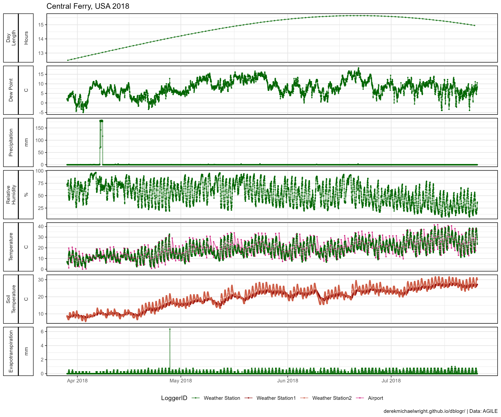

---

```{r}
# Prep data
xx <- d2 %>% 
  filter(Measurement == "Precipitation", Year == 2016) %>% 
  group_by(Location, Year, Expt, Date, DaysAfterPlanting) %>% 
  summarise(Value = sum(Value))
# Plot graph
mp <- ggplot(xx, aes(x = DaysAfterPlanting, y = Value)) + 
  geom_col(fill = "steelblue") +
  facet_wrap(Location~., ncol = 1) +
  theme_agData() +
  labs(title = "Precipitation", y = "mm", x = "Days After Planting",
       caption = myCaption)
ggsave("envdata_2_07.png", mp, width = 6, height = 8)
```

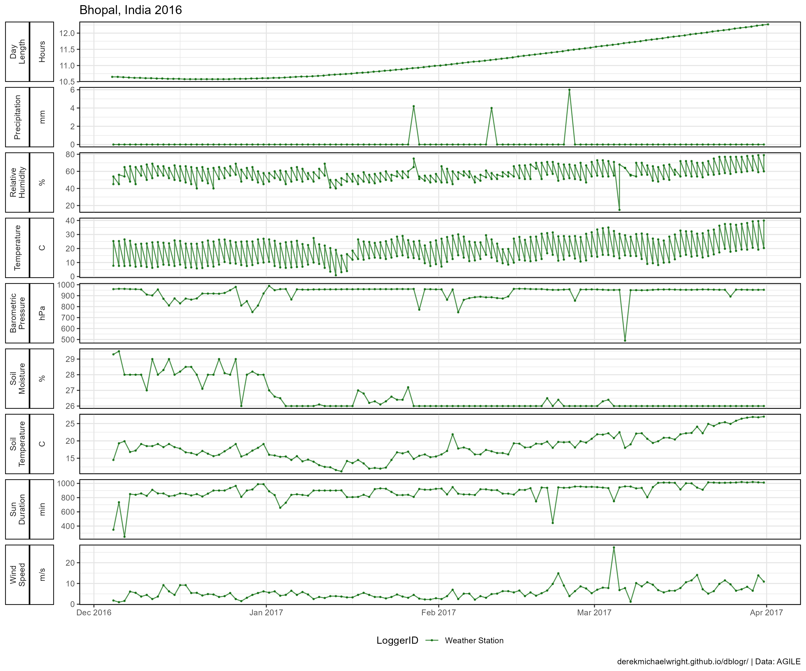

---

# Temperature, Day Length & Rainfall

Temperature and Daylength will require separate axes so we will have to rescale the data. 

$$y_{scaled}=(y_{2i}-min(y_2))*\frac{max(y_1)-min(y_1)}{max(y_2)-min(y_2)}$$

$$y_{2i}=y_{scaled}*\frac{max(y_2)-min(y_2)}{max(y_1)-min(y_1)}+min(y_2)$$

*e.g.*,

$$12=(11.333-9.11)*\frac{(40-0)}{16.52-9.11})$$

$$11.333=12*\frac{16.52-9.11}{40-0}+9.11$$

```{r}
# Prep rainfall data
myLocs <- c("Sutherland, Canada", "Metaponto, Italy", "Bhopal, India")
xR <- d2 %>% 
  filter(Location %in% myLocs, Year == 2017, 
         Measurement == "Precipitation", Value > 0) %>%
  group_by(Expt, Date, DaysAfterPlanting) %>% 
  summarise(Value = sum(Value))
# Prep temperature and daylength data
xx <- d2 %>% 
  filter(Location %in% myLocs, Year == 2017,
         Measurement %in% c("Temperature", "Day Length")) %>% 
  group_by(Expt, Measurement, Date) %>% 
  summarise_at(vars(Value), funs(min, mean, max)) %>%
  ungroup() %>%
  gather(Calc, Value, min, mean, max) %>%
  mutate(Measurement = plyr::mapvalues(Measurement, 
           c("Temperature", "Day Length"), c("Temp", "DayLen")),
         Measurement = paste(Measurement, Calc, sep="_")) %>%
  select(-Calc) %>%
  filter(!Measurement %in% c("DayLen_min", "DayLen_max")) %>%
  spread(Measurement, Value) %>%
  mutate(DayLen_Rescaled = scales::rescale(DayLen_mean, to = c(0, 45)))
# Print
str(xx)
# Collect values for rescaling seconday axis
range(xx$DayLen_mean)
# Plot graph
mp <- ggplot(xx, aes(x = Date, y = Temp_mean)) + 
  facet_wrap(Expt ~ ., ncol = 1, scales = "free_x") + 
  geom_line(color = "Red") +
  geom_line(aes(y = DayLen_Rescaled), color = "darkblue") +
  geom_col(data = xR, aes(y = Value), fill = "steelblue") +
  geom_ribbon(aes(ymin = Temp_min, ymax = Temp_max), 
              fill = alpha("Red", 0.25), 
              color = alpha("Red", 0.25) ) +
  scale_x_date(name = NULL, date_labels = "%b" , date_breaks = "1 month") +
  scale_y_continuous(name = "\u00B0Celcius / mm Rain",
    sec.axis = sec_axis(~ . * (16.62-9.11) / (45-0) + 9.11, 
                        breaks = c(10, 12, 14, 16), name = "Hours") ) +
  coord_cartesian(ylim=c(0, 45)) +
  theme_agData() +
  labs(caption = myCaption)
ggsave("envdata_2_08.png", mp, width = 6, height = 5.5)
```

```{r echo = F}
ggsave("featured.png", mp, width = 6, height = 5.5)
```

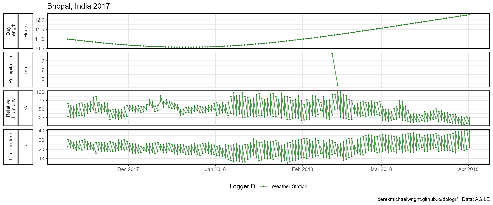

---

# Soil Temperature

```{r}
# Prep data
mm <- c("Soil Temperature 5cm",  "Soil Temperature 10cm",
        "Soil Temperature 20cm", "Soil Temperature 50cm",
        "Soil Temperature 100cm")
xx <- d2 %>% 
  filter(Location == "Sutherland, Canada", Year == 2016, 
         Measurement %in% mm) %>%
  mutate(Measurement = factor(Measurement, levels = mm),
         Measurement = plyr::mapvalues(Measurement, mm, 
           c("5cm","10cm","20cm","50cm","100cm")))
# Plot
mp <- ggplot(xx, aes(x = DateTime, y = Value, color = Measurement)) +
  geom_line(alpha = 0.7) +
  scale_color_manual(values = myColors) +
  theme_agData() +
  labs(title = "Soil Temperatures: Sutherland, Canada 2016",
       y = NULL, x = NULL,
       caption = myCaption)
ggsave("envdata_2_09.png", mp, width = 6, height = 4)
```


---

# Each experiment

```{r}
# Create Plotting function
envPlot <- function(xx) {
  ggplot(xx, aes(x = DateTime, y = Value, color = LoggerID)) +
  geom_line(alpha = 0.7) + 
  geom_point(alpha = 0.7, size = 0.5) +
  facet_grid(Measurement + Unit ~ ., scales = "free_y", switch = "y",
             labeller = label_wrap_gen(width = 10)) +
  theme_agData(strip.placement = "outside", legend.position = "bottom") +
  scale_x_datetime(date_labels = "%b %Y" , date_breaks = "1 month") +
  scale_color_manual(values = myColors) +
  labs(title = paste(unique(xx$Location), unique(xx$Year)), 
       y = NULL, x = NULL,
       caption = myCaption)
}
```

---

## Sutherland, Canada 2016

```{r}
mp <- envPlot(filter(d2, Location == "Sutherland, Canada", Year == 2016))
ggsave("envdata_3_01.png", mp, width = 12, height = 15)
```


---

## Sutherland, Canada 2017

```{r}
mp <- envPlot(filter(d2, Location == "Sutherland, Canada", Year == 2017))
ggsave("envdata_3_02.png", mp, width = 12, height = 11)
```

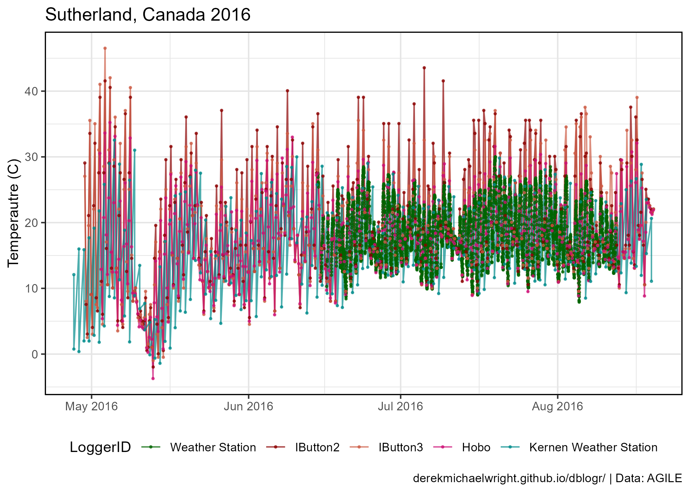

---

## Sutherland, Canada 2018

```{r}
mp <- envPlot(filter(d2, Location == "Sutherland, Canada", Year == 2018))
ggsave("envdata_3_03.png", mp, width = 12, height = 11)
```

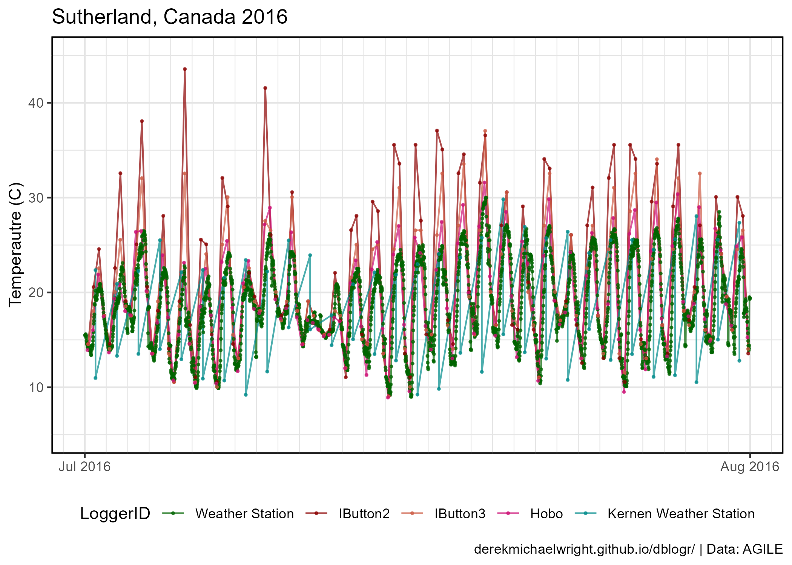

---

## Rosthern, Canada 2016

```{r}
mp <- envPlot(filter(d2, Location == "Rosthern, Canada", Year == 2016))
ggsave("envdata_3_04.png", mp, width = 12, height = 10)
```

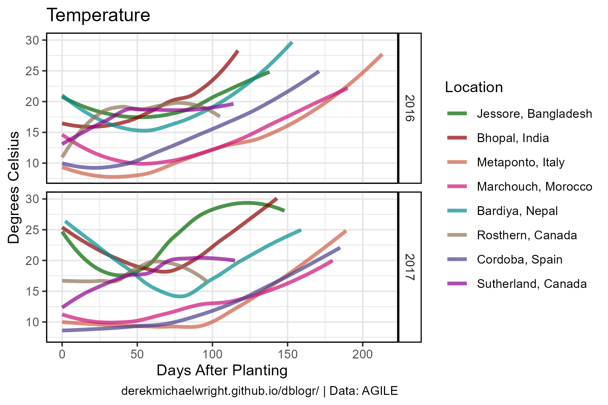

---

## Rosthern, Canada 2017

```{r}
mp <- envPlot(filter(d2, Location == "Rosthern, Canada", Year == 2017))
ggsave("envdata_3_05.png", mp, width = 12, height = 10)
```

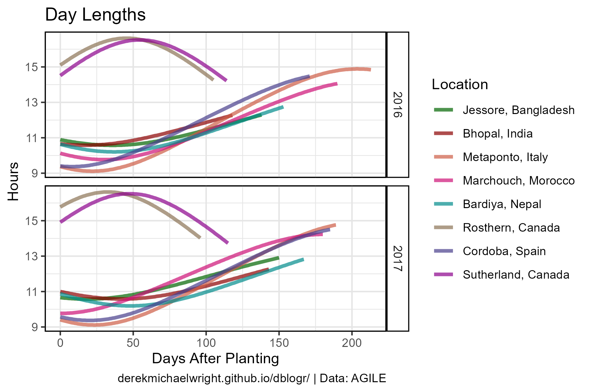

---

## Central Ferry, USA 2018

```{r}
mp <- envPlot(filter(d2, Location == "Central Ferry, USA", Year == 2018))
ggsave("envdata_3_06.png", mp, width = 12, height = 10)
```

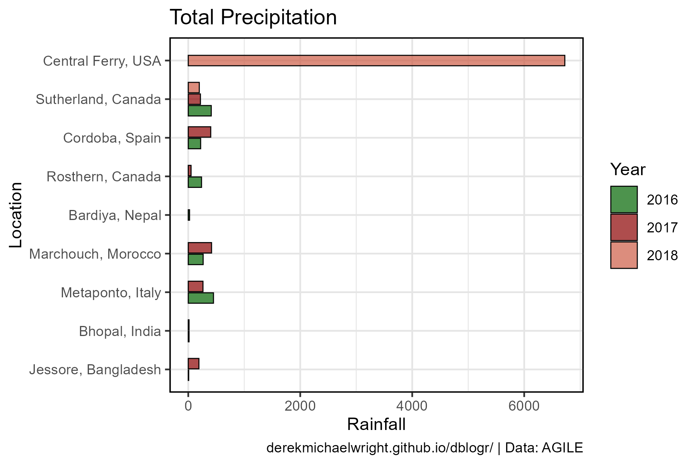

---

## Bhopal, India 2016

```{r}
mp <- envPlot(filter(d2, Location == "Bhopal, India", Year == 2016))
ggsave("envdata_3_07.png", mp, width = 12, height = 10)
```

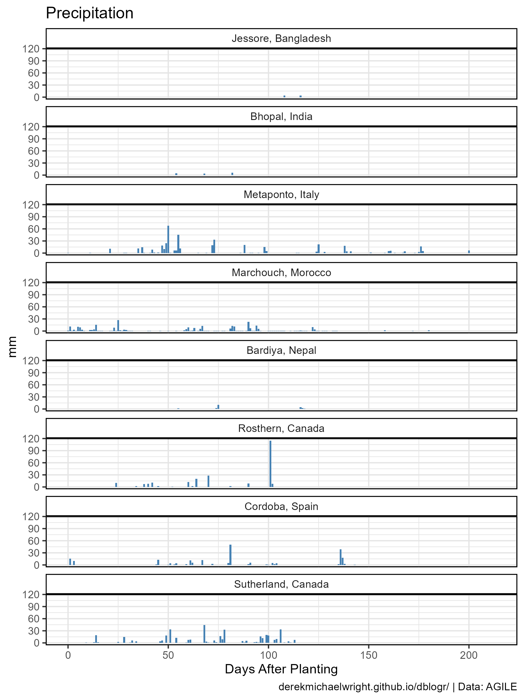

---

## Bhopal, India 2017

```{r}
mp <- envPlot(filter(d2, Location == "Bhopal, India", Year == 2017))
ggsave("envdata_3_08.png", mp, width = 12, height = 5)
```


---

## Jessore, Bangladesh 2016

```{r}
mp <- envPlot(filter(d2, Location == "Jessore, Bangladesh", Year == 2016))
ggsave("envdata_3_09.png", mp, width = 12, height = 8)
```

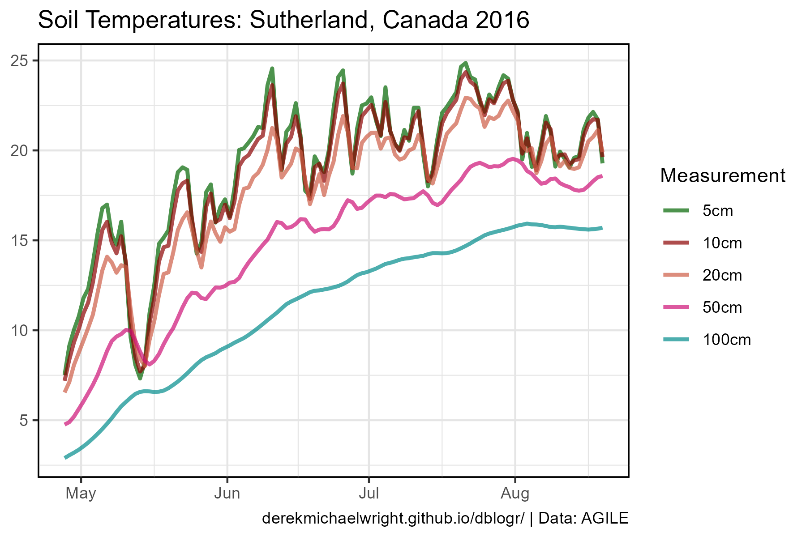

---

## Jessore, Bangladesh 2017

```{r}
mp <- envPlot(filter(d2, Location == "Jessore, Bangladesh", Year == 2017))
ggsave("envdata_3_10.png", mp, width = 12, height = 4)
```


---

## Bardiya, Nepal 2016

```{r}
mp <- envPlot(filter(d2, Location == "Bardiya, Nepal", Year == 2016))
ggsave("envdata_3_11.png", mp, width = 12, height = 5)
```


---

## Bardiya, Nepal 2017

```{r}
mp <- envPlot(filter(d2, Location == "Bardiya, Nepal", Year == 2017))
ggsave("envdata_3_12.png", mp, width = 12, height = 4)
```


---

## Marchouch, Morocco 2016

```{r}
mp <- envPlot(filter(d2, Location == "Marchouch, Morocco", Year == 2016))
ggsave("envdata_3_13.png", mp, width = 12, height = 9)
```


---

## Marchouch, Morocco 2017

```{r}
mp <- envPlot(filter(d2, Location == "Marchouch, Morocco", Year == 2017))
ggsave("envdata_3_14.png", mp, width = 12, height = 5)
```


---

## Cordoba, Spain 2016

```{r}
mp <- envPlot(filter(d2, Location == "Cordoba, Spain", Year == 2016))
ggsave("envdata_3_15.png", mp, width = 12, height = 6)
```


---

## Cordoba, Spain 2017

```{r}
mp <- envPlot(filter(d2, Location == "Cordoba, Spain", Year == 2017))
ggsave("envdata_3_16.png", mp, width = 12, height = 6)
```


---

## Metaponto, Italy 2016

```{r}
mp <- envPlot(filter(d2, Location == "Metaponto, Italy", Year == 2016))
ggsave("envdata_3_17.png", mp, width = 12, height = 12)
```


---

## Metaponto, Italy 2017

```{r}
mp <- envPlot(filter(d2, Location == "Metaponto, Italy", Year == 2017))
ggsave("envdata_3_18.png", mp, width = 12, height = 11)
```


```{r eval = F, echo = F}
# Prep data
xx <- read.csv("My_Expts.csv")
#
ee <- get_weather(env.id = xx$Expt, lat = xx$Lat, lon = xx$Lon,
                  start.day = xx$Start, end.day = xx$End) %>%
  mutate(DayLength = daylength(lat = .$LAT, doy = .$YYYYMMDD) )

daylength(lat = ee$LAT, doy = ee$YYYYMMDD) 
# Plot
mp <- ggplot(ee, aes(x = YYYYMMDD)) +
  geom_line(aes(y = T2M)) +
  geom_line(aes(y = DayLength), color = "darkblue") +
  geom_ribbon(aes(ymin = T2M_MIN, ymax = T2M_MAX), 
              fill = alpha("Red", 0.25), 
              color = alpha("Red", 0.25) ) +
  geom_col(aes(y = PRECTOT), fill = "steelblue") +
  scale_x_date(date_breaks = "month", date_labels = "%b") +
  facet_grid(. ~ env, scales = "free_x", space = "free_x") +
  theme_agData()
ggsave("my_expt_01.png", mp, width = 15, height = 4)
write.csv(ee, "Italy_EnvData.csv", row.names = F)
```

---

```{r eval = F, echo = F}
library(agiler)
xx <- AGILE_Timeline %>% 
  filter(Year != 2015, Location != "UofS Greenhouse", Expt != "USA 2016") %>% 
  select(Expt, Location, Year, Lat, Lon, Start, End)
write.csv(xx, "AGILE_Expts2.csv", row.names = F)
```

```{r eval = F, echo = F}
# Read in data
KP_file <- "agile_envdata.tar" # Location of File
files <- untar(KP_file, list = T) # Store filenames
untar(KP_file) # Extract files
```

```{r eval = F, echo = F}
# Prep data
myCaption <- "www.dblogr.com/ or derekmichaelwright.github.io/dblogr/ | Data: AGILE"
locs <- c("Rosthern, Canada", "Sutherland, Canada", "Central Ferry, USA",
          "Bhopal, India", "Jessore, Bangladesh", "Bardiya, Nepal",
          "Marchouch, Morocco", "Cordoba, Spain", "Metaponto, Italy")
#
dd <- list() # Create Empty list
files <- list.files("agile_envdata/")[grepl(".csv", list.files())]
for (i in 1:length(files)) { 
  dd[[i]] <- read.csv(paste0("agile_envdata/", files[i]), stringsAsFactors = T)
  colnames(dd[[i]])[1] <- "Location"
}
# Bind files together
dd <- do.call(rbind, dd)
# Filter data
dd <- dd %>% filter(!is.na(DaysAfterPlanting))
# Prep data for plotting
dd <- dd %>% 
  mutate(Value = as.numeric(Value)) %>% 
  filter(!is.na(Value)) %>%
  mutate(Expt = paste(Location, Year),
         Time = ifelse(is.na(Time) | Time == "", 
                       "12:00:00", as.character(Time)),
         Date = as.Date(Date),
         DateTime = as.POSIXct(paste(Date, Time), 
                               format = "%Y-%m-%d %H:%M:%OS"),
         Location = factor(Location, levels = locs),
         LoggerID = factor(LoggerID, levels = unique(.$LoggerID)) )
# Create a color palette
myColors <- c("darkgreen", "darkred", "coral3", "deeppink3", "darkcyan",
          "burlywood4", "darkslateblue", "darkmagenta", "darkgoldenrod3")
# View table
dd %>% as_tibble()
# List experiments
dd %>% distinct(Location, Year)
# List Measurements from a single experiment
dd %>% filter(Location == "Sutherland, Canada", Year == 2016) %>% 
  distinct(Measurement)
# List data logger names from a single experiment
dd %>% filter(Location == "Sutherland, Canada", Year == 2016) %>% 
  distinct(LoggerID)
```
