```{r setup, include=FALSE}
knitr::opts_chunk$set(echo = T, message = F, warning = F)
```

---

# Introduction

This vignette is a tutorial on running **Genome-Wide Association Studies** (**GWAS**) in <i class="fab fa-r-project"></i> with the packages `GAPIT` and plotting the results with `gwaspr`.

> - **GAPIT Website**: https://www.maizegenetics.net/gapit
> - **GAPIT Manual**: http://www.zzlab.net/GAPIT/gapit_help_document.pdf
> - **GAPIT Forum**: https://groups.google.com/forum/#!forum/gapit-forum
> - **GAPIT3 github**: https://github.com/jiabowang/GAPIT3
> - **gwaspr Website**: https://derekmichaelwright.github.io/gwaspr/

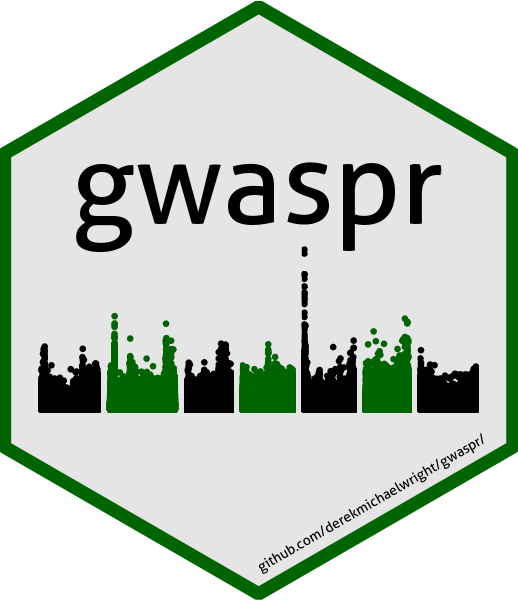

---

# Data

> - `r shiny::icon("save")` [myY.csv](myY.csv)
> - `r shiny::icon("save")` [myG_hmp.zip](myG_hmp.zip)
> - `r shiny::icon("save")` [myCV.csv](myCV.csv)
> - `r shiny::icon("save")` [myM.csv](myM.csv)

> - `myY.csv`: Phenotype file
> - `myG_hmp.csv`: Genotype file in hapmap format
> - `myCV.csv`: (Optional) Covariate file
> - `myM.csv`: (Optional) Metadata file for the genotypes.

All phenotype and genotype data is derived from and available at: https://knowpulse.usask.ca/

Associated papers:

- [Wright D & Neupane S, *et al*. (**2020**) **Understanding photothermal interactions can help expand production range and increase genetic diversity of lentil (*Lens culinaris* Medik.)**. *Plants, People, Planet*. 00:1-11. https://doi.org/10.1002/ppp3.10158](https://doi.org/10.1002/ppp3.10158)

- [Neupane S, Wright D, *et al* (**2022**) **Focusing the GWAS Lens on days to flower using latent variable phenotypes derived from global multi-environment trials**. *The Plant Genome*. e20269. https://doi.org/10.1002/tpg2.20269](https://doi.org/10.1002/tpg2.20269)

For this tutorial, we will use a Lentil Diversity Panel (**LDP**) consisting of 324 *Lens culinaris* cultivars, representative of the global genetic diversity of cultivated lentils.

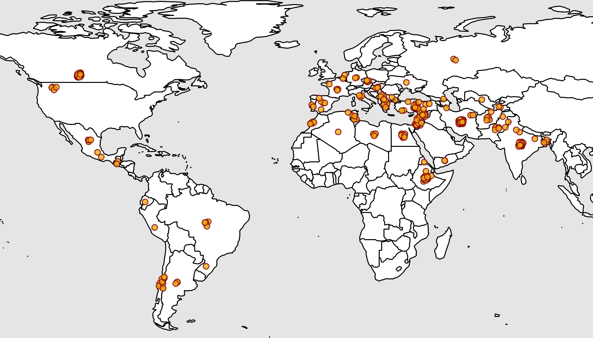

```{r echo = F, eval = F}
file.copy(from = "C:/gitfolder/dblogr/content/academic/lentil_diversity_panel/lentil_diversity_panel_02.png",
          to = "images_01_Lens_Origins.png", overwrite = T)
```

---

# Prepare Data

```{r class.source = 'fold-show'}
# devtools::install_github("derekmichaelwright/gwaspr")
library(gwaspr)
myCaption <- "www.dblogr.com/ or derekmichaelwright.github.io/dblogr/ | Data: AGILE"
```

```{r eval = F, echo = F}
############################
# Preparing phenotype data #
############################
library(agiler); library(agData)
#
x1 <- AGILE_LDP_Numeric %>% 
  select(Name, Testa_Pattern = Testa.Pattern) %>%
  mutate(Testa_Pattern = plyr::mapvalues(Testa_Pattern, 1:2, c("Absent", "Present")))
#
x2 <- AGILE_RawData %>% 
  agiler_fixOutliers() %>%
  agiler_tidy(9, matchColumn = "Excel", renameColumn = "Easy", na.rm = F) %>% 
  filter(Trait == "DTF", Expt %in% c("Bardiya 2017", "Sutherland 2017")) %>% 
  spread(Trait, Value) %>% #, Rep %in% 1:3
  group_by(Name, Expt) %>%
  summarise(DTF = mean(DTF, na.rm = T)) %>% 
  ungroup() %>%
  mutate(Expt = plyr::mapvalues(Expt, c("Bardiya 2017", "Sutherland 2017"), c("DTF_Nepal_2017","DTF_Sask_2017"))) %>%
  spread(Expt, DTF)
#
xx <- left_join(x1, x2, by = "Name") %>% 
  mutate(Name = gsub(" ", "_", Name),
         Name = gsub("-", "\\.", Name),
         Name = plyr::mapvalues(Name, "3156.11_AGL", "X3156.11_AGL")) %>%
  mutate(Name = plyr::mapvalues(Name, 
           c("X3156.11_AGL", "CDC_Asterix_AGL", "CDC_QG.1_AGL"),
           c("3156-11_AGL",  "CDC Asterix AGL", "CDC_QG-1_AGL")))
  #agiler_fixNames(AGILE_Syns_GWAS) %>%
  #mutate(Name = plyr::mapvalues(Name, c("X3156_11_AGL", "CDC_Asterix_AGL", "CDC_QG_1_AGL"), 
  #                                    c("3156-11_AGL",  "CDC Asterix AGL", "CDC_QG-1_AGL")))
write.csv(xx, "myY.csv", row.names = F)
#write.csv(AGILE_GeneList, "Data_GeneList.csv", row.names = F)
cv <- read.csv("https://raw.githubusercontent.com/derekmichaelwright/AGILE_LDP_Phenology/master/data/model_t%2Bp_coefs.csv") %>%
  select(Name, a, b, c) %>% 
  mutate(Name = gsub(" ", "_", Name),
         Name = gsub("-", "\\.", Name),
         Name = plyr::mapvalues(Name, "3156.11_AGL", "X3156.11_AGL"))
write.csv(cv, "myCV.csv", row.names = F)
```

Our population (The **LDP**) has been phenotyped for three traits:

- **Testa_Pattern**: a *qualitative* trait describing the presence or absence of seed coat pigmentation.
- **DTF_Nepal_2017**: a *quantitative* trait describing days from sowing to flowering in a 2017 Nepal field trial. 
- **DTF_Sask_2017**: a *quantitative* trait describing days from sowing to flowering in a 2017 Saskatchewan field trial. 

```{r}
myY <- read.csv("myY.csv")
DT::datatable(myY)
```

First we must convert our *qualitative trait* **Testa_Pattern** from `character` to `numeric` format.

```{r}
myY <- myY %>% 
  mutate(Testa_Pattern = plyr::mapvalues(Testa_Pattern, 
                                         c("Absent", "Present"), 1:2),
         Testa_Pattern = as.numeric(Testa_Pattern))
DT::datatable(myY)
```

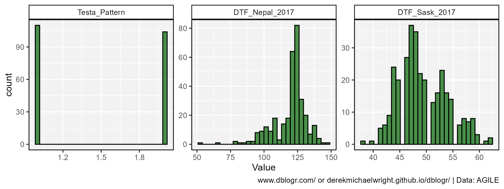

```{r}
# Prep data
xx <- myY %>%
  gather(Trait, Value, 2:ncol(.)) %>%
  mutate(Trait = factor(Trait, levels = unique(Trait)))
# Plot
mp <- ggplot(xx, aes(x = Value)) + 
  geom_histogram(color = "black", fill = "darkgreen", alpha = 0.7) + 
  facet_wrap(. ~ Trait, ncol = 3, scales = "free") +
  theme_gwaspr() +
  labs(caption = myCaption)
ggsave("Figures_01_myY_Phenotypes.png", mp, width = 8, height = 3)
```

---

## GWAS Results

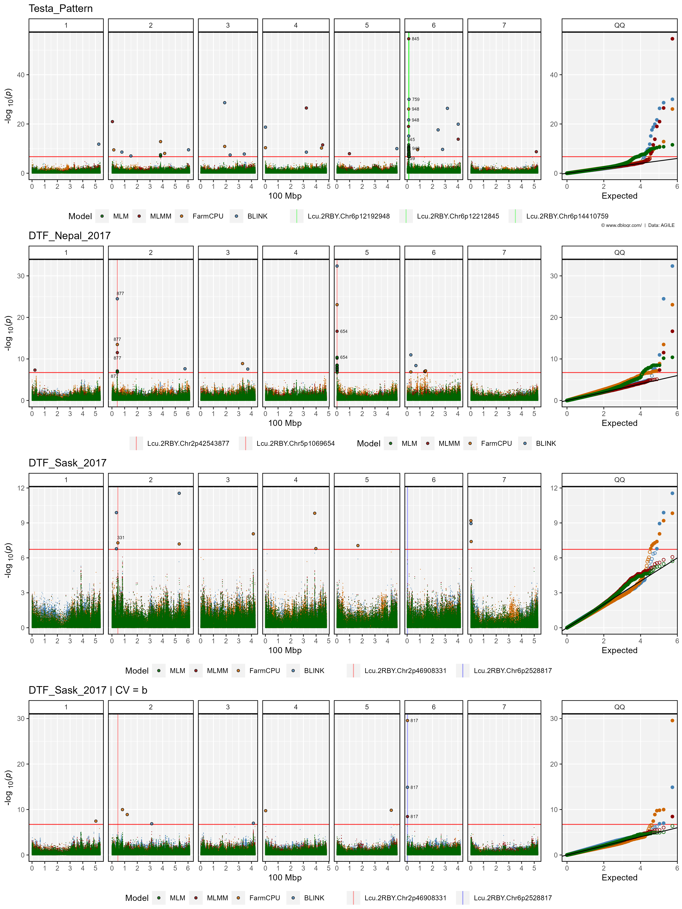

```{r echo = F}
im1 <- magick::image_read("Figures_Testa_Pattern_01_01.png")
im2 <- magick::image_read("Figures_DTF_Nepal_2017_01_01.png")
im3 <- magick::image_read("Figures_DTF_Sask_2017_01_01.png")
im4 <- magick::image_read("Figures_DTF_Sask_2017_01_02.png")
im <- magick::image_append(c(im1,im2,im3,im4), stack = T)
magick::image_write(im, "Figures_All_Results.png")
```

---

## Genotype Data

The LDP was genotyped using an *exome caputure array* and filtered with the following criteria to yield a data set of 276,984 SNPs, stored in our object `myG`.

- Only Bi-allelic           =  TRUE
- Minimum Read Depth        =  3
- Minor Allele Frequency    = >5%
- Maximum Missing Frequency =  20%
- Heterozygous              = <20%

```{r}
myG <- read.csv("myG_hmp.csv", header = F)
myG[1:10,1:11] # Map + marker Info
myG[1:10,12:17] # genotrype calls
```

---

## Covariates + Kinship

GAPIT will automatically calculate kinship matrices and performs PCA on the genotype data to be used as a covariate to account for population structure. However, custom Kinship matrices and covariates can be used as well. Just make sure they are formatted similar to the output files `GAPIT` uses for covariates and kinship.

`r shiny::icon("save")` [GWAS_Results/GAPIT.Genotype.PCA.csv](GWAS_Results/GAPIT.Genotype.PCA.csv)

`r shiny::icon("save")` [GWAS_Results/GAPIT.Genotype.Kin_Zhang.csv](GWAS_Results/GAPIT.Genotype.Kin_Zhang.csv)

```{r}
myCV <- read.csv("GWAS_Results/GAPIT.Genotype.PCA.csv")
myCV[1:10,]
myK <- read.csv("GWAS_Results/GAPIT.Genotype.Kin_Zhang.csv", header = F)
myK[1:10,1:5]
```

---

# Common Errors

There are a number of common errors one might encounter when attempting to do GWAS with GAPIT. We will go through a few of these:

## Incorect data uploading 

`myG <- read.csv("Genotype_Data.csv", header = T)` when it should be `header = F`

Notice how the first row of our genotype data is actually the column names.

## Numeric Phenotype Data

For our qualitative trait **Testa_Pattern**, we needed to convert

- `Absent` to `1` 
- `Present` to `2`

## Genotype Names

Genotype names not matching between the phenotype file and genotype file is an easy error to miss. `R` does not like column names that begin with a number. *E.g.*, the genotype `3156-11_AGL` should have its named changed to `X3156-11_AGL`. Another common problem can come from dashses (`-`) and periods (`.`), *E.g.*. `CDC_QG.1_AGL` or `CDC_QG-1_AGL`, or spaces (` `) and underscores (`_`), *E.g.*, `CDC Asterix AGL` or `CDC_Asterix_AGL`.

```{r}
setdiff(myY$Name, t(myG[1,])) # should be character(0)
setdiff(t(myG[1,]), myY$Name) # should show just the first 11 columns of myG
```

```{r}
myY <- myY %>% 
  mutate(Name = plyr::mapvalues(Name, 
           c("3156-11_AGL",  "CDC Asterix AGL", "CDC_QG-1_AGL"), 
           c("X3156.11_AGL", "CDC_Asterix_AGL", "CDC_QG.1_AGL")))
```

```{r}
setdiff(myY$Name, t(myG[1,])) # should be character(0)
setdiff(t(myG[1,]), myY$Name) # should show just the first 11 columns of myG
```

---

# Run GWAS with GAPIT

## Install GAPIT

```{r eval = F, echo = F}
install.packages("BiocManager")
BiocManager::install("multtest")
install.packages("gplots")
install.packages("LDheatmap")
install.packages("genetics")
install.packages("ape")
install.packages("EMMREML")
install.packages("scatterplot3d")
```

```{r eval = F, echo = F}
#source("http://www.bioconductor.org/biocLite.R")
devtools::install_github("YaoZhou89/BLINK")
devtools::install_github("SFUStatgen/LDheatmap")
BiocManager::install("snpStats")
```

```{r eval = F, echo = F}
library(multtest)
library(gplots)
library(LDheatmap)
library(genetics)
library(ape)
library(EMMREML)
library(compiler)
library(scatterplot3d)
source("http://zzlab.net/GAPIT/GAPIT.library.R")
source("http://zzlab.net/GAPIT/gapit_functions.txt")
```

<i class="fa-brands fa-github"></i> Github: [https://github.com/jiabowang/GAPIT3](https://github.com/jiabowang/GAPIT3)

```{r eval = F}
devtools::install_github("jiabowang/GAPIT3", force=TRUE)
```

## Load GAPIT

```{r eval = F}
library(GAPIT3)
```

## GWAS Models

- `GLM` General Linear Model: uses population structure (Q) as a cofactor. 
- `MLM` [Mixed Linear Model](https://www.nature.com/articles/ng1702): adds Kinship (K) as a random effect. AKA a Q+K model. 
- `CMLM` Compressed Mixed Linear Model: reduces the confounding effect between the testing markers and the individuals genetic effects by replacing them with their corresponding groups based on cluster analysis defined by the user. MLM is the equivelent of each individual being its own group, and GLM is the equivlent of having only one group for all individuals.
- `MLMM` [Multiple Locus Mixed Linear Model](https://www.nature.com/articles/ng.2314): uses forward-backward stepwise linear mixed-model regression to include associated markers as covariates.
- `SUPER` [Settlement of MLM Under Progressively Exclusive Relationship](https://journals.plos.org/plosone/article?id=10.1371/journal.pone.0107684):  uses a FaST-LMM algorithm to solve a computational burden for large samples. K is derived from a smaller number of associated markers.
- `FarmCPU` [Fixed and random model Circulating Probability Unification](https://journals.plos.org/plosgenetics/article?id=10.1371/journal.pgen.1005767): uses iterations to fit associated markers selected using a maximum likelhood methodas cofactors.
- `BLINK` [BLINK](): similar to FarmCPU but eliminates the assumption of causal genes are evenly distributed accross the genome. Markers that are in LD with the most significant marker are excluded. Also uses a different method to determine markers for K (BIC).

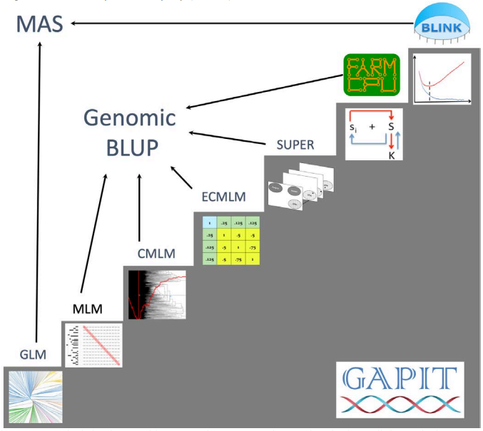

## Run GWAS

For our purposes we will run GWAS with the following models: `GLM`, `MLM`, `MLMM`, `FarmCPU`, `BLINK`.

```{r eval = F}
dir.create("GWAS_Results/")
setwd("GWAS_Results/")
# MLM
GWAS <- GAPIT( Y = myY, G = myG, PCA.total = 4, model = "MLM")
# MLMM
GWAS <- GAPIT( Y = myY, G = myG, PCA.total = 4, model = "MLMM")
# FarmCPU
GWAS <- GAPIT( Y = myY, G = myG, PCA.total = 4, model = "FarmCPU")
# BLINK
GWAS <- GAPIT( Y = myY, G = myG, PCA.total = 4, model = "BLINK")
# GLM
GWAS <- GAPIT( Y = myY, G = myG, PCA.total = 4, model = "GLM")
```

or

```{r eval = F}
GWAS <- GAPIT(
  Y = myY,
  G = myG,
  PCA.total = 4,
  model = c("GLM"", MLM", "MLMM", "FarmCPU", "BLINK") )
```

```{r echo = F, eval = F}
# CMLM
GWAS <- GAPIT( Y = myY, G = myG, PCA.total = 4, model = "CMLM" )
# SUPER
GWAS <- GAPIT( Y = myY, G = myG, PCA.total = 4, model = "SUPER" )
```

---

# PCA.total = ?

why set `PCA.total = 4`? Principle components of the marker data are used to account for population structure. By plotting our eigenvalues by the number of principle components we can use the "kink method" to choose how many PCs to use in our GWAS. From PC4 to PC5, there is little change in the eigenvalues, meaning that additional PCs will not account for more of the variance within our data (i.e., they are unnecessary). 

However, in our case, we are using an output (the PCA of our marker data) from the GWAS to make this decision. If this is your first time running a GWAS, setting `PCA.total = 3` is good practice, as your GWAS can be easily rerun if you later determine you need to adjust settings. 

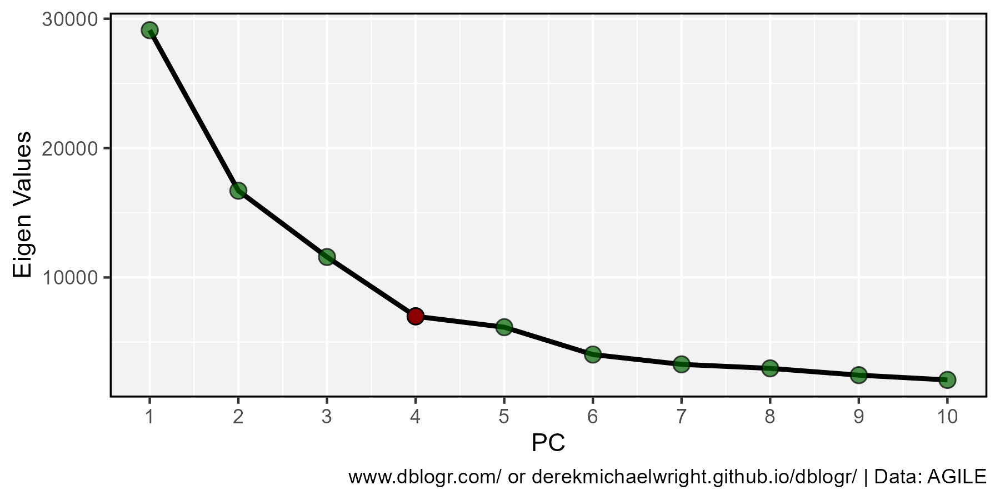

```{r}
xx <- read.csv("GWAS_Results/GAPIT.Genotype.PCA_eigenvalues.csv") %>% slice(1:10) %>%
  mutate(y = x, x = 1:10)
mp <- ggplot(xx,  aes(x = x, y = y)) + 
  geom_line(size = 1) + 
  geom_point(size = 3, pch = 21, fill = "darkgreen", alpha = 0.7) +
  geom_point(data = xx %>% slice(4), size = 3, pch = 21, fill = "darkred") +
  scale_x_continuous(breaks = 1:10) +
  theme_gwaspr() +
  labs(x = "PC", y = "Eigen Values", caption = myCaption)
ggsave("Figures_02_Eigen_Values.png", width = 6, height = 3)
```

---

## User-inputted Kinship and Covariates

We will rerun GWAS on the DTF traits using the *b* coefficient from a photothermal model derived from [**Wright *et al*. (2020)**](https://dblogr.com/academic/phenology_paper/). This should act to remove or diminish temperature related associations, and thus emphasize photoperiod related associations.

```{r}
myCV <- read.csv("myCV.csv")[,c("Name","b")] %>%
  mutate(b = round(b * 10000, 3))
myCV[1:20,]
```

```{r eval = F}
dir.create("GWAS_Results_CV_b/")
setwd("GWAS_Results_CV_b/")
# set PCA.total = 0
# MLM
GWAS <- GAPIT(Y = myY[,c("Name","DTF_Sask_2017")], model = "MLM", 
              G = myG, K = myK, CV = myCV, PCA.total = 0)
# MLMM
GWAS <- GAPIT(Y = myY[,c("Name","DTF_Sask_2017")], model = "MLMM", 
              G = myG, K = myK, CV = myCV, PCA.total = 0)
# FarmCPU
GWAS <- GAPIT(Y = myY[,c("Name","DTF_Sask_2017")], model = "FarmCPU", 
              G = myG, K = myK, CV = myCV, PCA.total = 0)
# BLINK
GWAS <- GAPIT(Y = myY[,c("Name","DTF_Sask_2017")], model = "BLINK", 
              G = myG, K = myK, CV = myCV, PCA.total = 0)
# GLM
GWAS <- GAPIT(Y = myY[,c("Name","DTF_Sask_2017")], model = "GLM", 
              G = myG, K = myK, CV = myCV, PCA.total = 0)
```

---

# Post GWAS Preparation

After running a genome-wide association study, there are some quality control and post-GWAS steps we can take to evaluate our results and identify false positives. 

---

## Prepare Data

Convert our `Testa_Pattern` back to its character values.

```{r}
myY <- myY %>% 
  mutate(Testa_Pattern = plyr::mapvalues(Testa_Pattern, c(1,2), c("Absent","Present")))
```

Reread in our `myG` file but with `header = T`. 

```{r}
myG <- read.csv("myG_hmp.csv", header = T)
```

Create table for DNA codes.

```{r}
dna <- data.frame(stringsAsFactors = F,
  Symbol = c("A", "C", "G", "T", "U", "R", "Y", "S", "W", "K", "M", "N"),
  Value  = c("AA","CC","GG","TT","UU","AG","CT","GC","AT","GT","AC","NN") )
knitr::kable(t(dna))
```

---

## Significance threshold

- suggestive association = $p<5*10^{-6}=0.000005$ -> -log10(0.000005) = 5.3
- bonferroni threshold = $p<5*10^{-8}=0.00000005$ -> -log10(0.00000005) = 7.3
- custom threshold = $p<0.05/n(markers)=0.05/276984=0.0000001805158$ -> -log10(0.05/276984) = 6.7

Calculate significance threshold

```{r}
-log10(0.000005)
-log10(0.00000005)
-log10( 0.05 / (nrow(myG)-1) )
-log10( 0.01 / (nrow(myG)-1) )
```

---

# Testa Pattern

Since this is a simpler qualitative trait, we can assume there should be 1 large effect QTL. Because of this, we can also assume that the `MLMM` `FarmCPU` and `BLINK` methods should produce a number of false positives.

---

## Manhattan Plots

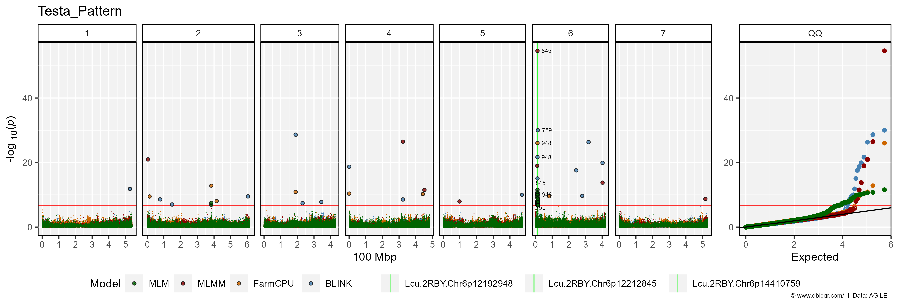

```{r echo = T, eval = F}
mp <- gg_Manhattan(folder = "GWAS_Results/", 
                   trait = "Testa_Pattern", 
                   markers = c("Lcu.2RBY.Chr6p12212845",
                               "Lcu.2RBY.Chr6p12192948",
                               "Lcu.2RBY.Chr6p14410759"),
                   labels = c("845","948","759"),
                   vline.colors = rep("green", 3),
                   facet = F, vline.legend = T,
                   models = c("MLM","MLMM","FarmCPU","BLINK")) %>%
  annotate_figure(fig.lab.pos = "bottom.right", fig.lab.size = 6,
                  fig.lab = myCaption)
ggsave("Figures_Testa_Pattern_01_01.png", mp, width = 12, height = 4, bg = "white")
```

---

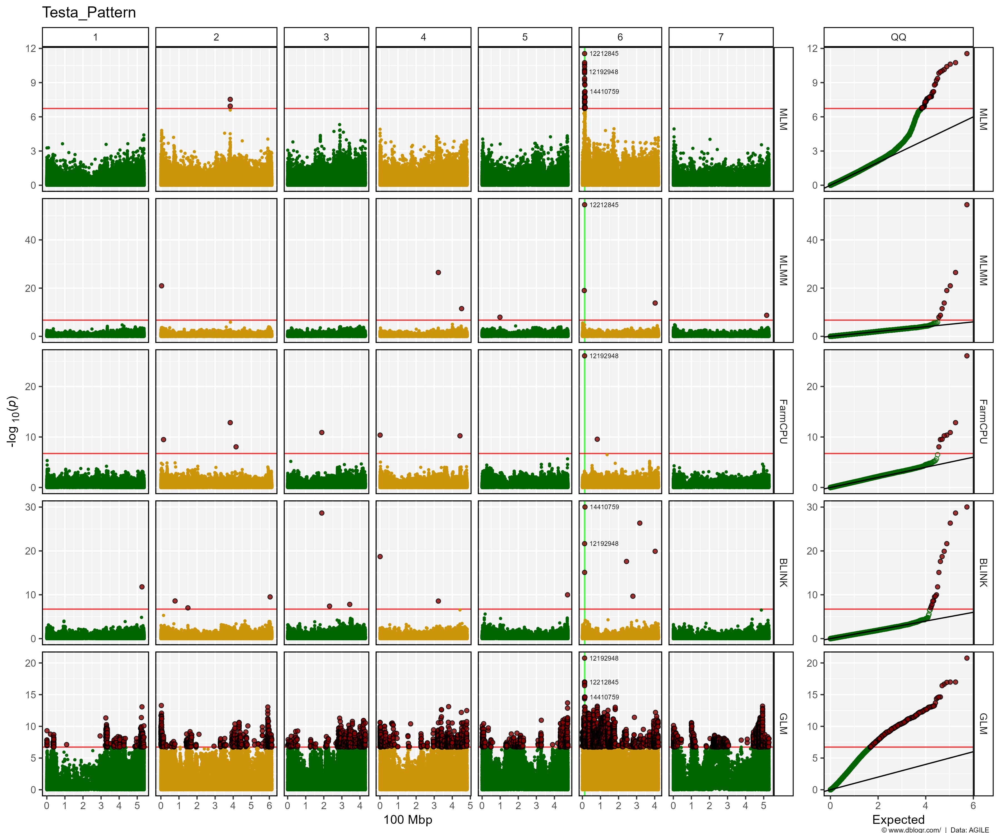

```{r echo = T, eval = F}
mp <- gg_Manhattan(folder = "GWAS_Results/", 
                   trait = "Testa_Pattern", 
                   markers = c("Lcu.2RBY.Chr6p12212845",
                               "Lcu.2RBY.Chr6p12192948",
                               "Lcu.2RBY.Chr6p14410759"),
                   labels = c("12212845","12192948","14410759"), 
                   vline.colors = rep("green", 3),
                   facet = T, vline.legend = T) %>%
  annotate_figure(fig.lab.pos = "bottom.right", fig.lab.size = 6,
                  fig.lab = myCaption)
ggsave("Figures_Testa_Pattern_02_01.png", mp, width = 12, height = 10)
```

The MLM method appears to be the most appropriate with the lowest amount of potential false positives. The Additive model produced one very strong association peak, while the Dominant Model produced two. 

---

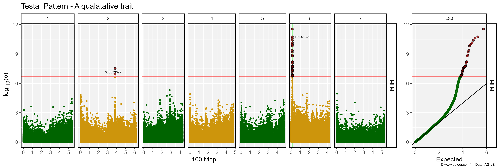

```{r echo = T, eval = F}
mp <- gg_Manhattan(folder = "GWAS_Results/", 
                   trait = "Testa_Pattern", 
                   title = "Testa_Pattern - A qualatative trait", 
                   markers = c("Lcu.2RBY.Chr6p12213490", 
                               "Lcu.2RBY.Ch6p12212845",
                               "Lcu.2RBY.Chr2p383533077"),
                   labels = c("12192948", "12212845", "383533077"),
                   vline.colors = rep("green", 3),
                   facet = T, vline.legend = T,
                   models = "MLM") %>%
  annotate_figure(fig.lab.pos = "bottom.right", fig.lab.size = 6,
                  fig.lab = myCaption)
ggsave("Figures_Testa_Pattern_03_01.png", mp, width = 12, height = 4)
```

---

## Markers

```{r}
list_Top_Markers(trait = "Testa_Pattern", model = "FarmCPU",
                 folder = "GWAS_Results/", chroms = 6, n = 1)
list_Top_Markers(trait = "Testa_Pattern", model = "BLINK",
                 folder = "GWAS_Results/", chroms = 6, n = 1)
list_Top_Markers(trait = "Testa_Pattern", model = "MLM",
                 folder = "GWAS_Results/", chroms = c(2, 6), n = 1)
```

---

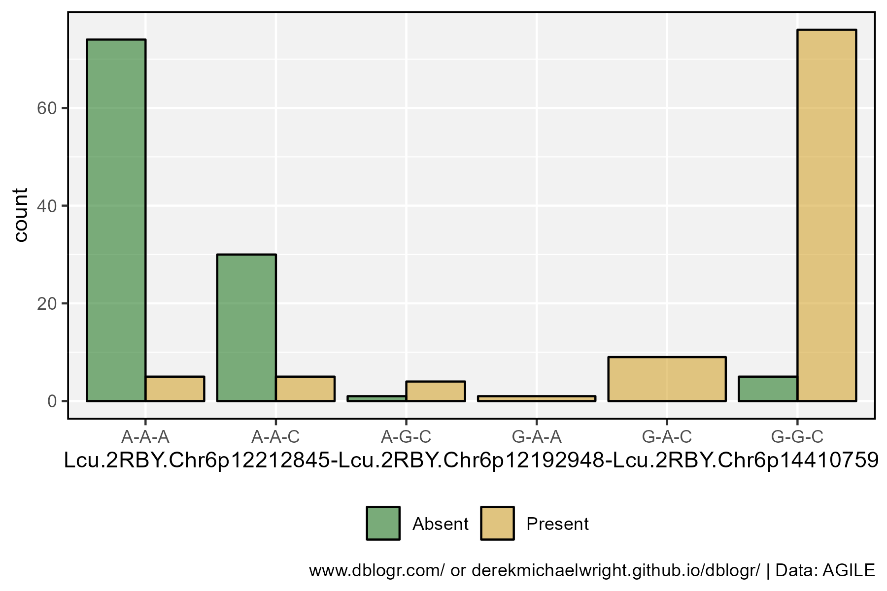

```{r echo = T, eval = F}
mp <- gg_Marker(myG, myY, trait = "Testa_Pattern", type = "bar",
                marker = "Lcu.2RBY.Chr6p12213490") +
  labs(caption = myCaption)
ggsave("Figures_Testa_Pattern_04_01.png", mp, width = 6, height = 4)
```

---

The peak on Chr 2 is a false positive.

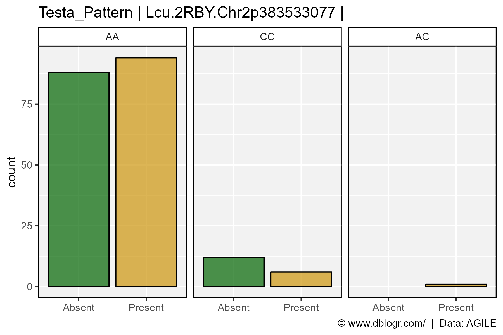

```{r echo = T, eval = F}
mp <- gg_Marker(myG, myY, trait ="Testa_Pattern", type = "bar",
                marker = "Lcu.2RBY.Chr2p383533077") +
  labs(caption = myCaption)
ggsave("Figures_Testa_Pattern_04_02.png", mp, width = 6, height = 4)
```

---

## Chr 6 Association

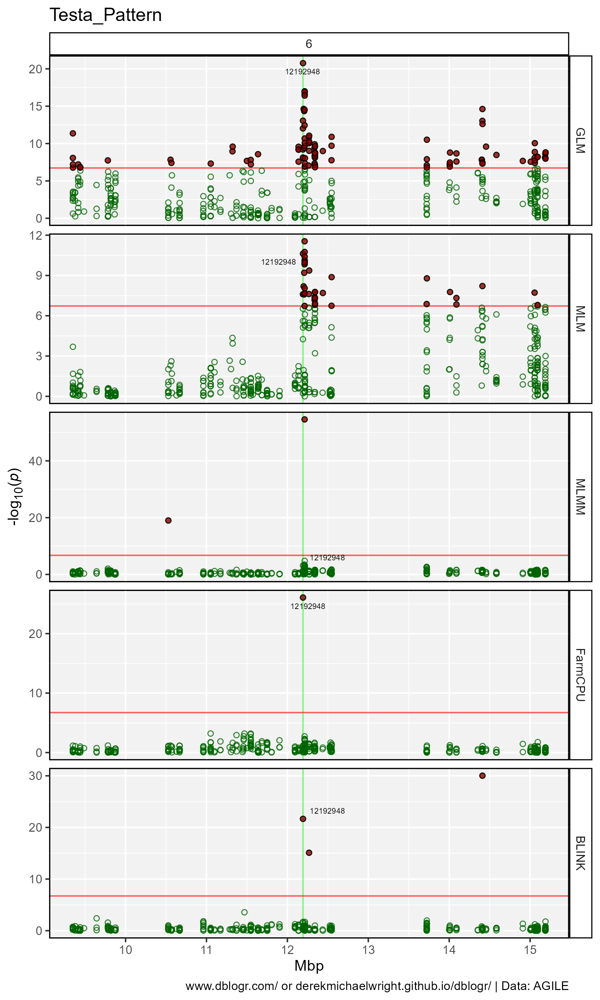

```{r echo = T, eval = F}
mp <- gg_Manhattan_Zoom(folder = "GWAS_Results/", 
                        trait = "Testa_Pattern", 
                        chr = 6,
                        markers = "Lcu.2RBY.Chr6p12192948", 
                        labels = "12192948", 
                        vline.color = "green",
                        start = 12192948 - 3000000, 
                        end = 12192948 + 3000000) +
  labs(caption = myCaption)
ggsave("Figures_Testa_Pattern_05_01.png", mp, width = 6, height = 10)
```

---

## Volcano Plot

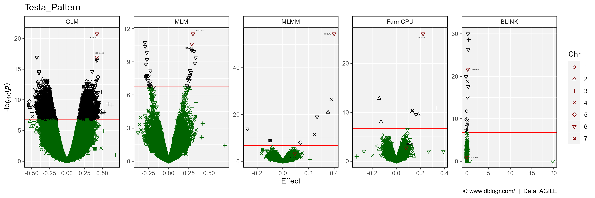

```{r echo = T, eval = F}
mp <- gg_Volcano(folder = "GWAS_Results/", 
                 trait = "Testa_Pattern",
                 markers = c("Lcu.2RBY.Chr6p12192948",
                             "Lcu.2RBY.Chr6p12212845"), 
                 labels = c("12192948", "12212845")) +
  labs(caption = myCaption)
ggsave("Figures_Testa_Pattern_06_01.png", mp, width = 12, height = 4)
```

---

# DTF Nepal 2017

Since Days To Flower (DTF) is a quantitative trait, we can expect many smaller effect QTLs.

## Manhattan Plots

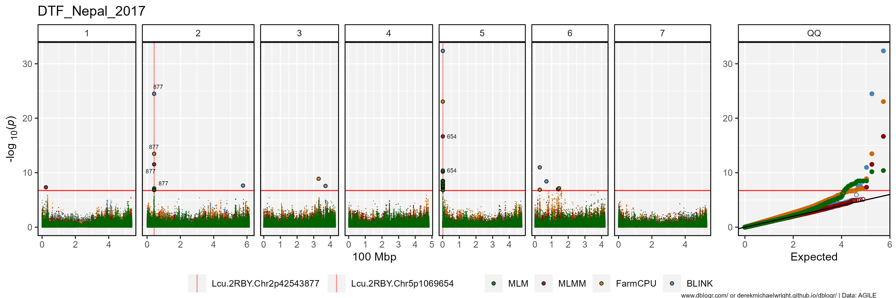

```{r echo = T, eval = F}
mp <- gg_Manhattan(folder = "GWAS_Results/", 
                   trait = "DTF_Nepal_2017", 
                   markers = c("Lcu.2RBY.Chr2p42543877",
                               "Lcu.2RBY.Chr5p1069654"),
                   labels = c("877", "654"),
                   vline.colors = rep("red", 2),
                   facet = F, vline.legend = T,
                   models = c("MLM","MLMM","FarmCPU","BLINK")) %>%
  annotate_figure(fig.lab.pos = "bottom.right", fig.lab.size = 6,
                  fig.lab = myCaption)
ggsave("Figures_DTF_Nepal_2017_01_01.png", mp, width = 12, height = 4, bg = "white")
```

---


```{r echo = T, eval = F}
mp <- gg_Manhattan(folder = "GWAS_Results/", 
                   trait = "DTF_Nepal_2017", 
                   markers = c("Lcu.2RBY.Chr2p42543877", 
                               "Lcu.2RBY.Chr5p1069654"),
                   labels = c("42543877", "1069654"),
                   vline.colors = rep("red", 2),
                   facet = T, vline.legend = T) %>%
  annotate_figure(fig.lab.pos = "bottom.right", fig.lab.size = 6,
                  fig.lab = myCaption)
ggsave("Figures_DTF_Nepal_2017_02_01.png", mp, width = 12, height = 10)
```

---

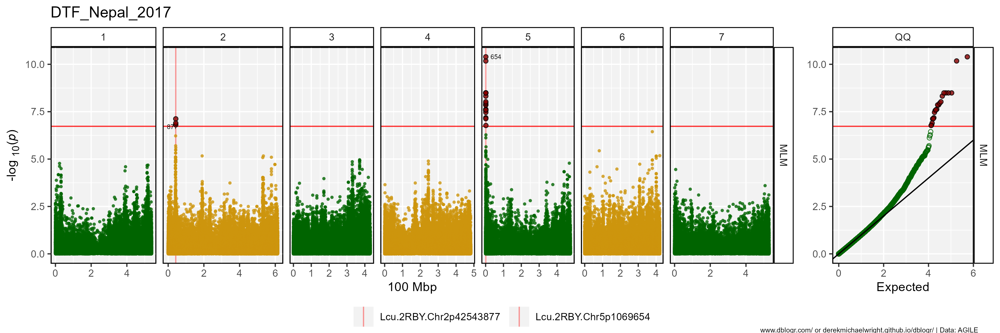

```{r echo = T, eval = F}
mp <- gg_Manhattan(folder = "GWAS_Results/", 
                   trait = "DTF_Nepal_2017", 
                   markers = c("Lcu.2RBY.Chr2p42543877", 
                               "Lcu.2RBY.Chr5p1069654"),
                   labels = c("877", "654"),
                   vline.colors = rep("red", 2),
                   facet = T, 
                   models = "MLM") %>%
  annotate_figure(fig.lab.pos = "bottom.right", fig.lab.size = 6,
                  fig.lab = myCaption)
ggsave("Figures_DTF_Nepal_2017_03_01.png", mp, width = 12, height = 4)
```

```{r echo = F, eval = F}
ggsave("featured.png", mp, width = 12, height = 4)
```

---

## Markers

2 strong association peaks can be identified on chromosomes 2 and 5.

```{r}
list_Top_Markers(trait = "DTF_Nepal_2017", 
                 model = "MLM",
                 folder = "GWAS_Results/", 
                 threshold = 6.7, 
                 chroms = c(2,5), n = 2)
```

---

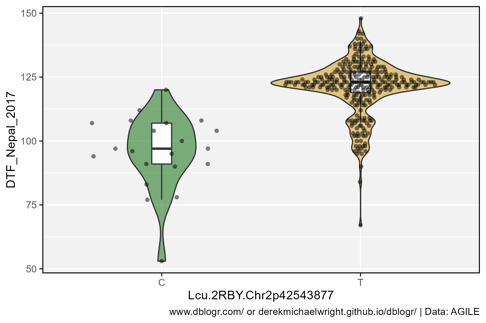

```{r echo = T, eval = F}
mp <- gg_Marker(myG, myY, trait = "DTF_Nepal_2017", type = "box",
                marker = "Lcu.2RBY.Chr2p42543877") +
  labs(caption = myCaption)
ggsave("Figures_DTF_Nepal_2017_04_01.png", mp, width = 6, height = 4)
```

---

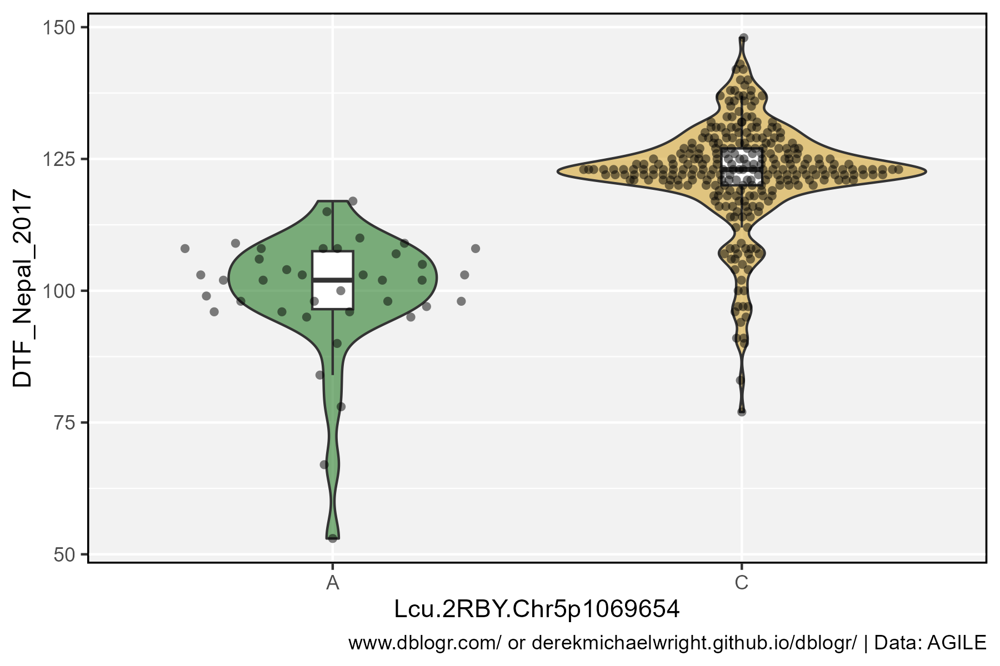

```{r echo = T, eval = F}
mp <- gg_Marker(myG, myY, trait = "DTF_Nepal_2017", type = "box", 
                marker = "Lcu.2RBY.Chr5p1069654") +
  labs(caption = myCaption)
ggsave("Figures_DTF_Nepal_2017_04_02.png", mp, width = 6, height = 4)
```

---

Now lets plot both markers

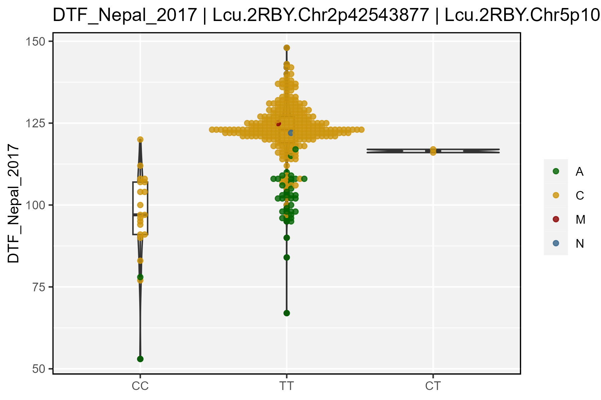

```{r echo = T, eval = F}
mp <- gg_Marker(myG, myY, trait = "DTF_Nepal_2017", type = "box",
                marker = "Lcu.2RBY.Chr2p42543877",  
                marker2 = "Lcu.2RBY.Chr5p1069654") +
  labs(caption = myCaption)
ggsave("Figures_DTF_Nepal_2017_04_03.png", mp, width = 6, height = 4)
```

---

## Chr 2 Association

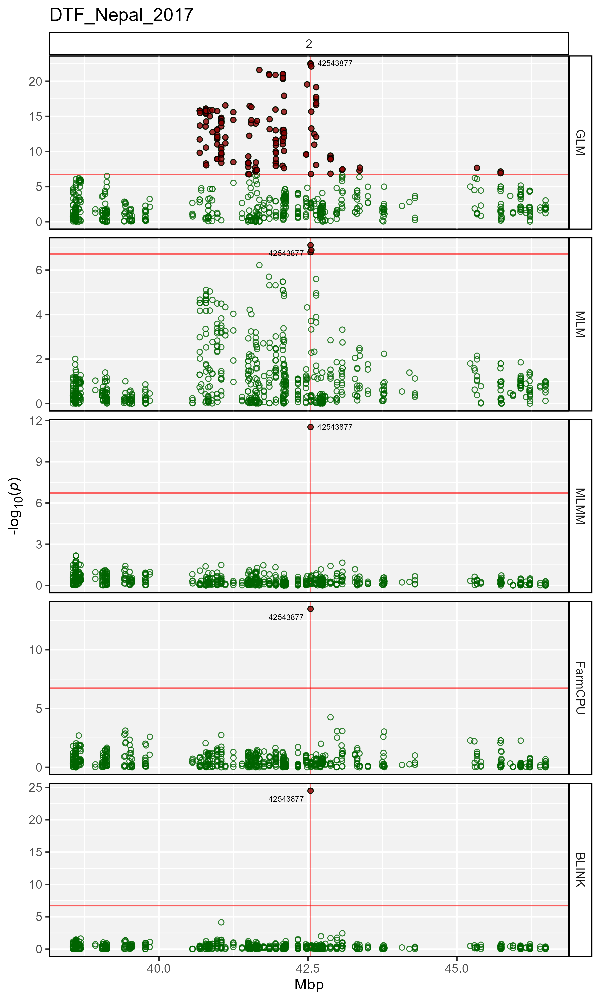

```{r echo = T, eval = F}
mp <- gg_Manhattan_Zoom(folder = "GWAS_Results/", 
                        trait = "DTF_Nepal_2017", 
                        chr = 2, 
                        markers = "Lcu.2RBY.Chr2p42543877", 
                        labels = "42543877", 
                        vline.color = "red",
                        start = 42543877 - 4000000, 
                        end = 42543877 + 4000000) +
  labs(caption = myCaption)
ggsave("Figures_DTF_Nepal_2017_05_01.png", mp, width = 6, height = 10)
```

---

## Chr 5 Association

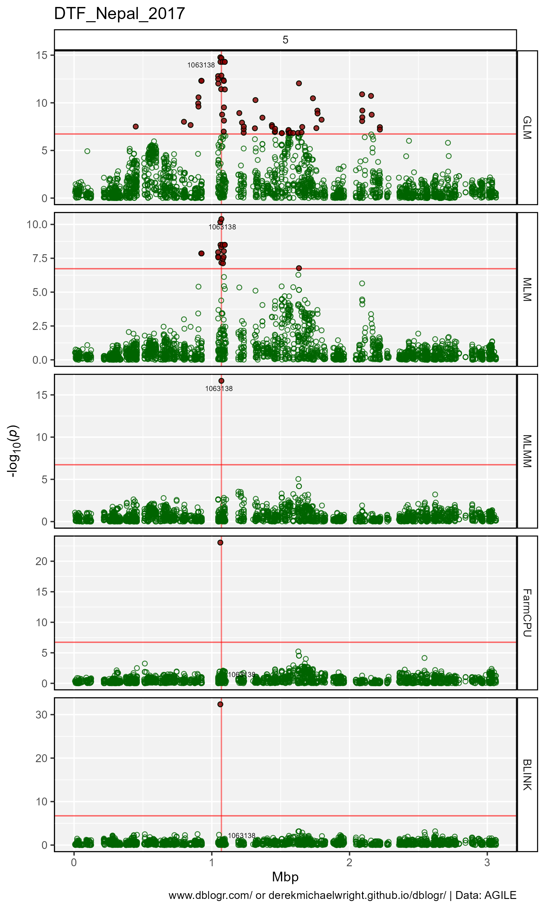

```{r echo = T, eval = F}
mp <- gg_Manhattan_Zoom(folder = "GWAS_Results/", 
                        trait = "DTF_Nepal_2017", 
                        chr = 5, 
                        markers = "Lcu.2RBY.Chr5p1069654", 
                        labels = "1063138", 
                        vline.color = "red",
                        start = 1063138	 - 2000000, 
                        end = 1063138	 + 2000000) +
  labs(caption = myCaption)
ggsave("Figures_DTF_Nepal_2017_05_02.png", mp, width = 6, height = 10)
```

---

## Volcano Plot


```{r echo = T, eval = F}
mp <- gg_Volcano(folder = "GWAS_Results/", trait = "DTF_Nepal_2017") +
  labs(caption = myCaption)
ggsave("Figures_DTF_Nepal_2017_06_01.png", mp, width = 12, height = 4)
```

---

# DTF Sask 2017

Saskatchewan has drastically different temperature and photoperiods than Nepal, so we should expect different associations.

## Manhattan Plots

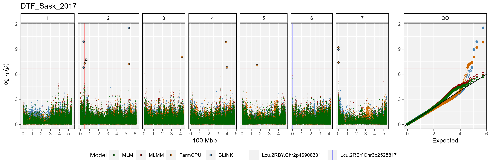

```{r echo = T, eval = F}
mp <- gg_Manhattan(folder = "GWAS_Results/", 
                   trait = "DTF_Sask_2017", 
                   markers = c("Lcu.2RBY.Chr2p46908331", 
                               "Lcu.2RBY.Chr6p2528817"),
                   labels = c("331", "817"),
                   vline.colors = c("red","blue"),
                   facet = F, vline.legend = T,
                   models = c("MLM","MLMM","FarmCPU","BLINK")) %>%
  annotate_figure(fig.lab.pos = "bottom.right", fig.lab.size = 6,
                  fig.lab = myCaption)
ggsave("Figures_DTF_Sask_2017_01_01.png", mp, width = 12, height = 4, bg = "white")
```

---

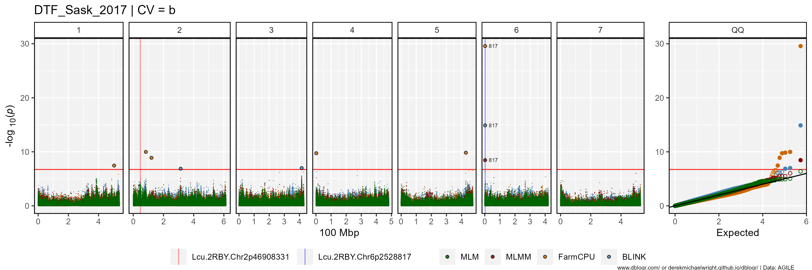

```{r echo = T, eval = F}
mp <- gg_Manhattan(folder = "GWAS_Results_CV_b/", 
                   trait = "DTF_Sask_2017", 
                   title = "DTF_Sask_2017 | CV = b", 
                   markers = c("Lcu.2RBY.Chr2p46908331", 
                               "Lcu.2RBY.Chr6p2528817"),
                   labels = c("331", "817"),
                   vline.colors = c("red","blue"),
                   facet = F, vline.legend = T,
                   models = c("MLM","MLMM","FarmCPU","BLINK")) %>%
  annotate_figure(fig.lab.pos = "bottom.right", fig.lab.size = 6,
                  fig.lab = myCaption)
ggsave("Figures_DTF_Sask_2017_01_02.png", mp, width = 12, height = 4, bg = "white")
```

---

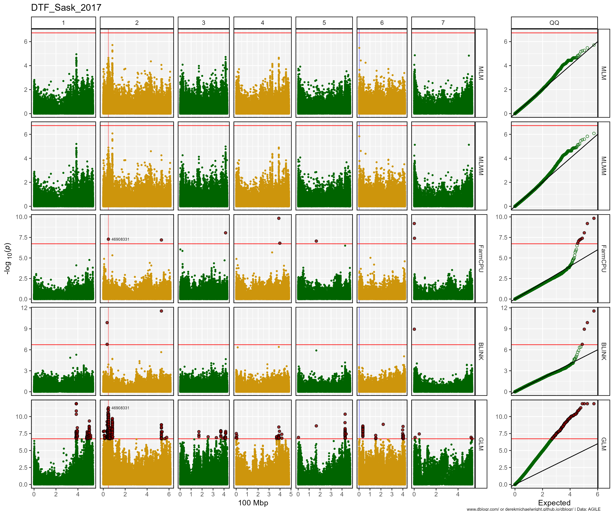

```{r echo = T, eval = F}
mp <- gg_Manhattan(folder = "GWAS_Results/", 
                   trait = "DTF_Sask_2017", 
                   markers = c("Lcu.2RBY.Chr2p46908331", 
                               "Lcu.2RBY.Chr6p2528817"),
                   labels = c("46908331", "2528817"),
                   vline.colors = c("red","blue"),
                   facet = T, vline.legend = T) %>%
  annotate_figure(fig.lab.pos = "bottom.right", fig.lab.size = 6,
                  fig.lab = myCaption)
ggsave("Figures_DTF_Sask_2017_02_01.png", mp, width = 12, height = 10)
```

---

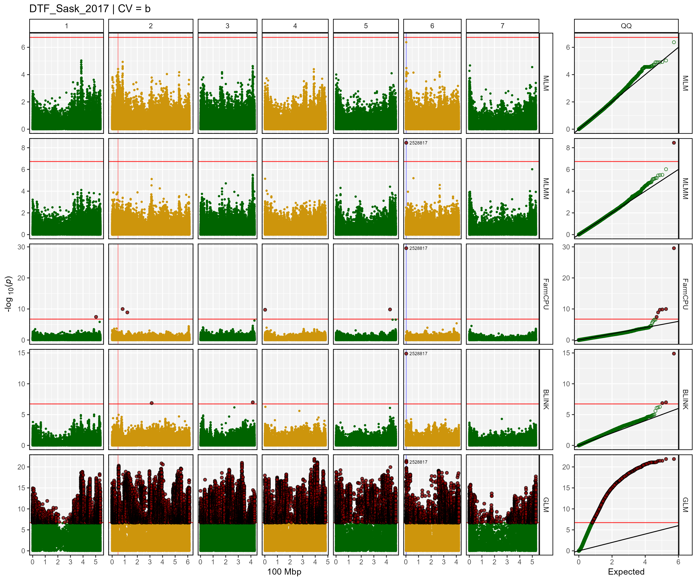

```{r echo = T, eval = F}
mp <- gg_Manhattan(folder = "GWAS_Results_CV_b/", 
                   trait = "DTF_Sask_2017", 
                   title = "DTF_Sask_2017 | CV = b",
                   markers = c("Lcu.2RBY.Chr2p46908331", 
                               "Lcu.2RBY.Chr6p2528817"),
                   labels = c("46908331", "2528817"),
                   vline.colors = c("red","blue"),
                   facet = T, vline.legend = T) %>%
  annotate_figure(fig.lab.pos = "bottom.right", fig.lab.size = 6,
                  fig.lab = myCaption)
ggsave("Figures_DTF_Sask_2017_02_02.png", mp, width = 12, height = 10)
```

---

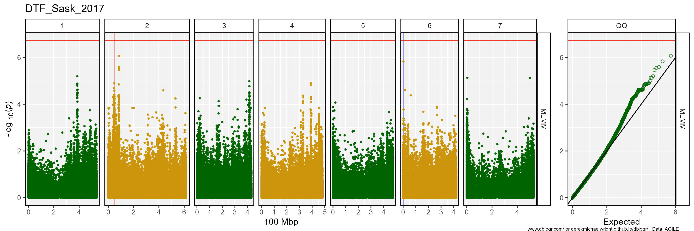

```{r echo = T, eval = F}
mp <- gg_Manhattan(folder = "GWAS_Results/",
                   trait = "DTF_Sask_2017", 
                   markers = c("Lcu.2RBY.Chr2p46908331", 
                               "Lcu.2RBY.Chr6p2528817"),
                   labels = c("46908331", "2528817"),
                   vline.colors = c("red","blue"),
                   facet = T, vline.legend = T,
                   models = "MLMM") %>%
  annotate_figure(fig.lab.pos = "bottom.right", fig.lab.size = 6,
                  fig.lab = myCaption)
ggsave("Figures_DTF_Sask_2017_03_01.png", mp, width = 12, height = 4)
```

---

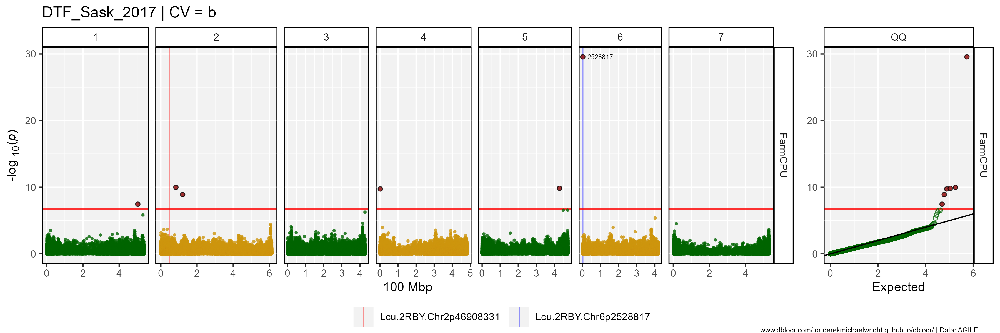

```{r echo = T, eval = F}
mp <- gg_Manhattan(folder = "GWAS_Results_CV_b/", 
                   trait = "DTF_Sask_2017", 
                   title = "DTF_Sask_2017 | CV = b",
                   markers = c("Lcu.2RBY.Chr2p46908331", 
                               "Lcu.2RBY.Chr6p2528817"),
                   labels = c("46908331", "2528817"),
                   vline.colors = c("red","blue"),
                   facet = T, vline.legend = T,
                   models = "FarmCPU") %>%
  annotate_figure(fig.lab.pos = "bottom.right", fig.lab.size = 6,
                  fig.lab = myCaption)
ggsave("Figures_DTF_Sask_2017_03_02.png", mp, width = 12, height = 4)
```

---

## Markers

```{r}
list_Top_Markers(trait = "DTF_Sask_2017", model = "FarmCPU",
                 folder = "GWAS_Results/", n = 1, threshold = 6.7)
list_Top_Markers(trait = "DTF_Sask_2017", model = "MLM",
                 folder = "GWAS_Results/", chroms = 6, n = 1)
```

---

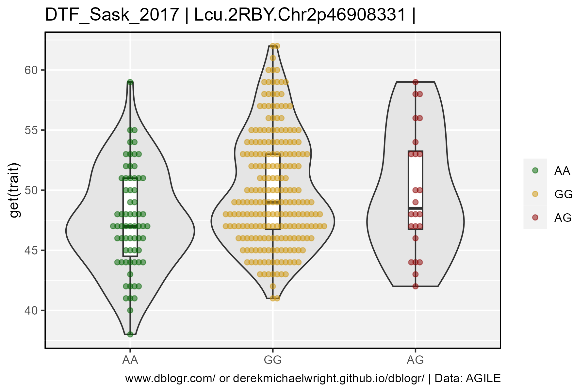

```{r echo = T, eval = F}
mp <- gg_Marker(myG, myY, trait = "DTF_Sask_2017", type = "box", 
                marker = "Lcu.2RBY.Chr2p46908331") +
  labs(caption = myCaption)
ggsave("Figures_DTF_Sask_2017_04_01.png", mp, width = 6, height = 4)
```

---

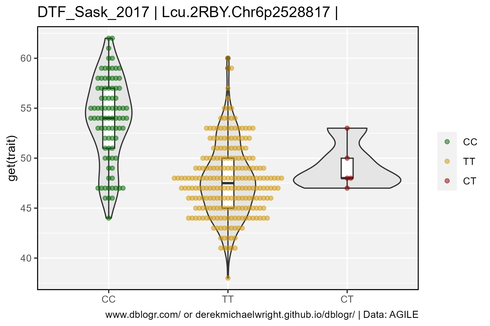

```{r echo = T, eval = F}
mp <- gg_Marker(myG, myY, trait = "DTF_Sask_2017", type = "box", 
                marker = "Lcu.2RBY.Chr6p2528817") +
  labs(caption = myCaption)
ggsave("Figures_DTF_Sask_2017_04_02.png", mp, width = 6, height = 4)
```

---

## Chr 6 Association

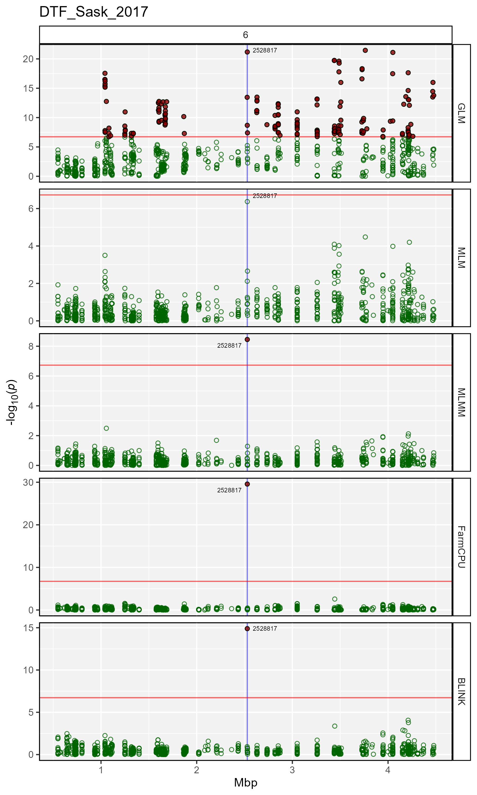

```{r echo = T, eval = F}
mp <- gg_Manhattan_Zoom(folder = "GWAS_Results_CV_b/", 
                        trait = "DTF_Sask_2017", 
                        title = "DTF_Sask_2017 | CV = b", 
                        chr = 6,
                        markers = "Lcu.2RBY.Chr6p2528817", 
                        labels = "2528817", 
                        vline.color = "blue",
                        start = 2528817 - 2000000, 
                        end = 2528817 + 2000000) +
  labs(caption = myCaption))
ggsave("Figures_DTF_Sask_2017_05_01.png", mp, width = 6, height = 10)
```

---

## Volcano Plot

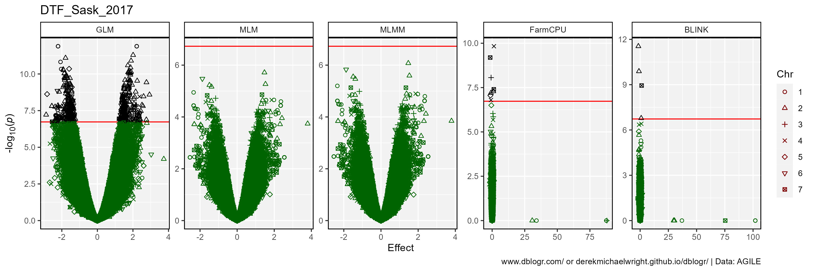

```{r echo = T, eval = F}
mp <- gg_Volcano(folder = "GWAS_Results/", trait = "DTF_Sask_2017") +
  labs(caption = myCaption)
ggsave("Figures_DTF_Sask_2017_06_01.png", mp, width = 12, height = 4)
```

---

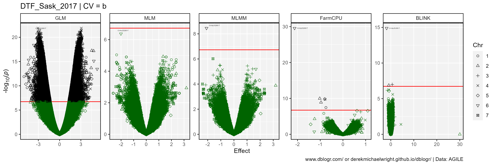

```{r echo = T, eval = F}
mp <- gg_Volcano(folder = "GWAS_Results_CV_b/", trait = "DTF_Sask_2017",
                 title = "DTF_Sask_2017 | CV = b") +
  labs(caption = myCaption)
ggsave("Figures_DTF_Sask_2017_06_02.png", mp, width = 12, height = 4)
```

---

# Heterozygosity

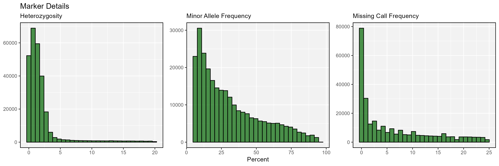

```{r eval = F}
# For each marker
myGD <- myG
myGD$Major <- substr(myG$alleles, 1, 1)
myGD$Minor <- substr(myG$alleles, 3, 3)
#
myG_MAF <- function(x) { sum(x %in% x[1], na.rm = T)-1 }
myG_Het <- function(x) { sum(x %in% c("R","Y","S","W","K","M"), na.rm = T) }
myG_Homo <- function(x) { sum(x %in% c("A", "C", "G", "T"), na.rm = T) }
myG_N <- function(x) { sum(x %in% "N", na.rm = T) }
myGD <- myGD %>%
  mutate(numMajor = apply(myGD[,c("Major", as.character(myY$Name))], 1, myG_MAF),
         numMinor = apply(myGD[,c("Minor", as.character(myY$Name))], 1, myG_MAF),
         numN     = apply(myGD[,as.character(myY$Name)], 1, myG_N),
         numHet   = apply(myGD[,as.character(myY$Name)], 1, myG_Het),
         numHomo  = apply(myGD[,as.character(myY$Name)], 1, myG_Homo),
         #
         Het = numHet / (numHet + numHomo),
         MAF = (numMinor*2 + numHet) / (numMinor*2 + numMajor*2 + numHet*2),
         MCF = numN / (numHet + numHomo))
myGD <- myGD %>% select(rs, alleles, Major, Minor, chrom, pos, numMajor, numMinor,
                        numHet, numN, numHomo, Het, MAF, MCF)
write.csv(myGD, "myG_Details.csv", row.names = F)
# Plot
mp1 <- ggplot(myGD, aes(x = Het * 100)) + 
  geom_histogram(color = "black", fill = "darkgreen", alpha = 0.7) +
  theme_gwaspr() +
  labs(title = "Marker Details", 
       subtitle = "Heterozygosity", x = NULL, y = NULL)
mp2 <- ggplot(myGD, aes(x = MAF * 100)) + 
  geom_histogram(color = "black", fill = "darkgreen", alpha = 0.7) +
  theme_gwaspr() +
  labs(subtitle = "Minor Allele Frequency", x = "Percent", y = NULL)
mp3 <- ggplot(myGD, aes(x = MCF * 100)) + 
  geom_histogram(color = "black", fill = "darkgreen", alpha = 0.7) +
  theme_gwaspr() +
  labs(subtitle = "Missing Call Frequency", x = NULL, y = NULL)
mp <- ggpubr::ggarrange(mp1, mp2, mp3, ncol = 3, align = "h") %>%
  annotate_figure(fig.lab.pos = "bottom.right", fig.lab.size = 6,
                  fig.lab = myCaption)
ggsave("Figures_03_myG_Details.png", mp, width = 12, height = 4)
```

---

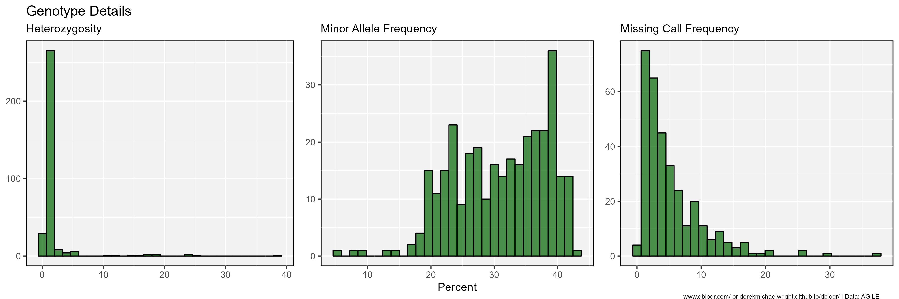

```{r eval = F}
# For each genotype
myYD <- myY %>% mutate(Het = NA, MAF = NA, MCF = NA)
#i<-12
for(i in (12:ncol(myG))) {
  xx <- myG[,i]
  numHet <- sum(xx %in% c("R","Y","S","W","K","M"), na.rm = T)
  numHomo <- sum(xx %in% c("A", "C", "G", "T"), na.rm = T)
  numMiss <- sum(xx %in% "N", na.rm = T)
  numMinor <- sum(xx == myGD$Minor, na.rm = T)
  numMajor <- sum(xx == myGD$Major, na.rm = T)
  #
  myYD$Het[myYD$Name == colnames(myG)[i]] <- numHet / (numHet + numHomo)
  myYD$MAF[myYD$Name == colnames(myG)[i]] <- (numMinor*2 + numHet) / (numMinor*2 + numMajor*2 + numHet*2)
  myYD$MCF[myYD$Name == colnames(myG)[i]] <- numMiss / (numHet + numHomo + numMiss)
}
write.csv(myYD, "myY_Details.csv", row.names = F)
# Plot
mp1 <- ggplot(myYD, aes(x = Het * 100)) + 
  geom_histogram(color = "black", fill = "darkgreen", alpha = 0.7) +
  theme_gwaspr() +
  labs(title = "Genotype Details", 
       subtitle = "Heterozygosity", x = NULL, y = NULL)
mp2 <- ggplot(myYD, aes(x = MAF * 100)) + 
  geom_histogram(color = "black", fill = "darkgreen", alpha = 0.7) +
  theme_gwaspr() +
  labs(subtitle = "Minor Allele Frequency", x = "Percent", y = NULL)
mp3 <- ggplot(myYD, aes(x = MCF * 100)) + 
  geom_histogram(color = "black", fill = "darkgreen", alpha = 0.7) +
  theme_gwaspr() +
  labs(subtitle = "Missing Call Frequency", x = NULL, y = NULL)
mp <- ggpubr::ggarrange(mp1, mp2, mp3, ncol = 3, align = "h") %>%
  annotate_figure(fig.lab.pos = "bottom.right", fig.lab.size = 6,
                  fig.lab = myCaption)
ggsave("Figures_04_myY_Details.png", mp, width = 12, height = 4)
```

---

# Minor Allele Frequency

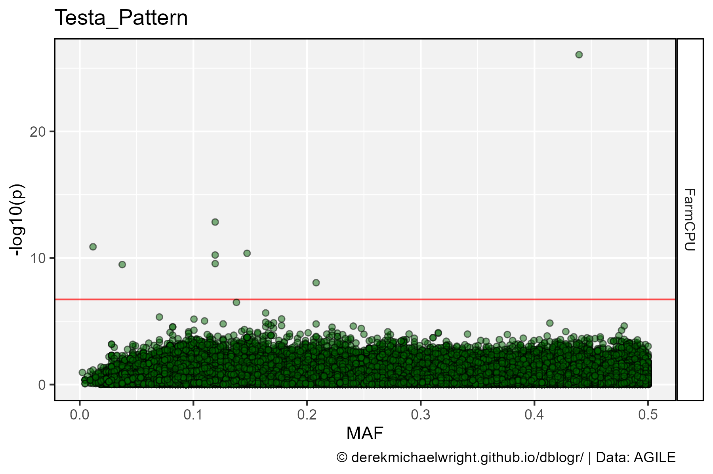

```{r}
xx <- read.csv("GWAS_Results/GAPIT.Association.GWAS_Results.FarmCPU.Testa_Pattern.csv")
mp <- ggplot(xx, aes(x = MAF, y = -log10(P.value))) + 
  geom_hline(yintercept = -log10(0.05 / (nrow(myG)-1)), 
             color = "red", alpha = 0.7) +
  geom_point(pch = 21, color = "black", fill = "darkgreen", alpha = 0.5) + 
  facet_grid("FarmCPU" ~ .) +
  theme_gwaspr() +
  labs(title = "Testa_Pattern", y = "-log10(p)", caption = myCaption)
ggsave("Figures_05_MAF_Testa_Pattern.png", mp, width = 6, height = 4)
```

---

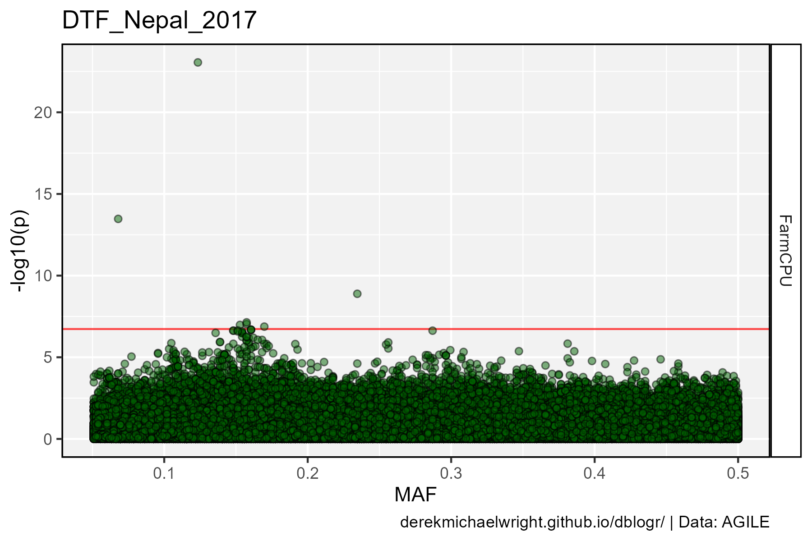

```{r}
xx <- read.csv("GWAS_Results/GAPIT.Association.GWAS_Results.FarmCPU.DTF_Nepal_2017.csv")
mp <- ggplot(xx, aes(x = MAF, y = -log10(P.value))) + 
  geom_hline(yintercept = -log10(0.05 / (nrow(myG)-1)), 
             color = "red", alpha = 0.7) +
  geom_point(pch = 21, color = "black", fill = "darkgreen", alpha = 0.5) + 
  facet_grid("FarmCPU" ~ .) +
  theme_gwaspr() +
  labs(title = "DTF_Nepal_2017", y = "-log10(p)", caption = myCaption)
ggsave("Figures_05_MAF_DTF_Nepal_2017.png", mp, width = 6, height = 4)
```

---

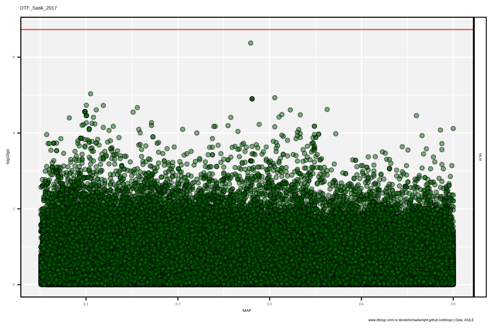

```{r}
xx <- read.csv("GWAS_Results_CV_b/GAPIT.Association.GWAS_Results.MLM.DTF_Sask_2017.csv")
mp <- ggplot(xx, aes(x = MAF, y = -log10(P.value))) + 
  geom_hline(yintercept = -log10(0.05 / (nrow(myG)-1)), 
             color = "red", alpha = 0.7) +
  geom_point(pch = 21, color = "black", fill = "darkgreen", alpha = 0.5) + 
  facet_grid("MLM" ~ .) +
  theme_gwaspr() +
  labs(title = "DTF_Sask_2017", y = "-log10(p)", caption = myCaption)
ggsave("Figures_05_MAF_DTF_Sask_2017.png", mp, width = 6, height = 4)
```

---

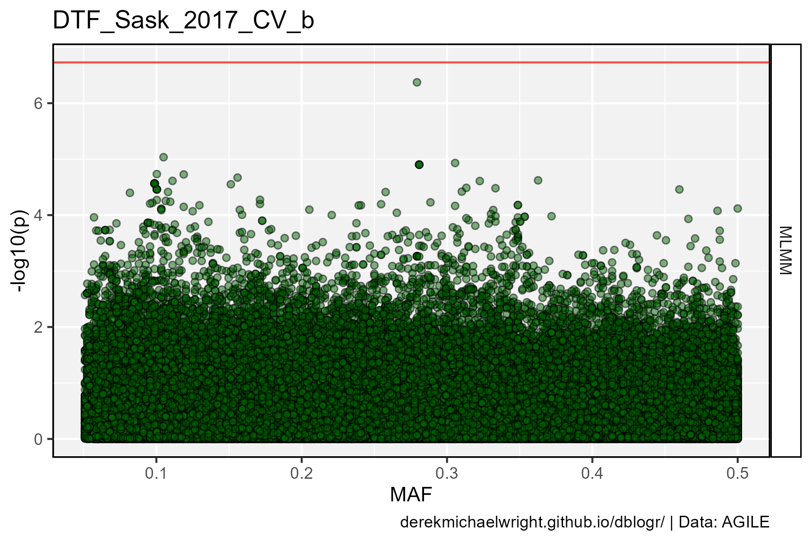

```{r}
xx <- read.csv("GWAS_Results_CV_b/GAPIT.Association.GWAS_Results.MLM.DTF_Sask_2017.csv")
mp <- ggplot(xx, aes(x = MAF, y = -log10(P.value))) + 
  geom_hline(yintercept = -log10(0.05 / (nrow(myG)-1)), 
             color = "red", alpha = 0.7) +
  geom_point(pch = 21, color = "black", fill = "darkgreen", alpha = 0.5) + 
  facet_grid("MLMM" ~ .) +
  theme_gwaspr() +
  labs(title = "DTF_Sask_2017_CV_b", y = "-log10(p)", caption = myCaption)
ggsave("Figures_05_MAF_DTF_Sask_2017_CV_b.png", mp, width = 6, height = 4)
```

---

# PCA

```{r}
library(plotly)
library(htmlwidgets)
xx <- read.csv("GWAS_Results/GAPIT.Genotype.PCA.csv") %>%
  left_join(myY, by = c("taxa"="Name"))
```

## Testa Pattern

https://dblogr.com/academic/gwas_tutorial/Figures_PCA_Testa_Pattern.html

```{r}
myColors <- c("darkgoldenrod3", "darkblue")
mp <- plot_ly(xx, x = ~PC1, y = ~PC2, z = ~PC3, text = ~taxa,
              color = ~Testa_Pattern, colors = myColors) %>%
  add_markers() %>%
  layout(scene = list(title = "Testa Pattern"))
saveWidget(as_widget(mp), "Figures_PCA_Testa_Pattern.html")
mp
```

---

## DTF Nepal 2017

https://dblogr.com/academic/gwas_tutorial/Figures_PCA_DTF_Nepal_2017.html

```{r}
myColors <- c("darkred", "darkgoldenrod3", "darkblue")
mp <- plot_ly(xx, x = ~PC1, y = ~PC2, z = ~PC3, text = ~taxa,
              color = ~DTF_Nepal_2017, colors = myColors) %>%
  add_markers() %>%
  layout(scene = list(title = "DTF Nepal 2017"))
saveWidget(as_widget(mp), "Figures_PCA_DTF_Nepal_2017.html")
mp
```

---

## DTF Sask 2017

https://dblogr.com/academic/gwas_tutorial/Figures_PCA_DTF_Sask_2017.html

```{r}
mp <- plot_ly(xx, x = ~PC1, y = ~PC2, z = ~PC3, text = ~taxa,
              color = ~DTF_Sask_2017, colors = myColors) %>%
  add_markers() %>%
  layout(scene = list(title = "DTF Sask 2017"))
saveWidget(as_widget(mp), "Figures_PCA_DTF_Sask_2017.html")
mp
```

---

# SNP Density Plot

Package Source: https://github.com/YinLiLin/R-CMplot

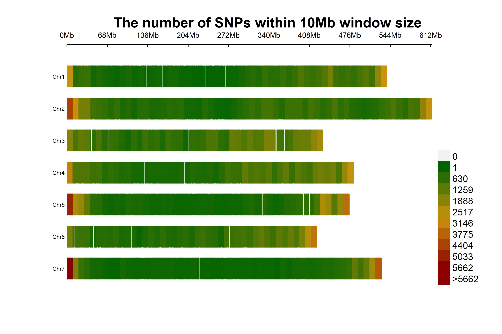

```{r eval = F}
library(CMplot)
xx <- myG %>% select(rs, chrom, pos) 
CMplot(xx, plot.type="d", bin.size=1e7, 
       chr.den.col=c("darkgreen", "darkgoldenrod3", "darkred"), 
       file="jpg", file.output=T, verbose=F, width=9, height=6)
```

---
