```{r setup, include=FALSE}
knitr::opts_chunk$set(echo = T, message = F, warning = F)
```

---

# Introduction

This vignette is a tutorial on running **Genome-Wide Association Studies** (**GWAS**) in <i class="fab fa-r-project"></i> with the packages `GAPIT` and plotting the results with `gwaspr`.

> - **GAPIT Website**: [https://www.maizegenetics.net/gapit](https://www.maizegenetics.net/gapit){target="_blank"}
> - **GAPIT Manual**: [http://www.zzlab.net/GAPIT/gapit_help_document.pdf](http://www.zzlab.net/GAPIT/gapit_help_document.pdf){target="_blank"}

> - **GAPIT github**: [https://github.com/jiabowang/GAPIT](https://github.com/jiabowang/GAPIT){target="_blank"}
> - **GAPIT Issues**: [https://github.com/jiabowang/GAPIT/issues](https://github.com/jiabowang/GAPIT/issues){target="_blank"}

> - **gwaspr Website**: [https://derekmichaelwright.github.io/gwaspr/](https://derekmichaelwright.github.io/gwaspr/){target="_blank"}

```{r echo = F, eval = F}
# > - **GAPIT Forum**: [https://groups.google.com/forum/#!forum/gapit-forum](https://groups.google.com/forum/#!forum/gapit-forum){target="_blank"}
fixNames <- function(xx) {
  xx %>% mutate(Name = gsub(" ", "_", Name),
         Name = gsub("-", "\\.", Name),
         Name = plyr::mapvalues(Name, "3156.11_AGL", "X3156.11_AGL"))
}
library(agiler)
x1 <- AGILE_LDP %>% select(Entry, Name, Origin, Region)
x2 <- AGILE_DTF_PCA %>% select(Name, DTF_Culter=Cluster)
x3 <- AGILE_Q %>% select(-Entry) %>%
  mutate(STR_Group = structureGroup(x = .[,c("P1","P2","P3","P4","P5","P6","P7","P8")]))
myM <- left_join(x1, x2, by = "Name") %>%
  left_join(x3, by = "Name") %>%
  fixNames()
write.csv(myM, "Data/myM.csv", row.names = F)
#
setdiff(myM$Name, t(myG[1,])) # should be character(0)
setdiff(t(myG[1,]), myM$Name) # should show just the first 11 columns of myG
```

---

## Data

Mandatory

> - `r shiny::icon("save")` [myY.csv](Data/myY.csv)
> - `r shiny::icon("save")` [myG_hmp.zip](Data/myG_hmp.zip)

Optional

> - `r shiny::icon("save")` [myCV.csv](Data/myCV.csv)
> - `r shiny::icon("save")` [myM.csv](Data/myM.csv)

- `myY.csv`: Phenotype file
- `myG_hmp.csv`: Genotype file in hapmap format
- `myCV.csv`: (Optional) Covariate file
- `myM.csv`: (Optional) Metadata file for the genotypes.

All phenotype and genotype data is derived from and available at: https://knowpulse.usask.ca/

Associated papers:

- [Wright D & Neupane S, *et al*. (**2020**) **Understanding photothermal interactions can help expand production range and increase genetic diversity of lentil (*Lens culinaris* Medik.)**. *Plants, People, Planet*. 00:1-11. https://doi.org/10.1002/ppp3.10158](https://doi.org/10.1002/ppp3.10158){target="_blank"}

- [Neupane S, Wright D, *et al* (**2022**) **Focusing the GWAS Lens on days to flower using latent variable phenotypes derived from global multi-environment trials**. *The Plant Genome*. e20269. https://doi.org/10.1002/tpg2.20269](https://doi.org/10.1002/tpg2.20269){target="_blank"}

For this tutorial, we will use a Lentil Diversity Panel (**LDP**) consisting of 324 *Lens culinaris* cultivars, representative of the global genetic diversity of cultivated lentils.

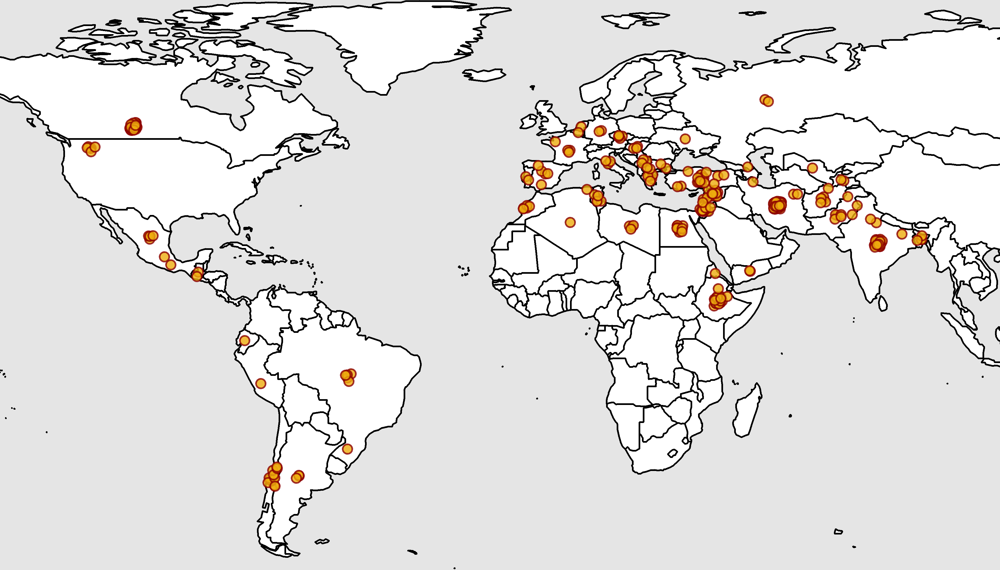

---

# Install `GAPIT`

```{r eval = F, echo = F}
install.packages("BiocManager")
BiocManager::install("multtest")
install.packages("gplots")
install.packages("LDheatmap")
install.packages("genetics")
install.packages("ape")
install.packages("EMMREML")
install.packages("scatterplot3d")
```

```{r eval = F, echo = F}
#source("http://www.bioconductor.org/biocLite.R")
devtools::install_github("YaoZhou89/BLINK")
devtools::install_github("SFUStatgen/LDheatmap")
BiocManager::install("snpStats")
```

```{r eval = F, echo = F}
library(multtest)
library(gplots)
library(LDheatmap)
library(genetics)
library(ape)
library(EMMREML)
library(compiler)
library(scatterplot3d)
source("http://zzlab.net/GAPIT/GAPIT.library.R")
source("http://zzlab.net/GAPIT/gapit_functions.txt")
```

> - Github: [https://github.com/jiabowang/GAPIT](https://github.com/jiabowang/GAPIT){target="_blank"}

```{r eval = F}
install.packages("devtools")
devtools::install_github("jiabowang/GAPIT")
```


---

# Basic GWAS R Code

Load your Data

```{r eval = F}
# Read in phenotype data
myY <- read.csv("Data/myY.csv")
# Read in genotype data (note: header = F)
myG <- read.csv("Data/myG_hmp.csv", header = F)
```

Run the GWAS

```{r eval = F}
library(GAPIT)
# Simplest GWAS
myGAPIT <- GAPIT( Y = myY, G = myG )
```

```{r eval = F}
# Custom GWAS
myGAPIT <- GAPIT( Y = myY,
                  G = myG, 
                  CV = myCV,
                  KI = myKI,
                  PCA.total = 4,
                  model = c("MLM", "BLINK")
                )
```


## GWAS Models

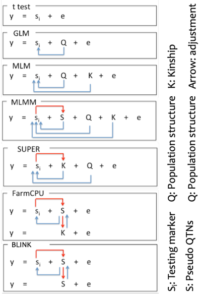

- `GLM` General Linear Model: uses population structure (Q) as a cofactor. 
- `MLM` [Mixed Linear Model](https://www.nature.com/articles/ng1702){target="_blank"}: adds Kinship (K) as a random effect. AKA a Q+K model. 
- `CMLM` Compressed Mixed Linear Model: reduces the confounding effect between the testing markers and the individuals genetic effects by replacing them with their corresponding groups based on cluster analysis defined by the user. MLM is the equivelent of each individual being its own group, and GLM is the equivlent of having only one group for all individuals.
- `MLMM` [Multiple Locus Mixed Linear Model](https://www.nature.com/articles/ng.2314){target="_blank"}: uses forward-backward stepwise linear mixed-model regression to include associated markers as covariates.
- `SUPER` [Settlement of MLM Under Progressively Exclusive Relationship](https://journals.plos.org/plosone/article?id=10.1371/journal.pone.0107684){target="_blank"}:  uses a FaST-LMM algorithm to solve a computational burden for large samples. K is derived from a smaller number of associated markers.
- `FarmCPU` [Fixed and random model Circulating Probability Unification](https://journals.plos.org/plosgenetics/article?id=10.1371/journal.pgen.1005767){target="_blank"}: uses iterations to fit associated markers selected using a maximum likelihood method as cofactors.
- `BLINK` [BLINK](): similar to FarmCPU but eliminates the assumption of causal genes are evenly distributed across the genome. Markers that are in LD with the most significant marker are excluded. Also uses a different method to determine markers for K (BIC).


---

# Data Preparation

The code above will produce errors and not run properly. This is due to the input data not being properly formatted and will be a common occurance. Lets explore why and try to fix these errors.

First install `gwaspr` package which contains `tidyverse` and `ggplot` packages for plotting the GAPIT results later.

```{r eval = F}
devtools::install_github("derekmichaelwright/gwaspr")
```

```{r}
library(gwaspr)
```

## Phenotype Data

Our population (The **LDP**) has been phenotyped for three traits:

- **Cotyledon_Color**: a *qualitative* trait describing cotyledon color (Red = 0, Yellow = 1).
- **DTF_Nepal_2017**: a *quantitative* trait describing days from sowing to flowering in a 2017 Nepal field trial. 
- **DTF_Sask_2017**: a *quantitative* trait describing days from sowing to flowering in a 2017 Saskatchewan field trial.

```{r}
# Read in phenotype data
myY <- read.csv("Data/myY.csv")
```

```{r echo = F}
DT::datatable(myY)
```

First we must convert our *qualitative trait* **Cotyledon_Color** from `character` to `numeric` format.

`Red` = 0

`Yellow` = 1

`Green` = NA

`missing data` = NA

```{r}
# Convert qualitative trait to numeric
myY <- myY %>% 
  mutate(Cotyledon_Color = plyr::mapvalues(Cotyledon_Color, c("Red", "Yellow"), 0:1),
         Cotyledon_Color = as.numeric(Cotyledon_Color))
```

```{r echo = F}
DT::datatable(myY)
```

```{r eval = F}
# Prep data
xx <- myY %>%
  gather(Trait, Value, 2:ncol(.)) %>%
  mutate(Trait = factor(Trait, levels = unique(Trait)))
# Plot
mp <- ggplot(xx, aes(x = Value)) + 
  geom_histogram(color = "black", fill = "darkgreen", alpha = 0.7) + 
  facet_wrap(. ~ Trait, ncol = 3, scales = "free") +
  theme_gwaspr() +
  labs(title = "Phenotype Data")
# Save
ggsave("Fig_01_myY_Phenotypes.png", mp, width = 8, height = 3)
```

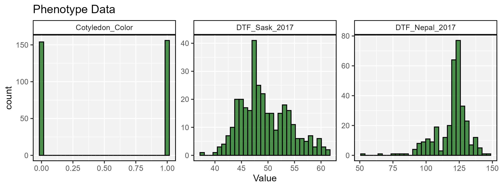

---

## Genotype Data

The LDP was genotyped using an *exome caputure array* and filtered with the following criteria to yield a data set of 336,367 SNPs, stored in our object `myG`.

- Only Bi-allelic           =  TRUE
- Minimum Read Depth        =  3
- Minor Allele Frequency    = >5%
- Maximum Missing Frequency =  25%
- Heterozygous              = <25%

```{r}
# Read in genotype data (note: header = F)
myG <- read.csv("Data/myG_hmp.csv", header = F)
```

```{r}
# Map + marker Info
myG[1:10,1:11]
# genotrype calls
myG[1:10,12:17]
```

---

### Marker Details

These plots give us some detail about the markers we have.

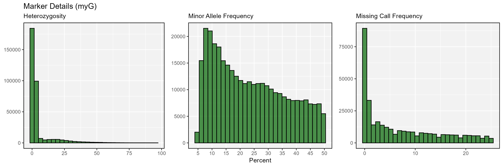

```{r eval = F, class.source = "fold-hide"}
# For each marker
xGD <- read.csv("Data/myG_hmp.csv", header = T)
xGD$M1 <- substr(xGD$alleles, 1, 1)
xGD$M2 <- substr(xGD$alleles, 3, 3)
#
xY <- read.csv("Data/myY.csv") %>% 
  mutate(Name = plyr::mapvalues(Name, 
           c("3156-11_AGL",  "CDC Asterix AGL", "CDC_QG-1_AGL"), 
           c("X3156.11_AGL", "CDC_Asterix_AGL", "CDC_QG.1_AGL")))
#
xG_MAF <- function(x) { sum(x %in% x[1], na.rm = T)-1 }
xG_Het <- function(x) { sum(x %in% c("R","Y","S","W","K","M"), na.rm = T) }
xG_Homo <- function(x) { sum(x %in% c("A", "C", "G", "T"), na.rm = T) }
xG_N <- function(x) { sum(x %in% "N", na.rm = T) }
xGD <- xGD %>%
  mutate(numM1 = apply(xGD[,c("M1", as.character(xY$Name))], 1, xG_MAF),
         numM2 = apply(xGD[,c("M2", as.character(xY$Name))], 1, xG_MAF),
         numN     = apply(xGD[,as.character(xY$Name)], 1, xG_N),
         numHet   = apply(xGD[,as.character(xY$Name)], 1, xG_Het),
         numHomo  = apply(xGD[,as.character(xY$Name)], 1, xG_Homo),
         #
         Het = numHet / (numHet + numHomo),
         MAF = ifelse(numM1 > numM2, (numM2*2 + numHet) / (numM2*2 + numM1*2 + numHet*2),
                                     (numM1*2 + numHet) / (numM1*2 + numM2*2 + numHet*2) ),
         MCF = numN / (numHet + numHomo + numN))
xGD <- xGD %>% 
  select(rs, alleles, M1, M2, chrom, pos, 
         numM1, numM2, numHet, numN, numHomo, Het, MAF, MCF)
write.csv(xGD, "myG_Details.csv", row.names = F)
# Plot
mp1 <- ggplot(xGD, aes(x = Het * 100)) + 
  geom_histogram(color = "black", fill = "darkgreen", alpha = 0.7) +
  theme_gwaspr() +
  labs(title = "Marker Details (myG)", 
       subtitle = "Heterozygosity", x = NULL, y = NULL)
mp2 <- ggplot(xGD, aes(x = MAF * 100)) + 
  geom_histogram(color = "black", fill = "darkgreen", alpha = 0.7) +
  scale_x_continuous(breaks = seq(5,50, by = 5),
                     minor_breaks = seq(5,50, by = 5)) +
  theme_gwaspr() +
  labs(subtitle = "Minor Allele Frequency", x = "Percent", y = NULL)
mp3 <- ggplot(xGD, aes(x = MCF * 100)) + 
  geom_histogram(color = "black", fill = "darkgreen", alpha = 0.7) +
  theme_gwaspr() +
  labs(subtitle = "Missing Call Frequency", x = NULL, y = NULL)
mp <- ggarrange(mp1, mp2, mp3, ncol = 3, align = "h")
ggsave("Fig_02_myG_Details.png", mp, width = 12, height = 4)
```

---

### Population Details

These plots give us some detail about our population based on the markers we have.

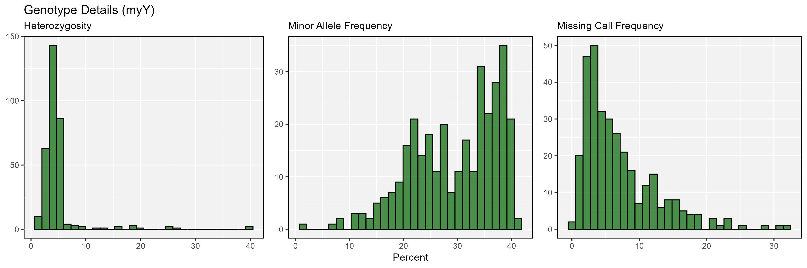

```{r eval = F, class.source = "fold-hide"}
# For each genotype
xGD <- read.csv("Data/myG_hmp.csv", header = T)
xGD$M1 <- substr(xGD$alleles, 1, 1)
xGD$M2 <- substr(xGD$alleles, 3, 3)
#
xYD <- read.csv("Data/myY.csv") %>% 
  mutate(Het = NA, MAF = NA, MCF = NA,
         Name = plyr::mapvalues(Name, 
           c("3156-11_AGL",  "CDC Asterix AGL", "CDC_QG-1_AGL"), 
           c("X3156.11_AGL", "CDC_Asterix_AGL", "CDC_QG.1_AGL")) )
#i<-12
for(i in (12:ncol(xGD))) {
  xx <- xGD[,i]
  numHet <- sum(xx %in% c("R","Y","S","W","K","M"), na.rm = T)
  numHomo <- sum(xx %in% c("A", "C", "G", "T"), na.rm = T)
  numMiss <- sum(xx %in% "N", na.rm = T)
  numM1 <- sum(xx == xGD$M1, na.rm = T)
  numM2 <- sum(xx == xGD$M2, na.rm = T)
  #
  xYD$Het[xYD$Name == colnames(xGD)[i]] <- numHet / (numHet + numHomo)
  xYD$MAF[xYD$Name == colnames(xGD)[i]] <- ifelse(numM1 > numM2,
              (numM2*2 + numHet) / (numM2*2 + numM1*2 + numHet*2),
              (numM1*2 + numHet) / (numM1*2 + numM2*2 + numHet*2) )
  xYD$MCF[xYD$Name == colnames(xGD)[i]] <- numMiss / (numHet + numHomo + numMiss)
}
write.csv(xYD, "myY_Details.csv", row.names = F)
# Plot
mp1 <- ggplot(xYD, aes(x = Het * 100)) + 
  geom_histogram(color = "black", fill = "darkgreen", alpha = 0.7) +
  theme_gwaspr() +
  labs(title = "Genotype Details (myY)", 
       subtitle = "Heterozygosity", x = NULL, y = NULL)
mp2 <- ggplot(xYD, aes(x = MAF * 100)) + 
  geom_histogram(color = "black", fill = "darkgreen", alpha = 0.7) +
  theme_gwaspr() +
  labs(subtitle = "Minor Allele Frequency", x = "Percent", y = NULL)
mp3 <- ggplot(xYD, aes(x = MCF * 100)) + 
  geom_histogram(color = "black", fill = "darkgreen", alpha = 0.7) +
  theme_gwaspr() +
  labs(subtitle = "Missing Call Frequency", x = NULL, y = NULL)
mp <- ggarrange(mp1, mp2, mp3, ncol = 3, align = "h")
ggsave("Fig_03_myY_Details.png", mp, width = 12, height = 4)
```

---

## Covariates + Kinship

GAPIT will automatically calculate kinship matrices and performs PCA on the genotype data to be used as a covariate to account for population structure. However, custom Kinship matrices and covariates can be used as well. Just make sure they are formatted similar to the output files `GAPIT` uses for covariates and kinship.

`r shiny::icon("save")` [GWAS_Results/GAPIT.Genotype.PCA.csv](GWAS_Results/GAPIT.Genotype.PCA.csv)

`r shiny::icon("save")` [GWAS_Results/GAPIT.Genotype.Kin_Zhang.csv](GWAS_Results/GAPIT.Genotype.Kin_Zhang.csv)

```{r eval = F, echo = F}
myCV <- read.csv("GWAS_Results/GAPIT.Genotype.PCA.csv")
myCV[1:10,]
myK <- read.csv("GWAS_Results/GAPIT.Genotype.Kin_Zhang.csv", header = F)
myK[1:10,1:5]
```

For more information on my CV see the following papers:

- [Wright D & Neupane S, *et al*. (**2020**) **Understanding photothermal interactions can help expand production range and increase genetic diversity of lentil (*Lens culinaris* Medik.)**. *Plants, People, Planet*. 00:1-11. https://doi.org/10.1002/ppp3.10158](https://doi.org/10.1002/ppp3.10158){target="_blank"}

- [Neupane S, Wright D, *et al* (**2022**) **Focusing the GWAS Lens on days to flower using latent variable phenotypes derived from global multi-environment trials**. *The Plant Genome*. e20269. https://doi.org/10.1002/tpg2.20269](https://doi.org/10.1002/tpg2.20269){target="_blank"}

```{r}
# Read in my custom covariate data
myCV <- read.csv("Data/myCV.csv")
```

```{r echo = F}
DT::datatable(myCV)
```

```{r}
# Plot
mp <- ggplot(myCV, aes(x = b_coef * 10000)) + 
  geom_histogram(color = "black", fill = "darkgreen", alpha = 0.7) + 
  theme_gwaspr() +
  labs(title = "Covariate Data")
# Save
ggsave("Fig_04_myCV_Covariates.png", mp, width = 5, height = 3)
```

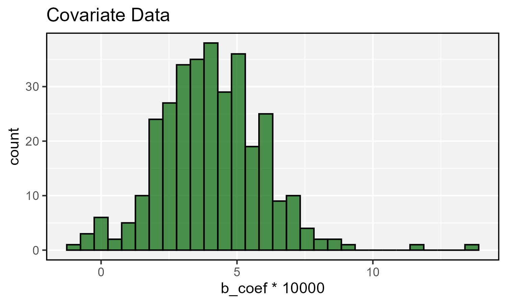

---

# Common Errors

There are a number of common errors one might encounter when attempting to do GWAS with GAPIT. We will go through a few of these:

## Incorect data uploading 

`myG <- read.csv("Genotype_Data.csv", header = T)` when it should be `header = F`

Notice how the first row of our genotype data is actually the column names.

## Numeric Phenotype Data

For our qualitative trait **Cotyledon_Color**, we needed to convert

- `Red` to `0` 
- `Yellow` to `1`

## Genotype Names

Genotype names not matching between the phenotype file and genotype file is an easy error to miss. `R` does not like column names that begin with a number. *E.g.*, the genotype `3156-11_AGL` should have its named changed to `X3156-11_AGL`. Another common problem can come from dashses (`-`) and periods (`.`), *E.g.*. `CDC_QG.1_AGL` or `CDC_QG-1_AGL`, or spaces (` `) and underscores (`_`), *E.g.*, `CDC Asterix AGL` or `CDC_Asterix_AGL`.

```{r}
setdiff(myY$Name, t(myG[1,])) # should be character(0)
setdiff(t(myG[1,]), myY$Name) # should show just the first 11 columns of myG
```

```{r}
# Change names of select individuals
myY <- myY %>% 
  mutate(Name = plyr::mapvalues(Name, 
           c("3156-11_AGL",  "CDC Asterix AGL", "CDC_QG-1_AGL"), 
           c("X3156.11_AGL", "CDC_Asterix_AGL", "CDC_QG.1_AGL")))
```

```{r}
setdiff(myY$Name, t(myG[1,])) # should be character(0)
setdiff(t(myG[1,]), myY$Name) # should show just the first 11 columns of myG
```

---

# Run GWAS with GAPIT

## Load GAPIT

```{r eval = F}
library(GAPIT)
```

## Run GWAS

For our purposes we will run GWAS with the following models: `GLM`, `MLM`, `MLMM`, `FarmCPU`, `BLINK`.

`Y` = phenotype file

`G` = genotype file

`CV` = covariate file

```{r eval = F}
setwd("GWAS_Results/")
# Custom GWAS
GAPIT( Y = myY, 
       G = myG, 
       PCA.total = 4,
       model = c("GLM", "MLM", "MLMM", "FarmCPU", "BLINK"),
       Random.model = F,  # Optional: use if GAPIT returns an error
       Phenotype.View = F # Optional: use if GAPIT returns an error
      )
```

---

# PCA

Why set `PCA.total = 4`? 

Principle components of the marker data are used to account for population structure. By plotting our eigenvalues by the number of principle components we can use the "kink method" to choose how many PCs to use in our GWAS. From PC4 to PC5, there is little change in the eigenvalues, meaning that additional PCs will not account for more of the variance within our data (i.e., they are unnecessary). 

In our case, we are using an output (the PCA of our marker data) from the GWAS to make this decision. If this is your first time running a GWAS, setting `PCA.total = 3` is good practice, as your GWAS can be easily rerun if you later determine you need to adjust settings. 

```{r}
# Prep data
xx <- read.csv("GWAS_Results/GAPIT.Genotype.PCA_eigenvalues.csv") %>% 
  mutate(PC = 1:324, `Eigen Values` = x,
         fill = ifelse(PC == 4, "PC", ""),
         `Percent of Variation` = 100 * `Eigen Values` / sum(`Eigen Values`) ) %>%
  slice(1:10)
# Plot
mp <- ggplot(xx,  aes(x = PC, y = `Percent of Variation`)) + 
  geom_line(linewidth = 1, alpha = 0.7) + 
  geom_point(aes(fill = fill), size = 3, pch = 21) +
  scale_fill_manual(values = c("darkgreen", "darkred")) +
  scale_x_continuous(breaks = 1:10) +
  theme_gwaspr(legend.position = "none") +
  labs(title = "PCA determination")
# Save
ggsave("Fig_05_PCA_Eigen_Values.png", width = 6, height = 4)
```

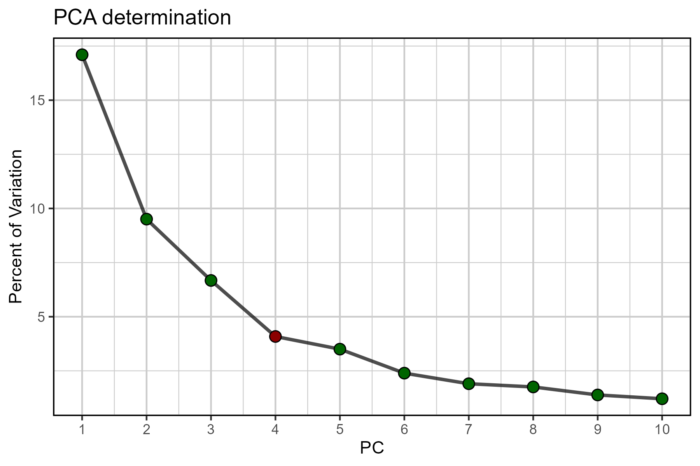

---

## User-inputted Kinship and Covariates

We will rerun GWAS on the DTF traits using the *b* coefficient from a photothermal model derived from [**Wright *et al*. (2020)**](https://github.com/derekmichaelwright/AGILE_LDP_Phenology/){target="_blank"}. This should act to remove or diminish temperature related associations, and thus emphasize photoperiod related associations.

```{r eval = F}
# Prep data
myY2 <- myY %>% select(Name, DTF_Sask_2017_b=DTF_Sask_2017)
# Run GWAS with covariate
GAPIT( Y = myY2, G = myG, CV = myCV,
       model = c("MLM", "FarmCPU", "BLINK", "MLMM", "GLM"),
       PCA.total = 0, 
       Random.model = F,  # Optional: use if GAPIT returns an error
       Phenotype.View = F # Optional: use if GAPIT returns an error
      )
```

---

# Post GWAS Preparation

After running a genome-wide association study, there are some quality control and post-GWAS steps we can take to evaluate our results and identify false positives. 

---

## Prepare Data

Convert our `Cotyledon_Color` back to its character values.

```{r}
myY <- myY %>% 
  mutate(Cotyledon_Color = plyr::mapvalues(Cotyledon_Color, c(0,1), c("Red","Yellow")))
```

Reread in our `myG` file but with `header = T`. 

```{r}
# Reread in genotype data (Note: header = T)
myG <- read.csv("Data/myG_hmp.csv", header = T)
```

Check which traits and models have ran with `is.ran()`

```{r}
is_ran(folder = "GWAS_Results/")
```

Check if the results files are ordered by p.value with `is_ordered()`. If not this could cause problems

```{r}
is_ordered(folder = "GWAS_Results/")
```

If they are not ordered, they can be with the `order_GWAS_Results()` function

```{r eval = F}
order_GWAS_Results(folder = "GWAS_Results/")
```

Create a summary table of all significant associations

```{r eval = F}
# Create summary of GWAS results
xx <- table_GWAS_Results(folder = "GWAS_Results/", threshold = 6.8, sug.threshold = 5.3)
# Save
write.csv(xx, "Supplemtnal_Table_01.csv", row.names = F)
```

---

## Significance threshold

- suggestive association = $p<5*10^{-6}=0.000005$ -> -log10(0.000005) = 5.3
- bonferroni threshold = $p<5*10^{-8}=0.00000005$ -> -log10(0.00000005) = 7.3
- custom threshold = $p<0.05/n(markers)=0.05/336367$ -> -log10(0.05/336367) = 6.8

Calculate significance threshold

```{r}
-log10(0.000005)
-log10(0.00000005)
-log10( 0.05 / (nrow(myG)-1) )
-log10( 0.01 / (nrow(myG)-1) )
```

---

# DTF Nepal 2017

Since Days To Flower (DTF) is a quantitative trait, we can expect many smaller effect QTLs.

## Manhattan Plots

Plot models together (default)

```{r eval = F}
# Plot
mp <- gg_Manhattan(
  # Specify a folder with GWAS results
  folder = "GWAS_Results/", 
  # Select a trait to plot
  trait = "DTF_Nepal_2017" 
  )
# Save
ggsave("Fig_DTF_Nepal_2017_01_01.png", mp, width = 12, height = 4, bg = "white")
```

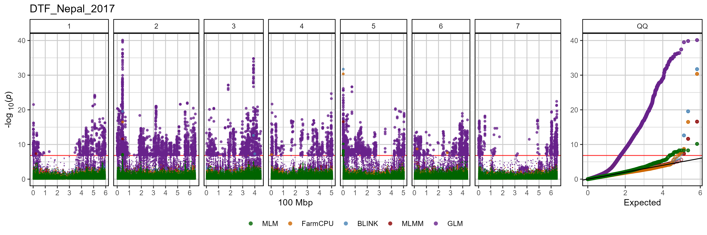

---

Facet each model

```{r eval = F}
# Plot
mp <- gg_Manhattan(
  # Specify a folder with GWAS results
  folder = "GWAS_Results/",
  # Select a trait to plot
  trait = "DTF_Nepal_2017",
  # Facet each model
  facet = T 
  )
# Save
ggsave("Fig_DTF_Nepal_2017_01_02.png", mp, width = 12, height = 12, bg = "white")
```

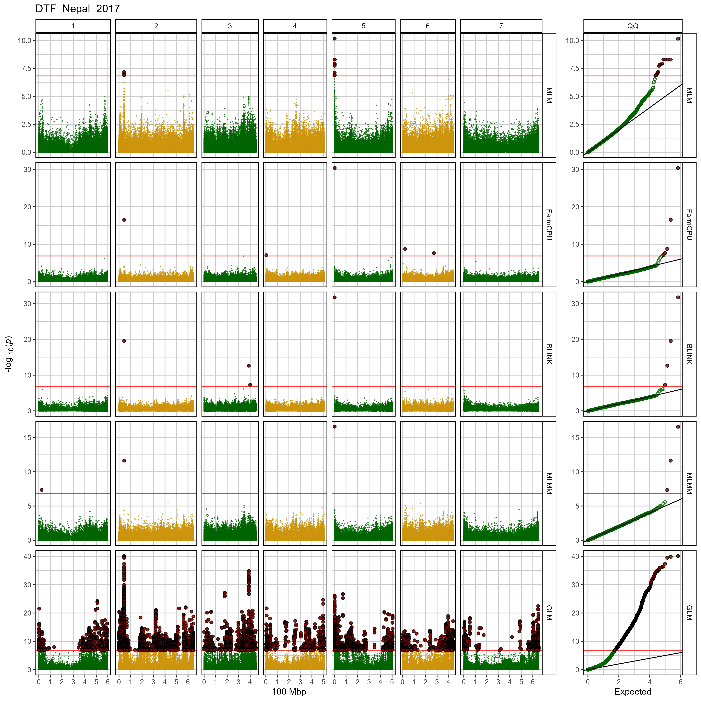

---

Now lets customize the manhattan plot with some selected markers

```{r}
list_Top_Markers(
  # Specify a folder with GWAS results
  folder = "GWAS_Results/", 
  # Select a trait to plot
  traits = "DTF_Nepal_2017" 
  )
```

```{r eval = F}
# Plot
mp <- gg_Manhattan(
  # Specify a folder with GWAS results
  folder = "GWAS_Results/", 
  # Select a trait to plot
  trait = "DTF_Nepal_2017",
  # Plot only certain GWAS models
  models = c("MLM","MLMM","FarmCPU","BLINK"),
  # Highlight specific markers
  markers = c("Lcu.1GRN.Chr2p44545877",
              "Lcu.1GRN.Chr5p1658484"),
  # Create alt labels for the markers
  labels = c("44Mbp","16Mbp"),
  # Specify Color for each marker vline
  vline.colors = c("red","blue"),
  # Specify number of legend rows
  legend.rows = 1 
  )
# Save
ggsave("Fig_DTF_Nepal_2017_01_03.png", mp, width = 12, height = 4, bg = "white")
```

```{r echo = F, eval = F}
ggsave("featured.png", mp, width = 12, height = 4, bg = "white")
```

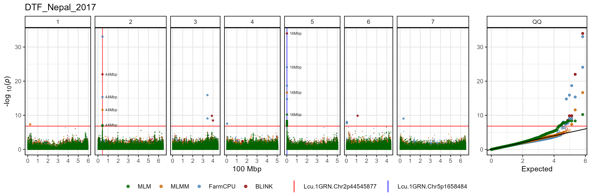

---

### Chr 2 Association

```{r eval = F}
# Plot
mp <- gg_Manhattan(
  # Specify a folder with GWAS results
  folder = "GWAS_Results/", 
  # Select a trait to plot
  trait = "DTF_Nepal_2017",
  # Plot just Chromosome 2
  chrom = 2,
  # Plot only certain GWAS models
  models = c("MLM","MLMM","FarmCPU","BLINK"),
  # Highlight specific markers
  markers = "Lcu.1GRN.Chr2p44545877",
  # Create alt labels for the markers
  labels = "44Mbp",
  # Specify Color for each marker vline
  vline.colors = "red" 
  )
# Save
ggsave("Fig_DTF_Nepal_2017_01_04.png", mp, width = 12, height = 4, bg = "white")
```

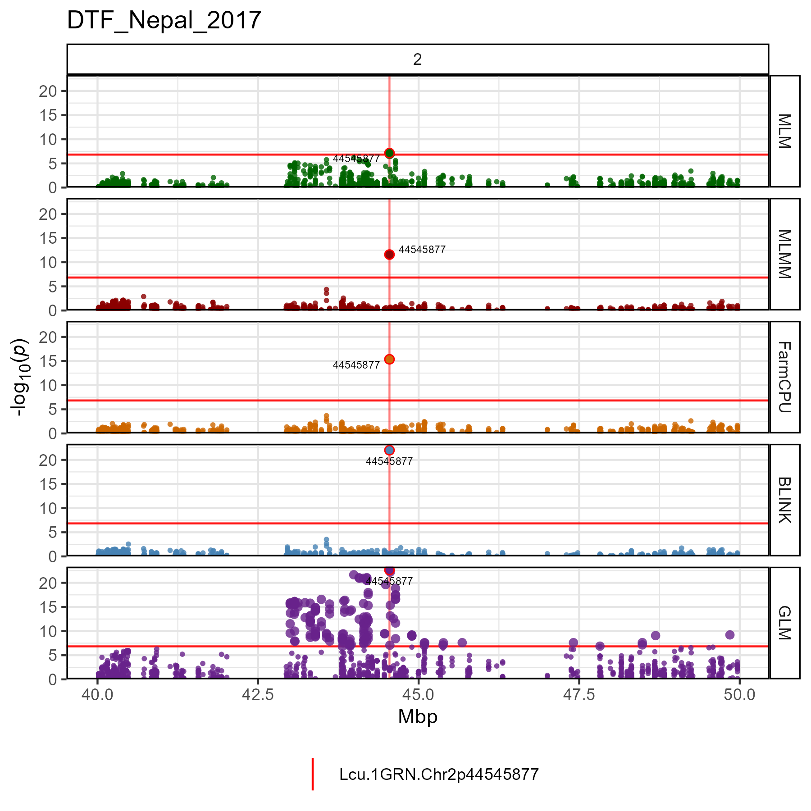

---

```{r eval = F}
# Plot
mp <- gg_Manhattan_Zoom(
  # Specify a folder with GWAS results
  folder = "GWAS_Results/",
  # Select a trait to plot
  trait = "DTF_Nepal_2017",
  # Plot just Chromosome 2
  chr = 2,
  pos1 = 40000000,
  pos2 = 50000000,
  # Highlight specific markers
  markers = "Lcu.1GRN.Chr2p44545877",
  # Create alt labels for the markers
  labels = "44545877",
  # Specify Color for each marker vline
  vline.color = "red" 
  )
# Save
ggsave("Fig_DTF_Nepal_2017_01_05.png", mp, width = 6, height = 10)
```

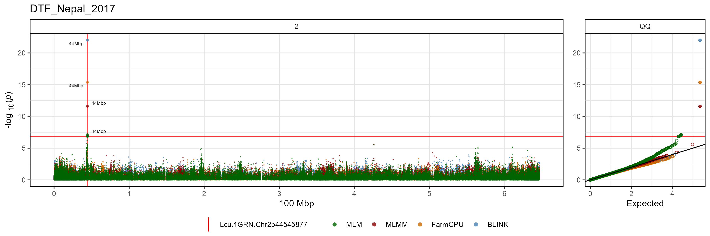

---

### Chr 5 Association

```{r eval = F}
# Plot
mp <- gg_Manhattan(
  # Specify a folder with GWAS results
  folder = "GWAS_Results/",
  # Select a trait to plot
  trait = "DTF_Nepal_2017",
  # Plot just Chromosome 5
  chrom = 5,
  # Plot only certain GWAS models
  models = c("MLM","MLMM","FarmCPU","BLINK"),
  # Highlight specific markers
  markers = "Lcu.1GRN.Chr5p1658484",
  # Create alt labels for the markers
  labels = "16Mbp",
  # Specify Color for each marker vline
  vline.colors = "blue" 
  )
# Save
ggsave("Fig_DTF_Nepal_2017_01_06.png", mp, width = 12, height = 4, bg = "white")
```

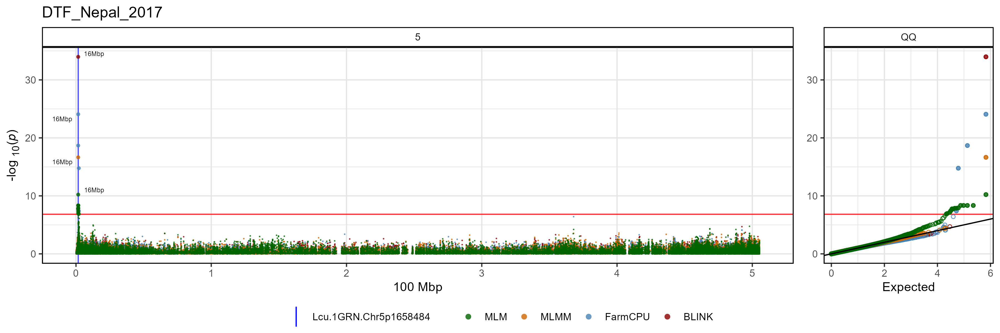

---

```{r eval = F}
# Plot
mp <- gg_Manhattan_Zoom(
  # Specify a folder with GWAS results
  folder = "GWAS_Results/",
  # Select a trait to plot
  trait = "DTF_Nepal_2017", 
  # Highlight specific markers 
  markers = "Lcu.1GRN.Chr5p1658484", 
  # Create alt labels for the markers
  labels = "1658484", 
  # Plot just Chromosome 5
  chr = 5, 
  pos1 = 1000000, 
  pos2 = 2000000,
  # Specify Color for each marker vline
  vline.color = "red" 
  )
# Save
ggsave("Fig_DTF_Nepal_2017_01_07.png", mp, width = 6, height = 10)
```

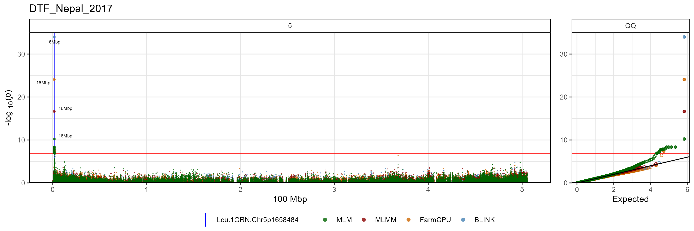

---

## Markers

2 strong association peaks can be identified on chromosomes 2 and 5.

```{r eval = F}
# Plot
mp <- gg_Marker_Box(
  # Genotype data
  xG = myG,
  # Phenotype data
  xY = myY, 
  # Select a trait to plot
  trait = "DTF_Nepal_2017",
  # Select markers to plot
  markers = "Lcu.1GRN.Chr2p44545877",
  # Specify colors for alleles
  marker.colors = c("darkgoldenrod3","darkgreen") 
  )
# Save
ggsave("Fig_DTF_Nepal_2017_02_01.png", mp, width = 6, height = 4)
```

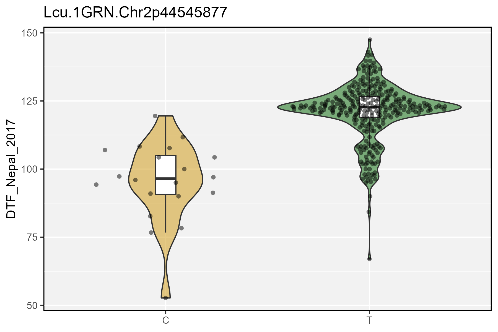

The marker `Lcu.1GRN.Chr2p44545877` is associated with early flowering in Nepal.

---

```{r eval = F}
# Plot
mp <- gg_Marker_Box(
  # Genotype data
  xG = myG,
  # Phenotype data
  xY = myY, 
  # Select a trait to plot
  trait = "DTF_Nepal_2017", 
  # Select markers to plot
  markers = "Lcu.1GRN.Chr5p1658484",
  # Specify colors for alleles
  marker.colors = c("darkgoldenrod3","darkgreen") 
  )
# Save
ggsave("Fig_DTF_Nepal_2017_02_02.png", mp, width = 6, height = 4)
```

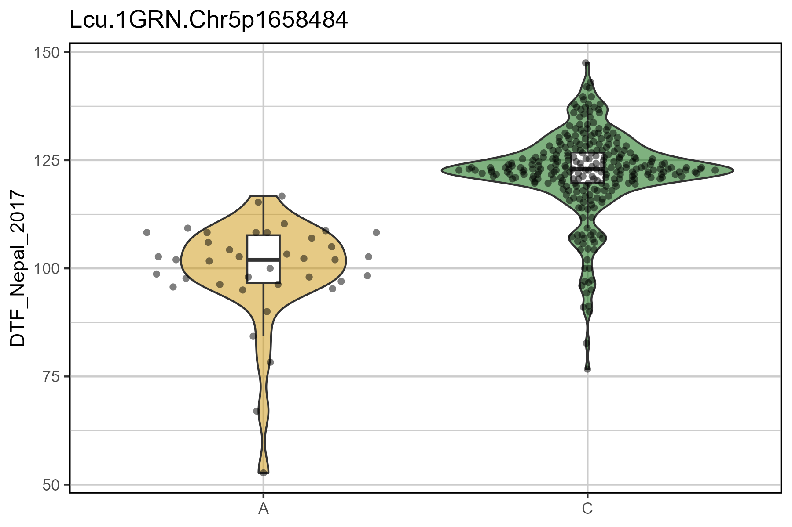

The marker `Lcu.1GRN.Chr5p1658484` is associated with early flowering in Nepal.

---

Now lets plot both markers

```{r eval = F}
# Plot
mp <- gg_Marker_Box(
  # Genotype data
  xG = myG,
  # Phenotype data
  xY = myY,
  # Select a trait to plot
  trait = "DTF_Nepal_2017",
  # Select markers to plot
  markers = c("Lcu.1GRN.Chr2p44545877",
              "Lcu.1GRN.Chr5p1658484"),
  # Specify colors for alleles
  marker.colors = c("darkred","darkgoldenrod3","darkgoldenrod2","darkgreen") 
  )
# Save
ggsave("Fig_DTF_Nepal_2017_02_03.png", mp, width = 6, height = 4)
```

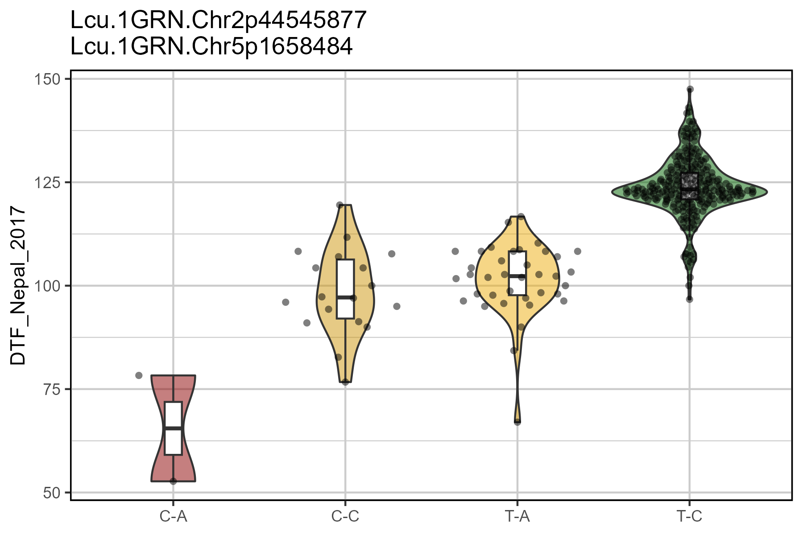

---

## Volcano Plot

```{r eval = F}
# Plot
mp <- gg_Volcano(
  # Specify a folder with GWAS results
  folder = "GWAS_Results/", 
  # Select a trait to plot
  trait = "DTF_Nepal_2017",
  # Plot only certain GWAS models
  models = c("MLM","MLMM","FarmCPU","BLINK"),
  # Highlight specific markers
  markers = c("Lcu.1GRN.Chr2p44545877", 
              "Lcu.1GRN.Chr5p1658484"), 
  # Create alt labels for the markers
  labels = c("44545877","1658484") 
  )
# Save
ggsave("Fig_DTF_Nepal_2017_03_01.png", mp, width = 12, height = 4)
```

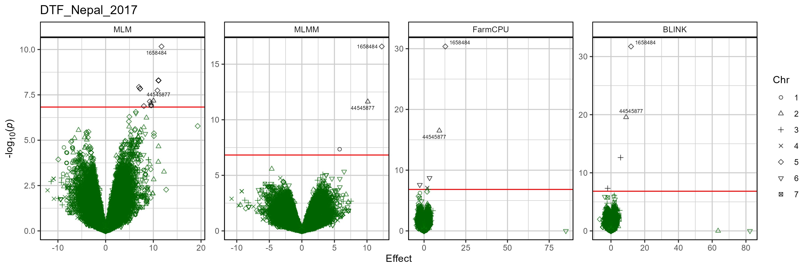

---

## Minor Allele Frequency

```{r eval = F}
# Prep data
x1 <- read.csv("GWAS_Results/GAPIT.Association.GWAS_Results.MLM.DTF_Nepal_2017.csv") %>%
  mutate(Model = "MLM")
x2 <- read.csv("GWAS_Results/GAPIT.Association.GWAS_Results.BLINK.DTF_Nepal_2017.csv") %>%
  mutate(Model = "BLINK")
xx <- bind_rows(x1, x2) %>% mutate(Model = factor(Model, levels = c("MLM","BLINK")))
# Plot
mp <- ggplot(xx, aes(x = MAF, y = -log10(P.value), pch = as.factor(Chr))) + 
  geom_hline(yintercept = -log10(0.05 / (nrow(myG)-1)), 
             color = "red", alpha = 0.7) +
  geom_point(color = "darkgreen", alpha = 0.5) +
  facet_grid(. ~ Model) +
  theme_gwaspr() +
  labs(title = "DTF_Nepal_2017", y = "-log10(p)")
# Save
ggsave("Fig_DTF_Nepal_2017_03_02.png", mp, width = 10, height = 4)
```

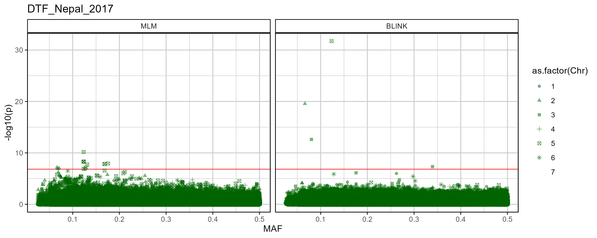

---

# DTF Sask 2017

Saskatchewan has drastically different temperature and photoperiods than Nepal, so we should expect different associations.In addition, we ran this trait twice, with and without the use of a covariate (the *b* coefficient from a photothermal model)

## Manhattan Plots

Plot models together (default)

```{r eval = F}
# Plot
mp <- gg_Manhattan(
  # Specify a folder with GWAS results
  folder = "GWAS_Results/",
  # Select a trait to plot
  trait = "DTF_Sask_2017" 
  )
# Save
ggsave("Fig_DTF_Sask_2017_01_01.png", mp, width = 12, height = 4, bg = "white")
```

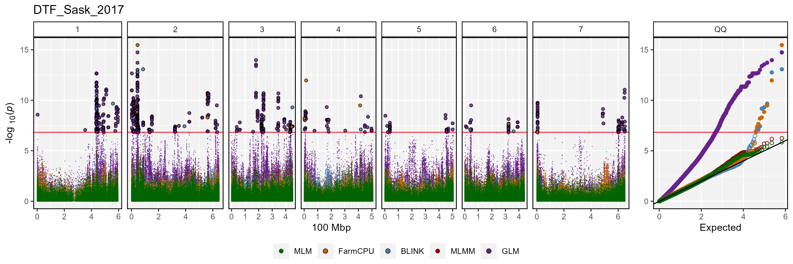

---

```{r eval = F}
# Plot
mp <- gg_Manhattan(
  # Specify a folder with GWAS results
  folder = "GWAS_Results/", 
  # Select a trait to plot
  trait = "DTF_Sask_2017_b",
  # Specify a title
  title = "DTF_Sask_2017 | CV = b" 
  )
# Save
ggsave("Fig_DTF_Sask_2017_01_02.png", mp, width = 12, height = 4, bg = "white")
```

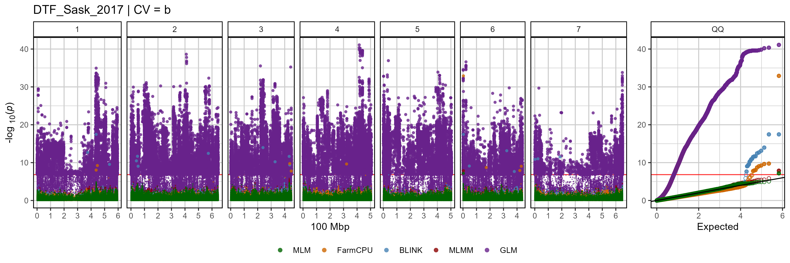

---

Facet each model

```{r eval = F}
# Plot
mp <- gg_Manhattan(
  # Specify a folder with GWAS results
  folder = "GWAS_Results/",
  # Select a trait to plot
  trait = "DTF_Sask_2017",
  # Facet each model
  facet = T 
  )
# Save
ggsave("Fig_DTF_Sask_2017_01_03.png", mp, width = 12, height = 14, bg = "white")
```

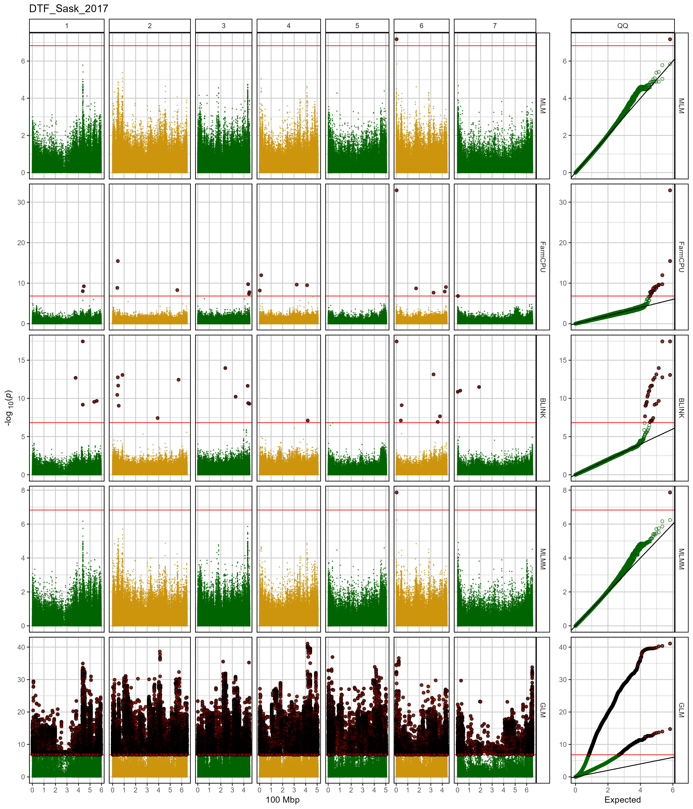

---

```{r eval = F}
# Plot
mp <- gg_Manhattan(
  # Specify a folder with GWAS results
  folder = "GWAS_Results/",
  # Select a trait to plot
  trait = "DTF_Sask_2017_b",
  # Specify a title
  title = "DTF_Sask_2017 | CV = b",
  # Facet each model
  facet = T
  )
ggsave("Fig_DTF_Sask_2017_01_04.png", mp, width = 12, height = 14, bg = "white")
```

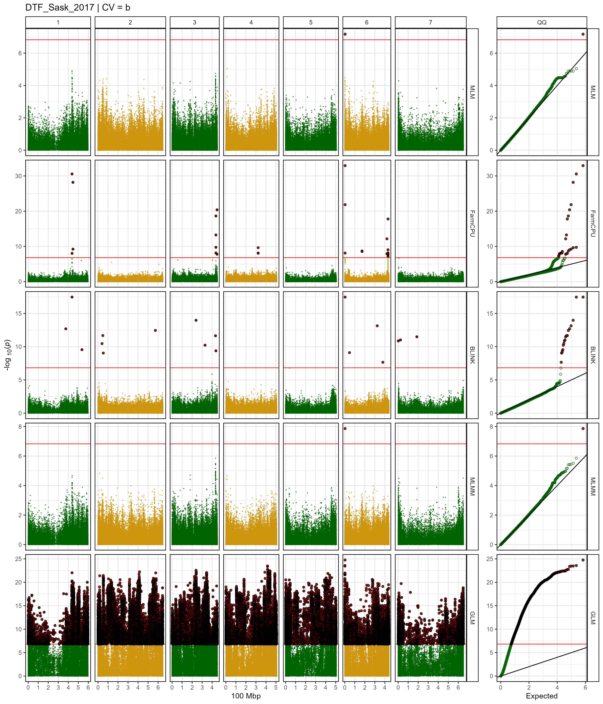

---

Now lets customize the manhattan plot with some selected markers

```{r}
list_Top_Markers(
  # Specify a folder with GWAS results
  folder = "GWAS_Results/", 
  # Select a trait to plot
  traits = "DTF_Sask_2017"
  )
```

```{r}
list_Top_Markers(
  # Specify a folder with GWAS results
  folder = "GWAS_Results/", 
  # Select a trait to plot
  traits = "DTF_Sask_2017_b",
  # Select only certain GWAS models
  models = c("MLM","MLMM","FarmCPU","BLINK")
  )
```

```{r eval = F}
# Plot
mp <- gg_Manhattan(
  # Specify a folder with GWAS results
  folder = "GWAS_Results/", 
  # Select a trait to plot
  trait = "DTF_Sask_2017",
  # Plot only certain GWAS models
  models = c("MLM","MLMM","FarmCPU","BLINK"),
  # Highlight specific markers
  markers = c("Lcu.1GRN.Chr2p44545877",
              "Lcu.1GRN.Chr5p1658484",
              "Lcu.1GRN.Chr6p3269280"),
  # Create alt labels for the markers
  labels = c("44Mbp","16Mbp","32Mbp"),
  # Specify Color for each marker vline
  vline.colors = c("red","red","blue") 
  )
# Save
ggsave("Fig_DTF_Sask_2017_01_05.png", mp, width = 12, height = 4, bg = "white")
```

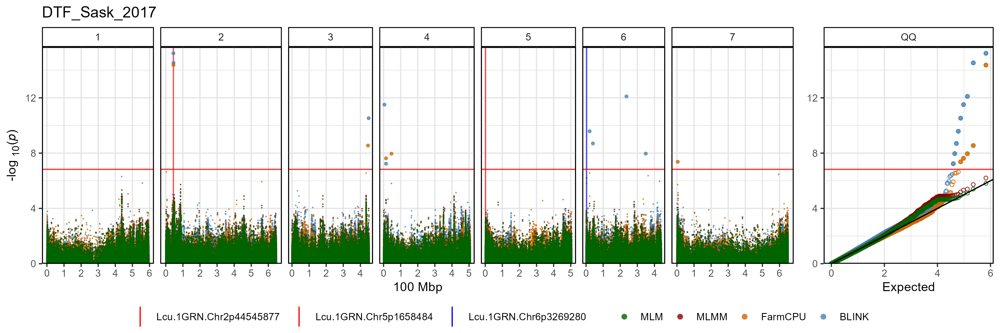

---

```{r eval = F}
# Plot
mp <- gg_Manhattan(
  # Specify a folder with GWAS results
  folder = "GWAS_Results/", 
  # Select a trait to plot
  trait = "DTF_Sask_2017_b",
  # Specify a title
  title = "DTF_Sask_2017 | CV = b",
  # Plot only certain GWAS models
  models = c("MLM","MLMM","FarmCPU","BLINK"),
  # Highlight specific markers
  markers = c("Lcu.1GRN.Chr2p44545877",
              "Lcu.1GRN.Chr5p1658484",
              "Lcu.1GRN.Chr6p3269280"),
  # Create alt labels for the markers
  labels = c("44Mbp","16Mbp","32Mbp"),
  # Specify Color for each marker vline
  vline.colors = c("red","red","blue") 
  )
# Save
ggsave("Fig_DTF_Sask_2017_01_06.png", mp, width = 12, height = 4, bg = "white")
```

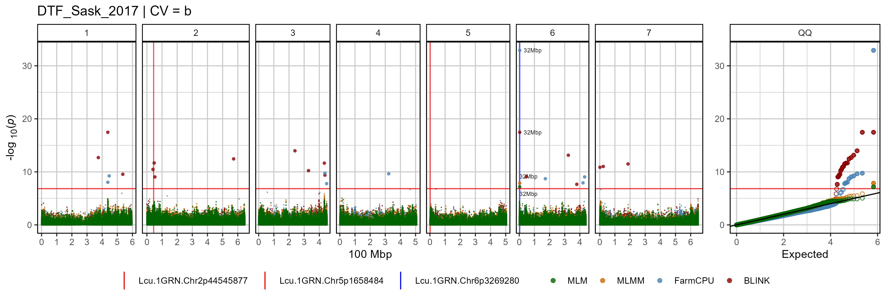

---

### Chr 6 Association

```{r eval = F}
# Plot
mp <- gg_Manhattan(
  # Specify a folder with GWAS results
  folder = "GWAS_Results/", 
  # Select a trait to plot
  trait = "DTF_Sask_2017_b",
  # Specify a title
  title = "DTF_Sask_2017 | CV = b",
  # Plot just Chromosome 6
  chrom = 6,
  # Plot only certain GWAS models
  models = c("MLM","MLMM","FarmCPU","BLINK"),
  # Highlight specific markers
  markers = "Lcu.1GRN.Chr6p3269280",
  # Create alt labels for the markers
  labels = "32Mbp",
  # Specify Color for each marker vline
  vline.colors = "blue" 
  )
# Save
ggsave("Fig_DTF_Sask_2017_01_07.png", mp, width = 12, height = 4, bg = "white")
```

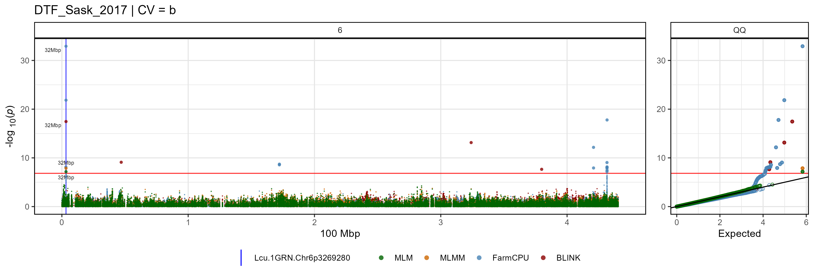

---

```{r echo = T, eval = F}
# Plot
mp <- gg_Manhattan_Zoom(
  # Specify a folder with GWAS results
  folder = "GWAS_Results/", 
  # Select a trait to plot
  trait = "DTF_Sask_2017_b", 
  # Specify a title
  title = "DTF_Sask_2017 | CV = b", 
  # Highlight specific markers
  markers = "Lcu.1GRN.Chr6p3269280", 
  # Create alt labels for the markers
  labels = "3269280", 
  # Specify Color for each marker vline
  vline.color = "blue",
  # Plot just Chromosome 2
  chr = 6,
  pos1 = 0, 
  pos2 = 6000000 
  )
# Save
ggsave("Fig_DTF_Sask_2017_01_08.png", mp, width = 6, height = 10)
```

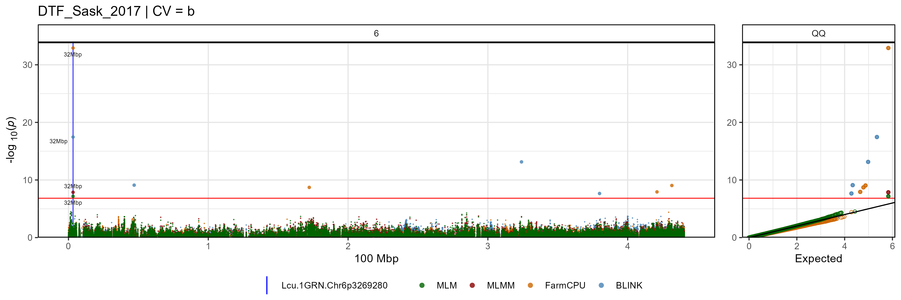

---

## Markers

```{r echo = T, eval = F}
# Plot
mp <- gg_Marker_Box(
  # Genotype data
  xG = myG,
  # Phenotype data
  xY = myY,
  # Select a trait to plot
  trait = "DTF_Sask_2017",
  # Select markers to plot
  markers = "Lcu.1GRN.Chr6p3269280"
  )
# Save
ggsave("Fig_DTF_Sask_2017_02_01.png", mp, width = 6, height = 4)
```

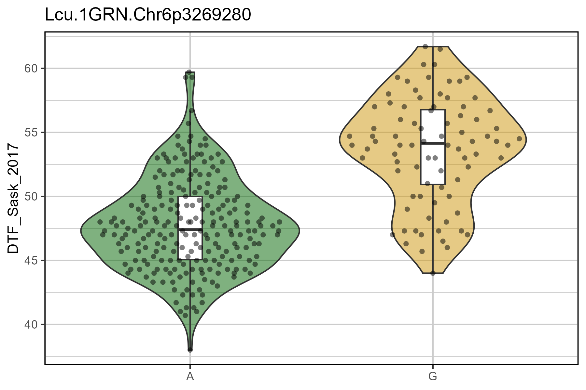

---

```{r echo = T, eval = F}
# Plot
mp <- gg_Marker_Box(
  # Genotype data
  xG = myG, 
  # Phenotype data
  xY = myY, 
  # Select a trait to plot
  trait = "DTF_Sask_2017",
  # Select markers to plot
  markers = c("Lcu.1GRN.Chr2p44545877",
              "Lcu.1GRN.Chr5p1658484",
              "Lcu.1GRN.Chr6p3269280")
  )
# Save
ggsave("Fig_DTF_Sask_2017_02_02.png", mp, width = 6, height = 4)
```

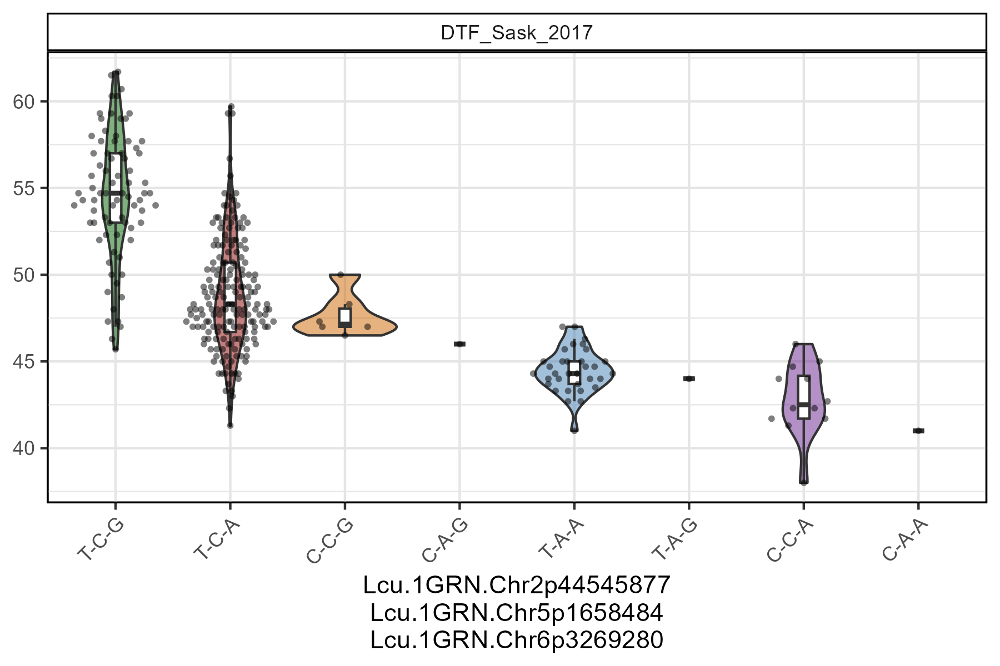

---

## Volcano Plot

```{r echo = T, eval = F}
# Plot
mp <- gg_Volcano(
  # Specify a folder with GWAS results
  folder = "GWAS_Results/",
  # Select a trait to plot
  trait = "DTF_Sask_2017",
  # Highlight specific markers
  markers = "Lcu.2RBY.Chr6p2528817", 
  # Create alt labels for the markers
  labels = "Chr6p2528817"
  )
# Save
ggsave("Fig_DTF_Sask_2017_03_01.png", mp, width = 12, height = 4)
```

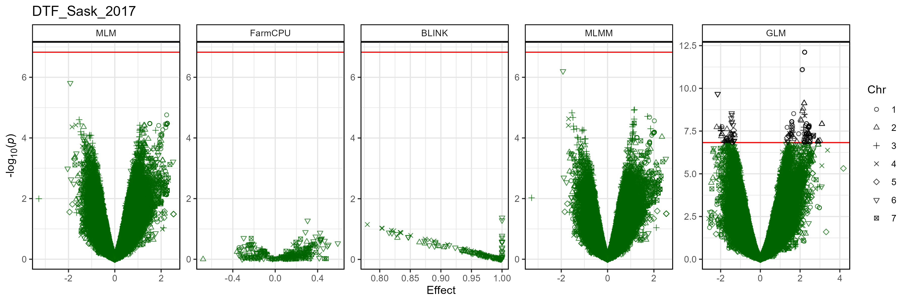

---

## Minor Allele Frequency

```{r}
# Prep data
x1 <- read.csv("GWAS_Results/GAPIT.Association.GWAS_Results.MLM.DTF_Sask_2017.csv") %>%
  mutate(Model = "MLM")
x2 <- read.csv("GWAS_Results/GAPIT.Association.GWAS_Results.BLINK.DTF_Sask_2017.csv") %>%
  mutate(Model = "BLINK")
xx <- bind_rows(x1, x2) %>% mutate(Model = factor(Model, levels = c("MLM","BLINK")))
# Plot
mp <- ggplot(xx, aes(x = MAF, y = -log10(P.value), pch = as.factor(Chr))) + 
  geom_hline(yintercept = -log10(0.05 / (nrow(myG)-1)), 
             color = "red", alpha = 0.7) +
  geom_point(color = "darkgreen", alpha = 0.5) +
  facet_grid(. ~ Model) +
  theme_gwaspr() +
  labs(title = "DTF_Sask_2017", y = "-log10(p)")
# Save
ggsave("Fig_DTF_Sask_2017_03_02.png", mp, width = 10, height = 4)
```

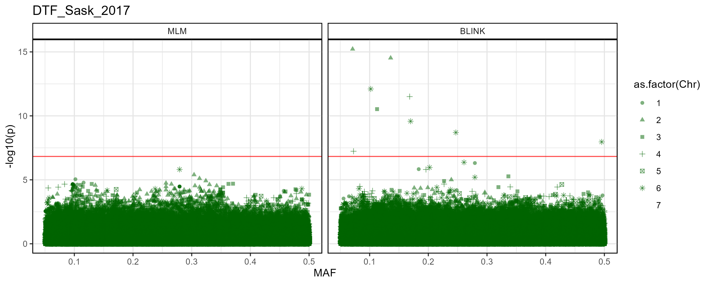

---

# Cotyledon Color

Since this is a simpler qualitative trait, we can assume there should be 1 large effect QTL.

---

## Manhattan Plots

Plot models together (default)

```{r eval = F}
# Plot
mp <- gg_Manhattan(
  # Specify a folder with GWAS results
  folder = "GWAS_Results/", 
  # Select a trait to plot
  trait = "Cotyledon_Color" 
  )
# Save
ggsave("Fig_Cotyledon_Color_01_01.png", mp, width = 12, height = 4, bg = "white")
```

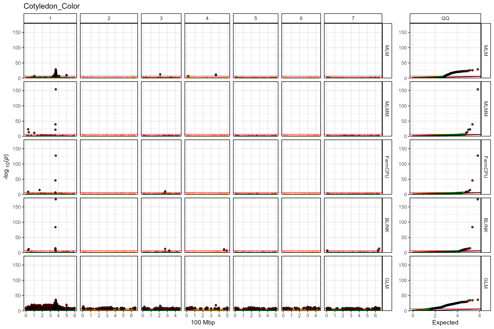

---

Facet each model

```{r eval = F}
# Plot
mp <- gg_Manhattan(
  # Specify a folder with GWAS results
  folder = "GWAS_Results/", 
  # Select a trait to plot
  trait = "Cotyledon_Color",
  # Facet each model
  facet = T 
  )
# Save
ggsave("Fig_Cotyledon_Color_01_02.png", mp, width = 12, height = 12, bg = "white")
```

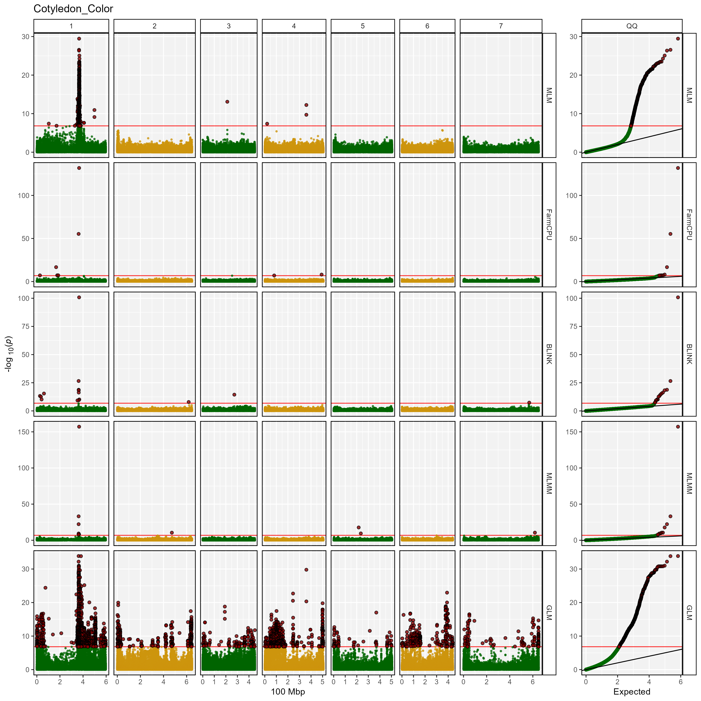

---

Now lets customize the manhattan plot with some selected markers

```{r}
list_Top_Markers(
  # Specify a folder with GWAS results
  folder = "GWAS_Results/", 
  # Select a trait to plot
  traits = "Cotyledon_Color" 
  )
```

```{r eval = F}
# Plot
mp <- gg_Manhattan(
  # Specify a folder with GWAS results
  folder = "GWAS_Results/", 
  # Select a trait to plot
  trait = "Cotyledon_Color", 
  # Plot only certain GWAS models
  models = c("MLMM","FarmCPU","BLINK"),
  # Highlight specific markers
  markers = c("Lcu.1GRN.Chr1p365986872",
              "Lcu.1GRN.Chr1p361840399",
              "Lcu.1GRN.Chr1p362336814"),
  # Create alt labels for the markers
  labels = c("365Mbp","361Mbp","362Mbp"),
  # Specify Color for each marker vline
  vline.colors = rep("green",3) 
  )
# Save
ggsave("Fig_Cotyledon_Color_01_03.png", mp, width = 12, height = 4, bg = "white")
```

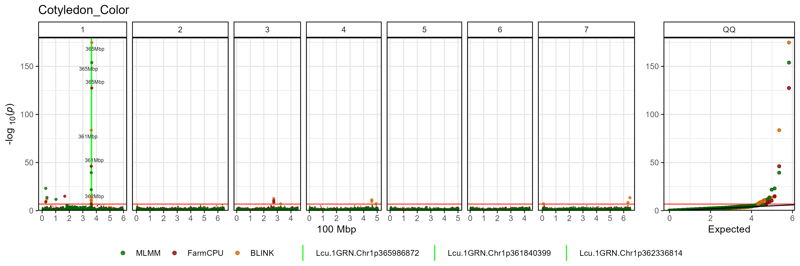

---

### Chr 1 Association

Plot only chromosome 1

```{r eval = F}
# Plot
mp <- gg_Manhattan(
  # Specify a folder with GWAS results
  folder = "GWAS_Results/",
  # Select a trait to plot
  trait = "Cotyledon_Color", 
  # Plot just Chromosome 1
  chrom = 1,
  # Plot only certain GWAS models
  models = c("MLMM","FarmCPU","BLINK"),
  # Highlight specific markers
  markers = c("Lcu.1GRN.Chr1p365986872",
              "Lcu.1GRN.Chr1p361840399",
              "Lcu.1GRN.Chr1p362336814"),
  # Create alt labels for the markers
  labels = c("365Mbp","361Mbp","362Mbp"),
  # Specify Color for each marker vline
  vline.colors = rep("green",3),
  # Set a max p value
  pmax = 50
  )
# Save
ggsave("Fig_Cotyledon_Color_01_04.png", mp, width = 12, height = 4, bg = "white")
```

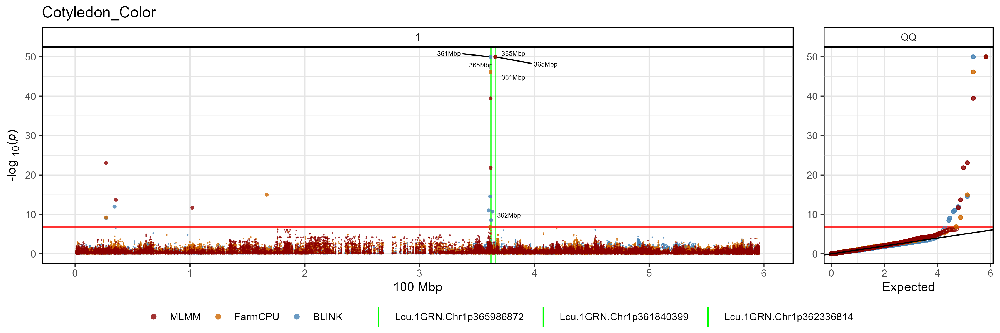

---

Create a Zoomed in Plot with `gg_Manhattan_Zoom`

```{r eval = F}
# Plot
mp <- gg_Manhattan_Zoom(
  # Specify a folder with GWAS results
  folder = "GWAS_Results/", 
  # Select a trait to plot
  trait = "Cotyledon_Color", 
  # Plot just Chromosome 1
  chr = 1,
  pos1 = 360000000,
  pos2 = 370000000,
  # Plot only certain GWAS models
  models = c("MLM","MLMM","FarmCPU","BLINK"),
  # Highlight specific markers
  markers = c("Lcu.1GRN.Chr1p365986872",
              "Lcu.1GRN.Chr1p361840399",
              "Lcu.1GRN.Chr1p362336814"),
  # Create alt labels for the markers
  labels = c("365Mbp","361Mbp","362Mbp"),
  # Specify Color for each marker vline
  vline.colors = rep("green",3) 
  )
# Save
ggsave("Fig_Cotyledon_Color_01_05.png", mp, width = 6, height = 10)
```

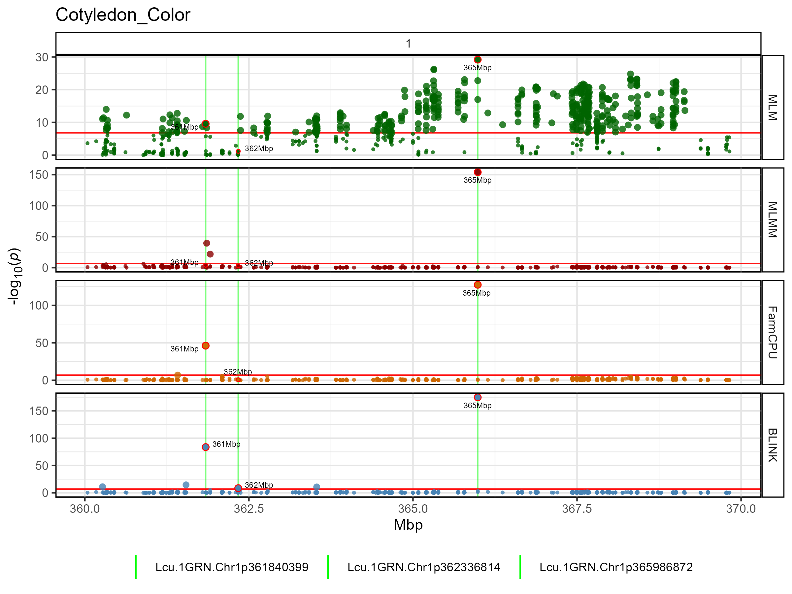

---

## Marker Plots

```{r eval = F}
# Plot
mp <- gg_Marker_Pie(
  # Genotype data
  xG = myG, 
  # Phenotype data
  xY = myY, 
  # Select a trait to plot
  trait = "Cotyledon_Color",
  # Select markers to plot
  markers = "Lcu.1GRN.Chr1p365986872",
  # Specify colors for alleles
  marker.colors = c("darkred","darkgoldenrod3") 
  )
# Save
ggsave("Fig_Cotyledon_Color_02_01.png", mp, width = 6, height = 4)
```

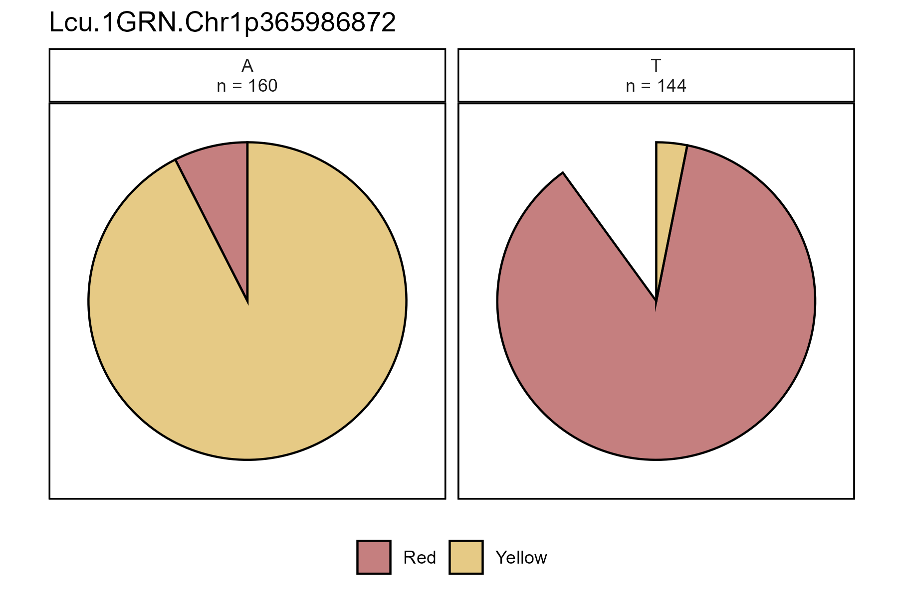

The marker `Lcu.1GRN.Chr1p365986872` is convincing.

---

```{r eval = F}
# Plot
mp <- gg_Marker_Pie(
  # Genotype data
  xG = myG,
  # Phenotype data
  xY = myY,
  # Select a trait to plot
  trait = "Cotyledon_Color",
  # Select markers to plot
  markers = "Lcu.1GRN.Chr1p361840399",
  # Specify colors for alleles
  marker.colors = c("darkred","darkgoldenrod3") 
  )
# Save
ggsave("Fig_Cotyledon_Color_02_02.png", mp, width = 6, height = 4)
```

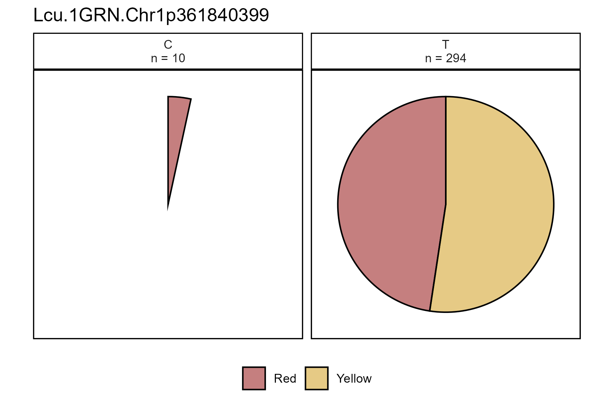

The marker `Lcu.1GRN.Chr1p361840399` is likely a false positive.

---

```{r eval = F}
# Plot
mp <- gg_Marker_Pie(
  # Genotype data
  xG = myG, 
  # Phenotype data
  xY = myY, 
  # Select a trait to plot
  trait = "Cotyledon_Color",
  # Select markers to plot
  markers = "Lcu.1GRN.Chr1p362336814",
  # Specify colors for alleles
  marker.colors = c("darkred","darkgoldenrod3") 
  )
# Save
ggsave("Fig_Cotyledon_Color_02_03.png", mp, width = 6, height = 4)
```

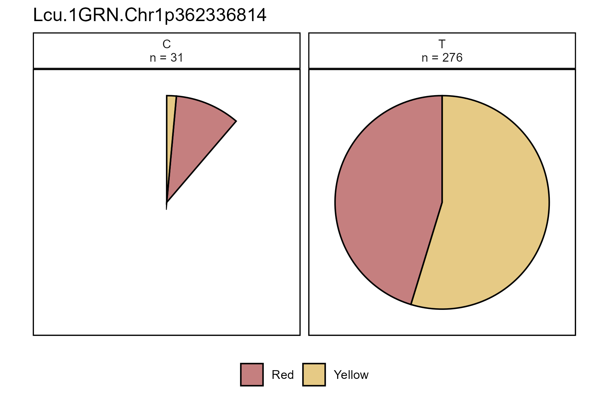

The marker `Lcu.1GRN.Chr1p362336814` is also likely a false positive.

---

```{r eval = F}
# Plot
mp <- gg_Marker_Pie(
  # Genotype data
  xG = myG, 
  # Phenotype data
  xY = myY,
  # Select a trait to plot
  trait = "Cotyledon_Color",
  # Select markers to plot
  markers = c("Lcu.1GRN.Chr1p365986872",
              "Lcu.1GRN.Chr1p361840399",
              "Lcu.1GRN.Chr1p362336814"),
  # Specify colors for alleles
  marker.colors = c("darkred","darkgoldenrod3") 
  )
# Save
ggsave("Fig_Cotyledon_Color_02_04.png", mp, width = 6, height = 4)
```

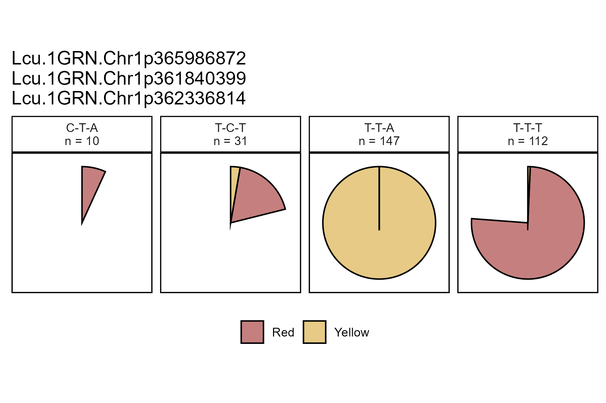

---

## Volcano Plot

```{r eval = F}
# Plot
mp <- gg_Volcano(
  # Specify a folder with GWAS results
  folder = "GWAS_Results/",
  # Select a trait to plot
  trait = "Cotyledon_Color",
  # Plot only certain GWAS models
  models = c("MLM","MLMM","FarmCPU","BLINK"),
  # Highlight specific markers
  markers = c("Lcu.1GRN.Chr1p365986872",
              "Lcu.1GRN.Chr1p361840399",
              "Lcu.1GRN.Chr1p362336814"), 
  # Create alt labels for the markers
  labels = c("365Mbp","351Mbp","362Mbp") 
  )
# Save
ggsave("Fig_Cotyledon_Color_03_01.png", mp, width = 12, height = 4)
```

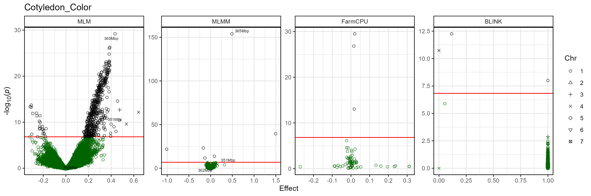

---

## Minor Allele Frequency

```{r eval = F}
# Prep data
x1 <- read.csv("GWAS_Results/GAPIT.Association.GWAS_Results.MLM.Cotyledon_Color.csv") %>%
  mutate(Model = "MLM")
x2 <- read.csv("GWAS_Results/GAPIT.Association.GWAS_Results.BLINK.Cotyledon_Color.csv") %>%
  mutate(Model = "BLINK")
xx <- bind_rows(x1, x2) %>% mutate(Model = factor(Model, levels = c("MLM","BLINK")))
# Plot
mp <- ggplot(xx, aes(x = MAF, y = -log10(P.value), pch = as.factor(Chr))) + 
  geom_hline(yintercept = -log10(0.05 / (nrow(myG)-1)), 
             color = "red", alpha = 0.7) +
  geom_point(color = "darkgreen", alpha = 0.5) +
  facet_grid(. ~ Model) +
  theme_gwaspr() +
  labs(title = "Cotyledon_Color", y = "-log10(p)")
# Save
ggsave("Fig_Cotyledon_Color_03_02.png", mp, width = 10, height = 4)
```

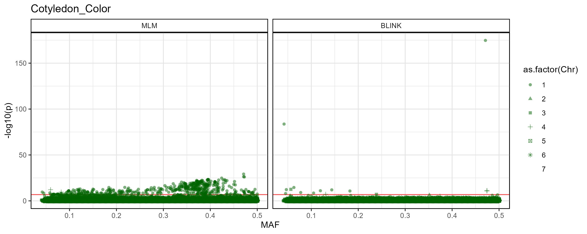

---

# Bonus

## PCA

```{r}
library(plotly)
library(htmlwidgets)
xx <- read.csv("GWAS_Results/GAPIT.Genotype.PCA.csv") %>%
  left_join(myY, by = c("taxa"="Name"))
```

---

### DTF Nepal 2017

[https://derekmichaelwright.github.io/dblogr/academic/gwas_tutorial/Fig_PCA_DTF_Nepal_2017.html](https://derekmichaelwright.github.io/dblogr/academic/gwas_tutorial/Fig_PCA_DTF_Nepal_2017.html){target="_blank"}

```{r}
# Prep data
myColors <- c("darkred", "darkgoldenrod3", "darkblue")
# Plot
mp <- plot_ly(xx, x = ~PC1, y = ~PC2, z = ~PC3, text = ~taxa,
              color = ~DTF_Nepal_2017, colors = myColors) %>%
  add_markers() %>%
  layout(scene = list(title = "DTF Nepal 2017"))
# Save
saveWidget(as_widget(mp), "Fig_PCA_DTF_Nepal_2017.html")
mp
```

---

### DTF Sask 2017

[https://derekmichaelwright.github.io/dblogr/academic/gwas_tutorial/Fig_PCA_DTF_Sask_2017.html](https://derekmichaelwright.github.io/dblogr/academic/gwas_tutorial/Fig_PCA_DTF_Sask_2017.html){target="_blank"}

```{r}
# Plot
mp <- plot_ly(xx, x = ~PC1, y = ~PC2, z = ~PC3, text = ~taxa,
              color = ~DTF_Sask_2017, colors = myColors) %>%
  add_markers() %>%
  layout(scene = list(title = "DTF Sask 2017"))
# Save
saveWidget(as_widget(mp), "Fig_PCA_DTF_Sask_2017.html")
mp
```

---

### Cotyledon Color

[https://derekmichaelwright.github.io/dblogr/academic/gwas_tutorial/Fig_PCA_Cotyledon_Color.html](https://derekmichaelwright.github.io/dblogr/academic/gwas_tutorial/Fig_PCA_Cotyledon_Color.html){target="_blank"}

```{r}
# Prep data
myColors <- c("darkgoldenrod3", "darkblue")
# Plot
mp <- plot_ly(xx, x = ~PC1, y = ~PC2, z = ~PC3, text = ~taxa,
              color = ~Cotyledon_Color, colors = myColors) %>%
  add_markers() %>%
  layout(scene = list(title = "Cotyledon_Color"))
# Save
saveWidget(as_widget(mp), "Fig_PCA_Cotyledon_Color.html")
mp
```

---

## SNP Density Plot

Package Source: [https://github.com/YinLiLin/R-CMplot](https://github.com/YinLiLin/R-CMplot){target="_blank"}

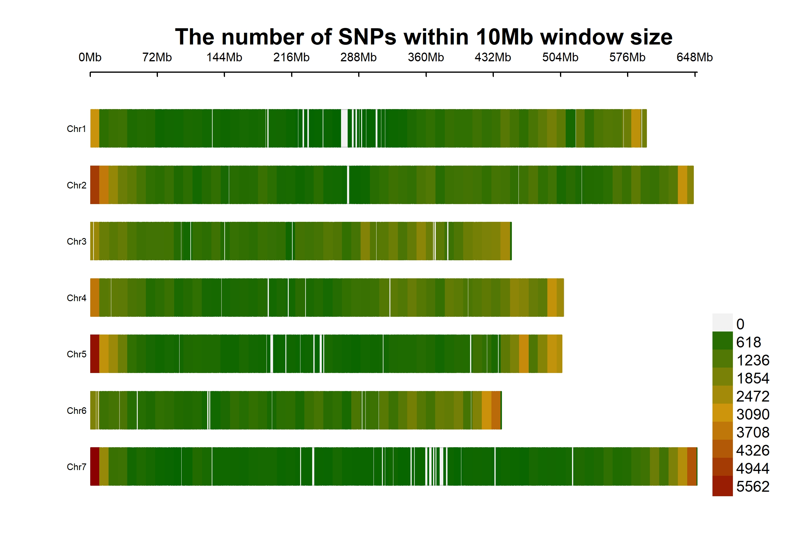

```{r eval = F}
library(CMplot)
# Prep data
xx <- myG %>% select(rs, chrom, pos) 
# Plot
CMplot(xx, plot.type="d", bin.size=1e7, 
       chr.den.col=c("darkgreen", "darkgoldenrod3", "darkred"), 
       file="jpg", file.output=T, verbose=F, width=9, height=6,
       file.name = "LDP")
```

---

## LD Decay

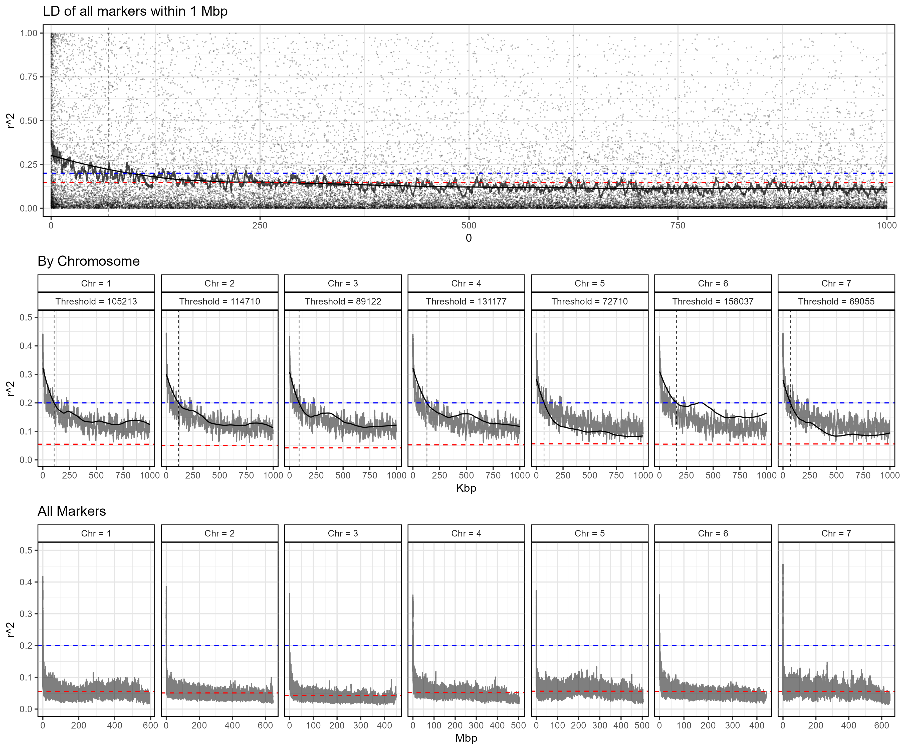

```{r eval = F}
library(genetics)
xG <- read.csv("Data/myG_hmp.csv", header = T)
dna <- data.frame(stringsAsFactors = F,
                  Symbol = c("A", "C", "G", "T", "U", 
                             "R", "Y", "S", "W", "K", "M", "N"),
                  Value  = c("A/A","C/C","G/G","T/T","U/U",
                             "A/G","C/T","G/C","A/T","G/T","A/C","N/N") )
xx <- xG[,c(-2,-5,-6,-7,-8,-9,-10,-11)]
for(i in 4:ncol(xx)) {
  xx[xx[,i]=="N", i] <- NA 
  xx[,i] <- plyr::mapvalues(xx[,i], dna$Symbol, dna$Value)
}
#
LD_Decay <- function(x, folder = "LD/", Chr = 1, Num = 200) {
  xc <- x %>% filter(chrom == Chr) 
  xr <- xc %>% column_to_rownames("rs")
  xr <- xr[,c(-1,-2)]
  rr <- round(runif(Num, 1, nrow(xr)))
  while(sum(duplicated(rr))>0) {
    ra <- round(runif(sum(duplicated(rr)), 1, nrow(xr)))
    rr <- rr[!duplicated(rr)]
    rr <- c(rr, ra)
  }
  rr <- rr[order(rr)]
  xr <- xr[rr,]
  #
  xi <- xr %>% t() %>% as.data.frame()
  myLD <- genetics::LD(genetics::makeGenotypes(xi))
  save(myLD, file = paste0(folder, "LD_Chrom_", Chr, "_", Num, ".Rdata"))
}
# Calculate LD per chromosome
LD_Decay(x = xx, Chr = 1, Num = 1000)
LD_Decay(x = xx, Chr = 2, Num = 1000)
LD_Decay(x = xx, Chr = 3, Num = 1000)
LD_Decay(x = xx, Chr = 4, Num = 1000)
LD_Decay(x = xx, Chr = 5, Num = 1000)
LD_Decay(x = xx, Chr = 6, Num = 1000)
LD_Decay(x = xx, Chr = 7, Num = 1000)
```


```{r eval = F}
# Create function
movingAverage <- function(x, n = 5) {
  stats::filter(x, rep(1 / n, n), sides = 2)
}
# Prep data
xG <- read.csv("Data/myG_hmp.csv", header = T)
xx <- NULL
for(i in 1:7) {
  xc <- xG %>% filter(chrom == i) 
  load(paste0("LD/LD_Chrom_",i,"_1000.Rdata"))
  xi <- myLD$`R^2` %>% as.data.frame() %>% 
    rownames_to_column("SNP1") %>% 
    gather(SNP2, LD, 2:ncol(.)) %>% 
    filter(!is.na(LD)) %>%
    mutate(Chr = i,
           SNP1_d = plyr::mapvalues(SNP1, xc$rs, xc$pos, warn_missing = F),
           SNP2_d = plyr::mapvalues(SNP2, xc$rs, xc$pos, warn_missing = F),
           Distance = as.numeric(SNP2_d) - as.numeric(SNP1_d)) %>%
    arrange(Distance, rev(LD))
  #
  xii <- xi %>% filter(Distance < 1000000)
  myloess <- stats::loess(LD ~ Distance, data = xii, span=0.50)
  #
  xi <- xi %>% 
    mutate(Moving_Avg = movingAverage(LD, n = 100),
           Loess_Chr = ifelse(Distance < 1000000, predict(myloess), NA))
  #
  xx <- bind_rows(xx, xi)
}
#
x1 <- xx %>% group_by(Chr) %>%
  summarise(Mean_LD = mean(Moving_Avg, na.rm = T))
x2 <- xx %>% filter(Loess_Chr < 0.2) %>% group_by(Chr) %>% 
  summarise(Threshold_0.2 = min(Distance, na.rm = T))
#x3 <- xx %>% left_join(x1, by = "Chr") %>%
#  group_by(Chr) %>% filter(Moving_Avg < Mean_LD) %>%
#  summarise(Threshold_0.1 = min(Distance, na.rm = T))
myChr <-  x1 %>% left_join(x2, by = "Chr") #%>%
  #left_join(x3, by = "Chr")
#
xx <- left_join(xx, myChr, by = "Chr") %>%
  mutate(Chr = as.factor(Chr))
yy <- xx %>% filter(Distance < 1000000) %>%
  arrange(Distance, rev(LD))
myloess <- stats::loess(LD ~ Distance, data = yy, span=0.50)
yy <- yy %>% 
  mutate(Moving_Avg = movingAverage(LD, n = 100),
         Loess_Geno = ifelse(Distance < 1000000, predict(myloess), NA))
#
x1 <- yy %>% summarise(Mean_LD = mean(Moving_Avg, na.rm = T))
x2 <- yy %>% filter(Loess_Chr < 0.2) %>%  
  summarise(Threshold_0.2 = min(Distance, na.rm = T))
myGeno <-   cross_join(x1, x2)
# Plot first 1 Mbp
mp1 <- ggplot(yy, aes(x = Distance/1000, y = Loess_Geno)) +
  geom_point(aes(y = LD), size = 0.2, pch = 15, alpha = 0.25) +
  #geom_line(aes(y = Moving_Avg), color = "red", lwd = 1) +
  geom_line(aes(y = Moving_Avg), alpha = 0.7) +
  geom_line() +
  geom_hline(yintercept = 0.2, color = "blue", lty = 2) +
  geom_hline(data = myGeno, aes(yintercept = Mean_LD), color = "red", lty = 2) +
  geom_vline(data = myGeno, lty = 2, size = 0.3, alpha = 0.8,
             aes(xintercept = Threshold_0.2/1000)) +
  scale_x_continuous(seq(0, 1000, by = 100), expand = c(0,10)) +
  theme_gwaspr(legend.position = "none",
               axis.title.y = ggtext::element_markdown()) +
  labs(title = "LD of all markers within 1 Mbp", y = "r^2", x = "Kbp")
# Plot first 1 Mbp
mp2 <- ggplot(yy, aes(x = Distance/1000, y = Loess_Chr)) +
  geom_line(aes(y = Moving_Avg), alpha = 0.5) +
  geom_line() +
  geom_hline(data = myChr, aes(yintercept = Mean_LD), color = "red", lty = 2) +
  geom_hline(yintercept = 0.2, color = "blue", lty = 2) +
  scale_y_continuous(breaks = seq(0, 0.5, by = 0.1), limits = c(0,0.5)) +
  facet_wrap(paste("Chr =", Chr) + paste("Threshold =", Threshold_0.2) ~ ., 
             ncol = 7, scales = "free_x") +
  geom_vline(data = myChr, lty = 2, size = 0.3, alpha = 0.8,
             aes(xintercept = Threshold_0.2/1000)) +
  theme_gwaspr(legend.position = "none",
               axis.title.y = ggtext::element_markdown()) +
  labs(title = "By Chromosome", y = "r^2", x = "Kbp")
# Plot full chromsomes
mp3 <- ggplot(xx, aes(x = Distance/1000000, y = Moving_Avg)) +
  geom_line(size = 0.5, alpha = 0.5) +
  geom_hline(data = myChr, aes(yintercept = Mean_LD), color = "red", lty = 2) +
  geom_hline(yintercept = 0.2, color = "blue", lty = 2) +
  scale_y_continuous(breaks = seq(0, 0.5, by = 0.1), limits = c(0,0.5)) +
  facet_wrap(paste("Chr =", Chr) ~ ., ncol = 7, scales = "free_x") +
  theme_gwaspr(legend.position = "none",
               axis.title.y = ggtext::element_markdown()) +
  labs(title = "All Markers", y = "r^2", x = "Mbp")
#yy <- yy %>% filter(Distance < 10000)
# Append
mp <- ggarrange(mp1, mp2, mp3, ncol = 1, nrow = 3)
# Save
ggsave("Fig_06_LD.png", mp , width = 12, height = 10)
```

---

```{r eval = F, echo = F}
# BLUPs

Best linear unbiased prediction (BLUP)

> - **BLUP Tutorial**: [https://rpubs.com/amputz/BLUP](https://rpubs.com/amputz/BLUP){target="_blank"}> - **Tutorial**: [](){target="_blank"}


https://www.journalofdairyscience.org/article/S0022-0302(91)78602-5/pdf

The challenge for animal breeders was that we were always interested in predicting the ‘breeding value’ (random variable) for animals. This was in contrast to many fields where the only interest is in some fixed quantity such as a treatment effect.
```

```{r eval = F, echo = F}
# Prep data
xx <- read.csv("GWAS_Results/GAPIT.Association.Prediction_results.MLM.DTF_Sask_2017.csv") %>%
  rename(Name=Taxa) %>%
  left_join(myY, by = "Name")
# Plot
ggplot(xx, aes(x = Prediction, y = BLUP)) +
  geom_point() +
  theme_gwaspr() +
  labs(title = "")
ggplot(xx, aes(x = DTF_Sask_2017, y = Prediction)) +
  geom_abline() +
  geom_point() +
  theme_gwaspr() +
  labs(title = "")
ggplot(xx, aes(x = DTF_Sask_2017, y = BLUP)) +
  geom_abline() +
  geom_point() +
  theme_gwaspr() +
  labs(title = "")
#
xx <- read.csv("GWAS_Results/GAPIT.Association.Prediction_results.MLM.DTF_Nepal_2017.csv") %>%
  rename(Name=Taxa) %>%
  left_join(myY, by = "Name")
# Plot
ggplot(xx, aes(x = Prediction, y = BLUP)) +
  geom_point() +
  theme_gwaspr() +
  labs(title = "")
ggplot(xx, aes(x = DTF_Nepal_2017, y = Prediction)) +
  geom_abline() +
  geom_point() +
  theme_gwaspr() +
  labs(title = "")
ggplot(xx, aes(x = DTF_Nepal_2017, y = BLUP)) +
  geom_abline() +
  geom_point() +
  theme_gwaspr() +
  labs(title = "")
```


```{r eval = F, echo = F}
myCaption <- "derekmichaelwright.github.io/dblogr/ | Data: AGILE"
mp %>%
  annotate_figure(fig.lab.pos = "bottom.right", fig.lab.size = 6,
                  fig.lab = myCaption)
```
