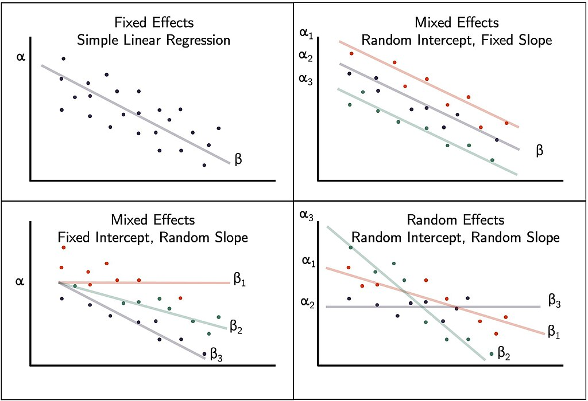

```{r setup, include=FALSE}
knitr::opts_chunk$set(echo = T, message = F, warning = F)
```

---

# Introduction

- GxE: [https://en.wikipedia.org/wiki/Gene%E2%80%93environment_interaction](https://en.wikipedia.org/wiki/Gene%E2%80%93environment_interaction){target="_blank"}
-Mixed Models [https://en.wikipedia.org/wiki/Mixed_model](https://en.wikipedia.org/wiki/Mixed_model){target="_blank"}

https://www.azandisresearch.com/2022/12/31/visualize-mixed-effect-regressions-in-r-with-ggplot2/


https://nariyoo.com/stata-introduction-to-multilevel-modeling-xtmixed/

https://bookdown.org/steve_midway/DAR/random-effects.html



```{r class.source = "fold-show"}
# devtools::install_github("derekmichaelwright/agData")
library(agData)
library(lme4)      # For mixed-effects models
# Prep data
myCaption <- "derekmichaelwright.github.io/dblogr/ | Data: AGILE"
```

```{r echo = F, eval = F}
# Prep data
# Experiments
names_Expt <- c("Rosthern, Canada 2016",    "Rosthern, Canada 2017",
                "Sutherland, Canada 2016",  "Sutherland, Canada 2017", 
                "Sutherland, Canada 2018",  "Central Ferry, USA 2018",
                "Bhopal, India 2016",       "Bhopal, India 2017",
                "Jessore, Bangladesh 2016", "Jessore, Bangladesh 2017",
                "Bardiya, Nepal 2016",      "Bardiya, Nepal 2017",
                "Cordoba, Spain 2016",      "Cordoba, Spain 2017",
                "Marchouch, Morocco 2016",  "Marchouch, Morocco 2017",
                "Metaponto, Italy 2016",    "Metaponto, Italy 2017" )
# Experiment short names
names_ExptShort <- c("Ro16", "Ro17", "Su16", "Su17", "Su18", "Us18",
                     "In16", "In17", "Ba16", "Ba17", "Ne16", "Ne17", 
                     "Sp16", "Sp17", "Mo16", "Mo17", "It16", "It17" )

# Macro-Environments
names_MacroEnvs <- c("Temperate", "South Asia", "Mediterranean")

#
xx <- read.csv("https://raw.githubusercontent.com/derekmichaelwright/AGILE_LDP_Phenology/refs/heads/master/data/data_raw.csv") %>%
  mutate(ExptShort = plyr::mapvalues(Expt, names_Expt, names_ExptShort),
         MacroEnv = plyr::mapvalues(Expt, names_Expt, 
                      c(rep(names_MacroEnvs[1], 6), rep(names_MacroEnvs[2], 6), rep(names_MacroEnvs[3], 6)))) %>%
  select(MacroEnv, ExptShort, everything()) %>%
  select(-DTF2)
write.csv(xx, "data_mixed_models.csv", row.names = F)
xx %>% filter(!is.na(DTF)) %>% group_by(Expt) %>% summarise(Val = n())
```

---

# Data

> - `r shiny::icon("save")` [global-energy-substitution.csv](global-energy-substitution.csv)
> - `r shiny::icon("newspaper")` Wright, *et al.* **Understanding photothermal interactions can help expand production range and increase genetic diversity of lentil (Lens culinaris Medik.)**. *Plants, People, Planet*. (**2020**) 00: 1-11. [doi.org/10.1002/ppp3.10158](https://doi.org/10.1002/ppp3.10158){target="_blank"}

```{r}
# Prep data
dd <- read.csv("data_mixed_models.csv") %>%
  mutate(REP = DTM - DTF,
         VEG = DTF - DTE)
DT::datatable(dd)
```

# GxE {.tabset .tabset-pills}

## GxE and Plotting Functions

```{r}
myGxE <- function(xx, myTraits = c("DTE","DTF","DTS","DTM","VEG","REP")) {
  # Initialize an empty list to store variance component data
  var_list <- list()
  blup_list <- list() #store blups values
  # Loop over each trait
  for(i in myTraits) {
    # Define the model formula with ENV as a fixed factor
    formula <- as.formula(paste(i, "~ Expt + (1 | Name) + (1 | Name:Expt) + (1 | Expt:Rep)"))
    # Fit the mixed-effects model
    model <- lmer(formula, data = xx)  # Replace with your actual data
    # Extract variance components for random effects
    var_i <- VarCorr(model) %>% as.data.frame(vc)
    # Calculate total phenotypic variance 
    var_total <- sum(var_i$vcov) 
    # Calculate proportions as percentages
    var_i$Proportion <- (var_i$vcov / var_total) * 100
    #
    var_i <- var_i %>% mutate(Trait = i) %>%
      select(Component=grp, Trait, Proportion, vcov, sdcor)
    # Store results in the list
    var_list[[i]] <- var_i
  }
  # Combine all trait data into one data frame
  var_table <- do.call(rbind, var_list) %>%
    mutate(Trait = factor(Trait, levels = myTraits),
           Component = factor(Component, 
              levels = c("Residual", "Expt:Rep", "Name:Expt", "Name"),
              labels = c("Residual + Env", "Rep:Env", "G x E", "Genetic")))
  # Output
  var_table
}
```


```{r}
gg_GxE <- function(xx) {
  myColors <- c("darkred", "purple4", "steelblue", "darkgreen")
  # Create the stacked bar plot
  mp <- ggplot(xx, aes(x = Trait, y = Proportion, fill = Component)) +
    geom_col(position = "stack", color = "black", alpha = 0.7) +
    scale_fill_manual(values = myColors) +
    theme_agData_col() +
    labs(title = "Proportion of Phenotypic Variance by Trait",
         y = "Proportion of Total Variance (%)",
         caption = myCaption)
}
```

---

## All Environments

> - `r shiny::icon("save")` [var_All.csv](var_All.csv)

```{r}
# Save variance table 
var_table <- myGxE(dd)
write.csv(var_table, "var_All.csv", row.names = F)
# Plot
mp <- gg_GxE(var_table)
ggsave("variance_All.png", mp, width = 6, height = 4)
```

```{r echo = F}
ggsave("featured.png", mp, width = 6, height = 4)
```

---

## Temperate

> - `r shiny::icon("save")` [var_Temperate.csv](var_Temperate.csv)

```{r}
# Save variance table 
var_table <- myGxE(dd %>% filter(MacroEnv == "Temperate"))
write.csv(var_table, "var_Temperate.csv", row.names = F)
# Plot
mp <- gg_GxE(var_table)
ggsave("variance_Temperate.png", mp, width = 6, height = 4)
```

---

## Mediterranean

> - `r shiny::icon("save")` [var_Mediterranean.csv](var_Mediterranean.csv)

```{r}
# Save variance table 
var_table <- myGxE(dd %>% filter(MacroEnv == "Mediterranean"))
write.csv(var_table, "var_Mediterranean.csv", row.names = F)
# Plot
mp <- gg_GxE(var_table)
ggsave("variance_Mediterranean.png", mp, width = 6, height = 4)
```

---

## South Asia

> - `r shiny::icon("save")` [var_SouthAsia.csv](var_SouthAsia.csv)

```{r}
# Save variance table 
var_table <- myGxE(dd %>% filter(MacroEnv == "South Asia"))
write.csv(var_table, "var_SouthAsia.csv", row.names = F)
# Plot
mp <- gg_GxE(var_table)
ggsave("variance_SouthAsia.png", mp, width = 6, height = 4)
```


---

```{r eval = F, echo = F}
theme_minimal() +
    theme(axis.text.x = element_text(angle = 45, hjust = 1),
          plot.title = element_text(size = 12),
          axis.text = element_text(size = 9),
          axis.title = element_text(size = 11),
          strip.text = element_text(size = 11),
          legend.position = "bottom",
          legend.title = element_blank(),
          panel.grid = element_blank()  # Remove grid lines for clarity
          ) +
    #scale_fill_brewer(palette = "Set3")  # Use a color palette for better visualization
```
