```{r setup, include=FALSE}
knitr::opts_chunk$set(message = F, warning = F)
```

---

# Introduction {.tabset .tabset-pills}

## Links

> - GxE: [https://en.wikipedia.org/wiki/Gene%E2%80%93environment_interaction](https://en.wikipedia.org/wiki/Gene%E2%80%93environment_interaction){target="_blank"}
> - Mixed Models [https://en.wikipedia.org/wiki/Mixed_model](https://en.wikipedia.org/wiki/Mixed_model){target="_blank"}
> - https://www.azandisresearch.com/2022/12/31/visualize-mixed-effect-regressions-in-r-with-ggplot2/
> - https://nariyoo.com/stata-introduction-to-multilevel-modeling-xtmixed/
> - https://bookdown.org/steve_midway/DAR/random-effects.html

## Visual

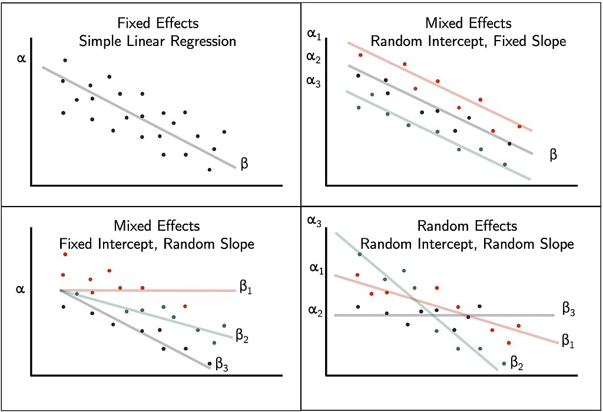

```{r}
# devtools::install_github("derekmichaelwright/agData")
library(agData)
library(lme4)      # For mixed-effects models
# Prep data
myCaption <- "derekmichaelwright.github.io/dblogr/academic/gxe"
```

```{r echo = F, eval = F}
# Prep data
# Experiments
names_Expt <- c("Rosthern, Canada 2016",    "Rosthern, Canada 2017",
                "Sutherland, Canada 2016",  "Sutherland, Canada 2017", 
                "Sutherland, Canada 2018",  "Central Ferry, USA 2018",
                "Bhopal, India 2016",       "Bhopal, India 2017",
                "Jessore, Bangladesh 2016", "Jessore, Bangladesh 2017",
                "Bardiya, Nepal 2016",      "Bardiya, Nepal 2017",
                "Cordoba, Spain 2016",      "Cordoba, Spain 2017",
                "Marchouch, Morocco 2016",  "Marchouch, Morocco 2017",
                "Metaponto, Italy 2016",    "Metaponto, Italy 2017" )
# Experiment short names
names_ExptShort <- c("Ro16", "Ro17", "Su16", "Su17", "Su18", "Us18",
                     "In16", "In17", "Ba16", "Ba17", "Ne16", "Ne17", 
                     "Sp16", "Sp17", "Mo16", "Mo17", "It16", "It17" )

# Macro-Environments
names_MacroEnvs <- c("Temperate", "South Asia", "Mediterranean")

#
xx <- read.csv("https://raw.githubusercontent.com/derekmichaelwright/AGILE_LDP_Phenology/refs/heads/master/data/data_raw.csv") %>%
  mutate(ExptShort = mv(Expt, names_Expt, names_ExptShort),
         MacroEnv = mv(Expt, names_Expt, 
                      c(rep(names_MacroEnvs[1], 6), 
                        rep(names_MacroEnvs[2], 6), 
                        rep(names_MacroEnvs[3], 6)))) %>%
  select(MacroEnv, ExptShort, everything()) %>%
  select(-DTF2)
write.csv(xx, "data_mixed_models.csv", row.names = F)
xx %>% filter(!is.na(DTF)) %>% group_by(Expt) %>% summarise(Val = n())
```

---

# Data {.tabset .tabset-pills}

> - `r shiny::icon("save")` [data_gxe.csv](data_gxe.csv)
> - `r shiny::icon("newspaper")` Wright, *et al.* **Understanding photothermal interactions can help expand production range and increase genetic diversity of lentil (Lens culinaris Medik.)**. *Plants, People, Planet*. (**2020**) 00: 1-11. [doi.org/10.1002/ppp3.10158](https://doi.org/10.1002/ppp3.10158){target="_blank"}

```{r}
# Prep data
myExpts <- c("Ro16","Ro17","Su16","Su17","Su18","Us18",
             "In16","In17","Ba16","Ba17","Ne16","Ne17",
             "Mo16","Mo17","Sp16","Sp17","It16","It17")
#
dd <- read.csv("data_gxe.csv") %>%
  mutate(ExptShort = factor(ExptShort, levels = myExpts),
         REP = DTM - DTF, # calculate Reproductive period
         VEG = DTF - DTE) # calculate vegetative period
```

## Table

```{r}
DT::datatable(dd)
```

---

## DTE, DTF, DTS, DTM

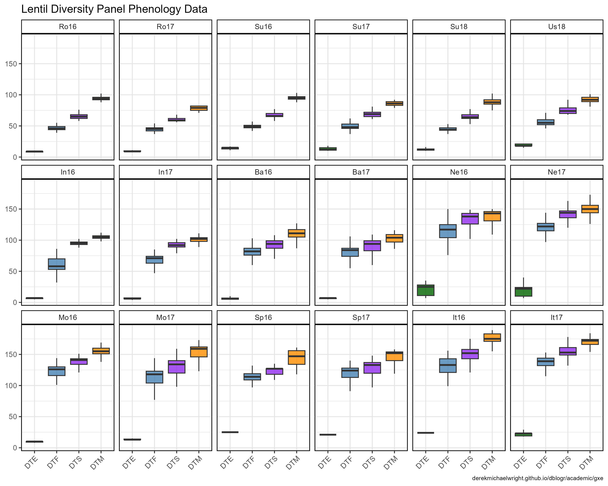

```{r}
# Prep data
xx <- dd %>% select(-VEG, -REP) %>%
  gather(Trait, Value, DTE, DTF, DTS, DTM) %>%
  mutate(Trait = factor(Trait, levels = c("DTE","DTF","DTS","DTM")))
# plot
mp <- ggplot(xx, aes(x = Trait, y = Value, fill = Trait)) +
  geom_boxplot(outlier.shape = NA, alpha = 0.8) +
  facet_wrap(ExptShort ~ ., ncol = 6) +
  scale_fill_manual(values = c("darkgreen","steelblue","purple2","darkorange")) +
  theme_agData(legend.position = "none",
               axis.text.x = element_text(angle = 45, hjust = 1)) +
  labs(title = "Lentil Diversity Panel Phenology Data",
       x = NULL, y = NULL, caption = myCaption)
ggsave("gxe_1_01.png", mp, width = 10, height = 8)
```

---

## VEG + REP

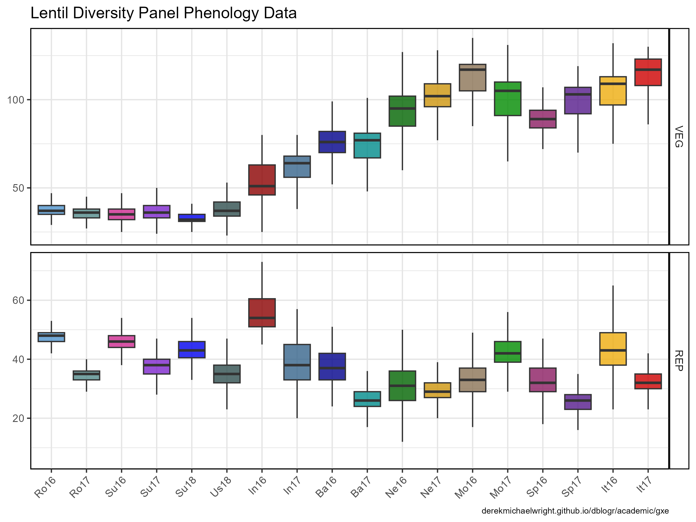

```{r}
# Prep data
xx <- dd %>% select(-DTE, -DTF, -DTS, -DTM) %>%
  gather(Trait, Value, VEG, REP) %>%
  mutate(Trait = factor(Trait, levels = c("VEG","REP")))
# plot
mp <- ggplot(xx, aes(x = ExptShort, y = Value, fill = Expt)) +
  geom_boxplot(outlier.shape = NA, alpha = 0.8) +
  facet_grid(Trait ~ ., scale = "free_y") +
  scale_fill_manual(values = agData_Colors) +
  theme_agData(legend.position = "none",
               axis.text.x = element_text(angle = 45, hjust = 1)) +
  labs(title = "Lentil Diversity Panel Phenology Data",
       x = NULL, y = NULL, caption = myCaption)
ggsave("gxe_1_02.png", mp, width = 8, height = 6)
```

---

## Single Expt

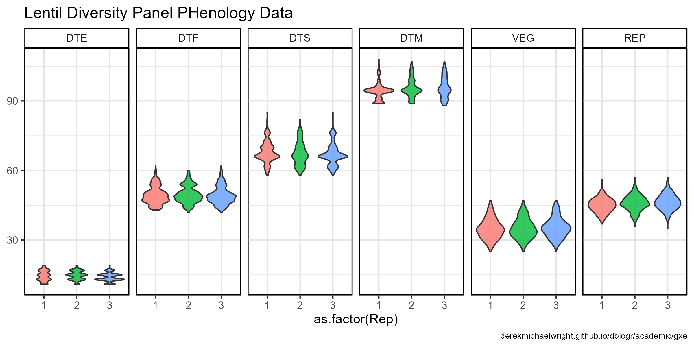

```{r}
# Prep data
xx <- dd %>% gather(Trait, Value, DTE, DTF, DTS, DTM, VEG, REP) %>%
  filter(ExptShort == "Su16") %>%
  mutate(Rep = factor(Rep),
         Trait = factor(Trait, levels = c("DTE","DTF","DTS","DTM","VEG","REP")))
# plot
mp <- ggplot(xx, aes(x = as.factor(Rep), y = Value, fill = Rep)) +
  geom_violin(alpha = 0.8) +
  facet_grid(. ~ Trait) +
  theme_agData(legend.position = "none") +
  labs(title = "Lentil Diversity Panel PHenology Data",
       y = NULL, caption = myCaption)
ggsave("gxe_1_03.png", mp, width = 8, height = 4)
```

---

# GxE {.tabset .tabset-pills}

## GxE and Plotting Functions

```{r}
myGxE <- function(xx, myTraits = c("DTE","DTF","DTS","DTM","VEG","REP")) {
  # Initialize an empty list to store variance component data
  var_list <- list()
  blup_list <- list() #store blups values
  # Loop over each trait
  for(i in myTraits) {
    # Define the model formula with ENV as a fixed factor
    formula <- as.formula(paste(i, "~ Expt + (1 | Name) + (1 | Name:Expt) + (1 | Expt:Rep)"))
    # Fit the mixed-effects model
    model <- lmer(formula, data = xx)  # Replace with your actual data
    # Extract variance components for random effects
    var_i <- VarCorr(model) %>% as.data.frame(vc)
    # Calculate total phenotypic variance 
    var_total <- sum(var_i$vcov) 
    # Calculate proportions as percentages
    var_i$Proportion <- (var_i$vcov / var_total) * 100
    #
    var_i <- var_i %>% mutate(Trait = i) %>%
      select(Component=grp, Trait, Proportion, vcov, sdcor)
    # Store results in the list
    var_list[[i]] <- var_i
  }
  # Combine all trait data into one data frame
  var_table <- do.call(rbind, var_list) %>%
    mutate(Trait = factor(Trait, levels = myTraits),
           Component = factor(Component, 
              levels = c("Residual", "Expt:Rep", "Name:Expt", "Name"),
              labels = c("Residual + Env", "Rep:Env", "G x E", "Genetic")))
  # Output
  var_table
}
```

```{r}
gg_GxE_bar <- function(xx) {
  myColors <- c("darkred", "purple4", "steelblue", "darkgreen")
  # Create the stacked bar plot
  mp <- ggplot(xx, aes(x = Trait, y = Proportion, fill = Component)) +
    geom_col(position = "stack", color = "black", alpha = 0.7) +
    geom_text(aes(label = round(Proportion)), position = position_stack(vjust = 0.5)) +
    scale_fill_manual(values = myColors) +
    theme_agData_col() +
    labs(title = "Proportion of Phenotypic Variance by Trait",
         y = "Proportion of Total Variance (%)",
         caption = myCaption)
}
```

```{r}
gg_GxE_pie <- function(xx, ncol = 3) {
  myColors <- c("darkred", "purple4", "steelblue", "darkgreen")
  # Create the stacked bar plot
  mp <- ggplot(xx, aes(x = "x", y = Proportion, fill = Component)) +
    geom_col(position = "stack", alpha = 0.7) +
    geom_text(aes(label = round(Proportion)), position = position_stack(vjust = 0.5)) +
    coord_polar("y", start = 0) +
    facet_wrap(. ~ Trait, ncol = ncol) +
    scale_fill_manual(values = myColors) +
    scale_x_discrete(limits = c("x_empty", "x")) +
    theme_agData_pie() +
    guides(fill = guide_legend(reverse = T)) +
    labs(title = "Proportion of Phenotypic Variance by Trait",
         y = "Proportion of Total Variance (%)",
         caption = myCaption)
}
```

---

## All Environments

> - `r shiny::icon("save")` [gxe_All.csv](gxe_All.csv)

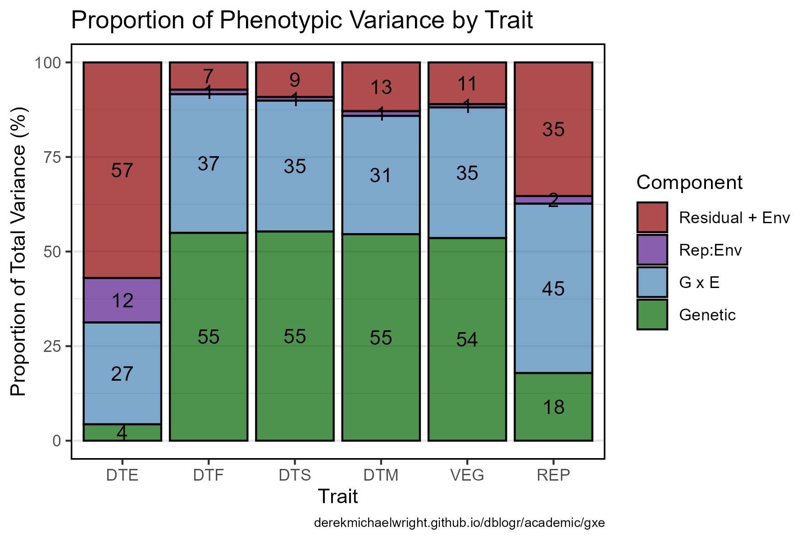

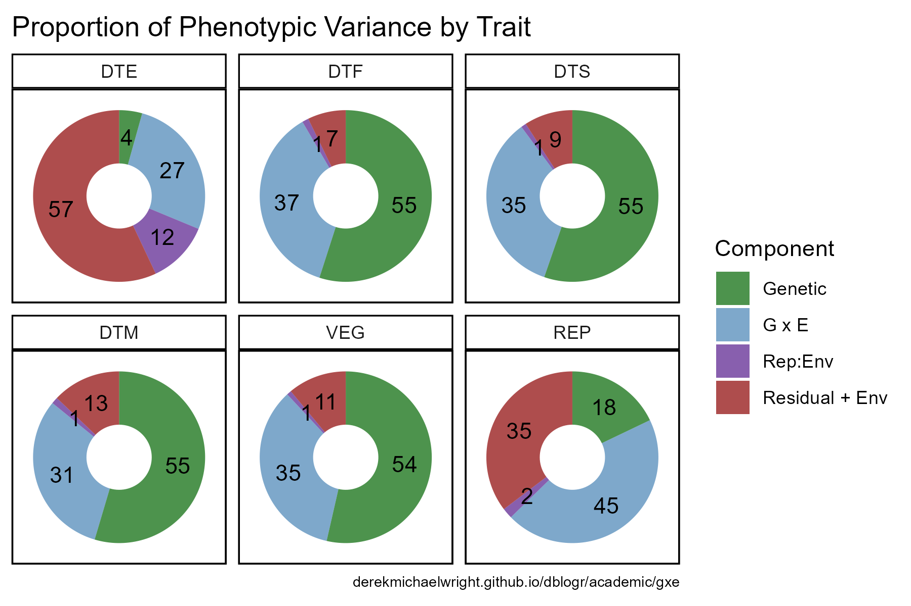

```{r}
# Save variance table 
var_table <- myGxE(dd)
write.csv(var_table, "gxe_All.csv", row.names = F)
# Plot
mp <- gg_GxE_bar(var_table)
ggsave("gxe_All_01.png", mp, width = 6, height = 4)
mp <- gg_GxE_pie(var_table)
ggsave("gxe_All_02.png", mp, width = 6, height = 4)
```

```{r echo = F}
ggsave("featured.png", mp, width = 6, height = 4)
```

---

## Temperate

> - `r shiny::icon("save")` [gxe_Temperate.csv](gxe_Temperate.csv)

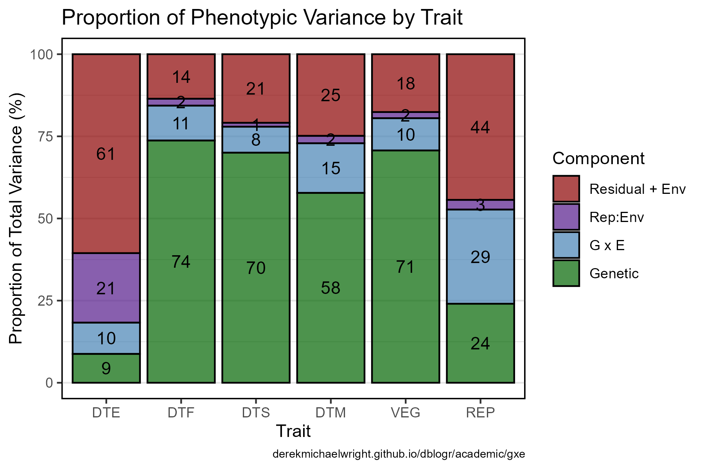

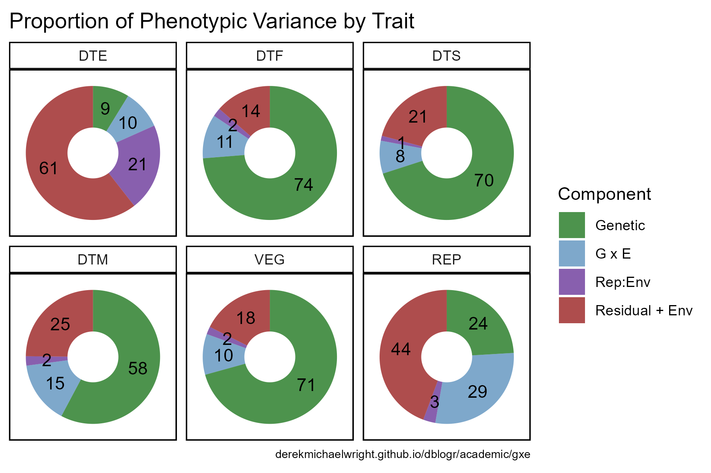

```{r}
# Save variance table 
var_table <- myGxE(dd %>% filter(MacroEnv == "Temperate"))
write.csv(var_table, "gxe_Temperate.csv", row.names = F)
# Plot
mp <- gg_GxE_bar(var_table)
ggsave("gxe_Temperate_01.png", mp, width = 6, height = 4)
mp <- gg_GxE_pie(var_table)
ggsave("gxe_Temperate_02.png", mp, width = 6, height = 4)
```

---

## Mediterranean

> - `r shiny::icon("save")` [gxe_Mediterranean.csv](gxe_Mediterranean.csv)

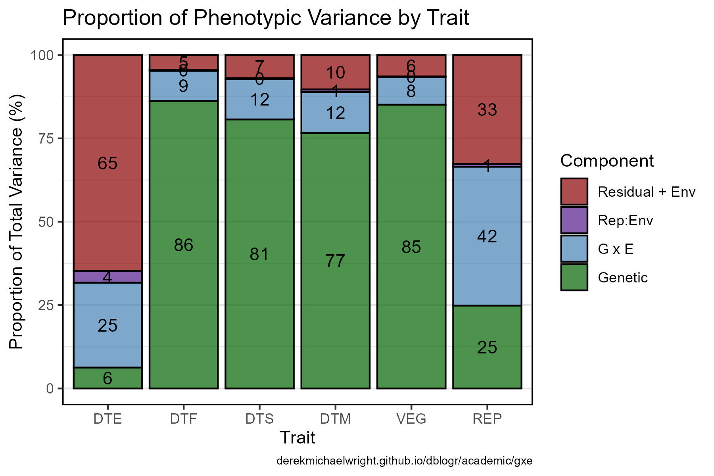

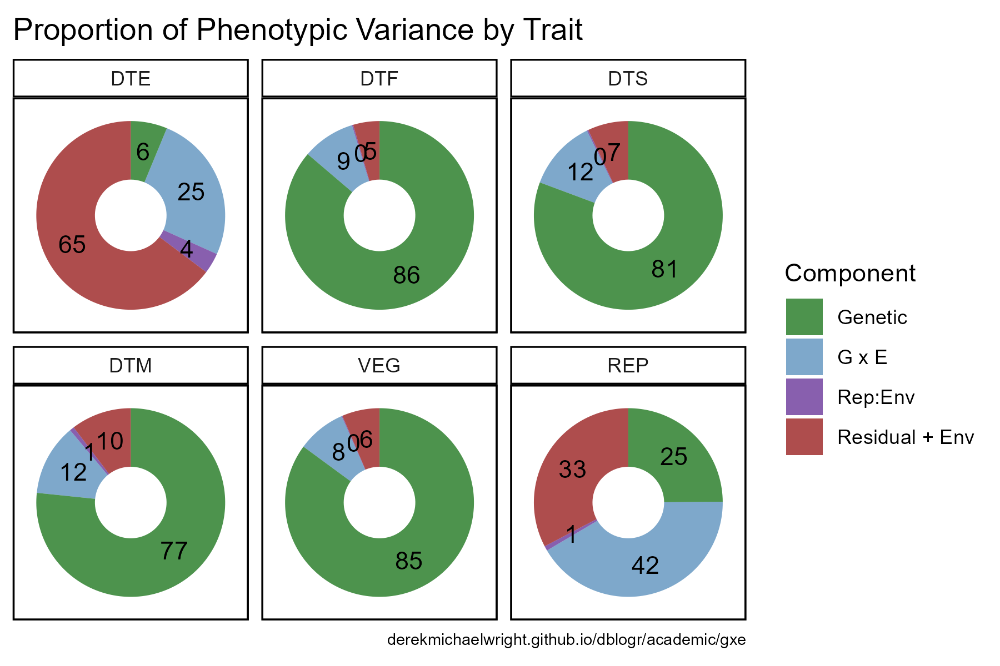

```{r}
# Save variance table 
var_table <- myGxE(dd %>% filter(MacroEnv == "Mediterranean"))
write.csv(var_table, "gxe_Mediterranean.csv", row.names = F)
# Plot
mp <- gg_GxE_bar(var_table)
ggsave("gxe_Mediterranean_01.png", mp, width = 6, height = 4)
mp <- gg_GxE_pie(var_table)
ggsave("gxe_Mediterranean_02.png", mp, width = 6, height = 4)
```

---

## South Asia

> - `r shiny::icon("save")` [gxe_SouthAsia.csv](gxe_SouthAsia.csv)

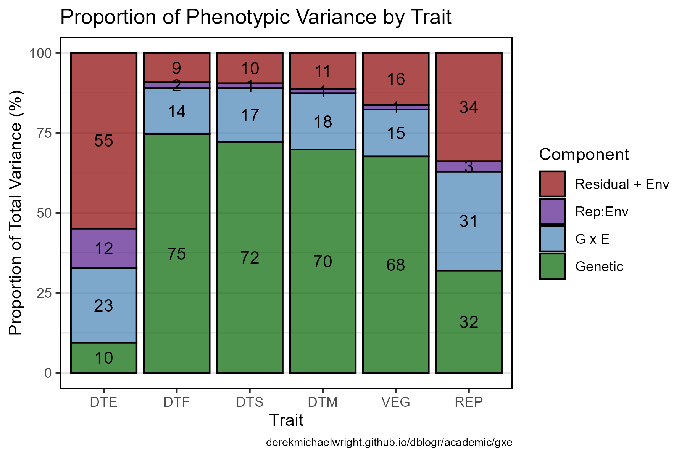

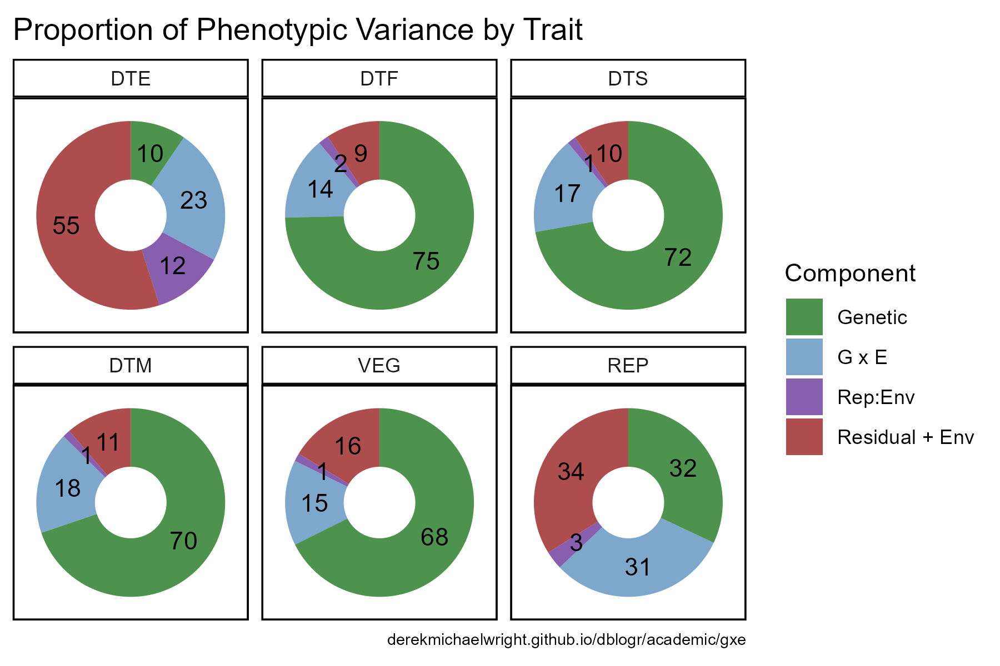

```{r}
# Save variance table 
var_table <- myGxE(dd %>% filter(MacroEnv == "South Asia"))
write.csv(var_table, "gxe_SouthAsia.csv", row.names = F)
# Plot
mp <- gg_GxE_bar(var_table)
ggsave("gxe_SouthAsia_01.png", mp, width = 6, height = 4)
mp <- gg_GxE_pie(var_table)
ggsave("gxe_SouthAsia_02.png", mp, width = 6, height = 4)
```

---

```{r eval = F, echo = F}

# BLUPs vs BLUEs

https://www.linkedin.com/pulse/blues-vs-blups-plant-breeding-simple-guide-andrey-alonso-vega-czehe/

Both BLUEs and BLUPs are derived from the mixed linear model:

y = Xβ + Zu + e

Where:

y = vector of observations
β = vector of fixed effects (estimated as BLUEs)
u = vector of random effects (predicted as BLUPs)
X, Z = design matrices
e = residual error

The key insight: BLUEs estimate fixed effects, while BLUPs predict random effects. Both can come from the same model.

BLUEs: Best Linear Unbiased Estimators

What they are: BLUEs estimate the expected value of fixed effects, representing the true mean performance of specific, repeatable treatments or conditions.

When to use BLUEs:

Reporting variety trial results for registration
Comparing specific treatments (fertilizer rates, planting dates)
Publishing final variety recommendations
I used them to summarize multi-environment trial data before performing GWAS
Any situation where you want to estimate what happened in your specific conditions

Key characteristics:

No shrinkage toward population mean
Treat each genotype/treatment as having a unique, fixed value
Optimal when treatments are repeatable and you care about their specific performance

BLUPs: Best Linear Unbiased Predictors

What they are: BLUPs predict the breeding value or genetic potential of genotypes, treating them as random samples from a population with known variance structure.

When to use BLUPs:

Making selection decisions in breeding programs
Genomic selection and calculating GEBVs (Genomic Estimated Breeding Values)
Any situation where you want to predict future genetic potential

Key characteristics:

Shrinkage toward population mean (amount depends on heritability)
Borrow information from relatives through relationship matrices
Account for genetic correlations across environments
Optimal for prediction when genotypes are samples from a breeding population

The Role of Heritability

The effectiveness of BLUPs depends critically on heritability (h²):

High heritability (h² > 0.6): Minimal shrinkage, BLUPs ≈ individual means
Low heritability (h² < 0.3): Substantial shrinkage, BLUPs heavily influenced by population mean and relatives
Very low heritability (h² < 0.1): BLUPs may approach population mean for poorly connected genotypes

Decision framework

I think about it like this: BLUEs for current performance, BLUPs for genetic potential

Borrowing Information: It's All About the Model

A common misconception is that "BLUEs don't borrow information." This isn't quite right:

BLUEs borrow information through the model structure (e.g., accounting for environmental effects, spatial trends)
BLUPs additionally borrow information through genetic relationships and variance components
Both benefit from well-designed experiments and appropriate model specification

Implementation Considerations

Sample Size Effects:

Small trials: BLUPs often more reliable due to shrinkage
Large trials: BLUEs and BLUPs converge as individual estimates become more precise

Computational Requirements:

BLUEs: Generally faster, especially for large datasets
BLUPs: More intensive, especially with genomic relationship matrices

Data Structure:

Balanced data: Both perform well
Unbalanced/missing data: Mixed models handle naturally, BLUPs often preferred

A Simple Example

Consider evaluating 100 sugar beet lines across 5 environments:

For variety registration (BLUEs): "Variety SugarBeet1 averaged 65 bu/acre across locations, significantly higher than the check variety with 59 bu/acre."

For breeding decisions (BLUPs): "Line SugarBeet1 has a predicted breeding value of 10 + bu/acre, above the population mean accounting for its genetic relationships and trial connectivity."

The BLUE tells you what happened; the BLUP tells you what to expect.

Key Takeaways

BLUEs and BLUPs answer different questions | observed performance vs. genetic potential
Both come from mixed models | the distinction is fixed vs. random effects, not different methodologies
Context determines choice | reporting requires BLUEs, selection benefits from BLUPs
Heritability matters | low heritability makes BLUPs especially valuable
Consider your audience | stakeholders often want BLUEs, breeders often need BLUPs
```

---

```{r eval = F, echo = F}
theme_minimal() +
    theme(axis.text.x = element_text(angle = 45, hjust = 1),
          plot.title = element_text(size = 12),
          axis.text = element_text(size = 9),
          axis.title = element_text(size = 11),
          strip.text = element_text(size = 11),
          legend.position = "bottom",
          legend.title = element_blank(),
          panel.grid = element_blank()  # Remove grid lines for clarity
          ) +
    #scale_fill_brewer(palette = "Set3")  # Use a color palette for better visualization
```
