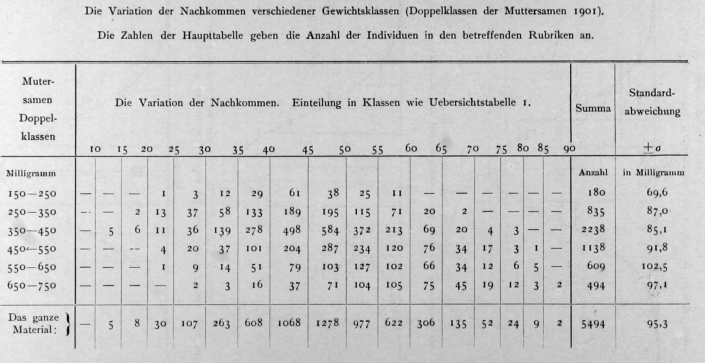
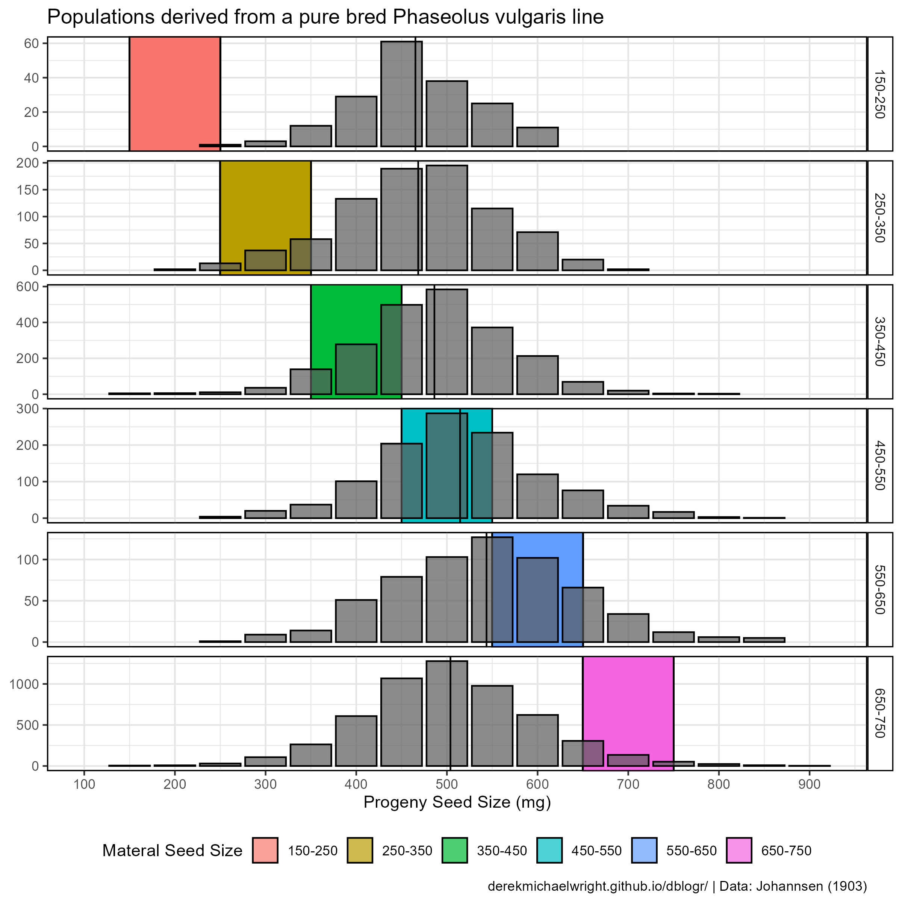
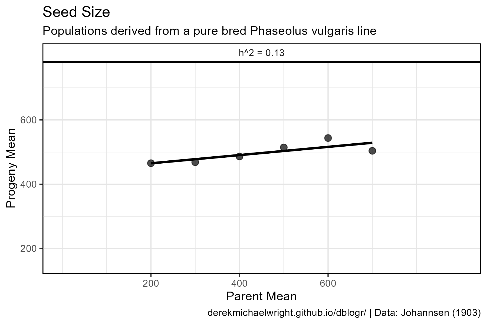
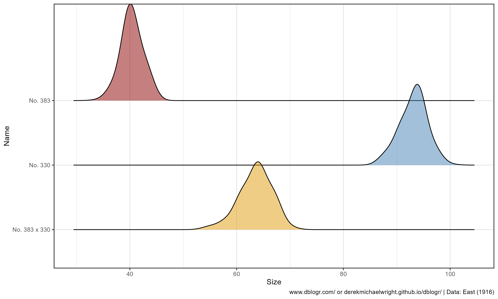
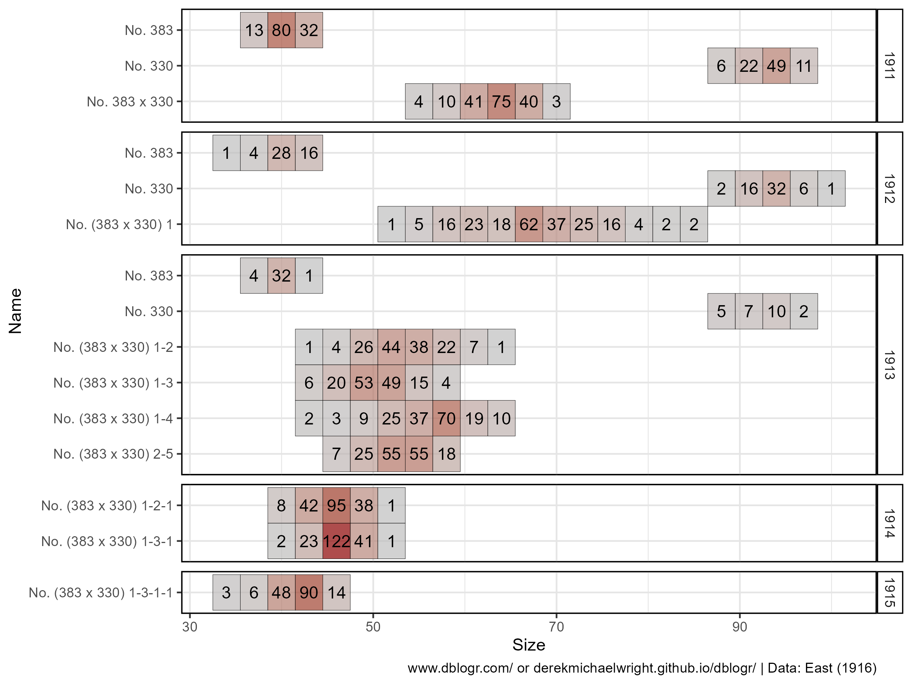
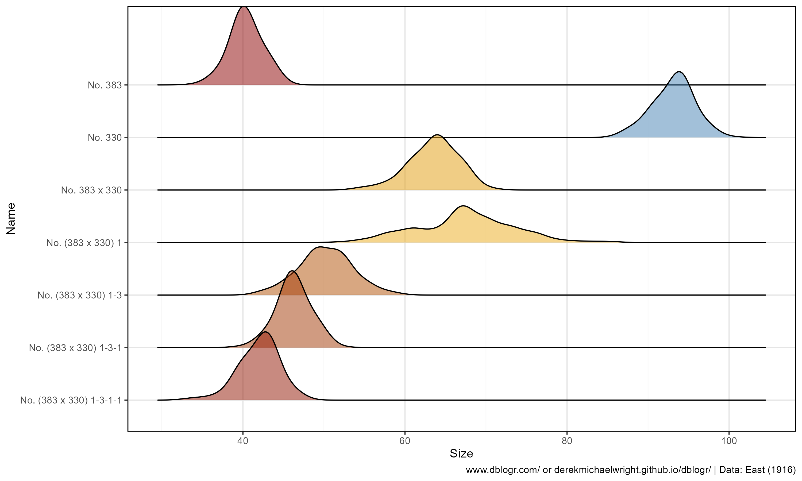
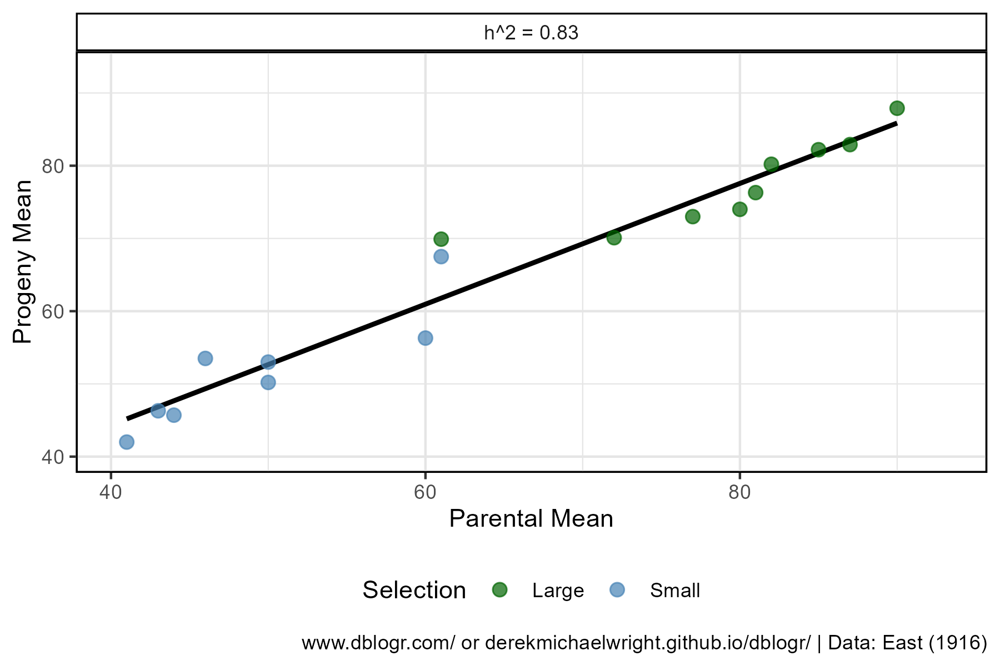
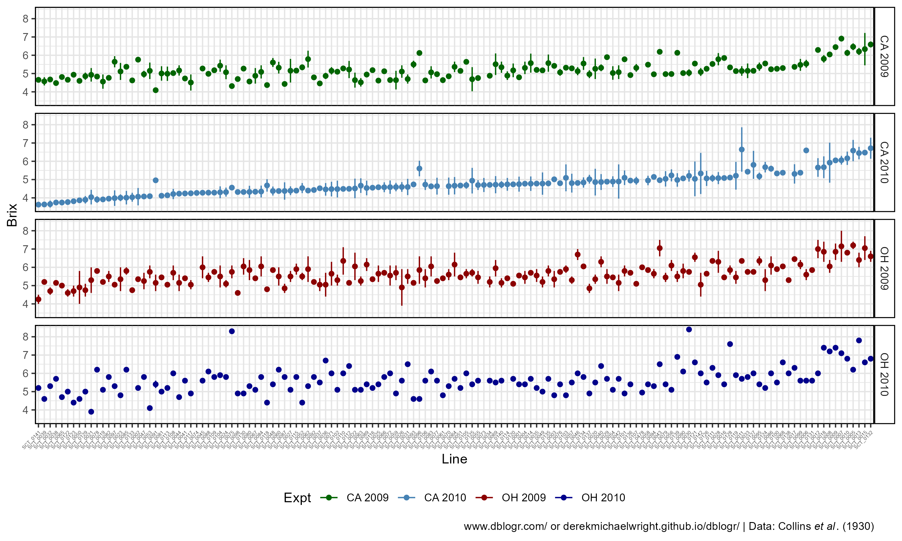
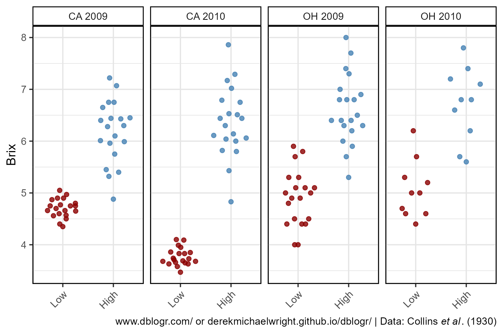
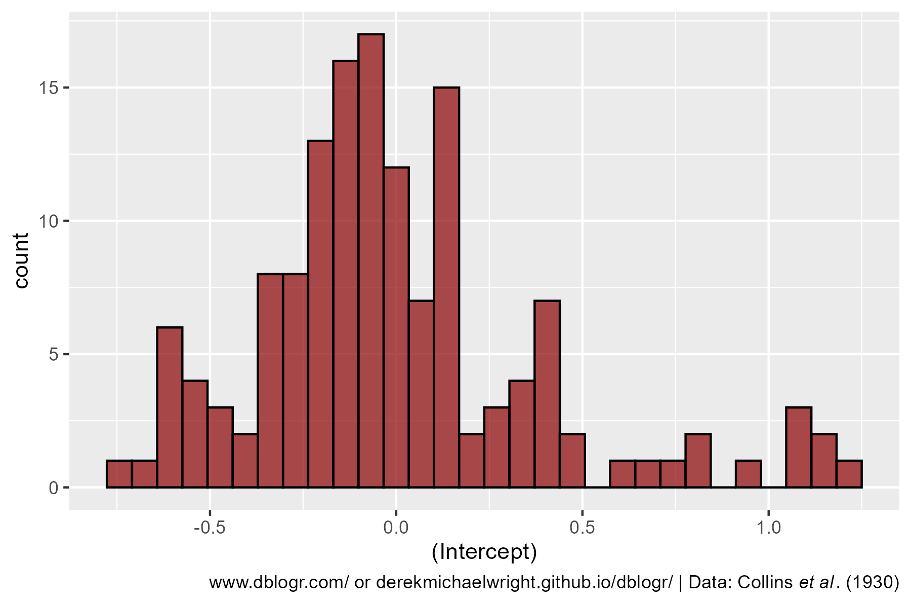

```{r setup, include=FALSE}
knitr::opts_chunk$set(echo = T, message = F, warning = F)
```

---

# Introduction

**Heritability**: an estimate of the degree of phenotypic variation due to genetic variation.

**Phenotypic variance**, the variation for a particular trait, can be attributed to both genetic and environmental factors. This leads to the concept of **Heritability**, the degree of variation in a phenotypic trait in a population that is due to genetic variation between individuals in that population. There are two types of heritability used by researchers: **Broad Sense Heritability** ($H^2$) and **Narrow Sense Heritability** ($h^2$).

**Broad Sense Heritability**:

$H^2=\frac{V_G}{V_P}=\frac{V_G}{V_G+V_E}$

where:

- $V_G$ = Genetic variance
- $V_E$ = Environmental variance
- $V_P$ = Phenotypic variance

$V_P=V_G+V_E$

**Narrow Sense Heritability**:

$h^2=\frac{V_A}{V_P}$

where:

- $V_A$ = Additive variance
- $V_P$ = Phenotypic variance

**Breeders Equation**:

$R=h^2S$

which can be rearranged to calculate narrow sense heritability:

$h^2=R/S$

where:

- $S$ = Selection differential
- $R$ = Response to selection (genetic gain)

$S=Parent_{selected}-Parent_{mean}$

$R=Progeny_{mean}-Parent_{mean}$


---

# Prepare Data

```{r class.source = 'fold-show'}
# devtools::install_github("derekmichaelwright/agData")
library(agData)
library(ggridges)
library(lme4)
```

---

# Johannesen 1903

> - `r shiny::icon("save")` [data_johannsen1903_1.csv](data_johannsen1903_1.csv)
> - `r shiny::icon("save")` [data_johannsen1903_2.csv](data_johannsen1903_2.csv)
> - `r shiny::icon("globe")` https://archive.org/details/b28117335/page/n5/mode/2up

Extra links

> - `r shiny::icon("globe")` https://www.jstor.org/stable/2427337
> - `r shiny::icon("globe")` https://www.jstor.org/stable/2331511

```{r}
# Prep data
myCaption1 <- paste("www.dblogr.com/ or derekmichaelwright.github.io/dblogr/ | Data: Johannsen (1903)")
d1 <- read.csv("data_johannsen1903_1.csv") 
d2 <- read.csv("data_johannsen1903_2.csv")
```

---

## Selection requires genetic variance

In a pure-line, without genetic variance, there will not be any room for selection.

Johannsen showed this by selecting for different sized seeds from a pure bred line and showed that this did not have any selection potential. 



```{r}
DT::datatable(d1)
```


```{r}
# Prep data
myTitle <- "Populations derived from a pure bred Phaseolus vulgaris line"
xx <- d1 %>% gather(`Materal Seed Size`, Count, 2:ncol(.)) %>%
  mutate(`Materal Seed Size` = substr(`Materal Seed Size`, 2, 8),
         `Materal Seed Size` = gsub("\\.", "-", `Materal Seed Size`),
         pMin = as.numeric(substr(`Materal Seed Size`, 1, 3)),
         pMax = as.numeric(substr(`Materal Seed Size`, 5, 7)))
xm <- xx %>% filter(!is.na(Count)) %>% uncount(Count) %>% group_by(`Materal Seed Size`) %>% 
  summarise(Seed.Mass = mean(Seed.Mass))
# Plot
mp <- ggplot(xx, aes(x = Seed.Mass, y = Count)) +
  geom_rect(aes(fill = `Materal Seed Size`, xmin = pMin, xmax = pMax), 
            ymin = Inf, ymax = -Inf, alpha = 0.7, color = "black") +
  geom_col(alpha = 0.7, color = "black") +
  geom_vline(data = xm, aes(xintercept = Seed.Mass)) +
  facet_grid(`Materal Seed Size` ~ ., scales = "free_y") +
  scale_x_continuous(breaks = seq(100, 900, by = 100)) +
  guides(fill = guide_legend(nrow = 1)) +
  theme_agData(legend.position = "bottom") +
  labs(title = myTitle, y = NULL, x = "Progeny Seed Size (mg)", caption = myCaption1)
ggsave("heritability_1_01.png", mp, width = 8, height = 8)
```

---



```{r}
# Prep data
xx <- xm %>% rename(`Progeny Mean`=Seed.Mass) %>%
  mutate(`Parent Mean` = seq(200, 700, by = 100))
myfit <- lm(`Progeny Mean` ~ `Parent Mean`, data = xx)
# Plot
mp <- ggplot(xx, aes(y = `Progeny Mean`, x = `Parent Mean`)) +
  geom_smooth(method = "lm", se = F, color = "black", alpha = 0.7) +
  geom_point(size = 2.5, alpha = 0.7) +
  facet_wrap(paste("h^2 =", round(myfit$coefficients[2], 2)) ~ .) +
  scale_x_continuous(breaks = seq(200,600, by = 200), limits = c(0,900)) + 
  scale_y_continuous(breaks = seq(200,600, by = 200), limits = c(150,750)) +
  theme_agData() +
  labs(title = "Seed Size", subtitle = myTitle, caption = myCaption1)
ggsave("heritability_1_02.png", mp, width = 6, height = 4)  
```

---

## Selection is possible with genetic variance

If instead we look to different populations for seed size variation, then we can have selection potential and measure heritability.


```{r}
DT::datatable(d2)
```


```{r}
# Prep data
myTitle <- "Selection attempts in a pure bred Phaseolus Vulgaris line"
xx <- d2 %>% gather(`Maternal Mean`, Count, 2:ncol(.)) %>%
  mutate(Line = substr(`Maternal Mean`, 1, 1),
         `Maternal Mean` = as.numeric(substr(`Maternal Mean`, 2, 4))) %>%
  arrange(`Maternal Mean`) %>%
  mutate(Line = factor(Line, levels = unique(Line)))
xm <- xx %>% filter(!is.na(Count)) %>% uncount(Count) %>% 
  group_by(Line, `Maternal Mean`) %>% 
  summarise(`Progeny Mean` = mean(Seed.Mass)) %>% 
  gather(Trait, Seed.Mass, 2:3)
# Plot
mp <- ggplot(xx, aes(x = Seed.Mass, y = Count)) +
  geom_col(alpha = 0.7) +
  geom_density(stat = "identity") +
  geom_vline(data = xm, aes(xintercept = Seed.Mass, color = Trait)) +
  facet_grid(Line ~ ., scales = "free_y") +
  scale_x_continuous(breaks = seq(100, 900, by = 100)) +
  scale_color_manual(name = NULL, values = c("darkgreen","black")) +
  theme_agData(legend.position = "bottom") +
  labs(title = , y = NULL, x = "mg", caption = myCaption1)
ggsave("heritability_2_01.png", mp, width = 8, height = 12)
```

---


```{r}
# Prep data
xx <- xm %>% spread(Trait, Seed.Mass) 
myfit <- lm(`Progeny Mean` ~ `Maternal Mean`, data = xx)
# Plot
mp <- ggplot(xx, aes(y = `Progeny Mean`, x = `Maternal Mean`)) +
  geom_smooth(method = "lm", se = F, color = "black", alpha = 0.7) +
  geom_point(size = 2.5, alpha = 0.7) +
  facet_wrap(paste("h^2 =", round(myfit$coefficients[2], 2)) ~ .) +
  scale_x_continuous(breaks = seq(200,600, by = 200), limits = c(0,900)) + 
  scale_y_continuous(breaks = seq(200,600, by = 200), limits = c(150,750)) +
  theme_agData() +
  labs(title = "Seed Size", subtitle = myTitle, caption = myCaption1)
ggsave("heritability_2_02.png", mp, width = 6, height = 4)
```

---

# East 1916

> - `r shiny::icon("save")` [data_east1916.csv](data_east1916.csv)
> - `r shiny::icon("globe")` https://www.ncbi.nlm.nih.gov/pmc/articles/PMC1193657/pdf/164.pdf
> - `r shiny::icon("globe")` https://www.youtube.com/watch?v=NZ3V7V-yJbw

---

## All Data


```{r}
# Prep data
myCaption3 <- paste("www.dblogr.com/ or derekmichaelwright.github.io/dblogr/ | Data: East (1916)")
d3 <- read.csv("data_east1916.csv")
DT::datatable(d3)
d3.1 <- d3 %>%
  mutate(Name = factor(Name, levels = rev(unique(.$Name)))) %>%
  gather(Size, Num, 7:ncol(.)) %>%
  mutate(Size = as.numeric(gsub("mm", "", Size))) %>%
  filter(!is.na(Num)) %>% arrange(Name, Year)
```

---


```{r}
# Plot
mp <- ggplot(d3.1, aes(x = Size, y = Name)) +
  geom_tile(aes(fill = Num), color = "black", alpha = 0.7, width = 3) +
  geom_text(aes(label = Num)) +
  geom_tile(data = d3, aes(x = ParentSize), color = "black", fill = NA, width = 1) +
  facet_grid(Year ~ ., scale = "free_y", space = "free_y") +
  scale_fill_gradient(low = "grey", high = "darkred") +
  theme_agData(legend.position = "none") +
  labs(caption = myCaption3)
ggsave("heritability_3_01.png", mp, width = 8, height = 6)
```

---

```{r}
DT::datatable(d3)
```

---

## Large Seed Selection


```{r}
# Prep data
xx <- d3.1 %>% filter(Selection != "Small" | (Generation %in% c("P1","P2") & Year == 1911))
# Plot
mp <- ggplot(xx, aes(x = Size, y = Name, fill = Num, label = Num)) +
  geom_tile(color = "black", alpha = 0.7, width = 3) +
  geom_text() +
  facet_grid(Year ~ ., scale = "free_y", space = "free_y") +
  scale_fill_gradient(low = "grey", high = "darkred") +
  theme_agData(legend.position = "none") +
  labs(caption = myCaption3)
ggsave("heritability_3_02.png", mp, width = 8, height = 6)
```

```{r echo = F}
ggsave("featured.png", mp, width = 8, height = 4)
```

---



```{r}
# Prep data
myLines <- c("No. 383", "No. 330", "No. 383 & No. 330", "No. 383 x 330", "No. (383 x 330) 1" ,
             "No. (383 x 330) 1-3",  "No. (383 x 330) 1-3-1", "No. (383 x 330) 1-3-1-1")
xx <- d3.1 %>% filter(Selection != "Small", Name %in% myLines) %>%
  group_by(Name, Size) %>% uncount(Num)
x1 <- xx %>% group_by(Name) %>% summarise(Mean = mean(Size))
xx <- xx %>% left_join(x1, by = "Name")
# Plot
mp <- ggplot(xx, aes(x = Size, y = Name, fill = Mean)) +
  geom_density_ridges(alpha = 0.5, scale = 1.5, bandwidth = 1.5) +
  scale_fill_gradientn(colours = c("darkred", "darkgoldenrod2", "steelblue")) +
  theme_agData(legend.position = "none") +
  labs(caption = myCaption3)
ggsave("heritability_3_03.png", mp, width = 10, height = 6)
```

---

## Small Seed Selection



```{r}
# Prep data
xx <- d3.1 %>% filter(Selection != "Large" | (Generation %in% c("P1","P2") & Year == 1911))
# Plot
mp <- ggplot(xx, aes(x = Size, y = Name, fill = Num, label = Num)) +
  geom_tile(color = "black", alpha = 0.7, width = 3) +
  geom_text() +
  facet_grid(Year ~ ., scale = "free_y", space = "free_y") +
  scale_fill_gradient(low = "grey", high = "darkred") +
  theme_agData(legend.position = "none") +
  labs(caption = myCaption3)
ggsave("heritability_3_04.png", mp, width = 8, height = 6)
```

---



```{r}
# Prep data
myLines <- c("No. 383", "No. 330", "No. 383 & No. 330", "No. 383 x 330", "No. (383 x 330) 1" ,
             "No. (383 x 330) 1-3",  "No. (383 x 330) 1-3-1", "No. (383 x 330) 1-3-1-1")
xx <- d3.1 %>% filter(Selection != "Large", Name %in% myLines) %>%
  group_by(Name, Size) %>% uncount(Num)
x1 <- xx %>% group_by(Name) %>% summarise(Mean = mean(Size))
xx <- xx %>% left_join(x1, by = "Name")
# Plot
mp <- ggplot(xx, aes(x = Size, y = Name, fill = Mean)) +
  geom_density_ridges(alpha = 0.5, scale = 1.5, bandwidth = 1.5) +
  scale_fill_gradientn(colours = c("darkred", "darkgoldenrod2", "steelblue")) +
  theme_agData(legend.position = "none") +
  labs(caption = myCaption3)
ggsave("heritability_3_05.png", mp, width = 10, height = 6)
```

---

## Calculate h^2 With Breeders Equation

```{r}
# Prep data
xx <- d3.1 %>% 
  group_by(Name, Selection, Parents, ParentSize) %>%
  summarise(Mean = sum(Num * Size) / sum(Num),
            Mean = round(Mean, 1)) %>%
  ungroup() %>% arrange(desc(Name))
DT::datatable(xx)
xx <- xx %>%
  left_join(select(., Parents=Name, ParentMean=Mean), by = "Parents") %>%
  mutate(R = abs(Mean - ParentMean),
         S = abs(ParentSize - ParentMean),
         h2 = R / S,
         h2 = round(h2, 2))
DT::datatable(xx)
```

---

## Calcaulte h^2 with Linear Regression

> - https://www.nature.com/scitable/topicpage/estimating-trait-heritability-46889/

By rearranging the breeders formula, narrow sense heritability can be determined by calculating the slope of a regression line of progeny mean as a function of parental mean.

$h^2=R/S$



```{r}
# Prep data
myfit <- lm(Mean ~ ParentSize, xx)
# Plot
mp <- ggplot(xx %>% filter(Selection != ""), 
             aes(x = ParentSize, y = Mean, color = Selection)) +
  geom_smooth(method = "lm", se = F, color = "black", alpha = 0.7) +
  geom_point(size = 2.5, alpha = 0.7) +
  facet_wrap(paste("h^2 =", round(myfit$coefficients[2], 2)) ~ .) +
  scale_color_manual(values = c("darkgreen","steelblue")) +
  ylim(c(min(xx$Mean), max(xx$Mean))) + 
  xlim(c(min(xx$Mean), max(xx$Mean))) +
  theme_agData(legend.position = "bottom") +
  labs(x = "Parental Mean", y = "Progeny Mean", caption = myCaption3)
ggsave("heritability_3_06.png", mp, width = 6, height = 4)
```

---


```{r}
# Prep data
myfit_L <- lm(Mean ~ ParentSize, xx %>% filter(Selection == "Large"))
myfit_S <- lm(Mean ~ ParentSize, xx %>% filter(Selection == "Small"))
xx <- xx %>%
  mutate(H2 = ifelse(Selection == "Large",
            paste("Large h^2 =", round(myfit_L$coefficients[2], 2)),
            paste("Small h^2 =", round(myfit_S$coefficients[2], 2))) )
# Plot
mp <- ggplot(xx %>% filter(Selection != ""), 
             aes(x = ParentSize, y = Mean, color = Selection)) +
  geom_smooth(method = "lm", se = F, color = "black", alpha = 0.7) +
  geom_point(size = 2, alpha = 0.7) +
  facet_grid(. ~ Selection + H2) +
  scale_color_manual(values = c("darkgreen","steelblue")) +
  ylim(c(min(xx$Mean), max(xx$Mean))) + 
  xlim(c(min(xx$Mean), max(xx$Mean))) +
  theme_agData(legend.position = "none") +
  labs(x = "Parental Mean", y = "Progeny Mean", caption = myCaption3)
ggsave("heritability_3_07.png", mp, width = 6, height = 4)
```

---

# Tomato Example

> - `r shiny::icon("save")` [data_tbrtquality.csv](data_tbrtquality.csv)
> - `r shiny::icon("globe")` https://plant-breeding-genomics.extension.org/estimating-heritability-and-blups-for-traits-using-tomato-phenotypic-data/
> - `r shiny::icon("globe")` https://pbgworks.org/sites/pbgworks.org/files/Analyzing%20SolCAP%20Processing%20Tomato%20Phenotypic%20Datafinal_1_0.pdf
> - `r shiny::icon("globe")` https://www.youtube.com/watch?v=YIVY-9Jk-5c
> - `r shiny::icon("globe")` https://www.youtube.com/watch?v=LqhNkwVcH-Q
> - `r shiny::icon("globe")` https://www.youtube.com/watch?v=6HnjTlY4hpA

```{r}
myCaption4 <- expression(paste("www.dblogr.com/ or derekmichaelwright.github.io/dblogr/ | Data: Collins ", 
                               italic("et al"), ". (1930)"))
d4 <- read.csv("data_tbrtquality.csv") %>% 
  mutate(Rep = factor(Rep),
         Expt = paste(Loc, Year),
         Brix = as.numeric(Brix))
```

**Brix**: a measure of the dissolved solids in a liquid, and is commonly used to measure dissolved sugar content of an aqueous solution. One degree Brix is 1 gram of sucrose in 100 grams of solution and represents the strength of the solution as percentage by mass.


```{r}
# Plot
mp <- ggplot(d4, aes(x = Rep, y = Brix, color = Rep)) +
  geom_quasirandom(alpha = 0.7) +
  facet_grid(. ~ paste(Year, Loc)) +
  scale_color_manual(values = c("darkgreen","steelblue")) +
  theme_agData(legend.position = "none") +
  labs(caption = myCaption4)
ggsave("heritability_4_01.png", mp, width = 6, height = 4)
```

---



```{r}
# Prep data
myColors <- c("darkgreen", "steelblue", "darkred", "darkblue")
xx <- d4 %>% group_by(Line, Expt) %>% 
  summarise(Mean = mean(Brix, na.rm = T),
            Max  =  max(Brix, na.rm = T),
            Min  =  min(Brix, na.rm = T)) %>% 
  ungroup() %>% arrange(Mean) %>%
  mutate(Line = factor(Line, levels = unique(.$Line))) %>%
  filter(!is.na(Mean))
# Plot
mp <- ggplot(xx, aes(x = Line, color = Expt)) +
  geom_point(aes(y = Mean)) +
  geom_segment(aes(xend = Line, y = Min, yend = Max)) +
  scale_color_manual(values = myColors) +
  facet_grid(Expt ~ .) +
  theme_agData(legend.position = "bottom",
               axis.text.x = element_text(angle = 45, hjust = 1, size = 4)) +
  labs(y = "Brix", caption = myCaption4)
ggsave("heritability_4_02.png", mp, width = 10, height = 6)
```

---



```{r}
# Prep data
x1 <- xx %>% filter(Expt == "CA 2010") %>%
  top_n(-Mean, n = 10)
x2 <- xx %>% filter(Expt == "CA 2010") %>%
  top_n(Mean, n = 10)
yy <- d4 %>% filter(Line %in% c(x1$Line, x2$Line)) %>%
  mutate(Line = factor(Line, levels = c(x1$Line, x2$Line)),
         Group = ifelse(Line %in% x1$Line, "Low", "High"),
         Group = factor(Group, levels = c("Low", "High")))
# Plot
mp <- ggplot(yy, aes(x = Group, y = Brix, color = Group)) +
  geom_quasirandom(alpha = 0.8) +
  facet_grid(. ~ Expt) +
  scale_color_manual(values = c("darkred", "steelblue")) +
  theme_agData(legend.position = "none",
               axis.text.x = element_text(angle = 45, hjust = 1)) +
  labs(x = NULL, caption = myCaption4)
ggsave("heritability_4_03.png", mp, width = 6, height = 4)
```

---

Lets run an anova to determine environmental variance.

```{r}
# ANOVA
myfit <- lmer(Brix ~ (1 | Line) + (1 | Loc) + (1 | Year) + (1 | Line:Loc) + (1 | Line:Year), data = d4)
myfit_aov <- summary(myfit)
myfit_aov
```

$Heritability = \frac{var(Line)}{ var(Line) + \frac{var(Line:Loc)}{2} + \frac{var(Line:Year)}{2} + \frac{var(Residual)}{4}}$

$H^2 = \frac{0.1919}{0.1919 + \frac{0.0095}{2} + \frac{0.0102}{2} + \frac{0.2578}{4}} = 0.72$

```{r}
Vg <- myfit_aov$varcor$Line[1]
Ve <- myfit_aov$varcor$`Line:Loc`[1] / 2 + 
      myfit_aov$varcor$`Line:Year`[1] / 2 + 
      myfit_aov$sigma^2 / 4
Vg / (Vg + Ve)
```

---

## BLUPs



```{r}
myBLUPs <- ranef(myfit)$Line
mp <- ggplot(myBLUPs, aes(x = `(Intercept)`)) +
  geom_histogram(color = "black", fill = "darkred", alpha = 0.7) +
  labs(caption = myCaption4)
ggsave("heritability_4_04.png", mp, width = 6, height = 4)
```

---

# Other Links

> - https://passel2.unl.edu/view/lesson/ee62d6ebb5bd/6
> - https://github.com/PaulSchmidtGit/Heritability/tree/master/Alternative%20Heritability%20Measures
> - https://doi.org/10.1104/pp.106.077867

---

```{r echo = F, eval = F}
# Johannsen (1903)

Heredity in Populations and Pure Lines. A contribution to the solution of the outstanding questions in selection.

Johannsen, Wilhelm (**1903**) Ueber Erblichkeit in Populationen und in reinen Linien: ein Beitrag zur Beleuchtung schwebender Selektionsfragen. G. Fischer.


# Prep data
myCaption <- paste("www.dblogr.com/ or derekmichaelwright.github.io/dblogr/ | Data: Johannsen (1903)")
dd <- read_xlsx("data_heritability.xlsx", "Johannsen1903") %>% 
  gather(Parents, Count, 2:7)
xx <- dd %>% uncount(Count)
# Plot
mp1 <- ggplot(dd, aes(x = `Plant Mass`, y = Count, fill = Parents)) +
  geom_col(alpha = 0.7, color = "black") +
  facet_grid(Parents ~ ., scale = "free_y") +
  theme_agData(legend.position = "none") +
  labs(title = "Plant Mass vs Parent Seed Size",
       x = "Plant Mass (g)", caption = myCaption)
mp2 <- ggplot(xx, aes(x = `Plant Mass`, fill = Parents)) +
  geom_density(bw = 25, alpha = 0.7) +
  geom_vline(aes(xintercept=mean(`Plant Mass`))) +
  facet_grid(Parents ~ .) +
  theme_agData(legend.position = "none") +
  labs(caption = myCaption)
mp <- ggarrange(mp1, mp2, ncol = 2)
ggsave("heritability_3_01.png", mp, width = 8, height = 8)
# ANOVA
Larger seeds do not produce larger plants

fit <- lm(`Plant Mass` ~ Parents, data = xx)
anova(fit)
library(agricolae)
yy <- LSD.test(fit, "Parents")
yy
```
