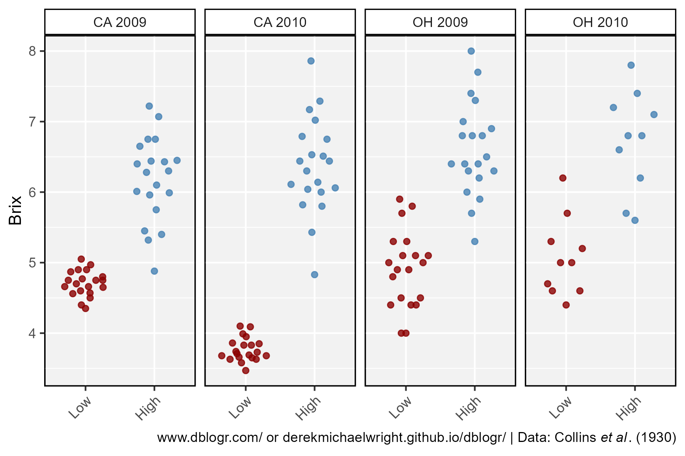

```{r setup, include=FALSE}
knitr::opts_chunk$set(echo = T, message = F, warning = F)
```

---

**UNDER CONSTRUCTION!!!!**

---

# Introduction

```{r}
# devtools::install_github("derekmichaelwright/agData")
library(agData)
library(lme4)
library(ggridges)
```

# Formulas

**Phenotypic variance**, the variation for a particular trait, can be attributed to both genetic and environmental factors. This leads to the concept of **Heritability**, the degree of variation in a phenotypic trait in a population that is due to genetic variation between individuals in that population. There are two types of heritability used by researchers: **Broad Sense Heritability** ($H^2$) and **Narrow Sense Heritability** ($h^2$).

$V_P=V_G+V_E$

where:

- $V_P$ = Phenotypic variance
- $V_G$ = Genetic variance
- $V_E$ = Environmental variance

**Broad Sense Heritability**

$H^2=\frac{V_G}{V_P}=\frac{V_G}{V_G+V_E}$

**Narrow Sense Heritability**

$h^2=\frac{V_A}{V_P}$

where:

- $V_A$ = Additive variance

**Breeders Equation**:

$R=h^2S$

where:

- $S$ = Selection differential
- $R$ = Response to selection


# Links

https://plant-breeding-genomics.extension.org/estimating-heritability-and-blups-for-traits-using-tomato-phenotypic-data/

---

https://pbgworks.org/sites/pbgworks.org/files/Analyzing%20SolCAP%20Processing%20Tomato%20Phenotypic%20Datafinal_1_0.pdf

https://www.youtube.com/watch?v=YIVY-9Jk-5c

https://www.youtube.com/watch?v=LqhNkwVcH-Q

https://www.youtube.com/watch?v=6HnjTlY4hpA

https://www.nature.com/scitable/topicpage/estimating-trait-heritability-46889/

https://passel2.unl.edu/view/lesson/ee62d6ebb5bd/6

https://github.com/PaulSchmidtGit/Heritability/tree/master/Alternative%20Heritability%20Measures

https://doi.org/10.1104/pp.106.077867

# Tomato Example

`r shiny::icon("save")` [TBRTQuality.csv](TBRTQuality.csv)

```{r}
# Prep data
myCaption <- expression(paste("derekmichaelwright.github.io/dblogr/ | Data: Collins ", 
                               italic("et al"), ". (1930)"))
#
dd <- read.csv("TBRTQuality.csv") %>% 
  mutate(Rep = factor(Rep),
         Expt = paste(Loc, Year))
```

**Brix**: a measure of the dissolved solids in a liquid, and is commonly used to measure dissolved sugar content of an aqueous solution. One degree Brix is 1 gram of sucrose in 100 grams of solution and represents the strength of the solution as percentage by mass.

---


```{r}
# Plot
mp <- ggplot(dd, aes(x = Rep, y = Brix, color = Rep)) +
  geom_quasirandom(alpha = 0.7) +
  facet_grid(. ~ paste(Year, Loc)) +
  scale_color_manual(values = c("darkgreen","steelblue")) +
  theme_agData(legend.position = "none") +
  labs(caption = myCaption)
ggsave("heritability_1_01.png", mp, width = 6, height = 4)
```

---


```{r}
# Prep data
myColors <- c("darkgreen", "steelblue", "darkred", "darkblue")
xx <- dd %>% group_by(Line, Expt) %>% 
  summarise(Mean = mean(Brix, na.rm = T),
            Max  =  max(Brix, na.rm = T),
            Min  =  min(Brix, na.rm = T)) %>% 
  ungroup() %>% arrange(Mean) %>%
  mutate(Line = factor(Line, levels = unique(.$Line))) %>%
  filter(!is.na(Mean))
# Plot
mp <- ggplot(xx, aes(x = Line, color = Expt)) +
  geom_point(aes(y = Mean)) +
  geom_segment(aes(xend = Line, y = Min, yend = Max)) +
  scale_color_manual(values = myColors) +
  facet_grid(Expt ~ .) +
  theme_agData(legend.position = "bottom",
               axis.text.x = element_text(angle = 45, hjust = 1, size = 4)) +
  labs(y = "Brix", caption = myCaption)
ggsave("heritability_1_02.png", mp, width = 10, height = 6)
```

---


```{r}
# Prep data
x1 <- xx %>% filter(Expt == "CA 2010") %>%
  top_n(-Mean, n = 10)
x2 <- xx %>% filter(Expt == "CA 2010") %>%
  top_n(Mean, n = 10)
yy <- dd %>% filter(Line %in% c(x1$Line, x2$Line)) %>%
  mutate(Line = factor(Line, levels = c(x1$Line, x2$Line)),
         Group = ifelse(Line %in% x1$Line, "Low", "High"),
         Group = factor(Group, levels = c("Low", "High")))
# Plot
mp <- ggplot(yy, aes(x = Group, y = Brix, color = Group)) +
  geom_quasirandom(alpha = 0.8) +
  facet_grid(. ~ Expt) +
  scale_color_manual(values = c("darkred", "steelblue")) +
  theme_agData(legend.position = "none",
               axis.text.x = element_text(angle = 45, hjust = 1)) +
  labs(x = NULL, caption = myCaption)
ggsave("heritability_1_03.png", mp, width = 6, height = 4)
```

---

Lets run an anova to determine environmental variance.

```{r}
# ANOVA
myfit <- lmer(Brix ~ (1 | Line) + (1 | Loc) + (1 | Year) + (1 | Line:Loc) + (1 | Line:Year), data = dd)
myfit_aov <- summary(myfit)
myfit_aov
```

$Heritability = \frac{var(Line)}{ var(Line) + \frac{var(Line:Loc)}{2} + \frac{var(Line:Year)}{2} + \frac{var(Residual)}{4}}$

$H^2 = \frac{0.1919}{0.1919 + \frac{0.0095}{2} + \frac{0.0102}{2} + \frac{0.2578}{4}} = 0.72$

```{r}
Vg <- myfit_aov$varcor$Line[1]
Ve <- myfit_aov$varcor$`Line:Loc`[1] / 2 + 
      myfit_aov$varcor$`Line:Year`[1] / 2 + 
      myfit_aov$sigma^2 / 4
Vg / (Vg + Ve)
```

---

```{r}
myBLUPs <- ranef(myfit)$Line
ggplot(myBLUPs, aes(x = `(Intercept)`)) +
  geom_histogram(color = "black", fill = "darkred", alpha = 0.7)
```

---

# Tobacco Flowers

https://www.ncbi.nlm.nih.gov/pmc/articles/PMC1193657/pdf/164.pdf

https://www.youtube.com/watch?v=NZ3V7V-yJbw


```{r}
dd <- read.csv("east1916.csv") %>%
  mutate(Name = factor(Name, levels = rev(unique(.$Name)))) %>%
  gather(Size, Num, 7:ncol(.)) %>%
  mutate(Size = as.numeric(gsub("mm", "", Size))) %>%
  filter(!is.na(Num))
```

---


```{r}
xx <- dd %>% filter(Selection != "Large")
mp <- ggplot(xx, aes(x = Size, y = Name, fill = Num, label = Num)) +
  geom_tile(color = "black", alpha = 0.7, width = 3) +
  geom_text() +
  facet_grid(Year ~ ., scale = "free_y", space = "free_y") +
  scale_fill_gradient(low = "grey", high = "darkred") +
  theme_agData(legend.position = "none") +
  labs(caption = myCaption)
ggsave("heritability_2_01.png", mp, width = 10, height = 6)
```

---


```{r}
xx <- dd %>% filter(Selection != "Small")
mp <- ggplot(xx, aes(x = Size, y = Name, fill = Num, label = Num)) +
  geom_tile(color = "black", alpha = 0.7, width = 3) +
  geom_text() +
  facet_grid(Year ~ ., scale = "free_y", space = "free_y") +
  scale_fill_gradient(low = "grey", high = "darkred") +
  theme_agData(legend.position = "none") +
  labs(caption = myCaption)
ggsave("heritability_2_02.png", mp, width = 10, height = 6)
```

```{r echo = F}
ggsave("featured.png", mp, width = 10, height = 6)
```

---



```{r}
# Prep data
myLines <- c("No. 383", "No. 330", "No. 383 & No. 330", "No. 383 x 330", "No. (383 x 330) 1" ,
             "No. (383 x 330) 1-3",  "No. (383 x 330) 1-3-1", "No. (383 x 330) 1-3-1-1")
xx <- dd %>% filter(Selection != "Large", Name %in% myLines) %>%
  group_by(Name, Size) %>% summarise(Num = sum(Num)) 
# Plot
mp <- ggplot(xx, aes(x = Size, y = Name)) +
  geom_density_ridges() +
  theme_agData(legend.position = "none") +
  labs(caption = myCaption)
ggsave("heritability_2_03.png", mp, width = 10, height = 6)
```

---

```{r}
xx <- dd %>% 
  group_by(Name, Selection, ParentPop, ParentSize) %>%
  summarise(Mean = sum(Num * Size) / sum(Num),
            Mean = round(Mean, 1)) %>%
  ungroup() %>%
  left_join(select(., ParentPop=Name, ParentMean=Mean), by = "ParentPop") %>%
  mutate(R = abs(Mean - ParentMean),
         S = abs(ParentSize - ParentMean),
         h2 = R / S,
         h2 = round(h2, 2))
DT::datatable(xx)
```

---

By rearranging the breeders formula, narrow sense heritability can be determined by calculating the slope of a regression line of progeny mean as a function of parental mean.

$h^2=R/S$


```{r}
myfit <- lm(Mean ~ ParentSize, xx)
mp <- ggplot(xx %>% filter(Selection != ""), 
             aes(x = ParentSize, y = Mean, color = Selection)) +
  geom_smooth(method = "lm", se = F, color = "black", alpha = 0.7) +
  geom_point(size = 2.5, alpha = 0.7) +
  scale_color_manual(values = c("darkgreen","steelblue")) +
  ylim(c(min(xx$Mean), max(xx$Mean))) + 
  xlim(c(min(xx$Mean), max(xx$Mean))) +
  theme_agData(legend.position = "bottom") +
  labs(title = paste("h^2 =", round(myfit$coefficients[2], 2)),
       x = "Parental Mean", y = "Progeny Mean", caption = myCaption)
ggsave("heritability_2_04.png", mp, width = 6, height = 4)
```

---


```{r}
myfit_L <- lm(Mean ~ ParentSize, xx %>% filter(Selection == "Large"))
myfit_S <- lm(Mean ~ ParentSize, xx %>% filter(Selection == "Small"))
mp <- ggplot(xx %>% filter(Selection != ""), 
             aes(x = ParentSize, y = Mean, color = Selection)) +
  geom_smooth(method = "lm", se = F, color = "black", alpha = 0.7) +
  geom_point(size = 2, alpha = 0.7) +
  facet_grid(. ~ Selection) +
  scale_color_manual(values = c("darkgreen","steelblue")) +
  ylim(c(min(xx$Mean), max(xx$Mean))) + 
  xlim(c(min(xx$Mean), max(xx$Mean))) +
  theme_agData(legend.position = "none") +
  labs(title = paste("Large h^2 =", round(myfit_L$coefficients[2], 2),
                    "| Small h^2 =", round(myfit_S$coefficients[2], 2)),
       x = "Parental Mean", y = "Progeny Mean", caption = myCaption)
ggsave("heritability_2_05.png", mp, width = 6, height = 4)
```

---
