```{r setup, include=FALSE}
knitr::opts_chunk$set(echo = T, message = F, warning = F)
```

---

# Data

`r shiny::icon("save")` [data_ldp.csv](data_ldp.csv)

```{r echo = F}
DT::datatable(read.csv("data_ldp.csv"))
```

```{r eval = F, echo = F}
############################
# Preparing phenotype data #
############################
library(agiler); library(agData)
#
y1 <- read.csv("C:/Google Drive/gitfolder/AGILE_LDP_Phenology/data/data_ldp.csv") %>% 
  select(-Synonyms)
y2 <- read.csv("C:/Google Drive/gitfolder/AGILE_LDP_Phenology/data/data_PCA_Results.csv") %>%
   select(Name, DTF_Cluster=Cluster, DTF_PC1=PC1, DTF_PC2=PC2, DTF_PC3=PC3)
y3 <- read.csv("C:/Google Drive/gitfolder/AGILE_LDP_Phenology/data/model_t+p_coefs.csv") %>%
  select(Name, a, b, c)
y4 <- read.csv("C:/gitfolder/dblogr/content/academic/gwas_tutorial/GWAS_Results/GAPIT.PCA.csv") %>%
  select(Name=taxa, myG_PC1=PC1, myG_PC2=PC2, myG_PC3=PC3) %>%
  mutate(Name = plyr::mapvalues(Name, "X3156.11_AGL", "3156.11_AGL"),
         Name = gsub("_", " ", Name),
         Name = gsub("\\.", "-", Name))
y5 <- AGILE_Q %>% 
  select(Name, G1=P1,G2=P2,G3=P3,G4=P4,G5=P5,G6=P6,G7=P7,G8=P8) %>%
  mutate(STR_Group = structureGroup(select(., G1,G2,G3,G4,G5,G6,G7,G8), limit = 0.8)) %>%
  select(Name, STR_Group, everything())
y6 <- agData_FAO_Country_Table %>% 
  filter(!duplicated(Country)) %>%
  select(Origin = Country, Region, SubRegion, ISO3, Country_Lat=Lat, Country_Lon=Lon)
y7 <- AGILE_Seed %>% select(Name, Size, SeedMass1000=SeedMass1000.2018, diameter,
                            CotyledonColor, TestaColor, TestaPattern, BlackTesta)
y8 <- AGILE_LDP %>% select(Name, CollDate, CollDate_Group, Urls)

yy <- y1 %>% 
  left_join(y2, by = "Name") %>% 
  left_join(y3, by = "Name") %>%
  left_join(y4, by = "Name") %>%
  left_join(y5, by = "Name") %>%
  left_join(y6, by = "Origin") %>% 
  left_join(y7, by = "Name") %>%
  left_join(y8, by = "Name") %>%
  mutate(Region = ifelse(is.na(Region), "Other", as.character(Region)),
         SubRegion = ifelse(is.na(SubRegion), "Other", as.character(SubRegion))) %>%
  select(Entry, Name, Origin, Source, Lat, Lon, 
         CollDate, CollDate_Group, a, b, c, everything())
write.csv(yy, "data_ldp.csv", row.names = F)
#write.csv(AGILE_GeneList, "Data_GeneList.csv", row.names = F)
```

---

# Prepare Data

```{r class.source = 'fold-show'}
# devtools::install_github("derekmichaelwright/agData")
library(agData)
library(rworldmap)   # mapBubbles()
library(plotly)      # plot_ly()
library(leaflet)     # leaflet()
library(htmlwidgets) # saveWidget()
```

```{r}
# Prep data
myCaption <- "www.dblogr.com/ or derekmichaelwright.github.io/dblogr/ | Data: AGILE"
rColors <- c("darkred", "darkgreen", "darkorange3", "steelblue", "grey")
cColors <- c("darkred",   "darkorange3", "darkgoldenrod2", "deeppink3", 
             "steelblue", "darkorchid4", "cornsilk4",      "darkgreen") 
sColors <- c("deeppink3", "darkblue", "darkorchid4", "darkorange3", "steelblue",
             "darkgoldenrod2", "darkred", "darkgreen", "cornsilk4")
#
dd <- read.csv("data_ldp.csv") %>%
  mutate(DTF_Cluster = factor(DTF_Cluster))
```

Create custom mapBubbles function

```{r}
mapBubbles2 <- function (dF = "", nameX = "longitude", nameY = "latitude", 
    nameZSize = "", nameZColour = "", nameZFill = "",
    colourPalette = "heat", fillPalette = "heat",
    pch = 21, symbolSize = 1, maxZVal = NA, main = nameZSize, 
    numCats = 5, catMethod = "categorical",  
    xlim = NA, ylim = NA, mapRegion = "world", borderCol = "grey", 
    oceanCol = NA, landCol = NA, addLegend = TRUE, legendBg = "white", 
    legendVals = "", legendPos = "bottomright", legendHoriz = FALSE, 
    legendTitle = nameZSize, addColourLegend = TRUE, colourLegendPos = "bottomleft", 
    colourLegendTitle = nameZColour, add = FALSE, plotZeroVals = TRUE, 
    lwd = 0.5, lwdSymbols = 1, ...) 
{
    functionName <- as.character(sys.call()[[1]])
    if (class(dF) == "character" && dF == "") {
        message(paste("using example data because no file specified in", 
            functionName))
        dF = getMap()@data
        nameX = "LON"
        nameY = "LAT"
        if (nameZSize == "") 
            nameZSize = "POP_EST"
        if (nameZColour == "") 
            nameZColour = "continent"
    }
    if (class(dF) == "SpatialPolygonsDataFrame") {
        centroidCoords <- coordinates(dF)
        dF[["nameX"]] <- centroidCoords[, 1]
        dF[["nameY"]] <- centroidCoords[, 2]
        nameX <- "nameX"
        nameY <- "nameY"
        if (!add) {
            rwmNewMapPlot(mapToPlot = dF, oceanCol = oceanCol, 
                mapRegion = mapRegion, xlim = xlim, ylim = ylim)
            plot(dF, add = TRUE, border = borderCol, col = landCol, 
                main = main, lwd = lwd)
        }
        dF <- dF@data
    }
    else if (!add) {
        rwmNewMapPlot(mapToPlot = getMap(), oceanCol = oceanCol, 
            mapRegion = mapRegion, xlim = xlim, ylim = ylim)
        plot(getMap(), add = TRUE, border = borderCol, col = landCol, 
            main = main, lwd = lwd)
    }
    #
    singleColour <- FALSE
    if (nameZColour == "") 
        nameZColour <- "black"
    if (is.na(match(nameZColour, names(dF)))) {
        if (!tryCatch(is.matrix(col2rgb(nameZColour)), error = function(e) FALSE)) {
            stop("your chosen nameZColour :'", nameZColour, 
                "' is not a colour and seems not to exist in your data, columns = ", 
                paste(names(dF), ""))
            return(FALSE)
        }
        else singleColour <- TRUE
    }
    cutVector <- colourVector <- NA
    if (!singleColour) {
        dataCategorised <- dF[, nameZColour]
        if (!is.numeric(dataCategorised) && catMethod != "categorical") {
            catMethod = "categorical"
            message(paste("using catMethod='categorical' for non numeric data in", 
                functionName))
        }
        if (length(catMethod) == 1 && catMethod == "categorical") {
            dataCategorised <- as.factor(dataCategorised)
            cutVector <- levels(dataCategorised)
            if (length(cutVector) > 15) 
                warning("with catMethod='categorical' you have > 15 categories, you may want to try a different catMethod, e.g. quantile")
        }
        else {
            if (is.character(catMethod) == TRUE) {
                cutVector <- rwmGetClassBreaks(dataCategorised, 
                  catMethod = catMethod, numCats = numCats, verbose = TRUE)
            }
            else if (is.numeric(catMethod) == TRUE) {
                cutVector <- catMethod
            }
            dataCategorised <- cut(dataCategorised, cutVector, 
                include.lowest = TRUE)
            func <- function(x, y) c(paste(x, "-", y[1 + 
                which(y == x)], sep = ""))
            tmp <- sapply(cutVector, cutVector, FUN = func)
            cutVector <- tmp[1:length(tmp) - 1]
        }
        colNameRaw <- nameZColour
        colNameCat <- paste(colNameRaw, "categorised", 
            sep = "")
        dF[[colNameCat]] <- dataCategorised
        numColours <- length(levels(dataCategorised))
        colourVector <- rwmGetColours(colourPalette, numColours)
        dataCatNums <- as.numeric(dataCategorised)
    }
    #
    singleFill <- FALSE
    if (nameZFill == "") 
        nameZFill <- "red"
    if (is.na(match(nameZFill, names(dF)))) {
        if (!tryCatch(is.matrix(col2rgb(nameZFill)), error = function(e) FALSE)) {
            stop("your chosen nameZFill :'", nameZFill, 
                "' is not a Fill and seems not to exist in your data, columns = ", 
                paste(names(dF), ""))
            return(FALSE)
        }
        else singleFill <- TRUE
    }
    cutVector <- fillVector <- NA
    if (!singleFill) {
        dataCategorised <- dF[, nameZFill]
        if (!is.numeric(dataCategorised) && catMethod != "categorical") {
            catMethod = "categorical"
            message(paste("using catMethod='categorical' for non numeric data in", 
                functionName))
        }
        if (length(catMethod) == 1 && catMethod == "categorical") {
            dataCategorised <- as.factor(dataCategorised)
            cutVector <- levels(dataCategorised)
            if (length(cutVector) > 15) 
                warning("with catMethod='categorical' you have > 15 categories, you may want to try a different catMethod, e.g. quantile")
        }
        else {
            if (is.character(catMethod) == TRUE) {
                cutVector <- rwmGetClassBreaks(dataCategorised, 
                  catMethod = catMethod, numCats = numCats, verbose = TRUE)
            }
            else if (is.numeric(catMethod) == TRUE) {
                cutVector <- catMethod
            }
            dataCategorised <- cut(dataCategorised, cutVector, 
                include.lowest = TRUE)
            func <- function(x, y) c(paste(x, "-", y[1 + 
                which(y == x)], sep = ""))
            tmp <- sapply(cutVector, cutVector, FUN = func)
            cutVector <- tmp[1:length(tmp) - 1]
        }
        colNameRaw <- nameZFill
        colNameCat <- paste(colNameRaw, "categorised", 
            sep = "")
        dF[[colNameCat]] <- dataCategorised
        numFills <- length(levels(dataCategorised))
        fillVector <- rwmGetColours(fillPalette, numFills)
        dataCatNums <- as.numeric(dataCategorised)
    }
    #
    if (singleColour) 
        col = nameZColour
    else col = colourVector[dataCatNums]
    #
    if (singleFill) 
        bg = nameZFill
    else bg = fillVector[dataCatNums]
    #
    if (is.na(maxZVal)) 
        maxZVal <- max(dF[, nameZSize], na.rm = TRUE)
    fMult = symbolSize * 4/sqrt(maxZVal)
    cex = fMult * sqrt(dF[, nameZSize])
    points(dF[, nameX], dF[, nameY], pch = pch, cex = cex, col = col, 
        bg = bg, lwd = lwdSymbols)
    if (addLegend && sum(as.numeric(abs(dF[, nameZSize])), na.rm = TRUE) != 
        0) {
        if (length(legendVals) > 1) {
            legendSymbolSizes <- fMult * sqrt(legendVals)
        }
        else {
            sigFigs <- 3
            maxVal <- max(dF[, nameZSize], na.rm = TRUE)
            minVal <- min(dF[, nameZSize], na.rm = TRUE)
            legendVals <- c(signif(minVal, sigFigs), signif(minVal + 
                0.5 * (maxVal - minVal), sigFigs), signif(maxVal, 
                sigFigs))
            legendSymbolSizes <- fMult * sqrt(legendVals)
        }
        legendSymbolChars = c(pch, pch, pch)
        colour4LegendPoints <- "black"
        if (plotZeroVals && legendSymbolSizes[1] == 0) {
            legendSymbolSizes[1] <- 1
            legendSymbolChars[1] <- 3
        }
        x.intersp = symbolSize * 1.3
        y.intersp = symbolSize * 1.3
        legend(x = legendPos, legend = legendVals, pt.cex = legendSymbolSizes, 
            pch = legendSymbolChars, col = colour4LegendPoints, 
            bg = legendBg, title = legendTitle, horiz = legendHoriz, 
            y.intersp = y.intersp, x.intersp = x.intersp)
    }
    if (addColourLegend && !singleColour) {
        addMapLegendBoxes(colourVector = colourVector, cutVector = cutVector, 
            x = colourLegendPos, title = colourLegendTitle)
    }
    invisible(list(colourVector = colourVector, cutVector = cutVector))
}
```

---

# Origins

## Countries

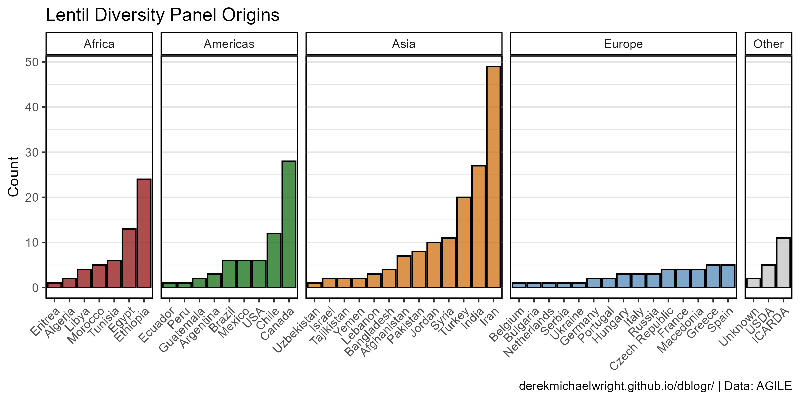

```{r}
# Prep data
xx <- dd %>% 
  group_by(Origin, Region) %>% 
  summarise(Count = n()) %>%
  arrange(Count) %>%
  mutate(Origin = factor(Origin, levels = .$Origin))
# Plot
mp <- ggplot(xx, aes(x = Origin, y = Count, fill = Region)) + 
  geom_col(color = "black", alpha = 0.7) + 
  facet_grid(. ~ Region, scales = "free", space = "free") + 
  scale_fill_manual(values = rColors) +
  theme_agData(legend.position = "none",
               panel.grid.major.x = element_blank(),
               axis.text.x = element_text(angle = 45, hjust = 1)) +
  labs(title = "Lentil Diversity Panel Origins", x = NULL,
       caption = myCaption)
ggsave("lentil_diversity_panel_1_01.png", mp, width = 8, height = 4)
```

---

## Map

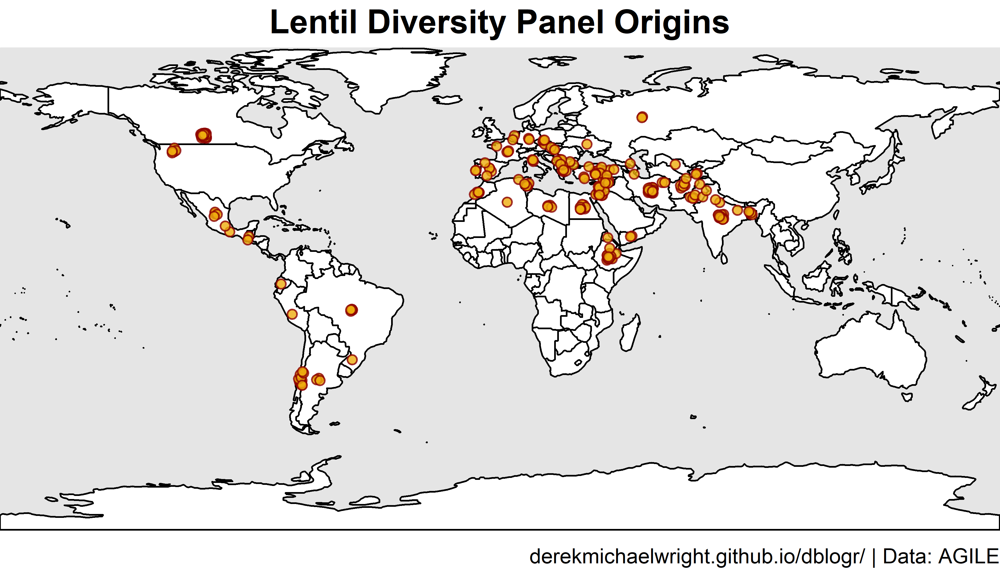

```{r results="hide"}
# Prep data
xx <- dd %>% 
  mutate(Lat = ifelse(is.na(Lat), Country_Lat, Lat),
         Lon = ifelse(is.na(Lon), Country_Lon, Lon),
         Lat = ifelse(duplicated(Lat), jitter(Lat, 1, 1), Lat),
         Lon = ifelse(duplicated(Lon), jitter(Lon, 1, 1), Lon), 
         Size = 1)
# Plot png
png("lentil_diversity_panel_1_02.png", width = 3600, height = 2055, res = 600)
par(mai = c(0.2,0,0.25,0), xaxs = "i", yaxs = "i")
mapBubbles2(dF = xx, nameX = "Lon", nameY = "Lat", 
            nameZColour = alpha("darkred",0.8), 
            nameZFill = alpha("darkgoldenrod2",0.8),
            nameZSize = "Size", symbolSize = 0.2, addLegend = F,
            xlim = c(-140,110), ylim = c(5,20), lwd = 1,
            oceanCol = "grey90", landCol = "white", borderCol = "black")
title(main = "Lentil Diversity Panel Origins", line = 0.25, cex = 3) 
title(sub = myCaption, line = 0, cex.sub = 0.75, adj = 1)
dev.off()
```

---

## Country Map

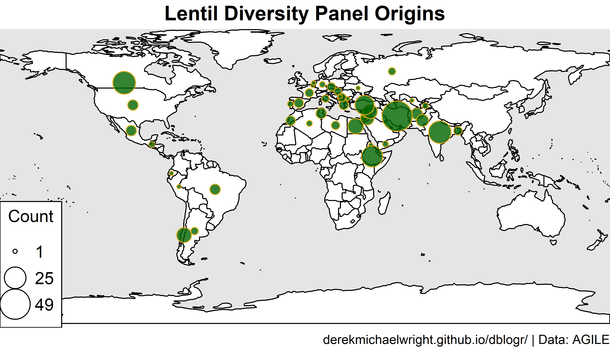

```{r results="hide"}
# Prep data
xx <- dd %>% 
  filter(Origin != "Unknown") %>%
  mutate(Origin = recode(Origin, "ICARDA"="Syria", "USDA"="USA")) %>% 
  group_by(Origin, Country_Lat, Country_Lon) %>% 
  summarise(Count = n()) %>% 
  as.data.frame()
# Plot
png("lentil_diversity_panel_1_03.png", width = 3600, height = 2055, res = 600)
par(mai = c(0.2,0,0.25,0), xaxs = "i",yaxs = "i")
mapBubbles2(dF = xx, nameX = "Country_Lon", nameY = "Country_Lat", 
            nameZColour = alpha("darkgoldenrod2",0.8), 
            nameZFill = alpha("darkgreen",0.8),
            nameZSize = "Count", legendPos = "bottomleft",
            xlim = c(-140,110), ylim = c(5,20), lwd = 1,
            oceanCol = "grey90", landCol = "white", borderCol = "black")
title(main = "Lentil Diversity Panel Origins", line = 0.25, cex = 3) 
title(sub = myCaption, line = 0, cex.sub = 0.75, adj = 1)
dev.off()
```

---

## Genotype PCA By Region

`r shiny::icon("globe")` https://dblogr.com/academic/lentil_diversity_panel/lentil_diversity_panel_1_04.html

<iframe
  src="lentil_diversity_panel_1_04.html"
  style="width:100%; height:600px;"
  data-external="1"
></iframe>

```{r}
mp <- plot_ly(dd, x = ~myG_PC1, y = ~myG_PC3, z = ~myG_PC2, 
              color = ~Region, colors = rColors, hoverinfo = "text",
              text = ~paste(Name, 
                            "\nOrigin:", Origin, 
                            "\nSource:", Source,
                            "\nCollDate:", CollDate,
                            "\nSTR_Group:", STR_Group, 
                            "\nDTF_Cluster:", DTF_Cluster)) %>%
  add_markers()
saveWidget(as_widget(mp), "lentil_diversity_panel_1_04.html")
```

---

# Genetic Structure Analyis

## Genotype Composition

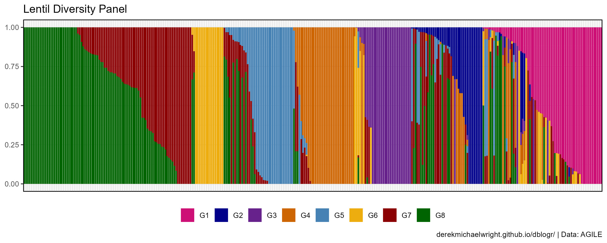

```{r}
# Prep data
xx <- dd %>% 
  select(Name, Origin, Region, G1, G2, G3, G4, G5, G6, G7, G8) %>%
  arrange(G1, G2, G3, G4, G5, G6, G7, G8) %>%
  gather(Group, Value, G1, G2, G3, G4, G5, G6, G7, G8) %>%
  mutate(Name = factor(Name, unique(Name)))
# Plot
mp <- ggplot(xx, aes(x = Name, y = Value, fill = Group)) +
  geom_col(position = "stack") +
  scale_fill_manual(name = NULL, values = sColors) +
  guides(fill = guide_legend(nrow = 1)) +
  theme_agData(legend.position = "bottom",
               axis.ticks.x = element_blank(),
               axis.text.x = element_blank()) +
  labs(title = "Lentil Diversity Panel", y = NULL, x = NULL,
       caption = myCaption)
ggsave("lentil_diversity_panel_2_01.png", mp, width = 10, height = 4)
```

---

## Genotype Composition By Region

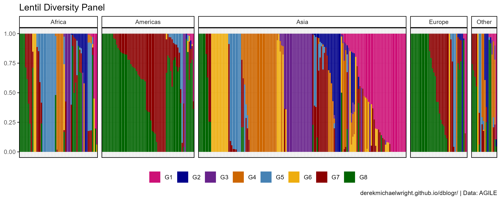

```{r}
# Prep data
xx <- dd %>% 
  select(Name, Origin, Region, G1, G2, G3, G4, G5, G6, G7, G8) %>%
  arrange(G1, G2, G3, G4, G5, G6, G7, G8) %>%
  gather(Group, Value, G1, G2, G3, G4, G5, G6, G7, G8) %>%
  mutate(Name = factor(Name, unique(Name)))
# Plot
mp <- ggplot(xx, aes(x = Name, y = Value, fill = Group)) +
  geom_col(position = "stack") +
  facet_grid(. ~ Region, scales = "free_x", space = "free_x") +
  scale_fill_manual(name = NULL, values = sColors) +
  guides(fill = guide_legend(nrow = 1)) +
  theme_agData(legend.position = "bottom",
               axis.ticks.x = element_blank(),
               axis.text.x = element_blank()) +
  labs(title = "Lentil Diversity Panel", y = NULL, x = NULL,
       caption = myCaption)
ggsave("lentil_diversity_panel_2_02.png", mp, width = 10, height = 4)
```

---

## Genetic Structure Pie Map


```{r results="hide"}
# Prep data
myG <- c("G1","G2","G3","G4","G5","G6","G7","G8", "Mix")
xx <- dd %>% 
  filter(!Origin %in% c("ICARDA","USDA","Unknown")) %>% 
  group_by(Origin, STR_Group, Country_Lat, Country_Lon) %>% 
  summarise(Count = n()) %>% 
  spread(STR_Group, Count) %>%
  as.data.frame()
# Plot
png("lentil_diversity_panel_2_03.png", width = 3600, height = 2055, res = 600)
par(mai = c(0.2,0,0.25,0), xaxs = "i", yaxs = "i")
mapPies(dF = xx, nameX = "Country_Lon", nameY = "Country_Lat", 
        zColours = sColors, nameZs = myG, lwd = 1,
        xlim = c(-140,110), ylim = c(5,20), addCatLegend = F,
        oceanCol = "grey90", landCol = "white", borderCol = "black") 
legend(-138.5, 15.5, title = "STR Group", legend = myG, col = sColors,
       pch = 16, cex = 0.8, pt.cex = 1.25, box.lwd = 2)
title(main = "Lentil Diversity Panel Origins", line = 0.25, cex = 3) 
title(sub = myCaption, line = 0, cex.sub = 0.75, adj = 1)
dev.off()
```

---

## Genetic Structure Map

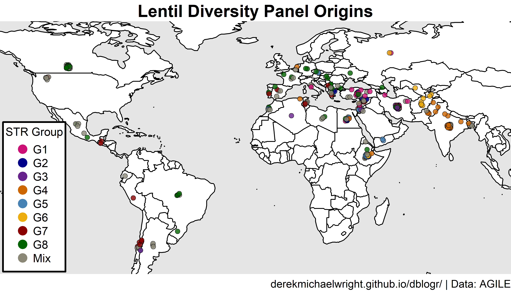

`r shiny::icon("globe")` https://dblogr.com/academic/lentil_diversity_panel/Lentil_diversity_panel_2_04.html

<iframe
  src="lentil_diversity_panel_2_04.html"
  style="width:100%; height:600px;"
></iframe>

```{r results="hide"}
# Prep data
myG <- c("G1","G2","G3","G4","G5","G6","G7","G8", "Mix")
xx <- dd %>% 
  mutate(Lat = ifelse(is.na(Lat), Country_Lat, Lat),
         Lon = ifelse(is.na(Lon), Country_Lon, Lon),
         Lat = ifelse(duplicated(Lat), jitter(Lat, 1, 1), Lat),
         Lon = ifelse(duplicated(Lon), jitter(Lon, 1, 1), Lon), 
         Size = 1)
# Plot png
png("lentil_diversity_panel_2_04.png", width = 3600, height = 2055, res = 600)
par(mai = c(0.2,0,0.25,0), xaxs = "i", yaxs = "i")
mapBubbles2(dF = xx, nameX = "Lon", nameY = "Lat", 
            nameZFill = "STR_Group",
            fillPalette = alpha(sColors,0.8), 
            nameZSize = "Size", symbolSize = 0.2, 
            xlim = c(-140,110), ylim = c(5,20), lwd = 1, lwdSymbols = 0.4,
            addColourLegend = F, addLegend = F,
            oceanCol = "grey90", landCol = "white", borderCol = "black")
legend(-138.5, 13, title = "STR Group", legend = myG, col = sColors,
       pch = 16, cex = 0.8, pt.cex = 1.5, box.lwd = 2)
title(main = "Lentil Diversity Panel Origins", line = 0.25, cex = 3) 
title(sub = myCaption, line = 0, cex.sub = 0.75, adj = 1)
dev.off()
# Plot html
pal <- colorFactor(sColors, domain = myG)
mp <- leaflet() %>% 
  addProviderTiles(providers$CartoDB.Positron) %>%
  addCircles(lng = xx$Lon, lat = xx$Lat, weight = 10,
             color = pal(xx$STR_Group), opacity = 1, fillOpacity = 1,
             popup = paste(xx$Entry,"|",xx$Name)) %>%
  addLegend("bottomleft", pal = pal, values = xx$STR_Group,
            title = "STR Group", opacity = 1)
saveWidget(mp, file="lentil_diversity_panel_2_04.html")
```

---

## Genetic Structure Origin Pies

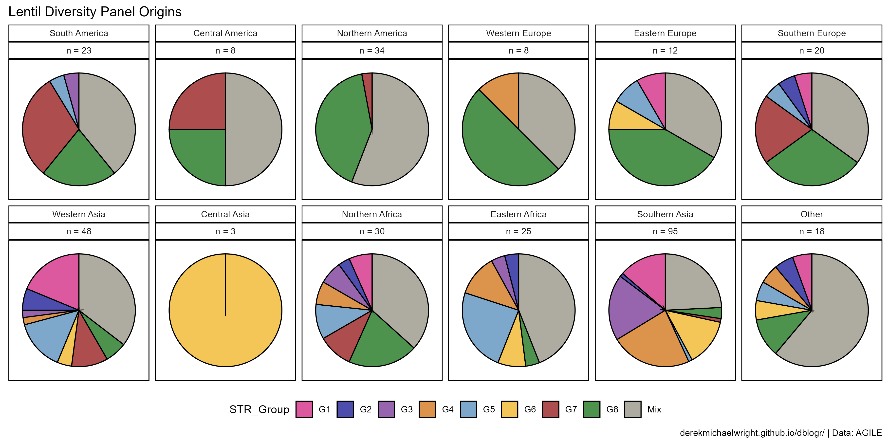

```{r}
# Prep data
myLevels <- c("South America", "Central America", "Northern America", 
              "Western Europe", "Eastern Europe", "Southern Europe",
              "Western Asia", "Central Asia", 
              "Northern Africa", "Eastern Africa", "Southern Asia", "Other")
x1 <- dd %>% 
  group_by(STR_Group, SubRegion) %>% 
  summarise(Count = n()) 
x2 <- dd %>% 
  group_by(SubRegion) %>% 
  summarise(Total = n()) 
xx <- left_join(x1, x2, by = "SubRegion") %>%
  mutate(Percent = 100 * Count / Total) %>%
  mutate(SubRegion = factor(SubRegion, levels = myLevels))
# Plot
mp <- ggplot(xx, aes(x = "", y = Percent, fill = STR_Group)) + 
  geom_col(color = "black", alpha = 0.7) + 
   coord_polar("y", start = 0) +
  facet_wrap(. ~ SubRegion + paste("n =", Total), ncol = 6) +
  scale_fill_manual(values = sColors) +
  theme_agData_pie(legend.position = "bottom") +
  guides(fill = guide_legend(nrow = 1)) +
  labs(title = "Lentil Diversity Panel Origins", x = NULL,
       caption = myCaption)
ggsave("lentil_diversity_panel_2_05.png", mp, width = 12, height = 6)
```

---

## Genotype PCA By Structure Group

`r shiny::icon("globe")` https://dblogr.com/academic/lentil_diversity_panel/lentil_diversity_panel_2_06.html

<iframe
  src="lentil_diversity_panel_2_06.html"
  style="width:100%; height:600px;"
  data-external="1"
></iframe>

```{r}
mp <- plot_ly(dd, x = ~myG_PC1, y = ~myG_PC2, z = ~myG_PC3, hoverinfo = "text",
              color = ~STR_Group, colors = sColors[c(9,1:8)], 
              text = ~paste(Name, 
                            "\nOrigin:", Origin, 
                            "\nSource:", Source,
                            "\nCollDate:", CollDate,
                            "\nSTR_Group:", STR_Group, 
                            "\nDTF_Cluster:", DTF_Cluster)) %>%
  add_markers()
saveWidget(as_widget(mp), "lentil_diversity_panel_2_06.html")
```

---

# DTF

## DTF Cluster Pie Map


```{r results="hide"}
# Prep data
xx <- dd %>% 
  filter(!Origin %in% c("ICARDA","USDA","Unknown")) %>% 
  group_by(Origin, DTF_Cluster, Country_Lat, Country_Lon) %>% 
  summarise(Count = n()) %>% 
  spread(DTF_Cluster, Count) %>%
  as.data.frame()
# Plot
png("lentil_diversity_panel_3_01.png", width = 3600, height = 2055, res = 600)
par(mai = c(0.2,0,0.25,0), xaxs = "i", yaxs = "i")
mapPies(dF = xx, nameX = "Country_Lon", nameY = "Country_Lat", 
        zColours = cColors, nameZs = c("1","2","3","4","5","6","7","8"), 
        xlim = c(-140,110), ylim = c(5,20), addCatLegend = F, lwd = 1,
        oceanCol = "grey90", landCol = "white", borderCol = "black") 
legend(-138.5, 13, title = "DTF Cluster", legend = 1:8, col = cColors,
       pch = 16, cex = 0.8, pt.cex = 1.5, box.lwd = 2)
title(main = "Lentil Diversity Panel Origins", line = 0.25, cex = 3) 
title(sub = myCaption, line = 0, cex.sub = 0.75, adj = 1)
dev.off()
```

```{r echo = F, results="hide"}
file.copy(from = "lentil_diversity_panel_3_01.png", to = "featured.png", overwrite = T)
```

---

## DTF Cluster Map

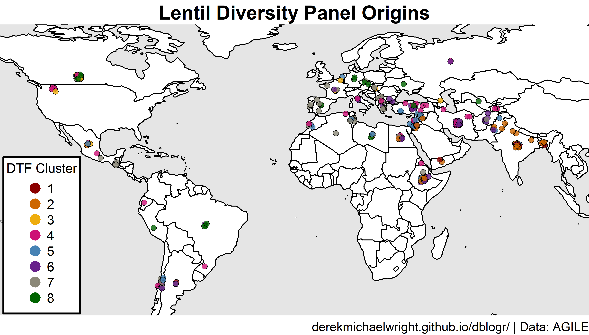

`r shiny::icon("globe")` https://dblogr.com/academic/lentil_diversity_panel/Lentil_diversity_panel_3_02.html

<iframe
  src="lentil_diversity_panel_3_02.html"
  style="width:100%; height:600px;"
></iframe>

```{r results="hide"}
# Prep data
xx <- dd %>% 
  mutate(Lat = ifelse(is.na(Lat), Country_Lat, Lat),
         Lon = ifelse(is.na(Lon), Country_Lon, Lon),
         Lat = ifelse(duplicated(Lat), jitter(Lat, 1, 1), Lat),
         Lon = ifelse(duplicated(Lon), jitter(Lon, 1, 1), Lon), 
         Size = 1)
# Plot png
png("lentil_diversity_panel_3_02.png", width = 3600, height = 2055, res = 600)
par(mai = c(0.2,0,0.25,0), xaxs = "i", yaxs = "i")
mapBubbles2(dF = xx, nameX = "Lon", nameY = "Lat", 
            nameZFill = "DTF_Cluster",
            fillPalette = alpha(cColors,0.8), 
            nameZSize = "Size", symbolSize = 0.2, 
            xlim = c(-140,110), ylim = c(5,20), lwd = 1, lwdSymbols = 0.4,
            addColourLegend = F, addLegend = F,
            oceanCol = "grey90", landCol = "white", borderCol = "black")
legend(-138.5, 13, title = "DTF Cluster", legend = 1:8, col = cColors,
       pch = 16, cex = 0.8, pt.cex = 1.5, box.lwd = 2)
title(main = "Lentil Diversity Panel Origins", line = 0.25, cex = 3) 
title(sub = myCaption, line = 0, cex.sub = 0.75, adj = 1)
dev.off()
# Plot html
pal <- colorFactor(cColors, domain = 1:8)
mp <- leaflet() %>% 
  addProviderTiles(providers$CartoDB.Positron) %>%
  addCircles(lng = xx$Lon, lat = xx$Lat, weight = 10,
             color = pal(xx$DTF_Cluster), opacity = 1, fillOpacity = 1,
             popup = paste(xx$Entry,"|",xx$Name)) %>%
  addLegend("bottomleft", pal = pal, values = xx$DTF_Cluster,
            title = "DTF Cluster", opacity = 1)
saveWidget(mp, file="lentil_diversity_panel_3_02.html")
```


## DTF PCA Clusters

From phenology paper

`r shiny::icon("globe")` https://dblogr.com/academic/lentil_diversity_panel/lentil_diversity_panel_3_03.html

<iframe
  src="lentil_diversity_panel_3_03.html"
  style="width:100%; height:600px;"
  data-external="1"
></iframe>

```{r}
mp <- plot_ly(dd, x = ~DTF_PC1, y = ~DTF_PC2*2.5, z = ~DTF_PC3*2.5,
              color = ~DTF_Cluster, colors = cColors, hoverinfo = "text",
              text = ~paste(Name, 
                            "\nOrigin:", Origin, 
                            "\nSource:", Source,
                            "\nCollDate:", CollDate,
                            "\nSTR_Group:", STR_Group, 
                            "\nDTF_Cluster:", DTF_Cluster)) %>%
  add_markers()
saveWidget(as_widget(mp), "lentil_diversity_panel_3_03.html")
```

---

`r shiny::icon("globe")` https://dblogr.com/academic/lentil_diversity_panel/lentil_diversity_panel_3_04.html

<iframe
  src="lentil_diversity_panel_3_04.html"
  style="width:100%; height:600px;"
  data-external="1"
></iframe>

```{r}
xx <- dd %>% 
  mutate(DTF_PC1 = scales::rescale(DTF_PC1),
         DTF_PC2 = scales::rescale(DTF_PC2),
         DTF_PC3 = scales::rescale(DTF_PC3))
mp <- plot_ly(dd, x = ~DTF_PC1, y = ~DTF_PC2, z = ~DTF_PC3,
              color = ~STR_Group, colors = sColors, hoverinfo = "text",
              text = ~paste(Name, 
                            "\nOrigin:", Origin, 
                            "\nSource:", Source,
                            "\nCollDate:", CollDate,
                            "\nSTR_Group:", STR_Group, 
                            "\nDTF_Cluster:", DTF_Cluster)) %>%
  add_markers()
saveWidget(as_widget(mp), "lentil_diversity_panel_3_04.html")
```

---

## DTF Cluster Origin Pies

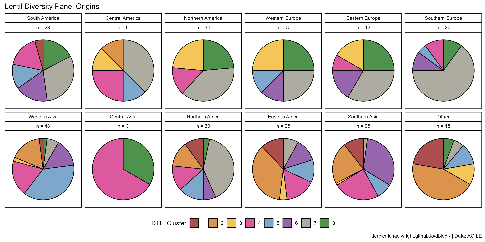

```{r}
# Prep data
myLevels <- c("South America", "Central America", "Northern America", 
              "Western Europe", "Eastern Europe", "Southern Europe",
              "Western Asia", "Central Asia", 
              "Northern Africa", "Eastern Africa", "Southern Asia", "Other")
x1 <- dd %>% 
  group_by(DTF_Cluster, SubRegion) %>% 
  summarise(Count = n()) 
x2 <- dd %>% 
  group_by(SubRegion) %>% 
  summarise(Total = n()) 
xx <- left_join(x1, x2, by = "SubRegion") %>%
  mutate(Percent = 100 * Count / Total) %>%
  mutate(SubRegion = factor(SubRegion, levels = myLevels))
# Plot
mp <- ggplot(xx, aes(x = "", y = Percent, fill = DTF_Cluster)) + 
  geom_col(color = "black", alpha = 0.7) + 
  coord_polar("y", start = 0) +
  facet_wrap(. ~ SubRegion + paste("n =", Total), ncol = 6) +
  scale_fill_manual(values = cColors) +
  theme_agData_pie(legend.position = "bottom") +
  guides(fill = guide_legend(nrow = 1)) +
  labs(title = "Lentil Diversity Panel Origins", x = NULL,
       caption = myCaption)
ggsave("lentil_diversity_panel_3_04.png", width = 12, height = 6)
```

---

## Genotype PCA By DTF Clusters

From phenology paper

`r shiny::icon("globe")` https://dblogr.com/academic/lentil_diversity_panel/lentil_diversity_panel_3_05.html

<iframe
  src="lentil_diversity_panel_3_05.html"
  style="width:100%; height:600px;"
  data-external="1"
></iframe>

```{r}
mp <- plot_ly(dd, x = ~myG_PC1, y = ~myG_PC2, z = ~myG_PC3, 
              color = ~DTF_Cluster, colors = cColors, hoverinfo = "text",
              text = ~paste(Name, 
                            "\nOrigin:", Origin, 
                            "\nSource:", Source,
                            "\nCollDate:", CollDate,
                            "\nSTR_Group:", STR_Group, 
                            "\nDTF_Cluster:", DTF_Cluster)) %>%
  add_markers()
saveWidget(as_widget(mp), "lentil_diversity_panel_3_05.html")
```

---

# Cotyledon Color

## Eurasia Map

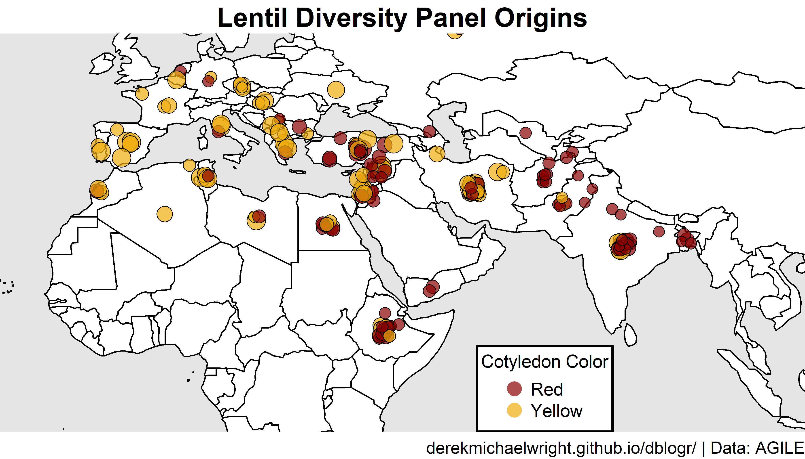

```{r results="hide"}
# Prep data
myColors <- alpha(c("darkred", "darkgoldenrod2"), 0.7)
xx <- dd %>% 
  filter(CotyledonColor %in% c("Red", "Yellow"),
         Region %in% c("Asia","Europe","Africa")) %>%
  mutate(Lat = ifelse(is.na(Lat), Country_Lat, Lat),
         Lon = ifelse(is.na(Lon), Country_Lon, Lon),
         Lat = ifelse(duplicated(Lat), jitter(Lat, 1, 1), Lat),
         Lon = ifelse(duplicated(Lon), jitter(Lon, 1, 1), Lon), 
         Size = 1)
# Plot png
png("lentil_diversity_panel_4_01.png", width = 3600, height = 2055, res = 600)
par(mai = c(0.2,0,0.25,0), xaxs = "i", yaxs = "i")
mapBubbles2(dF = xx, nameX = "Lon", nameY = "Lat", 
            nameZFill = "CotyledonColor", 
            fillPalette = myColors, 
            nameZSize = "SeedMass1000", 
            symbolSize = 0.5, lwd = 1, lwdSymbols = 0.5,
            addColourLegend = F, addLegend = F,
            xlim = c(-25,110), ylim = c(15,35), 
            oceanCol = "grey90", landCol = "white", borderCol = "black")
legend(55, 3, title = "Cotyledon Color", 
       legend = c("Red", "Yellow"), col = myColors,
       pch = 16, cex = 0.8, pt.cex = 1.5, box.lwd = 2)
title(main = "Lentil Diversity Panel Origins", line = 0.25, cex = 3) 
title(sub = myCaption, line = 0, cex.sub = 0.75, adj = 1)
dev.off()
```

---

## Mass of 1000 Seeds

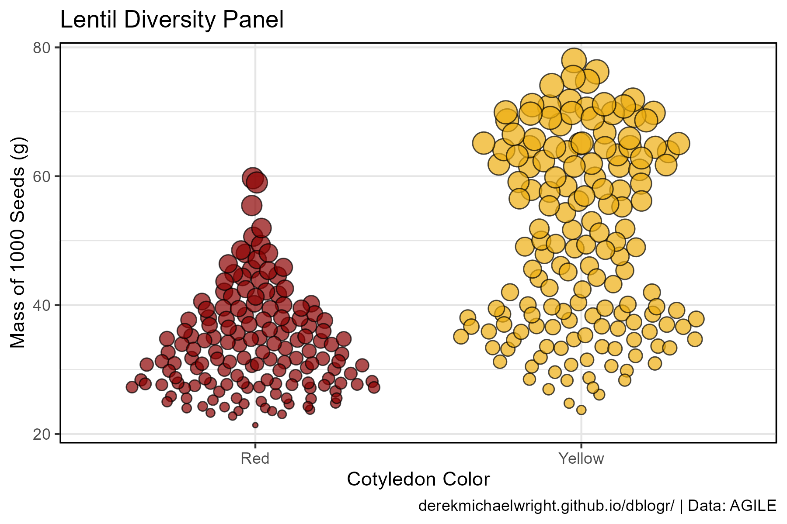

```{r}
# Prep data
myColors <- c("darkred", "darkgoldenrod2")
xx <- dd %>% filter(CotyledonColor %in% c("Red", "Yellow"))
# Plot
mp <- ggplot(xx, aes(x = CotyledonColor, y = SeedMass1000, 
                     fill = CotyledonColor, size = SeedMass1000)) +
  geom_quasirandom(alpha = 0.7, pch = 21, color = "black") +
  scale_fill_manual(values = myColors) +
  theme_agData(legend.position = "none") +
  labs(title = "Lentil Diversity Panel",
       y = "Mass of 1000 Seeds (g)",
       x = "Cotyledon Color",
       caption = myCaption)
ggsave("lentil_diversity_panel_4_02.png", mp, width = 6, height = 4)
```

---

## Str Group

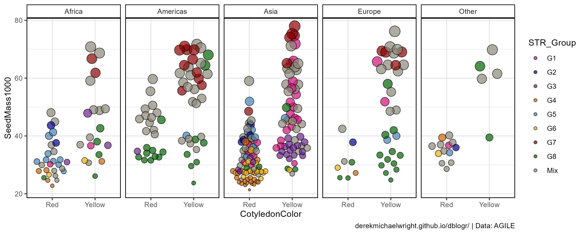

```{r}
# Plot
mp <- ggplot(xx, aes(x = CotyledonColor, y = SeedMass1000, 
                     fill = STR_Group, size = SeedMass1000)) +
  geom_quasirandom(alpha = 0.7, pch = 21, color = "black") +
  facet_grid(. ~ Region) +
  scale_fill_manual(values = sColors) +
  guides(size = "none") +
  theme_agData() +
  labs(caption = myCaption)
ggsave("lentil_diversity_panel_4_03.png", mp, width = 10, height = 4)
```

---

## DTF Cluster


```{r}
# Plot
mp <- ggplot(xx, aes(x = CotyledonColor, y = SeedMass1000, 
                     fill = DTF_Cluster, size = SeedMass1000)) +
  geom_quasirandom(alpha = 0.7, pch = 21, color = "black") +
  facet_grid(. ~ Region) +
  scale_fill_manual(values = cColors) +
  guides(size = "none") +
  theme_agData() +
  labs(caption = myCaption)
ggsave("lentil_diversity_panel_4_04.png", mp, width = 10, height = 4)
```

---

```{r echo = F, eval = F}
# Plot
mp <- ggplot(xx, aes(x = "", y = CotyledonColor, color = CotyledonColor)) +
  geom_bar(stat = "density") +
  coord_polar("y", start = 0) +
  facet_grid(. ~ TestaPattern) +
  scale_color_manual(values = sColors) +
  theme_agData() +
  labs(caption = myCaption)
ggsave("lentil_diversity_panel_18.png", mp, width = 10, height = 4)
```

```{r echo = F, eval = F}
# Prep data
myColors <- c("darkred", "darkgoldenrod2")
xx <- dd %>% 
  filter(CotyledonColor %in% c("Red", "Yellow"),
         Region %in% c("Asia","Europe","Africa"))
# Plot
ggplot(xx, aes(x = Lon, y = 1, fill = CotyledonColor, size = SeedMass1000)) +
  geom_beeswarm(groupOnX = F, alpha = 0.7, pch = 21, color = "black") +
  scale_fill_manual(name = "Cotyledon Color", values = myColors) +
  theme_agData(legend.position = "bottom",
               axis.text.y = element_blank(),
               axis.ticks.y = element_blank()) +
  labs(title = "Lentil Cotyledon Color & Size", y = NULL, x = "Longitude",
       caption = myCaption)
ggsave("lentil_diversity_panel_19.png", mp, width = 10, height = 4)
```
