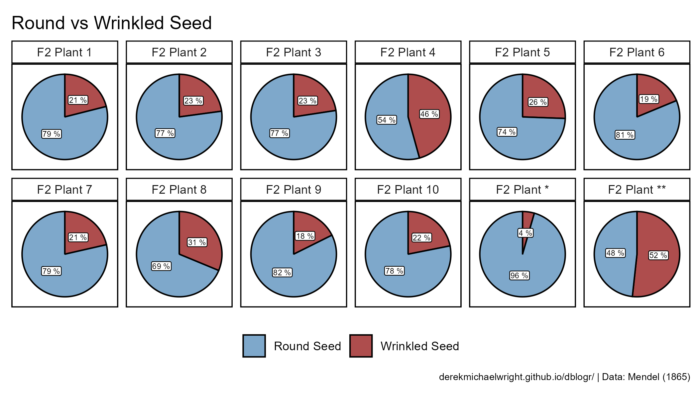
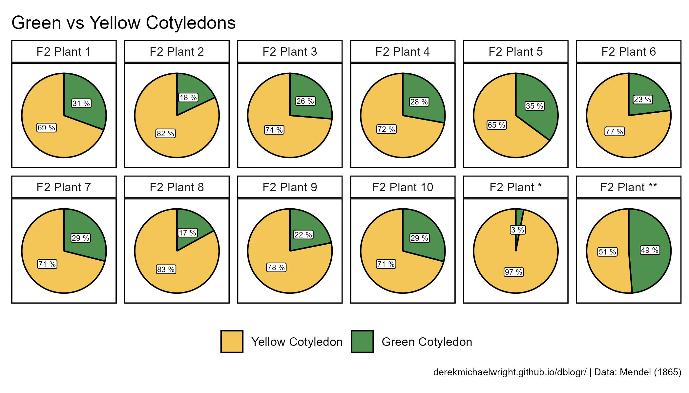
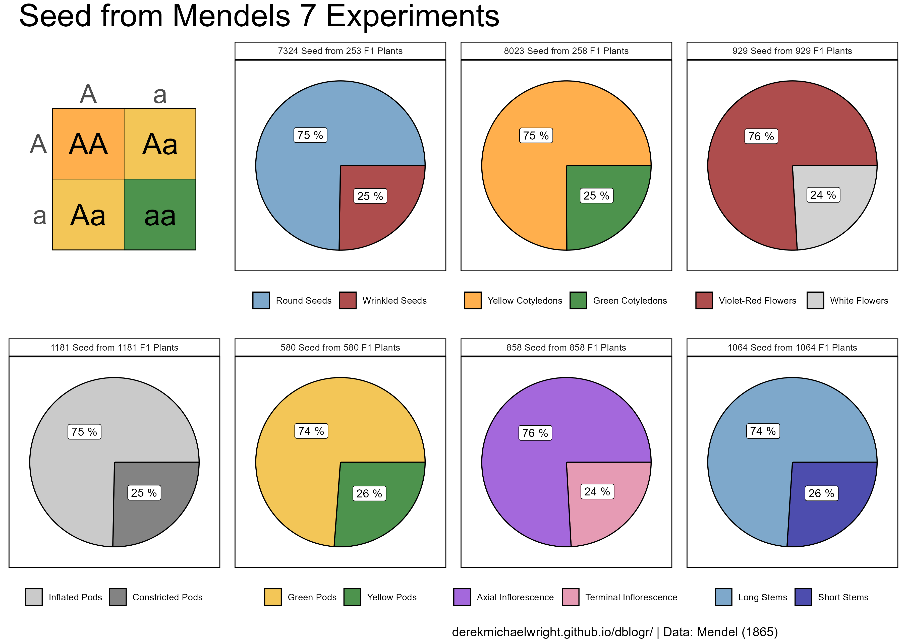
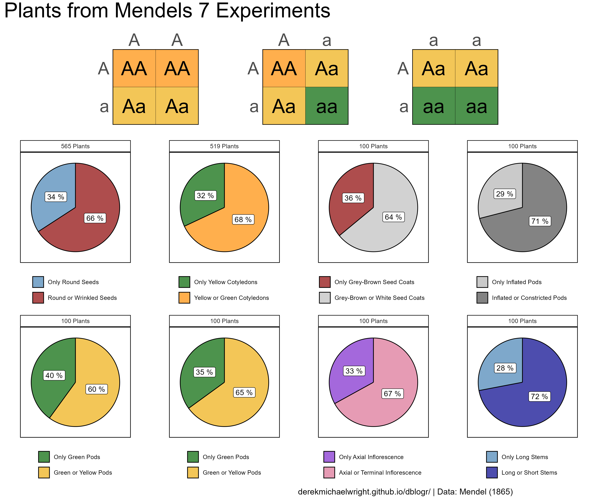

```{r setup, include=FALSE}
knitr::opts_chunk$set(echo = T, message = F, warning = F)
```

---

# Introduction

> - `r shiny::icon("globe")` https://en.wikipedia.org/wiki/Gregor_Mendel

**Gregor Johann Mendel** (1822 - 1884) was a German-Czech, Augustinian friar and abbot of St. Thomas' Abbey in Brno (Brünn). He also grew some Peas (*Pisum sativum*) in his gardens/greenhouses and studied the inheritance of 7 traits which, when crossed, had a *dominant* form which was exhibited by all of the F1 hybrids, and a *recessive* form which reappeared in the F2 offspring from selfed F1 hybrids.


---

# Data

> - `r shiny::icon("globe")` 
> - `r shiny::icon("save")` [data_mendel.xlsx](data_mendel.xlsx)

---

# Prepare Data

```{r class.source = 'fold-show'}
# devtools::install_github("derekmichaelwright/agData")
library(agData)
library(readxl)
```

```{r}
# Prep data
myCaption1 <- "www.dblogr.com/ or derekmichaelwright.github.io/dblogr/"
myCaption2 <- "www.dblogr.com/ or derekmichaelwright.github.io/dblogr/ | Data: Mendel (1865)"
#
d1 <- read_xlsx("data_mendel.xlsx", "T1") %>% 
  mutate(Trait = factor(Trait, levels = unique(.$Trait)))
d2 <- read_xlsx("data_mendel.xlsx", "T2") %>% 
  mutate(Trait = factor(Trait, levels = unique(.$Trait)))
d3 <- read_xlsx("data_mendel.xlsx", "T3") %>% 
  mutate(Trait = factor(Trait, levels = unique(.$Trait)))
#
p1 <- read_xlsx("data_mendel.xlsx", "P1", range = "A5:E9") %>%
  mutate(Row = factor(Row, levels = c("2","1")),
         P1 = factor(P1), P2 = factor(P2),
         XX = factor(XX, levels = c("AA","Aa","aa")))
p2 <- read_xlsx("data_mendel.xlsx", "P2", range = "A5:E9") %>%
  mutate(Row = factor(Row, levels = c("2","1")),
         P1 = factor(P1, levels = c("A","a")),
         P2 = factor(P2, levels = c("A","a")),
         XX = factor(XX, levels = c("AA","Aa","aa")))
p3 <- read_xlsx("data_mendel.xlsx", "P3", range = "A5:E9") %>%
  mutate(Row = factor(Row, levels = c("2","1")),
         P2 = factor(P2),
         P1 = factor(P1, levels = c("A","a")),
         XX = factor(XX, levels = c("AA","Aa","aa")))
p4 <- read_xlsx("data_mendel.xlsx", "P4", range = "A5:E9") %>%
  mutate(Row = factor(Row, levels = c("2","1")),
         P1 = factor(P1),
         P2 = factor(P2, levels = c("A","a")),
         XX = factor(XX, levels = c("AA","Aa","aa")))
p5 <- read_xlsx("data_mendel.xlsx", "P5", range = "A5:E9") %>%
  mutate(Row = factor(Row, levels = c("2","1")),
         P1 = factor(P1),
         P2 = factor(P2, levels = c("A","a")),
         XX = factor(XX, levels = c("AA","Aa","aa")))
p6 <- read_xlsx("data_mendel.xlsx", "P6", range = "A7:E23") %>%
  mutate(Row = factor(Row, levels = c("4","3","2","1")),
         P1 = factor(P1, levels = c("AB","Ab","aB","ab")),
         P2 = factor(P2, levels = c("AB","Ab","aB","ab")),
         XXXX = factor(XXXX, levels = c("AABB","AABb","AAbb","AaBB","AaBb",
                                    "Aabb","aaBB","aaBb","aabb")))
```

---

# Seeds from 10 F2 plants

```{r}
# Create plotting function
ggMendel1 <- function(xx = d1 %>% filter(Expt == 1), 
                      myTitle = NULL,
                      myColors = c("steelblue", "darkred")) {
  # Prep data
  xx <- xx %>% 
    arrange(desc(Trait)) %>%
    group_by(Plant) %>%
    mutate(Percentage = 100 * Seeds / sum(Seeds),
           Cummulative_P = cumsum(Percentage),
           Label_y = Cummulative_P - (Percentage / 2),
           Plant = paste("F2 Plant", Plant),
           `Total Seeds` = paste(`Total Seeds`, "Seeds")) %>%
  mutate(Plant = factor(Plant, levels = unique(.$Plant)),
         `Total Seeds` = factor(`Total Seeds`, levels = unique(.$`Total Seeds`)))
  # Plot
  ggplot(xx, aes(x = 1)) +
    geom_col(aes(y = Percentage, fill = Trait), 
             color = "black", alpha = 0.7) +
    coord_polar("y", start = 0) +
    facet_wrap(Plant ~ ., ncol = 6) +
    geom_label(aes(label = paste(round(Percentage), "%"), y = Label_y), 
               size = 2, label.padding = unit(0.1, "lines")) + 
    theme_agData_pie(legend.position = "bottom",
                     plot.caption = element_text(size = 7)) +
    xlim(0.542, 1.45) +
    scale_fill_manual(name = NULL, values = myColors) +
    labs(title = myTitle, caption = myCaption2)
}
```

---

## Round Seed x Wrinkled Seed




```{r}
# Plot
mp <- ggMendel1(xx = d1 %>% filter(Expt == 1), 
                myTitle = "Round vs Wrinkled Seed", 
                myColors = c("steelblue", "darkred"))
ggsave("mendel_01.png", mp, width = 7, height = 4)
```

---

## Green Cotyledons x Yellow Cotyledons



```{r}
mp <- ggMendel1(xx = d1 %>% filter(Expt == 2), 
                myTitle = "Green vs Yellow Cotyledons", 
                myColors = c("darkgoldenrod2", "darkgreen"))
ggsave("mendel_02.png", mp, width = 7, height = 4) 
```

---

# Seeds From F2 Plants



```{r}
# Create plotting function
ggMendel2 <- function(xx = d2 %>% filter(Expt == 1), 
                      myColors = c("steelblue", "darkred")) {
  # Prep data
  xx <- xx %>% arrange(desc(Trait)) %>% 
    mutate(Percentage = 100 * Seeds / sum(Seeds),
           Cummulative_P = cumsum(Percentage),
           Label_y = Cummulative_P - (Percentage / 2))
  # Plot
  ggplot(xx, aes(x = 1)) +
    geom_col(aes(y = Percentage, fill = Trait),
             color = "black", alpha = 0.7) +
    coord_polar("y", start = 1.57) +
    geom_label(aes(label = paste(round(Percentage), "%"), y = Label_y)) + 
    facet_grid(. ~ paste(sum(Seeds), "Seed from", unique(`F2 Plants`), "F1 Plants")) +
    theme_agData_pie(legend.position = "bottom",
                     plot.caption = element_text(size = 7)) +
    xlim(0.542, 1.45) +
    scale_fill_manual(name = NULL, values = myColors)
}
# Plot
mp1 <- ggplot(p2, aes(x = Col, y = Row, label = XX, fill = XX)) + 
  geom_tile(color = "black", alpha = 0.7) +
  geom_text(size = 10) +
  scale_x_continuous(breaks = 1:2, labels = c("A","a"), expand = c(0,0), 
                     sec.axis = sec_axis(~ .,breaks = 1:2, labels = c("A","a"))) +
  scale_y_discrete(breaks = c("1","2"), labels = c("A","a"), expand = c(0,0)) +
  scale_fill_manual(values = c("darkorange", "darkgoldenrod2", "darkgreen")) +
  theme_agData_pie() + 
  theme(legend.position = "none",
        strip.placement = "outside",
        axis.text = element_text(size = 25),
        axis.text.x.bottom = element_blank(),
        axis.ticks.x.bottom = element_blank(),
        plot.margin = unit(c(1,1,2,1), "cm")) + #TRBL
  labs(title = "", x = "", y = "", caption = "")
mp2 <- ggMendel2(xx = d2 %>% filter(Expt == 1), myColors = c("steelblue", "darkred"))
mp3 <- ggMendel2(xx = d2 %>% filter(Expt == 2), myColors = c("darkorange", "darkgreen"))
mp4 <- ggMendel2(xx = d2 %>% filter(Expt == 3), myColors = c("darkred", "grey"))
mp5 <- ggMendel2(xx = d2 %>% filter(Expt == 4), myColors = c("grey70", "grey30"))
mp6 <- ggMendel2(xx = d2 %>% filter(Expt == 5), myColors = c("darkgoldenrod2", "darkgreen"))
mp7 <- ggMendel2(xx = d2 %>% filter(Expt == 6), myColors = c("purple3", "palevioletred"))
mp8 <- ggMendel2(xx = d2 %>% filter(Expt == 7), myColors = c("steelblue", "darkblue"))
#
#
mp <- ggarrange(mp1, mp2, mp3, mp4, mp5, mp6, mp7, mp8, ncol = 4, nrow = 2) %>%
  annotate_figure(top = text_grob("Seed from Mendels 7 Experiments", 
                                  hjust = 0.9, size = 30, lineheight = 2),
                  bottom = text_grob(myCaption2, hjust = 0))
ggsave("mendel_03.png", mp, width = 12, height = 8.5, bg = "white") 
```

```{r echo = F}
ggsave("featured.png", mp, width = 12, height = 8.5, bg = "white")
```

---

## Chi-Square Tests

Chi-Square test: $chi^2=\sum{\frac{(O-E)^2}{E}}$

---

### Seeds from F2 plants

```{r, collapse = T}
xx <- d2 %>% filter(Expt == "1")
xx
((xx$Seeds[1]- xx$Expected[1])^2 / xx$Expected[1]) +
  ((xx$Seeds[2]- xx$Expected[2])^2 / xx$Expected[2])
chisq.test(x = xx$Seeds, p = xx$Predicted)
```

---

```{r}
xx <- d2 %>% filter(Expt == "2")
xx
chisq.test(x = xx$Seeds, p = xx$Predicted)
```

---

```{r}
xx <- d2 %>% filter(Expt == "3")
xx
chisq.test(x = xx$Seeds, p = xx$Predicted)
```

---

```{r}
xx <- d2 %>% filter(Expt == "4")
xx
chisq.test(x = xx$Seeds, p = xx$Predicted)
```

---

```{r}
xx <- d2 %>% filter(Expt == "5")
xx
chisq.test(x = xx$Seeds, p = xx$Predicted)
```

---

```{r}
xx <- d2 %>% filter(Expt == "6")
xx
chisq.test(x = xx$Seeds, p = xx$Predicted)
```

---

```{r}
xx <- d2 %>% filter(Expt == "7")
xx
chisq.test(x = xx$Seeds, p = xx$Predicted)
```

---

### Seeds from 10 F2 plants

```{r}
xx <- d1 %>% filter(Expt == "1", Plant == "1")
chisq.test(x = xx$Seeds, p = xx$Predicted)
xx <- d1 %>% filter(Expt == "1", Plant == "2")
chisq.test(x = xx$Seeds, p = xx$Predicted)
xx <- d1 %>% filter(Expt == "1", Plant == "3")
chisq.test(x = xx$Seeds, p = xx$Predicted)
xx <- d1 %>% filter(Expt == "1", Plant == "4")
chisq.test(x = xx$Seeds, p = xx$Predicted)
xx <- d1 %>% filter(Expt == "1", Plant == "5")
chisq.test(x = xx$Seeds, p = xx$Predicted)
xx <- d1 %>% filter(Expt == "1", Plant == "6")
chisq.test(x = xx$Seeds, p = xx$Predicted)
xx <- d1 %>% filter(Expt == "1", Plant == "7")
chisq.test(x = xx$Seeds, p = xx$Predicted)
xx <- d1 %>% filter(Expt == "1", Plant == "8")
chisq.test(x = xx$Seeds, p = xx$Predicted)
xx <- d1 %>% filter(Expt == "1", Plant == "9")
chisq.test(x = xx$Seeds, p = xx$Predicted)
xx <- d1 %>% filter(Expt == "1", Plant == "10")
chisq.test(x = xx$Seeds, p = xx$Predicted)
xx <- d1 %>% filter(Expt == "1", Plant == "*")
chisq.test(x = xx$Seeds, p = xx$Predicted)
xx <- d1 %>% filter(Expt == "1", Plant == "**")
chisq.test(x = xx$Seeds, p = xx$Predicted)
```

---

# Seeds From F2 x F1



```{r}
# Plot punnet squares
mp1 <- ggplot(p4, aes(x = Col, y = Row, label = XX, fill = XX)) + 
  geom_tile(color = "black", alpha = 0.7) +
  geom_text(size = 10) +
  scale_x_continuous(breaks = 1:2, labels = c("A","A"), expand = c(0,0), 
                     sec.axis = sec_axis(~ ., breaks = 1:2, labels = c("A","A"))) +
  scale_y_discrete(breaks = c("1","2"), labels = c("A","a"), expand = c(0,0)) +
  scale_fill_manual(values = c("darkorange","darkgoldenrod2")) +
  theme_agData_pie() +
  theme(legend.position = "none",
        strip.placement = "outside",
        axis.text = element_text(size = 25),
        axis.text.x.bottom = element_blank(),
        axis.ticks.x.bottom = element_blank(),
        plot.margin = unit(c(0.5,0,0.5,5), "cm")) + #TRBL
  labs(x = NULL, y = NULL)
mp2 <- ggplot(p2, aes(x = Col, y = Row, label = XX, fill = XX)) + 
  geom_tile(color = "black", alpha = 0.7) +
  geom_text(size = 10) +
  scale_x_continuous(breaks = 1:2, labels = c("A","a"), expand = c(0,0), 
                     sec.axis = sec_axis(~ ., breaks = 1:2, labels = c("A","a"))) +
  scale_y_discrete(breaks = c("1","2"), labels = c("A","a"), expand = c(0,0)) +
  scale_fill_manual(values = c("darkorange", "darkgoldenrod2", "darkgreen")) +
  theme_agData_pie() + 
  theme(legend.position = "none",
        strip.placement = "outside",
        axis.text = element_text(size = 25),
        axis.text.x.bottom = element_blank(),
        axis.ticks.x.bottom = element_blank(),
        plot.margin = unit(c(0.5,2.5,0.5,2.5), "cm")) + #TRBL
  labs(x = NULL, y = NULL)
mp3 <- ggplot(p5, aes(x = Col, y = Row, label = XX, fill = XX)) + 
  geom_tile(color = "black", alpha = 0.7) +
  geom_text(size = 10) +
  scale_x_continuous(breaks = 1:2, labels = c("a","a"), expand = c(0,0), 
                     sec.axis = sec_axis(~ ., breaks = 2:1, labels = c("a","a"))) +
  scale_y_discrete(breaks = c("1","2"), labels = c("A","a"), expand = c(0,0)) +
  scale_fill_manual(values = c("darkgoldenrod2", "darkgreen")) +
  theme_agData_pie() + 
  theme(legend.position = "none",
        strip.placement = "outside",
        axis.text = element_text(size = 25),
        axis.text.x.bottom = element_blank(),
        axis.ticks.x.bottom = element_blank(),
        plot.margin = unit(c(0.5,5,0.5,0), "cm")) + #TRBL
  labs(x = NULL, y = NULL)
mp1 <- ggarrange(mp1, mp2, mp3, ncol = 3)
# Create plotting function
ggMendel3 <- function(xx = d3 %>% filter(Expt == 1), 
                      myColors = c("steelblue", "darkred")) {
  # Prep data
  xx <- xx %>% arrange(desc(Trait)) %>% 
    mutate(Percentage = 100 * Plants / sum(Plants),
           Cummulative_P = cumsum(Percentage),
           Label_y = Cummulative_P - (Percentage / 2))
  # Plot
  ggplot(xx, aes(x = 1)) +
    geom_col(aes(y = Percentage, fill = Trait),
             color = "black", alpha = 0.7) +
    coord_polar("y", start = 0) +
    geom_label(aes(label = paste(round(Percentage), "%"), y = Label_y)) + 
    facet_grid(. ~ paste(sum(Plants), "Plants")) +
    theme_agData_pie(legend.position = "bottom",
                     plot.caption = element_text(size = 7)) +
    xlim(0.542, 1.45) +
    guides(fill = guide_legend(ncol = 1)) +
    scale_fill_manual(name = NULL, values = myColors)
}
# Plot
mp2 <- ggMendel3(xx = d3 %>% filter(Expt == "1"), myColors = c("steelblue", "darkred"))
mp3 <- ggMendel3(xx = d3 %>% filter(Expt == "2"), myColors = c("darkgreen", "darkorange"))
mp4 <- ggMendel3(xx = d3 %>% filter(Expt == "3"), myColors = c("darkred", "grey"))
mp5 <- ggMendel3(xx = d3 %>% filter(Expt == "4"), myColors = c("grey70", "grey30"))
mp6 <- ggMendel3(xx = d3 %>% filter(Expt == "5a"), myColors = c("darkgreen", "darkgoldenrod2"))
mp7 <- ggMendel3(xx = d3 %>% filter(Expt == "5b"), myColors = c("darkgreen", "darkgoldenrod2"))
mp8 <- ggMendel3(xx = d3 %>% filter(Expt == "6"), myColors = c("purple3", "palevioletred"))
mp9 <- ggMendel3(xx = d3 %>% filter(Expt == "7"), myColors = c("steelblue", "darkblue"))
mp <- ggarrange(mp1, ggarrange(mp2, mp3, mp4, mp5, mp6, mp7, mp8, mp9, ncol = 4, nrow = 2),
                ncol = 1, nrow = 2, heights = c(1,3)) %>%
  annotate_figure(top = text_grob("Plants from Mendels 7 Experiments", 
                                  hjust = 0.9, size = 30, lineheight = 2),
                  bottom = text_grob(myCaption2, hjust = 0))
ggsave("mendel_04.png", mp, width = 12, height = 10, bg = "white") 
```

---

## Chi-Square Tests

```{r}
xx <- d3 %>% filter(Expt == "1")
xx
chisq.test(x = xx$Plants, p = xx$Predicted)
```

---

```{r}
xx <- d3 %>% filter(Expt == "2")
xx
chisq.test(x = xx$Plants, p = xx$Predicted)
```

---

```{r}
xx <- d3 %>% filter(Expt == "3")
xx
chisq.test(x = xx$Plants, p = xx$Predicted)
```

---

```{r}
xx <- d3 %>% filter(Expt == "4")
xx
chisq.test(x = xx$Plants, p = xx$Predicted)
```

---

```{r}
xx <- d3 %>% filter(Expt == "5a")
xx
chisq.test(x = xx$Plants, p = xx$Predicted)
```

---

```{r}
xx <- d3 %>% filter(Expt == "5b")
xx
chisq.test(x = xx$Plants, p = xx$Predicted)
```

---

```{r}
xx <- d3 %>% filter(Expt == "6")
xx
chisq.test(x = xx$Plants, p = xx$Predicted)
```

---

```{r}
xx <- d3 %>% filter(Expt == "7")
xx
chisq.test(x = xx$Plants, p = xx$Predicted)
```

---

# Two Genes

```{r}
# Prep data
myPal <- colorRampPalette(c("darkorange", "darkgreen"))
myCols <- myPal(9)
# Plot
mp <- ggplot(p6, aes(x = Col, y = Row, label = XXXX, fill = XXXX)) + 
  geom_tile(color = "black", alpha = 0.7) +
  geom_text(size = 10) +
  scale_x_continuous(breaks = 1:4, 
                     labels = c("ab","aB","Ab","AB"), expand = c(0,0), 
                     sec.axis = sec_axis(~ ., breaks = 4:1,
                                         labels = c("ab","aB","Ab","AB"))) +
  scale_y_discrete(breaks = c("4","3","2","1"), labels = c("ab","aB","Ab","AB"), expand = c(0,0)) +
  scale_fill_manual(values = myCols) +
  theme_agData_pie() + 
  theme(legend.position = "none",
        strip.placement = "outside",
        axis.text = element_text(size = 25),
        axis.text.x.bottom = element_blank(),
        axis.ticks.x.bottom = element_blank()) +
  labs(x = NULL, y = NULL)
ggsave("mendel_05.png", mp, width = 6, height = 3)
```

---

```{reval = F, echo = F}
# Punnet Squares
#
mp1 <- ggplot(p1, aes(x = Col, y = Row, label = XX, fill = XX)) + 
  geom_tile(color = "black", alpha = 0.7) +
  geom_text(size = 10) +
  facet_grid("P2" ~ "P1", switch = "y") +
  scale_x_continuous(breaks = 2:1, labels = c("A","A"), expand = c(0,0), 
                     sec.axis = sec_axis(~ ., breaks = 2:1, labels = c("A","A"))) +
  scale_y_continuous(breaks = 2:1, labels = c("a","a"), expand = c(0,0)) +
  scale_fill_manual(values = "darkgoldenrod2") +
  theme_bw() + 
  theme(legend.position = "none",
        strip.placement = "outside",
        axis.text = element_text(size = 25),
        axis.text.x.bottom = element_blank(),
        axis.ticks.x.bottom = element_blank()) +
  labs(x = NULL, y = NULL)
mp2 <- ggplot(p2, aes(x = Col, y = Row, label = XX, fill = XX)) + 
  geom_tile(color = "black", alpha = 0.7) +
  geom_text(size = 10) +
  facet_grid("P2" ~ "P1", switch = "y") +
  scale_x_continuous(breaks = 2:1, labels = c("A","A"), expand = c(0,0), 
                     sec.axis = sec_axis(~ ., breaks = 2:1, labels = c("A","A"))) +
  scale_y_continuous(breaks = 2:1, labels = c("a","a"), expand = c(0,0)) +
  scale_fill_manual(values = c("darkorange", "darkgoldenrod2", "darkgreen")) +
  theme_bw() + 
  theme(legend.position = "none",
        strip.placement = "outside",
        axis.text = element_text(size = 25),
        axis.text.x.bottom = element_blank(),
        axis.ticks.x.bottom = element_blank()) +
  labs(x = NULL, y = NULL)
mp3 <- ggplot(p3, aes(x = Col, y = Row, label = XX, fill = XX)) + 
  geom_tile(color = "black", alpha = 0.7) +
  geom_text(size = 10) +
  facet_grid("P2" ~ "P1", switch = "y") +
  scale_x_continuous(breaks = 2:1, labels = c("A","a"), expand = c(0,0), 
                     sec.axis = sec_axis(~ ., breaks = 2:1, labels = c("A","A"))) +
  scale_y_continuous(breaks = 2:1, labels = c("a","a"), expand = c(0,0)) +
  scale_fill_manual(values = c("darkgoldenrod2", "darkgreen")) +
  theme_bw() + 
  theme(legend.position = "none",
        strip.placement = "outside",
        axis.text = element_text(size = 25),
        axis.text.x.bottom = element_blank(),
        axis.ticks.x.bottom = element_blank()) +
  labs(x = NULL, y = NULL)
mp <- ggarrange(mp1, mp2, mp3, ncol = 3)
ggsave("mendel_1_01.png", mp, width = 9, height = 3)
```
