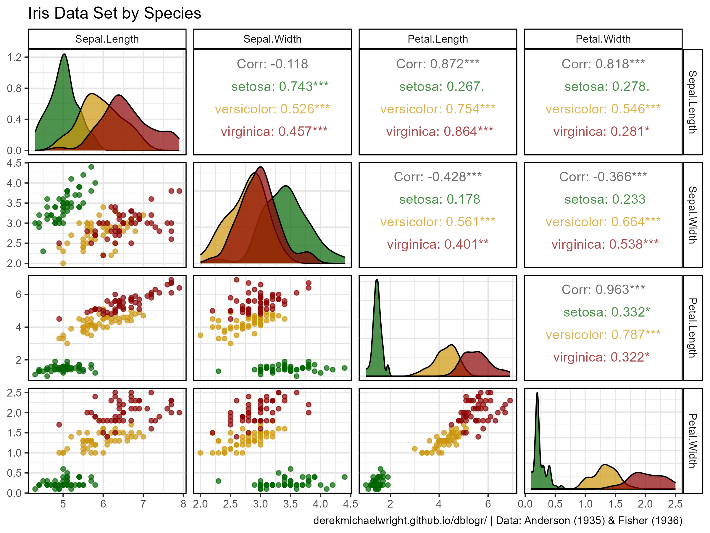
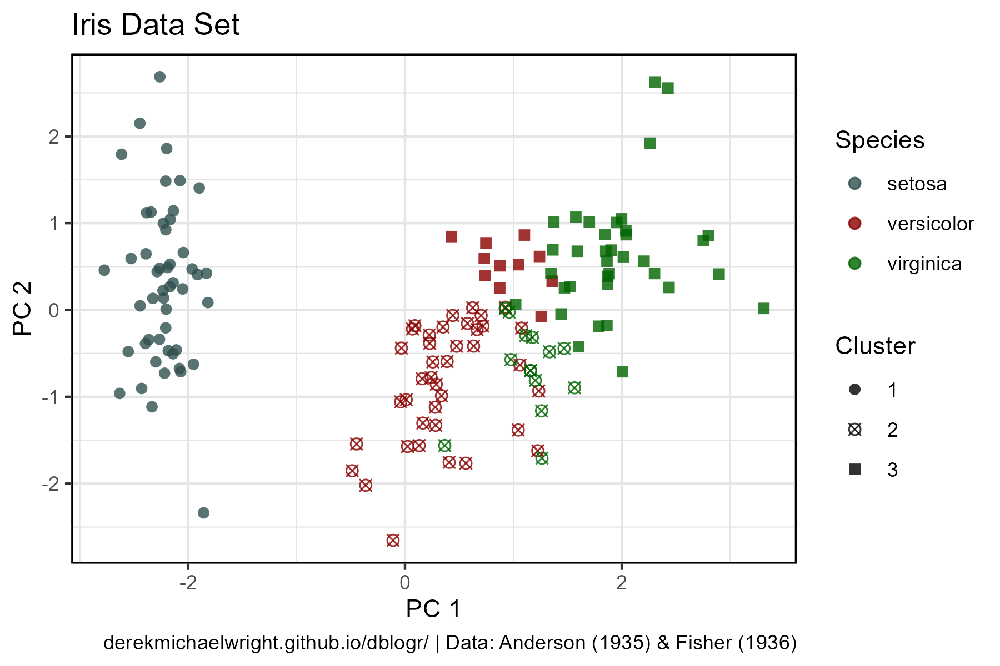
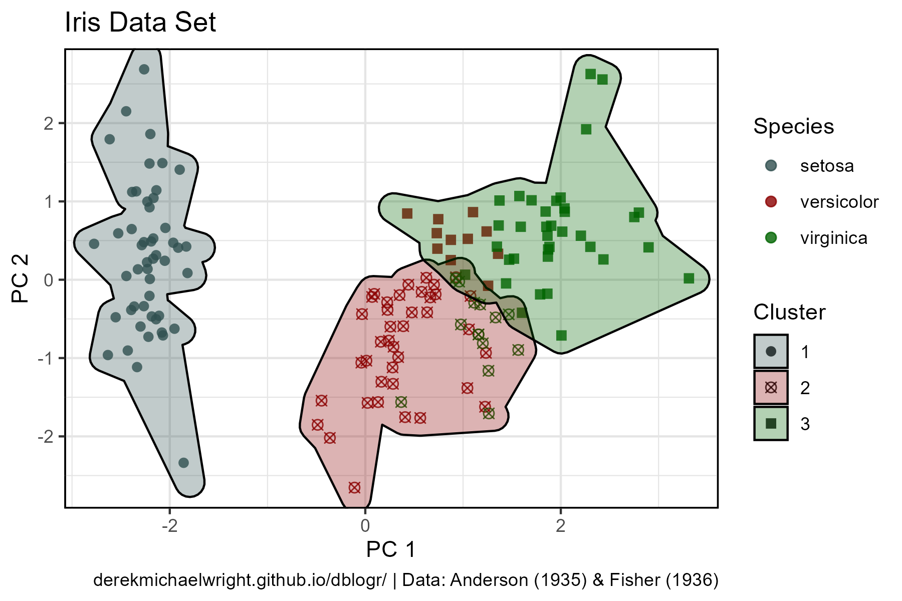
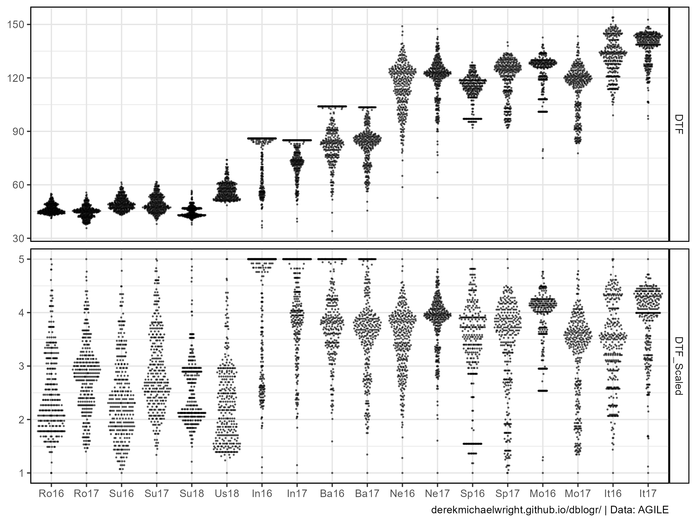

```{r setup, include=FALSE}
knitr::opts_chunk$set(echo = T, message = F, warning = F)
```

---

# Introduction

Principal component analysis (**PCA**) is a statistical process commonly used for dimensionality reduction by projecting each data point onto only the first few principal components to obtain lower-dimensional data while preserving as much of the data's variation as possible. The first principal component can equivalently be defined as a direction that maximizes the variance of the projected data.

For more info: [https://en.wikipedia.org/wiki/Principal_component_analysis](https://en.wikipedia.org/wiki/Principal_component_analysis){target="_blank"}

```{r class.source = "fold-show"}
# devtools::install_github("derekmichaelwright/agData")
library(agData)
library(scales)  # rescale()
library(GGally)  # ggpairs() 
library(plotly)  # plot_ly()
library(ggforce) # geom_mark_hull()
library(rworldmap)   # mapPies()
library(FactoMineR)  # PCA() & HCPC()
library(htmlwidgets) # saveWidget()
# Prep data
myCaption1 <- "derekmichaelwright.github.io/dblogr/ | Data: Anderson (1935) & Fisher (1936)"
myCaption2 <- "derekmichaelwright.github.io/dblogr/ | Data: AGILE"
```

---

# Iris Data Set

## Data Source

> - Fisher, R. A. (1936) **The use of multiple measurements in taxonomic problems**. *Annals of Eugenics*. 7(II): 179–188.
> - Anderson, Edgar (1935) **The irises of the Gaspe Peninsula**. *Bulletin of the American Iris Society*. 59: 2–5.

```{r}
# print the data
DT::datatable(iris)
```

---

## Correlations



```{r}
# Plot
mp <- ggpairs(iris, columns = 1:4, aes(color = Species)) +
  scale_color_manual(values = alpha(agData_Colors,0.7)) +
  scale_fill_manual(values = alpha(agData_Colors,0.7)) +
  theme_agData() +
  labs(title = "Iris Data Set by Species", caption = myCaption1)
ggsave("pca_tutorial_1_01.png", mp, width = 8, height = 6)
```

---

## PCA



```{r}
# PCA
mypca <- PCA(iris[,1:4], graph = F)
# HPCA
myhpca <- HCPC(mypca, nb.clust = 3, graph = F)
#
pcs <- mypca[[3]]$coord %>% as.data.frame()
xx <- iris %>% 
  mutate(Cluster = myhpca[[1]]$clust) %>%
  bind_cols(pcs)
#
myColors <- c("darkslategrey", "darkred", "darkgreen")
myShapes <- c(16, 13, 15)
# Plot 
mp <- ggplot(xx, aes(x = Dim.1, y = Dim.2)) +
  geom_point(aes(color = Species, pch = Cluster), size = 2, alpha = 0.8) +
  scale_color_manual(values = myColors) +
  scale_shape_manual(values = myShapes) +
  theme_agData() +
  labs(title = "Iris Data Set", x = "PC 1", y = "PC 2", caption = myCaption1)
ggsave("pca_tutorial_1_02.png", mp,  width = 6, height = 4)
```

### Clusters



```{r}
# Plot
mp <- mp +
  geom_mark_hull(aes(fill = Cluster), expand = unit(3, "mm")) +
  scale_fill_manual(values = myColors)
ggsave("pca_tutorial_1_03.png", mp,  width = 6, height = 4)
```

---

## 3D Plots

### Species

[https://derekmichaelwright.github.io/dblogr/academic/pca_tutorial/pca_tutorial_iris_1.html](https://derekmichaelwright.github.io/dblogr/academic/pca_tutorial/pca_tutorial_iris_1.html){target="_blank"}

<iframe
  src="pca_tutorial_iris_1.html"
  style="width:100%; height:600px;"
  data-external="1"
></iframe>

```{r}
mp <- plot_ly(iris, x = ~Sepal.Length, y = ~Sepal.Width, z = ~Petal.Length, text = ~Species,
              color = ~Species, colors = myColors, 
              symbol = ~Species, symbols = myShapes) %>% 
  add_markers()
htmlwidgets::saveWidget(mp, file="pca_tutorial_iris_1.html")
```

---

### PCA

[https://derekmichaelwright.github.io/dblogr/academic/pca_tutorial/pca_tutorial_iris_2.html](https://derekmichaelwright.github.io/dblogr/academic/pca_tutorial/pca_tutorial_iris_2.html){target="_blank"}

<iframe
  src="pca_tutorial_iris_2.html"
  style="width:100%; height:600px;"
  data-external="1"
></iframe>

```{r}
mp <- plot_ly(xx, x = ~Dim.1, y = ~Dim.2, z = ~Dim.3, text = ~Species,
              color = ~Species, colors = myColors, 
              symbol = ~Cluster, symbols = myShapes) %>% 
  add_markers()
htmlwidgets::saveWidget(mp, file="pca_tutorial_iris_2.html")
```

---

# LDP Data Set

## Data Source

Derek M. Wright, Sandesh Neupane, Taryn Heidecker, Teketel A. Haile, Crystal Chan, Clarice J. Coyne, Rebecca J. McGee, Sripada Udupa, Fatima Henkrar, Eleonora Barilli, Diego Rubiales, Tania Gioia, Giuseppina Logozzo, Stefania Marzario, Reena Mehra, Ashutosh Sarker, Rajeev Dhakal, Babul Anwar, Debashish Sarker, Albert Vandenberg & Kirstin E. Bett. **Understanding photothermal interactions can help expand production range and increase genetic diversity of lentil (Lens culinaris Medik.)**. *Plants, People, Planet*. (**2020**) 00: 1-11. [doi.org/10.1002/ppp3.10158](https://doi.org/10.1002/ppp3.10158){target="_blank"}

> - `r shiny::icon("save")` [data_ldp.csv](data_ldp.csv)
> - `r shiny::icon("save")` [data_phenology.csv](data_phenology.csv)
> - `r shiny::icon("save")` [data_countries.csv](data_countries.csv)

---

## Raw Data



```{r}
# Prep data
myLDP <- read.csv("data_ldp.csv")
myD <- read.csv("data_phenology.csv") 
myC <- read.csv("data_countries.csv")
myExpts <- c("Ro16", "Ro17", "Su16", "Su17", "Su18", "Us18",
             "In16", "In17", "Ba16", "Ba17", "Ne16", "Ne17", 
             "Sp16", "Sp17", "Mo16", "Mo17", "It16", "It17" )
myColors <- c("darkred",   "darkorange3", "darkgoldenrod2", "deeppink3",
              "steelblue", "darkorchid4", "cornsilk4",      "darkgreen")
xx <- myD %>%
  mutate(Expt = factor(Expt, levels = myExpts)) %>% 
  group_by(Expt) %>% 
  mutate(DTF_Scaled = rescale(DTF, c(1,5))) %>%
  ungroup() %>%
  gather(Trait, Value, DTF, DTF_Scaled)
mp <- ggplot(xx, aes(x = Expt, y = Value)) +
  geom_quasirandom(size = 0.2, alpha = 0.5) + 
  facet_grid(Trait ~ ., scales = "free_y") +
  theme_agData() +
  labs(y = NULL, x = NULL, caption = myCaption2)
ggsave("pca_tutorial_2_01.png", mp,  width = 8, height = 6)
```

---

## PCA

```{r}
# Prep data
xx <- read.csv("data_phenology.csv") %>%
  mutate(Expt = factor(Expt, levels = myExpts),
         DTF = round(DTF)) %>% 
  select(Entry, Expt, DTF) %>%
  spread(Expt, DTF) %>%
  column_to_rownames("Entry")
DT::datatable(xx)
# PCA
mypca <- PCA(xx, ncp = 10, graph = F)
# Heirarcical clustering
mypcaH <- HCPC(mypca, nb.clust = 8, graph = F)
# Bind together
x1 <- mypcaH[[1]] %>% rownames_to_column("Entry")
x2 <- mypca[[3]]$coord %>% as.data.frame() %>% rownames_to_column("Entry")
myPC <- left_join(x1, x2, by = "Entry") %>%
  mutate(Entry = as.numeric(Entry)) %>%
  left_join(select(myLDP, Entry, Name, Origin), by = "Entry") %>%
  left_join(select(myC, Origin=Country, Region), by = "Origin") %>%
  select(Entry, Name, Origin, Region, Cluster=clust,
         PC1=Dim.1, PC2=Dim.2, PC3=Dim.3, PC4=Dim.4, PC5=Dim.5,
         PC6=Dim.6, PC7=Dim.7, PC8=Dim.8, PC9=Dim.9, PC10=Dim.10)
# Print PC's
DT::datatable(myPC)
```

---

## PCA Plots


```{r}
# Plot
mp <- ggplot(myPC, aes(x = PC1, y = PC2, color = Cluster)) +
  geom_point() + 
  scale_color_manual(values = myColors) +
  theme_agData(panel.grid.minor.x = element_blank(),
               panel.grid.minor.y = element_blank()) +
  labs(caption = myCaption2)
ggsave("pca_tutorial_2_02.png", mp, width = 6, height = 4)
```

[https://derekmichaelwright.github.io/dblogr/academic/pca_tutorial/pca_tutorial_ldp_1.html](https://derekmichaelwright.github.io/dblogr/academic/pca_tutorial/pca_tutorial_ldp_1.html){target="_blank"}

<iframe
  src="pca_tutorial_ldp_1.html"
  style="width:100%; height:600px;"
  data-external="1"
></iframe>

```{r}
mp <- plot_ly(myPC, x = ~PC1, y = ~PC2*2.5, z = ~PC3*2.5, 
              text = ~paste(Entry, "|", Name, "\nOrigin:", Origin),
              color = ~Cluster, colors = myColors) %>% 
  add_markers()
htmlwidgets::saveWidget(mp, file="pca_tutorial_ldp_1.html")
```

---

## PC1 vs PC2 vs PC3


```{r}
# Prep data
perc <- round(mypca[[1]][,2], 1)
# Plot PCA 1v2
find_hull <- function(df) df[chull(df[,"PC1"], df[,"PC2"]), ]
polys <- plyr::ddply(myPC, "Cluster", find_hull) %>% mutate(Cluster = factor(Cluster))
mp1 <- ggplot(myPC) +
  geom_polygon(data = polys, alpha = 0.15, aes(x = PC1, y = PC2, fill = Cluster)) +
  geom_point(aes(x = PC1, y = PC2, colour = Cluster)) +
  scale_fill_manual(values = myColors) +
  scale_color_manual(values = myColors) +
  theme_agData() + 
  theme(legend.position = "none", panel.grid = element_blank()) +
  labs(x = paste0("PC1 (", perc[1], "%)"),
       y = paste0("PC2 (", perc[2], "%)"))
# Plot PCA 1v3
find_hull <- function(df) df[chull(df[,"PC1"], df[,"PC3"]), ]
polys <- plyr::ddply(myPC, "Cluster", find_hull) %>% mutate(Cluster = factor(Cluster))
mp2 <- ggplot(myPC) +
  geom_polygon(data = polys, alpha = 0.15, aes(x = PC1, y = PC3, fill = Cluster)) +
  geom_point(aes(x = PC1, y = PC3, colour = Cluster)) +
  scale_fill_manual(values = myColors) +
  scale_color_manual(values = myColors) +
  theme_agData() + 
  theme(legend.position = "none", panel.grid = element_blank()) +
  labs(x = paste0("PC1 (", perc[1], "%)"),
       y = paste0("PC3 (", perc[3], "%)"))
# Plot PCA 2v3
find_hull <- function(df) df[chull(df[,"PC2"], df[,"PC3"]), ]
polys <- plyr::ddply(myPC, "Cluster", find_hull) %>% mutate(Cluster = factor(Cluster))
mp3 <- ggplot(myPC) +
  geom_polygon(data = polys, alpha = 0.15, aes(x = PC2, y = PC3, fill = Cluster)) +
  geom_point(aes(x = PC2, y = PC3, colour = Cluster)) +
  scale_fill_manual(values = myColors) +
  scale_color_manual(values = myColors) +
  theme_agData() + 
  theme(legend.position = "none", panel.grid = element_blank()) +
  labs(x = paste0("PC2 (", perc[2], "%)"),
       y = paste0("PC3 (", perc[3], "%)"),
       caption = myCaption2)
# Append 
mp <- ggarrange(mp1, mp2, mp3, nrow = 1, ncol = 3, hjust = 0)
ggsave("pca_tutorial_2_03.png", mp, width = 8, height = 2.5)
```

```{r echo = F}
ggsave("featured.png", mp, width = 8, height = 2.5)
```

---

## Phenotypes by Cluster Group


```{r}
# Prep data
xx <- read.csv("data_phenology.csv") %>%
  mutate(Expt = factor(Expt, levels = myExpts)) %>% 
  group_by(Expt) %>% 
  mutate(DTF_Scaled = scales::rescale(DTF, c(1,5)),
         DTF_Scaled = round(DTF_Scaled,1)) %>%
  ungroup() %>%
  select(Entry, Expt, DTF_Scaled) %>%
  left_join(select(myPC, Entry, Cluster), by = "Entry") %>%
  group_by(Expt, Cluster) %>% 
  summarise(mean = mean(DTF_Scaled, na.rm = T), sd = sd(DTF_Scaled, na.rm = T)) %>%
  ungroup()
# Plot 
mp <- ggplot(xx, aes(x = Expt, y = mean, group = Cluster)) +
  geom_point(aes(color = Cluster)) + 
  geom_vline(xintercept = 6.5,  lty = 2) + 
  geom_vline(xintercept = 12.5, lty = 2) +
  geom_ribbon(aes(ymin = mean - sd, ymax = mean + sd, fill = Cluster), 
              alpha = 0.2, color = NA) + 
  geom_line(aes(color = Cluster), size = 1) +
  scale_color_manual(values = myColors) +
  scale_fill_manual(values = myColors) +
  theme_agData() +
  theme(axis.text.x = element_text(angle = 90, hjust = 1, vjust = 0.5),
        legend.position = "none", panel.grid = element_blank()) + 
  labs(y = "DTF (scaled 1-5)", x = NULL, caption = myCaption2)
#
ggsave("pca_tutorial_2_04.png", mp, width = 8, height =3.5)
```

---

## Pie Map


```{r results="hide"}
# Plot
xx <- myPC %>% 
  filter(!Origin %in% c("ICARDA","USDA","Unknown")) %>% 
  group_by(Origin, Cluster) %>% 
  summarise(Count = n()) %>% 
  spread(Cluster, Count) %>%
  left_join(select(myC, Origin=Country, Lat, Lon), by = "Origin") %>% 
  ungroup() %>% 
  as.data.frame()
xx[is.na(xx)] <- 0 
png("pca_tutorial_2_05.png", width = 4800, height = 2200, res = 600)
par(mai = c(0,0,0,0), xaxs = "i", yaxs = "i")
mapPies(dF = xx, nameX = "Lon", nameY = "Lat", zColours = myColors,
        nameZs = c("1","2","3","4","5","6","7","8"), lwd = 1,
        xlim = c(-140,110), ylim = c(0,20), addCatLegend = F,
        oceanCol = "grey90", landCol = "white", borderCol = "black") 
legend(-139.5, 15.5, title = "Cluster", legend = 1:8, col = myColors,
       pch = 16, cex = 1, pt.cex = 2, box.lwd = 2)
dev.off()
```

---

```{r eval = F, echo = F}
# Prep data
xx <- read.csv("data/data_pca_tutorial_results.csv") %>% 
  mutate(Cluster = factor(Cluster), PC2 = PC2*3, PC3 = PC3*3,
         myColors = plyr::mapvalues(Cluster, 1:8, colors))
# Create plotting function
ggPCA <- function(x = xx, i = 1) {
  # Plot
  par(mar=c(1.5, 2.5, 1.5, 0.5))
  scatter3D(x = x$PC1, y = x$PC3, z = x$PC2, pch = 16, cex = 0.75, 
    col = alpha(colors,0.8), colvar = as.numeric(x$Cluster), colkey = F,  
    col.grid = "gray90", bty = "u",
    theta = i, phi = 15, ticktype = "detailed", 
    cex.lab = 1, cex.axis = 0.5,
    xlab = "PC1", ylab = "PC3", zlab = "PC2", main = "LDP - DTF")
}
# Plot each angle
for (i in seq(0, 360, by = 2)) {
  png(paste0("Additional/PCA/PCA_", str_pad(i, 3, pad = "0"), ".png"), 
      width = 1000, height = 1000, res = 300) 
  ggPCA(xx, i)
  dev.off()
}
# Create animation
lf <- list.files("Additional/PCA")
mp <- image_read(paste0("Additional/PCA/", lf))
animation <- image_animate(mp, fps = 10)
image_write(animation, "Additional/Animation_PCA.gif")
```
