```{r setup, include=FALSE}
knitr::opts_chunk$set(echo = T, message = F, warning = F)
```

---

# Introduction

> - `r shiny::icon("globe")` `qtl2` Tutorial: https://kbroman.org/qtl2/assets/vignettes/user_guide.html

Running a QTL analysis in <i class="fab fa-r-project"></i> can be done with a few simple steps. This tutorial will go through a couple quick examples with a few lentil (*Lens culinaris*) **recombinant inbred line** (**RIL**) populations (**LR68**, **LR89** & **LR95**).

---

## qtl2 Installation

```{r eval = F}
install.packages(c("devtools", "yaml", "jsonlite", "data.table", "RcppEigen", "RSQLite", "qtl"))
devtools::install_github("rqtl/qtl2")
```

---

## gwaspr package

To aid with data prep and data visualization, I will also be using my own optional package `gwaspr`, which loads `tidyverse`, `ggpubr`, `ggrepel` & `ggtext`. This package is optional.

```{r}
# devtools::install_github("derekmichaelwright/gwaspr")
library(gwaspr)
myCaption <- "www.dblogr.com/ or derekmichaelwright.github.io/dblogr/ | Data: AGILE"
```

---

## Data/Input Files

- `r shiny::icon("globe")` https://kbroman.org/qtl2/assets/vignettes/input_files.html

In order to run the analysis we first need to set up an `input` folder with properly formatted files containing our ***phenotyope*** data, ***genotype*** data, a ***genetic map*** and a ***yaml*** file with details for running the analysis. The `input` folders used in this vignette can be downloaded below:

- `r shiny::icon("save")` [input_LR95.zip](input_LR95.zip)
- `r shiny::icon("save")` [input_LR89.zip](input_LR89.zip)
- `r shiny::icon("save")` [input_LR68.zip](input_LR68.zip)

---

# LR68

For our first example, we will use LR68, an intraspecfic RIL population from a cross between `IG 72643`, a *Lens orientalis* wild accession, and `3339-3` (*Lens culinaris*), an accession which was released as the variety CDC Greenstar.

<pre><code>input_LR68
  ├── LR68.yaml
  ├── LR68_gmap.csv
  ├── LR68_geno.csv
  └── LR68_pheno.csv
</code></pre>

```{r}
read.csv("input_LR68/LR68.yaml", header = F)
read.csv("input_LR68/LR68_gmap.csv")[1:10,]
read.csv("input_LR68/LR68_geno.csv")[1:10,1:4]
read.csv("input_LR68/LR68_pheno.csv")[1:10,]
```

---

## Phenotype Data

We have 4 phenotypes for this population, 3 of which are qualitative traits which need to be converted into a numeric format:

- Cotyledon_Color: `0 = "Orange"`, `1 = "Yellow"`
- Testa_Color: `0 = "Green"`,  `1 = "Brown"`
- Testa_Pattern: `0 = "Absent"`, `1 = "Present"`

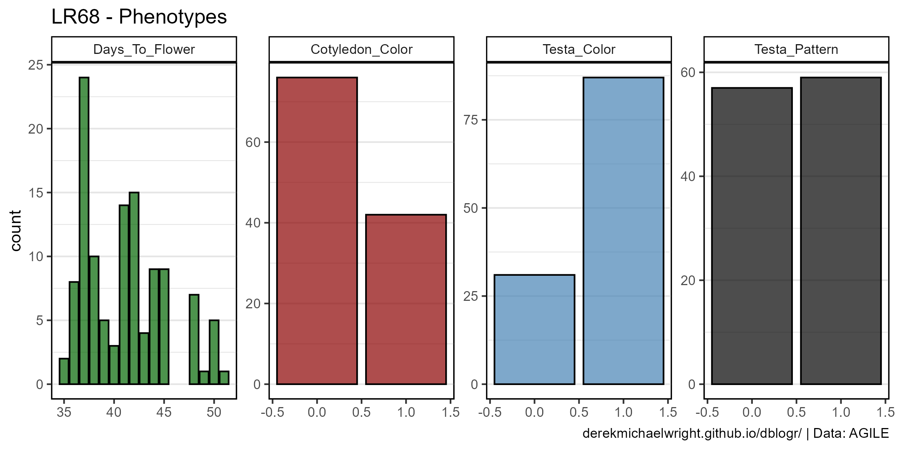

```{r}
# Prep data
myColors <- c("darkgreen", "darkred", "steelblue", "black")
myTraits <- c("Days_To_Flower", "Cotyledon_Color", "Testa_Color", "Testa_Pattern")
xx <- read.csv("input_LR68/LR68_Pheno.csv") %>% 
  gather(trait, value, 2:ncol(.)) %>%
  mutate(trait = factor(trait, levels = myTraits))
# Plot
mp <- ggplot(xx, aes(x = value, fill = trait)) +
  geom_bar(color = "black", alpha = 0.7) +
  facet_wrap(trait ~ ., scales = "free", ncol = 4) +
  scale_fill_manual(values = myColors) +
  theme_gwaspr(legend.position = "none") +
  labs(title = "LR68 - Phenotypes", caption = myCaption)
ggsave("qtl_tutorial_LR68_01.png", mp, width = 8, height = 4)
```

---

## Run QTL Analysis

```{r}
library(qtl2)
myQTL <- read_cross2("input_LR68/LR68.yaml", quiet = F)
summary(myQTL)
# insert a pseudomarker every 1 cM (step = 1)
map <- insert_pseudomarkers(myQTL$gmap, step = 1)
# calculate the QTL genotype probabilities
pr <- calc_genoprob(myQTL, map)
# perform genome scan to determine LOD scores
out <- scan1(pr, myQTL$pheno)
# Find peaks
find_peaks(out, map, threshold = 3, drop = 1.5)
# Perform permutation tests
operm <- scan1perm(pr, myQTL$pheno, n_perm = 1000)
# Calculate thresholds
summary(operm, alpha = c(0.05, 0.01))
```

Save Results

- `r shiny::icon("save")` [LR68_results.csv](LR68_results.csv)

```{r}
# Save QTL peaks
write.csv(find_peaks(out, map, threshold = 3, drop = 1.5), 
          "LR68_results.csv", row.names = F)
```

---

## Plot Results

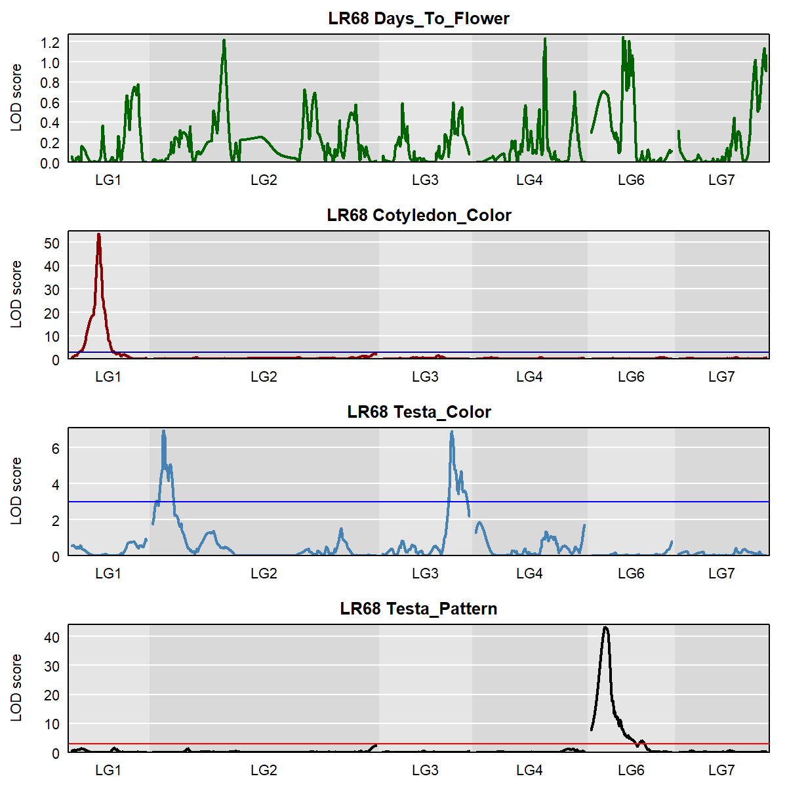

```{r results="hide"}
# Plot
png("qtl_tutorial_LR68_02.png", width = 1200, height = 1200, res = 200)
par(mfrow = c(4,1), mar = c(2,4,2,1))
plot(out, map, lodcolumn = 1, col = myColors[1], 
     main = paste("LR68", colnames(out)[1]))
abline(h = 3, col = "steelblue")
plot(out, map, lodcolumn = 2, col = myColors[2], 
     main = paste("LR68", colnames(out)[2]))
abline(h = 3, col = "darkblue")
plot(out, map, lodcolumn = 3, col = myColors[3], 
     main = paste("LR68", colnames(out)[3]))
abline(h = 3, col = "blue")
plot(out, map, lodcolumn = 4, col = myColors[4], 
     main = paste("LR68", colnames(out)[4]))
abline(h = 3, col = "red")
dev.off()
```

---


```{r results="hide"}
# Plot
png("qtl_tutorial_LR68_03.png", width = 1200, height = 400, res = 200)
par(mar = c(2,4,2,1))
plot(out, map, lodcolumn = 2, col = myColors[2], main = "LR68")
plot(out, map, lodcolumn = 3, col = myColors[3], add = T)
plot(out, map, lodcolumn = 4, col = myColors[4], add = T)
abline(h = 3, col = "red")
legend("top", lwd = 2, col = myColors[c(2,4)], 
       colnames(out)[c(2,4)], bg = "gray90")
dev.off()
```

---

## Marker Plots

```{r}
find_peaks(out, map, threshold = 3, drop = 1.5)
```

---

### Cotyledon Color

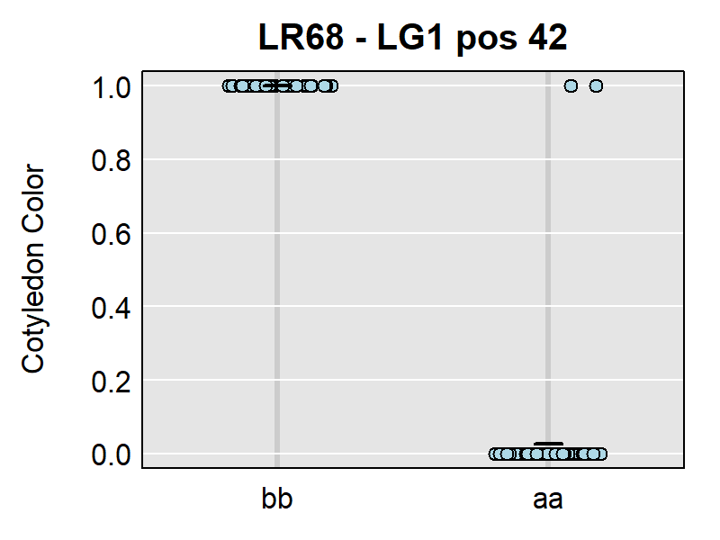

```{r results="hide"}
# Prep data
xx <- maxmarg(pr, map, chr = "LG1", pos = 42, return_char = T)
# Plot
png("qtl_tutorial_LR68_04.png", width = 600, height = 400, res = 200)
par(mar = c(2,4,2,1))
plot_pxg(xx, myQTL$pheno[,"Cotyledon_Color"], ylab = "Cotyledon Color",
         main = "LR68 - LG1 pos 42")
dev.off()
```

---

### Testa Pattern

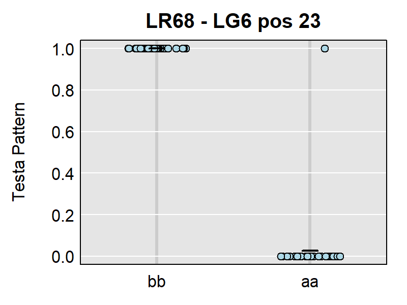

```{r results="hide"}
# Prep data
xx <- maxmarg(pr, map, chr = "LG6", pos = 23, return_char = T)
# Plot
png("qtl_tutorial_LR68_05.png", width = 600, height = 400, res = 200)
par(mar = c(2,4,2,1))
plot_pxg(xx, myQTL$pheno[,"Testa_Pattern"], ylab = "Testa Pattern", 
         main = "LR68 - LG6 pos 23")
dev.off()
```

---

### Testa Color

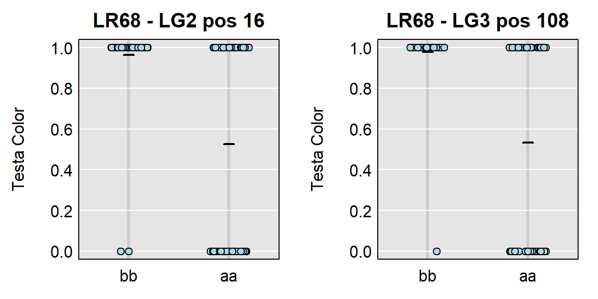

```{r results="hide"}
# Prep plot 
png("qtl_tutorial_LR68_06.png", width = 1200, height = 400, res = 200)
par(mfrow = c(1,2), mar = c(2,4,2,1))
# Plot QTL 1
xx <- maxmarg(pr, map, chr = "LG2", pos = 16, return_char = T)
plot_pxg(xx, myQTL$pheno[,"Testa_Color"], ylab = "Testa Color", 
         main = "LR68 - LG2 pos 16")
# Plot QTL 2
xx <- maxmarg(pr, map, chr = "LG3", pos = 108, return_char = T)
plot_pxg(xx, myQTL$pheno[,"Testa_Color"], ylab = "Testa Color", 
         main = "LR68 - LG3 pos 108")
dev.off()
```

---

---

## Estimated QTL effects

### Cotyledon Color


```{r results="hide"}
# Prep data
c2eff <- scan1coef(pr[,"LG1"], myQTL$pheno[,"Cotyledon_Color"])
myColors2 <- c("slateblue", "violetred")
# Plot
png("qtl_tutorial_LR68_07.png", width = 600, height = 400, res = 200)
par(mar = c(4,4,2,2.5))
plot(c2eff, map["LG1"], columns = 1:2, 
     col = myColors2, main = "LR68 Cotyledon Color")
last_coef <- unclass(c2eff)[nrow(c2eff),]
for(i in 1:2) { 
  axis(side = 4, at = last_coef[i], names(last_coef)[i], 
       tick = F, col.axis = myColors2[i])
}
dev.off()
```

---

### Testa Color


```{r results="hide"}
# Prep data
myColors2 <- c("slateblue", "violetred")
# Plot
png("qtl_tutorial_LR68_08.png", width = 1200, height = 400, res = 200)
par(mfrow = c(1,2), mar = c(4,4,2,2.5))
c2eff <- scan1coef(pr[,"LG2"], myQTL$pheno[,"Testa_Color"])
plot(c2eff, map["LG2"], columns = 1:2, 
     col = myColors2, main = "LR68 Testa Color")
last_coef <- unclass(c2eff)[nrow(c2eff),]
for(i in 1:2) { 
  axis(side = 4, at = last_coef[i], names(last_coef)[i], 
       tick = F, col.axis = myColors2[i])
}
c2eff <- scan1coef(pr[,"LG3"], myQTL$pheno[,"Testa_Color"])
plot(c2eff, map["LG3"], columns = 1:2, 
     col = myColors2, main = "LR68 Testa Color")
last_coef <- unclass(c2eff)[nrow(c2eff),]
for(i in 1:2) { 
  axis(side = 4, at = last_coef[i], names(last_coef)[i], 
       tick = F, col.axis = myColors2[i])
}
dev.off()
```

### Testa Pattern

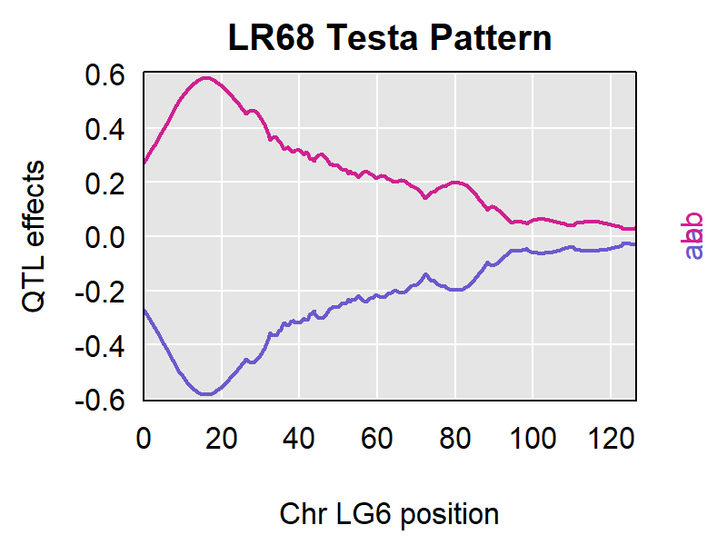

```{r results="hide"}
# Prep data
c2eff <- scan1coef(pr[,"LG6"], myQTL$pheno[,"Testa_Pattern"])
myColors2 <- c("slateblue", "violetred")
# Plot
png("qtl_tutorial_LR68_09.png", width = 600, height = 400, res = 200)
par(mar = c(4,4,2,2.5))
plot(c2eff, map["LG6"], columns = 1:2, 
     col = myColors2, main = "LR68 Testa Pattern")
last_coef <- unclass(c2eff)[nrow(c2eff),]
for(i in 1:2) { 
  axis(side = 4, at = last_coef[i], names(last_coef)[i], 
       tick = F, col.axis = myColors2[i])
}
dev.off()
```

---

##  Custom Plotting


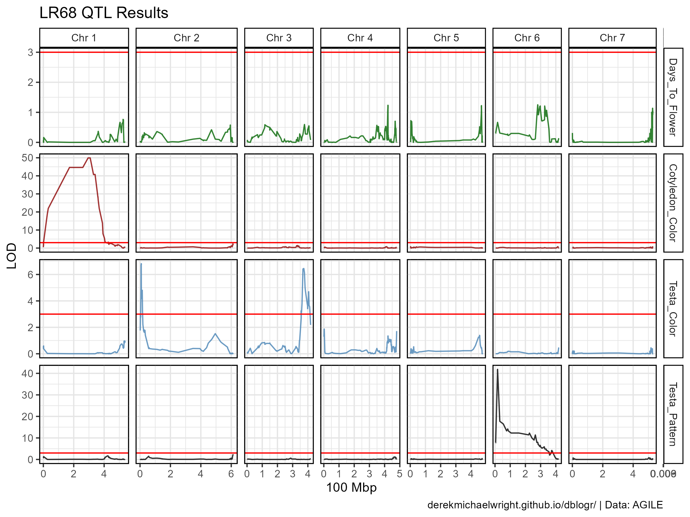

```{r}
# Create function to map positions of pseudomarkers
fill_psuedos <- function(xx, step = 1) {
  for(i in 1:nrow(xx)) {
    if(is.na(xx$lg[i])) { 
      xx$lg[i] <- xx$lg[i-1]
      xx$cM[i] <- xx$cM[i-1] + step
    }
  }
  xx
}
# Prep data
x_pheno <- read.csv("input_LR68/LR68_Pheno.csv")
x_gmap <- read.csv("input_LR68/LR68_gmap.csv")
xx <- out %>% as.data.frame() %>%
  rownames_to_column(var = "marker") %>%
  left_join(x_gmap, by = "marker") %>%
  mutate(chr = substr(marker, 13, 13),
         pos = substr(marker, regexpr("p", marker)+1, nchar(marker)),
         pos = as.numeric(pos)) %>% 
  select(marker, lg, cM, chr, pos, everything()) %>%
  fill_psuedos() %>%
  gather(trait, value, 6:ncol(.)) %>%
  mutate(trait = factor(trait, levels = myTraits) )
xx[1:14,]
# Plot by linkage group
mp <- ggplot(xx, aes(x = cM, y = value, color = trait)) + 
  geom_line(alpha = 0.8) +
  geom_hline(yintercept = 3, color = "red") +
  facet_grid(trait ~ lg, scales = "free", space = "free_x") +
  scale_color_manual(values = myColors) +
  theme_gwaspr(legend.position = "none") +
  labs(title = "LR68 QTL Results", y = "LOD", caption = myCaption)
ggsave("qtl_tutorial_LR68_10.png", mp, width = 8, height = 6)
# Plot by physical location - pseudomarkers removed
mp <- ggplot(xx %>% filter(!is.na(pos)), 
             aes(x = pos/100000000, y = value, color = trait)) + 
  geom_line(alpha = 0.8) +
  geom_hline(yintercept = 3, color = "red") +
  facet_grid(trait ~ paste("Chr", chr), scales = "free", space = "free_x") +
  scale_color_manual(values = myColors) +
  theme_gwaspr(legend.position = "none") +
  labs(title = "LR68 QTL Results", y = "LOD", 
       x = "100 Mbp", caption = myCaption)
ggsave("qtl_tutorial_LR68_11.png", mp, width = 8, height = 6)
```

---

## PDF Output

If you have many traits, plotting the results into a pdf can be a useful.

`r shiny::icon("save")` [qtl_tutorial_results_LR68.pdf](qtl_tutorial_results_LR68.pdf)

```{r results="hide"}
pdf("qtl_tutorial_results_LR68.pdf", width = 12, height = 4)
for(i in myTraits) {
  print(ggplot(xx %>% filter(trait %in% i), 
               aes(x = cM, y = value)) + 
          geom_line(color = "darkgreen") +
          geom_hline(yintercept = 3, color = "red") +
          facet_grid(. ~ lg, space = "free_x") +
          theme_gwaspr() +
          labs(title = i, y = "LOD", caption = myCaption)
  )
}
dev.off()
```

---

## Binary traits

A normal QTL analysis assumes the data follows a normal distribution. In our case however, we have 3 qualitative traits which are binary in nature. we can use `model="binary"` to adjust for this.

```{r}
out_b <- scan1(pr, myQTL$pheno, model = "binary")
operm <- scan1perm(pr, myQTL$pheno, n_perm = 1000, model = "binary")
# Calculate %5 & 1% thresholds
summary(operm, alpha = c(0.05, 0.01)) 
```


```{r}
# Prep data
x1 <- out %>% as.data.frame() %>% rownames_to_column(var = "marker") %>%
  select(-Days_To_Flower) %>%
  gather(trait, value, 2:ncol(.)) %>%
  mutate(Model = "Normal")
x2 <- out_b %>% as.data.frame() %>% rownames_to_column(var = "marker") %>%
  gather(trait, value, 2:ncol(.)) %>%
  mutate(Model = "Binary")
xx <- bind_rows(x1, x2) %>%
  left_join(x_gmap, by = "marker") %>%
  fill_psuedos()
# Plot by linkage group
mp <- ggplot(xx, aes(x = cM, y = value, color = Model)) + 
  geom_line(alpha = 0.7) +
  geom_hline(yintercept = 3, color = "red") +
  facet_grid(trait ~ lg, scales = "free", space = "free_x") +
  scale_color_manual(values = c("darkorange", "darkblue")) +
  theme_gwaspr(legend.position = "bottom") +
  labs(title = "LR68 QTL Results - Model Comparisons", 
       y = "LOD", caption = myCaption)
ggsave("qtl_tutorial_LR68_12.png", mp, width = 8, height = 6)
```

---

# LR95

For our second example, we will use LR95, an interspecfic RIL population from a cross between `Shasta`, a zero-tanin variety, and `CDC Redberry`, the variety which was used for sequencing the *Lens culinaris* genome.

<pre><code>input_LR95  
  ├── LR95.yaml
  ├── LR95_gmap.csv
  ├── LR95_geno.csv
  └── LR95_pheno.csv
</code></pre>

```{r}
read.csv("input_LR95/LR95.yaml", header = F)
read.csv("input_LR95/LR95_gmap.csv")[1:10,]
read.csv("input_LR95/LR95_geno.csv")[1:10,1:4]
read.csv("input_LR95/LR95_pheno.csv")[1:10,]
```

---

## Phenotype Data

Similar to the first example, we have two qualitative traits which need to be converted from `character` to `numeric`:

- Cotyledon_Color: `0 = "Orange"`, `1 = "Yellow"`
- Testa_Color: `0 = "Green"`, `1 = "Grey"`

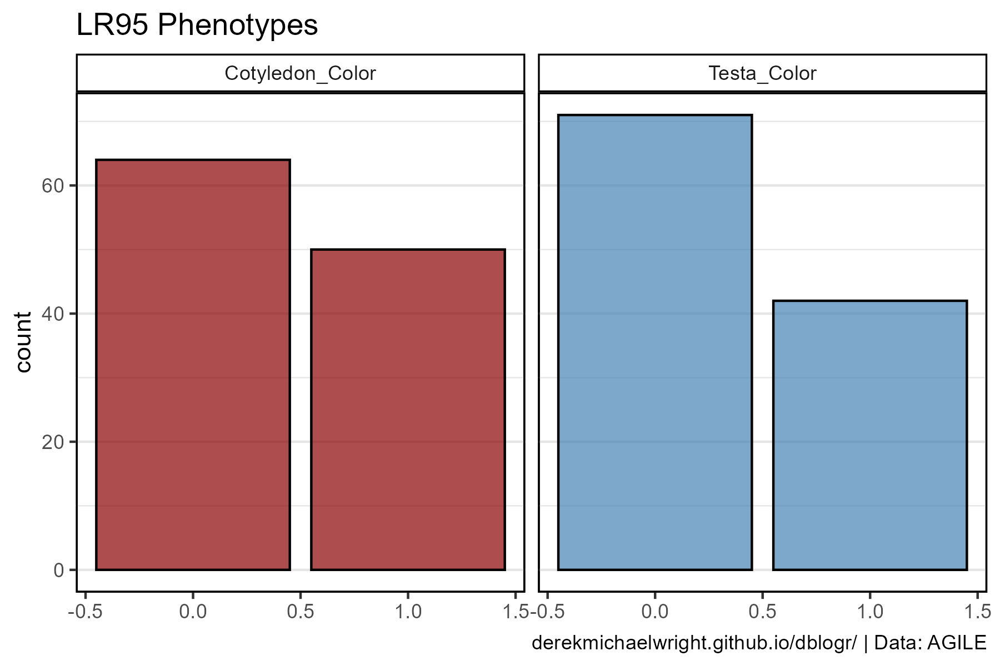

```{r}
# Prep data
myColors <- c("darkred", "steelblue")
myTraits <- c("Cotyledon_Color", "Testa_Color")
xx <- read.csv("input_LR95/LR95_Pheno.csv") %>% 
  gather(trait, value, 2:ncol(.)) %>%
  mutate(trait = factor(trait, levels = myTraits))
# Plot
mp <- ggplot(xx, aes(x = value, fill = trait)) +
  geom_bar(color = "black", alpha = 0.7) +
  facet_grid(. ~ trait) +
  scale_fill_manual(values = myColors) +
  theme_gwaspr(legend.position = "none") +
  labs(title = "LR95 Phenotypes", caption = myCaption)
ggsave("qtl_tutorial_LR95_01.png", mp, width = 6, height = 4)
```

---

## Run QTL Analysis

```{r}
library(qtl2)
myQTL <- read_cross2("input_LR95/LR95.yaml", quiet = F)
summary(myQTL)
# insert a pseudomarker every 1 cM (step = 1)
map <- insert_pseudomarkers(myQTL$gmap, step = 1)
# calculate the QTL genotype probabilities
pr <- calc_genoprob(myQTL, map)
# perform genome scan to determine LOD scores
out <- scan1(pr, myQTL$pheno)
# Find peaks
find_peaks(out, map, threshold = 3, drop = 1.5)
# Perform permutation tests
operm <- scan1perm(pr, myQTL$pheno, n_perm = 1000)
# Calculate thresholds
summary(operm, alpha = c(0.05, 0.01))
```

Save Results

- `r shiny::icon("save")` [LR95_results.csv](LR95_results.csv)

```{r}
# Save QTL peaks
write.csv(find_peaks(out, map, threshold = 3, drop = 1.5), 
          "LR95_results.csv", row.names = F)
```

---

## Plot Results


```{r results="hide"}
# Plot
png("qtl_tutorial_LR95_02.png", width = 1200, height = 800, res = 200)
par(mfrow = c(2,1), mar = c(2,4,2,1.5))
plot(out, map, lodcolumn = 1, col = myColors[1], 
     main = paste("LR95", colnames(out)[1]))
abline(h = 3, col = "red")
plot(out, map, lodcolumn = 2, col = myColors[2], 
     main = paste("LR95", colnames(out)[2]))
dev.off()
```

---

## Marker Plots

```{r}
find_peaks(out, map, threshold = 3, drop = 1.5)
```

---

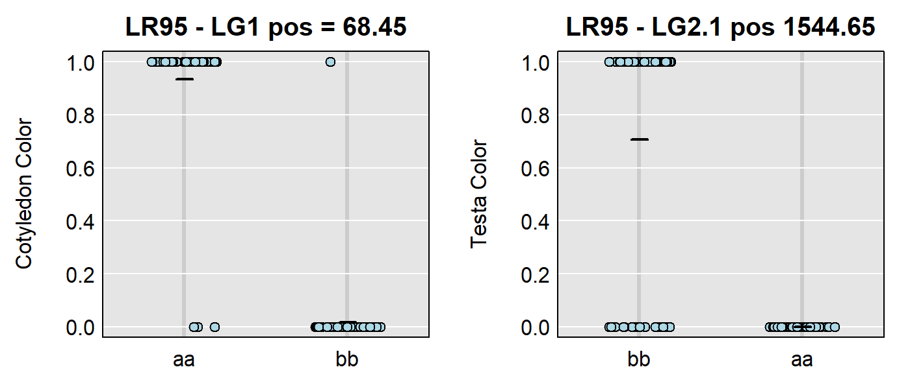

```{r results="hide"}
# Prep plot 
png("qtl_tutorial_LR95_03.png", width = 1200, height = 400, res = 200)
par(mfrow = c(1,2), mar = c(2,4,2,1))
# Plot QTL 1
xx <- maxmarg(pr, map, chr = "LG1", pos = 68.45, return_char = T)
plot_pxg(xx, myQTL$pheno[,"Cotyledon_Color"], ylab = "Cotyledon Color", 
         main = "LR95 - LG1 pos = 68.45")
# Plot QTL 2
xx <- maxmarg(pr, map, chr = "LG2.1", pos = 1544.65, return_char = T)
plot_pxg(xx, myQTL$pheno[,"Testa_Color"], ylab = "Testa Color", 
         main = "LR95 - LG2.1 pos 1544.65")
dev.off()
```

---

## Estimated QTL effects

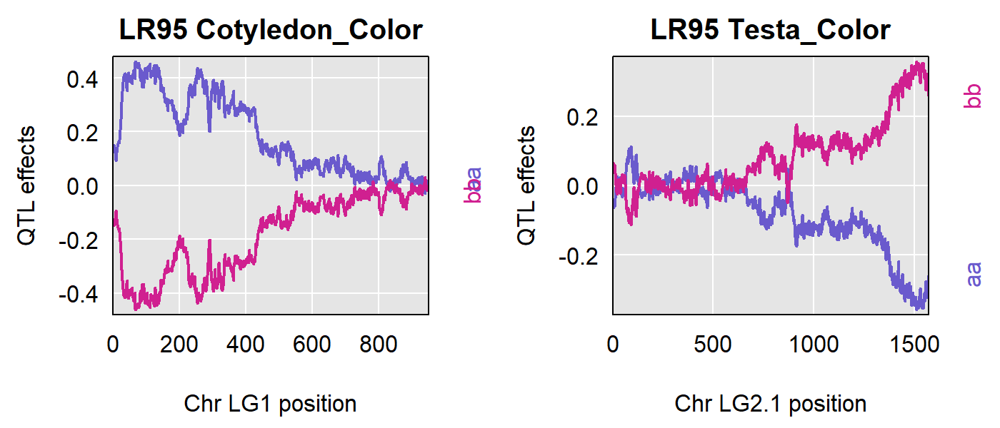

```{r results="hide"}
# Prep data
myColors2 <- c("slateblue", "violetred", "green3")
# Plot
png("qtl_tutorial_LR95_04.png", width = 1200, height = 400, res = 200)
par(mfrow = c(1,2), mar = c(4,4,2,2.5))
c2eff <- scan1coef(pr[,"LG1"], myQTL$pheno[,"Cotyledon_Color"])
plot(c2eff, map["LG1"], columns = 1:2, col = myColors2, main = "LR95 Cotyledon_Color")
last_coef <- unclass(c2eff)[nrow(c2eff),] 
for(i in 1:2) { 
  axis(side = 4, at = last_coef[i], names(last_coef)[i], 
       tick = F, col.axis = myColors2[i])
}
c2eff <- scan1coef(pr[,"LG2.1"], myQTL$pheno[,"Testa_Color"])
plot(c2eff, map["LG2.1"], columns = 1:2, col = myColors2, main = "LR95 Testa_Color")
last_coef <- unclass(c2eff)[nrow(c2eff),] 
for(i in 1:2) { 
  axis(side = 4, at = last_coef[i], names(last_coef)[i], 
       tick = F, col.axis = myColors2[i])
}
dev.off()
```

---

## Custom Plotting


```{r}
# Create function to map positions of pseudomarkers
fill_psuedos <- function(xx, step = 1) {
  for(i in 1:nrow(xx)) {
    if(is.na(xx$lg[i])) { 
      xx$lg[i] <- xx$lg[i-1]
      xx$cM[i] <- xx$cM[i-1] + step
    }
  }
  xx
}
# Prep data
x_pheno <- read.csv("input_LR95/LR95_Pheno.csv")
x_gmap <- read.csv("input_LR95/LR95_gmap.csv")
xx <- out %>% as.data.frame() %>% 
  rownames_to_column(var = "marker") %>%
  left_join(x_gmap, by = "marker") %>%
  mutate(chr = substr(marker, 13, 13),
         pos = substr(marker, regexpr("p",marker)+1, nchar(marker)),
         pos = as.numeric(pos)) %>%
  select(marker, lg, cM, chr, pos, everything()) %>%
  fill_psuedos() %>%
  gather(trait, value, 6:ncol(.)) %>%
  mutate(trait = factor(trait, levels = myTraits))
# Plot by linkage group
mp <- ggplot(xx, aes(x = cM, y = value, color = trait)) + 
  geom_line(alpha = 0.8) +
  geom_hline(yintercept = 3, color = "red") +
  facet_grid(trait ~ lg, scales = "free", space = "free_x") +
  scale_color_manual(values = myColors) +
  theme_gwaspr() + 
  labs(title = "LR95 QTL Results", y = "LOD", caption = myCaption)
ggsave("qtl_tutorial_LR95_05.png", mp, width = 8, height = 5)
# Plot by physical location - pseudomarkers removed
mp <- ggplot(xx %>% filter(!is.na(pos)), 
             aes(x = pos/100000000, y = value, color = trait)) + 
  geom_line(alpha = 0.8) +
  geom_hline(yintercept = 3, color = "red") +
  facet_grid(trait ~ chr, scales = "free", space = "free_x") +
  scale_color_manual(values = myColors) +
  theme_gwaspr() +
  labs(title = "LR95 QTL Results", y = "LOD", 
       x = "100 Mbp", caption = myCaption)
ggsave("qtl_tutorial_LR95_06.png", mp, width = 8, height = 5)
```

```{r echo = F}
ggsave("featured.png", mp, width = 8, height = 5)
```

---

## Mapping Comparison


```{r}
# Prep data
yy <- xx %>% filter(trait == "Cotyledon_Color") %>%
  filter(lg == "LG1")
# Plot
mp1 <- ggplot(yy, aes(x = cM, y = value)) +
  geom_line(color = "darkgreen", alpha = 0.7, size = 1) +
  geom_hline(yintercept = 3, color = "red") +
  facet_grid(trait ~ lg, scales = "free", space = "free_x") +
  theme_gwaspr() +
  labs(title = "LR95 Linkage Map", y = "LOD")
mp2 <- ggplot(yy %>% filter(chr == "1"), aes(x = pos / 100000000, y = value)) +
  geom_line(color = "darkgreen", alpha = 0.7, size = 1) +
  geom_hline(yintercept = 3, color = "red") +
  facet_grid(trait ~ paste("Chr", chr), scales = "free", space = "free_x") +
  theme_gwaspr() +
  labs(title = "LR95 Physical Location", y = "LOD", 
       x = "100 Mbp", caption = myCaption)
mp <- ggpubr::ggarrange(mp1, mp2)
ggsave("qtl_tutorial_LR95_07.png", mp, width = 8, height = 4)
```

---

## Data Prep

The original data was not properly formatted for running the QTL analysis. The following is the code I used to take the original files and format them to be used by `qtl2`.

```{r}
# Prep phenotype data
xx <- readxl::read_xlsx("rawdata/CombinedphenotypingLR93,LR-95.xlsx", "LR-95", skip = 1) %>%
  filter(!is.na(Cotyledon...6))
xx <- xx %>% select(Id = name, 
                    Cotyledon_Color = Cotyledon...6,
                    Testa_Color = `Seed Coat...9`) %>%
  mutate(Cotyledon_Color = plyr::mapvalues(Cotyledon_Color, c("orange","yellow"), c(0,1)),
         Cotyledon_Color = as.numeric(Cotyledon_Color),
         Testa_Color = plyr::mapvalues(Testa_Color, c("green", "grey", "white"), c(0,1,0)),
         Testa_Color = as.numeric(Testa_Color))
write.csv(xx, "input_LR95/LR95_pheno.csv", row.names = F)
# Prep genotype map
xx <- readxl::read_xlsx("rawdata/221122 - LR-95 map - binned - Rob.xlsx")
gmap <- xx %>% select(marker=Name, lg=...3, cM) %>%
  mutate(lg = substr(lg, 1, regexpr("-", lg)-1)) %>%
  arrange(lg, cM)
write.csv(gmap, "input_LR95/LR95_gmap.csv", row.names = F)
# Prep genotype data
geno <- xx %>% select(6:ncol(.)) %>% t()
colnames(geno) <- geno[1,]
geno <- geno %>% as.data.frame() %>% slice(-1)
for(i in 1:ncol(geno)) { geno[,i] <- plyr::mapvalues(geno[,i], c(" 0"," 2","-1"), c("a","b","-")) }
write.csv(geno, "input_LR95/LR95_geno.csv", row.names = T)
```

```{r eval = F, echo = F}
# Prep phenotype data
xx <- readxl::read_xlsx("rawdata/CombinedphenotypingLR93,LR-95.xlsx", "LR-95", skip = 1) %>%
  filter(!is.na(Cotyledon...6))
xx <- xx %>% select(Id=name, Cotyledon.Color=Cotyledon...6,
                      Testa.Color.1=`Seed Coat...9`, 
                      Testa.Color.2=`Seed Coat...10`) %>%
  mutate(Cotyledon.Color = plyr::mapvalues(Cotyledon.Color, c("orange","yellow"), c(0,1)),
         Cotyledon.Color = as.numeric(Cotyledon.Color),
         Testa.Color.3 = plyr::mapvalues(Testa.Color.1, c("green", "grey", "white"), c(0,1,0)),
         Testa.Color.3 = as.numeric(Testa.Color.3),
         Testa.Color.4 = plyr::mapvalues(Testa.Color.2, c("green", "grey", "white"), c(0,1,0)),
         Testa.Color.4 = as.numeric(Testa.Color.4),
         #
         Testa.Color.1 = plyr::mapvalues(Testa.Color.1, c("green", "grey"), c(0,1)),
         Testa.Color.1 = as.numeric(Testa.Color.1),
         Testa.Color.2 = plyr::mapvalues(Testa.Color.2, c("green", "grey"), c(0,1)),
         Testa.Color.2 = as.numeric(Testa.Color.2)
         ) 
xx <- xx %>% select(-Testa.Color.3, -Testa.Color.4)
write.csv(xx, "input_LR95/LR95_pheno.csv", row.names = F)
# estimate physical position
#myMin <- xx$pos[i-1]
#myMax <- xx$pos[grep(F, is.na(xx$pos[i:nrow(xx)]))[1]+i-1]
#mySteps <- grep(F, is.na(xx$pos[i:nrow(xx)]))[1]
#xx$pos[i] <- myMin + ((myMax - myMin) / mySteps)
```

---

# LR89

For our third example, we will use LR89, an interspecfic RIL population from a cross between two wild lentil (*Lens orientalis*) accessions, `BGE 016880` and `IG 72529`, which have been phenotyped for root rot in 3 experiments.

<pre><code>input_LR89
  ├── LR89.yaml
  ├── LR89_gmap.csv
  ├── LR89_geno.csv
  └── LR89_pheno.csv
</code></pre>

```{r}
read.csv("input_LR89/LR89.yaml", header = F)
read.csv("input_LR89/LR89_gmap.csv")[1:10,]
read.csv("input_LR89/LR89_geno.csv")[1:10,1:4]
read.csv("input_LR89/LR89_pheno.csv")[1:10,]
```

---

## Phenotype Data

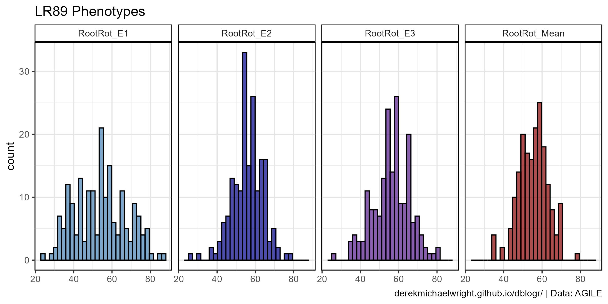

```{r}
# Prep data
myTraits <- c("RootRot_E1", "RootRot_E2", "RootRot_E3", "RootRot_Mean")
myColors <- c("steelblue", "darkblue", "purple4", "darkred")
xx <- read.csv("input_LR89/LR89_Pheno.csv") %>% 
  gather(trait, value, 2:ncol(.)) %>%
  mutate(trait = factor(trait, levels = myTraits))
# Plot
mp <- ggplot(xx, aes(x = value, fill = trait)) +
  geom_histogram(color = "black", alpha = 0.7) +
  facet_grid(. ~ trait) +
  scale_fill_manual(name = NULL, values = myColors) +
  theme_gwaspr(legend.position = "none") +
  labs(title = "LR89 Phenotypes", caption = myCaption)
ggsave("qtl_tutorial_LR89_01.png", mp, width = 8, height = 4)
```

---

## Run QTL Analysis

```{r}
library(qtl2)
myQTL <- read_cross2("input_LR89/LR89.yaml", quiet = F)
summary(myQTL)
# insert a pseudomarker every 1 cM (step = 1)
map <- insert_pseudomarkers(myQTL$gmap, step = 1)
# calculate the QTL genotype probabilities
pr <- calc_genoprob(myQTL, map)
# perform genome scan to determine LOD scores
out <- scan1(pr, myQTL$pheno)
# Find peaks
find_peaks(out, map, threshold = 3, drop = 1.5)
# Perform permutation tests
operm <- scan1perm(pr, myQTL$pheno, n_perm = 1000)
# Calculate thresholds
summary(operm, alpha = c(0.05, 0.01))
```

Save Restuls

- `r shiny::icon("save")` [LR89_results.csv](LR89_results.csv)

```{r}
# Save QTL peaks
write.csv(find_peaks(out, map, threshold = 3, drop = 1.5), 
          "LR89_results.csv", row.names = F)
```

---

## Plot Results


```{r results="hide"}
# Plot
png("qtl_tutorial_LR89_02.png", width = 1200, height = 1200, res = 200)
par(mfrow = c(4,1), mar = c(2,4,2,1))
plot(out, map, lodcolumn = 1, col = myColors[1], 
     main = paste("LR89", colnames(out)[1]))
abline(h = 3, col = "red")
plot(out, map, lodcolumn = 2, col = myColors[2], 
     main = paste("LR89", colnames(out)[2]))
abline(h = 3, col = "red")
plot(out, map, lodcolumn = 3, col = myColors[3], 
     main = paste("LR89", colnames(out)[3]))
abline(h = 3, col = "red")
plot(out, map, lodcolumn = 4, col = myColors[4], 
     main = paste("LR89", colnames(out)[4]))
abline(h = 3, col = "red")
dev.off()
```

---

## Marker Plots

```{r}
# Find peaks
find_peaks(out, map, threshold=3, drop=1.5)
```

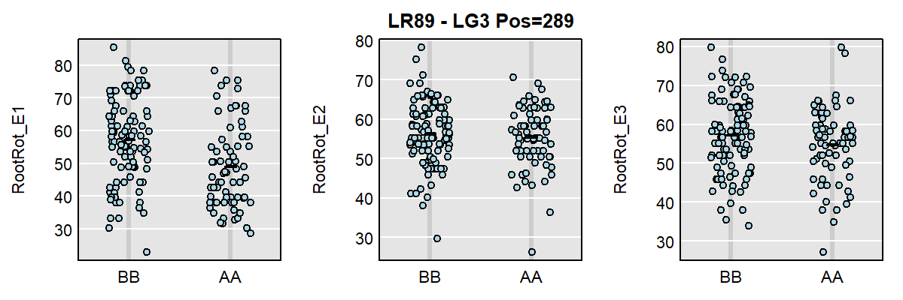

```{r results="hide"}
# Prep data
xx <- maxmarg(pr, map, chr = "LG3", pos = 289, return_char = T)
# Plot
png("qtl_tutorial_LR89_03.png", width = 1200, height = 400, res = 200)
par(mfrow = c(1,3), mar=c(2,4,2,1))
plot_pxg(xx, myQTL$pheno[,"RootRot_E1"], ylab = "RootRot_E1")
plot_pxg(xx, myQTL$pheno[,"RootRot_E2"], ylab = "RootRot_E2", main = "LR89 - LG3 Pos=289")
plot_pxg(xx, myQTL$pheno[,"RootRot_E3"], ylab = "RootRot_E3")
dev.off()
```

---

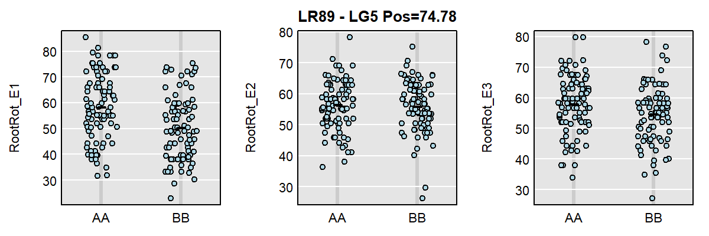

```{r results="hide"}
# Prep data
xx <- maxmarg(pr, map, chr = "LG5", pos = 74.78, return_char = T)
# Plot
png("qtl_tutorial_LR89_04.png", width = 1200, height = 400, res = 200)
par(mfrow = c(1,3), mar=c(2,4,2,1))
plot_pxg(xx, myQTL$pheno[,"RootRot_E1"], ylab = "RootRot_E1")
plot_pxg(xx, myQTL$pheno[,"RootRot_E2"], ylab = "RootRot_E2", main = "LR89 - LG5 Pos=74.78")
plot_pxg(xx, myQTL$pheno[,"RootRot_E3"], ylab = "RootRot_E3")
dev.off()
```

---

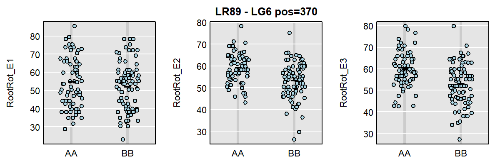

```{r results="hide"}
# Prep data
xx <- maxmarg(pr, map, chr = "LG6", pos = 370, return_char = T)
# Plot
png("qtl_tutorial_LR89_05.png", width = 1200, height = 400, res = 200)
par(mfrow = c(1,3), mar=c(2,4,2,1))
plot_pxg(xx, myQTL$pheno[,"RootRot_E1"], ylab = "RootRot_E1")
plot_pxg(xx, myQTL$pheno[,"RootRot_E2"], ylab = "RootRot_E2", main = "LR89 - LG6 pos=370")
plot_pxg(xx, myQTL$pheno[,"RootRot_E3"], ylab = "RootRot_E3")
dev.off()
```

---

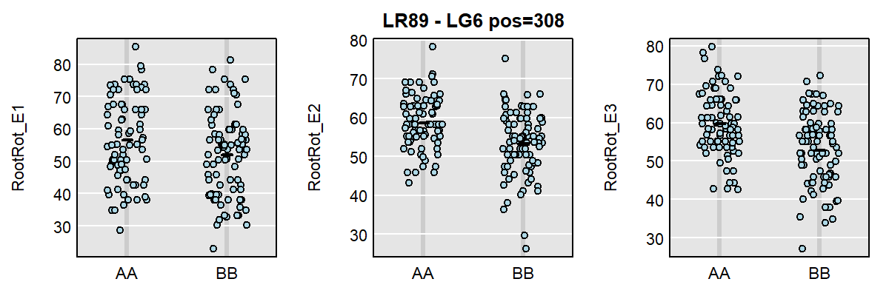

```{r results="hide"}
# Prep data
xx <- maxmarg(pr, map, chr = "LG6", pos = 308, return_char = T)
# Plot
png("qtl_tutorial_LR89_06.png", width = 1200, height = 400, res = 200)
par(mfrow = c(1,3), mar=c(2,4,2,1))
plot_pxg(xx, myQTL$pheno[,"RootRot_E1"], ylab = "RootRot_E1")
plot_pxg(xx, myQTL$pheno[,"RootRot_E2"], ylab = "RootRot_E2", main = "LR89 - LG6 pos=308")
plot_pxg(xx, myQTL$pheno[,"RootRot_E3"], ylab = "RootRot_E3")
dev.off()
```

---

## Estimated QTL effects

### LG3


```{r results="hide"}
# Prep data
myColors2 <- c("slateblue", "violetred")
myLims <- c(-4.4,4.4)
# Plot
png("qtl_tutorial_LR89_07.png", width = 600, height = 1200, res = 200)
par(mfrow = c(3,1), mar = c(4,4,2,2.5))
c2eff <- scan1coef(pr[,"LG3"], myQTL$pheno[,"RootRot_E1"])
plot(c2eff, map["LG3"], columns = 1:2, col = myColors2, 
     ylim = myLims, main = "LR89 RootRot_E1")
last_coef <- unclass(c2eff)[nrow(c2eff),] 
for(i in 1:2) { 
  axis(side = 4, at = last_coef[i], names(last_coef)[i], 
       tick = F, col.axis = myColors2[i]) 
}
c2eff <- scan1coef(pr[,"LG3"], myQTL$pheno[,"RootRot_E2"])
plot(c2eff, map["LG3"], columns = 1:2, col = myColors2, 
     ylim = myLims, main = "LR89 RootRot_E2")
last_coef <- unclass(c2eff)[nrow(c2eff),] 
for(i in 1:2) { 
  axis(side = 4, at = last_coef[i], names(last_coef)[i], 
       tick = F, col.axis = myColors2[i]) 
}
c2eff <- scan1coef(pr[,"LG3"], myQTL$pheno[,"RootRot_E3"])
plot(c2eff, map["LG3"], columns = 1:2, col = myColors2, 
     ylim = myLims, main = "LR89 RootRot_E3")
last_coef <- unclass(c2eff)[nrow(c2eff),] 
for(i in 1:2) { 
  axis(side = 4, at = last_coef[i], names(last_coef)[i], 
       tick = F, col.axis = myColors2[i]) }
dev.off()
```

---

### LG5


```{r results="hide"}
# Prep data
myLims <- c(-4.3,4.3)
# Plot
png("qtl_tutorial_LR89_08.png", width = 600, height = 1200, res = 200)
par(mfrow = c(3,1), mar = c(4,4,2,2.5))
c2eff <- scan1coef(pr[,"LG5"], myQTL$pheno[,"RootRot_E1"])
plot(c2eff, map["LG5"], columns = 1:2, col = myColors2, 
     ylim = myLims, main = "LR89 RootRot_E1")
last_coef <- unclass(c2eff)[nrow(c2eff),]
for(i in 1:2) { 
  axis(side = 4, at = last_coef[i], names(last_coef)[i], 
       tick = F, col.axis = myColors2[i]) 
}
c2eff <- scan1coef(pr[,"LG5"], myQTL$pheno[,"RootRot_E2"])
plot(c2eff, map["LG5"], columns = 1:2, col = myColors2, 
     ylim = myLims, main = "LR89 RootRot_E2")
last_coef <- unclass(c2eff)[nrow(c2eff),]
for(i in 1:2) { 
  axis(side = 4, at = last_coef[i], names(last_coef)[i], 
       tick = F, col.axis = myColors2[i]) 
}
c2eff <- scan1coef(pr[,"LG5"], myQTL$pheno[,"RootRot_E3"])
plot(c2eff, map["LG5"], columns = 1:2, col = myColors2, 
     ylim = myLims, main = "LR89 RootRot_E3")
last_coef <- unclass(c2eff)[nrow(c2eff),] 
for(i in 1:2) { 
  axis(side = 4, at = last_coef[i], names(last_coef)[i], 
       tick = F, col.axis = myColors2[i]) 
}
dev.off()
```

---

### LG6


```{r results="hide"}
# Prep data
myLims <- c(-4.2,4.2)
# Plot
png("qtl_tutorial_LR89_09.png", width = 600, height = 1200, res = 200)
par(mfrow = c(3,1), mar = c(4,4,2,2.5))
c2eff <- scan1coef(pr[,"LG6"], myQTL$pheno[,"RootRot_E1"])
plot(c2eff, map["LG6"], columns = 1:2, col = myColors2, 
     ylim = myLims, main = "LR89 RootRot_E1")
last_coef <- unclass(c2eff)[nrow(c2eff),] 
for(i in 1:2) { 
  axis(side = 4, at = last_coef[i], names(last_coef)[i],
       tick = F, col.axis = myColors2[i]) 
}
c2eff <- scan1coef(pr[,"LG6"], myQTL$pheno[,"RootRot_E2"])
plot(c2eff, map["LG6"], columns = 1:2, col = myColors2, 
     ylim = myLims, main = "LR89 RootRot_E2")
last_coef <- unclass(c2eff)[nrow(c2eff),] 
for(i in 1:2) { 
  axis(side = 4, at = last_coef[i], names(last_coef)[i], 
       tick = F, col.axis = myColors2[i]) 
}
c2eff <- scan1coef(pr[,"LG6"], myQTL$pheno[,"RootRot_E3"])
plot(c2eff, map["LG6"], columns = 1:2, col = myColors2, 
     ylim = myLims, main = "LR89 RootRot_E3")
last_coef <- unclass(c2eff)[nrow(c2eff),] 
for(i in 1:2) { 
  axis(side = 4, at = last_coef[i], names(last_coef)[i], 
       tick = F, col.axis = myColors2[i]) 
}
dev.off()
```

---

## Custom Plotting

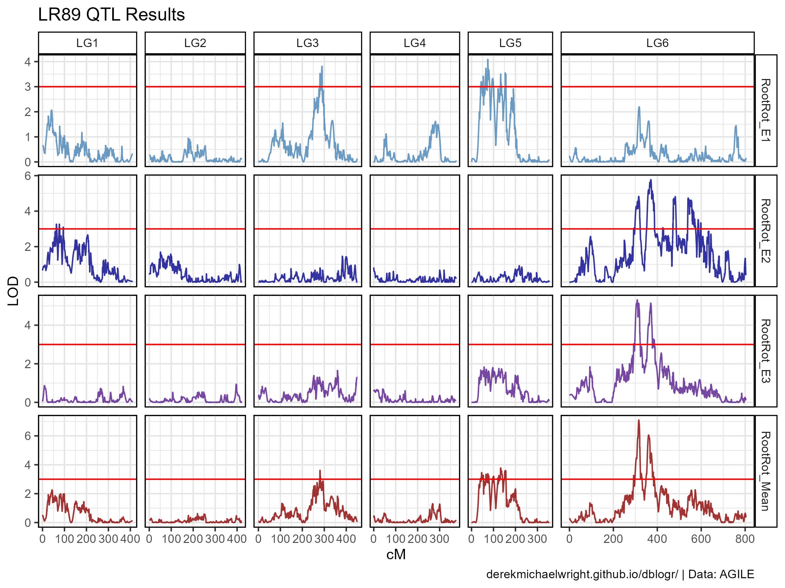

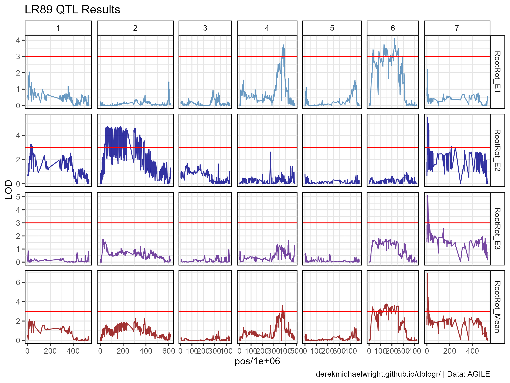

```{r}
# Create function to map positions of pseudomarkers
fill_psuedos <- function(xx, step = 1) {
  for(i in 1:nrow(xx)) {
    if(is.na(xx$lg[i])) { 
      xx$lg[i] <- xx$lg[i-1]
      xx$cM[i] <- xx$cM[i-1] + step
    }
  }
  xx
}
# Prep data
x_pheno <- read.csv("input_LR89/LR89_Pheno.csv")
x_gmap <- read.csv("input_LR89/LR89_gmap.csv")
xx <- out %>% as.data.frame() %>% 
  rownames_to_column(var = "marker") %>%
  left_join(x_gmap, by = "marker") %>%
  select(marker, lg, cM, everything()) %>%
  fill_psuedos() %>%
  gather(trait, value, 4:ncol(.)) %>%
  mutate(trait = factor(trait, levels = myTraits),
         chr = substr(marker, 13, 13),
         pos = substr(marker, regexpr("p",marker)+1, nchar(marker)),
         pos = as.numeric(pos))
# Plot
mp <- ggplot(xx, aes(x = cM, y = value, color = trait)) + 
  geom_line(alpha = 0.8) +
  geom_hline(yintercept = 3, color = "red") +
  facet_grid(trait ~ lg, scales = "free", space = "free_x") +
  scale_color_manual(values = myColors) +
  theme_gwaspr() + 
  labs(title = "LR89 QTL Results", y = "LOD", caption = myCaption)
ggsave("qtl_tutorial_LR89_10.png", mp, width = 8, height = 6)
mp <- ggplot(xx %>% filter(!is.na(pos)), 
             aes(x = pos/1000000, y = value, color = trait)) + 
  geom_line(alpha = 0.8) +
  geom_hline(yintercept = 3, color = "red") +
  facet_grid(trait ~ chr, scales = "free", space = "free_x") +
  scale_color_manual(values = myColors) +
  theme_gwaspr() +
  labs(title = "LR89 QTL Results", y = "LOD", caption = myCaption)
ggsave("qtl_tutorial_LR89_11.png", mp, width = 8, height = 6)
```

```{r eval = F, echo = F}
#
xx  <- read.csv("input_LR89/LR89_geno.csv") %>%
  select(Name, Lcu.2RBY.Chr7p4197838) %>%
  left_join(x_pheno, by = "Name")
mp <- ggplot(xx, aes(x = Lcu.2RBY.Chr7p4197838, y = Root.Rot)) +
  geom_violin() +
  geom_boxplot(width = 0.1) +
  geom_quasirandom() +
  theme_gwaspr() +
  labs(caption = myCaption)
ggsave("qtl_tutorial_LR89_12.png", mp, width = 6, height = 4)
```

---

## Prep data

The original data was not properly formatted for running the QTL analysis. The following is the code I used to take the original files and format them to be used by `qtl2`.

```{r}
# Prep genotype data
xx <- read.table("rawdata/LR-89 original genotyping matrix.txt") %>% 
  t() %>% as.data.frame()
colnames(xx) <- xx[1,]
xx <- xx %>% rename(Id=Pos) %>%
  slice(-1) %>%
  mutate(Id = substr(Id, regexpr("\\|", Id)+1, nchar(Id)),
         Id = gsub("-0|-00","-", Id))
write.csv(xx, "input_LR89/LR89_geno.csv", row.names = F)
# Prep genotype map
xx <- readxl::read_xlsx("rawdata/LR-89_Input-221101.xlsx", "LinkageMap", col_names = F)
colnames(xx) <- c("marker", "lg", "cM")
xx <- xx %>% mutate(lg = paste0("LG", lg))
write.csv(xx, "input_LR89/LR89_gmap.csv", row.names = F)
# Prep phenotype data
#xx <- readxl::read_xlsx("rawdata/LR-89 phenotypic data means.xlsx") %>%
#  rename(Name=name, Root.Rot=Mean)
xx <- readxl::read_xlsx("rawdata/20221202_means of repeats and combined.xlsx") %>%
  select(Id=RIL, RootRot_E1=Exp1, RootRot_E2=Exp2, RootRot_E3=Exp3, RootRot_Mean=Combined)
write.csv(xx, "input_LR89/LR89_pheno.csv", row.names = F)
```

---

# iron example

```{r}
iron <- read_cross2(system.file("extdata", "iron.zip", package="qtl2"))
map <- insert_pseudomarkers(iron$gmap, step = 1)
pr <- calc_genoprob(iron, map, error_prob = 0.002)
Xcovar <- get_x_covar(iron)
out <- scan1(pr, iron$pheno, Xcovar = Xcovar)
par(mar=c(5.1, 4.1, 1.1, 1.1))
ymx <- maxlod(out) # overall maximum LOD score
plot(out, map, lodcolumn = 1, col = "slateblue", ylim = c(0,ymx*1.02))
plot(out, map, lodcolumn = 2, col = "violetred", add = T)
legend("topleft", lwd = 2, col = c("slateblue", "violetred"), 
       colnames(out), bg = "gray90")
```

---
