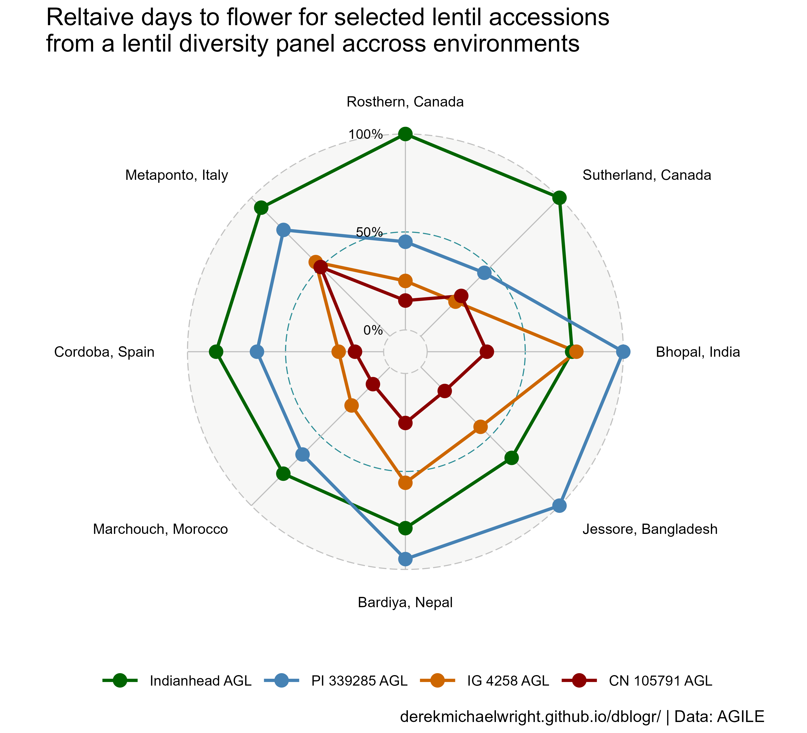

```{r setup, include=FALSE}
knitr::opts_chunk$set(echo = T, message = F, warning = F)
```

---

# Data

```{r echo = F}
downloadthis::download_link(
  link = "data_radar_plots.csv",
  button_label = "data_radar_plots.csv",
  button_type = "success",
  has_icon = TRUE,
  icon = "fa fa-save",
  self_contained = FALSE
)
```

```{r}
# devtools::install_github("derekmichaelwright/agData")
library(agData)
# devtools::install_github("ricardo-bion/ggradar")
library(ggradar)
```

```{r echo = F, eval = F}
x1 <- read.csv("https://raw.githubusercontent.com/derekmichaelwright/AGILE_LDP_Phenology/master/data/data_pca_results.csv") %>%
  select(Name, Cluster)
x2 <- read.csv("https://raw.githubusercontent.com/derekmichaelwright/AGILE_LDP_Phenology/master/data/data_raw.csv") %>%
  filter(Year == 2017) %>%
  group_by(Entry, Name, Location) %>%
  summarise(DTF = round(mean(DTF2, na.rm = T))) %>%
  ungroup() %>% 
  #left_join(x1, by = "Name") %>%
  select(-Entry) %>%
  select(Name, Location, DTF)
write.csv(x2, "data_radar_plots.csv", row.names = F)
```

---

# Prepare Data

```{r}
# Prep data
myLocs <- c("Rosthern, Canada", "Sutherland, Canada",  
            "Bhopal, India", "Jessore, Bangladesh", "Bardiya, Nepal",
            "Marchouch, Morocco", "Cordoba, Spain", "Metaponto, Italy" )
dd <- read.csv("data_radar_plots.csv") %>%
  mutate(Location = factor(Location, levels = myLocs))
```

---

# DTF by Genotypes



```{r}
# Prep data
myNames <- c("PI 320953 LSP AGL", "Indianhead AGL", "PI 339285 AGL", 
             "IG 4258 AGL", "CN 105791 AGL", "ILL 5888 AGL")
xx <- dd %>%
  group_by(Location) %>%
  mutate(DTF = scales::rescale(DTF)) %>%
  spread(Location, DTF) %>%
  filter(Name %in% myNames) %>%
  mutate(Name = factor(Name, levels = myNames))
DT::datatable(xx)
# Plot
myTitle <- "Reltaive days to flower for selected lentil accessions\nfrom a lentil diversity panel accross environments"
mp <- ggradar(xx, plot.title = myTitle, legend.position = "bottom")
ggsave("radar_plots_01.png", mp, width = 11, height = 10)
```

```{r echo = F}
ggsave("featured.png", mp, width = 11, height = 10)
```

---

# PDF

```{r echo = F}
downloadthis::download_link(
  link = "radar_plots.pdf",
  button_label = "radar_plots.pdf",
  button_type = "success",
  has_icon = TRUE,
  icon = "fa fa-save",
  self_contained = FALSE
)
```

```{r results="hide"}
# Prep data
xx <- read.csv("data_radar_plots.csv") %>%
  group_by(Location) %>%
  mutate(DTF = scales::rescale(DTF)) %>%
  spread(Location, DTF) %>%
  mutate_at(vars(-Name), scales::rescale)
# PDF 
pdf("radar_plots.pdf", width = 11, height = 10)
for(i in unique(xx$Name)) {
    xi <- xx %>% filter(Name == i)
    mp <- ggradar(xi) 
    print(mp, plot.title = i)
}
dev.off()
```

---

```{r echo = F, eval = F}
radarArea <- function(data) {
  vals <- data[, -1, drop=FALSE] # assume the first column is the ID
  first <- 1:ncol(vals)
  second <- c(first[-1], first[1])
  Reduce(`+`, Map(function(i, j) vals[,i] * vals[,j], first, second))/2 * sin(2*pi/ncol(vals))
}
# Prep data
xx <- dd %>%
  group_by(Location) %>%
  mutate(DTF = scales::rescale(DTF)) %>%
  spread(Location, DTF) %>%
  ungroup() %>%
  mutate(RadarArea = radarArea(.))
# Plot
mp <- ggplot(xx, aes(x = RadarArea)) +
  geom_histogram()
ggsave("radar_plots_02.png", mp, width = 11, height = 10)
```

```{r  echo = F, eval = F}
# Prep data
xx <- dd %>%
  group_by(Cluster, Location) %>%
  summarise(DTF = mean(scales::rescale(DTF))) %>%
  spread(Location, DTF)
  
DT::datatable(xx)
# Plot
myTitle <- "Reltaive days to flower for selected lentil accessions\nfrom a lentil diversity panel accross environments"
mp <- ggradar(xx, plot.title = myTitle, legend.position = "bottom")
ggsave("radar_plots_02.png", mp, width = 11, height = 10)
```
