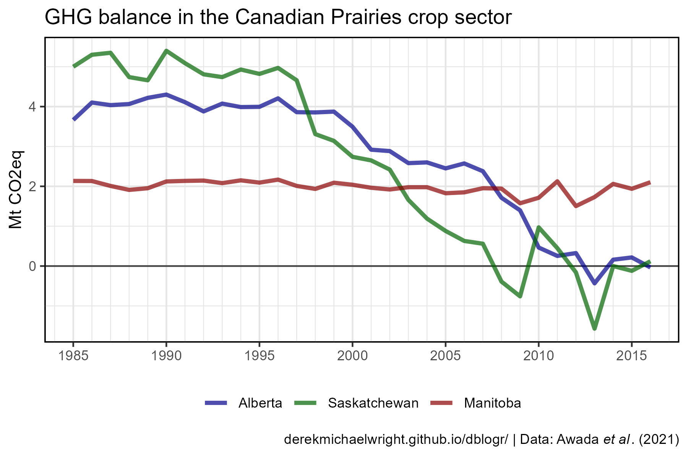
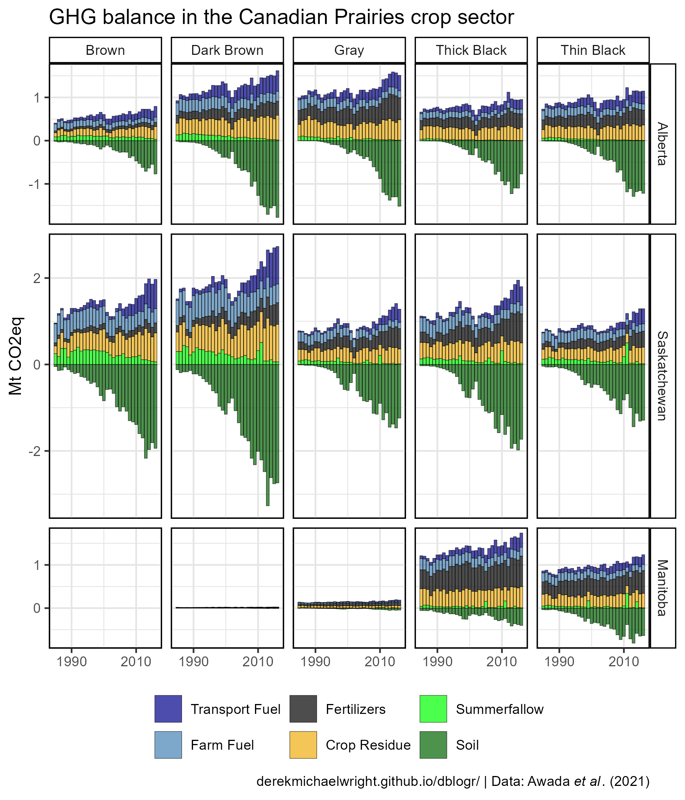
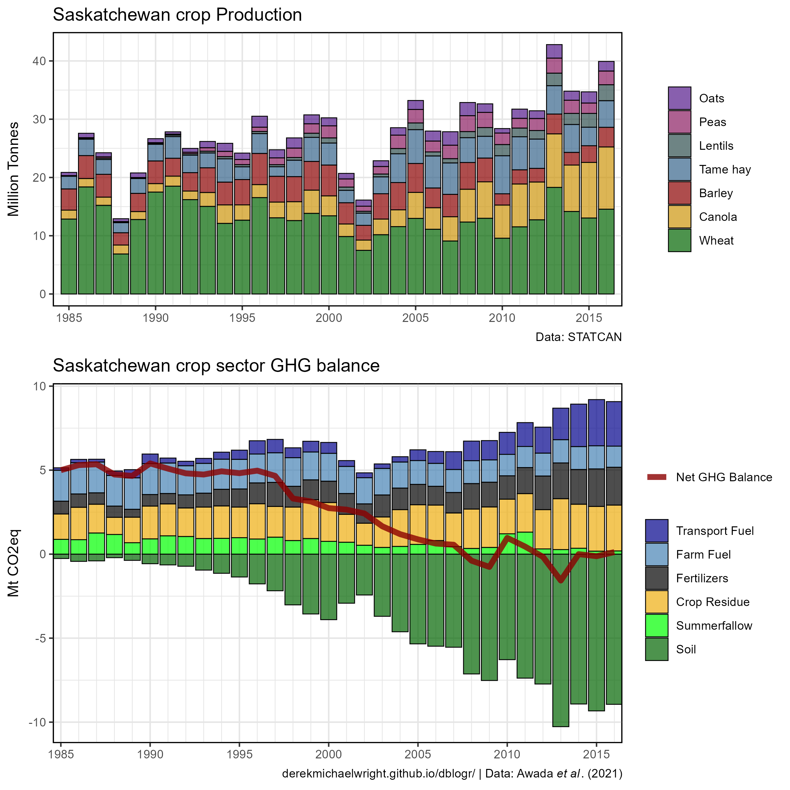
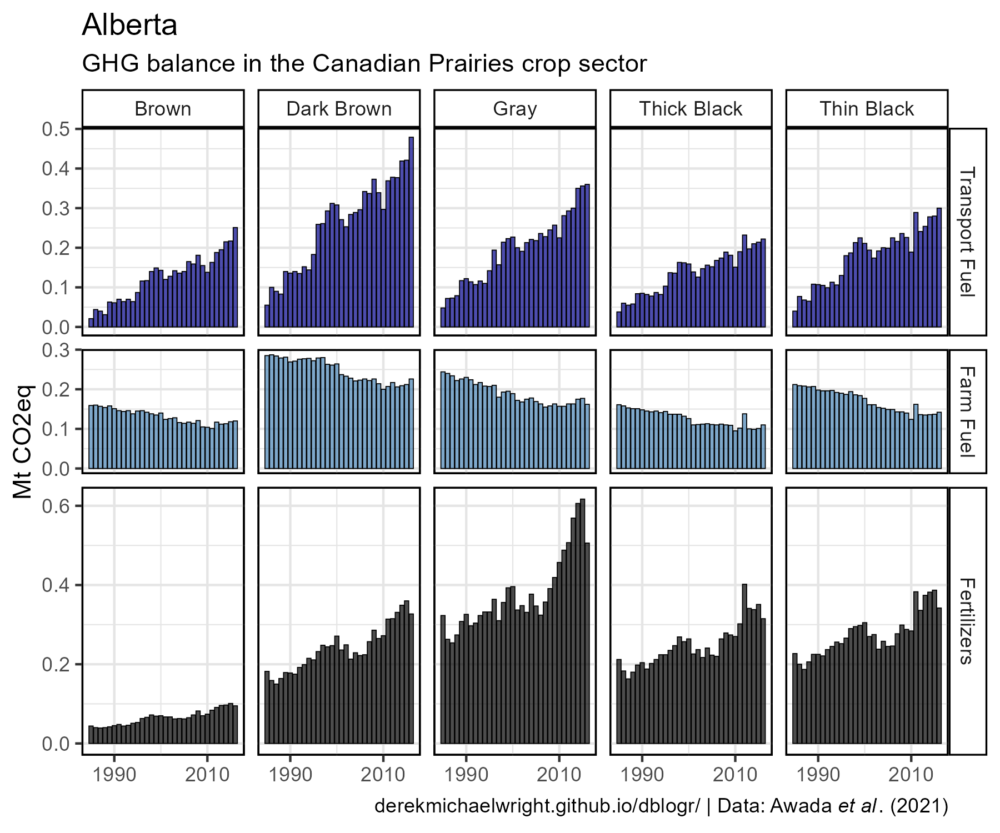
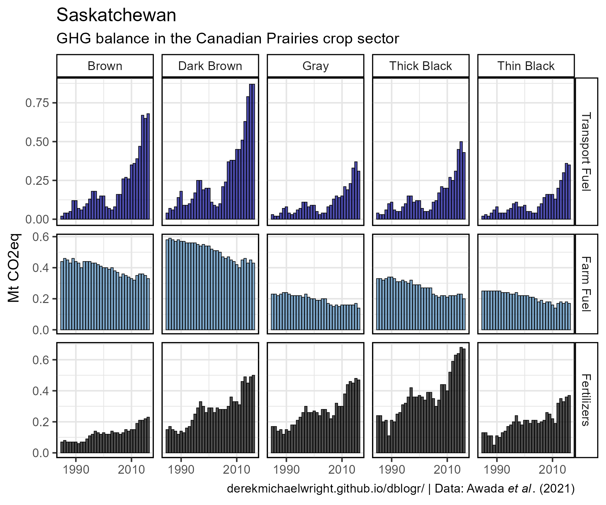
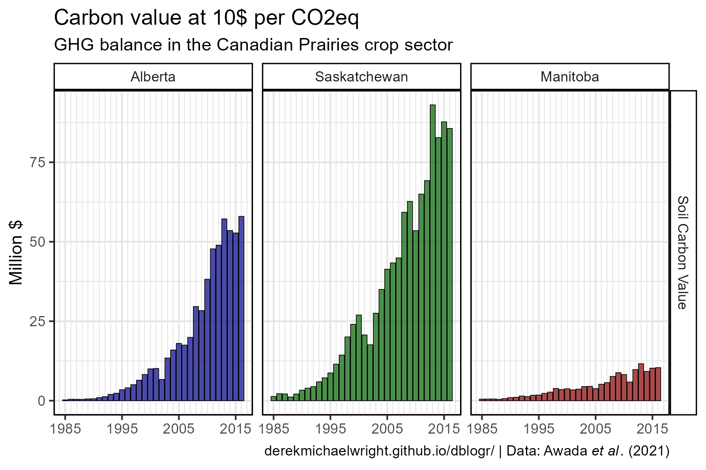
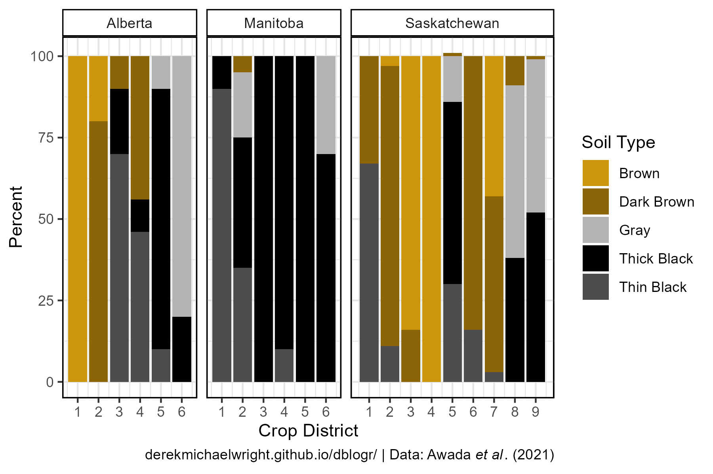

```{r setup, include=FALSE}
knitr::opts_chunk$set(echo = T, message = F, warning = F)
```

---

# Data

Awada, L., Nagy, C. and Phillips, P.W. (2021) **Contribution of land use practices to GHGs in the Canadian Prairies crop sector**. *PloS one*. 16(12): p.e0260946.

> - `r shiny::icon("globe")` [https://journals.plos.org/plosone/article?id=10.1371/journal.pone.0260946](https://journals.plos.org/plosone/article?id=10.1371/journal.pone.0260946){target="_blank"}
> - `r shiny::icon("save")` [journal.pone.0260946.s002.docx](journal.pone.0260946.s002.docx){target="_blank"}
> - `r shiny::icon("save")` [data_soil_carbon.xlsx](data_soil_carbon.xlsx)

```{r class.source = "fold-show"}
# devtools::install_github("derekmichaelwright/agData")
library(agData)
library(readxl)
```

---

# Prepare Data

```{r}
# Prep data
myCaption <- expression(paste("derekmichaelwright.github.io/dblogr/ | Data: Awada ", 
                               italic("et al"), ". (2021)"))
myMeasures <- c("Net GHG Balance", "Transport Fuel", "Farm Fuel", 
                "Fertilizers", "Crop Residue", "Summerfallow", "Soil")
myAreas <- c("Alberta", "Saskatchewan", "Manitoba")
myColors1 <- c("darkblue", "steelblue", "black", "darkgoldenrod2", "green", "darkgreen")
myColors2 <- c("darkblue", "darkgreen", "darkred")
myColors3 <- c("darkgoldenrod3", "darkgoldenrod4", "grey70", "black", "grey30")
#
d1 <- bind_rows(
    read_xlsx("data_soil_carbon.xlsx", "GHG Balance"),
    read_xlsx("data_soil_carbon.xlsx", "Soil"),
    read_xlsx("data_soil_carbon.xlsx", "Summerfallow"),
    read_xlsx("data_soil_carbon.xlsx", "Crop Residue"),
    read_xlsx("data_soil_carbon.xlsx", "Transport Fuel"),
    read_xlsx("data_soil_carbon.xlsx", "Farm Fuel"),
    read_xlsx("data_soil_carbon.xlsx", "Fertilizers") ) %>%
  mutate(Area = factor(Area, levels = myAreas),
         Measurement = factor(Measurement, levels = myMeasures))
#
x1 <- d1 %>% filter(Measurement == myMeasures[7]) %>%
  mutate(Measurement = "Soil Capture")
x2 <- d1 %>% filter(Measurement %in% myMeasures[2:6]) %>% 
  group_by(Year, Area, Unit) %>%
  summarise_at(vars(All,Brown,`Dark Brown`,`Thin Black`,`Thick Black`,Gray), 
               funs(sum), na.rm = T) %>%
  mutate(Measurement = "Production Emissions")
d2 <- bind_rows(x1, x2)
#
d3 <- bind_rows(
    read_xlsx("data_soil_carbon.xlsx", "GHG Value"),
    read_xlsx("data_soil_carbon.xlsx", "Soil Value") ) %>%
  mutate(Area = factor(Area, levels = myAreas))
#
d4 <- read_xlsx("data_soil_carbon.xlsx", "Soil Types") %>% 
  gather(`Soil Type`, Percent, 3:7) %>%
  mutate(Percent = Percent * 100)
```

---

# Net GHG Balance



```{r}
# Prep data
xx <- d1 %>% filter(Measurement == "Net GHG Balance")
# Plot
mp <- ggplot(xx, aes(x = Year, y = All, color = Area)) +
  geom_hline(yintercept = 0, alpha = 0.7) +
  geom_line(size = 1.25, alpha = 0.7) +
  scale_color_manual(name = NULL, values = myColors2) +
  scale_x_continuous(breaks = seq(1985, 2015, by = 5),
                     minor_breaks = 1980:2020) +
  theme_agData(legend.position = "bottom",
               plot.caption = ) +
  labs(title = "GHG balance in the Canadian Prairies crop sector", 
       y = "Mt CO2eq", x = NULL, caption = myCaption)
ggsave("soil_carbon_01.png", mp, width = 6, height = 4)
```

---

# Production Emissions vs Soil Capture {.tabset .tabset-pills}

## Prairies


```{r}
mp <- ggplot(d2, aes(x = Year, y = All, fill = Measurement)) +
  geom_col(position = "stack", color = alpha("black",0.7), alpha = 0.7) +
  scale_fill_manual(name = NULL, values = c("darkgoldenrod2", "darkgreen")) +
  scale_x_continuous(breaks = seq(1985, 2015, by = 5),
                     minor_breaks = 1980:2020) +
  facet_grid(Area ~ ., scales = "free_y", space = "free_y") +
  theme_agData(legend.position = "bottom") +
  labs(title = "GHG balance in the Canadian Prairies crop sector", 
       y = "Mt CO2eq", x = NULL, caption = myCaption)
ggsave("soil_carbon_02.png", mp, width = 6, height = 7)
```

---

## Saskatchewan


```{r}
# Prep data
xx <- d2 %>% filter(Area == "Saskatchewan")
# Plot
mp <- ggplot(xx, aes(x = Year, y = All, fill = Measurement)) +
  geom_col(position = "stack", color = alpha("black",0.7), alpha = 0.7) +
  scale_fill_manual(name = NULL, values = c("darkgoldenrod2", "darkgreen")) +
  scale_x_continuous(breaks = seq(1985, 2015, by = 5),
                     minor_breaks = 1980:2020) +
  facet_grid(Area ~ ., scales = "free_y", space = "free_y") +
  theme_agData(legend.position = "bottom") +
  labs(title = "GHG balance in the Canadian Prairies crop sector", 
       y = "Mt CO2eq", x = NULL, caption = myCaption)
ggsave("soil_carbon_03.png", mp, width = 6, height = 4)
```

---

# CO2 Source {.tabset .tabset-pills}

## Provinces


```{r}
# Prep data
xx <- d1 %>% filter(Measurement != "Net GHG Balance")
# Plot
mp <- ggplot(xx, aes(x = Year, y = All, fill = Measurement)) +
  geom_col(position = "stack", color = "black", lwd = 0.3, alpha = 0.7) +
  scale_fill_manual(name = NULL, values = myColors1) +
  scale_x_continuous(breaks = seq(1985, 2015, by = 5),
                     minor_breaks = 1980:2020) +
  facet_grid(Area ~ ., scales = "free_y", space = "free_y") +
  theme_agData(legend.position = "bottom") +
  labs(title = "GHG balance in the Canadian Prairies crop sector", 
       y = "Mt CO2eq", x = NULL, caption = myCaption)
ggsave("soil_carbon_04.png", mp, width = 6, height = 7)
```

---

## Soil Types



```{r}
# Prep data
xx <- d1 %>% select(-All) %>%
  filter(Measurement != "Net GHG Balance") %>%
  gather(Soil, Value, 5:ncol(.))
# Plot
mp <- ggplot(xx, aes(x = Year, y = Value, fill = Measurement)) +
  geom_col(position = "stack", color = "black", lwd = 0.1, alpha = 0.7) +
  scale_fill_manual(name = NULL, values = myColors1) +
  scale_x_continuous(breaks = c(1990, 2010)) +
  facet_grid(Area ~ Soil, scales = "free_y", space = "free_y") +
  theme_agData(legend.position = "bottom") +
  labs(title = "GHG balance in the Canadian Prairies crop sector", 
       y = "Mt CO2eq", x = NULL, caption = myCaption)
ggsave("soil_carbon_05.png", mp, width = 6, height = 7)
```

---

# Saskatchewan



```{r}
# Prep data
x1 <- d1 %>% filter(Measurement != "Net GHG Balance", Area == "Saskatchewan")
x2 <- d1 %>% filter(Measurement == "Net GHG Balance", Area == "Saskatchewan")
myCrops <- c("Wheat","Canola","Barley","Tame hay","Lentils","Peas","Oats")
x3 <- agData_STATCAN_Crops %>% 
  filter(Area == "Saskatchewan", Item %in% myCrops,
         Year %in% 1985:2016, Measurement == "Production") %>%
  mutate(Item = factor(Item, levels = rev(myCrops)))
# Plot
mp1 <- ggplot(x3, aes(x = Year, y = Value / 1000000, fill = Item)) +
  geom_col(color = "black", lwd = 0.3, alpha = 0.7) +
  scale_fill_manual(name = NULL, values = agData_Colors[7:1]) +
  scale_x_continuous(breaks = seq(1985, 2015, by = 5),
                     minor_breaks = 1980:2020, expand = c(0.015,0)) +
  theme_agData() +
  labs(title = "Saskatchewan crop Production", 
       y = "Million Tonnes", x = NULL,
       caption = "Data: STATCAN")
mp2 <- ggplot(x1, aes(x = Year, y = All)) +
  geom_col(aes(fill = Measurement), position = "stack", color = "black", lwd = 0.3, alpha = 0.7) +
  geom_line(data = x2, aes(color = Measurement), alpha = 0.8, size = 2) +
  scale_fill_manual(name = NULL, values = myColors1) +
  scale_color_manual(name = NULL, values = "darkred") +
  scale_x_continuous(breaks = seq(1985, 2015, by = 5),
                     minor_breaks = 1980:2020, expand = c(0,0)) +
  theme_agData() +
  labs(title = "Saskatchewan crop sector GHG balance", 
       y = "Mt CO2eq", x = NULL, caption = myCaption)
mp <- ggarrange(mp1, mp2, ncol = 1, align = "v", heights = c(0.8,1))
ggsave("soil_carbon_06.png", mp, width = 8, height = 8)
```

```{r echo = F}
ggsave("featured.png", mp, width = 6, height = 7)
```

---

# Canola in SK


```{r}
# Prep data
myCaption2 <- expression(paste("\u00A9 derekmichaelwright.github.io/dblogr/  |  Data: STATCAN & Awada ", 
                               italic("et al"), ". (2021)"))
x1 <- d1 %>% filter(Measurement == "Net GHG Balance", Area == "Saskatchewan")
x2 <- agData_STATCAN_Crops %>% 
  filter(Area == "Saskatchewan", Item == "Canola",
         Year %in% 1985:2016, Measurement == "Area Harvested")
xx <- left_join(select(x1, Year, GHG=All),
                select(x2, Year, Canola=Value), by = "Year") %>%
  mutate(Group = ifelse(Year < 1998, "Before 1998", "After 1997"),
         Group = factor(Group, levels = c("Before 1998", "After 1997")))
# Plot
mp <- ggplot(xx, aes(x = Canola / 1000000, y = GHG, color = Group)) +
  geom_hline(yintercept = 0, alpha = 0.7) +
  geom_point(size = 2, alpha = 0.7) +
  stat_smooth(geom = "line", method = "lm", size = 1.5, alpha = 0.7) +
  scale_color_manual(name = NULL, values = c("darkgoldenrod2","darkgreen")) +
  theme_agData(legend.position = "bottom") +
  labs(y = "Net GHG Balance (mt CO2eq)", x = "Million Canola Hectares", 
       title = "Saskatchewan", caption = myCaption2)
ggsave("soil_carbon_07.png", mp, width = 6, height = 4)
```

---

# Fuel & Fertilizers


```{r}
# Prep data
xx <- d1 %>% 
  filter(Measurement %in% c("Transport Fuel", "Farm Fuel", "Fertilizers"))
# Plot
mp <- ggplot(xx, aes(x = Year, y = All, fill = Measurement)) +
  geom_col(position = "dodge", color = "black", lwd = 0.2, alpha = 0.7) +
  scale_fill_manual(name = NULL, values = myColors1[1:3]) +
  scale_x_continuous(breaks = seq(1985, 2015, by = 10)) +
  facet_grid(Area ~ Measurement, scales = "free_y", space = "free_y") +
  theme_agData(legend.position = "none") +
  labs(title = "GHG balance in the Canadian Prairies crop sector", 
       y = "Mt CO2eq", x = NULL, caption = myCaption)
ggsave("soil_carbon_08.png", mp, width = 6, height = 5)
```

---

# Soil vs. Fuel & Fertilizers {.tabset .tabset-pills}

## Alberta



```{r}
# Prep data
xx <- d1 %>% select(-All) %>%
  filter(Area == "Alberta",
         Measurement %in% c("Transport Fuel", "Farm Fuel", "Fertilizers")) %>%
  gather(Soil, Value, 5:ncol(.))
# Plot
mp <- ggplot(xx, aes(x = Year, y = Value, fill = Measurement)) +
  geom_col(position = "dodge", color = "black", lwd = 0.2, alpha = 0.7) +
  scale_fill_manual(name = NULL, values = myColors1[1:3]) +
  scale_x_continuous(breaks = c(1990, 2010)) +
  facet_grid(Measurement ~ Soil, scales = "free_y", space = "free_y") +
  theme_agData(legend.position = "none") +
  labs(subtitle = "GHG balance in the Canadian Prairies crop sector",
       title = "Alberta", y = "Mt CO2eq", x = NULL, caption = myCaption)
ggsave("soil_carbon_09.png", mp, width = 6, height = 5)
```

---

## Saskatchewan



```{r}
# Prep data
xx <- d1 %>% select(-All) %>%
  filter(Area == "Saskatchewan",
         Measurement %in% c("Transport Fuel", "Farm Fuel", "Fertilizers")) %>%
  gather(Soil, Value, 5:ncol(.))
# Plot
mp <- ggplot(xx, aes(x = Year, y = Value, fill = Measurement)) +
  geom_col(position = "dodge", color = "black", lwd = 0.2, alpha = 0.7) +
  scale_fill_manual(name = NULL, values = myColors1[1:3]) +
  scale_x_continuous(breaks = c(1990, 2010)) +
  facet_grid(Measurement ~ Soil, scales = "free_y", space = "free_y") +
  theme_agData(legend.position = "none") +
  labs(subtitle = "GHG balance in the Canadian Prairies crop sector",
       title = "Saskatchewan", y = "Mt CO2eq", x = NULL, caption = myCaption)
ggsave("soil_carbon_10.png", mp, width = 6, height = 5)
```

---

## Manitoba


```{r}
# Prep data
xx <- d1 %>% select(-All) %>%
  filter(Area == "Manitoba",
         Measurement %in% c("Transport Fuel", "Farm Fuel", "Fertilizers")) %>%
  gather(Soil, Value, 5:ncol(.))
# Plot
mp <- ggplot(xx, aes(x = Year, y = Value, fill = Measurement)) +
  geom_col(position = "dodge", color = "black", lwd = 0.2, alpha = 0.7) +
  scale_fill_manual(name = NULL, values = myColors1[1:3]) +
  scale_x_continuous(breaks = c(1990, 2010)) +
  facet_grid(Measurement ~ Soil, scales = "free_y", space = "free_y") +
  theme_agData(legend.position = "none") +
  labs(subtitle = "GHG balance in the Canadian Prairies crop sector",
       title = "Manitoba", y = "Mt CO2eq", x = NULL, caption = myCaption)
ggsave("soil_carbon_11.png", mp, width = 6, height = 5)
```

---

# Value {.tabset .tabset-pills}

## Net GHG Balance


```{r}
# Prep data
xx <- d3 %>% filter(Measurement == "Net GHG Balance Value")
# Plot
mp <- ggplot(xx, aes(x = Year, y = `10`, fill = Area)) +
  geom_col(position = "dodge", color = "black", lwd = 0.2, alpha = 0.7) +
  scale_fill_manual(name = NULL, values = myColors2) +
  scale_x_continuous(breaks = seq(1985, 2015, by = 10),
                     minor_breaks = 1980:2020) +
  facet_grid(Measurement ~ Area) +
  theme_agData(legend.position = "none") +
  labs(subtitle = "GHG balance in the Canadian Prairies crop sector",
       title = "Carbon value at 10$ per CO2eq", 
       y = "Million $", x = NULL, caption = myCaption)
ggsave("soil_carbon_12.png", mp, width = 6, height = 4)
```

---

## Soil Carbon



```{r}
# Prep data
xx <- d3 %>% filter(Measurement == "Soil Carbon Value")
# Plot
mp <- ggplot(xx, aes(x = Year, y = `10`, fill = Area)) +
  geom_col(position = "dodge", color = "black", lwd = 0.2, alpha = 0.7) +
  scale_fill_manual(name = NULL, values = myColors2) +
  scale_x_continuous(breaks = seq(1985, 2015, by = 10),
                     minor_breaks = 1980:2020) +
  facet_grid(Measurement ~ Area) +
  theme_agData(legend.position = "none") +
  labs(subtitle = "GHG balance in the Canadian Prairies crop sector",
       title = "Carbon value at 10$ per CO2eq", 
       y = "Million $", x = NULL, caption = myCaption)
ggsave("soil_carbon_13.png", mp, width = 6, height = 4)
```

---

# Soil Types



```{r}
# Plot
mp <- ggplot(d4, aes(x = `Crop District`, y = Percent, fill = `Soil Type`)) +
  geom_col(position = "stack") +
  facet_grid(. ~ Province, scales = "free_x", space = "free_x") +
  scale_fill_manual(values = myColors3) +
  scale_x_continuous(breaks = 1:9) +
  theme_agData() +
  labs(caption = myCaption)
ggsave("soil_carbon_14.png", mp, width = 6, height = 4)
```

---
