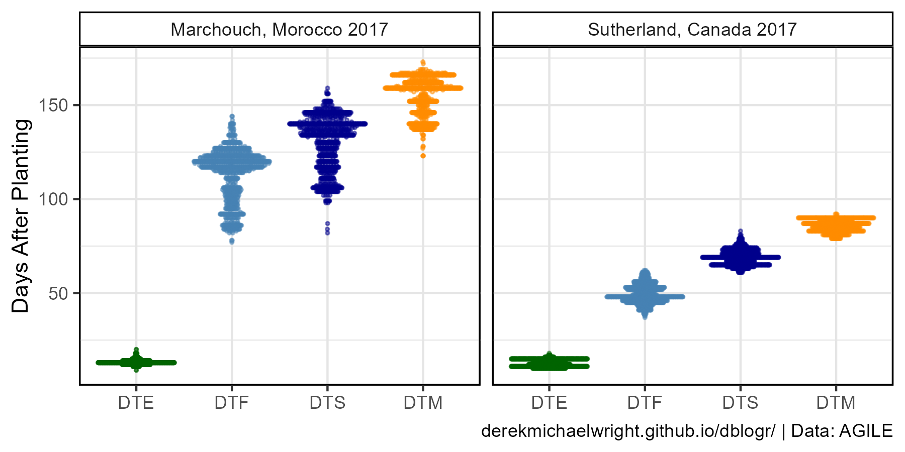
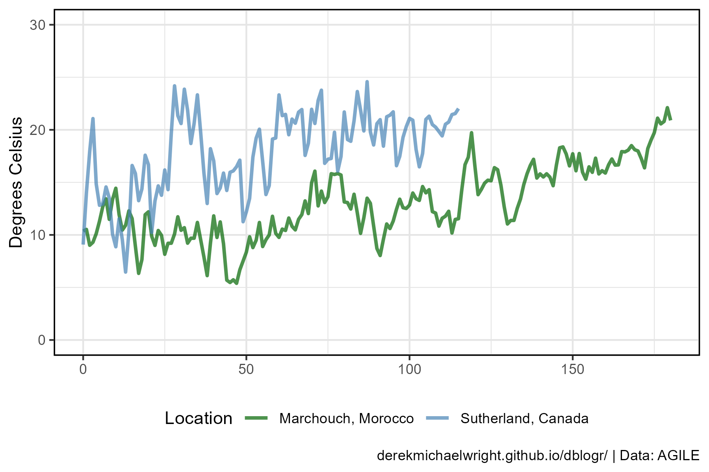
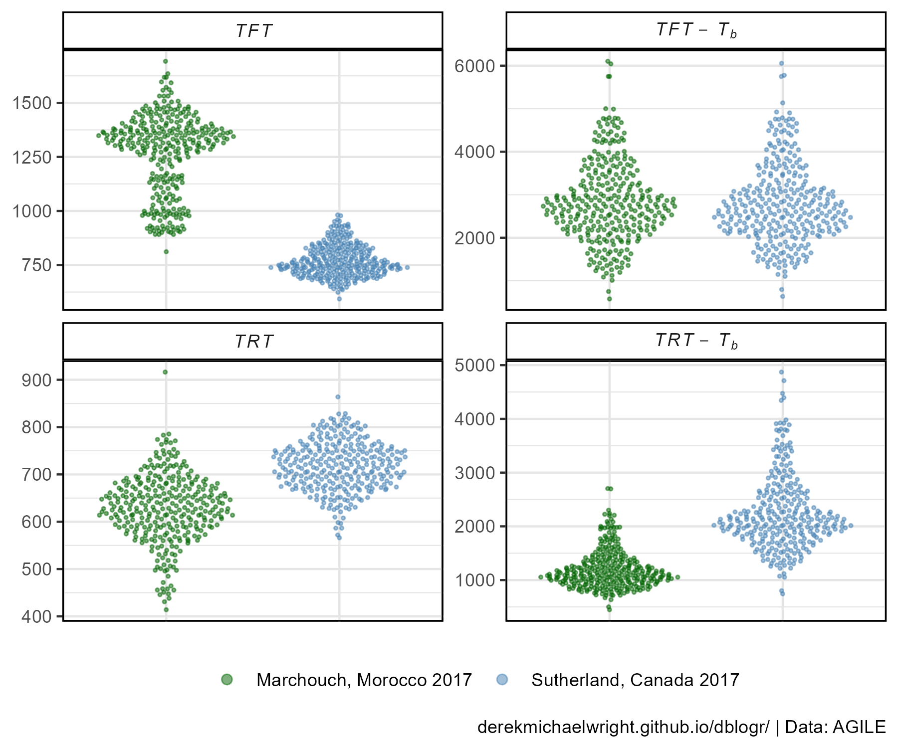

```{r setup, include = FALSE}
knitr::opts_chunk$set(echo = T, message = F, warning = F)
```

---

# Introduction

The purpose of this tutorial is to explain how to calculate thermal time and incorporate environmental data into a phenotype using <i class="fab fa-r-project"></i>. Traditionally this is know as **Growing Degree-Days** (**GDD**), a measure of heat accumulation and can be calculated in a couple different ways.

## Daily Measurements

$GDD = \sum (\overline{T} - T_b)$

or 

$GDD = \sum \frac{T_{max} + T_{min}}{2} - T_b$

where:

- $\overline{T}$ : average daily temperature
- $T_b$ : base temperature
- $T_{min}$ : min daily temperature
- $T_{max}$ : max daily temperature

## Average Temperature

$GDD = \int (\overline{T}-T_b)\Delta t$

where:

- $\overline{T}$ : average temperature over time period
- $T_b$ : base temperature
- $\Delta t$ : time period

---

# Data

The Data used in this tutorial are sourced from [**knowpulse.usask.ca/**](http://knowpulse.usask.ca/portal/){target="_blank"} and can be found in my [github repository](https://github.com/derekmichaelwright/AGILE_LDP_Phenology/tree/master/data){target="_blank"} for our [lentil phenology paper](https://nph.onlinelibrary.wiley.com/doi/10.1002/ppp3.10158){target="_blank"}. 

> - `r shiny::icon("save")` [data_ldp.csv](data_ldp.csv)
> - `r shiny::icon("save")` [Tb and Pc (data_tb_pc.csv)](https://github.com/derekmichaelwright/AGILE_LDP_Phenology/blob/master/data/data_tb_pc.csv){target="_blank"}
> - `r shiny::icon("save")` [data_env_sutherland_2017.csv](data_env_sutherland_2017.csv)
> - `r shiny::icon("save")` [data_env_morocco_2017.csv](data_env_morocco_2017.csv)

---

# Prepare Data

```{r class.source = "fold-show"}
# devtools::install_github("derekmichaelwright/agData")
library(agData)
```

```{r}
# Prep data
myCaption <- "derekmichaelwright.github.io/dblogr/ | Data: AGILE"
myColors <- c("darkgreen", "steelblue", "darkblue", "darkorange", "darkred", "purple4")
# Prep phenotype data
x1 <- read.csv("https://raw.githubusercontent.com/derekmichaelwright/AGILE_LDP_Phenology/master/data/data_raw.csv") %>%
  filter(Expt %in% c("Marchouch, Morocco 2017", "Sutherland, Canada 2017")) %>%
  select(Plot, Entry, Name, Rep, Expt, PlantingDate, DTE, DTF, DTS, DTM)
#
x2 <- read.csv("https://raw.githubusercontent.com/derekmichaelwright/AGILE_LDP_Phenology/master/data/data_tb_pc.csv") %>%
  filter(Expt %in% c("Marchouch, Morocco 2017", "Sutherland, Canada 2017")) %>%
  select(Entry, Name, Expt, Tb, Pc)
#
dd <- left_join(x1, x2, by = c("Entry", "Name", "Expt"))
write.csv(dd, "data_ldp.csv", row.names = F)
#
dd <- read.csv("data_ldp.csv")
dSu17 <- dd %>% filter(Expt == "Sutherland, Canada 2017")
dMo17 <- dd %>% filter(Expt == "Marchouch, Morocco 2017")
# Prep envdata
eSu17 <- read.csv("data_env_sutherland_2017.csv") %>%
  filter(Measurement == "Temperature") %>%
  mutate(DateTime = as.POSIXct(paste(Date, Time), 
                               format = "%Y-%m-%d %H:%M:%OS"))
eMo17 <- read.csv("data_env_morocco_2017.csv") %>%
  filter(Measurement == "Temperature") %>%
  mutate(DateTime = as.POSIXct(paste(Date, Time), 
                               format = "%Y-%m-%d %H:%M:%OS"))
```

---

# Plot Phenotype Data

We will be be using phenology data for a [Lentil Diversity Panel](https://derekmichaelwright.github.io/dblogr/academic/lentil_diversity_panel/){target="_blank"} grown in two different environments: Morocco and Canada.

- **DTE** : days from sowing to emergence
- **DTF** : days from sowing to flower
- **DTS** : days from sowing to swollen pod
- **DTM** : days from sowing to maturity



```{r}
# Prep data
xx <- dd %>% select(Name, Expt, DTE, DTF, DTS, DTM) %>%
  gather(Trait, Value, 3:ncol(.)) %>%
  mutate(Trait = factor(Trait, levels = c("DTE","DTF","DTS","DTM")))
# Plot
mp <- ggplot(xx, aes(x = Trait, y = Value, color = Trait)) +
  geom_quasirandom(alpha = 0.5, size = 0.5) +
  facet_grid(. ~ Expt) +
  scale_color_manual(values  = myColors) +
  theme_agData(legend.position = "none") +
  labs(x = NULL, y = "Days After Planting", caption = myCaption)
ggsave("thermal_time_01.png", mp, width = 6, height = 3)
```

---

# Plot Environmental Data


```{r}
# Prep data
xx <- bind_rows(eSu17, eMo17)
# Plot
mp <- ggplot(xx, aes(x = DateTime, y = Value, color = LoggerID)) +
  geom_line(alpha = 0.7) + ylim(c(0,45)) +
  facet_grid(. ~ Location, scales = "free_x", space = "free_x") +
  scale_color_manual(values  = myColors) +
  theme_agData(legend.position = "bottom") +
  labs(y = "Degrees Celsius", x = NULL, caption = myCaption)
ggsave("thermal_time_02.png", mp, width = 6, height = 4)
```

---

# Plot Daily Means



```{r}
# Calculate daily mean values
eSu17 <- eSu17 %>% group_by(Location, Year, Date, DAP) %>%
  summarise(Value = mean(Value, na.rm = T))
eMo17 <- eMo17 %>% group_by(Location, Year, Date, DAP) %>%
  summarise(Value = mean(Value, na.rm = T))
# Plot envdata
xx <- bind_rows(eSu17, eMo17)
mp <- ggplot(xx, aes(x = DAP, y = Value, color = Location)) +
  geom_line(size = 1, alpha = 0.7) + ylim(c(0,30)) +
  scale_color_manual(values  = myColors) +
  theme_agData(legend.position = "bottom") +
  labs(y = "Degrees Celsius", x = NULL, caption = myCaption)
ggsave("thermal_time_03.png", mp, width = 6, height = 4)
```

---

# Calculate Thermal Time

for this example we will calculate 2 different types of **GDD**:

- ***TFT*** : Thermal Flowering Time, the period from sowing to flowering.
- ***TRT*** : Thermal Reproductive Time, the period from flowering to maturity.

## Sutherland 2017

```{r}
# Calulate TFT
for(i in unique(dSu17$Plot)) {
  xi <- eSu17 %>% filter(DAP < dSu17$DTF[dSu17$Plot==i])
  dSu17$TFT[dSu17$Plot==i] <- ifelse(sum(xi$Value) == 0, NA, sum(xi$Value))
}
# Calulate TFT with Tb
for(i in unique(dSu17$Plot)) {
  tbi <- dSu17 %>% filter(Plot == i) %>% pull(Tb)
  xi <- eSu17 %>% filter(DAP < dSu17$DTF[dSu17$Plot==i])
  dSu17$TFT_Tb[dSu17$Plot==i] <- ifelse(sum(xi$Value) == 0, NA, sum(xi$Value - tbi))
}
# Calulate TRT
for(i in unique(dSu17$Plot)) {
  xi <- eSu17 %>% 
    filter(DAP >= dSu17$DTF[dSu17$Plot==i], DAP < dSu17$DTM[dSu17$Plot==i])
  dSu17$TRT[dSu17$Plot==i] <- ifelse(sum(xi$Value) == 0, NA, sum(xi$Value))
}
# Calulate TRT with Tb
for(i in unique(dSu17$Plot)) {
  tbi <- dSu17 %>% filter(Plot == i) %>% pull(Tb)
  xi <- eSu17 %>% 
    filter(DAP >= dSu17$DTF[dSu17$Plot==i], DAP < dSu17$DTM[dSu17$Plot==i])
  dSu17$TRT_Tb[dSu17$Plot==i] <- ifelse(sum(xi$Value) == 0, NA, sum(xi$Value - tbi))
}
```

## Morocco 2017

```{r}
# Calulate TFT
    for(i in unique(dMo17$Plot)) {
  xi <- eMo17 %>% filter(DAP < dMo17$DTF[dMo17$Plot==i])
  dMo17$TFT[dMo17$Plot==i] <- ifelse(sum(xi$Value) == 0, NA, sum(xi$Value))
}
# Calulate TFT with Tb
for(i in unique(dMo17$Plot)) {
  tbi <- dMo17 %>% filter(Plot == i) %>% pull(Tb)
  xi <- eMo17 %>% filter(DAP < dMo17$DTF[dMo17$Plot==i])
  dMo17$TFT_Tb[dMo17$Plot==i] <- ifelse(sum(xi$Value) == 0, NA, sum(xi$Value - tbi))
}
# Calulate TRT
for(i in unique(dMo17$Plot)) {
  xi <- eMo17 %>% 
    filter(DAP >= dMo17$DTF[dMo17$Plot==i], DAP < dMo17$DTM[dMo17$Plot==i])
  dMo17$TRT[dMo17$Plot==i] <- ifelse(sum(xi$Value) == 0, NA, sum(xi$Value))
}
# Calulate TRT with Tb
for(i in unique(dMo17$Plot)) {
  tbi <- dMo17 %>% filter(Plot == i) %>% pull(Tb)
  xi <- eMo17 %>% 
    filter(DAP >= dMo17$DTF[dMo17$Plot==i], DAP < dMo17$DTM[dMo17$Plot==i])
  dMo17$TRT_Tb[dMo17$Plot==i] <- ifelse(sum(xi$Value) == 0, NA, sum(xi$Value - tbi))
}
```

---

# Plot Thermal Times


```{r}
# Prep data
new.lab <- as_labeller(
  c(TFT = "italic(TFT)", TFT_Tb = "italic(TFT)~-~italic(T[b])", 
    TRT = "italic(TRT)", TRT_Tb = "italic(TRT)~-~italic(T[b])",
    `Sutherland, Canada 2017`=deparse("Sutherland, Canada 2017"),
    `Marchouch, Morocco 2017`=deparse("Marchouch, Morocco 2017")), 
  label_parsed)
xx <- bind_rows(dSu17, dMo17) %>%
  mutate(Rep = factor(Rep)) %>%
  select(Entry, Name, Rep, Expt, TFT, TFT_Tb, TRT, TRT_Tb) %>%
  gather(Trait, Value, 5:ncol(.))
# Plot
mp <- ggplot(xx, aes(x = Rep, y = Value, color = Rep)) +
  geom_quasirandom(size = 0.5, alpha = 0.5) +
  facet_grid(Trait ~ Expt, scales = "free_y", labeller = new.lab) +
  scale_color_manual(values  = myColors) +
  theme_agData(legend.position = "none") +
  labs(y = NULL, caption = myCaption)
ggsave("thermal_time_04.png", mp, width = 6, height = 5)
```

```{r echo = F}
ggsave("featured.png", mp, width = 6, height = 5)
```

---

# Plot Mean Therm Times



```{r}
# Prep data
xx <- xx %>% 
  group_by(Name, Expt, Trait) %>%
  summarise(Value = mean(Value, na.rm = T))
# Plot
mp <- ggplot(xx, aes(x = Expt, y = Value, color = Expt)) +
  geom_quasirandom(size = 0.5, alpha = 0.5) +
  facet_wrap(Trait ~ ., scales = "free_y", labeller = new.lab) +
  scale_color_manual(name = NULL, values  = myColors) +
  guides(colour = guide_legend(override.aes = list(size=2))) +
  theme_agData(legend.position = "bottom",
               axis.text.x = element_blank(),
               axis.ticks.x = element_blank()) +
  labs(y = NULL, x = NULL, caption = myCaption)
ggsave("thermal_time_05.png", mp, width = 6, height = 5)
```

---
