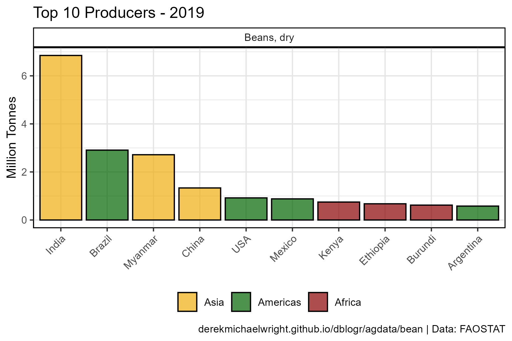
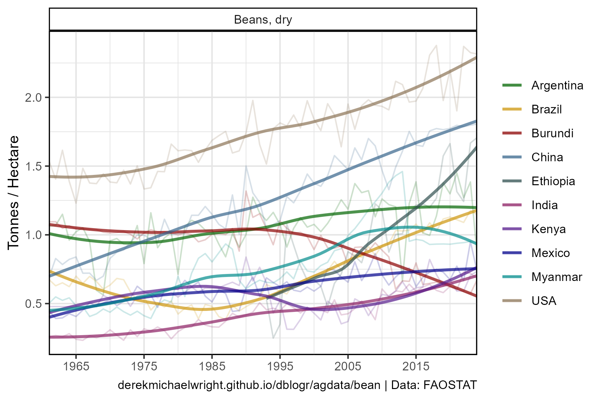

```{r setup, include = FALSE}
knitr::opts_chunk$set(echo = T, message = F, warning = F)
```

---

# Data

> - `r shiny::icon("globe")` [http://www.fao.org/faostat/en/#data/QC](http://www.fao.org/faostat/en/#data/QC){target="_blank"}
> - `r shiny::icon("save")` [agData_FAO_Crops.csv.gz](https://github.com/derekmichaelwright/agData/raw/master/Data/agData_FAO_Crops.csv.gz)

> - `r shiny::icon("save")` [agData_FAO_Country_Table.csv.gz](https://github.com/derekmichaelwright/agData/raw/master/Data/agData_FAO_Country_Table.csv.gz)

```{r class.source = 'fold-show'}
# devtools::install_github("derekmichaelwright/agData")
library(agData)
```

```{r}
# Prep data
myCaption <- "derekmichaelwright.github.io/dblogr/agdata/bean | Data: FAOSTAT"
#
d1 <- agData_FAO_Crops %>% filter(Item == "Beans, dry")
```

---

# PDF - All Bean Data

> - `r shiny::icon("file-pdf")` [figures_bean_fao.pdf"](figures_bean_fao.pdf")

```{r results="hide"}
# Prep data
myColors <- c("darkgoldenrod2", "darkgreen")
myAreas <- c("World",
  unique(agData_FAO_Country_Table$Region),
  unique(agData_FAO_Country_Table$SubRegion),
  unique(agData_FAO_Country_Table$Country))
xx <- d1 %>%
  mutate(Value = ifelse(Measurement %in% c("Area Harvested","Production"),
                        Value / 1000000, Value / 1000),
         Unit = plyr::mapvalues(Unit, c("ha", "t", "kg/ha"), 
                  c("Million Hectares", "Million Tonnes", "Tonnes/ Hectare")))
myAreas <- myAreas[myAreas %in% xx$Area]
# Plot
pdf("figures_bean_fao.pdf", width = 12, height = 8)
for(i in myAreas) {
  print(ggplot(xx %>% filter(Area == i)) +
    geom_line(aes(x = Year, y = Value, color = Item),
              size = 1.5, alpha = 0.7) +
    facet_wrap(Item ~ Measurement + Unit, ncol = 3, scales = "free_y") +
    theme_agData(legend.position = "bottom", 
                 axis.text.x = element_text(angle = 90, hjust = 1)) +
    scale_color_manual(name = NULL, values = myColors) +
    scale_x_continuous(breaks = seq(1960, 2020, by = 5) ) +
    labs(title = i, y = NULL, x = NULL, caption = myCaption) )
}
dev.off()
```

---

# Top Producers



```{r}
# Prep data
myColors <- c("darkgoldenrod2", "darkgreen", "darkred")
myRegions <- c("Asia", "Americas","Africa")
xx <- d1 %>% 
  filter(Item == "Beans, dry", Measurement == "Production",
         Area %in% agData_FAO_Country_Table$Country, Year == 2019) %>%
  arrange(desc(Value)) %>%
  slice(1:10) %>%
  left_join(agData_FAO_Country_Table, by = c("Area"="Country"))  %>%
  mutate(Area = factor(Area, levels = Area),
         Region = factor(Region, levels = myRegions))
top10_dry <- xx$Area 
# Plot
mp <- ggplot(xx, aes(x = Area, y = Value / 1000000, fill = Region)) + 
  geom_bar(stat = "identity", color = "black", alpha = 0.7) +
  facet_wrap(Item ~ .) +
  scale_fill_manual(name = NULL, values = myColors) + 
  theme_agData(legend.position = "bottom",
               axis.text.x = element_text(angle = 45, hjust = 1)) +
  labs(title = "Top 10 Producers - 2019", x = NULL, 
       y = "Million Tonnes", caption = myCaption)
ggsave("bean_01.png", mp, width = 6, height = 4)
```

```{r echo = F}
ggsave("featured.png", mp, width = 6, height = 4)
```

---

# Yields



```{r}
# Prep data
xx <- d1 %>% 
  filter(Item == "Beans, dry", Measurement == "Yield",
         Area %in% top10_dry) %>%
  mutate(Area = factor(Area, levels = myAreas))
# Plot
mp <- ggplot(xx, aes(x = Year, y = Value / 1000, color = Area)) + 
  geom_line(alpha = 0.2) +
  facet_wrap(Item ~ ., scales = "free_y") +
  stat_smooth(geom = "line", method = "loess", se = F, size = 1, alpha = 0.7) +
  scale_color_manual(name = NULL, values = agData_Colors) + 
  scale_x_continuous(breaks = seq(1965, 2015, by = 10), expand = c(0,0) ) +
  theme_agData() +
  labs(y = "Tonnes / Hectare", x = NULL, caption = myCaption)
ggsave("bean_02.png", mp, width = 6, height = 4)
```

---
