```{r setup, include = FALSE}
knitr::opts_chunk$set(echo = T, message = F, warning = F)
```

---

# Data {.tabset .tabset-pills}

## STATCAN Table: 32-10-0359-01

> - `r shiny::icon("globe")` [https://www150.statcan.gc.ca/t1/tbl1/en/cv.action?pid=3210035901](https://www150.statcan.gc.ca/t1/tbl1/en/cv.action?pid=3210035901){target="_blank"}
> - `r shiny::icon("save")` [agData_STATCAN_Crops.csv.gz](https://github.com/derekmichaelwright/agData/raw/master/Data/agData_STATCAN_Crops.csv.gz)

## STATCAN Table: 32-10-0153-01

> - `r shiny::icon("globe")` [https://www150.statcan.gc.ca/t1/tbl1/en/cv.action?pid=3210015301](https://www150.statcan.gc.ca/t1/tbl1/en/cv.action?pid=3210015301){target="_blank"}
> - `r shiny::icon("save")` [agData_STATCAN_FarmLand_Use.csv.gz](https://github.com/derekmichaelwright/agData/raw/master/Data/agData_STATCAN_FarmLand_Use.csv.gz)

---

```{r class.source = 'fold-show'}
# devtools::install_github("derekmichaelwright/agData")
library(agData)
library(gganimate)
library(treemapify)
library(mapcan)
```

```{r}
# Prep data
myCaption <- "derekmichaelwright.github.io/dblogr/agdata/crops_canada | Data: STATCAN"
d1 <- agData_STATCAN_Crops %>% filter(Area == "Canada")
d2 <- agData_STATCAN_FarmLand_Use %>% filter(Area == "Canada")
```

---

# PDF - All Crops

> - `r shiny::icon("file-pdf")` [figures_crops_canada_statcan.pdf](figures_crops_canada_statcan.pdf)

```{r results="hide"}
# Prep data
myColors <- c("darkgreen", "darkorange", "darkred", 
              "antiquewhite4", "steelblue", "darkblue")
myMeasures <- c("Area Seeded", "Area Harvested", "Production", 
                "Yield", "Average Farm Price", "Total Farm Value")
xx <- d1 %>%
   mutate(Measurement = factor(Measurement, levels = myMeasures),
          Value = ifelse(Measurement != "Yield",
                        Value / 1000000, Value / 1000),
          Unit = plyr::mapvalues(Unit, c("Hectares", "Tonnes", "kg/ha"), 
                   c("Million Hectares", "Million Tonnes", "Tonnes/ Hectare")))
myCrops <- unique(xx$Item)
# Plot
pdf("figures_crops_canada_statcan.pdf", width = 12, height = 4)
for(i in myCrops) {
  xi <- xx %>% filter(Item == i)
  print(ggplot(xi, aes(x = Year, y = Value, color = Measurement)) +
    geom_line(size = 1.5, alpha = 0.7) +
    facet_wrap(. ~ Measurement + Unit, scales = "free_y", ncol = 4) +
    scale_color_manual(values = myColors) +
    scale_x_continuous(breaks = seq(1920, 2020, by = 20) ) +
    theme_agData(legend.position = "none", 
                 axis.text.x = element_text(angle = 45, hjust = 1)) +
    labs(title = i, y = NULL, x = NULL,
         caption = myCaption) )
}
dev.off()
```

---

# 1910 Vs. 1960 Vs. 2020 {.tabset .tabset-pills}

## cropList Function

```{r class.source = 'fold-show'}
# Create function to determine top crops
cropList <- function(measurement, years) {
  # Prep data
  xx <- d1 %>% 
    filter(Measurement == measurement, Year %in% years) %>%
    arrange(desc(Value)) %>% 
    pull(Item) %>% unique() %>% as.character()
  xx
}
```

---

## Production {.active}


```{r}
# Prep data
myCrops <- cropList(measurement = "Production", years = c(2020, 1960, 1910))
xx <- d1 %>% 
  filter(Measurement == "Production", Item %in% myCrops,
         Year %in% c(2020, 1960, 1910) ) %>%
  mutate(Item = factor(Item, levels = myCrops) )
# Plot
mp <- ggplot(xx, aes(x = Item, y = Value / 1000000, fill = Item)) + 
  geom_col(color = "Black", alpha = 0.7) + 
  facet_grid(Year ~ .) + 
  scale_fill_manual(values = agData_Colors) +
  theme_agData_col(legend.position = "none", 
                   axis.text.x = element_text(angle = 45, hjust = 1)) + 
  labs(title = "Canada - Crop Production", 
       y = "Million Tonnes", x = NULL, caption = myCaption)
ggsave("crops_canada_1_01.png", mp, width = 7, height = 5)
```

```{r echo = F}
ggsave("featured.png", mp, width = 7, height = 5)
```

---

## Area Seeded

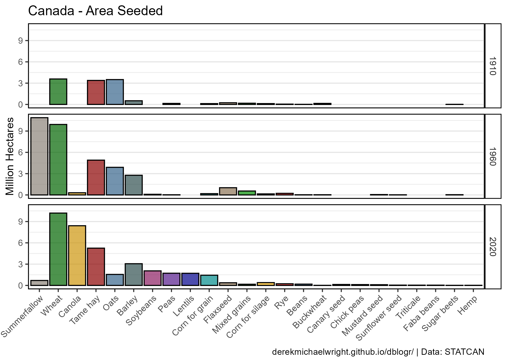

```{r}
# Prep data
myCrops <- cropList(measurement = "Area Seeded", years = c(2020, 1960, 1910))
xx <- d1 %>% 
  filter(Measurement == "Area Seeded", Item %in% myCrops,
         Year %in% c(2020, 1960, 1910) ) %>%
  mutate(Item = factor(Item, levels = myCrops) )
# Plot
mp <- ggplot(xx, aes(x = Item, y = Value / 1000000, fill = Item)) + 
  geom_col(color = "Black", alpha = 0.7) + 
  facet_grid(Year ~ .) + 
  scale_fill_manual(values = c("antiquewhite4", agData_Colors)) +
  theme_agData_col(legend.position = "none", 
                   axis.text.x = element_text(angle = 45, hjust = 1)) + 
  labs(title = "Canada - Area Seeded", x = NULL,
       y = "Million Hectares", caption = myCaption)
ggsave("crops_canada_1_02.png", mp, width = 7, height = 5)
```

---

## Yields

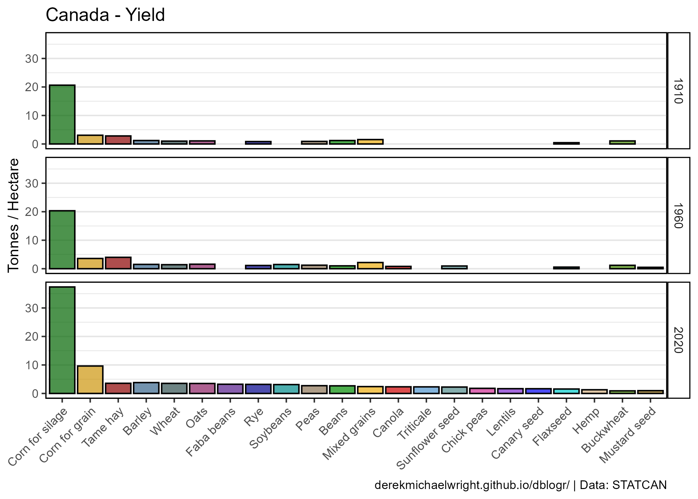

```{r}
# Prep data
myCrops <- cropList(measurement = "Yield", years = c(2020, 1960, 1910))[-1]
xx <- d1 %>% 
  filter(Measurement == "Yield", Item %in% myCrops,
         Year %in% c(2020, 1960, 1910) ) %>%
  mutate(Item = factor(Item, levels = myCrops) )
# Plot
mp <- ggplot(xx, aes(x = Item, y = Value / 1000, fill = Item)) + 
  geom_col(color = "Black", alpha = 0.7) + 
  facet_grid(Year ~ .) + 
  scale_fill_manual(values = agData_Colors) +
  theme_agData_col(legend.position = "none", 
                   axis.text.x = element_text(angle = 45, hjust = 1)) + 
  labs(title = "Canada - Yield", x = NULL, 
       y = "Tonnes / Hectare", caption = myCaption)
ggsave("crops_canada_1_03.png", mp, width = 7, height = 5)
```

---

# Bar Chart Racer {.tabset .tabset-pills}

## Production


```{r}
# Prep data
xx <- d1 %>% 
    filter(!Item %in% c("Hemp","Sugar beets"),
           Measurement == "Production") %>% 
  group_by(Item) %>%
  mutate(Value = movingAverage(Value, n = 3)) %>%
  group_by(Year) %>%
  arrange(Year, -Value) %>%
  mutate(Rank = 1:n()) %>%
  filter(Rank < 15) %>% 
  arrange(desc(Year)) %>%
  mutate(Item = factor(Item, levels = unique(.$Item)))
# Plot
mp <- ggplot(xx, aes(xmin = 0, xmax = Value / 1000000, 
                     ymin = Rank - 0.45, ymax = Rank + 0.45, y = Rank, 
                     fill = Item)) + 
  geom_rect(alpha = 0.7, color = "black") + 
  scale_fill_manual(values = agData_Colors) +
  scale_x_continuous(limits = c(-6,max(xx$Value)/1000000),
                     breaks = seq(0, 34, by = 4),
                     minor_breaks = seq(0, 18, by = 2)) +
  geom_text(aes(label = Item), col = "black", hjust = 1, x = -0.2) +
  scale_y_reverse() +
  theme_agData(legend.position = "none",
               axis.text.y = element_blank(), 
               axis.ticks = element_blank(),
               panel.grid.major.y = element_blank(),
               panel.grid.minor.y = element_blank()) + 
  labs(title = paste("Canada - Production -", "{frame_time}"),
       x = "Million Tonnes", y = NULL, caption = myCaption) +
  transition_time(Year) 
anim_save("crops_canada_gif_01.gif", mp,
          nframes = 600, fps = 25, end_pause = 60, 
          width = 900, height = 600, res = 150, units = "px")
```

---

## Seeded Area


```{r}
# Prep data
xx <- d1 %>% 
  filter(Measurement == "Area Seeded") %>% 
  group_by(Year) %>%
  arrange(Year, -Value) %>%
  mutate(Rank = 1:n()) %>%
  filter(Rank < 15) %>% 
  arrange(desc(Year)) %>%
  mutate(Item = factor(Item, levels = unique(.$Item)))
# Plot
mp <- ggplot(xx, aes(xmin = 0, xmax = Value / 1000000, 
                     ymin = Rank - 0.45, ymax = Rank + 0.45, y = Rank, 
                     fill = Item)) + 
  geom_rect(alpha = 0.7, color = "black") + 
  scale_fill_manual(values = agData_Colors) +
  scale_x_continuous(limits = c(-3,max(xx$Value)/1000000),
                     breaks = seq(0, 15, by = 2),
                     minor_breaks = seq(0, 10, by = 1)) +
  geom_text(aes(label = Item), col = "black", hjust = 1, x = -0.1) +
  scale_y_reverse() +
  theme_agData(legend.position = "none",
               axis.text.y = element_blank(), 
               axis.ticks = element_blank(),
               panel.grid.major.y = element_blank(),
               panel.grid.minor.y = element_blank()) + 
  labs(title = paste("Canada - Area Harvested -", "{frame_time}"),
       x = "Million Hectares", y = NULL, caption = myCaption) +
  transition_time(Year) 
anim_save("crops_canada_gif_02.gif", mp,
          nframes = 600, fps = 25, end_pause = 60, 
          width = 900, height = 600, res = 150, units = "px")
```

---

# Production of Major Crops {.tabset .tabset-pills}

## All Data


```{r}
# Prep data
myCrops <- cropList(measurement = "Production", years = 2020)[c(1:8)]
myCrops <- c(myCrops, "Other")
x1 <- d1 %>% filter(Measurement == "Production", Item %in% myCrops) 
x2 <- d1 %>% filter(Measurement == "Production", !Item %in% myCrops) %>%
  group_by(Year) %>%
  summarise(Value = sum(Value, na.rm = T)) %>%
  ungroup() %>%
  mutate(Item = "Other")
xx <- bind_rows(x1, x2) %>%
  mutate(Item = factor(Item, levels = rev(myCrops)))
# Plot
mp <- ggplot(xx, aes(x = Year, y = Value / 1000000, fill = Item)) + 
  geom_col(alpha = 0.7, color = "black", lwd = 0.1) + 
  scale_fill_manual(name = NULL, values = agData_Colors[c(9:1)]) +
  scale_x_continuous(breaks = seq(1910, 2020, by=10), expand = c(0.01,0)) +
  guides(fill = guide_legend(override.aes = list(lwd = 0.4))) +
  theme_agData() + 
  labs(title = "Canada - Crop Production", x = NULL, 
       y = "Million Tonnes", caption = myCaption)
ggsave("crops_canada_2_01.png", mp, width = 8, height = 4)
```

---

## Production By Decade


```{r}
# Prep data
myCrops <- cropList(measurement = "Production", years = 2020)[c(1:8)]
myCrops <- c(myCrops, "Other")
x1 <- d1 %>% filter(Measurement == "Production", Item %in% myCrops) 
x2 <- d1 %>% filter(Measurement == "Production", !Item %in% myCrops) %>%
  group_by(Year) %>%
  summarise(Value = sum(Value, na.rm = T)) %>%
  ungroup() %>%
  mutate(Item = "Other")
xx <- bind_rows(x1, x2) %>%
  mutate(Item = factor(Item, levels = rev(myCrops)),
         Decade = floor(Year/10)*10)
x1 <- xx %>% filter(Year >= 1910, Year <= 2020) %>% 
  group_by(Item, Decade) %>%
  summarise(Value = mean(Value, na.rm = T)) %>%
  rename(Year=Decade) %>%
  mutate(Year = paste0(Year, "'s"))
x2 <- xx %>% filter(Year == 2021) %>% 
  mutate(Year = as.character(Year))
xx <- bind_rows(x1, x2) %>% 
  mutate(Year = factor(Year))
# Plot
mp <- ggplot(xx, aes(x = Year, y = Value / 1000000, fill = Item)) + 
  geom_col(alpha = 0.7, color = "black", lwd = 0.2) + 
  scale_fill_manual(name = NULL, values = agData_Colors[c(9:1)]) +
  guides(fill = guide_legend(override.aes = list(lwd = 0.4))) +
  theme_agData_col() + 
  labs(title = "Canada - Crop Production", 
       y = "Million Tonnes", x = NULL, caption = myCaption)
ggsave("crops_canada_2_02.png", mp, width = 8, height = 4)
```

---

## Droughts

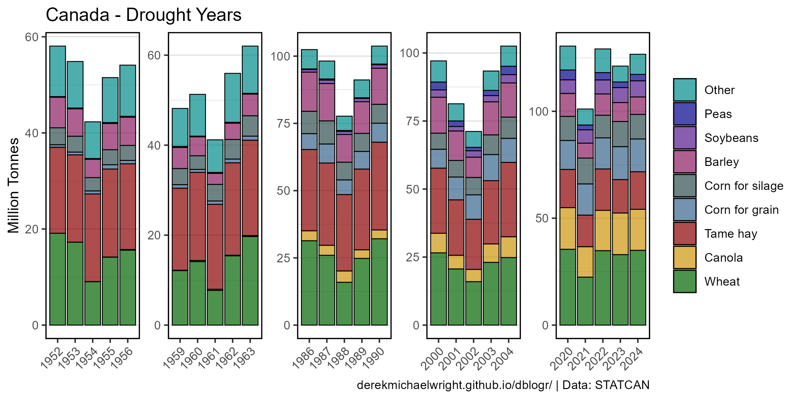

```{r}
# Prep data
myCrops <- cropList(measurement = "Production", years = 2020)[c(1:8)]
myCrops <- c(myCrops, "Other")
myYears <- c(1952,1953,1954,1955,1956, 1959,1960,1961,1962,1963, 
             1986,1987,1988,1989,1990, 2000,2001,2002,2003,2004, 
             2020,2021,2022,2023,2024)
myGroups <- c(rep(1:5, each = 5))
x1 <- d1 %>% filter(Measurement == "Production", Item %in% myCrops) 
x2 <- d1 %>% filter(Measurement == "Production", !Item %in% myCrops) %>%
  group_by(Year) %>%
  summarise(Value = sum(Value, na.rm = T)) %>%
  ungroup() %>%
  mutate(Item = "Other")
xx <- bind_rows(x1, x2) %>%
  filter(Year %in% myYears) %>%
  mutate(Item = factor(Item, levels = rev(myCrops)),
         Group = plyr::mapvalues(Year, myYears, myGroups))
# Plot
mp <- ggplot(xx, aes(x = Year, y = Value / 1000000, fill = Item)) + 
  geom_col(alpha = 0.7, color = "black", lwd = 0.3) + 
  facet_wrap(Group ~ . , ncol = 6, scales = "free") +
  scale_fill_manual(name = NULL, values = agData_Colors[c(9:1)]) +
  guides(fill = guide_legend(override.aes = list(lwd = 0.4))) +
  theme_agData_col(axis.text.x = element_text(angle = 45, hjust = 1),
                   strip.text = element_blank()) + 
  labs(title = "Canada - Drought Years", x = NULL,
       y = "Million Tonnes", caption = myCaption)
ggsave("crops_canada_2_03.png", mp, width = 8, height = 4)
```

---

## 2020 vs 2021


```{r}
# Prep data
xx <- xx %>% filter(Year %in% c(2020, 2021)) %>%
  mutate(Item = factor(Item, levels = myCrops),
         Year = factor(Year))
# Plot
mp <- ggplot(xx, aes(x = Item, y = Value / 1000000, 
                     fill = Item, alpha = Year)) + 
  geom_col(position = "dodge", color = "black") + 
  scale_fill_manual(values = agData_Colors, guide = F) +
  scale_alpha_manual(name = NULL, values = c(0.7, 0.3)) +
  theme_agData_col(legend.position = "bottom",
                   axis.text.x = element_text(angle = 45, hjust = 1)) + 
  labs(title = "Canada - Crop Production - 2020 vs. 2021", 
       y = "Million Tonnes", x = NULL, caption = myCaption)
ggsave("crops_canada_2_04.png", mp, width = 6, height = 4)
```

---

## Wheat, Barley & Oates

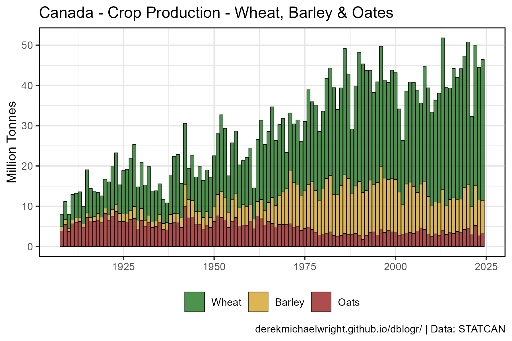

```{r}
# Prep data
myCrops <- c("Wheat", "Barley", "Oats")
xx <- d1 %>% 
  filter(Item %in% myCrops, Measurement == "Production") %>%
  mutate(Item = factor(Item, levels = myCrops))
# Plot
mp <- ggplot(xx, aes(x = Year, y = Value / 1000000, fill = Item)) +
  geom_col(color = "black", alpha = 0.7, lwd = 0.2) +
  scale_fill_manual(name = NULL, values = agData_Colors) +
  theme_agData(legend.position = "bottom") + 
  labs(title = "Canada - Crop Production - Wheat, Barley & Oates", 
       y = "Million Tonnes", x = NULL, caption = myCaption)
ggsave("crops_canada_2_05.png", mp, width = 6, height = 4)
```

---

## Pulses


```{r}
# Prep data
myCrops <- c("Peas", "Beans", "Lentils", "Faba beans", "Chick peas")
xx <- d1 %>% 
  filter(Item %in% myCrops, Measurement == "Yield") %>%
  mutate(Item = factor(Item, levels = myCrops))
# Plot
mp <- ggplot(xx, aes(x = Year, y = Value / 1000000, fill = Item)) +
  geom_col(color = "black", alpha = 0.7, lwd = 0.2) +
  scale_fill_manual(name = NULL, values = agData_Colors) +
  theme_agData(legend.position = "bottom") + 
  labs(title = "Canada - Crop Production - Pulses", 
       y = "Million Tonnes", x = NULL, caption = myCaption)
ggsave("crops_canada_2_06.png", mp, width = 6, height = 4)
```

---

# Yields 2020

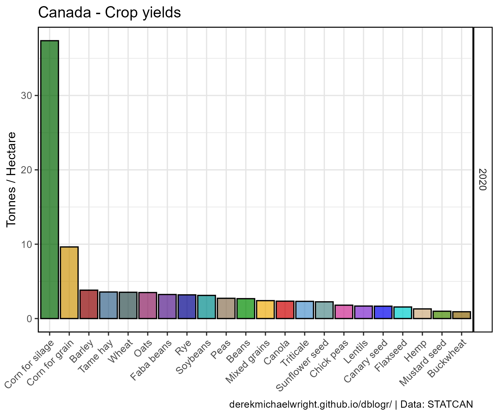

```{r}
# Prep data
myCrops <- cropList(measurement = "Yield", years = 2020)[-1]
xx <- d1 %>% 
  filter(Year == 2020, Measurement == "Yield", Item %in% myCrops) %>%
  mutate(Item = factor(Item, levels = myCrops) )
# Plot
mp <- ggplot(xx, aes(x = Item, y = Value / 1000, fill = Item)) + 
  geom_col(color = "Black", alpha = 0.7) + 
  facet_grid(Year ~ .) + 
  scale_fill_manual(values = agData_Colors) +
  theme_agData(legend.position = "none", 
               axis.text.x = element_text(angle = 45, hjust = 1)) + 
  labs(title = "Canada - Crop yields", 
       y = "Tonnes / Hectare", x = NULL, caption = myCaption)
ggsave("crops_canada_3_01.png", mp, width = 6, height = 5)
```

---

# Production Per Person

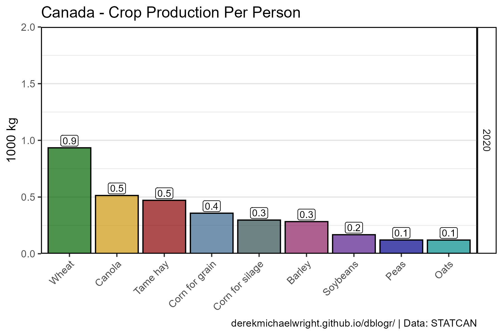

```{r}
# Prep data
pp <- agData_STATCAN_Population %>% 
  filter(Month == 1, Area == "Canada", Year == 2020) %>%
  pull(Value)
myCrops <- cropList(measurement = "Production", years = 2020)
xx <- d1 %>% 
  filter(Year == 2020, Item %in% myCrops,
         Measurement == "Production") %>%
  mutate(Item = factor(Item, levels = myCrops),
         PerPerson = Value / pp) %>%
  filter(PerPerson > 0.1)
# Plot
mp <- ggplot(xx, aes(x = Item, y = PerPerson, fill = Item)) + 
  geom_col(color = "Black", alpha = 0.7) + 
  geom_label(aes(label = round(PerPerson,1)), vjust = -0.15, fill = "White",
             size = 3, label.padding = unit(0.15, "lines")) +
  facet_grid(Year~.) + 
  scale_y_continuous(limits = c(0,2), expand = c(0,0)) +
  scale_fill_manual(values = agData_Colors) +
  theme_agData_col(legend.position = "none", 
                   axis.text.x = element_text(angle = 45, hjust = 1)) + 
  labs(title = "Canada - Crop Production Per Person", 
       y = "1000 kg", x = NULL, caption = myCaption)
ggsave("crops_canada_3_02.png", mp, width = 6, height = 4)
```

---

# All Crops {.tabset .tabset-pills}

## Area Seeded

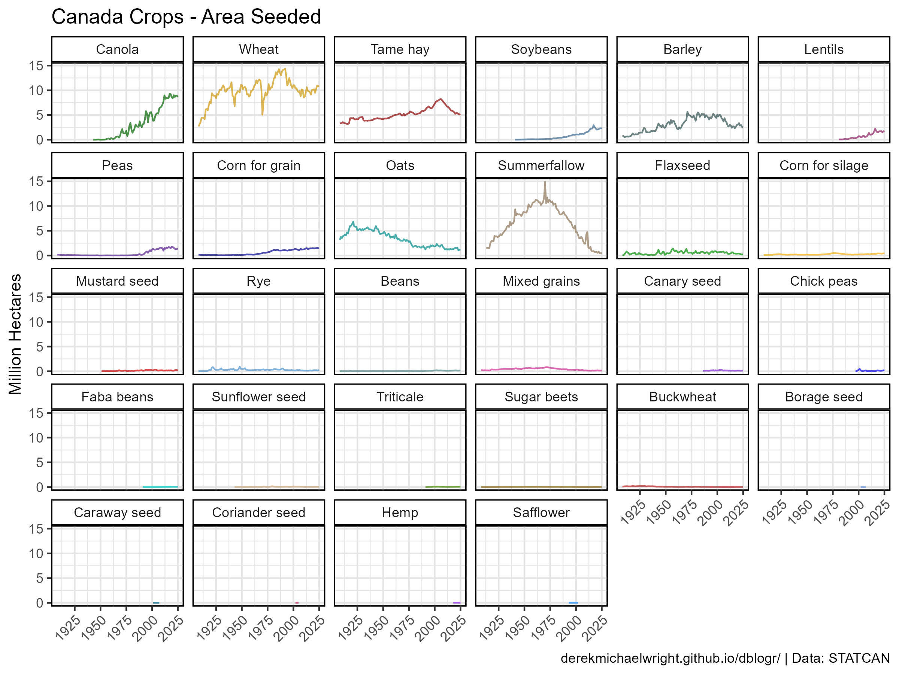

```{r}
# Prep data
xx <- d1 %>% filter(Measurement == "Area Seeded") 
myCrops <- unique(c(cropList(measurement = "Area Seeded", years = 2017), 
                    as.character(xx$Item)))
xx <- xx %>% mutate(Item = factor(Item, levels = myCrops))
# Plot
mp <- ggplot(xx, aes(x = Year, y = Value / 1000000, color = Item)) + 
  geom_line(alpha = 0.7) + 
  facet_wrap(Item ~ ., ncol = 6) + 
  scale_color_manual(values = agData_Colors) +
  theme_agData(legend.position = "none", 
               axis.text.x = element_text(angle = 45, hjust = 1)) + 
  labs(title = "Canada Crops - Area Seeded", 
       y = "Million Hectares", x = NULL, caption = myCaption)
ggsave("crops_canada_4_01.png", mp, width = 8, height = 6)
```

---

## Production

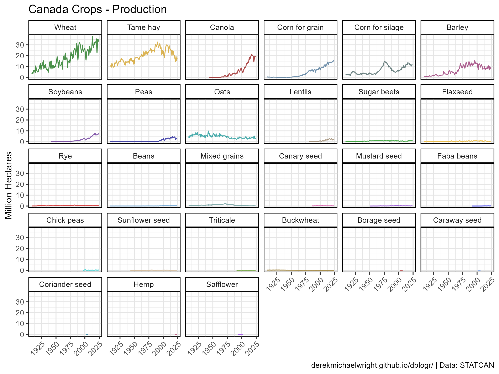

```{r}
# Prep data
xx <- d1 %>% filter(Measurement == "Production") 
myCrops <- unique(c(cropList(measurement = "Production", years = 2017), 
                    as.character(xx$Item)))
xx <- xx %>% mutate(Item = factor(Item, levels = myCrops))
# Plot
mp <- ggplot(xx, aes(x = Year, y = Value / 1000000, color = Item)) + 
  geom_line(alpha = 0.7) + 
  facet_wrap(Item ~ ., ncol = 6) + 
  scale_color_manual(values = agData_Colors) +
  theme_agData(legend.position = "none", 
               axis.text.x = element_text(angle = 45, hjust = 1)) + 
  labs(title = "Canada Crops - Production", 
       y = "Million Hectares", x = NULL, caption = myCaption)
ggsave("crops_canada_4_02.png", mp, width = 8, height = 6)
```

---

# Treemap {.tabset .tabset-pills}

## 2020

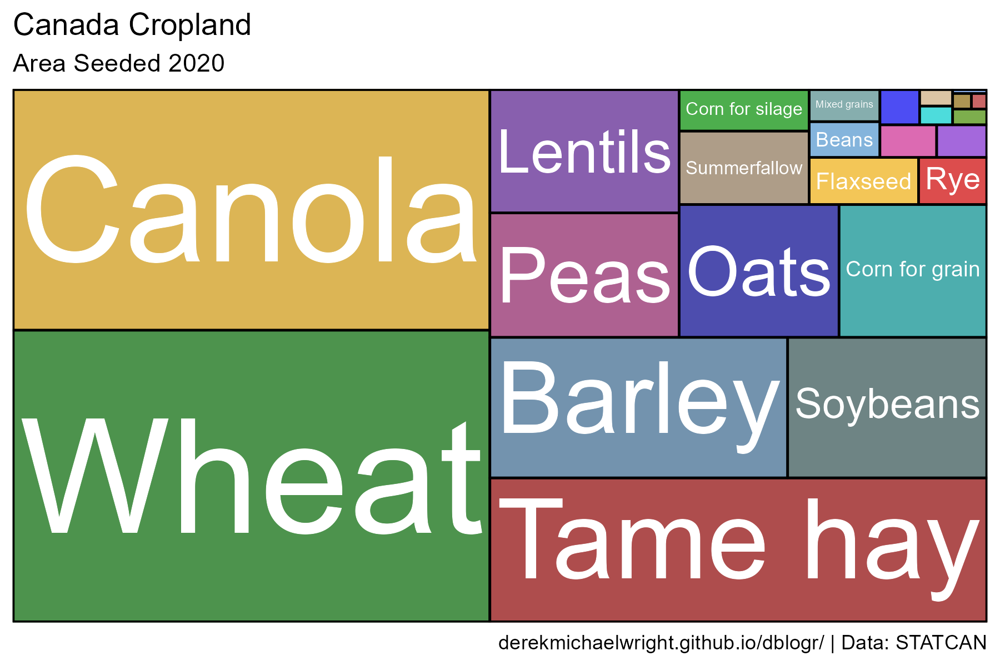

```{r}
# Prep data
xx <- d1 %>% filter(Year == 2020, Measurement == "Area Seeded") %>%
  arrange(desc(Value)) %>%
  mutate(Item = factor(Item, levels = unique(.$Item)))
# Plot
mp <- ggplot(xx, aes(area = Value, fill = Item, label = Item)) +
  geom_treemap(color = "black", alpha = 0.7, size = 1.5) +
  geom_treemap_text(place = "centre", grow = T, color = "white") +
  scale_fill_manual(values = agData_Colors) +
  theme_agData(legend.position = "none") +
  labs(title = "Canada Cropland", 
       subtitle = "Area Seeded 2020", caption = myCaption)
ggsave("crops_canada_4_03.png", mp, width = 6, height = 4)
```

---

## Animation


```{r}
# Prep data
xx <- d1 %>% filter(Measurement == "Area Seeded") %>%
  arrange(desc(Year), desc(Value)) %>% 
  mutate(Item = factor(Item, levels = unique(.$Item)))
# Plot
mp <- ggplot(xx, aes(area = Value, fill = Item, label = Item)) +
  geom_treemap(layout = "fixed", color = "black", alpha = 0.7, size = 1.5) +
  geom_treemap_text(layout = "fixed", place = "centre", 
                    grow = T, color = "white") +
  scale_fill_manual(values = agData_Colors) +
  theme_agData(legend.position = "none") +
  labs(title = "Canada Cropland - Area Seeded",
       subtitle = "Year: {frame_time}", caption = myCaption) +
  transition_time(Year)
anim_save("crops_canada_gif_03.gif", mp,
          nframes = 600, fps = 25, end_pause = 60, 
          width = 900, height = 600, res = 150, units = "px")
```

---

# Farm Area {.tabset .tabset-pills}

## Farmland

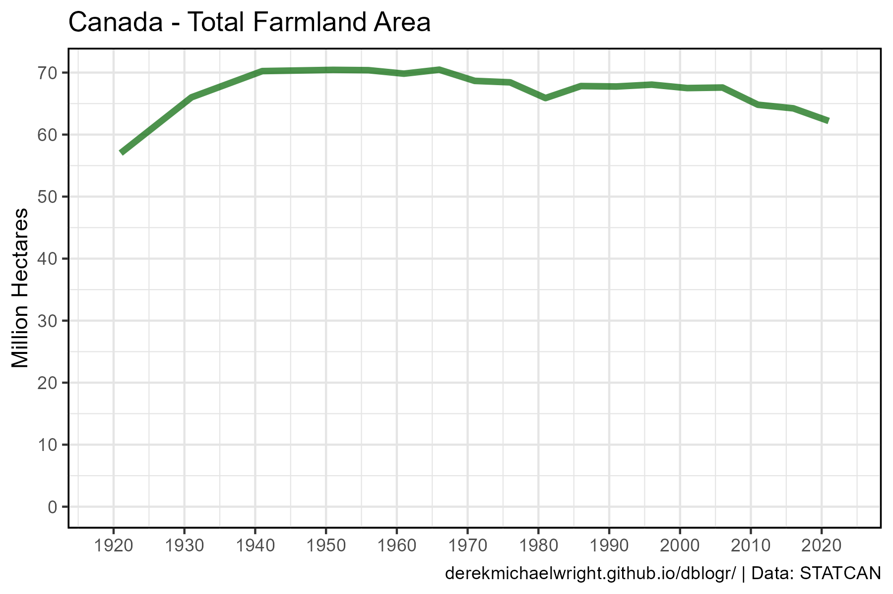

```{r}
# Prep data
xx <- d2 %>%
  filter(Item == "Total area of farms", 
         Unit == "Hectares", !is.na(Value))
# Plot
mp <- ggplot(xx, aes(x = Year, y = Value / 1000000)) + 
  geom_col(alpha = 0) +
  geom_line(color = "darkgreen", size = 1.5, alpha = 0.7) +
  scale_x_continuous(breaks = seq(1920, 2020, 10)) +
  scale_y_continuous(breaks = seq(0, 80, 10)) +
  theme_agData() +
  labs(title = "Canada - Total Farmland Area", 
       y = "Million Hectares", x = NULL, caption = myCaption)
ggsave("crops_canada_5_01.png", mp, width = 6, height = 4)
```

---

## Summerfallow


```{r}
# Prep data
myColors <- c("darkgreen","darkgoldenrod2","darkred")
myCrops <- c("Summerfallow", "Wheat", "Canola")
xx <- d1 %>% filter(Measurement == "Area Seeded", Item %in% myCrops) %>%
  mutate(Item = factor(Item, levels = myCrops))
# Plot
mp <- ggplot(xx, aes(x = Year, y = Value / 1000000, 
                     color = Item, alpha = Item, size = Item)) + 
  geom_line() +
  scale_color_manual(name = NULL, values = myColors) +
  scale_alpha_manual(name = NULL, values = c(0.8,0.6,0.6)) +
  scale_size_manual(name = NULL, values = c(1.75,1.5,1.5)) +
  scale_x_continuous(breaks = seq(1910, 2020, 10)) +
  theme_agData(legend.position = "bottom") +
  labs(title = "Canada - Summerfallow", 
       y = "Million Hectares", x = NULL, caption = myCaption)
ggsave("crops_canada_5_02.png", mp, width = 6, height = 4)
```

---

## Crop Area

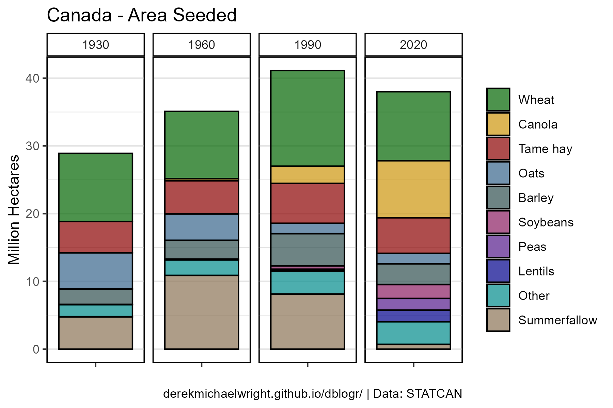

```{r}
# Prep data
myYears <- c(2020, 1990, 1960, 1930)
myCrops <- cropList(measurement = "Area Seeded", years = myYears)[1:9]
xx <- d1 %>% filter(Year %in% myYears, Measurement == "Area Seeded")
x1 <- xx %>% filter(Item %in% myCrops)
x2 <- xx %>% filter(!Item %in% myCrops) %>% 
  group_by(Area, Year, Measurement, Unit) %>%
  summarise(Value = sum(Value)) %>%
  mutate(Item = "Other")
myCrops <- c(myCrops[myCrops != "Summerfallow"], "Other", "Summerfallow")
xx <- bind_rows(x1, x2) %>%
  mutate(Item = factor(Item, levels = myCrops))
# Plot
mp <- ggplot(xx, aes(x = "", y = Value / 1000000, fill = Item)) + 
  geom_col(color = "black", alpha = 0.7) +
  facet_grid(. ~ Year) +
  scale_fill_manual(name = NULL, values = agData_Colors) +
  theme_agData_col() +
  labs(title = "Canada - Area Seeded", 
       y = "Million Hectares", x = NULL, caption = myCaption)
ggsave("crops_canada_5_03.png", mp, width = 6, height = 4)
```

---

# Maps

```{r}
# Plotting functions
cropMapCan_Production <- function(crop, year) {
  xx <- agData_STATCAN_Crops %>% 
    filter(Item == crop, Year == year, Measurement == "Production")
  xx <- mapcan(boundaries = province, type = standard) %>% 
    left_join(xx, by = c("pr_english"="Area"))
  # Plot
  ggplot(xx, aes(x = long, y = lat, group = group, fill = Value / 1000000)) +
    geom_polygon() + 
    coord_fixed() + 
    theme_mapcan() +
    scale_fill_continuous(name = "Million Tonnes",
                          low = "lightgrey", high = "darkgreen") +
    theme(legend.position = "right") +
    labs(title = paste(crop, "Production", year, sep = " - "),
         caption = myCaption)
}
#
myCaption <- "derekmichaelwright.github.io/dblogr/ | Data: STATCAN"
```

---

## PDF - All Crops

`r shiny::icon("file-pdf")` [figures_crops_canada_maps_statcan.pdf](figures_crops_canada_maps_statcan.pdf)

```{r results="hide"}
# Prep data
xx <- agData_STATCAN_Crops
# Plot
pdf("figures_crops_canada_maps_statcan.pdf", width = 6, height = 4)
for(i in unique(xx$Item)) {
  xi <- xx %>% 
    filter(Item == i, Year == 2020, Measurement == "Production") 
  xi <- mapcan(boundaries = province, type = standard) %>% 
    left_join(xi, by = c("pr_english"="Area"))
  print(ggplot(xi, aes(x = long, y = lat, group = group, 
                       fill = Value / 1000000)) +
          geom_polygon() + 
          coord_fixed() + 
          theme_mapcan() +
          scale_fill_continuous(name = "Million Tonnes", 
                                low = "lightgrey", high = "darkgreen") +
          theme(legend.position = "right") + 
          labs(title = paste(i, "- Production -", 2020),
               caption = "derekmichaelwright.github.io/dblogr/ | Data: STATCAN")
        ) 
}
dev.off()
```

---

## Production {.tabset .tabset-pills}

### Wheat


```{r}
# Plot
mp <- cropMapCan_Production("Wheat", 2020)
ggsave("crops_canada_06_wheat.png", mp, width = 7, height = 5, bg = "white")
```

```{r echo = F}
ggsave("featured.png", mp, width = 7, height = 5, bg = "white")
```

---

### Canola

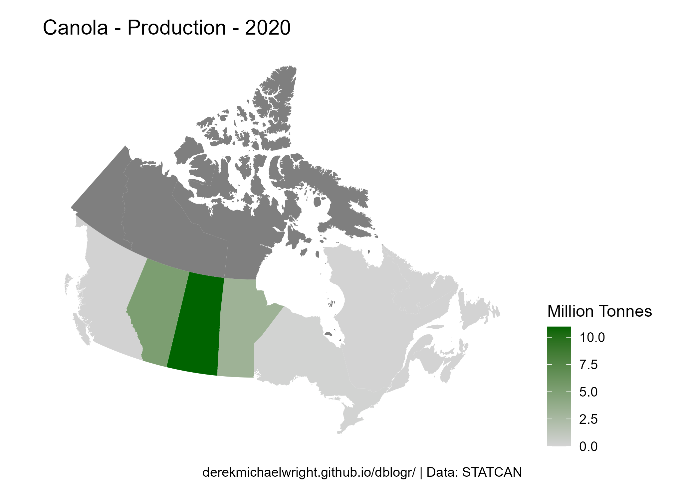

```{r}
# Plot
mp <- cropMapCan_Production("Canola", 2020)
ggsave("crops_canada_06_canola.png", mp, width = 7, height = 5, bg = "white")
```

---

### Barley

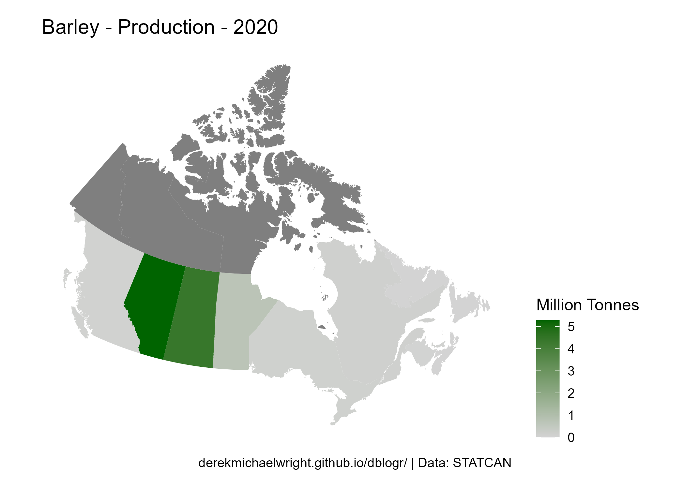

```{r}
# Plot
mp <- cropMapCan_Production("Barley", 2020)
ggsave("crops_canada_06_barley.png", mp, width = 7, height = 5, bg = "white")
```

---

### Peas


```{r}
# Plot
mp <- cropMapCan_Production("Peas", 2020)
ggsave("crops_canada_06_peas.png", mp, width = 7, height = 5, bg = "white")
```

---

### Oats


```{r}
# Plot
mp <- cropMapCan_Production("Oats", 2020)
ggsave("crops_canada_06_oats.png", mp, width = 7, height = 5, bg = "white")
```

---

### Lentils


```{r}
# Plot
mp <- cropMapCan_Production("Lentils", 2020)
ggsave("crops_canada_06_lentils.png", mp, width = 7, height = 5, bg = "white")
```

---

### Beans


```{r}
# Plot
mp <- cropMapCan_Production("Beans", 2020)
ggsave("crops_canada_06_beans.png", mp, width = 7, height = 5, bg = "white")
```

---

### Chickpeas

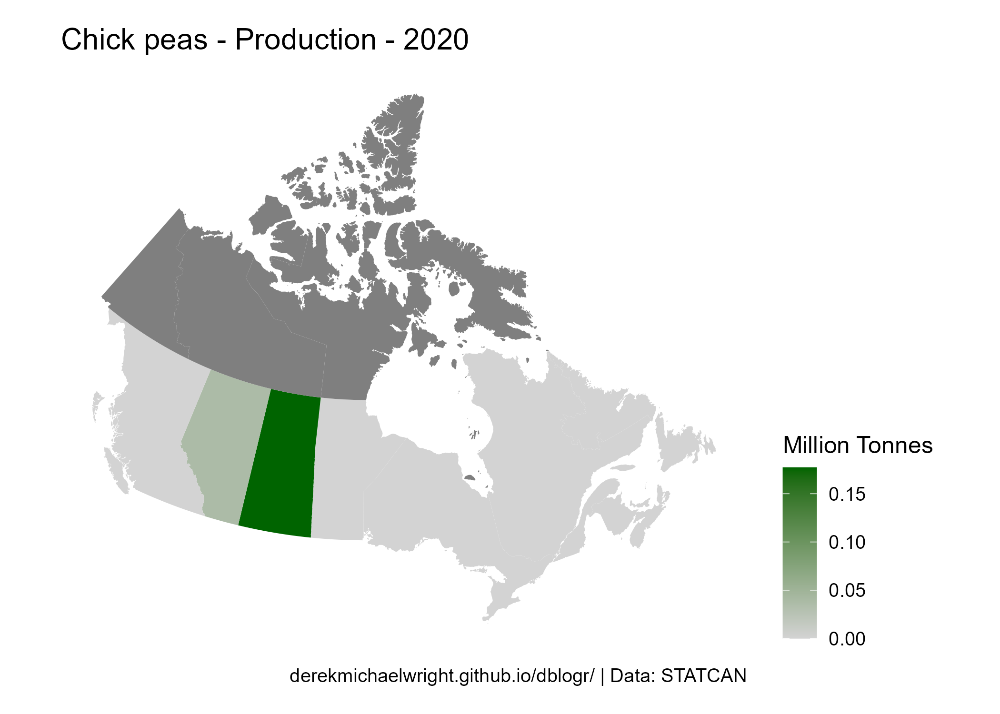

```{r}
# Plot
mp <- cropMapCan_Production("Chick peas", 2020)
ggsave("crops_canada_06_chickpeas.png", mp, width = 7, height = 5, bg = "white")
```

---

### Soybeans


```{r}
# Plot
mp <- cropMapCan_Production("Soybeans", 2020)
ggsave("crops_canada_06_soybeans.png", mp, width = 7, height = 5, bg = "white")
```
