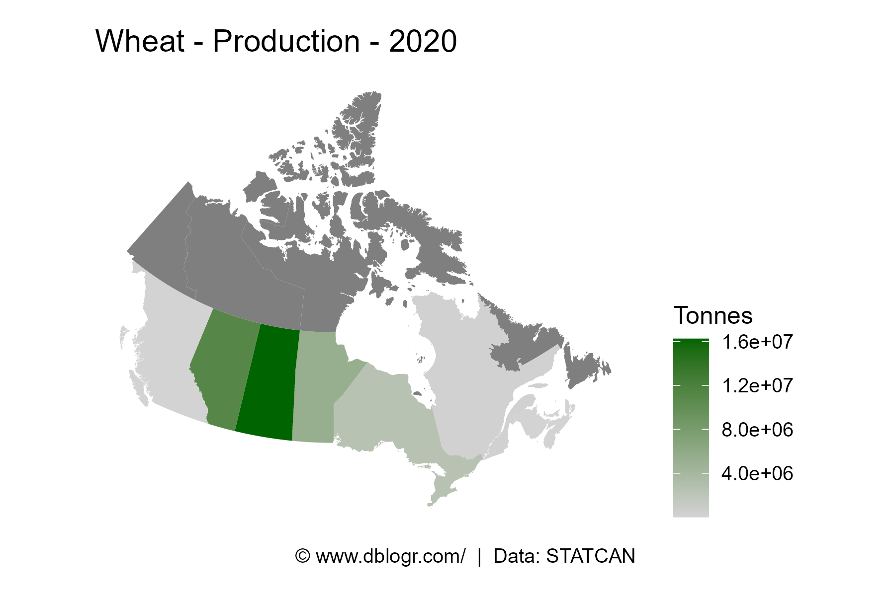
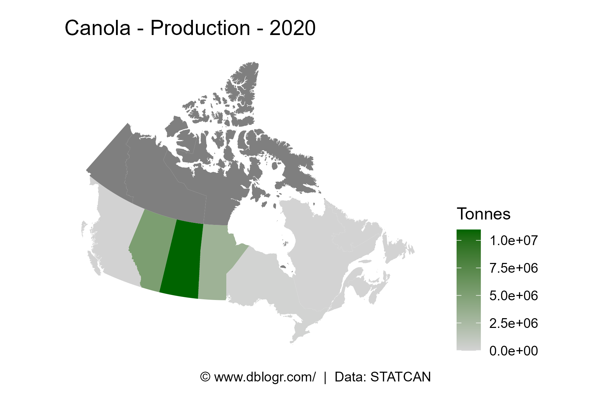
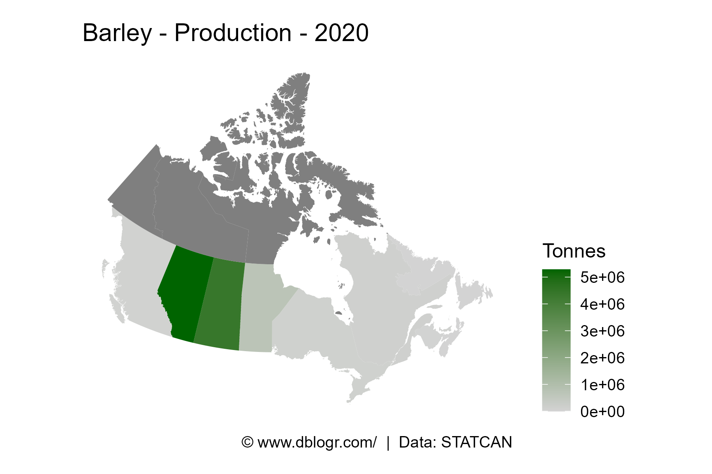
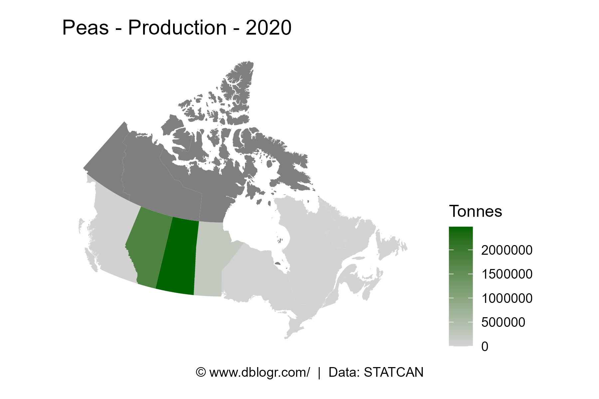
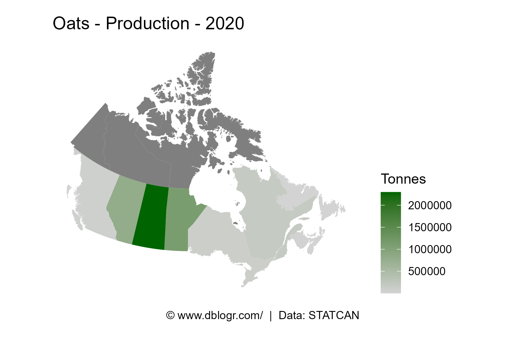
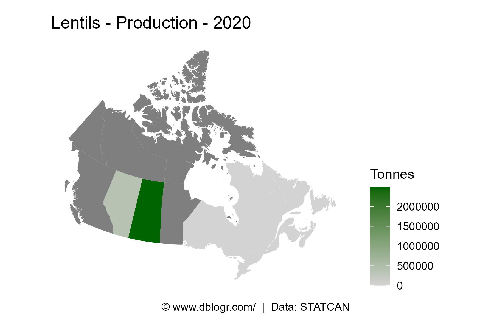
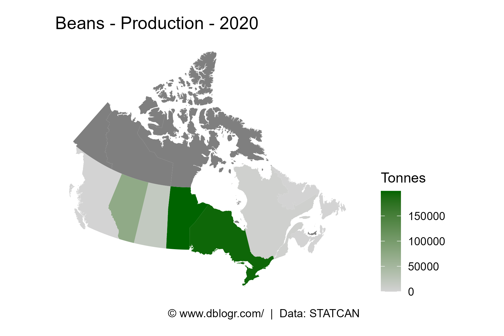
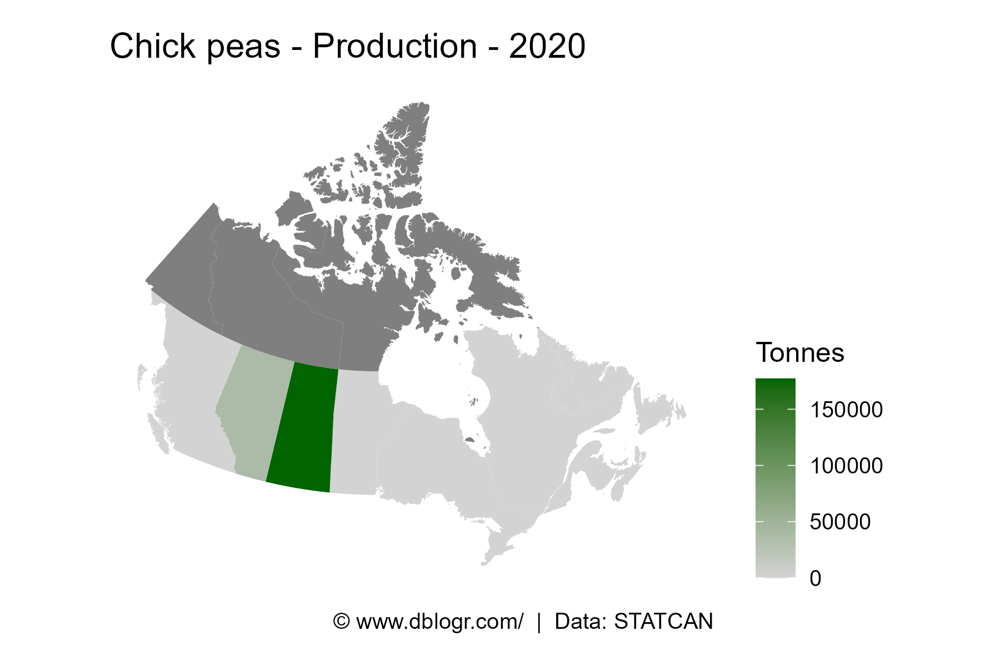

```{r setup, include = FALSE}
knitr::opts_chunk$set(echo = T, message = F, warning = F)
```

---

# Data

https://www150.statcan.gc.ca/t1/tbl1/en/cv.action?pid=3210035901

```{r echo = F}
downloadthis::download_link(
  link = "https://github.com/derekmichaelwright/agData/raw/master/Data/agData_STATCAN_Crops.csv",
  button_label = "agData_STATCAN_Crops.csv",
  button_type = "success",
  has_icon = TRUE,
  icon = "fa fa-save",
  self_contained = F
)
```

```{r class.source = 'fold-show'}
# devtools::install_github("derekmichaelwright/agData")
library(agData)
library(mapcan)
```

---

# PDF - All Crops

```{r echo = F}
downloadthis::download_link(
  link = "https://dblogr.com/agdata/crops_canada_maps/figures_crops_canada_maps_statcan.pdf",
  button_label = "figures_crops_canada_maps_statcan.pdf",
  button_type = "success",
  has_icon = TRUE,
  icon = "fa fa-file-pdf",
  self_contained = FALSE
)
```

```{r results="hide"}
# Prep data
xx <- agData_STATCAN_Crops
# Plot
pdf("figures_crops_canada_maps_statcan.pdf", width = 6, height = 4)
for(i in unique(xx$Crop)) {
  xi <- xx %>% 
    filter(Crop == i, Year == 2020, Measurement == "Production") 
  xi <- mapcan(boundaries = province, type = standard) %>% 
    left_join(xi, by = c("pr_english"="Area"))
  print(ggplot(xi, aes(x = long, y = lat, group = group, 
                       fill = Value / 1000000)) +
          geom_polygon() + 
          coord_fixed() + 
          theme_mapcan() +
          scale_fill_continuous(name = "Million Tonnes", 
                                low = "lightgrey", high = "darkgreen") +
          theme(legend.position = "right") + 
          labs(title = paste(i, "- Production -", 2020),
               caption = "\u00A9 www.dblogr.com/  |  Data: STATCAN")
        ) 
}
dev.off()
```

---

# Plotting Function

```{r}
cropMapCan <- function(crop, measurement, year) {
  xx <- agData_STATCAN_Crops %>% 
    filter(Crop == crop, Year == year, Measurement == measurement) 
  xx <- mapcan(boundaries = province, type = standard) %>% 
    left_join(xx, by = c("pr_english"="Area"))
  # Plot
  ggplot(xx, aes(x = long, y = lat, group = group, fill = Value)) +
    geom_polygon() + 
    coord_fixed() + 
    theme_mapcan() +
    scale_fill_continuous(name = unique(xx$Unit[!is.na(xx$Unit)]),
                          low = "lightgrey", high = "darkgreen") +
    theme(legend.position = "right") +
    labs(title = paste(crop, measurement, year, sep = " - "),
         caption = "\u00A9 www.dblogr.com/  |  Data: STATCAN")
}
```

---

# Wheat



```{r}
# Plot
mp <- cropMapCan("Wheat", "Production", 2020)
ggsave("maps_crops_canada_01.png", mp, width = 6, height = 4, bg = "white")
```

---

# Canola



```{r}
# Plot
mp <- cropMapCan("Canola", "Production", 2020)
ggsave("maps_crops_canada_02.png", mp, width = 6, height = 4, bg = "white")
```

```{r echo = F}
ggsave("featured.png", mp, width = 6, height = 4, bg = "white")
```

---

# Soybeans


```{r}
# Plot
mp <- cropMapCan("Soybeans", "Production", 2020)
ggsave("maps_crops_canada_03.png", mp, width = 6, height = 4, bg = "white")
```

---

# Barley



```{r}
# Plot
mp <- cropMapCan("Barley", "Production", 2020)
ggsave("maps_crops_canada_04.png", mp, width = 6, height = 4, bg = "white")
```

---

# Peas



```{r}
# Plot
mp <- cropMapCan("Peas", "Production", 2020)
ggsave("maps_crops_canada_05.png", mp, width = 6, height = 4, bg = "white")
```

---

# Oats



```{r}
# Plot
mp <- cropMapCan("Oats", "Production", 2020)
ggsave("maps_crops_canada_06.png", mp, width = 6, height = 4, bg = "white")
```

---

# Lentils



```{r}
# Plot
mp <- cropMapCan("Lentils", "Production", 2020)
ggsave("maps_crops_canada_07.png", mp, width = 6, height = 4, bg = "white")
```

---

# Beans



```{r}
# Plot
mp <- cropMapCan("Beans", "Production", 2020)
ggsave("maps_crops_canada_08.png", mp, width = 6, height = 4, bg = "white")
```

---

# Chickpeas



```{r}
# Plot
mp <- cropMapCan("Chick peas", "Production", 2020)
ggsave("maps_crops_canada_09.png", mp, width = 6, height = 4, bg = "white")
```

---
