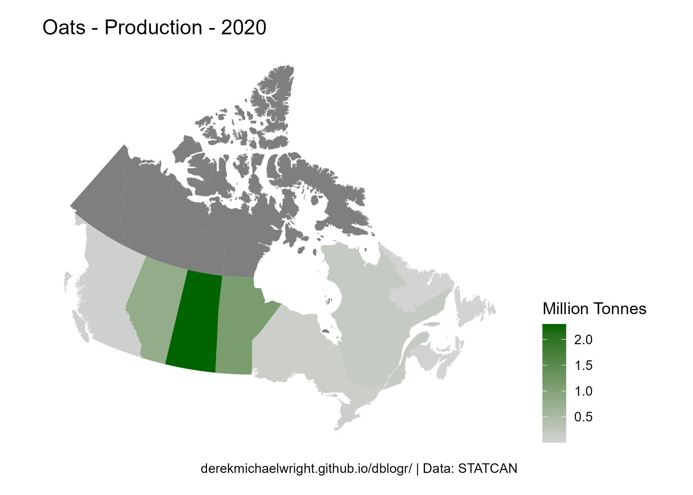
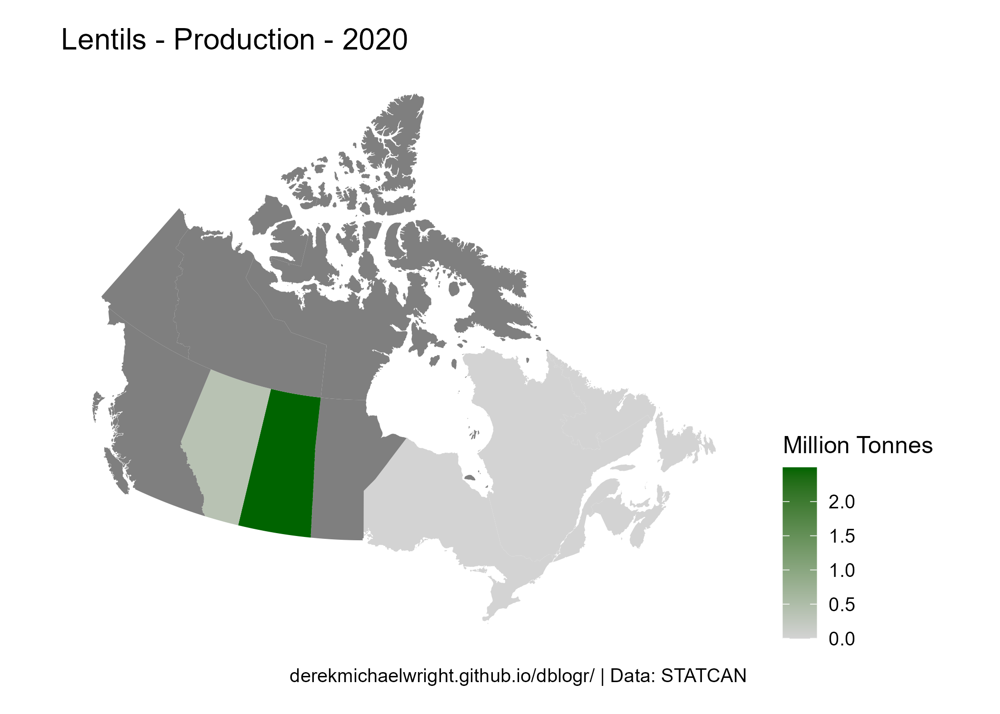
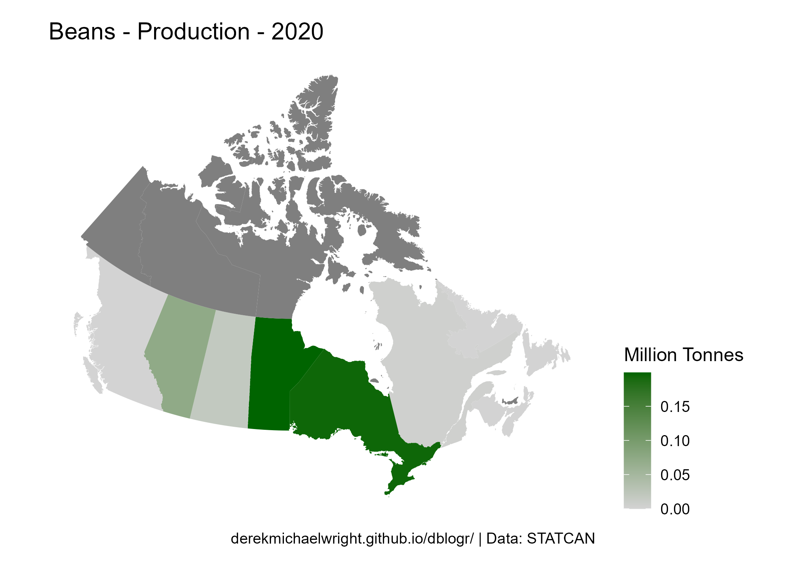
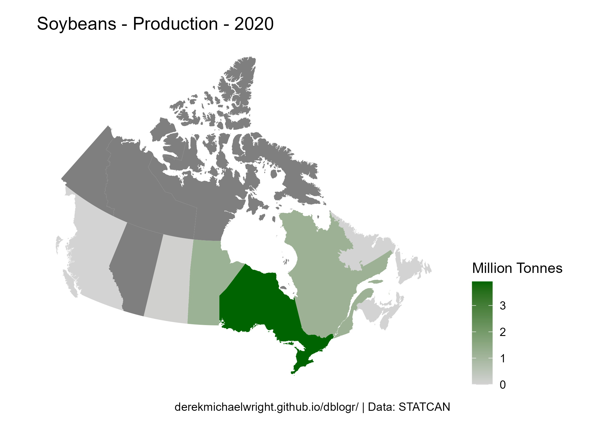

```{r setup, include = FALSE}
knitr::opts_chunk$set(echo = T, message = F, warning = F)
```

---

# Data

`r shiny::icon("globe")` https://www150.statcan.gc.ca/t1/tbl1/en/cv.action?pid=3210035901

`r shiny::icon("save")` [agData_STATCAN_Crops.csv](https://github.com/derekmichaelwright/agData/raw/master/Data/agData_STATCAN_Crops.csv)

```{r class.source = 'fold-show'}
# devtools::install_github("derekmichaelwright/agData")
library(agData)
library(mapcan)
```

---

# Prepare Data

```{r}
# Plotting functions
cropMapCan_Production <- function(crop, year) {
  xx <- agData_STATCAN_Crops %>% 
    filter(Crop == crop, Year == year, Measurement == "Production")
  xx <- mapcan(boundaries = province, type = standard) %>% 
    left_join(xx, by = c("pr_english"="Area"))
  # Plot
  ggplot(xx, aes(x = long, y = lat, group = group, fill = Value / 1000000)) +
    geom_polygon() + 
    coord_fixed() + 
    theme_mapcan() +
    scale_fill_continuous(name = "Million Tonnes",
                          low = "lightgrey", high = "darkgreen") +
    theme(legend.position = "right") +
    labs(title = paste(crop, "Production", year, sep = " - "),
         caption = myCaption)
}
#
myCaption <- "www.dblogr.com/ or derekmichaelwright.github.io/dblogr/ | Data: STATCAN"
```

---

# PDF - All Crops

`r shiny::icon("file-pdf")` [figures_crops_canada_maps_statcan.pdf](figures_crops_canada_maps_statcan.pdf)

```{r results="hide"}
# Prep data
xx <- agData_STATCAN_Crops
# Plot
pdf("figures_crops_canada_maps_statcan.pdf", width = 6, height = 4)
for(i in unique(xx$Crop)) {
  xi <- xx %>% 
    filter(Crop == i, Year == 2020, Measurement == "Production") 
  xi <- mapcan(boundaries = province, type = standard) %>% 
    left_join(xi, by = c("pr_english"="Area"))
  print(ggplot(xi, aes(x = long, y = lat, group = group, 
                       fill = Value / 1000000)) +
          geom_polygon() + 
          coord_fixed() + 
          theme_mapcan() +
          scale_fill_continuous(name = "Million Tonnes", 
                                low = "lightgrey", high = "darkgreen") +
          theme(legend.position = "right") + 
          labs(title = paste(i, "- Production -", 2020),
               caption = "\u00A9 derekmichaelwright.github.io/dblogr/ | Data: STATCAN")
        ) 
}
dev.off()
```

---

# Production

## Wheat


```{r}
# Plot
mp <- cropMapCan_Production("Wheat", 2020)
ggsave("maps_crops_canada_wheat.png", mp, width = 6, height = 4, bg = "white")
```

```{r echo = F}
ggsave("featured.png", mp, width = 6, height = 4, bg = "white")
```

---

## Canola


```{r}
# Plot
mp <- cropMapCan_Production("Canola", 2020)
ggsave("maps_crops_canada_canola.png", mp, width = 6, height = 4, bg = "white")
```

---

## Barley


```{r}
# Plot
mp <- cropMapCan_Production("Barley", 2020)
ggsave("maps_crops_canada_barley.png", mp, width = 6, height = 4, bg = "white")
```

---

## Peas


```{r}
# Plot
mp <- cropMapCan_Production("Peas", 2020)
ggsave("maps_crops_canada_peas.png", mp, width = 6, height = 4, bg = "white")
```

---

## Oats



```{r}
# Plot
mp <- cropMapCan_Production("Oats", 2020)
ggsave("maps_crops_canada_oats.png", mp, width = 6, height = 4, bg = "white")
```

---

## Lentils



```{r}
# Plot
mp <- cropMapCan_Production("Lentils", 2020)
ggsave("maps_crops_canada_lentils.png", mp, width = 6, height = 4, bg = "white")
```

---

## Beans



```{r}
# Plot
mp <- cropMapCan_Production("Beans", 2020)
ggsave("maps_crops_canada_beans.png", mp, width = 6, height = 4, bg = "white")
```

---

## Chickpeas


```{r}
# Plot
mp <- cropMapCan_Production("Chick peas", 2020)
ggsave("maps_crops_canada_chickpeas.png", mp, width = 6, height = 4, bg = "white")
```

---

## Soybeans



```{r}
# Plot
mp <- cropMapCan_Production("Soybeans", 2020)
ggsave("maps_crops_canada_soybeans.png", mp, width = 6, height = 4, bg = "white")
```

---
