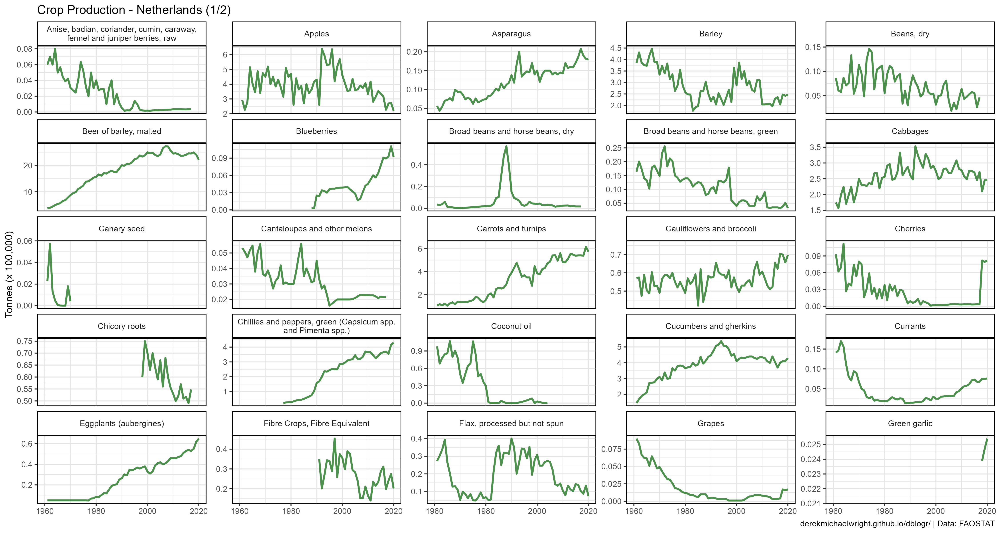
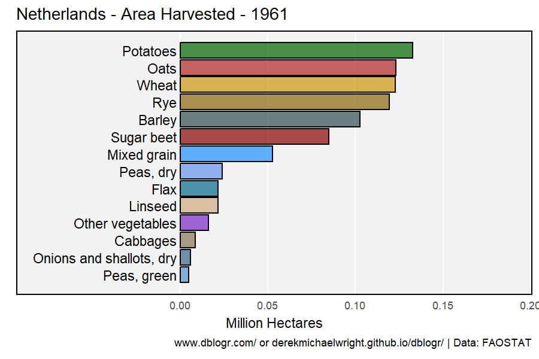

```{r setup, include = FALSE}
knitr::opts_chunk$set(echo = T, message = F, warning = F)
```

---

# Data

> - `r shiny::icon("globe")` http://www.fao.org/faostat/en/#data/QC
> - `r shiny::icon("save")` [agData_FAO_Crops.csv.gz](https://github.com/derekmichaelwright/agData/raw/master/Data/agData_FAO_Crops.csv.gz)

---

# Prepare Data

```{r class.source = 'fold-show'}
# devtools::install_github("derekmichaelwright/agData")
library(agData) 
library(ggforce)
library(gganimate)
```

```{r}
myCaption <- "www.dblogr.com/ or derekmichaelwright.github.io/dblogr/ | Data: FAOSTAT"
```

---

# PDF - All Netherland Crops

> - `r shiny::icon("file-pdf")` [figures_crops_netherlands_fao.pdf](figures_crops_netherlands_fao.pdf)

```{r results="hide"}
# Prep data
myColors <- c("darkgreen", "darkred", "darkgoldenrod2")
xx <- agData_FAO_Crops %>% 
  filter(Area == "Netherlands") %>%
   mutate(Value = ifelse(Measurement %in% c("Area Harvested", "Production"),
                        Value / 1000000, Value / 1000),
         Unit = plyr::mapvalues(Unit, c("hectares", "tonnes", "kg/ha"), 
                  c("Million Hectares", "Million Tonnes", "Tonnes/ Hectare")))
myCrops <- unique(xx$Item)
# Plot
pdf("figures_crops_netherlands_fao.pdf", width = 12, height = 4)
for(i in myCrops) {
  xi <- xx %>% filter(Item == i)
  print(ggplot(xi, aes(x = Year, y = Value, color = Measurement)) +
    geom_line(size = 1.5, alpha = 0.7) +
    facet_wrap(. ~ Measurement + Unit, scales = "free_y", ncol = 3) +
    scale_color_manual(values = myColors) +
    scale_x_continuous(breaks = seq(1960, 2020, by = 5) ) +
    theme_agData(legend.position = "none", 
                 axis.text.x = element_text(angle = 45, hjust = 1)) +
    labs(title = i, y = NULL, x = NULL, caption = myCaption) )
}
dev.off()
```

---

# All Netherland Crops

```{r}
# Prep data
xx <- agData_FAO_Crops %>% 
  filter(Area == "Netherlands", Measurement == "Production")
# Plot
ggcropplot <- function(x) {
  ggplot(xx, aes(x = Year, y = Value / 100000)) + 
  geom_line(size = 1, color = "darkgreen", alpha = 0.7) + 
  scale_x_continuous(limits       =   c(1960, 2020),
                     breaks       = seq(1960, 2020, 20), 
                     minor_breaks = seq(1960, 2020, 10)) +
  theme_agData() +
  theme(legend.position = "none") +
  labs(caption = myCaption, y = "Tonnes (x 100,000)", x = NULL)
}
```

```{r}
# Plot
mp1 <- ggcropplot(xx) + 
  facet_wrap_paginate(Item ~ ., scales = "free_y", labeller = label_wrap_gen(width = 45), 
                      ncol = 5, nrow = 5, page = 1) +
  labs(title = "Crop Production - Netherlands (1/2)")
mp2 <- ggcropplot(xx) +
  facet_wrap_paginate(Item ~ ., scales = "free_y", labeller = label_wrap_gen(width = 45),
                      ncol = 5, nrow = 5, page = 2) +
  labs(title = "Crop Production - Netherlands (2/2)")
ggsave("crops_netherlands_01.png", mp1, width = 15, height = 8)
ggsave("crops_netherlands_02.png", mp2, width = 15, height = 8)
```




---

# Netherlands vs Europe


```{r}
# Prep data
myCrops <- c("Potatoes", "Sugar beet", "Wheat", "Tomatoes", "Carrots and turnips",
             "Onions and shallots, dry (excluding dehydrated)")
xx <- agData_FAO_Crops %>% 
  filter(Area %in% c("Netherlands", "Europe"), Item %in% myCrops,
         Measurement == "Yield") %>%
  mutate(Area = factor(Area, levels = c("Netherlands", "Europe")),
         Item = plyr::mapvalues(Item, myCrops[6], "Onions"))
# Plot
mp <- ggplot(xx, aes(x = Year, y = Value / 1000, color = Area)) +
  geom_line(alpha = 0.7, size = 1.5) +
  facet_wrap(Item ~ ., scales = "free_y", ncol = 3) + 
  scale_color_manual(name = NULL, values = c("darkgreen", "darkblue")) +
  scale_x_continuous(breaks = seq(1960, 2020, 10), minor_breaks = NULL) +
  theme_agData(legend.position = "bottom") +
  labs(title = "Yields in Netherlands and Europe",
       x = NULL, y = "Tonnes / Hectare", caption = myCaption)
ggsave("crops_netherlands_03.png", mp, width = 10, height = 6)
```

```{r echo = F}
ggsave("featured.png", mp, width = 10, height = 6)
```

---

# Bar Chart Racer

## Production


```{r}
# Prep data
fnames <- paste(", fresh n.e.c.", " \\(excluding dehydrated)",
               " \\(Capsicum spp. and Pimenta spp.)", ", crude", sep = "|")
xx <- agData_FAO_Crops %>% 
    filter(Area == "Netherlands", Measurement == "Production",
           !Item %in% c("Watermelons")) %>% 
  group_by(Item) %>%
  mutate(Value = movingAverage(Value, n = 3)) %>%
  group_by(Year) %>%
  arrange(Year, -Value) %>%
  mutate(Rank = 1:n()) %>%
  filter(Rank < 15) %>% 
  arrange(desc(Year)) %>%
  mutate(Item = gsub(fnames, "", Item)) %>%
  mutate(Item = factor(Item, levels = unique(.$Item)),
         Value = Value / 1000000)
# Plot
mp <- ggplot(xx, aes(xmin = 0, xmax = Value, 
                     ymin = Rank - 0.45, ymax = Rank + 0.45, y = Rank, 
                     fill = Item)) + 
  geom_rect(alpha = 0.7, color = "black") + 
  scale_fill_manual(values = agData_Colors) +
  scale_x_continuous(limits = c(-4,max(xx$Value)),
                     breaks = seq(0, 10, by = 1),
                     minor_breaks = seq(0, 10, by = 50.)) +
  geom_text(aes(label = Item), col = "black", hjust = 1, x = -0.1) +
  scale_y_reverse() +
  theme_agData(legend.position = "none",
               axis.text.y = element_blank(), 
               axis.ticks = element_blank(),
               panel.grid.major.y = element_blank(),
               panel.grid.minor.y = element_blank()) + 
  labs(title = paste("Netherlands - Production -", "{frame_time}"),
       x = "Million Tonnes (3 year moving average)", 
       y = NULL, caption = myCaption) +
  transition_time(Year) 
anim_save("crops_netherlands_gif_01.gif", mp,
          nframes = 600, fps = 30, end_pause = 150, 
          width = 900, height = 600, res = 150, units = "px")
```

---

## Area Harvested



```{r}
# Prep data
fnames <- paste(", fresh n.e.c.", " \\(excluding dehydrated)",
                " \\(Capsicum spp. and Pimenta spp.)", " and horse beans",
                ", processed but not spun", ", Fibre Equivalent", sep = "|")
xx <- agData_FAO_Crops %>% 
    filter(Area == "Netherlands", 
           Measurement == "Area Harvested") %>% 
  group_by(Year) %>%
  arrange(Year, -Value) %>%
  mutate(Rank = 1:n()) %>%
  filter(Rank < 15) %>% 
  arrange(desc(Year)) %>%
  mutate(Item = gsub(fnames, "", Item)) %>%
  mutate(Item = factor(Item, levels = unique(.$Item)),
         Value = Value / 1000000)
# Plot
mp <- ggplot(xx, aes(xmin = 0, xmax = Value, 
                     ymin = Rank - 0.45, ymax = Rank + 0.45, y = Rank, 
                     fill = Item)) + 
  geom_rect(alpha = 0.7, color = "black") + 
  scale_fill_manual(values = agData_Colors) +
  scale_x_continuous(limits = c(-0.08,max(xx$Value)),
                     breaks = seq(0, 0.2, by = 0.05),
                     minor_breaks = seq(0, 0.2, by = 0.05)) +
  geom_text(aes(label = Item), col = "black", hjust = 1, x = -0.002) +
  scale_y_reverse() +
  theme_agData(legend.position = "none",
               axis.text.y = element_blank(), 
               axis.ticks = element_blank(),
               panel.grid.major.y = element_blank(),
               panel.grid.minor.y = element_blank()) + 
  labs(title = paste("Netherlands - Area Harvested -", "{frame_time}"),
       x = "Million Hectares", y = NULL, caption = myCaption) +
  transition_time(Year) 
anim_save("crops_netherlands_gif_02.gif", mp,
          nframes = 600, fps = 30, end_pause = 150, 
          width = 900, height = 600, res = 150, units = "px")
```

---
