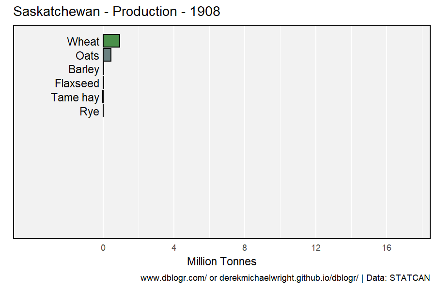
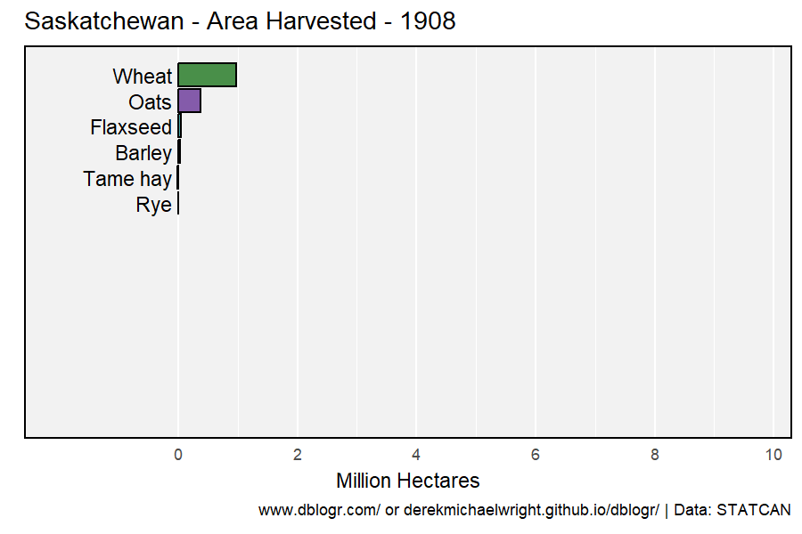

```{r setup, include = FALSE}
knitr::opts_chunk$set(echo = T, message = F, warning = F)
```

---

# Data

`r shiny::icon("globe")` https://www150.statcan.gc.ca/t1/tbl1/en/cv.action?pid=3210035901

`r shiny::icon("save")` [agData_STATCAN_Crops.csv](https://github.com/derekmichaelwright/agData/raw/master/Data/agData_STATCAN_Crops.csv)

```{r class.source = 'fold-show'}
# devtools::install_github("derekmichaelwright/agData")
library(agData)
library(treemapify)
library(gganimate)
myCaption <- "derekmichaelwright.github.io/dblogr/ | Data: STATCAN"
```

---

# PDF - All Crops

`r shiny::icon("file-pdf")` [figures_crops_saskatchewan_statcan.pdf](figures_crops_saskatchewan_statcan.pdf)

```{r results="hide"}
# Prep data
myColors <- c("darkgreen", "darkorange", "darkred", 
              "antiquewhite4", "steelblue", "darkblue")
myMeasures <- c("Area Seeded", "Area Harvested", "Production", 
                "Yield", "Average Farm Price", "Total Farm Value")
xx <- agData_STATCAN_Crops %>% 
  filter(Area == "Saskatchewan") %>%
  mutate(Measurement = factor(Measurement, levels = myMeasures),
         Value = ifelse(Measurement != "Yield",
                        Value / 1000000, Value / 1000),
         Unit = plyr::mapvalues(Unit, c("Hectares", "Tonnes", "kg/ha"), 
                  c("Million Hectares", "Million Tonnes", "Tonnes/ Hectare")))
myCrops <- unique(xx$Crop)
# Plot
pdf("figures_crops_saskatchewan_statcan.pdf", width = 10, height = 6)
for(i in myCrops) {
  xi <- xx %>% filter(Crop == i)
  print(ggplot(xi, aes(x = Year, y = Value, color = Measurement)) +
    geom_line(size = 1.5, alpha = 0.7) +
    facet_wrap(. ~ Measurement, scales = "free_y", ncol = 3) +
    scale_color_manual(values = myColors) +
    scale_x_continuous(breaks = seq(1920, 2020, by = 20) ) +
    theme_agData(legend.position = "none", 
                 axis.text.x = element_text(angle = 45, hjust = 1)) +
    labs(title = i, y = NULL, x = NULL, caption = myCaption) )
}
dev.off()
```

---

# 1908 Vs. 1961 Vs. 2020

```{r}
# Create function to determine top crops
cropList <- function(measurement, years) {
  # Prep data
  xx <- agData_STATCAN_Crops %>% 
    filter(Area == "Saskatchewan", Measurement == measurement, Year %in% years) 
  # Get top 15 crops from each year
  topcrops <- function(x, year) {
    x <- x %>% filter(Year == year) %>% arrange(desc(Value)) %>% 
      pull(Crop) %>% unique() %>% as.character()
  }
  myCrops <- NULL
  for(i in years) { myCrops <- c(myCrops, topcrops(xx, i)) }
  unique(myCrops)
}
```

---

## Production


```{r}
# Prep data
myCrops <- cropList(measurement = "Production", years = c(2020, 1961, 1908))
xx <- agData_STATCAN_Crops %>% 
  filter(Area == "Saskatchewan", Year %in% c(2020, 1961, 1908),
         Measurement == "Production", Crop %in% myCrops) %>%
  mutate(Crop = factor(Crop, levels = myCrops) )
# Plot
mp <- ggplot(xx, aes(x = Crop, y = Value / 1000000, fill = Crop)) + 
  geom_bar(stat = "identity", color = "Black", alpha = 0.7) + 
  facet_grid(Year ~ .) + 
  scale_fill_manual(values = agData_Colors) +
  theme_agData(legend.position = "none", 
               axis.text.x = element_text(angle = 45, hjust = 1)) + 
  labs(title = "Saskatchewan - Crop Production", 
       y = "Million Tonnes", x = NULL, caption = myCaption)
ggsave("crops_saskatchewan_01.png", mp, width = 6, height = 5)
```

---

## Area Seeded


```{r}
# Prep data
myCrops <- cropList(measurement = "Area Seeded", years = c(2020, 1961, 1908))
xx <- agData_STATCAN_Crops %>% 
  filter(Area == "Saskatchewan", Year %in% c(2020, 1961, 1908),
         Measurement == "Area Seeded", Crop %in% myCrops) %>%
  mutate(Crop = factor(Crop, levels = myCrops) )
# Plot
mp <- ggplot(xx, aes(x = Crop, y = Value / 1000000, fill = Crop)) + 
  geom_bar(stat = "identity", color = "Black", alpha = 0.7) + 
  facet_grid(Year ~ .) + 
  scale_fill_manual(values = agData_Colors) +
  theme_agData(legend.position = "none", 
               axis.text.x = element_text(angle = 45, hjust = 1)) + 
  labs(title = "Saskatchewan - Area Seeded", x = NULL,
       y = "Million Hectares", caption = myCaption)
ggsave("crops_saskatchewan_02.png", mp, width = 6, height = 5)
```

```{r echo = F}
ggsave("featured.png", mp, width = 6, height = 5)
```

---

## Yields


```{r}
# Prep data
myCrops <- cropList(measurement = "Yield", years = c(2020, 1961, 1908))[-1]
xx <- agData_STATCAN_Crops %>% 
  filter(Area == "Saskatchewan", Year %in% c(2020, 1961, 1908),
         Measurement == "Yield", Crop %in% myCrops) %>%
  mutate(Crop = factor(Crop, levels = myCrops) )
# Plot
mp <- ggplot(xx, aes(x = Crop, y = Value / 1000, fill = Crop)) + 
  geom_bar(stat = "identity", color = "Black", alpha = 0.7) + 
  facet_grid(Year ~ .) + 
  scale_fill_manual(values = agData_Colors) +
  theme_agData(legend.position = "none", 
               axis.text.x = element_text(angle = 45, hjust = 1)) + 
  labs(title = "Saskatchewan - Yield", x = NULL, 
       y = "Tonnes / Hectare", caption = myCaption)
ggsave("crops_saskatchewan_03.png", mp, width = 6, height = 5)
```

---

# Bar Chart Racer

## Production



```{r}
# Prep data
xx <- agData_STATCAN_Crops %>% 
    filter(Area == "Saskatchewan", !Crop %in% c("Hemp","Sugar beets"),
           Measurement == "Production") %>% 
  group_by(Crop) %>%
  mutate(Value = movingAverage(Value, n = 3)) %>%
  group_by(Year) %>%
  arrange(Year, -Value) %>%
  mutate(Rank = 1:n()) %>%
  filter(Rank < 15) %>% 
  arrange(desc(Year)) %>%
  mutate(Crop = factor(Crop, levels = unique(.$Crop)))
# Plot
mp <- ggplot(xx, aes(xmin = 0, xmax = Value / 1000000, 
                     ymin = Rank - 0.45, ymax = Rank + 0.45, y = Rank, 
                     fill = Crop)) + 
  geom_rect(alpha = 0.7, color = "black") + 
  scale_fill_manual(values = agData_Colors) +
  scale_x_continuous(limits = c(-4,max(xx$Value)/1000000),
                     breaks = seq(0, 18, by = 4),
                     minor_breaks = seq(0, 18, by = 2)) +
  geom_text(aes(label = Crop), col = "black", hjust = 1, x = -0.2) +
  scale_y_reverse() +
  theme_agData(legend.position = "none",
               axis.text.y = element_blank(), 
               axis.ticks = element_blank(),
               panel.grid.major.y = element_blank(),
               panel.grid.minor.y = element_blank()) + 
  labs(title = paste("Saskatchewan - Production -", "{frame_time}"),
       x = "Million Tonnes", y = NULL, caption = myCaption) +
  transition_time(Year) 
anim_save("crops_saskatchewan_gif_01.gif", mp,
          nframes = 600, fps = 20, end_pause = 60, 
          width = 900, height = 600, res = 150)
```

---

## Seeded Area



```{r}
# Prep data
xx <- agData_STATCAN_Crops %>% 
    filter(Area == "Saskatchewan", 
           Measurement == "Area Seeded") %>% 
  group_by(Year) %>%
  arrange(Year, -Value) %>%
  mutate(Rank = 1:n()) %>%
  filter(Rank < 15) %>% 
  arrange(desc(Year)) %>%
  mutate(Crop = factor(Crop, levels = unique(.$Crop)))
# Plot
mp <- ggplot(xx, aes(xmin = 0, xmax = Value / 1000000, 
                     ymin = Rank - 0.45, ymax = Rank + 0.45, y = Rank, 
                     fill = Crop)) + 
  geom_rect(alpha = 0.7, color = "black") + 
  scale_fill_manual(values = agData_Colors) +
  scale_x_continuous(limits = c(-2,max(xx$Value)/1000000),
                     breaks = seq(0, 10, by = 2),
                     minor_breaks = seq(0, 10, by = 1)) +
  geom_text(aes(label = Crop), col = "black", hjust = 1, x = -0.1) +
  scale_y_reverse() +
  theme_agData(legend.position = "none",
               axis.text.y = element_blank(), 
               axis.ticks = element_blank(),
               panel.grid.major.y = element_blank(),
               panel.grid.minor.y = element_blank()) + 
  labs(title = paste("Saskatchewan - Area Harvested -", "{frame_time}"),
       x = "Million Hectares", y = NULL, caption = myCaption) +
  transition_time(Year) 
anim_save("crops_saskatchewan_gif_02.gif", mp,
          nframes = 600, fps = 20, end_pause = 60, 
          width = 900, height = 600, res = 150)
```

---

# Top 10


```{r}
# Prep data
myCrops <- cropList(measurement = "Production", years = 2020)[c(1:8)]
myCrops <- c(myCrops, "Other")
x1 <- agData_STATCAN_Crops %>% 
  filter(Area == "Saskatchewan",
         Measurement == "Production", 
         Crop %in% myCrops) 
x2 <- agData_STATCAN_Crops %>% 
  filter(Area == "Saskatchewan",
         Measurement == "Production", 
         !Crop %in% myCrops) %>%
  group_by(Year) %>%
  summarise(Value = sum(Value, na.rm = T)) %>%
  ungroup() %>%
  mutate(Crop = "Other")
xx <- bind_rows(x1, x2) %>%
  mutate(Crop = factor(Crop, levels = rev(myCrops)))
# Plot
mp <- ggplot(xx, aes(x = Year, y = Value / 1000000, fill = Crop)) + 
  geom_bar(stat = "identity", alpha = 0.7, color = "black", lwd = 0.1) + 
  scale_fill_manual(name = NULL, values = agData_Colors[c(9:1)]) +
  scale_x_continuous(breaks = seq(1910, 2020, by =10)) +
  theme_agData() + 
  labs(title = "Saskatchewan - Crop Production", 
       y = "Million Tonnes", x = NULL, caption = myCaption)
ggsave("crops_saskatchewan_04.png", mp, width = 6, height = 4)
```

---

# 2020 vs 2021


```{r}
# Prep data
xx <- xx %>% filter(Year %in% c(2020, 2021)) %>%
  mutate(Crop = factor(Crop, levels = myCrops),
         Year = factor(Year))
# Plot
mp <- ggplot(xx, aes(x = Crop, y = Value / 1000000, 
                     fill = Crop, alpha = Year)) + 
  geom_bar(stat = "identity", position = "dodge", color = "black") + 
  scale_fill_manual(values = agData_Colors, guide = F) +
  scale_alpha_manual(name = NULL, values = c(0.7, 0.3)) +
  theme_agData(legend.position = "bottom") + 
  labs(title = "Saskatchewan - Crop Production - 2020 vs. 2021", 
       y = "Million Tonnes", x = NULL, caption = myCaption)
ggsave("crops_saskatchewan_05.png", mp, width = 6, height = 4)
```

---

# Droughts


```{r}
# Prep data
myCrops <- cropList(measurement = "Production", years = 2020)[c(1:8)]
myCrops <- c(myCrops, "Other")
myYears <- c(1935,1936,1937,1938,1939, 1952,1953,1954,1955,1956, 
             1959,1960,1961,1962,1963, 1986,1987,1988,1989,1990, 
             2000,2001,2002,2003,2004, 2019,2020,2021,2022,2023)
myGroups <- c(rep(1:6, each = 5))
x1 <- agData_STATCAN_Crops %>% 
  filter(Area == "Saskatchewan",
         Measurement == "Production", 
         Crop %in% myCrops) 
x2 <- agData_STATCAN_Crops %>% 
  filter(Area == "Saskatchewan",
         Measurement == "Production", 
         !Crop %in% myCrops) %>%
  group_by(Year) %>%
  summarise(Value = sum(Value, na.rm = T)) %>%
  ungroup() %>%
  mutate(Crop = "Other")
xx <- bind_rows(x1, x2) %>%
  filter(Year %in% myYears) %>%
  mutate(Crop = factor(Crop, levels = rev(myCrops)),
         Group = plyr::mapvalues(Year, myYears, myGroups))
# Plot
mp <- ggplot(xx, aes(x = Year, y = Value / 1000000, fill = Crop)) + 
  geom_bar(stat = "identity", alpha = 0.7, color = "black", lwd = 0.3) + 
  facet_wrap(Group ~ . , ncol = 6, scales = "free") +
  scale_fill_manual(name = NULL, values = agData_Colors[c(9:1)]) +
  theme_agData(axis.text.x = element_text(angle = 45, hjust = 1),
               strip.text = element_blank()) + 
  labs(title = "Saskatchewan - Drought Years", x = NULL,
       y = "Million Tonnes", caption = myCaption)
ggsave("crops_saskatchewan_06.png", mp, width = 8, height = 4)
```

---

# Yields 2020


```{r}
# Prep data
myCrops <- cropList(measurement = "Yield", years = 2020)[-1]
xx <- agData_STATCAN_Crops %>% 
  filter(Area == "Saskatchewan", Year == 2020,
         Measurement == "Yield", Crop %in% myCrops) %>%
  mutate(Crop = factor(Crop, levels = myCrops) )
# Plot
mp <- ggplot(xx, aes(x = Crop, y = Value / 1000, fill = Crop)) + 
  geom_bar(stat = "identity", color = "Black", alpha = 0.7) + 
  facet_grid(Year ~ .) + 
  scale_fill_manual(values = agData_Colors) +
  theme_agData(legend.position = "none", 
               axis.text.x = element_text(angle = 45, hjust = 1)) + 
  labs(title = "Saskatchewan - Crop yields", 
       y = "Tonnes / Hectare", x = NULL, caption = myCaption)
ggsave("crops_saskatchewan_07.png", mp, width = 6, height = 5)
```

---

# Per Person


```{r}
# Prep data
pp <- agData_STATCAN_Population %>% 
  filter(Month == 1, Area == "Saskatchewan", Year == 2020) %>%
  pull(Value)
myCrops <- cropList(measurement = "Production", years = 2020)
xx <- agData_STATCAN_Crops %>% 
  filter(Area == "Saskatchewan", Year %in% 2020,
         Measurement == "Production", Crop %in% myCrops) %>%
  mutate(Crop = factor(Crop, levels = myCrops),
         PerPerson = Value / pp)
# Plot
mp <- ggplot(xx, aes(x = Crop, y = PerPerson, fill = Crop)) + 
  geom_bar(stat = "identity", color = "Black", alpha = 0.7) + 
  geom_label(aes(label = round(PerPerson,1)), vjust = -0.1, fill = "White",
             size = 2.5, label.padding = unit(0.15, "lines")) +
  facet_grid(Year~.) + 
  scale_y_continuous(limits = c(0,15), expand = c(0,0)) +
  scale_fill_manual(values = agData_Colors) +
  theme_agData(legend.position = "none", 
               axis.text.x = element_text(angle = 45, hjust = 1)) + 
  labs(title = "Saskatchewan - Crop Production Per Person", 
       y = "1000 kg", x = NULL, caption = myCaption)
ggsave("crops_saskatchewan_08.png", mp, width = 6, height = 4)
```

---

# All Crops

## Area Seeded


```{r}
# Prep data
xx <- agData_STATCAN_Crops %>% 
  filter(Area == "Saskatchewan", Measurement == "Area Seeded") 
myCrops <- unique(c(cropList(measurement = "Area Seeded", years = 2017), 
                    as.character(xx$Crop)))
xx <- xx %>% mutate(Crop = factor(Crop, levels = myCrops))
# Plot
mp <- ggplot(xx, aes(x = Year, y = Value / 1000000, color = Crop)) + 
  geom_line(alpha = 0.7) + 
  facet_wrap(Crop ~ ., ncol = 6) + 
  scale_color_manual(values = agData_Colors) +
  theme_agData(legend.position = "none", 
               axis.text.x = element_text(angle = 45, hjust = 1)) + 
  labs(title = "Saskatchewan Crops - Area Seeded", 
       y = "Million Hectares", x = NULL, caption = myCaption)
ggsave("crops_saskatchewan_09.png", mp, width = 6, height = 5)
```

---

## Production


```{r}
# Prep data
xx <- agData_STATCAN_Crops %>% 
  filter(Area == "Saskatchewan", Measurement == "Production") 
myCrops <- unique(c(cropList(measurement = "Production", years = 2017), 
                    as.character(xx$Crop)))
xx <- xx %>% mutate(Crop = factor(Crop, levels = myCrops))
# Plot
mp <- ggplot(xx, aes(x = Year, y = Value / 1000000, color = Crop)) + 
  geom_line(alpha = 0.7) + 
  facet_wrap(Crop ~ ., ncol = 6) + 
  scale_color_manual(values = agData_Colors) +
  theme_agData(legend.position = "none", 
               axis.text.x = element_text(angle = 45, hjust = 1)) + 
  labs(title = "Saskatchewan Crops - Production", 
       y = "Million Hectares", x = NULL, caption = myCaption)
ggsave("crops_saskatchewan_10.png", mp, width = 6, height = 5)
```

---

# Treemap


```{r}
# Prep data
xx <- agData_STATCAN_Crops %>% 
  filter(Area == "Saskatchewan", Year == 2020, 
         Measurement == "Area Seeded") %>%
  arrange(desc(Value)) %>%
  mutate(Crop = factor(Crop, levels = unique(.$Crop)))
# Plot
mp <- ggplot(xx, aes(area = Value, fill = Crop, label = Crop)) +
  geom_treemap(color = "black", alpha = 0.7, size = 1.5) +
  geom_treemap_text(place = "centre", grow = T, color = "white") +
  scale_fill_manual(values = agData_Colors) +
  theme_agData(legend.position = "none") +
  labs(title = "Saskatchewan Cropland", 
       subtitle = "Area Seeded 2020", caption = myCaption)
ggsave("crops_saskatchewan_11.png", mp, width = 6, height = 4)
```

---

## Animation


```{r}
# Prep data
xx <- agData_STATCAN_Crops %>% 
  filter(Area == "Saskatchewan", Measurement == "Area Seeded") %>%
  arrange(desc(Year), desc(Value)) %>% 
  mutate(Crop = factor(Crop, levels = unique(.$Crop)))
# Plot
mp <- ggplot(xx, aes(area = Value, fill = Crop, label = Crop)) +
  geom_treemap(layout = "fixed", color = "black", alpha = 0.7, size = 1.5) +
  geom_treemap_text(layout = "fixed", place = "centre", 
                    grow = T, color = "white") +
  scale_fill_manual(values = agData_Colors) +
  theme_agData(legend.position = "none") +
  labs(title = "Saskatchewan Cropland - Area Seeded",
       subtitle = "Year: {frame_time}", caption = myCaption) +
  transition_time(Year)
anim_save("crops_saskatchewan_gif_03.gif", mp,
          nframes = 600, fps = 20, end_pause = 60, 
          width = 900, height = 600, res = 150)
```

---

# Farm Area


```{r}
# Prep data
xx <- agData_STATCAN_FarmLand_Use %>% 
  filter(Area == "Saskatchewan", Item == "Total area of farms", 
         Unit == "Hectares", !is.na(Value))
# Plot
mp <- ggplot(xx, aes(x = Year, y = Value / 1000000)) + 
  geom_line(color = "darkgreen", size = 1.25, alpha = 0.7) +
  scale_x_continuous(breaks = seq(1920, 2020, 10)) +
  theme_agData() +
  labs(title = "Total area of farms in Saskatchewan", 
       y = "Million Hectares", x = NULL, caption = myCaption)
ggsave("crops_saskatchewan_12.png", mp, width = 6, height = 4)
```

---

# Summerfallow


```{r}
# Prep data
xx <- agData_STATCAN_Crops %>% 
  filter(Area == "Saskatchewan", Crop == "Summerfallow", 
         Measurement == "Area Seeded")
# Plot
mp <- ggplot(xx, aes(x = Year, y = Value / 1000000)) + 
  geom_line(color = "darkgreen", size = 1.25, alpha = 0.7) +
  scale_x_continuous(breaks = seq(1920, 2020, 10)) +
  theme_agData() +
  labs(title = "Summerfallow in Saskatchewan", 
       y = "Million Hectares", x = NULL, caption = myCaption)
ggsave("crops_saskatchewan_13.png", mp, width = 6, height = 4)
```

---

# Activist Graph


```{r}
# Prep data
myColors <- c("darkgoldenrod2","darkgreen","darkred")
x1 <- agData_STATCAN_Crops %>% 
  filter(Area == "Saskatchewan", Measurement == "Production",
         Crop %in% c("Lentils","Peas","Beans","Chickpeas")) %>%
  group_by(Year) %>% 
  summarise(Value = sum(Value)) %>%
  mutate(Crop = "Fake Meat Proteins")
x2 <- agData_STATCAN_Crops %>% 
  filter(Area == "Saskatchewan", Measurement == "Production",
         Crop %in% c("Canola","Wheat")) %>%
  mutate(Crop = plyr::mapvalues(Crop, c("Canola","Wheat"), 
                                      c("Evil GMO Oilseeds","Toxic Gluten")))
xx <- bind_rows(x1, x2) %>% filter(Year < 2021) %>%
  mutate(Crop = factor(Crop, levels = c("Toxic Gluten", "Fake Meat Proteins", 
                                        "Evil GMO Oilseeds")))
# Plot
mp <- ggplot(xx, aes(x = Year, y = Value / 1000000, color = Crop)) +
  geom_line(size = 1.5, alpha = 0.7) +
  scale_color_manual(name = NULL, values = myColors) +
  scale_x_continuous(breaks = seq(1910,2020,10)) +
  theme_agData(legend.position = "bottom") +
  labs(title = "Saskatchewan Industrialized Food Production", 
       y = "Million Tonnes", x = NULL, caption = myCaption)
ggsave("crops_saskatchewan_14.png", mp, width = 6, height = 4)
```

---
