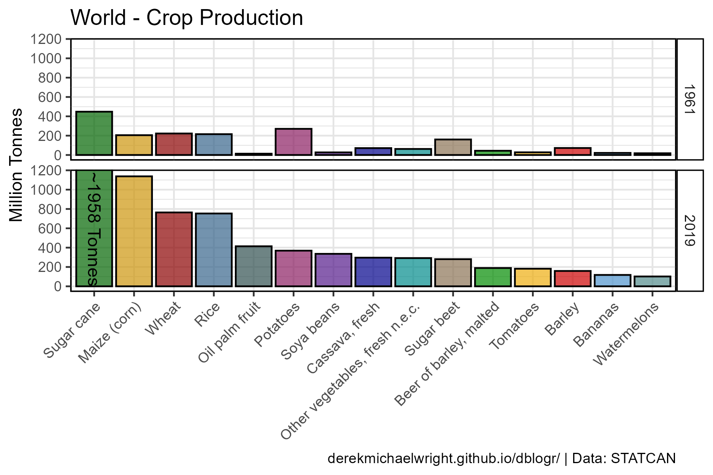

```{r setup, include = FALSE}
knitr::opts_chunk$set(echo = T, message = F, warning = F)
```

---

# Data

> - `r shiny::icon("globe")` [http://www.fao.org/faostat/en/#data/QC](http://www.fao.org/faostat/en/#data/QC){target="_blank"}
> - `r shiny::icon("save")` [agData_FAO_Crops.csv.gz](https://github.com/derekmichaelwright/agData/raw/master/Data/agData_FAO_Crops.csv.gz)

---

# Prepare Data

```{r class.source = "fold-show"}
# devtools::install_github("derekmichaelwright/agData")
library(agData)
library(gganimate)
```

```{r}
myCaption <- "www.dblogr.com/ or derekmichaelwright.github.io/dblogr/ | Data: STATCAN"
#
dd <- agData_FAO_Crops %>% filter(Area == "World")
```

---

# PDF - All Crops

`r shiny::icon("file-pdf")` [figures_crops_world_fao.pdf](figures_crops_world_fao.pdf)

```{r results="hide"}
# Prep data
myColors <- c("darkgreen", "darkred", "darkgoldenrod2")
xx <- dd %>%
  mutate(Value = ifelse(Measurement %in% c("Area Harvested","Production"),
                        Value / 1000000, Value / 1000),
         Unit = plyr::mapvalues(Unit, c("hectares", "tonnes", "kg/ha"), 
                  c("Million Hectares", "Million Tonnes", "Tonnes/ Hectare")))
myCrops <- unique(xx$Crop)
# Plot
pdf("figures_crops_world_fao.pdf", width = 12, height = 4)
for(i in myCrops) {
  xi <- xx %>% filter(Item == i)
  print(ggplot(xi, aes(x = Year, y = Value, color = Measurement)) +
    geom_line(size = 1.5, alpha = 0.7) +
    facet_wrap(. ~ Measurement + Unit, scales = "free_y", ncol = 3) +
    scale_color_manual(values = myColors) +
    scale_x_continuous(breaks = seq(1960, 2020, by = 5) ) +
    theme_agData(legend.position = "none", 
                 axis.text.x = element_text(angle = 45, hjust = 1)) +
    labs(title = i, y = NULL, x = NULL,
         caption = myCaption) )
}
dev.off()
```

---

# 1908 Vs. 1961 Vs. 2020 {.tabset .tabset-pills}

## cropList function

```{r}
# Create function to determine top crops
cropList <- function(measurement, years) {
  # Prep data
  xx <- agData_FAO_Crops %>% 
    filter(Area == "World", Measurement == measurement, Year %in% years,
           Item != "Rice, paddy (rice milled equivalent)") 
  # Get top 15 crops from each year
  topcrops <- function(x, year) {
    x <- x %>% filter(Year == year) %>% arrange(desc(Value)) %>% 
      pull(Item) %>% unique() %>% as.character()
  }
  myCrops <- NULL
  for(i in years) { myCrops <- c(myCrops, topcrops(xx, i)) }
  unique(myCrops)
}
```

---

## Production



```{r}
# Prep data
myCrops <- cropList(measurement = "Production", years = c(2019, 1961))[1:15]
xx <- dd %>% 
    filter(Year %in% c(2019, 1961),
           Measurement == "Production", Item %in% myCrops) %>% 
  mutate(Text = ifelse(Item == "Sugar cane" & Year == 2019, 
                       paste0("~", round(Value / 1000000), " Tonnes"), NA),
         Item = factor(Item, levels = myCrops) )
# Plot
mp <- ggplot(xx, aes(x = Item, y = Value / 1000000, fill = Item)) + 
  geom_col(color = "Black", alpha = 0.7) + 
  geom_text(aes(label = Text), y = 1180, angle = 270, hjust = 0, vjust = 0.5) + 
  facet_grid(Year ~ .) + 
  scale_fill_manual(values = agData_Colors) +
  scale_y_continuous(breaks = seq(0, 1200, by = 200)) +
  coord_cartesian(ylim = c(0,1150)) +
  theme_agData(legend.position = "none", 
               axis.text.x = element_text(angle = 45, hjust = 1)) +
  labs(title = "World - Crop Production", 
       y = "Million Tonnes", x = NULL, caption = myCaption)
ggsave("crops_world_1_01.png", mp, width = 6, height = 4)
```

---

## Area Harvested


```{r}
# Prep data
myCrops <- cropList(measurement = "Area Harvested", years = c(2019, 1961))[1:20]
xx <- dd %>% 
    filter(Year %in% c(2019, 1961),
           Measurement == "Area Harvested", Item %in% myCrops) %>% 
  mutate(Item = factor(Item, levels = myCrops),
         Item = plyr::mapvalues(Item, "Groundnuts, with shell", "Groundnuts"))
# Plot
mp <- ggplot(xx, aes(x = Item, y = Value / 1000000, fill = Item)) + 
  geom_col(color = "Black", alpha = 0.7) + 
  facet_grid(Year ~ .) + 
  scale_fill_manual(values = agData_Colors) +
  theme_agData(legend.position = "none", 
               axis.text.x = element_text(angle = 45, hjust = 1)) +
  labs(title = "World - Area Harvested", 
       y = "Million Hectares", x = NULL, caption = myCaption)
ggsave("crops_world_02.png", mp, width = 6, height = 4)
```

```{r echo = F}
ggsave("featured.png", mp, width = 6, height = 4)
```

---

# Bar Chart Racer {.tabset .tabset-pills}

## Production


```{r}
# Prep data
xx <- dd %>% 
  filter(Measurement == "Production") %>% 
  group_by(Year) %>%
  arrange(Year, -Value) %>%
  mutate(Rank = 1:n()) %>%
  filter(Rank < 15) %>% 
  arrange(desc(Year)) %>%
  mutate(Item = factor(Item, levels = unique(.$Item))) %>% ungroup()
# Plot
mp <- ggplot(xx, aes(xmin = 0, xmax = Value / 1000000, 
                     ymin = Rank - 0.45, ymax = Rank + 0.45, y = Rank, 
                     fill = Item)) + 
  geom_rect(alpha = 0.7, color = "black") + 
  scale_fill_manual(values = agData_Colors) +
  scale_x_continuous(limits = c(-450, max(xx$Value)/1000000), 
                     breaks = seq(0, 2000, by = 500), 
                     minor_breaks = seq(0, 2000, by = 250)) +
  geom_text(aes(label = Item), col = "black", hjust = 1, x = -20) +
  scale_y_reverse() +
  theme_agData(legend.position = "none",
               axis.text.y = element_blank(), 
               axis.ticks = element_blank(),
               panel.grid.major.y = element_blank(),
               panel.grid.minor.y = element_blank()) + 
  labs(title = paste("World - Production -", "{frame_time}"),
       x = "Million Tonnes", y = NULL,
       caption = myCaption) +
  transition_time(Year) 
anim_save("crops_world_gif_01.gif", mp,
          nframes = 600, fps = 25, end_pause = 60, 
          width = 900, height = 600, res = 150, units = "px")
```

---

## Area Harvested


```{r}
# Prep data
xx <- dd %>% 
  filter(Measurement == "Area Harvested") %>% 
  group_by(Year) %>%
  arrange(Year, -Value) %>%
  mutate(Rank = 1:n()) %>%
  filter(Rank < 15) %>% 
  arrange(desc(Year)) %>%
  mutate(Item = gsub(", with shell", "", Item)) %>%
  mutate(Item = factor(Item, levels = unique(.$Item)))
# Plot
mp <- ggplot(xx, aes(xmin = 0, xmax = Value / 1000000, 
                     ymin = Rank - 0.45, ymax = Rank + 0.45, y = Rank, 
                     fill = Item)) + 
  geom_rect(alpha = 0.7, color = "black") + 
  scale_fill_manual(values = agData_Colors) +
  scale_x_continuous(limits = c(-60,max(xx$Value)/1000000), 
                     breaks = seq(0, 250, by = 50),
                     minor_breaks = seq(0, 250, by = 25)) +
  geom_text(aes(label = Item), col = "black", hjust = 1, x = -3) +
  scale_y_reverse() +
  theme_agData(legend.position = "none",
               axis.text.y = element_blank(), 
               axis.ticks = element_blank(),
               panel.grid.major.y = element_blank(),
               panel.grid.minor.y = element_blank()) +
  labs(title = paste("World - Area Harvested -", "{frame_time}"),
       x = "Million Hectares", y = NULL,
       caption = myCaption) +
  transition_time(Year) 
anim_save("crops_world_gif_02.gif", mp,
          nframes = 600, fps = 25, end_pause = 60, 
          width = 900, height = 600, res = 150, units = "px")
```

---

# Area Change


```{r}
# Prep data
xx <- dd %>% 
  filter(Measurement == "Area Harvested") %>% 
  select(-Measurement, -Unit) %>%
  spread(Year, Value) %>%
  gather(Year, Value, 4:ncol(.)) %>%
  mutate(Change = Value - `1961`)
x1 <- xx %>% filter(Year == 2019) %>% top_n(10, Change)
x2 <- xx %>% filter(Year == 2019) %>% top_n(-10, Change)
xx <- bind_rows(x1, x2) %>%
  arrange(desc(Change)) %>%
  mutate(Item = factor(Item, levels = .$Item), 
         Group = ifelse(Change > 0, "Pos", "Neg"))
# Plot
mp <- ggplot(xx, aes(x = Item, y = Change / 1000000, fill = Group)) + 
  geom_bar(stat = "identity", color = "Black", alpha = 0.7) + 
  scale_fill_manual(values = c("darkred", "darkgreen")) +
  theme_agData(legend.position = "none", 
               axis.text.x = element_text(angle = 45, hjust = 1)) +
  labs(title = "Change Since 1961", 
       y = "Million Hectares", x = NULL,
       caption = myCaption)
ggsave("crops_world_2_01.png", mp, width = 6, height = 4)
```

---
