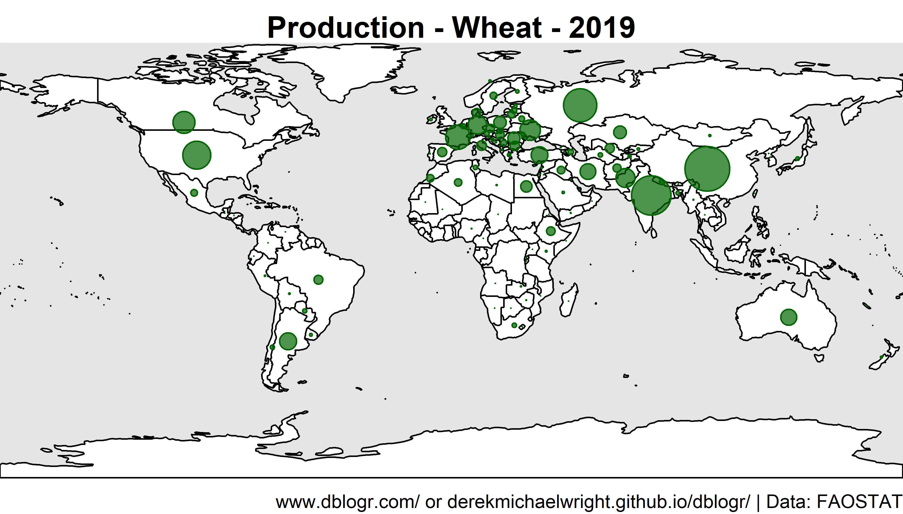
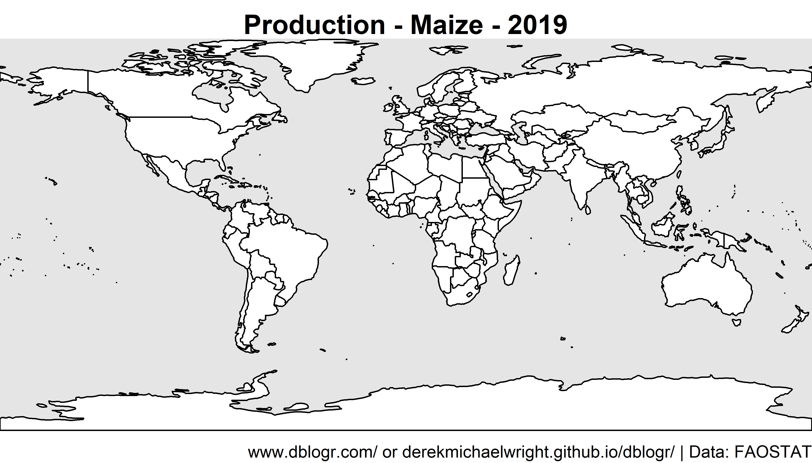
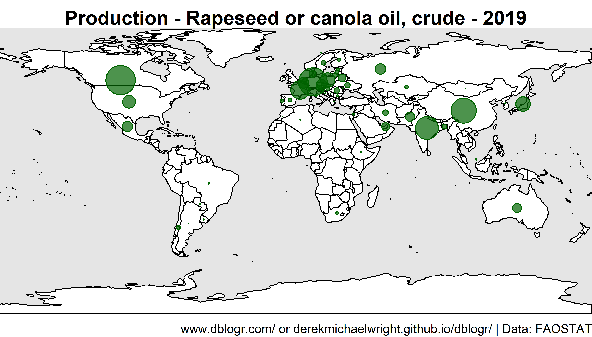
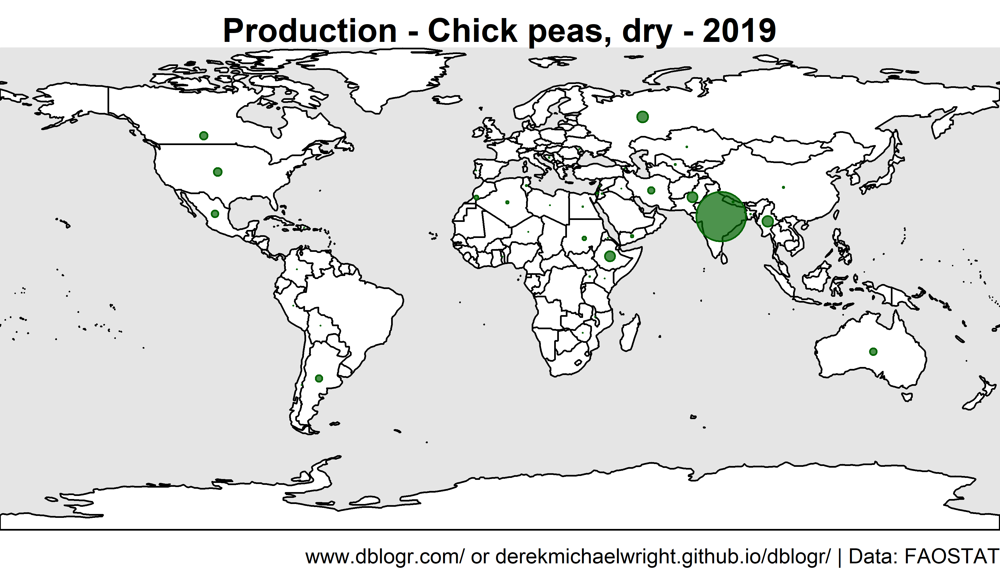
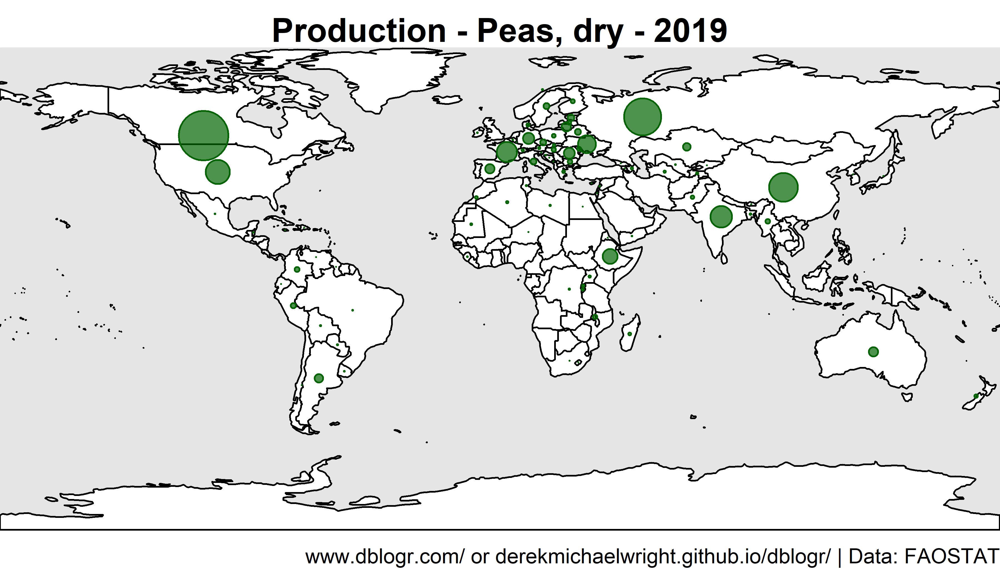
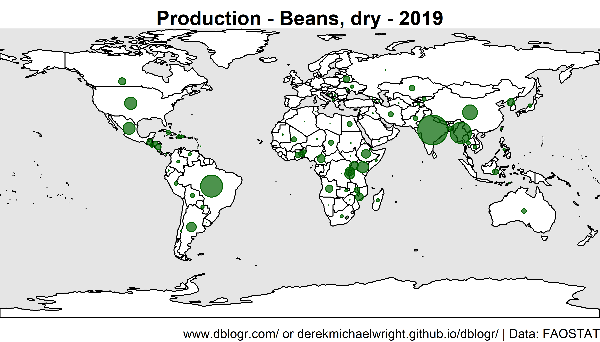
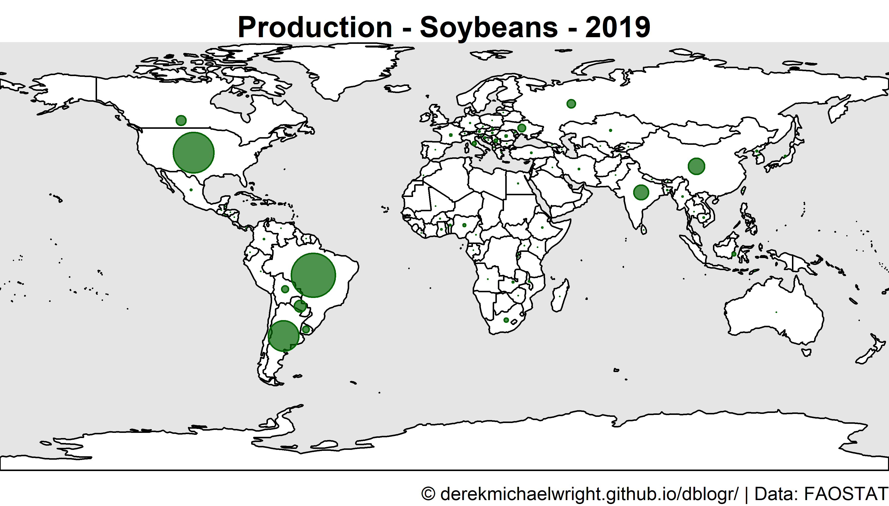
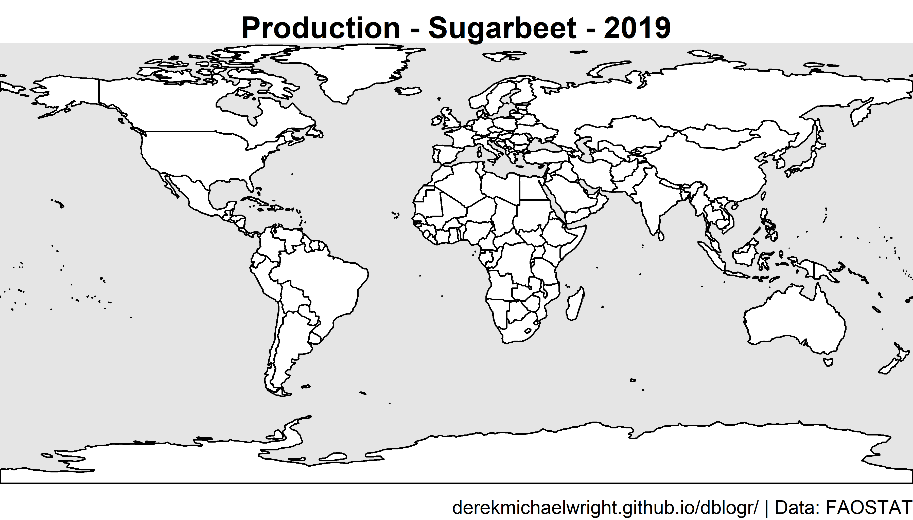
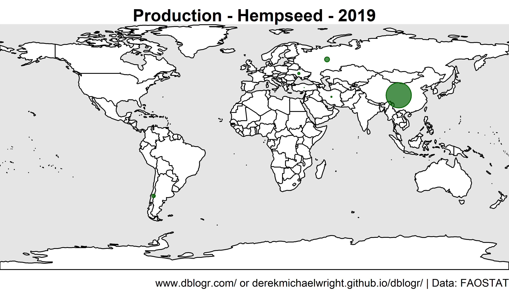
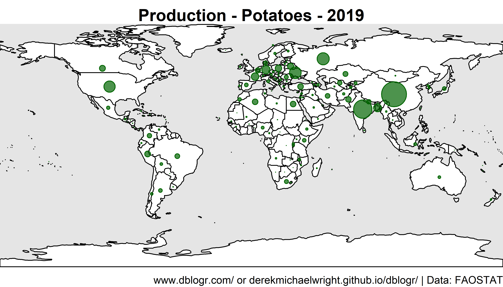

```{r setup, include = FALSE}
knitr::opts_chunk$set(echo = T, message = F, warning = F)
```

---

# Data

`r shiny::icon("globe")` http://www.fao.org/faostat/en/#data/QC

`r shiny::icon("save")` [agData_FAO_Crops.csv.gz](https://github.com/derekmichaelwright/agData/raw/master/Data/agData_FAO_Crops.csv.gz)

```{r class.source = 'fold-show'}
# devtools::install_github("derekmichaelwright/agData")
library(agData)
library(rworldmap)
```

---

# mapBubbles Function

```{r}
# Create plotting function
mapBubbles2 <- function (dF = "", nameX = "longitude", nameY = "latitude", 
    nameZSize = "", nameZColour = "", fill = TRUE, bg = NULL,
    pch = 21, symbolSize = 1, maxZVal = NA, main = nameZSize, 
    numCats = 5, catMethod = "categorical", colourPalette = "heat", 
    xlim = NA, ylim = NA, mapRegion = "world", borderCol = "grey", 
    oceanCol = NA, landCol = NA, addLegend = TRUE, legendBg = "white", 
    legendVals = "", legendPos = "bottomright", legendHoriz = FALSE, 
    legendTitle = nameZSize, addColourLegend = TRUE, colourLegendPos = "bottomleft", 
    colourLegendTitle = nameZColour, add = FALSE, plotZeroVals = TRUE, 
    lwd = 0.5, lwdSymbols = 1, ...) 
{
    functionName <- as.character(sys.call()[[1]])
    if (class(dF) == "character" && dF == "") {
        message(paste("using example data because no file specified in", 
            functionName))
        dF = getMap()@data
        nameX = "LON"
        nameY = "LAT"
        if (nameZSize == "") 
            nameZSize = "POP_EST"
        if (nameZColour == "") 
            nameZColour = "continent"
    }
    if (class(dF) == "SpatialPolygonsDataFrame") {
        centroidCoords <- coordinates(dF)
        dF[["nameX"]] <- centroidCoords[, 1]
        dF[["nameY"]] <- centroidCoords[, 2]
        nameX <- "nameX"
        nameY <- "nameY"
        if (!add) {
            rwmNewMapPlot(mapToPlot = dF, oceanCol = oceanCol, 
                mapRegion = mapRegion, xlim = xlim, ylim = ylim)
            plot(dF, add = TRUE, border = borderCol, col = landCol, 
                main = main, lwd = lwd)
        }
        dF <- dF@data
    }
    else if (!add) {
        rwmNewMapPlot(mapToPlot = getMap(), oceanCol = oceanCol, 
            mapRegion = mapRegion, xlim = xlim, ylim = ylim)
        plot(getMap(), add = TRUE, border = borderCol, col = landCol, 
            main = main, lwd = lwd)
    }
    singleColour <- FALSE
    if (nameZColour == "") 
        nameZColour <- "red"
    if (is.na(match(nameZColour, names(dF)))) {
        if (!tryCatch(is.matrix(col2rgb(nameZColour)), error = function(e) FALSE)) {
            stop("your chosen nameZColour :'", nameZColour, 
                "' is not a colour and seems not to exist in your data, columns = ", 
                paste(names(dF), ""))
            return(FALSE)
        }
        else singleColour <- TRUE
    }
    cutVector <- colourVector <- NA
    if (!singleColour) {
        dataCategorised <- dF[, nameZColour]
        if (!is.numeric(dataCategorised) && catMethod != "categorical") {
            catMethod = "categorical"
            message(paste("using catMethod='categorical' for non numeric data in", 
                functionName))
        }
        if (length(catMethod) == 1 && catMethod == "categorical") {
            dataCategorised <- as.factor(dataCategorised)
            cutVector <- levels(dataCategorised)
            if (length(cutVector) > 15) 
                warning("with catMethod='categorical' you have > 15 categories, you may want to try a different catMethod, e.g. quantile")
        }
        else {
            if (is.character(catMethod) == TRUE) {
                cutVector <- rwmGetClassBreaks(dataCategorised, 
                  catMethod = catMethod, numCats = numCats, verbose = TRUE)
            }
            else if (is.numeric(catMethod) == TRUE) {
                cutVector <- catMethod
            }
            dataCategorised <- cut(dataCategorised, cutVector, 
                include.lowest = TRUE)
            func <- function(x, y) c(paste(x, "-", y[1 + 
                which(y == x)], sep = ""))
            tmp <- sapply(cutVector, cutVector, FUN = func)
            cutVector <- tmp[1:length(tmp) - 1]
        }
        colNameRaw <- nameZColour
        colNameCat <- paste(colNameRaw, "categorised", 
            sep = "")
        dF[[colNameCat]] <- dataCategorised
        numColours <- length(levels(dataCategorised))
        colourVector <- rwmGetColours(colourPalette, numColours)
        dataCatNums <- as.numeric(dataCategorised)
    }
    if (singleColour) 
        col = nameZColour
    else col = colourVector[dataCatNums]
    if (is.na(maxZVal)) 
        maxZVal <- max(dF[, nameZSize], na.rm = TRUE)
    fMult = symbolSize * 4/sqrt(maxZVal)
    cex = fMult * sqrt(dF[, nameZSize])
    points(dF[, nameX], dF[, nameY], pch = pch, cex = cex, col = col, 
        bg = bg, lwd = lwdSymbols)
    if (addLegend && sum(as.numeric(abs(dF[, nameZSize])), na.rm = TRUE) != 
        0) {
        if (length(legendVals) > 1) {
            legendSymbolSizes <- fMult * sqrt(legendVals)
        }
        else {
            sigFigs <- 3
            maxVal <- max(dF[, nameZSize], na.rm = TRUE)
            minVal <- min(dF[, nameZSize], na.rm = TRUE)
            legendVals <- c(signif(minVal, sigFigs), signif(minVal + 
                0.5 * (maxVal - minVal), sigFigs), signif(maxVal, 
                sigFigs))
            legendSymbolSizes <- fMult * sqrt(legendVals)
        }
        legendSymbolChars = c(pch, pch, pch)
        colour4LegendPoints <- "black"
        if (plotZeroVals && legendSymbolSizes[1] == 0) {
            legendSymbolSizes[1] <- 1
            legendSymbolChars[1] <- 3
        }
        x.intersp = symbolSize * 1.3
        y.intersp = symbolSize * 1.3
        legend(x = legendPos, legend = legendVals, pt.cex = legendSymbolSizes, 
            pch = legendSymbolChars, col = colour4LegendPoints, 
            bg = legendBg, title = legendTitle, horiz = legendHoriz, 
            y.intersp = y.intersp, x.intersp = x.intersp)
    }
    if (addColourLegend && !singleColour) {
        addMapLegendBoxes(colourVector = colourVector, cutVector = cutVector, 
            x = colourLegendPos, title = colourLegendTitle)
    }
    invisible(list(colourVector = colourVector, cutVector = cutVector))
}
```

---

# Plotting Function

```{r}
ggCropMap <- function(myCrop = "Lentils", 
                      myMeasure = "Production", 
                      myYear = 2019, 
                      myFill = "darkgreen", myColor = "darkgreen",
                      myFilename = "crops_world_maps_lentils.png") {
  # Prep data
  xx <- agData_FAO_Crops %>%
    filter(Crop == myCrop, 
           Year == myYear,
           Measurement == myMeasure,
           Area %in% agData_FAO_Country_Table$Country) %>%
    left_join(agData_FAO_Country_Table, by = c("Area"="Country"))
  #
  png(myFilename, width = 3600, height = 2055, res = 600)
  par(mai = c(0.2,0,0.25,0), xaxs = "i", yaxs = "i")
  mapBubbles2(dF = xx, nameX = "Lon", nameY = "Lat", nameZSize = "Value",
              nameZColour = "darkgreen", bg = alpha("darkgreen",0.7),
              symbolSize = 1, addLegend = F, lwd = 1,
              #xlim = c(-140,110), ylim = c(5,20), 
              oceanCol = "grey90", landCol = "white", borderCol = "black")
  title(main = paste(myMeasure, "-", myCrop,"-", myYear), 
        line = 0, cex = 3) 
  title(sub = "derekmichaelwright.github.io/dblogr/ | Data: FAOSTAT", 
        line = 0, cex.sub = 0.75, adj = 1)
  dev.off()
}
```

---

# Wheat



```{r results="hide"}
ggCropMap(myCrop = "Wheat", myYear = 2019,
          myMeasure = "Production",
          myFilename = "crops_world_maps_wheat.png")
```

---

# Maize 



```{r results="hide"}
ggCropMap(myCrop = "Maize", myYear = 2019,
          myMeasure = "Production",
          myFilename = "crops_world_maps_maize.png")
```

---

# Rapeseed



```{r results="hide"}
ggCropMap(myCrop = "Rapeseed", myYear = 2019,
          myMeasure = "Production",
          myFilename = "crops_world_maps_rapeseed.png")
```

---

# Lentils


```{r results="hide"}
ggCropMap(myCrop = "Lentils", myYear = 2019,
          myMeasure = "Production",
          myFilename = "crops_world_maps_lentils.png")
```

```{r echo = F, results="hide"}
ggCropMap(myCrop = "Lentils", myYear = 2019,
          myMeasure = "Production",
          myFilename = "featured.png")
```

---

# Chickpeas



```{r results="hide"}
ggCropMap(myCrop = "Chick peas", myYear = 2019,
          myMeasure = "Production",
          myFilename = "crops_world_maps_chickpeas.png")
```

---

# Peas



```{r results="hide"}
ggCropMap(myCrop = "Peas, dry", myYear = 2019,
          myMeasure = "Production",
          myFilename = "crops_world_maps_peas.png")
```

---

# Beans



```{r results="hide"}
ggCropMap(myCrop = "Beans, dry", myYear = 2019,
          myMeasure = "Production",
          myFilename = "crops_world_maps_beans.png")
```

---

# Soybeans



```{r results="hide"}
ggCropMap(myCrop = "Soybeans", myYear = 2019,
          myMeasure = "Production",
          myFilename = "crops_world_maps_soybeans.png")
```

---

# Sugarbeet



```{r results="hide"}
ggCropMap(myCrop = "Sugar beet", myYear = 2019,
          myMeasure = "Production",
          myFilename = "crops_world_maps_sugarbeet.png")
```

---

# Hempseed



```{r results="hide"}
ggCropMap(myCrop = "Hempseed", myYear = 2019,
          myMeasure = "Production",
          myFilename = "crops_world_maps_hempseed.png")
```

---

# Potato



```{r results="hide"}
ggCropMap(myCrop = "Potatoes", myYear = 2019,
          myMeasure = "Production",
          myFilename = "crops_world_maps_potato.png")
```

---

# Cotton


```{r results="hide"}
ggCropMap(myCrop = "Cottonseed", myYear = 2018,
          myMeasure = "Production",
          myFilename = "crops_world_maps_cotton.png")
```

---
