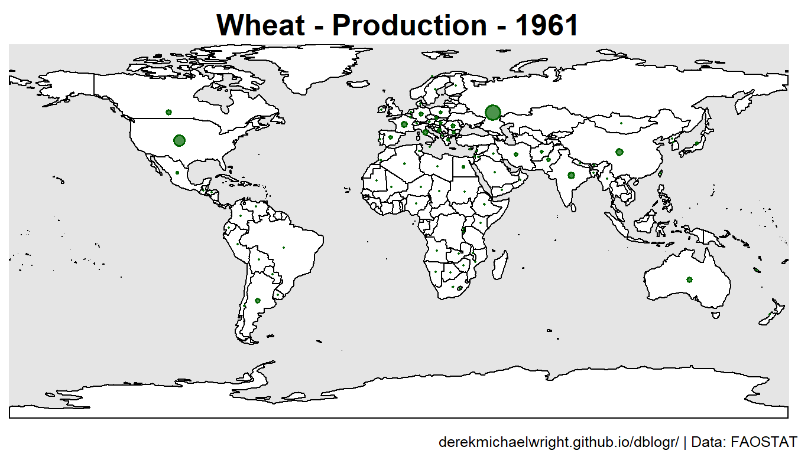
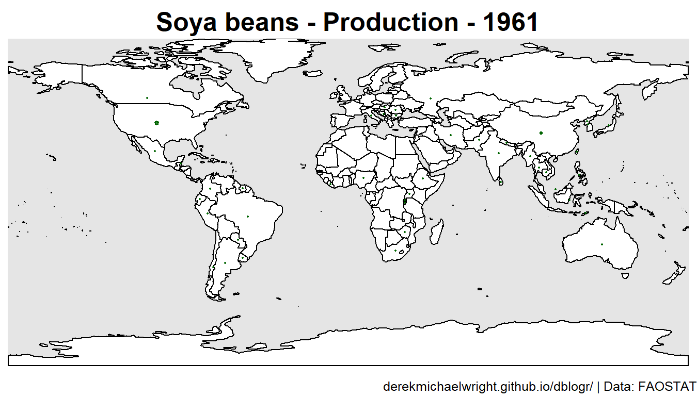
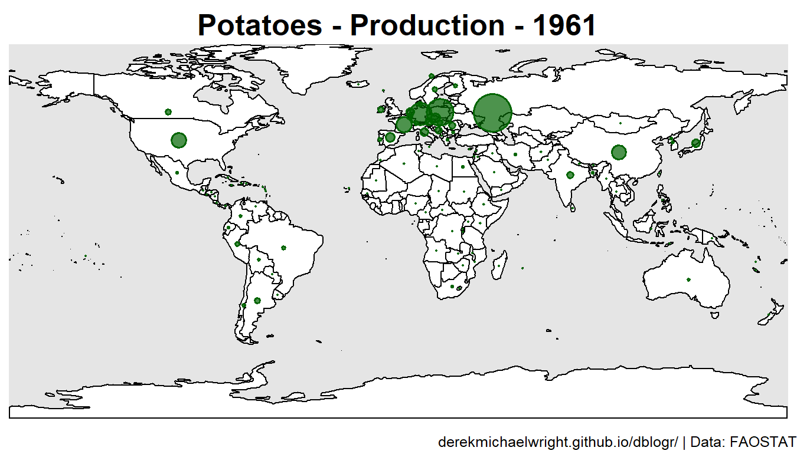
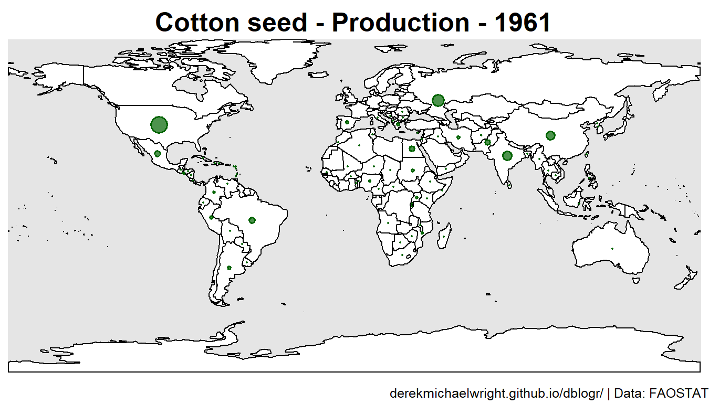

```{r setup, include = FALSE}
knitr::opts_chunk$set(eval = F, echo = T, message = F, warning = F)
```

---

# Data

> - `r shiny::icon("globe")` http://www.fao.org/faostat/en/#data/QC
> - `r shiny::icon("save")` [agData_FAO_Crops.csv.gz](https://github.com/derekmichaelwright/agData/raw/master/Data/agData_FAO_Crops.csv.gz)

---

# Prepare Data

```{r class.source = 'fold-show'}
# devtools::install_github("derekmichaelwright/agData")
library(agData)
library(rworldmap)
library(magick)
```

Create custom plotting function `ggCropMap`

```{r}
ggCropMap_year <- function(myCrop = "Lentils, dry", 
                           myMeasure = "Production", 
                           myYear = 2019, 
                           myFill = "darkgreen", 
                           myColor = "darkgreen",
                           mySymbolSize = 1) {
  # Prep data
  myFilename <- paste0(myCrop, "/", myCrop,"_", myMeasure, "_", myYear, ".png")
  xx <- agData_FAO_Crops %>%
    filter(Item == myCrop, 
           Year == myYear,
           Measurement == myMeasure,
           Area %in% agData_FAO_Country_Table$Country) %>%
    left_join(agData_FAO_Country_Table, by = c("Area"="Country"))
  #
  #png(myFilename, width = 3600, height = 2055, res = 600)
  png(myFilename, width = 1350, height = 770, res = 300)
  par(mai = c(0.2,0,0.25,0), xaxs = "i", yaxs = "i")
  mapBubbles2(dF = xx, nameX = "Lon", nameY = "Lat", nameZSize = "Value",
              nameZColour = "darkgreen", bg = alpha("darkgreen",0.7),
              symbolSize = mySymbolSize, addLegend = F, lwd = 0.75,
              oceanCol = "grey90", landCol = "white", borderCol = "black")
  title(main = paste(myMeasure, "-", myCrop,"-", myYear), 
        line = 0.25, cex.main = 1)
  title(sub = "www.dblogr.com/ or derekmichaelwright.github.io/dblogr/ | Data: FAOSTAT",
        line = 0, cex.sub = 0.5, adj = 1)
  dev.off()
}
```

Create custom animation function `ggCropMap`

```{r}
ggCropMap_animation <- function(myCrop = "Lentils, dry", 
                                myMeasure = "Production", 
                                myFill = "darkgreen", 
                                myColor = "darkgreen"
                                ) {
  # Prep data
  dir.create(myCrop)
  xx <- agData_FAO_Crops %>%
    filter(Item == myCrop, Measurement == myMeasure) 
  yy <- xx %>% pull(Year) %>% unique()
  # i<-yy[1]
  for(i in yy) {
    myMax_t <- xx %>% pull(Value) %>% max()
    myMax_i <- xx %>% filter(Year == i) %>% pull(Value) %>% max()
    mySymbolSize <- myMax_i / myMax_t
    ggCropMap_year(myCrop = myCrop, myMeasure = myMeasure, 
                   myYear = i, myFill = myFill, myColor = myColor,
                   mySymbolSize = mySymbolSize)
  }
  myFiles <- list.files(paste0(myCrop, "/"))
  myFiles <- myFiles[grepl(paste0(myCrop, "_", myMeasure), myFiles, fixed = T)]
  myFiles <- c(myFiles, rep(myFiles[length(myFiles)], 10))
  myFiles <- paste0(myCrop, "/", myFiles)
  myIs <- image_read(myFiles)
  myAnim <- image_animate(myIs, fps = 2)
  myFilename <-  paste0(myCrop, "_", myMeasure, ".gif")
  image_write(myAnim, myFilename, format = "gif")
}
```

```{r}
# Create function
ggCropMap_bind <- function(myCrop = "Lentils, dry", 
                           myMeasure = "Production", 
                           myYears = c(2020,1970)) {
  myFilenames <-  paste0(myCrop, "/", myCrop, "_", myMeasure, "_", myYears, ".png")
  myIs <- image_read(myFilenames)
  myI <- image_append(myIs, stack = T)
  myFilename <- paste0(myCrop, "_", myMeasure, "_", paste0(myYears, collapse = "_"), ".png")
  image_write(myI, myFilename, format = "png")
}
```

---

# Crops {.tabset .tabset-pills}

## Wheat



```{r results="hide"}
ggCropMap_animation(myCrop = "Wheat", myMeasure = "Production")
```


```{r}
ggCropMap_bind(myCrop = "Wheat", myMeasure = "Production", myYears = c(2020,1970))
```

```{r}
file.copy(from = "Wheat_Production_2020_1970.png", to = "featured.png")
```

---

## Maize 

_Production.gif)

```{r results="hide"}
ggCropMap_animation(myCrop = "Maize (corn)", myMeasure = "Production")
```

_Production_2020_1970.png)

```{r}
ggCropMap_bind(myCrop = "Maize (corn)", myMeasure = "Production", myYears = c(2020,1970))
```

---

## Rapeseed


```{r results="hide"}
ggCropMap_animation(myCrop = "Rapeseed or canola oil, crude", myMeasure = "Production")
```


```{r}
ggCropMap_bind(myCrop = "Rapeseed or canola oil, crude", myMeasure = "Production", myYears = c(2020,1970))
```

---

## Lentils


```{r results="hide"}
ggCropMap_animation(myCrop = "Lentils, dry", myMeasure = "Production")
```


```{r}
ggCropMap_bind(myCrop = "Lentils, dry", myMeasure = "Production", myYears = c(2020,1970))
```

---

## Chickpeas


```{r results="hide"}
ggCropMap_animation(myCrop = "Chick peas, dry", myMeasure = "Production")
```


```{r}
ggCropMap_bind(myCrop = "Chick peas, dry", myMeasure = "Production", myYears = c(2020,1970))
```

---

## Peas


```{r results="hide"}
ggCropMap_animation(myCrop = "Peas, dry", myMeasure = "Production")
```


```{r}
ggCropMap_bind(myCrop = "Peas, dry", myMeasure = "Production", myYears = c(2020,1970))
```

---

## Beans


```{r results="hide"}
ggCropMap_animation(myCrop = "Beans, dry", myMeasure = "Production")
```


```{r}
ggCropMap_bind(myCrop = "Beans, dry", myMeasure = "Production", myYears = c(2020,1970))
```

---

## Soybeans



```{r results="hide"}
ggCropMap_animation(myCrop = "Soya beans", myMeasure = "Production")
```


```{r}
ggCropMap_bind(myCrop = "Soya beans", myMeasure = "Production", myYears = c(2020,1970))
```

---

## Sugarbeet


```{r results="hide"}
ggCropMap_animation(myCrop = "Sugar beet", myMeasure = "Production")
```


```{r}
ggCropMap_bind(myCrop = "Sugar beet", myMeasure = "Production", myYears = c(2020,1970))
```

---

## Hempseed


```{r results="hide"}
ggCropMap_animation(myCrop = "Hempseed", myMeasure = "Production")
```


```{r}
ggCropMap_bind(myCrop = "Hempseed", myMeasure = "Production", myYears = c(2020,1970))
```

---

## Potato



```{r results="hide"}
ggCropMap_animation(myCrop = "Potatoes", myMeasure = "Production")
```


```{r}
ggCropMap_bind(myCrop = "Potatoes", myMeasure = "Production", myYears = c(2020,1970))
```

---

## Cotton



```{r results="hide"}
ggCropMap_animation(myCrop = "Cotton seed", myMeasure = "Production")
``` 


```{r}
ggCropMap_bind(myCrop = "Cotton seed", myMeasure = "Production", myYears = c(2020,1970))
```

---

## Sorghum


```{r results="hide"}
ggCropMap_animation(myCrop = "Sorghum", myMeasure = "Production")
``` 


```{r}
ggCropMap_bind(myCrop = "Sorghum", myMeasure = "Production", myYears = c(2020,1970))
```

---

```{r echo = F, eval = F}
mapBubbles2(dF = xx, nameX = "Lon", nameY = "Lat", nameZSize = "Value",
              nameZColour = "darkgreen", bg = alpha("darkgreen",0.7),
              symbolSize = mySymbolSize, addLegend = F, lwd = 1,
              #xlim = c(-140,110), ylim = c(5,20), 
              oceanCol = "grey90", landCol = "white", borderCol = "black")
```

```{r eval = F, echo = F}
mapBubbles2 <- function (dF = "", nameX = "longitude", nameY = "latitude", 
                         nameZSize = "", nameZColour = "", fill = TRUE, 
                         bg = NULL, #This is what I added
                         pch = 21, symbolSize = 1, maxZVal = NA, main = nameZSize, 
                         numCats = 5, catMethod = "categorical", colourPalette = "heat", 
                         xlim = NA, ylim = NA, mapRegion = "world", borderCol = "grey", 
                         oceanCol = NA, landCol = NA, addLegend = TRUE, legendBg = "white", 
                         legendVals = "", legendPos = "bottomright", legendHoriz = FALSE, 
                         legendTitle = nameZSize, addColourLegend = TRUE, colourLegendPos = "bottomleft", 
                         colourLegendTitle = nameZColour, add = FALSE, plotZeroVals = TRUE, 
                         lwd = 0.5, lwdSymbols = 1, ...) 
{
  functionName <- as.character(sys.call()[[1]])
  if (class(dF) == "character" && dF == "") {
    message(paste("using example data because no file specified in", 
                  functionName))
    dF = getMap()@data
    nameX = "LON"
    nameY = "LAT"
    if (nameZSize == "") 
      nameZSize = "POP_EST"
    if (nameZColour == "") 
      nameZColour = "continent"
  }
  if (class(dF) == "SpatialPolygonsDataFrame") {
    centroidCoords <- coordinates(dF)
    dF[["nameX"]] <- centroidCoords[, 1]
    dF[["nameY"]] <- centroidCoords[, 2]
    nameX <- "nameX"
    nameY <- "nameY"
    if (!add) {
      rwmNewMapPlot(mapToPlot = dF, oceanCol = oceanCol, 
                    mapRegion = mapRegion, xlim = xlim, ylim = ylim)
      plot(dF, add = TRUE, border = borderCol, col = landCol, 
           main = main, lwd = lwd)
    }
    dF <- dF@data
  }
  else if (!add) {
    rwmNewMapPlot(mapToPlot = getMap(), oceanCol = oceanCol, 
                  mapRegion = mapRegion, xlim = xlim, ylim = ylim)
    plot(getMap(), add = TRUE, border = borderCol, col = landCol, 
         main = main, lwd = lwd)
  }
  singleColour <- FALSE
  if (nameZColour == "") 
    nameZColour <- "red"
    if (is.na(match(nameZColour, names(dF)))) {
      if (!tryCatch(is.matrix(col2rgb(nameZColour)), error = function(e) FALSE)) {
        stop("your chosen nameZColour :'", nameZColour, 
             "' is not a colour and seems not to exist in your data, columns = ", 
             paste(names(dF), ""))
        return(FALSE)
      }
      else singleColour <- TRUE
    }
  cutVector <- colourVector <- NA
  if (!singleColour) {
    dataCategorised <- dF[, nameZColour]
    if (!is.numeric(dataCategorised) && catMethod != "categorical") {
      catMethod = "categorical"
      message(paste("using catMethod='categorical' for non numeric data in", 
                    functionName))
    }
    if (length(catMethod) == 1 && catMethod == "categorical") {
      dataCategorised <- as.factor(dataCategorised)
      cutVector <- levels(dataCategorised)
      if (length(cutVector) > 15) 
        warning("with catMethod='categorical' you have > 15 categories, you may want to try a different catMethod, e.g. quantile")
    }
    else {
      if (is.character(catMethod) == TRUE) {
        cutVector <- rwmGetClassBreaks(dataCategorised, 
                                       catMethod = catMethod, numCats = numCats, verbose = TRUE)
      }
      else if (is.numeric(catMethod) == TRUE) {
        cutVector <- catMethod
      }
      dataCategorised <- cut(dataCategorised, cutVector, 
                             include.lowest = TRUE)
      func <- function(x, y) c(paste(x, "-", y[1 + 
                                                 which(y == x)], sep = ""))
      tmp <- sapply(cutVector, cutVector, FUN = func)
      cutVector <- tmp[1:length(tmp) - 1]
    }
    colNameRaw <- nameZColour
    colNameCat <- paste(colNameRaw, "categorised", 
                        sep = "")
    dF[[colNameCat]] <- dataCategorised
    numColours <- length(levels(dataCategorised))
    colourVector <- rwmGetColours(colourPalette, numColours)
    dataCatNums <- as.numeric(dataCategorised)
  }
  if (singleColour) 
    col = nameZColour
  else col = colourVector[dataCatNums]
  if (is.na(maxZVal)) 
    maxZVal <- max(dF[, nameZSize], na.rm = TRUE)
  fMult = symbolSize * 4/sqrt(maxZVal)
  cex = fMult * sqrt(dF[, nameZSize])
  points(dF[, nameX], dF[, nameY], pch = pch, cex = cex, col = col, 
         bg = bg, lwd = lwdSymbols)
  if (addLegend && sum(as.numeric(abs(dF[, nameZSize])), na.rm = TRUE) != 
      0) {
    if (length(legendVals) > 1) {
      legendSymbolSizes <- fMult * sqrt(legendVals)
    }
    else {
      sigFigs <- 3
      maxVal <- max(dF[, nameZSize], na.rm = TRUE)
      minVal <- min(dF[, nameZSize], na.rm = TRUE)
      legendVals <- c(signif(minVal, sigFigs), signif(minVal + 
                                                        0.5 * (maxVal - minVal), sigFigs), signif(maxVal, 
                                                                                                  sigFigs))
      legendSymbolSizes <- fMult * sqrt(legendVals)
    }
    legendSymbolChars = c(pch, pch, pch)
    colour4LegendPoints <- "black"
      if (plotZeroVals && legendSymbolSizes[1] == 0) {
        legendSymbolSizes[1] <- 1
        legendSymbolChars[1] <- 3
      }
    x.intersp = symbolSize * 1.3
    y.intersp = symbolSize * 1.3
    legend(x = legendPos, legend = legendVals, pt.cex = legendSymbolSizes, 
           pch = legendSymbolChars, col = colour4LegendPoints, 
           bg = legendBg, title = legendTitle, horiz = legendHoriz, 
           y.intersp = y.intersp, x.intersp = x.intersp)
  }
  if (addColourLegend && !singleColour) {
    addMapLegendBoxes(colourVector = colourVector, cutVector = cutVector, 
                      x = colourLegendPos, title = colourLegendTitle)
  }
  invisible(list(colourVector = colourVector, cutVector = cutVector))
}
```
