```{r setup, include = FALSE}
knitr::opts_chunk$set(eval = F, echo = T, message = F, warning = F)
```

---

# Data

> - `r shiny::icon("globe")` [http://www.fao.org/faostat/en/#data/QC](http://www.fao.org/faostat/en/#data/QC){target="_blank"}
> - `r shiny::icon("save")` [agData_FAO_Crops.csv.gz](https://github.com/derekmichaelwright/agData/raw/master/Data/agData_FAO_Crops.csv.gz)

---

# Prepare Data

```{r class.source = "fold-show"}
# devtools::install_github("derekmichaelwright/agData")
library(agData)
library(rworldmap)
library(magick)
```

Create custom plotting function `ggCropMap`

```{r}
ggCropMap_year <- function(myCrop = "Lentils, dry", 
                           myMeasure = "Production", 
                           myYear = 2019, 
                           myFill = "darkgreen", 
                           myColor = "darkgreen",
                           mySymbolSize = 1) {
  # Prep data
  myFilename <- paste0(myCrop, "/", myCrop,"_", myMeasure, "_", myYear, ".png")
  xx <- agData_FAO_Crops %>%
    filter(Item == myCrop, 
           Year == myYear,
           Measurement == myMeasure,
           Area %in% agData_FAO_Country_Table$Country) %>%
    left_join(agData_FAO_Country_Table, by = c("Area"="Country"))
  #
  #png(myFilename, width = 3600, height = 2055, res = 600)
  png(myFilename, width = 1350, height = 770, res = 300)
  par(mai = c(0.2,0,0.25,0), xaxs = "i", yaxs = "i")
  mapBubbles2(dF = xx, nameX = "Lon", nameY = "Lat", nameZSize = "Value",
              nameZColour = "darkgreen", bg = alpha("darkgreen",0.7),
              symbolSize = mySymbolSize, lwd = 0.75, addLegend = F,
              oceanCol = "grey90", landCol = "white", borderCol = "black",
              )
  title(main = paste(myCrop, "-", myMeasure, "-", myYear), 
        line = 0.25, cex.main = 1)
  title(sub = "www.dblogr.com/ or derekmichaelwright.github.io/dblogr/ | Data: FAOSTAT",
        line = 0, cex.sub = 0.5, adj = 1)
  dev.off()
}
```

Create custom animation function `ggCropMap`

```{r}
ggCropMap_animation <- function(myCrop = "Lentils, dry", 
                                myMeasure = "Production", 
                                myFill = "darkgreen", 
                                myColor = "darkgreen"
                                ) {
  # Prep data
  dir.create(myCrop)
  xx <- agData_FAO_Crops %>%
    filter(Item == myCrop, Measurement == myMeasure) 
  yy <- xx %>% pull(Year) %>% unique()
  # i<-yy[1]
  for(i in yy) {
    myMax_t <- xx %>% pull(Value) %>% max()
    myMax_i <- xx %>% filter(Year == i) %>% pull(Value) %>% max()
    mySymbolSize <- myMax_i / myMax_t
    ggCropMap_year(myCrop = myCrop, myMeasure = myMeasure, 
                   myYear = i, myFill = myFill, myColor = myColor,
                   mySymbolSize = mySymbolSize)
  }
  myFiles <- list.files(paste0(myCrop, "/"))
  myFiles <- myFiles[grepl(paste0(myCrop, "_", myMeasure), myFiles, fixed = T)]
  myFiles <- c(myFiles, rep(myFiles[length(myFiles)], 10))
  myFiles <- paste0(myCrop, "/", myFiles)
  myIs <- image_read(myFiles)
  myAnim <- image_animate(myIs, fps = 4)
  myFilename <-  paste0(myCrop, "_", myMeasure, ".gif")
  image_write(myAnim, myFilename, format = "gif")
}
```

```{r echo = F}
# Create function
ggCropMap_bind <- function(myCrop = "Lentils, dry", 
                           myMeasure = "Production", 
                           myYears = c(2020,1970)) {
  myFilenames <-  paste0(myCrop, "/", myCrop, "_", myMeasure, "_", myYears, ".png")
  myIs <- image_read(myFilenames)
  myI <- image_append(myIs, stack = T)
  myFilename <- paste0(myCrop, "_", myMeasure, "_", paste0(myYears, collapse = "_"), ".png")
  image_write(myI, myFilename, format = "png")
}
```

---

# Crops {.tabset .tabset-pills}

## Wheat


```{r}
ggCropMap_animation(myCrop = "Wheat", myMeasure = "Production")
```


```{r echo = F}
ggCropMap_bind(myCrop = "Wheat", myMeasure = "Production", myYears = c(2020,1970))
```

```{r echo = F}
file.copy(from = "Wheat_Production_2020_1970.png", to = "featured.png", overwrite = T)
```

---

## Barley 

```{r}
ggCropMap_animation(myCrop = "Barley", myMeasure = "Production")
```


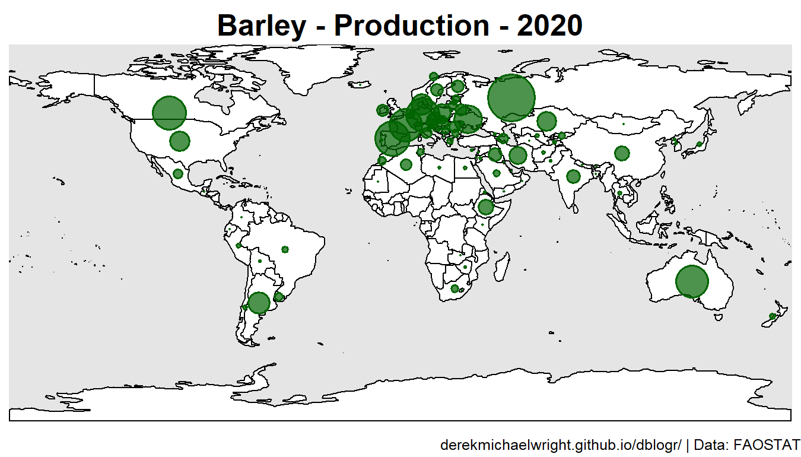


---

## Maize 

```{r}
ggCropMap_animation(myCrop = "Maize (corn)", myMeasure = "Production")
```

_Production.gif)


/Maize (corn)_Production_2020.png)

/Maize (corn)_Production_1970.png)

---

## Rapeseed

```{r}
ggCropMap_animation(myCrop = "Rapeseed or canola oil, crude", myMeasure = "Production")
```

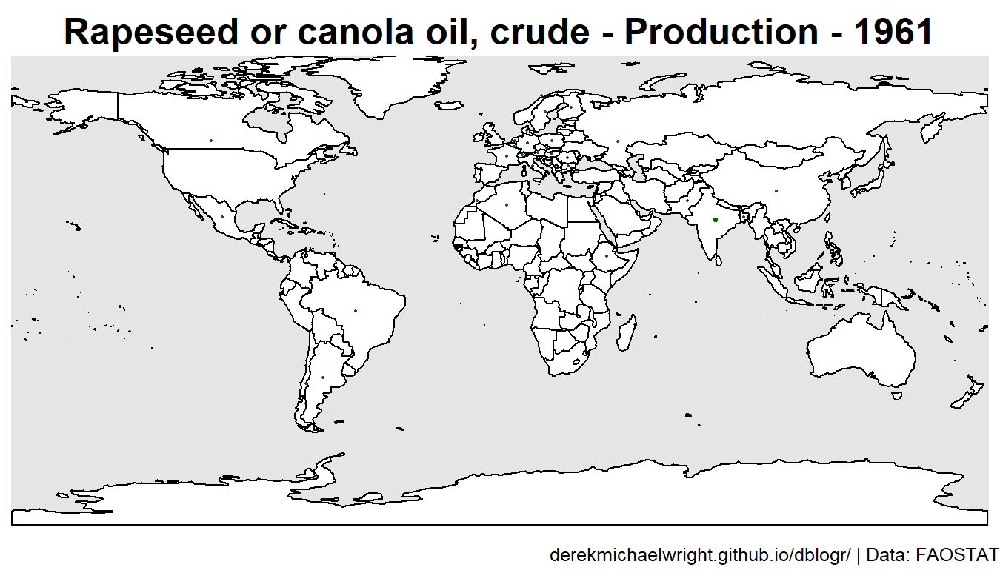


---

## Lentils

```{r}
ggCropMap_animation(myCrop = "Lentils, dry", myMeasure = "Production")
```


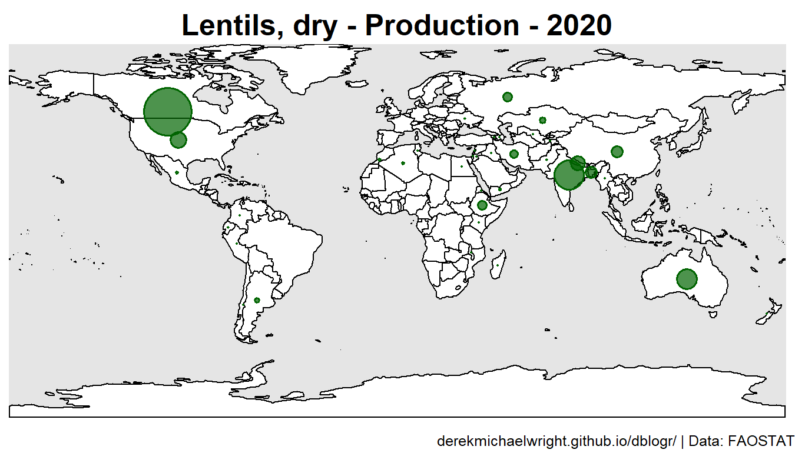

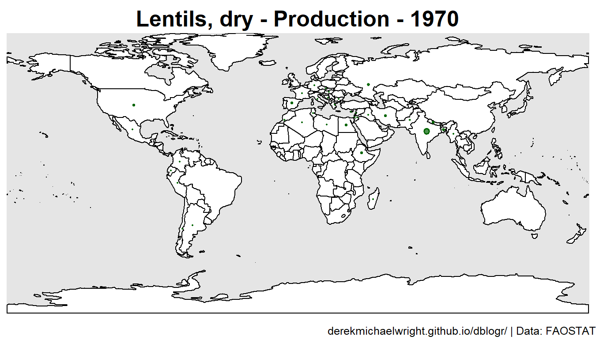

---

## Chickpeas

```{r}
ggCropMap_animation(myCrop = "Chick peas, dry", myMeasure = "Production")
```


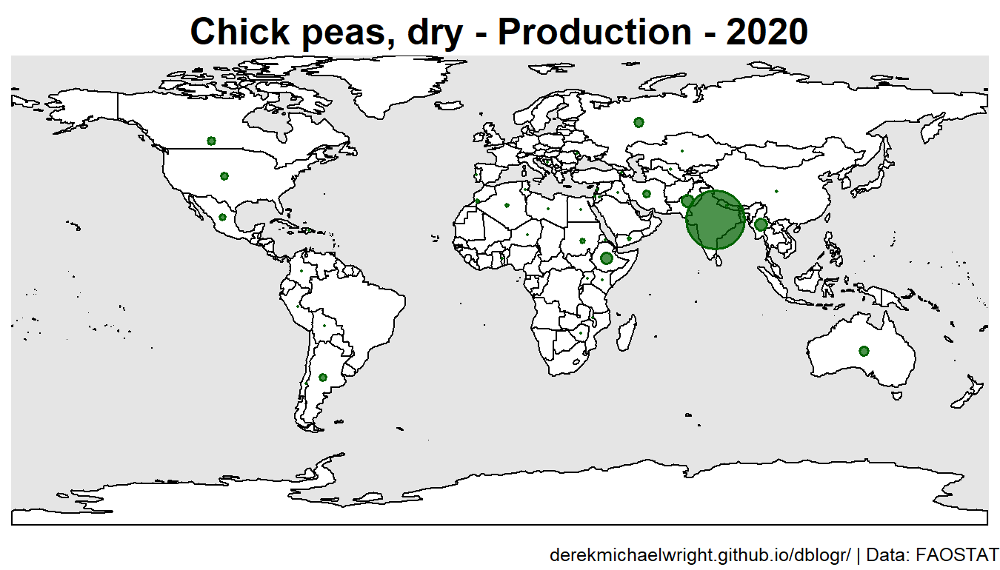


---

## Peas

```{r}
ggCropMap_animation(myCrop = "Peas, dry", myMeasure = "Production")
```


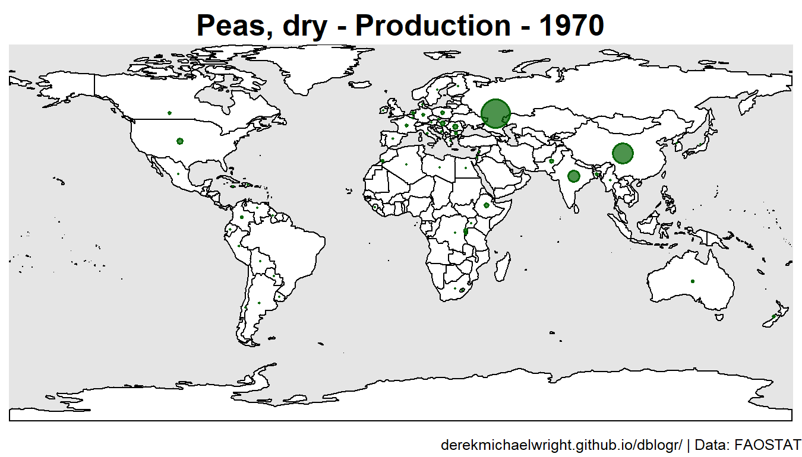

---

## Beans

```{r}
ggCropMap_animation(myCrop = "Beans, dry", myMeasure = "Production")
```


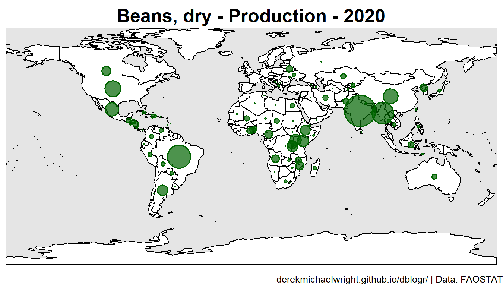


---

## Soybeans

```{r}
ggCropMap_animation(myCrop = "Soya beans", myMeasure = "Production")
```


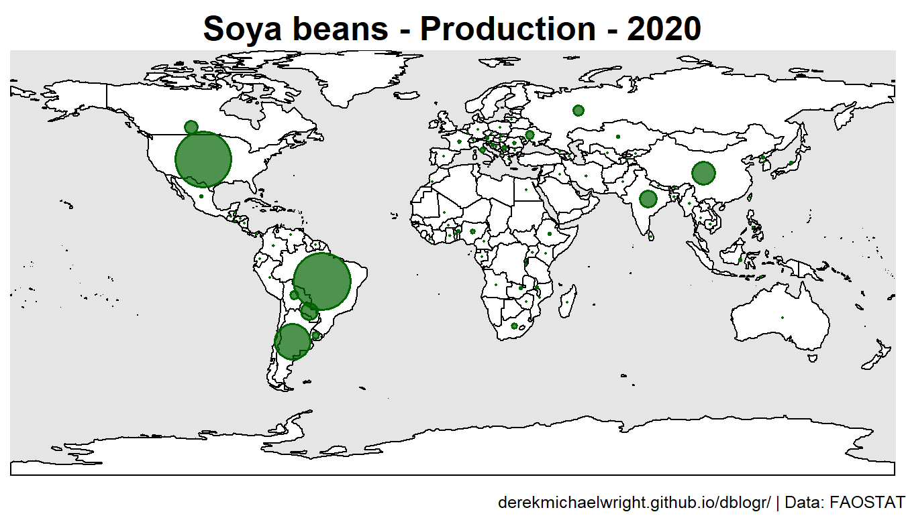

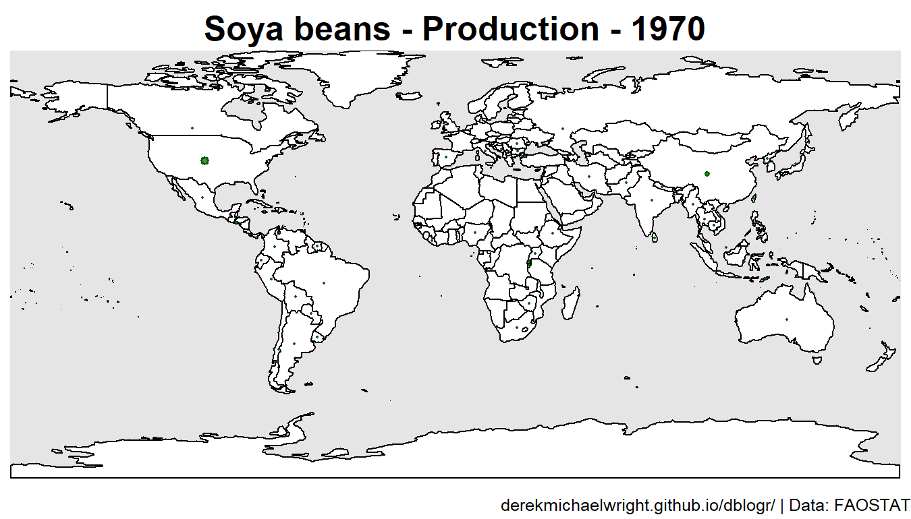

---

## Sugarbeet

```{r}
ggCropMap_animation(myCrop = "Sugar beet", myMeasure = "Production")
```


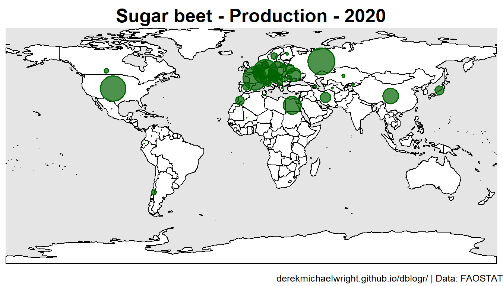

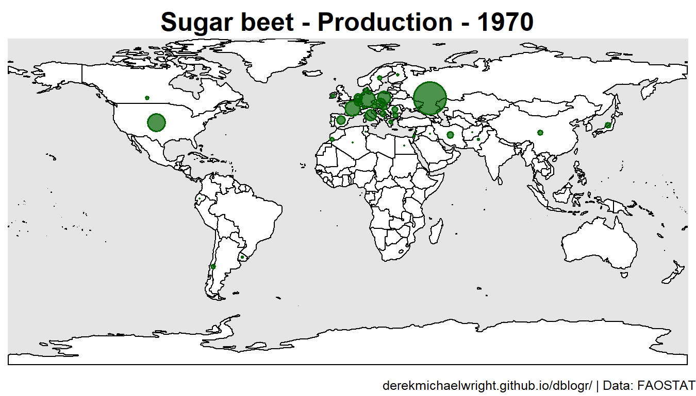

---

## Hempseed

```{r}
ggCropMap_animation(myCrop = "Hempseed", myMeasure = "Production")
```

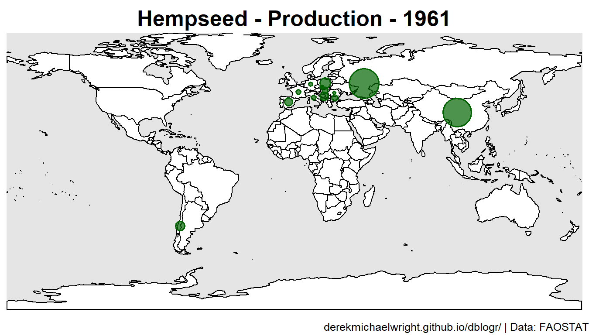

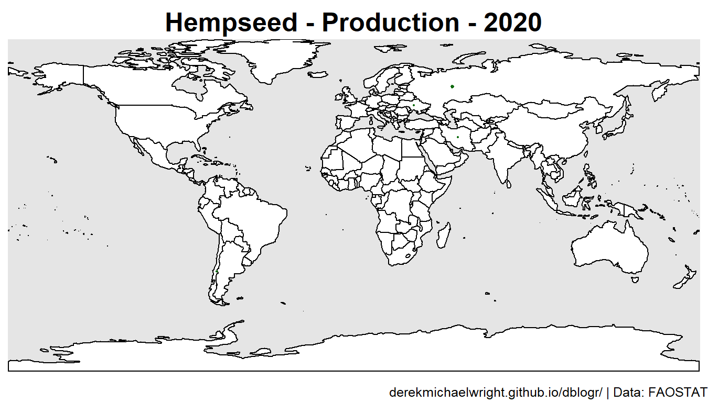

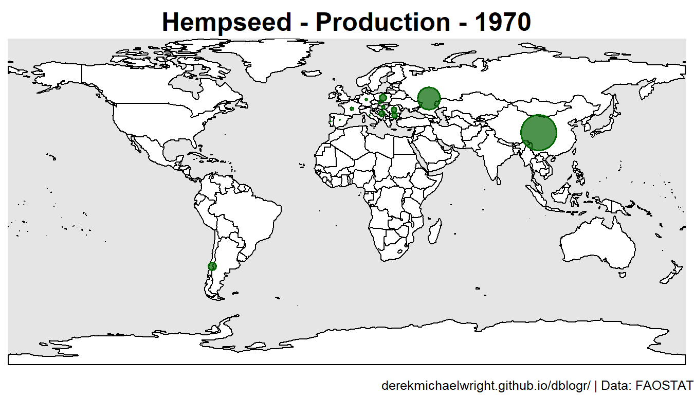

---

## Potato

```{r}
ggCropMap_animation(myCrop = "Potatoes", myMeasure = "Production")
```


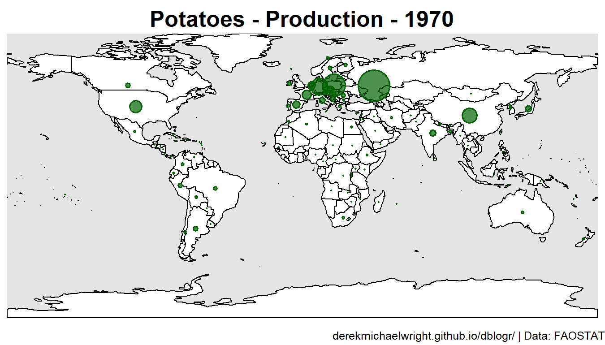

---

## Cotton

```{r}
ggCropMap_animation(myCrop = "Cotton seed", myMeasure = "Production")
```


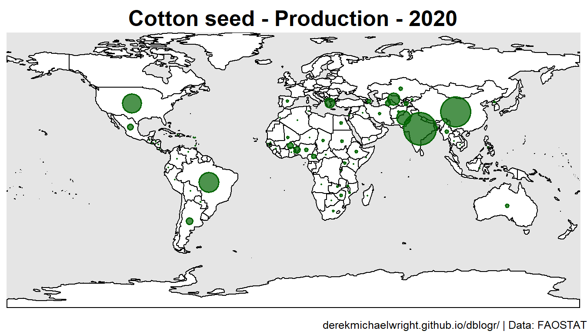

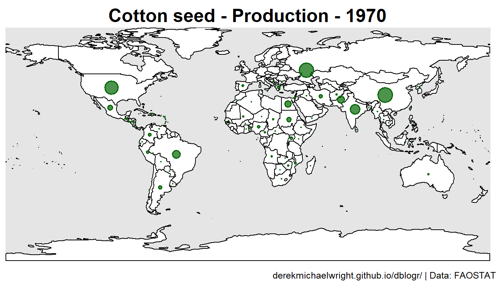

---

## Sorghum

```{r}
ggCropMap_animation(myCrop = "Sorghum", myMeasure = "Production")
``` 


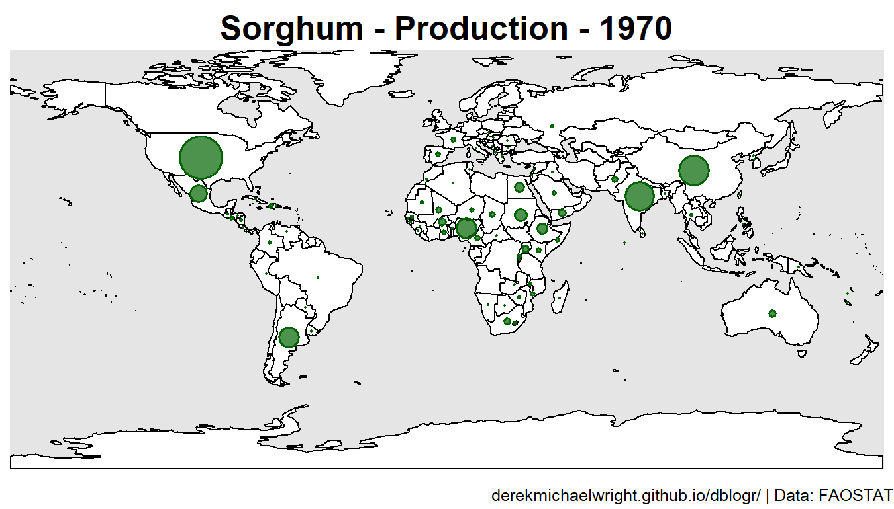

---
