```{r setup, include = FALSE}
knitr::opts_chunk$set(echo = T, message = F, warning = F)
```

---

# Data

`r shiny::icon("globe")` https://www150.statcan.gc.ca/t1/tbl1/en/cv.action?pid=3210023001

`r shiny::icon("save")` [agData_STATCAN_Farmers.csv](https://github.com/derekmichaelwright/agData/raw/master/Data/agData_STATCAN_Farmers.csv)

```{r class.source = 'fold-show'}
# devtools::install_github("derekmichaelwright/agData")
library(agData)
```

---

# Prepare Data

```{r}
# Prep data
myCaption = "derekmichaelwright.github.io/dblogr/ | Data: STATCAN"
myColors_Years <- alpha("darkgreen", seq(0.1, 0.7, by = 0.1))
myColors_Sex <- c("steelblue", "palevioletred3")
myColors_Age <- c("darkgreen","steelblue","darkred")
myAreas <- c("Canada", "British Columbia", "Alberta", "Saskatchewan",
             "Manitoba", "Ontario", "Quebec", "New Brunswick", "Nova Scotia",
             "Prince Edward Island", "Newfoundland and Labrador",
             "Yukon", "Nunavut", "Northwest Territories",
             "Northwest Territories including Nunavut",
             "Unknown province or territory")
dd <- agData_STATCAN_Farmers #%>%
  #mutate(Area = factor(Area, levels = myAreas))
```

---

# Canada

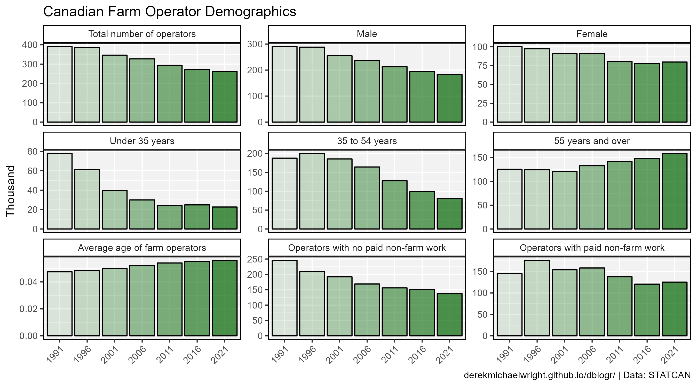

```{r}
# Prep data
xx <- dd %>% 
  filter(Area == "Canada") %>%
  mutate(Year = factor(Year))
# Plot
mp <- ggplot(xx, aes(x = Year, y = Value / 1000, fill = Year)) +
  geom_bar(stat = "identity", color = "black") +
  facet_wrap(Measurement ~ ., scales = "free_y") +
  scale_fill_manual(name = NULL, values = myColors_Years) +
  theme_agData(legend.position = "none",
               axis.text.x = element_text(angle = 45, hjust = 1)) +
  labs(title = "Canadian Farm Operator Demographics",
       x = NULL, y = "Thousand", caption = myCaption)
ggsave("farmers_canada_01.png", mp, width = 9, height = 5)
```

---

# Total Number of Farm Operators

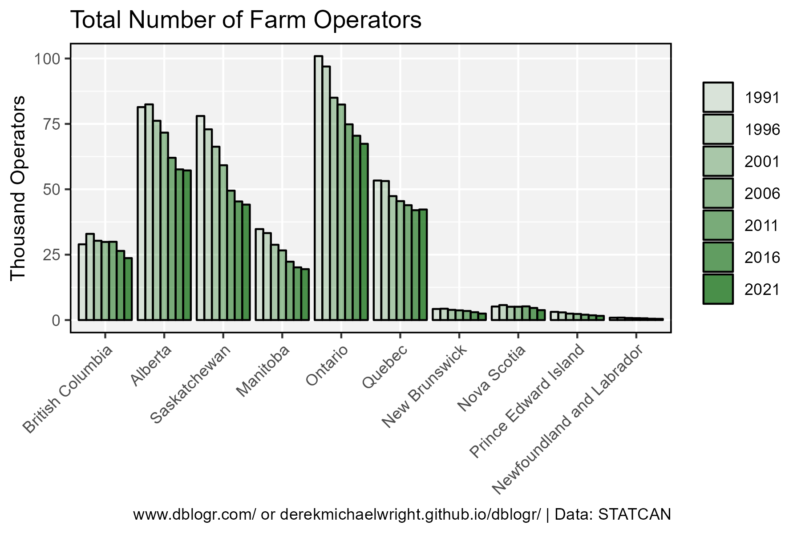

```{r}
# Prep data
xx <- dd %>% 
  filter(Area != "Canada", Measurement == "Total number of operators") %>%
  mutate(Year = factor(Year))
# Plot
mp <- ggplot(xx, aes(x = Area, y = Value / 1000, fill = Year)) +
  geom_bar(stat = "identity", position = "dodge",
           color = "black") +
  scale_fill_manual(name = NULL, values = myColors_Years) +
  theme_agData(axis.text.x = element_text(angle = 45, hjust = 1)) +
  labs(title = "Total Number of Farm Operators",
       y = "Thousand Operators", x = NULL, caption = myCaption)
ggsave("farmers_canada_02.png", mp, width = 6, height = 4)
```

---

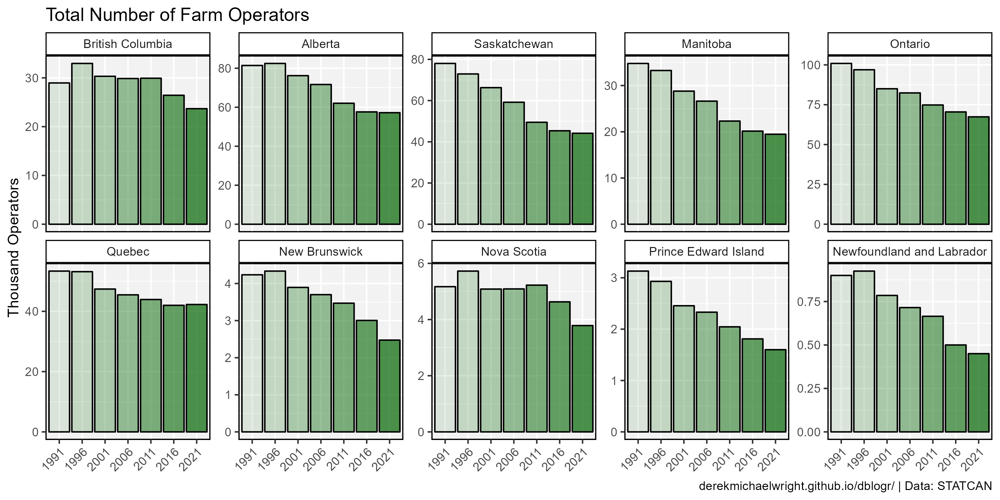

```{r}
# Prep data
xx <- dd %>% 
  filter(Area != "Canada", Measurement == "Total number of operators") %>%
  mutate(Year = factor(Year))
# Plot
mp <- ggplot(xx, aes(x = Year, y = Value / 1000, fill = Year)) +
  geom_bar(stat = "identity", color = "black") +
  facet_wrap(Area ~ ., scales = "free_y", ncol = 5) +
  scale_fill_manual(name = NULL, values = myColors_Years) +
  theme_agData(legend.position = "none",
               axis.text.x = element_text(angle = 45, hjust = 1)) +
  labs(title = "Total Number of Farm Operators",
       y = "Thousand Operators", x = NULL, caption = myCaption)
ggsave("farmers_canada_03.png", mp, width = 10, height = 5)
```

---

# Farm Operators by Gender

## Canada

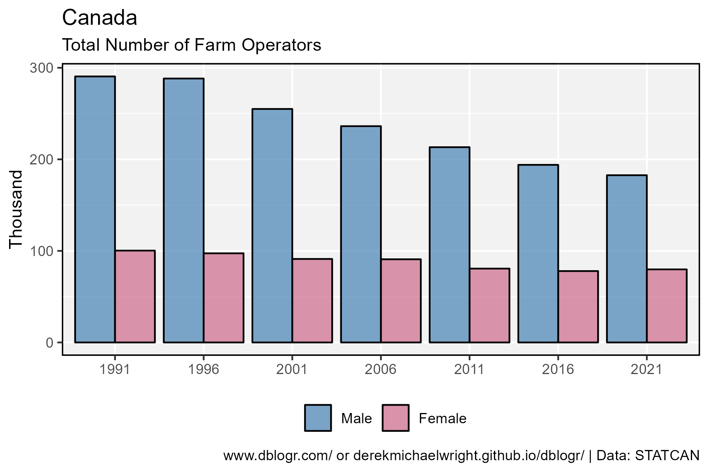

```{r}
# Prep data
xx <- dd %>% 
  filter(Area == "Canada", Measurement %in% c("Male","Female")) %>%
  mutate(Year = factor(Year))
# Plot
mp <- ggplot(xx, aes(x = Year, y = Value / 1000, fill = Measurement)) +
  geom_bar(stat = "identity", position = "dodge", 
           color = "black", alpha = 0.7) +
  scale_fill_manual(name = NULL, values = myColors_Sex) +
  theme_agData(legend.position = "bottom") +
  labs(title = "Canada", subtitle = "Total Number of Farm Operators",
       y = "Thousand", x = NULL, caption = myCaption)
ggsave("farmers_canada_04.png", mp, width = 6, height = 4)
```

```{r echo = F}
ggsave("featured.png", mp, width = 6, height = 4)
```

---

## Saskatchewan

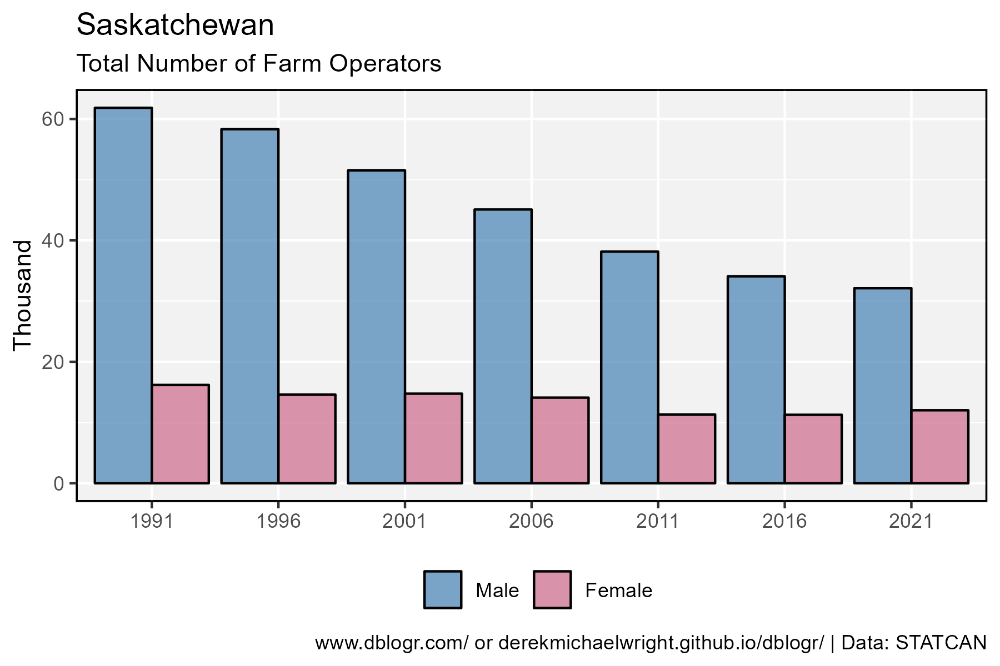

```{r}
# Prep data
xx <- dd %>% 
  filter(Area == "Saskatchewan", Measurement %in% c("Male","Female")) %>%
  mutate(Year = factor(Year))
# Plot
mp <- ggplot(xx, aes(x = Year, y = Value / 1000, fill = Measurement)) +
  geom_bar(stat = "identity", position = "dodge", 
           color = "black", alpha = 0.7) +
  scale_fill_manual(name = NULL, values = myColors_Sex) +
  theme_agData(legend.position = "bottom") +
  labs(title = "Saskatchewan", subtitle = "Total Number of Farm Operators",
       y = "Thousand", x = NULL, caption = myCaption)
ggsave("farmers_canada_05.png", mp, width = 6, height = 4)
```

---

## Provinces

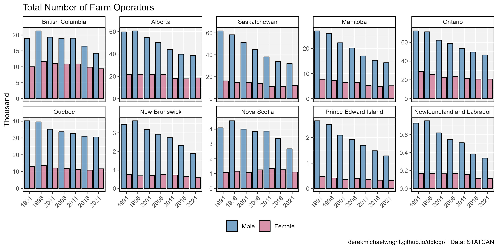

```{r}
# Prep data
xx <- dd %>% 
  filter(Area != "Canada", Measurement %in% c("Male","Female")) %>%
  mutate(Year = factor(Year))
# Plot
mp <- ggplot(xx, aes(x = Year, y = Value / 1000, fill = Measurement)) +
  geom_bar(stat = "identity", position = "dodge", 
           color = "black", alpha = 0.7) +
  facet_wrap(Area ~ ., scales = "free_y", ncol = 5) +
  scale_fill_manual(name = NULL, values = myColors_Sex) +
  theme_agData(legend.position = "bottom",
               axis.text.x = element_text(angle = 45, hjust = 1)) +
  labs(title = "Total Number of Farm Operators",
       y = "Thousand", x = NULL, caption = myCaption)
ggsave("farmers_canada_06.png", mp, width = 10, height = 5)
```

---

## Percent

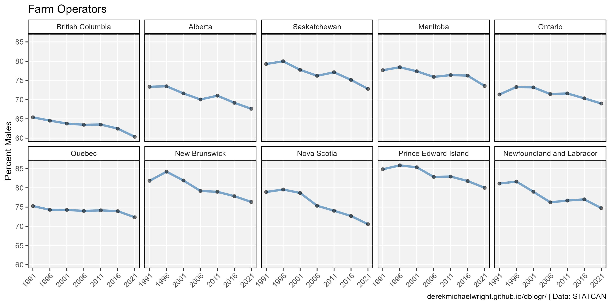

```{r}
# Prep data
xx <- dd %>% 
  filter(Area != "Canada", Measurement %in% c("Male","Female")) %>%
  group_by(Year, Area) %>%
  mutate(Percent = 100 * Value / sum(Value)) %>%
  filter(Measurement == "Male")
# Plot
mp <- ggplot(xx, aes(x = Year, y = Percent)) + 
  geom_line(color = "steelblue", alpha = 0.7, size = 1.25) +
  geom_point(alpha = 0.5) +
  facet_wrap(Area ~ ., ncol = 5) +
  scale_y_continuous(breaks = seq(60, 85, by = 5),
                     minor_breaks = seq(60, 85, by = 5)) +
  scale_x_continuous(breaks = unique(xx$Year),
                     minor_breaks = unique(xx$Year)) +
  theme_agData(legend.position = "none",
               axis.text.x = element_text(angle = 45, hjust = 1)) +
  labs(title = "Farm Operators", x = NULL,
       y = "Percent Males", caption = myCaption)
ggsave("farmers_canada_07.png", mp, width = 10, height = 5)
```

---

## 2021 Pies

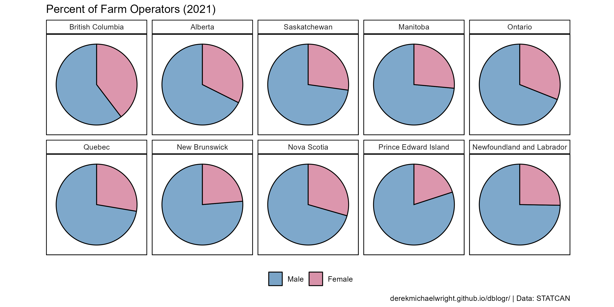

```{r}
# Prep data
xx <- dd %>% 
  filter(Area != "Canada", Year == 2021,
         Measurement %in% c("Male","Female")) %>%
  mutate(Year = factor(Year)) %>% 
  group_by(Year, Area) %>%
  mutate(Percent = 100 * Value / sum(Value))
# Plot
mp <- ggplot(xx, aes(x = "", y = Percent, fill = Measurement)) + 
  geom_bar(stat = "identity", color = "black", alpha = 0.7) +
  coord_polar("y", start = 0) +
  facet_wrap(Area ~ ., ncol = 5) +
  scale_fill_manual(name = NULL, values = myColors_Sex) +
  theme_agData_pie(legend.position = "bottom") +
  labs(title = "Percent of Farm Operators (2021)",
       caption = myCaption)
ggsave("farmers_canada_08.png", mp, width = 10, height = 5)
```

---

# Farm Operators by Age

## Average Age

### Canada

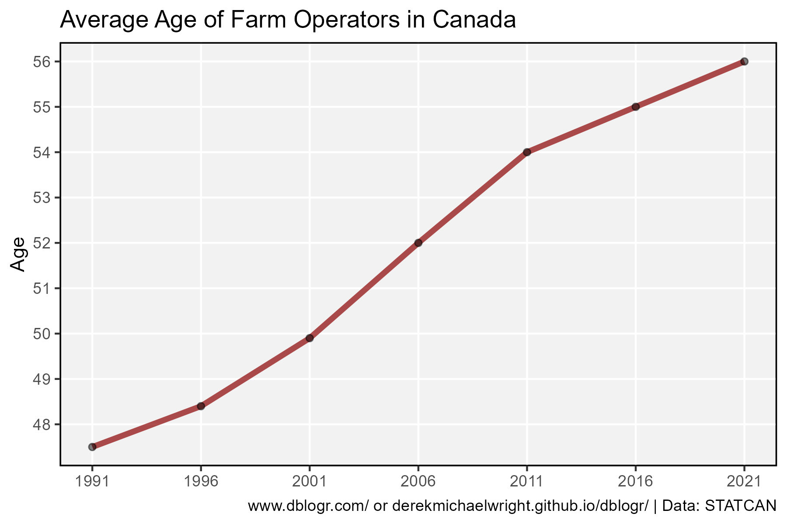

```{r}
# Prep data
xx <- dd %>% 
  filter(Area == "Canada", Measurement == "Average age of farm operators")
# Plot
mp <- ggplot(xx, aes(x = Year, y = Value)) +
  geom_line(color = "darkred", alpha = 0.7, size = 1.5) +
  geom_point(alpha = 0.5) +
  scale_y_continuous(breaks = 44:58, minor_breaks = 44:58) +
  scale_x_continuous(breaks = unique(xx$Year),
                     minor_breaks = unique(xx$Year)) +
  theme_agData() +
  labs(title = "Average Age of Farm Operators in Canada", 
       y = "Age", x = NULL, caption = myCaption)
ggsave("farmers_canada_09.png", mp, width = 6, height = 4)
```

---

### Saskatchewan


```{r}
# Prep data
xx <- dd %>% 
  filter(Area == "Saskatchewan", Measurement == "Average age of farm operators")
# Plot
mp <- ggplot(xx, aes(x = Year, y = Value)) +
  geom_line(color = "darkred", alpha = 0.7, size = 1.5) +
  geom_point(alpha = 0.5) +
  scale_y_continuous(breaks = 44:58, minor_breaks = 44:58) +
  scale_x_continuous(breaks = unique(xx$Year),
                     minor_breaks = unique(xx$Year)) +
  theme_agData() +
  labs(title = "Average Age of Farm Operators in Saskatchewan",
       y = "Age", x = NULL, caption = myCaption)
ggsave("farmers_canada_10.png", mp, width = 6, height = 4)
```

---

### Provinces

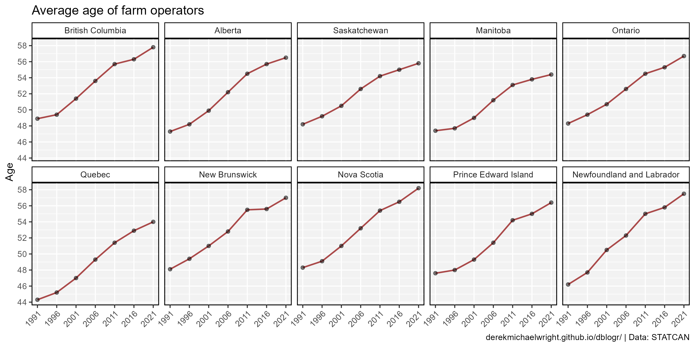

```{r}
# Prep data
xx <- dd %>% 
  filter(Area != "Canada", Measurement == "Average age of farm operators")
# Plot
mp <- ggplot(xx, aes(x = Year, y = Value)) +
  geom_line(color = "darkred", alpha = 0.7, size = 0.75) +
  geom_point(alpha = 0.5) +
  facet_wrap(Area ~ ., ncol = 5) +
  scale_y_continuous(breaks = seq(44, 58, by = 2)) +
  scale_x_continuous(breaks = unique(xx$Year),
                     minor_breaks = unique(xx$Year)) +
  theme_agData(axis.text.x = element_text(angle = 45, hjust = 1)) +
  labs(title = "Average age of farm operators", 
       y = "Age", x = NULL, caption = myCaption)
ggsave("farmers_canada_11.png", mp, width = 10, height = 5)
```

---

## Age Group

### Canada

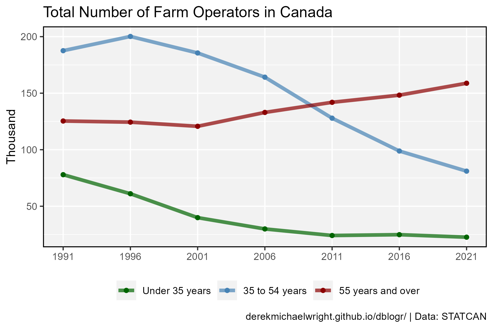

```{r}
# Prep data
myMeasures <- c("Under 35 years","35 to 54 years","55 years and over")
xx <- dd %>% 
  filter(Area == "Canada",
         Measurement %in% myMeasures)
# Plot
mp <- ggplot(xx, aes(x = Year, y = Value / 1000, color = Measurement)) +
  geom_line(size = 1.5, alpha = 0.7) +
  geom_point() +
  theme_agData(legend.position = "bottom") +
  scale_color_manual(name = NULL, values = myColors_Age) +
  scale_x_continuous(breaks = unique(xx$Year),
                     minor_breaks = unique(xx$Year)) +
  labs(title = "Total Number of Farm Operators in Canada",
       y = "Thousand", x = NULL, caption = myCaption)
ggsave("farmers_canada_12.png", mp, width = 6, height = 4)
```

---

### Saskatchewan

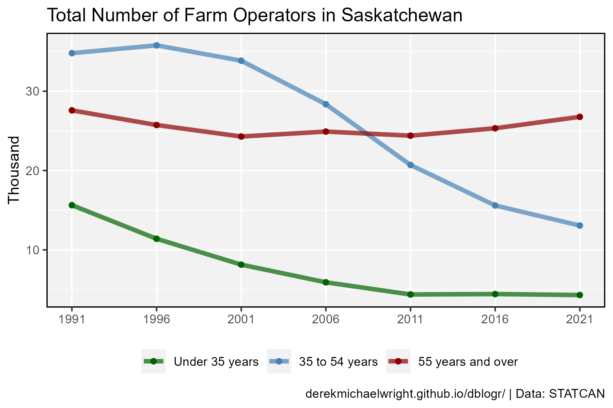

```{r}
# Prep data
xx <- dd %>% 
  filter(Area == "Saskatchewan",
         Measurement %in% myMeasures)
# Plot
mp <- ggplot(xx, aes(x = Year, y = Value / 1000, color = Measurement)) +
  geom_line(size = 1.5, alpha = 0.7) +
  geom_point() +
  theme_agData(legend.position = "bottom") +
  scale_color_manual(name = NULL, values = myColors_Age) +
  scale_x_continuous(breaks = unique(xx$Year),
                     minor_breaks = unique(xx$Year)) +
  labs(title = "Total Number of Farm Operators in Saskatchewan",
       y = "Thousand", x = NULL, caption = myCaption)
ggsave("farmers_canada_13.png", mp, width = 6, height = 4)
```

---

### Provinces

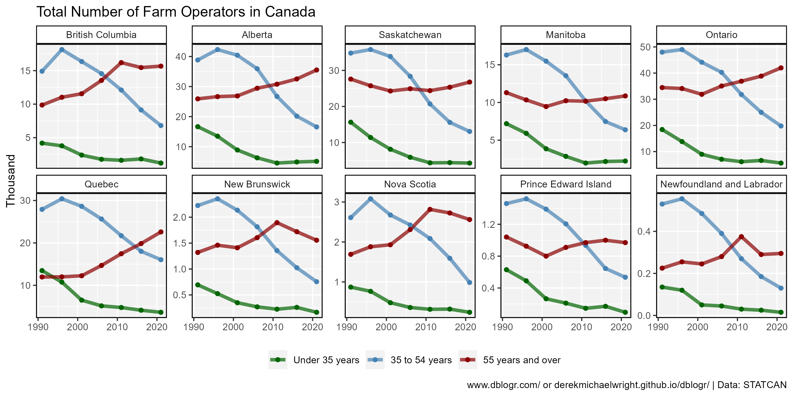

```{r}
# Prep data
xx <- dd %>% 
  filter(Area != "Canada",
         Measurement %in% myMeasures)
# Plot
mp <- ggplot(xx, aes(x = Year, y = Value / 1000, color = Measurement)) +
  geom_line(size = 1.5, alpha = 0.7) +
  geom_point() +
  facet_wrap(Area ~ ., ncol = 5, scale = "free_y") +
  theme_agData(legend.position = "bottom") +
  scale_color_manual(name = NULL, values = myColors_Age) +
  labs(title = "Total Number of Farm Operators in Canada",
       y = "Thousand", x = NULL, caption = myCaption)
ggsave("farmers_canada_14.png", mp, width = 10, height = 5)
```

---

### 2021 Pies

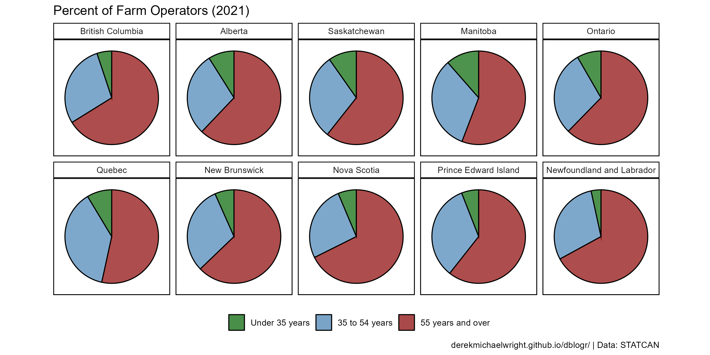

```{r}
# Prep data
xx <- dd %>% 
  filter(Area != "Canada", Year == 2021,
         Measurement %in% myMeasures) %>%
  mutate(Year = factor(Year)) %>% 
  group_by(Year, Area) %>%
  mutate(Percent = 100 * Value / sum(Value))
# Plot
mp <- ggplot(xx, aes(x = "", y = Percent, fill = Measurement)) + 
  geom_bar(stat = "identity", color = "black", alpha = 0.7) +
  coord_polar("y", start = 0) +
  facet_wrap(Area ~ ., ncol = 5) +
  scale_fill_manual(name = NULL, values = myColors_Age) +
  theme_agData_pie(legend.position = "bottom") +
  labs(title = "Percent of Farm Operators (2021)", caption = myCaption)
ggsave("farmers_canada_15.png", mp, width = 10, height = 5)
```

---
