```{r setup, include = FALSE}
knitr::opts_chunk$set(echo = T, message = F, warning = F)
```

---

# Data

> - `r shiny::icon("globe")` [https://www150.statcan.gc.ca/t1/tbl1/en/cv.action?pid=3210015301](https://www150.statcan.gc.ca/t1/tbl1/en/cv.action?pid=3210015301){target="_blank"}
> - `r shiny::icon("save")` [agData_STATCAN_FarmLand_Use.csv.gz](https://github.com/derekmichaelwright/agData/raw/master/Data/agData_STATCAN_FarmLand_Use.csv.gz)

> - `r shiny::icon("globe")` [https://www150.statcan.gc.ca/t1/tbl1/en/cv.action?pid=3210015201](https://www150.statcan.gc.ca/t1/tbl1/en/cv.action?pid=3210015201){target="_blank"}
> - `r shiny::icon("save")` [agData_STATCAN_FarmLand_Farms.csv.gz](https://github.com/derekmichaelwright/agData/raw/master/Data/agData_STATCAN_FarmLand_Farms.csv.gz)

> - `r shiny::icon("globe")` [https://www150.statcan.gc.ca/t1/tbl1/en/cv.action?pid=3210015601](https://www150.statcan.gc.ca/t1/tbl1/en/cv.action?pid=3210015601){target="_blank"}
> - `r shiny::icon("save")` [agData_STATCAN_FarmLand_Size.csv.gz](https://github.com/derekmichaelwright/agData/raw/master/Data/agData_STATCAN_FarmLand_Size.csv.gz)

> - `r shiny::icon("globe")` [https://www150.statcan.gc.ca/t1/tbl1/en/cv.action?pid=3210004701](https://www150.statcan.gc.ca/t1/tbl1/en/cv.action?pid=3210004701){target="_blank"}
- > - `r shiny::icon("save")` [agData_STATCAN_FarmLand_Prices.csv.gz](https://github.com/derekmichaelwright/agData/raw/master/Data/agData_STATCAN_FarmLand_Prices.csv.gz)

> - `r shiny::icon("save")` [agData_STATCAN_Region_Table.csv.gz](https://github.com/derekmichaelwright/agData/raw/master/Data/agData_STATCAN_Region_Table.csv.gz)

---

# Prepare Data

```{r class.source = "fold-show"}
# devtools::install_github("derekmichaelwright/agData")
library(agData)
library(gganimate)
```

```{r}
# Prep data
myCaption <- "www.dblogr.com/ or derekmichaelwright.github.io/dblogr/ | Data: STATCAN"
#
d0 <- agData_STATCAN_Region_Table
d1 <- agData_STATCAN_FarmLand_Use 
d2 <- agData_STATCAN_FarmLand_Farms
d3 <- agData_STATCAN_FarmLand_Size
d4 <- agData_STATCAN_FarmLand_Prices
```

---

# Farmland by Province {.tabset .tabset-pills}

## Bar Chart


```{r}
# Prep data
myAreas <- c("British Columbia", "Alberta", "Saskatchewan",
             "Manitoba", "Ontario", "Quebec")
xx <- d1 %>% 
  filter(Year == 2016, Item == "Total area of farms", Unit == "Hectares")
x1 <- xx %>% filter(Area == "Canada")
xx <- xx %>% filter(Area != "Canada") %>% 
  mutate(Percent = round(100 * Value / x1$Value)) %>% 
  arrange(Percent) %>%
  mutate(Area = factor(Area, levels = rev(Area)),
         Area_Short = plyr::mapvalues(Area, d0$Area, d0$Area_Short),
         Label = ifelse(Area %in% myAreas, paste(Percent, "%"), NA))
# Plot
mp <- ggplot(xx, aes(x = Area_Short, y = Value / 1000000)) +
  geom_bar(aes(fill = Area), stat = "identity", 
           color = "black", alpha = 0.7) +
  geom_label(aes(label = Label), nudge_y = 1.1, size = 4) +
  scale_fill_manual(values = agData_Colors) +
  theme_agData(legend.position = "none", 
               axis.text.x = element_text(angle = 45, hjust = 1)) +
  labs(title = "Canadian Farmland (2016)", x = NULL, 
       y = "Million Hectares", caption = myCaption)
ggsave("farmland_canada_1_01.png", mp, width = 6, height = 4)
```

```{r echo = F}
ggsave("featured.png", mp, width = 6, height = 4)
```

---

## Pie Chart

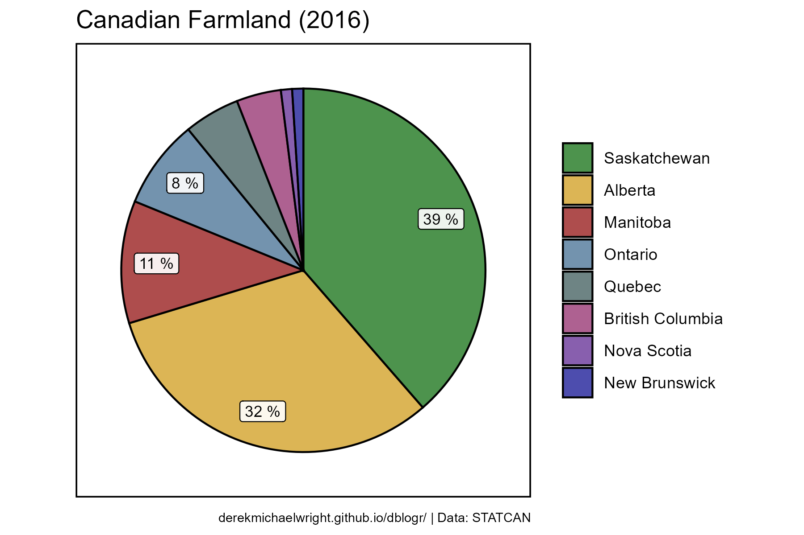

```{r}
# Prep data
xx <- d1 %>% 
  filter(Year == 2016, Item == "Total area of farms", Unit == "Hectares")
x1 <- xx %>% filter(Area == "Canada")
xx <- xx %>% filter(Area != "Canada") %>% 
  mutate(Percent = round(100 * Value / x1$Value)) %>% 
  arrange(Percent) %>% filter(Percent > 0) %>%
  mutate(Label_y = cumsum(Percent),
         Label_y = Label_y - (Percent / 2),
         Label = ifelse(Percent > 6, paste(Percent, "%"), NA)) %>%
  arrange(desc(Percent)) %>%
  mutate(Area = factor(Area, levels = Area),
         Area_Short = plyr::mapvalues(Area, d0$Area, d0$Area_Short))
# Plot
mp <- ggplot(xx, aes(x = 1)) +
  geom_bar(aes(y = -Percent, fill = Area), stat = "identity", 
           color = "black", alpha = 0.7) +
  coord_polar("y", start = 0) +
  geom_label(aes(y = -Label_y, label = Label), 
             nudge_x = 0.275, size = 3, alpha = 0.9) +
  
  theme_agData_pie(plot.caption = element_text(size = 7)) +
  xlim(0.542, 1.45) +
  scale_fill_manual(name = NULL, values = agData_Colors) +
  labs(title = "Canadian Farmland (2016)", x = NULL, 
       y = "Million Hectares", caption = myCaption)
ggsave("farmland_canada_1_02.png", mp, width = 6, height = 4)
```

---

What is the total amount of farmland in Canada?

```{r}
sum(xx$Value)
```

---

## Provinces


```{r}
# Prep data
xx <- d1 %>%
  filter(Item == "Total area of farms",
         Unit == "Hectares", Area != "Canada")
# Plot
mp <- ggplot(xx, aes(x = Year, y = Value / 1000000)) +
  geom_col(alpha = 0) +
  geom_line(color = "darkgreen", alpha = 0.7, size = 1) + 
  geom_point(alpha = 0.3, size = 0.5) +
  facet_wrap(. ~ Area, scales = "free_y", ncol = 5) +
  scale_x_continuous(breaks = seq(1925, 2015, 20), expand = c(0.01,0)) +
  theme_agData(axis.text.x = element_text(angle = 45, hjust = 1)) +
  labs(title = "Canadian Farmland", x = NULL, 
       y = "Million Hectares", caption = myCaption)
ggsave("farmland_canada_1_03.png", mp, width = 12, height = 5)
```

---

## Ontario & Quebec

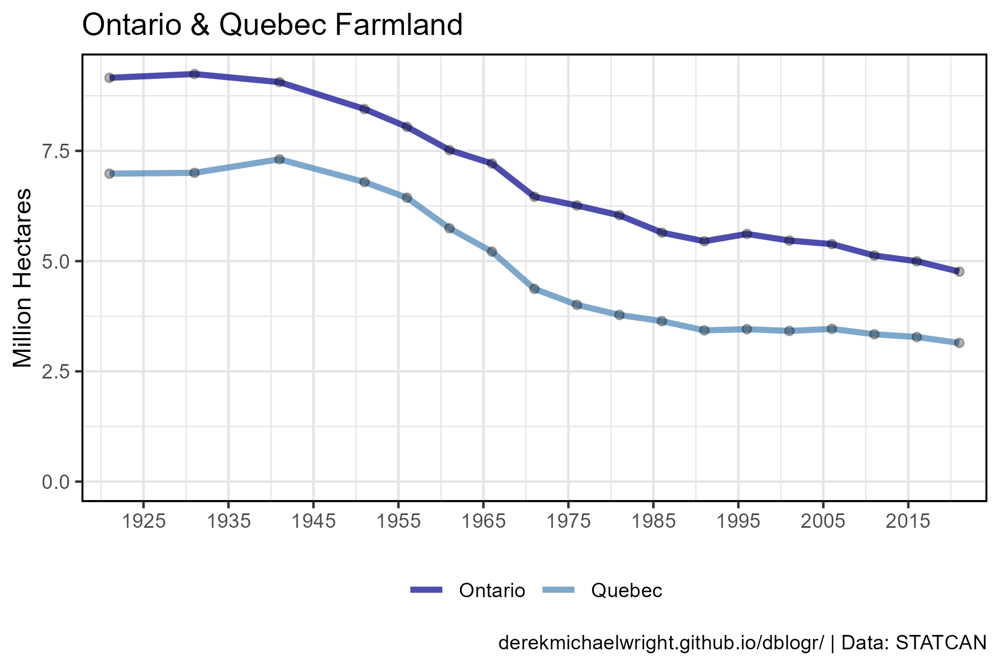

```{r}
# Prep data
xx <- d1 %>%
  filter(Item == "Total area of farms", Unit == "Hectares",
         Area %in% c("Ontario", "Quebec"))
# Plot
mp <- ggplot(xx, aes(x = Year, y = Value / 1000000)) +
  geom_col(position = "dodge", alpha = 0) +
  geom_line(aes(color = Area), size = 1.25, alpha = 0.7) +
  geom_point(alpha = 0.3) +
  scale_color_manual(name = NULL, values = c("darkblue", "steelblue")) +
  scale_x_continuous(breaks = seq(1925, 2015, 10), expand = c(0.01,0)) +
  theme_agData(legend.position = "bottom") +
  labs(title = "Ontario & Quebec Farmland", x = NULL, 
       y = "Million Hectares", caption = myCaption)
ggsave("farmland_canada_1_04.png", mp, width = 6, height = 4)
```

---

# Cropland vs Pasture {.tabset .tabset-pills}

## Canada

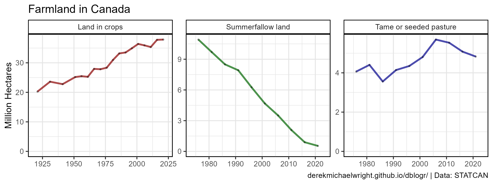

```{r}
# Prep data
myItems <- c("Land in crops", "Tame or seeded pasture", "Summerfallow land")
xx <- d1 %>%
  filter(Item %in% myItems, Area == "Canada",
         Measurement == "Hectares")
# Plot
mp <- ggplot(xx, aes(x = Year, y = Value / 1000000)) +
  geom_col(alpha = 0) +
  geom_line(aes(color = Item), alpha = 0.7, size = 1) + 
  geom_point(alpha = 0.3, size = 0.5) +
  facet_wrap(Item ~ ., scales = "free") +
  scale_color_manual(values = c("darkred", "darkgreen", "darkblue")) +
  theme_agData(legend.position = "none") +
  labs(title = "Farmland in Canada", x = NULL, 
       y = "Million Hectares", caption = myCaption)
ggsave("farmland_canada_1_05.png", mp, width = 8, height = 3)
```

---

## Provinces {.tabset .tabset-pills}

### 2016

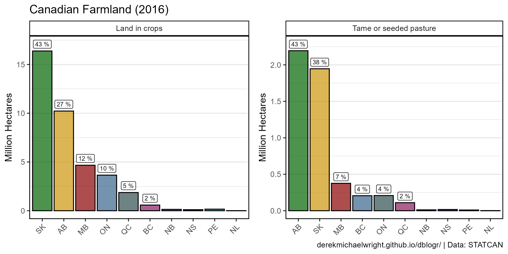

```{r}
# Prep data
myAreas <- c("British Columbia", "Alberta", "Saskatchewan",
             "Manitoba", "Ontario", "Quebec")
xx <- d1 %>% 
  filter(Year == 2016, Item == "Land in crops", Unit == "Hectares")
x1 <- xx %>% filter(Area == "Canada")
xx <- xx %>% filter(Area != "Canada") %>% 
  mutate(Percent = round(100 * Value / x1$Value)) %>% 
  arrange(Percent) %>%
  mutate(Area = factor(Area, levels = rev(Area)),
         Area_Short = plyr::mapvalues(Area, d0$Area, d0$Area_Short),
         Label = ifelse(Area %in% myAreas, paste(Percent, "%"), NA))
# Plot
mp1 <- ggplot(xx, aes(x = Area_Short, y = Value / 1000000)) +
  geom_bar(aes(fill = Area), stat = "identity", 
           color = "black", alpha = 0.7) +
  geom_label(aes(label = Label), nudge_y = 0.7, size = 2.5) +
  facet_wrap(Item ~ .) +
  scale_fill_manual(values = agData_Colors) +
  theme_agData(legend.position = "none", 
               axis.text.x = element_text(angle = 45, hjust = 1)) +
  labs(title = "Canadian Farmland (2016)", x = NULL, 
       y = "Million Hectares", caption = "")
# Prep data
xx <- d1 %>% 
  filter(Year == 2016, Item == "Tame or seeded pasture", Unit == "Hectares")
x1 <- xx %>% filter(Area == "Canada")
xx <- xx %>% filter(Area != "Canada") %>% 
  mutate(Percent = round(100 * Value / x1$Value)) %>% 
  arrange(Percent) %>%
  mutate(Area = factor(Area, levels = rev(Area)),
         Area_Short = plyr::mapvalues(Area, d0$Area, d0$Area_Short),
         Label = ifelse(Area %in% myAreas, paste(Percent, "%"), NA))
# Plot
mp2 <- ggplot(xx, aes(x = Area_Short, y = Value / 1000000)) +
  geom_bar(aes(fill = Area), stat = "identity", 
           color = "black", alpha = 0.7) +
  geom_label(aes(label = Label), nudge_y = 0.09, size = 2.5) +
  facet_wrap(Item ~ .) +
  scale_fill_manual(values = agData_Colors) +
  theme_agData(legend.position = "none", 
               axis.text.x = element_text(angle = 45, hjust = 1)) +
  labs(title = "", x = NULL, 
       y = "Million Hectares", caption = myCaption)
mp <- ggarrange(mp1, mp2)
ggsave("farmland_canada_1_06.png", mp, width = 8, height = 4)
```

---

### All Data

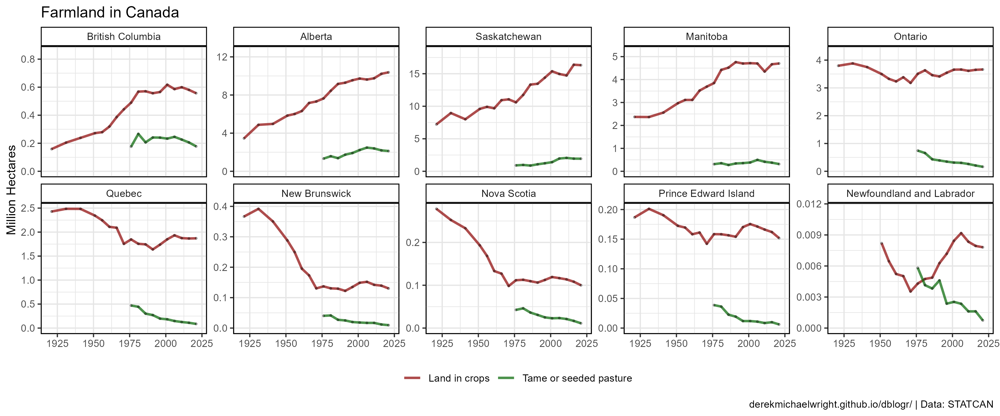

```{r}
# Prep data
myItems <- c("Land in crops", "Tame or seeded pasture")
xx <- d1 %>%
  filter(Item %in% myItems, Area != "Canada",
         Measurement == "Hectares")
# Plot
mp <- ggplot(xx, aes(x = Year, y = Value / 1000000)) +
  geom_col(alpha = 0) +
  geom_line(aes(color = Item), alpha = 0.7, size = 1) + 
  geom_point(alpha = 0.3, size = 0.5) +
  facet_wrap(. ~ Area, scales = "free_y", ncol = 5) +
  scale_color_manual(name = NULL, values = c("darkred", "darkgreen", "darkblue")) +
  theme_agData(legend.position = "bottom") +
  labs(title = "Farmland in Canada", x = NULL, 
       y = "Million Hectares", caption = myCaption)
ggsave("farmland_canada_1_07.png", mp, width = 12, height = 5)
```

---

# Average Farm Size {.tabset .tabset-pills}

## Canada

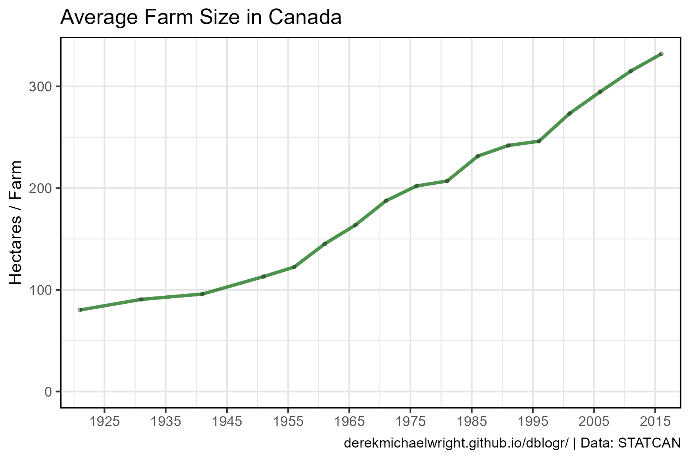

```{r}
# Prep data
xx <- d2 %>% 
  filter(Item %in% c("Total area of farms", "Total number of farms"),
         Unit %in% c("Number", "Hectares")) %>%
  select(-Item, -Measurement) %>% 
  spread(Unit, Value) %>%
  mutate(Size = Hectares / Number)
# Plot
mp <- ggplot(xx %>% filter(Area == "Canada"), aes(y = Size, x = Year)) + 
  geom_col(alpha = 0) +
  geom_line(color = "darkgreen", alpha = 0.7, size = 1) + 
  geom_point(alpha = 0.3, size = 0.75) +
  scale_x_continuous(breaks = seq(1925, 2015, 10), expand = c(0.01,0)) +
  theme_agData() +
  labs(title = "Average Farm Size in Canada", x = NULL, 
       y = "Hectares / Farm", caption = myCaption)
ggsave("farmland_canada_2_01.png", mp, width = 6, height = 4)
```

---

## Provinces

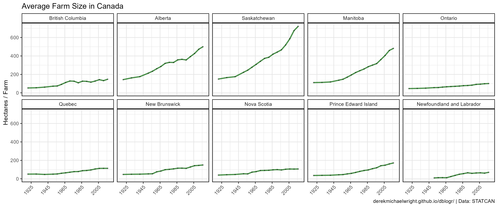

```{r}
# Plot
mp <- ggplot(xx %>% filter(Area != "Canada"), aes(y = Size, x = Year)) + 
  geom_col(alpha = 0) +
  geom_line(color = "darkgreen", alpha = 0.7, size = 1) + 
  geom_point(alpha = 0.3, size = 0.5) +
  facet_wrap(Area ~ ., ncol = 5) +
  scale_x_continuous(breaks = seq(1925, 2005, 20)) +
  theme_agData(axis.text.x = element_text(angle = 45, hjust = 1)) +
  labs(title = "Average Farm Size in Canada", x = NULL,
       y = "Hectares / Farm", caption = myCaption)
ggsave("farmland_canada_2_02.png", mp, width = 12, height = 5)
```

---

# Number vs. Area {.tabset .tabset-pills}

## Canada

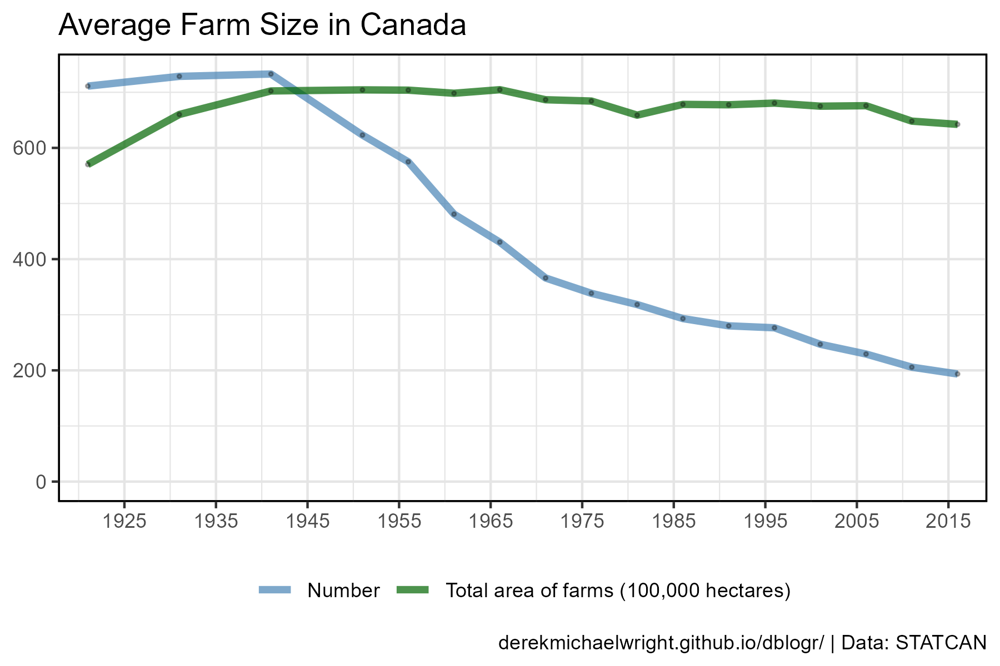

```{r}
# Prep data
xx <- d2 %>% 
  filter(Area == "Canada", Unit != "Acres",
         Item %in% c("Total area of farms", "Total number of farms")) %>%
  mutate(Value = ifelse(Unit == "Hectares", Value / 100000, Value / 1000),
         Unit = plyr::mapvalues(Unit, 
            c("Hectares", "Number of farms reporting"), 
            c("Total area of farms (100,000 hectares)",
              "Number of farms (x1000)")))
# Plot
mp <- ggplot(xx, aes(y = Value, x = Year)) + 
  geom_col(position = "dodge", alpha = 0) +
  geom_line(aes(color = Unit), size = 1.5, alpha = 0.7) +
  geom_point(alpha = 0.3, size = 0.5) +
  scale_color_manual(name = NULL, values = c("steelblue", "darkgreen")) +
  scale_x_continuous(breaks = seq(1925, 2015, 10), expand = c(0.01,0)) +
  theme_agData(legend.position = "bottom") +
  labs(title = "Average Farm Size in Canada", 
       y = NULL, x = NULL, caption = myCaption)
ggsave("farmland_canada_2_03.png", mp, width = 6, height = 4)
```

---

## Provinces

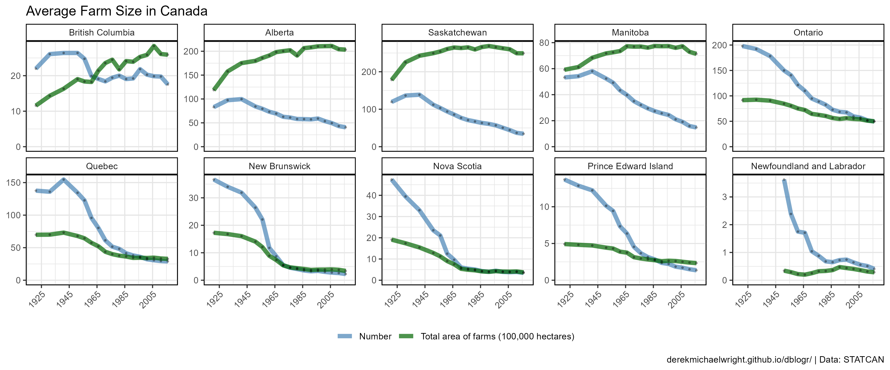

```{r}
# Prep data
xx <- d2 %>% 
  filter(Area != "Canada", Unit != "Acres",
         Item %in% c("Total area of farms", "Total number of farms")) %>%
  mutate(Value = ifelse(Unit == "Hectares", Value / 100000, Value / 1000),
         Unit = plyr::mapvalues(Unit, 
            c("Hectares", "Number of farms reporting"), 
            c("Total area of farms (100,000 hectares)",
              "Number of farms (x1000)")))
# Plot
mp <- ggplot(xx, aes(y = Value, x = Year)) + 
  geom_col(position = "dodge", alpha = 0) +
  geom_line(aes(color = Unit), size = 2, alpha = 0.7) +
  geom_point(alpha = 0.3, size = 0.5) +
  facet_wrap(Area ~ ., scales = "free_y", ncol = 5) +
  scale_color_manual(name = NULL, values = c("steelblue", "darkgreen")) +
  scale_x_continuous(breaks = seq(1925, 2005, 20)) +
  theme_agData(legend.position = "bottom",
               axis.text.x = element_text(angle = 45, hjust = 1)) +
  labs(title = "Average Farm Size in Canada", 
       y = NULL, x = NULL, caption = myCaption)
ggsave("farmland_canada_2_04.png", mp, width = 12, height = 5)
```

---

# Farm Size {.tabset .tabset-pills}

## Canada {.tabset .tabset-pills}

### Unscaled

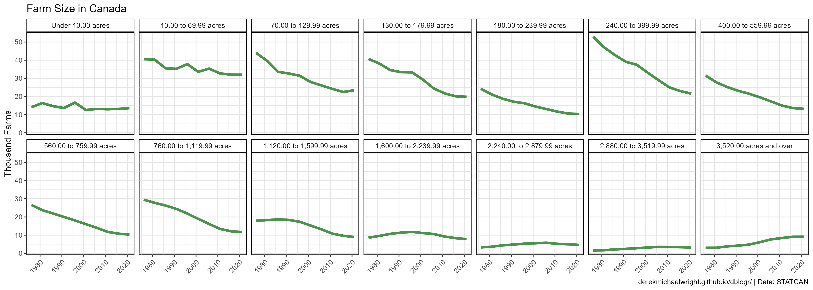

```{r}
# Prep data
xx <- d3 %>% filter(Area == "Canada", Measurement != "Total number of farms") 
# Plot
mp <- ggplot(xx, aes(x = Year, y = Value / 1000)) + 
  geom_line(color = "darkgreen", size = 1.5, alpha = 0.7) + 
  facet_wrap(Measurement ~ ., ncol = 7) +
  theme_agData(axis.text.x = element_text(angle = 45, hjust = 1)) +
  labs(title = "Farm Size in Canada", x = NULL,
       y = "Thousand Farms", caption = myCaption)
ggsave("farmland_canada_3_01.png", mp, width = 14, height = 5)
```

---

### Scaled

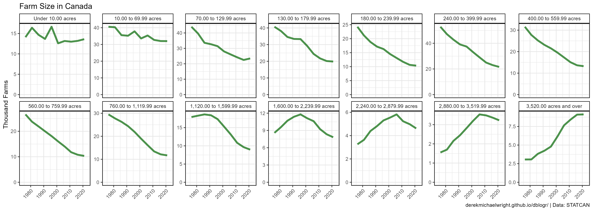

```{r}
# Plot
mp <- ggplot(xx, aes(x = Year, y = Value / 1000)) + 
  geom_col(alpha = 0) +
  geom_line(color = "darkgreen", size = 1.5, alpha = 0.7) + 
  facet_wrap(Measurement ~ ., scales = "free_y", ncol = 7) +
  theme_agData(axis.text.x = element_text(angle = 45, hjust = 1)) +
  labs(title = "Farm Size in Canada", x = NULL,
       y = "Thousand Farms", caption = myCaption)
ggsave("farmland_canada_3_02.png", mp, width = 14, height = 5)
```

---

### Bar Charts

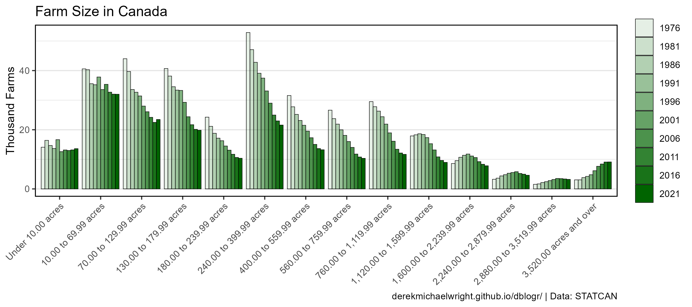

```{r}
# Prep data
myColors <- alpha("darkgreen", seq(0.1, 1, by = 0.1))
# Plot
mp <- ggplot(xx, aes(y = Value / 1000, x = Measurement, fill = as.factor(Year))) + 
  geom_col(position = "dodge", color = "black", lwd = 0.2) +
  scale_fill_manual(name = NULL, values = myColors) +
  theme_agData(axis.text.x = element_text(angle = 45, hjust = 1)) +
  labs(title = "Farm Size in Canada", x = NULL,
       y = "Thousand Farms", caption = myCaption)
ggsave("farmland_canada_3_03.png", mp, width = 9, height = 4)
```

```{r eval = F, echo = F}
# Plot
mp <- ggplot(xx, aes(y = Value / 1000, x = Measurement, fill = Year)) + 
  geom_col(color = "black") +
  theme_agData(axis.text.x = element_text(angle = 45, hjust = 1)) +
  labs(title = "Farm Size in Canada", y = "Thousand Farms", x = NULL,
       caption = myCaption) + transition_time(Year)
anim_save("farmland_canada_gifs_01.gif", mp,
          nframes = 2*(max(xx$Year) - min(xx$Year)), fps = 10, 
          end_pause = 20, width = 1200, height = 800, res = 150, units = "px")
```

---

## Saskatchewan {.tabset .tabset-pills}

### Unscaled

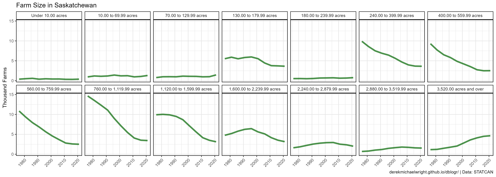

```{r}
# Prep data
xx <- d3 %>% filter(Area == "Saskatchewan", Measurement != "Total number of farms") 
# Plot
mp <- ggplot(xx, aes(x = Year, y = Value / 1000)) + 
  geom_line(color = "darkgreen", size = 1.5, alpha = 0.7) + 
  facet_wrap(Measurement ~ ., ncol = 7) +
  theme_agData(axis.text.x = element_text(angle = 45, hjust = 1)) +
  labs(title = "Farm Size in Saskatchewan", x = NULL,
       y = "Thousand Farms", caption = myCaption)
ggsave("farmland_canada_3_04.png", mp, width = 14, height = 5)
```

---

### Scaled

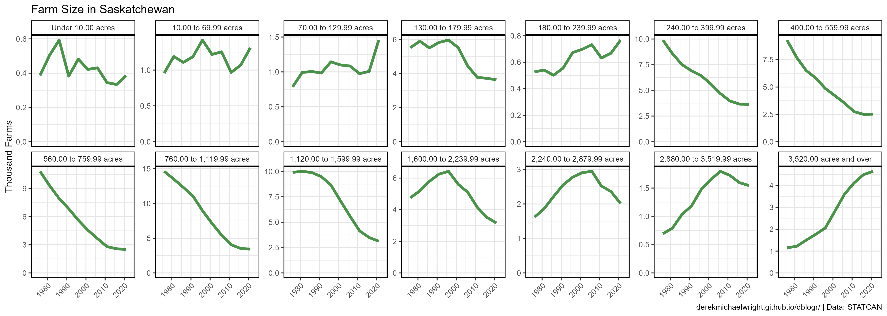

```{r}
# Plot
mp <- ggplot(xx, aes(x = Year, y = Value / 1000)) +
  geom_col(alpha = 0) +
  geom_line(color = "darkgreen", size = 1.5, alpha = 0.7) + 
  facet_wrap(Measurement ~ ., scales = "free_y", ncol = 7) +
  theme_agData(axis.text.x = element_text(angle = 45, hjust = 1)) +
  labs(title = "Farm Size in Saskatchewan", x = NULL,
       y = "Thousand Farms", caption = myCaption)
ggsave("farmland_canada_3_05.png", mp, width = 14, height = 5)
```

---

### Bar Charts


```{r}
# Prep data
myColors <- alpha("darkgreen", seq(0.1, 1, by = 0.1))
# Plot
mp <- ggplot(xx, aes(y = Value / 1000, x = Measurement, 
                     fill = as.factor(Year))) + 
  geom_col(position = "dodge", color = "black", lwd = 0.2) +
  scale_fill_manual(name = NULL, values = myColors) +
  theme_agData(axis.text.x = element_text(angle = 45, hjust = 1)) +
  labs(title = "Farm Size in Saskatchewan", x = NULL,
       y = "Thousand Farms", caption = myCaption)
ggsave("farmland_canada_3_06.png", mp, width = 9, height = 4)
```

---

## Provinces

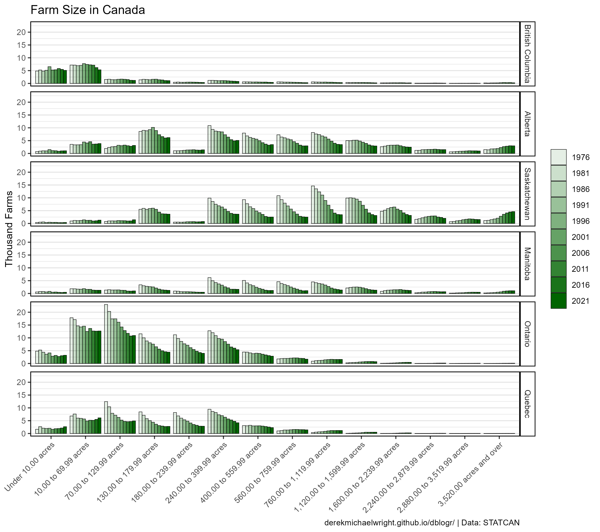

```{r}
# Prep data
myColors <- alpha("darkgreen", seq(0.1, 1, by = 0.1))
myAreas <- c("British Columbia", "Alberta", "Saskatchewan",
             "Manitoba", "Ontario", "Quebec")
xx <- d3 %>% 
  filter(Area %in% myAreas, Measurement != "Total number of farms") %>%
  mutate(Year = factor(Year))
#
mp <- ggplot(xx, aes(y = Value / 1000, x = Measurement, fill = Year)) + 
  geom_col(position = "dodge", color = "black", lwd = 0.2) +
  facet_grid(Area ~ .) +
  scale_fill_manual(name = NULL, values = myColors) +
  theme_agData(axis.text.x = element_text(angle = 45, hjust = 1)) +
  labs(title = "Farm Size in Canada", x = NULL,
       y = "Thousand Farms", caption = myCaption)
ggsave("farmland_canada_3_07.png", mp, width = 9, height = 8)
```

---


```{r}
# Prep data
myColors <- c("maroon4", "darkgoldenrod3", "darkgreen",
              "darkred", "steelblue4", "darkslategrey")
myAreas <- c("British Columbia", "Alberta", "Saskatchewan",
             "Manitoba", "Ontario", "Quebec")
xx <- d3 %>% 
  filter(Area %in% myAreas, Measurement != "Total number of farms") %>%
  mutate(Area = factor(Area, levels = myAreas))
#
mp <- ggplot(xx, aes(y = Value / 1000, x = Measurement, fill = Area)) + 
  geom_col(color = "black", alpha = 0.7, lwd = 0.2) +
  facet_grid(Area ~ ., scales = "free_y") +
  scale_fill_manual(values = myColors) +
  theme_agData(legend.position = "none",
               axis.text.x = element_text(angle = 45, hjust = 1)) +
  labs(title = "Farm Size in Canada | {round(frame_time)}", 
       y = "Thousand Farms", x = NULL, caption = myCaption) +
  transition_time(Year)
anim_save("farmland_canada_gif_01.gif", mp,
          nframes = 300, fps = 25, end_pause = 60, 
          width = 900, height = 1200, res = 150, units = "px")
```

---

# Farmland Prices {.tabset .tabset-pills}

## Canada

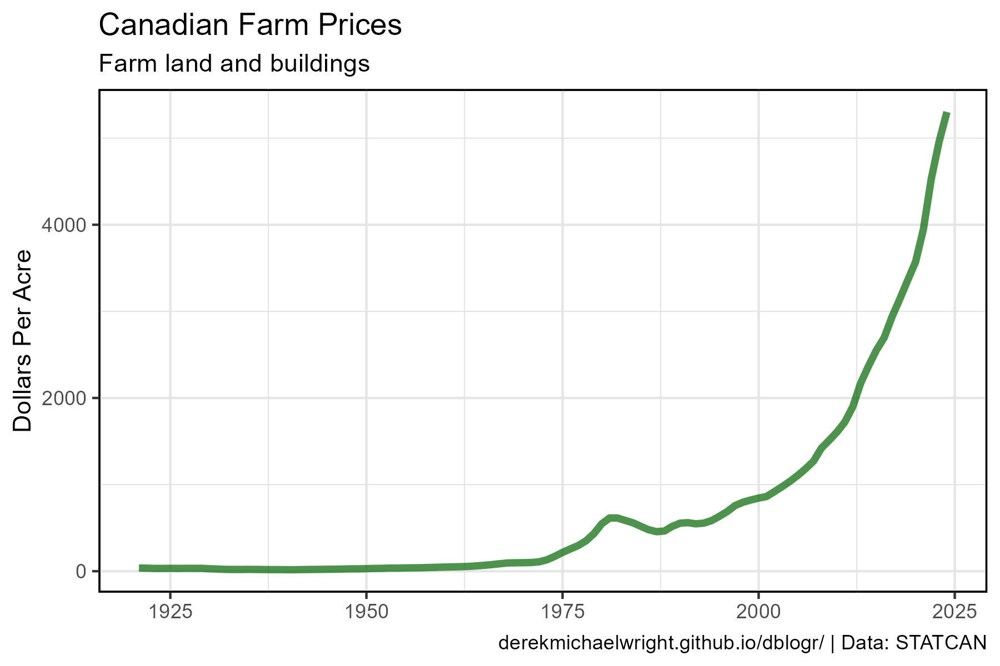

```{r}
# Prep data
xx <- d4 %>% filter(Area == "Canada")
# Plot
mp <- ggplot(xx, aes(x = Year, y = Value)) +
  geom_line(alpha = 0.7, size = 1.5, color = "darkgreen") +
  theme_agData() +
  labs(title = "Canadian Farm Prices", subtitle = "Farm land and buildings",
       y = "Dollars Per Acre", x = NULL, caption = myCaption)
ggsave("farmland_canada_4_01.png", mp, width = 6, height = 4)
```

---

## Provinces

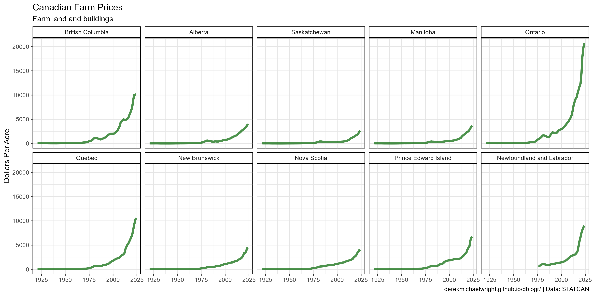

```{r}
# Prep data
xx <- d4 %>% filter(Area != "Canada")
# Plot
mp <- ggplot(xx, aes(x = Year, y = Value)) +
  geom_line(alpha = 0.7, size = 1.5, color = "darkgreen") +
  facet_wrap(Area ~ ., ncol = 5) +
  theme_agData() +
  labs(title = "Canadian Farm Prices", subtitle = "Farm land and buildings",
       y = "Dollars Per Acre", x = NULL, caption = myCaption)
ggsave("farmland_canada_4_02.png", mp, width = 12, height = 6)
```

---

## 2022

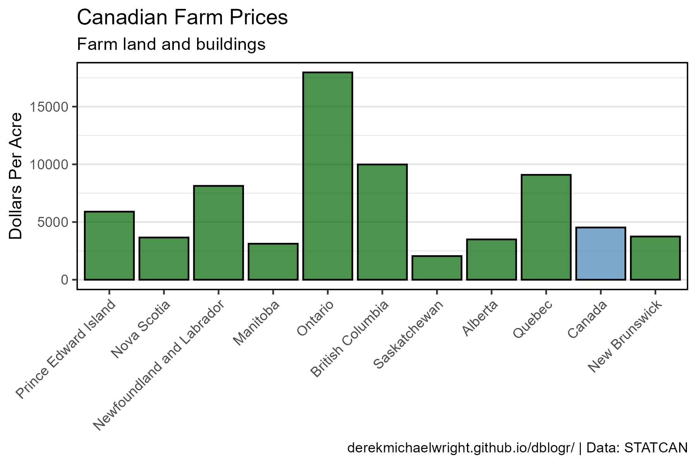

```{r}
# Prep data
xx <- d4 %>% filter(Year == 2022) %>% arrange(rev(Value)) %>%
  mutate(Area = factor(Area, levels = .$Area),
         Group = ifelse(Area == "Canada", "Can", "Provs"))
# Plot
mp <- ggplot(xx, aes(x = Area, y = Value, fill = Group)) +
  geom_col(alpha = 0.7, color = "black") +
  scale_fill_manual(values = c("steelblue","darkgreen")) +
  theme_agData(legend.position = "none",
               axis.text.x = element_text(angle = 45, hjust = 1)) +
  labs(title = "Canadian Farm Prices", subtitle = "Farm land and buildings",
       y = "Dollars Per Acre", x = NULL, caption = myCaption)
ggsave("farmland_canada_4_03.png", mp, width = 6, height = 4)
```

---

```{r eval = F, echo = F}
# Prep data
xx <- agData_STATCAN_FarmLand_Crops
xx <- agData_STATCAN_FarmLand_Farms
xx <- agData_STATCAN_FarmLand_Inputs
xx <- agData_STATCAN_FarmLand_Size
xx <- agData_STATCAN_FarmLand_Use
# Plot
ggplot(xx, aes(x = Year, y = Value)) + 
  geom_line() + 
  facet_wrap(Item + Measurement + Unit ~ ., scales = "free_y")
```

```{r eval = F, echo = F}
# Prep data
xx <- dd
# Plot
ggplot(xx, aes(x = Year, y = Value)) + 
  geom_line() + 
  facet_wrap(Item + Measurement + Unit ~ ., scales = "free_y")
```

```{r eval = F, echo = F}
# Prep data
xx <- agData_STATCAN_FarmLand_Farms %>% 
  filter(Area == "Canada")
# Plot
ggplot(xx, aes(x = Year, y = Value)) + 
  geom_line() + 
  facet_wrap(Measurement + Unit ~ ., scales = "free")
```

```{r eval = F, echo = F}
# Prep data
xx <- agData_STATCAN_FarmLand_Crops %>% 
  filter(Area == "Canada", Item == "Total wheat")
# Plot
ggplot(xx, aes(x = Year, y = Value)) + 
  geom_line() + 
  facet_wrap(Measurement + Unit ~ ., scales = "free_y")
```
