```{r setup, include = FALSE}
knitr::opts_chunk$set(echo = T, warning = F, message = F)
```

---

# Data

> - `r shiny::icon("globe")` [http://www.fao.org/faostat/en/#data/RL](http://www.fao.org/faostat/en/#data/RL){target="_blank"}
> - `r shiny::icon("save")` [agData_FAO_LandUse.csv](https://github.com/derekmichaelwright/agData/raw/master/Data/agData_FAO_LandUse.csv.gz)

> - `r shiny::icon("save")` [agData_FAO_Country_Table.csv](https://github.com/derekmichaelwright/agData/raw/master/Data/agData_FAO_Country_Table.csv)
> - `r shiny::icon("save")` [agData_FAO_Region_Table.csv](https://github.com/derekmichaelwright/agData/raw/master/Data/agData_FAO_Region_Table.csv)

```{r class.source = "fold-show"}
# devtools::install_github("derekmichaelwright/agData")
library(agData)
# devtools::install_github("hrbrmstr/waffle")
library(waffle)
```

---

# Prepare Data

```{r}
# Prep data
myColors <- c("darkred", "darkgreen", "darkorange", "darkblue", "steelblue" )
myItems1 <- c("Agricultural land", 
             "Land under perm. meadows and pastures",
             "Cropland")
myItems2 <- c("Total Agricultural Land", "Meadows & Pastures", "Crop Land")
#
pp <- agData_FAO_Population %>% 
  filter(Measurement == "Total") %>%
  select(Area, Year, Population=Value)
d1 <- agData_FAO_LandUse %>% 
  filter(Item %in% myItems1) %>%
  left_join(pp, by = c("Area","Year")) %>%
  mutate(Item = plyr::mapvalues(Item, myItems1, myItems2),
         Item = factor(Item, levels = myItems2),
         AreaPerPerson = Value / Population)
d2 <- agData_FAO_LandUse
#
myCaption <- "derekmichaelwright.github.io/dblogr/agdata/farmland_world | Data: FAOSTAT"
```

---

# Agricultural Area {.tabset .tabset-pills}

## Total


```{r}
# Prep data
xx <- d1 %>% filter(Area %in% "World")
# Plot 
mp1 <- ggplot(xx, aes(x = Year, y = Value / 1000000000, color = Item)) +
  geom_line(size = 1.5, alpha = 0.8) +
  facet_wrap(Item ~ ., scales = "free_y") +
  scale_color_manual(values = myColors) +
  theme_agData(legend.position = "none") +
  labs(title = "A)", y = "Billion Hectares", x = NULL, caption = "")
mp2 <- ggplot(xx, aes(x = Year, y = Value / 1000000000, fill = Item)) +
  geom_col(size = 1.5, alpha = 0.8) +
  facet_wrap(Item ~ ., scales = "free_y") +
  scale_fill_manual(values = myColors) +
  theme_agData(legend.position = "none") +
  labs(title = "B)", y = "Billion Hectares", x = NULL, caption = myCaption)
mp <- ggarrange(mp1, mp2, ncol = 1, nrow = 2)
ggsave("farmland_world_1_01.png", mp, width = 10, height = 7)
```

```{r echo = F}
ggsave("featured.png", mp, width = 10, height = 7)
```

---

## Per Person

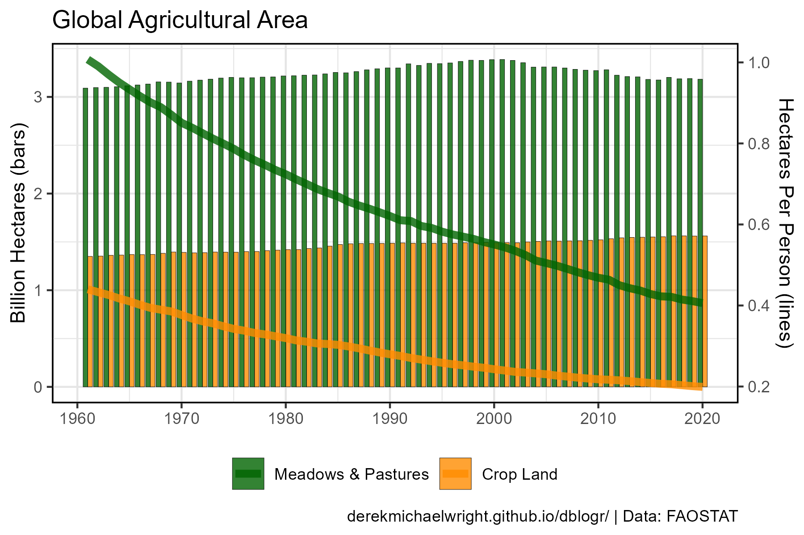

```{r}
# Prep Data
xx <- d1 %>% filter(Area %in% "World", Item != myItems2[1])
y1_min <- 0
y1_max <- max(xx$Value)
y2_min <- min(xx$AreaPerPerson)
y2_max <- max(xx$AreaPerPerson)
xx <- xx %>% 
  mutate(APP_scaled = (AreaPerPerson - y2_min) * (y1_max - y1_min) / 
                                 (y2_max - y2_min) + y1_min )
mySA <- sec_axis(~(. - y1_min) * (y2_max - y2_min) / (y1_max - y1_min) + y2_min, 
                 name = "Hectares Per Person (lines)")
# Plot Data
mp <- ggplot(xx, aes(x = Year, y = Value, fill = Item)) + 
  geom_col(position = "dodge", color = "black", alpha = 0.8, lwd = 0.1) +
  geom_line(aes(y = APP_scaled, color = Item), size = 2, alpha = 0.8) +
  scale_x_continuous(breaks = seq(1960, 2020, by = 10)) +
  scale_y_continuous(breaks = 0:3 * 1000000000, labels = 0:3, 
                     sec.axis = mySA) +
  scale_fill_manual(name = NULL, values = myColors[2:3]) +
  scale_color_manual(name = NULL, values = myColors[2:3]) +
  theme_agData(legend.position = "bottom") +
  labs(title = "Global Agricultural Area", x = NULL,
       y = "Billion Hectares (bars)", caption = myCaption)
ggsave("farmland_world_1_02.png", mp, width = 6, height = 4)
```

---

## Regions {.tabset .tabset-pills}

### Bar

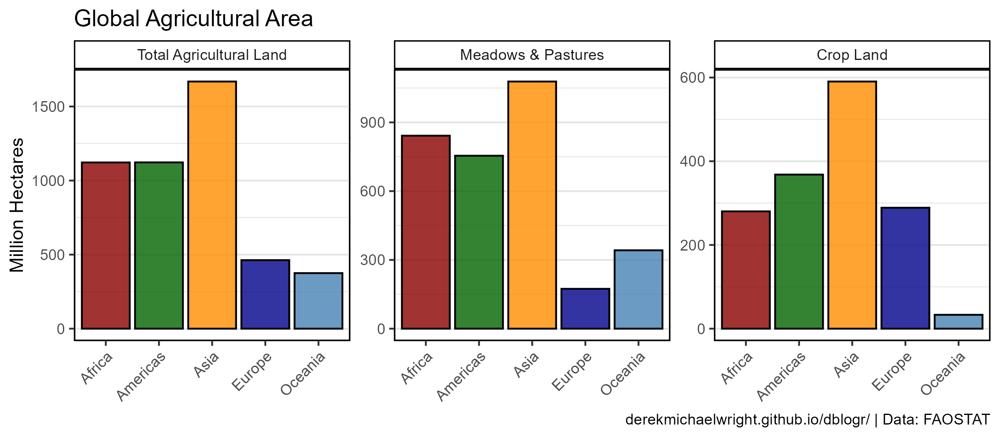

```{r}
# Prep Data
xx <- d1 %>% filter(Year == 2019, Area %in% agData_FAO_Region_Table$Region)
# Plot Data
mp <- ggplot(xx, aes(x = Area, y = Value / 1000000, fill = Area)) + 
  geom_col(color = "black", alpha = 0.8) +
  facet_wrap(Item ~ ., scales = "free_y") +
  scale_fill_manual(name = NULL, values = myColors) +
  theme_agData_col(legend.position = "none",
                   axis.text.x = element_text(angle = 45, hjust = 1)) + 
  labs(title = "Global Agricultural Area", x = NULL, 
       y = "Million Hectares", caption = myCaption)
ggsave("farmland_world_1_03.png", mp, width = 8, height = 3.5)
```

---

### Waffle

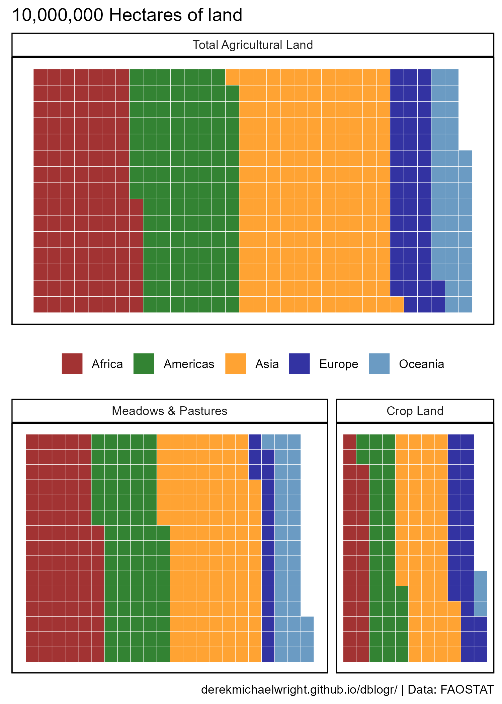

```{r}
# Prep data
xx <- d1 %>% 
  filter(Year == 2019, Area %in% agData_FAO_Region_Table$Region) %>% 
  mutate(Value = round(Value / 10000000))
x1 <- xx %>% filter(Item == myItems2[1])
x2 <- xx %>% filter(Item != myItems2[1])
# Plot
mp1 <- ggplot(x1, aes(fill = Area, values = Value)) +
  geom_waffle(color = "white", n_rows = 15, alpha = 0.8, na.rm = T) +
  scale_fill_manual(name = NULL, values = myColors) +
  facet_grid(. ~ Item, scales = "free", space = "free") +
  theme_agData_pie(legend.position = "bottom") +
  labs(title = "10,000,000 Hectares of land")
mp2 <- ggplot(x2, aes(fill = Area, values = Value)) +
  geom_waffle(color = "white", n_rows = 15, alpha = 0.8, na.rm = T) +
  scale_fill_manual(name = NULL, values = myColors) +
  facet_grid(. ~ Item, scales = "free", space = "free") +
  theme_agData_pie(legend.position = "none") +
  labs(caption = myCaption)
mp <- ggarrange(mp1, mp2, ncol = 1, nrow = 2, heights = c(1,0.8))
ggsave("farmland_world_1_04.png", mp, width = 5, height = 7)
```

---

## SubRegions

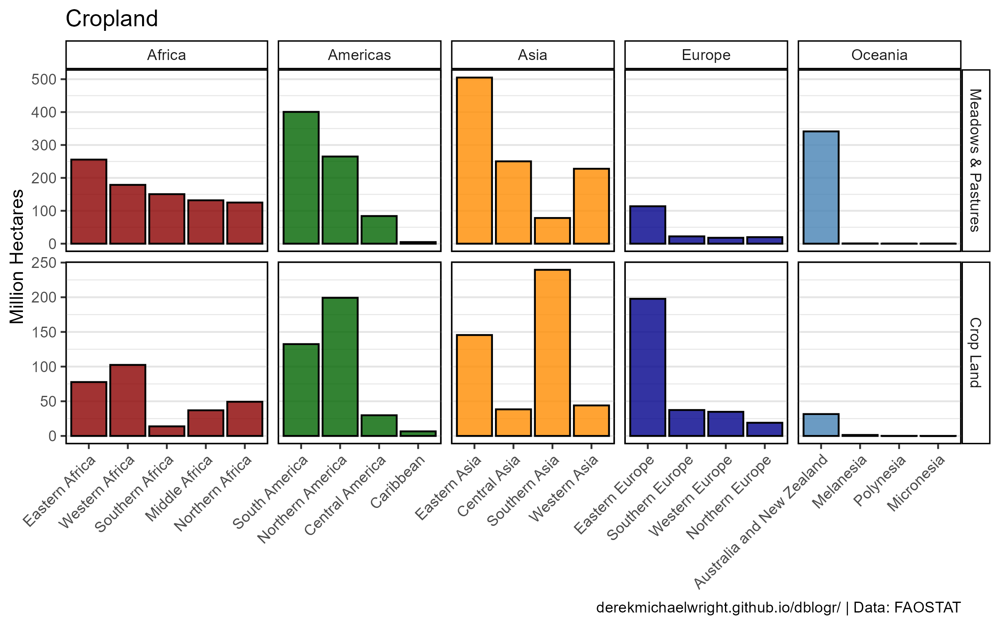

```{r}
# Prep Data
xx <- d1 %>% 
  filter(Year == 2019, Item != myItems2[1],
         Area %in% agData_FAO_Region_Table$SubRegion) %>%
  left_join(agData_FAO_Region_Table, by = c("Area"="SubRegion")) %>%
  arrange(desc(Value)) %>%
  mutate(Area = factor(Area, levels = unique(Area)) )
# Plot Data
mp <- ggplot(xx, aes(x = Area, y = Value / 1000000, fill = Region)) + 
  geom_col(color = "black", alpha = 0.8) +
  facet_grid(Item ~ Region, scales = "free", space = "free_x") +
  scale_fill_manual(name = NULL, values = myColors) +
  theme_agData_col(legend.position = "none",
                   axis.text.x = element_text(angle = 45, hjust = 1)) + 
  labs(title = "Cropland", x = NULL,
       y = "Million Hectares", caption = myCaption)
ggsave("farmland_world_1_05.png", mp, width = 8, height = 5)
```

---

# Maps {.tabset .tabset-pills}

## Total Area

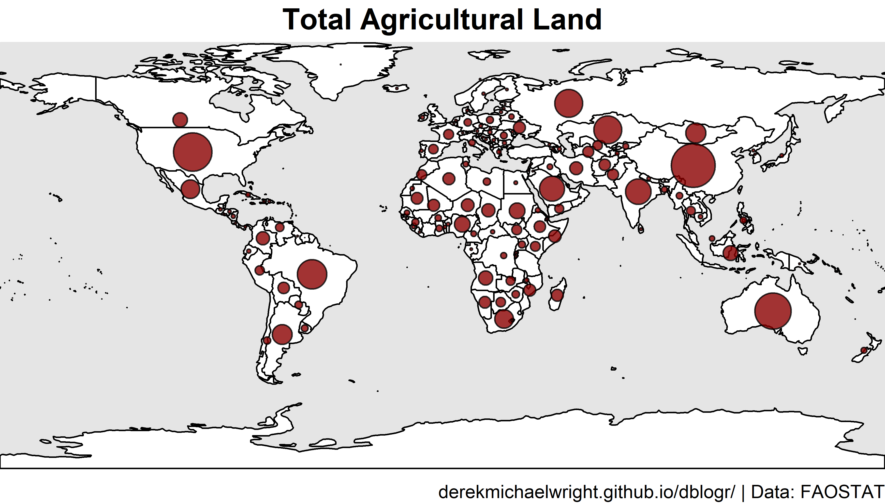

```{r results="hide"}
# Prep data
xx <- d1 %>% 
  filter(Year == 2019, Item == myItems2[1],
         Area %in% agData_FAO_Country_Table$Country) %>%
  left_join(agData_FAO_Country_Table, by = c("Area"="Country")) %>%
  arrange(desc(Value)) %>%
  mutate(Area = factor(Area, levels = unique(Area)) )
#
png("farmland_world_2_01.png", width = 3600, height = 2055, res = 600)
par(mai = c(0.2,0,0.25,0), xaxs = "i", yaxs = "i")
mapBubbles2(dF = xx, nameX = "Lon", nameY = "Lat",
            nameZColour = alpha("black",0.8), 
            nameZFill = alpha(myColors[1],0.8),
            nameZSize = "Value", addLegend = F,
            lwd = 1, oceanCol = "grey90", landCol = "white", borderCol = "black")
title(main = myItems2[1], line = 0.25, cex = 3) 
title(sub = myCaption, line = 0, cex.sub = 0.75, adj = 1)
dev.off()
```

---

## Cropland

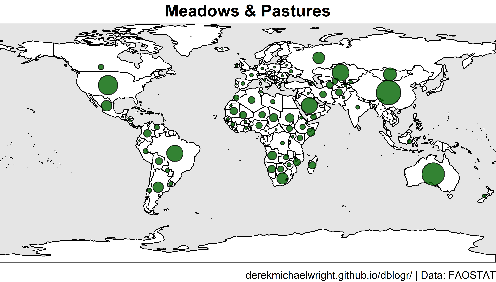
```{r results="hide"}
# Prep data
xx <- d1 %>% 
  filter(Year == 2019, Item == myItems2[2],
         Area %in% agData_FAO_Country_Table$Country) %>%
  left_join(agData_FAO_Country_Table, by = c("Area"="Country")) %>%
  arrange(desc(Value)) %>%
  mutate(Area = factor(Area, levels = unique(Area)) )
#
png("farmland_world_2_02.png", width = 3600, height = 2055, res = 600)
par(mai = c(0.2,0,0.25,0), xaxs = "i", yaxs = "i")
mapBubbles2(dF = xx, nameX = "Lon", nameY = "Lat",
            nameZColour = alpha("black",0.8), 
            nameZFill = alpha(myColors[2],0.8),
            nameZSize = "Value", addLegend = F,
            lwd = 1, oceanCol = "grey90", landCol = "white", borderCol = "black")
title(main = myItems2[2], line = 0.25, cex = 3) 
title(sub = myCaption, line = 0, cex.sub = 0.75, adj = 1)
dev.off()
```

---

## Pasture

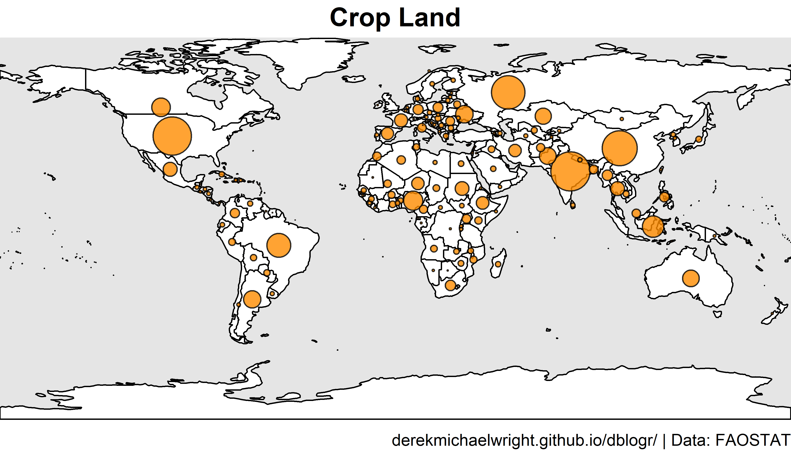

```{r results="hide"}
# Prep data
xx <- d1 %>% 
  filter(Year == 2019, Item == myItems2[3],
         Area %in% agData_FAO_Country_Table$Country) %>%
  left_join(agData_FAO_Country_Table, by = c("Area"="Country")) %>%
  arrange(desc(Value)) %>%
  mutate(Area = factor(Area, levels = unique(Area)) )
#
png("farmland_world_2_03.png", width = 3600, height = 2055, res = 600)
par(mai = c(0.2,0,0.25,0), xaxs = "i", yaxs = "i")
mapBubbles2(dF = xx, nameX = "Lon", nameY = "Lat",
            nameZColour = alpha("black",0.8), 
            nameZFill = alpha(myColors[3],0.8),
            nameZSize = "Value", addLegend = F,
            lwd = 1, oceanCol = "grey90", landCol = "white", borderCol = "black")
title(main = myItems2[3], line = 0.25, cex = 3) 
title(sub = myCaption, line = 0, cex.sub = 0.75, adj = 1)
dev.off()
```

---

# Top 20 Countries {.tabset .tabset-pills}

## Agricultural Land

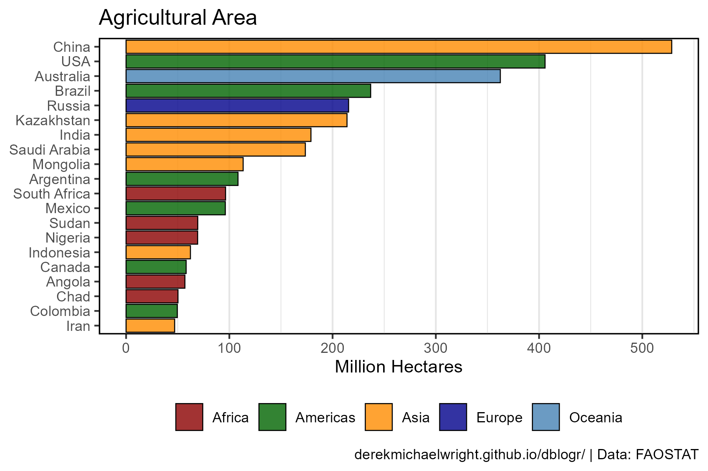

```{r}
# Prep Data
xx <- d1 %>% 
  filter(Item == myItems2[1], Year == 2019) %>%
  region_Info() %>%
  filter(Area %in% agData_FAO_Country_Table$Country) %>%
  arrange(desc(Value)) %>%
  slice(1:20) %>%
  mutate(Area = factor(Area, levels = unique(Area)))
# Plot Data
mp <- ggplot(xx, aes(x = Area, y = Value / 1000000, fill = Region)) + 
  geom_col(color = "black", alpha = 0.8, lwd = 0.3) +
  scale_fill_manual(name = NULL, values = myColors) +
  scale_x_discrete(limits = rev(levels(xx$Area))) +
  scale_y_continuous(breaks = seq(0, 500, by = 100)) +
  theme_agData_col(legend.position = "bottom", horizontal = T) + 
  coord_flip(ylim = c(0.02, max(xx$Value) / 1000000)) +
  labs(title = "Agricultural Area", x = NULL,
       y = "Million Hectares", caption = myCaption)
ggsave("farmland_world_3_01.png", mp, width = 6, height = 4)
```

---

## Cropland

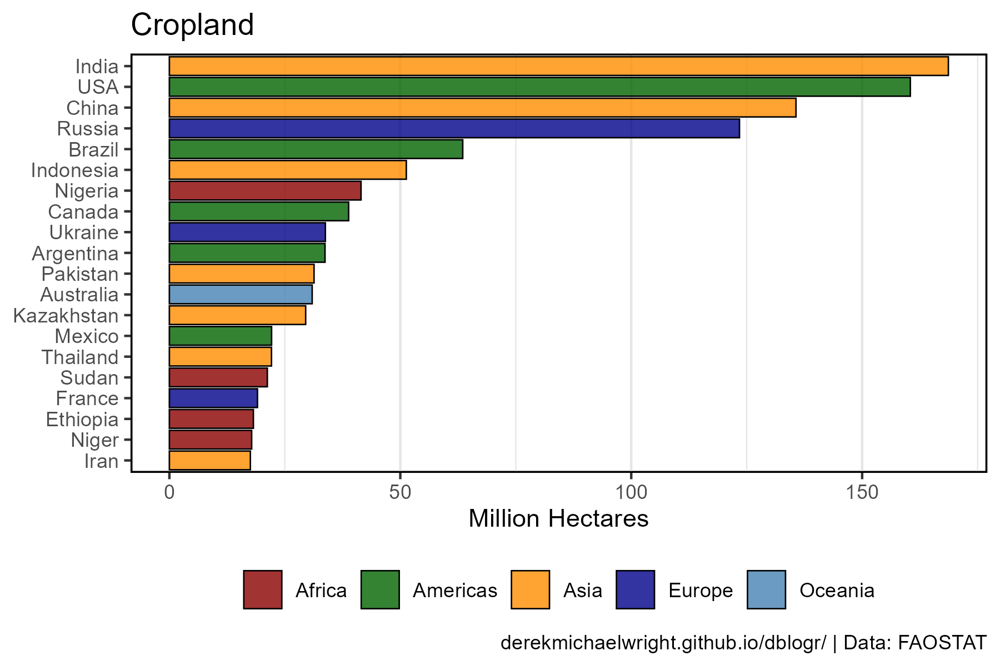

```{r}
# Prep Data
xx <- d1 %>% 
  filter(Item == myItems2[3], Year == 2019) %>%
  region_Info() %>%
  filter(Area %in% agData_FAO_Country_Table$Country) %>%
  arrange(desc(Value)) %>%
  slice(1:20) %>%
  mutate(Area = factor(Area, levels = unique(Area)))
myAreas <- levels(xx$Area)
# Plot Data
mp <- ggplot(xx, aes(x = Area, y = Value / 1000000, fill = Region)) + 
  geom_col(color = "black", alpha = 0.8, lwd = 0.3) +
  scale_fill_manual(name = NULL, values = myColors) +
  scale_x_discrete(limits = rev(levels(xx$Area))) +
  theme_agData_col(legend.position = "bottom", horizontal = T) + 
  coord_flip(ylim = c(0.02, max(xx$Value) / 1000000)) +
  labs(title = "Cropland", x = NULL,
       y = "Million Hectares", caption = myCaption)
ggsave("farmland_world_3_02.png", mp, width = 6, height = 4)
```

---

# Organic Area {.tabset .tabset-pills}

## Area

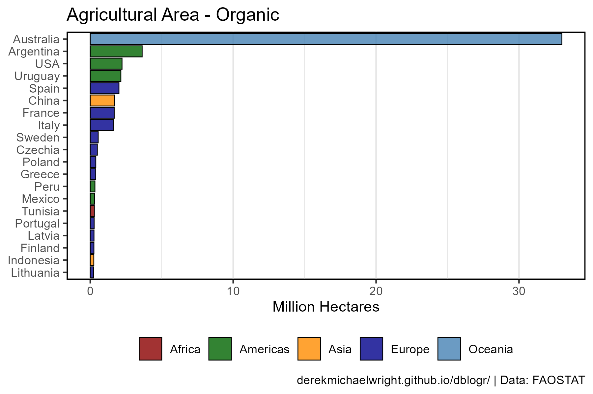

```{r}
# Prep Data
xx <- d2 %>% 
  filter(Item == "Agriculture area certified organic",
         Year == 2019) %>%
  region_Info() %>%
  filter(Area %in% agData_FAO_Country_Table$Country) %>%
  arrange(desc(Value)) %>%
  slice(1:20) %>%
  mutate(Area = factor(Area, levels = unique(Area)))
# Plot Data
mp <- ggplot(xx, aes(x = Area, y = Value / 1000000, fill = Region)) + 
  geom_col(color = "black", alpha = 0.8, lwd = 0.3) +
  scale_fill_manual(name = NULL, values = myColors) +
  scale_x_discrete(limits = rev(levels(xx$Area))) +
  theme_agData_col(legend.position = "bottom", horizontal = T) +
  coord_flip(ylim = c(0.0009, max(xx$Value) / 1000000)) +
  labs(title = "Agricultural Area - Organic", x = NULL,
       y = "Million Hectares", caption = myCaption)
ggsave("farmland_world_3_03.png", mp, width = 6, height = 4)
```

---

## Percent

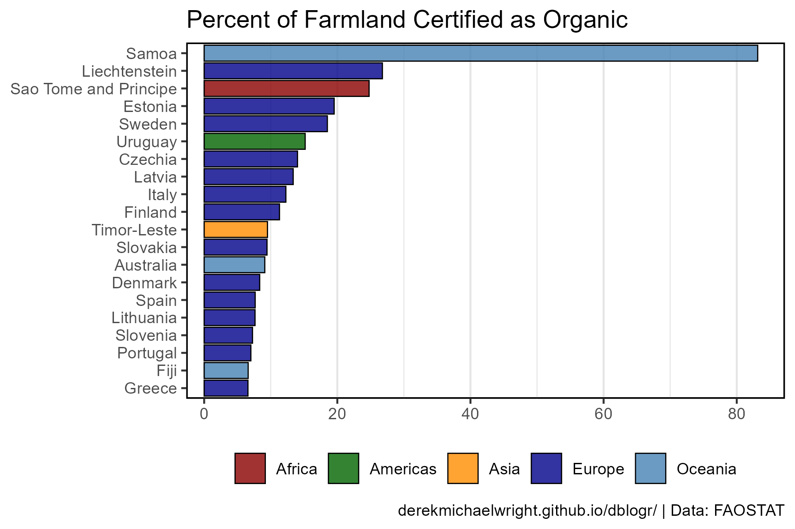

```{r}
# Prep Data
xx <- d2 %>% 
  filter(Item %in% c("Agriculture area certified organic", 
                     "Agricultural land"),
         Year == 2019) %>%
  select(-Measurement, -Unit) %>%
  spread(Item, Value) %>%
  mutate(Value = 100 * `Agriculture area certified organic` / 
           `Agricultural land`) %>%
  region_Info() %>%
  filter(Area %in% agData_FAO_Country_Table$Country) %>%
  arrange(desc(Value)) %>%
  slice(1:20) %>%
  mutate(Area = factor(Area, levels = unique(Area)))
# Plot Data
mp <- ggplot(xx, aes(x = Area, y = Value, fill = Region)) + 
  geom_col(color = "black", alpha = 0.8, lwd = 0.3) +
  scale_fill_manual(name = NULL, values = myColors) +
  scale_x_discrete(limits = rev(levels(xx$Area))) +
  theme_agData_col(legend.position = "bottom", horizontal = T) +
  coord_flip(ylim = c(1.4, max(xx$Value))) +
  labs(title = "Percent of Farmland Certified as Organic",
       y = NULL, x = NULL, caption = myCaption)
ggsave("farmland_world_3_04.png", mp, width = 6, height = 4)
```

---

# Countries {.tabset .tabset-pills}

## Canada


```{r}
# Prep Data
xx <- d2 %>% 
  filter(Area == "Canada", Year == 2019, Item != "Forest Carbon") %>%
  arrange(Value) %>%
  mutate(Item = factor(Item, levels = unique(Item)))
# Plot Data
mp <- ggplot(xx, aes(x = Item, y = Value / 1000000, fill = Item)) + 
  geom_col(color = "black", alpha = 0.8, lwd = 0.3) +
  scale_fill_manual(values = agData_Colors) +
  theme_agData_col(legend.position = "none", horizontal = T) + 
  coord_flip() +
  labs(title = "Canada", x = NULL,
       y = "Million Hectares", caption = myCaption)
ggsave("farmland_world_3_05.png", mp, width = 6, height = 4)
```

---

```{r eval = F, echo = F}
#```{r}
zz <- agData_FAO_Country_Table
# Prep function
ggAgRegion <- function(myItem = "Crop Land", myRegion = "Asia") {
  # Prep data
  xx <- d1 %>% 
    filter(Item == myItem,
           Year == 2016) %>%
    region_Info() %>%
    filter(!is.na(Region),
           Region == myRegion,
           Area %in% agData_FAO_Country_Table$Country) %>%
    
    group_by(Region) %>%
    arrange(desc(Value)) %>%
    top_n(n = 6) %>%
    mutate(Area = factor(Area, levels = unique(Area)))
  # Plot Data
  ggplot(xx, aes(x = Area, y = Value / 1000000, fill = Region)) + 
    geom_col(alpha = 0.8, color = "black", lwd = 0.3) +
    facet_wrap(Region ~ ., scales = "free", ncol = 1) +
    scale_fill_manual(values = myColors) +
    theme_agData(legend.position = "none",
                 axis.text.x = element_text(angle = 45, hjust = 1)) + 
    coord_flip(ylim = c(0.02, max(xx$Value) / 1000000)) +
    labs(title = myItem, x = NULL,
         y = "Million Hectares", caption = myCaption)
}
mp <- ggAgRegion(myItem = myItems2[1])
ggsave("farmland_world_1_06.png", mp, width = 5, height = 12)
mp <- ggAgRegion(myItem = myItems2[2])
ggsave("farmland_world_1_06.png", mp, width = 8, height = 6)
mp <- ggAgRegion(myItem = myItems2[3])
ggsave("farmland_world_1_06.png", mp, width = 8, height = 6)
#mp <- ggarrange(mp1, mp2, mp3, ncol = 3)

# Prep function
ggAgRegion <- function(myRegion = "Americas", 
                       myItem = "Cropland", 
                       myColor = "darkgreen") {
  # Prep data
  xx <- d1 %>% 
    filter(Item == myItem, Year == 2019) %>%
    region_Info() %>%
    filter(Region == myRegion, Area %in% agData_FAO_Country_Table$Country) %>%
    arrange(Value) %>%
    mutate(Area = factor(Area, levels = unique(Area))) %>%
    top_n(n = 10)
  # Plot Data
  ggplot(xx, aes(x = Area, y = Value / 1000000)) + 
    geom_col(fill = myColor, alpha = 0.8, color = "black", lwd = 0.3,) +
    facet_grid(. ~ Region, scales = "free_y") +
    theme_agData(axis.text.x = element_text(angle = 45, hjust = 1)) + 
    coord_flip(ylim = c(0.02, max(xx$Value) / 1000000)) +
    labs(title = myItem, x = NULL,
         y = "Million Hectares", caption = myCaption)
}
#
ggAgRegion_pie <- function(myRegion = "Americas", myItem = "Cropland") {
  # Prep data
  xx <- agData_FAO_LandUse %>% 
    filter(Item == myItem, Year == 2019) %>%
    region_Info() %>%
    filter(Region == myRegion, Area %in% agData_FAO_Country_Table$Country) %>%
    arrange(Value) %>%
    mutate(Area = factor(Area, levels = unique(Area))) %>%
    arrange(desc(Area)) %>%
    mutate(Prop = round(100 * Value / sum(Value)),
           Label = ifelse(Prop > 5, Prop, NA),
           ypos = cumsum(Prop) - 0.5 * Prop )
  x1 <- xx %>% filter(Prop > 5)
  x2 <- xx %>% filter(Prop < 5) %>% 
    group_by(Year) %>%
    summarise(Value = sum(Value)) %>%
    mutate(Area = "Other")
  xx <- bind_rows(x1, x2) %>%
    mutate(Prop = ifelse(is.na(Prop), 100 - sum(Prop, na.rm = T), Prop)) %>%
    arrange(desc(Prop)) %>%
    mutate(Area = factor(Area, levels = rev(unique(Area))),
           ypos = cumsum(Prop) - 0.5 * Prop)
  # Plot
  ggplot(xx, aes(x = "", y = Prop, fill = Area)) +
    geom_col(width = 1, color = "black", alpha = 0.8, lwd = 1) +
    coord_polar("y", start = 0) +
    geom_label(aes(y = ypos, label = Prop), nudge_x = 0.2,
               fill = "white", color = "black", alpha = 0.8, size = 6) +
    scale_fill_manual(name = NULL, values = agData_Colors) +
    theme_agData_pie() +
    labs(title = paste(myItem, "-", myRegion), caption = myCaption) 
}

---

### Bar Charts

#### Africa


mp <- ggAgRegion(myRegion = "Africa", myColor = "darkred",
                   myItem = "Cropland")
ggsave("farmland_world_2_01.png", mp, width = 6, height = 4)


---

#### Americas


mp <- ggAgRegion(myRegion = "Americas", myColor = "darkgreen",
                myItem = "Cropland")
ggsave("farmland_world_2_02.png", mp, width = 6, height = 4)


---

#### Asia


mp <- ggAgRegion(myRegion = "Asia", myColor = "darkorange",
                   myItem = "Cropland")
ggsave("farmland_world_2_03.png", mp, width = 6, height = 4)

---

#### Europe


mp <- ggAgRegion(myRegion = "Europe", myColor = "darkblue",
                   myItem = "Cropland")
ggsave("farmland_world_2_04.png", mp, width = 6, height = 4)

#### Oceania

#

#```{r}
mp <- ggAgRegion(myRegion = "Oceania", myColor = "steelblue",
                   myItem = "Cropland")
ggsave("farmland_world_2_05.png", mp, width = 6, height = 4)
```

---
