```{r setup, include = FALSE}
knitr::opts_chunk$set(echo = T, message = F, warning = F)
```

---

# Data

> - `r shiny::icon("globe")` [hhttp://www.fao.org/faostat/en/#data/RFN](http://www.fao.org/faostat/en/#data/RFN){target="_blank"}
> - `r shiny::icon("save")` [agData_FAO_Fertilizers.csv.gz](https://github.com/derekmichaelwright/agData/raw/master/Data/agData_FAO_Fertilizers.csv.gz)

> - `r shiny::icon("globe")` [hhttp://www.fao.org/faostat/en/#data/RL](http://www.fao.org/faostat/en/#data/RL){target="_blank"}
> - `r shiny::icon("save")` [agData_FAO_LandUse.csv.gz](https://github.com/derekmichaelwright/agData/raw/master/Data/agData_FAO_LandUse.csv.gz)

---

# Prepare Data

```{r class.source = 'fold-show'}
# devtools::install_github("derekmichaelwright/agData")
library(agData)
library(rworldmap)
```

```{r}
# Prepare data
myCaption <- "derekmichaelwright.github.io/dblogr/agdata/fertilizers | Data: FAOSTAT"
myItems <- c("Nutrient nitrogen N (total)",
             "Nutrient phosphate P2O5 (total)",
             "Nutrient potash K2O (total)")
#
dd <- agData_FAO_Fertilizers
dN <- agData_FAO_Fertilizers %>% filter(Item == "Nutrient nitrogen N (total)")
dP <- agData_FAO_Fertilizers %>% filter(Item == "Nutrient phosphate P2O5 (total)")
dK <- agData_FAO_Fertilizers %>% filter(Item == "Nutrient potash K2O (total)")
# N rate
x1 <- dN %>% filter(Measurement == "Agricultural Use")
x2 <- agData_FAO_LandUse %>% filter(Item == "Cropland")
dNr <- bind_rows(x1, x2) %>% 
  select(-Measurement, -Unit) %>% 
  spread(Item, Value) %>%
  mutate(NPH = 1000 * `Nutrient nitrogen N (total)` / Cropland) %>%
  filter(!is.na(NPH))
# P rate
x1 <- dP %>% filter(Measurement == "Agricultural Use")
x2 <- agData_FAO_LandUse %>% filter(Item == "Cropland")
dPr <- bind_rows(x1, x2) %>% 
  select(-Measurement, -Unit) %>% 
  spread(Item, Value) %>%
  mutate(PPH = 1000 * `Nutrient phosphate P2O5 (total)` / Cropland)
# K rate
x1 <- dK %>% filter(Measurement == "Agricultural Use")
x2 <- agData_FAO_LandUse %>% filter(Item == "Cropland")
dKr <- bind_rows(x1, x2) %>% 
  select(-Measurement, -Unit) %>% 
  spread(Item, Value) %>%
  mutate(KPH = 1000 * `Nutrient potash K2O (total)` / Cropland)
```

---

# NPK {.tabset .tabset-pills}

## Production {.tabset .tabset-pills}

### Global

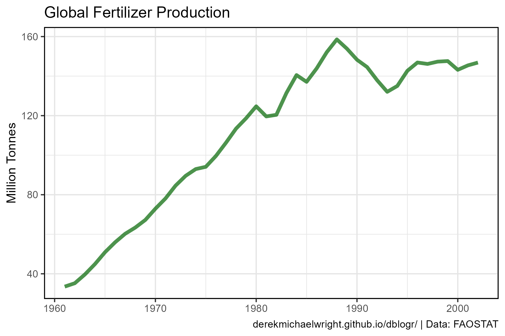

```{r}
# Prep data
xx <- dd %>%
  filter(Area == "World", Measurement == "Production",
         Item == "Total Fertilizers")
# Plot
mp <- ggplot(xx, aes(x = Year, y = Value / 1000000)) +
  geom_line(color = "darkgreen", alpha = 0.7, size = 1.5) +
  theme_agData() +
  labs(title = "Global Fertilizer Production", x = NULL,
       y = "Million Tonnes", caption = myCaption)
ggsave("fertilizers_1_01.png", mp, width = 6, height = 4)
```

---

### N Map

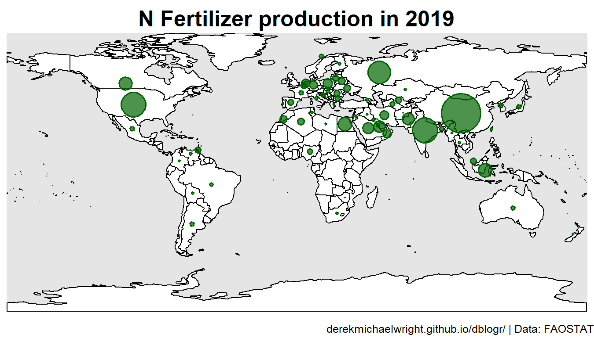

```{r}
# Prep data
xx <- dN %>% 
  filter(Measurement == "Production", Year == 2019,
         Area %in% agData_FAO_Country_Table$Country) %>%
  left_join(agData_FAO_Country_Table, by = c("Area"="Country"))
# Plot
png("fertilizers_1_02.png", width = 1350, height = 770, res = 300)
par(mai = c(0.2,0,0.25,0), xaxs = "i", yaxs = "i")
mapBubbles2(dF = xx, nameX = "Lon", nameY = "Lat", nameZSize = "Value",
            nameZColour = "darkgreen", nameZFill = alpha("darkgreen",0.7),
            symbolSize = 1, lwd = 0.75, addLegend = F,
            oceanCol = "grey90", landCol = "white", borderCol = "black",
            )
title(main = "N Fertilizer production in 2019", line = 0.25, cex.main = 1)
title(sub = myCaption, line = 0, cex.sub = 0.5, adj = 1)
dev.off()
```

---

### P Map

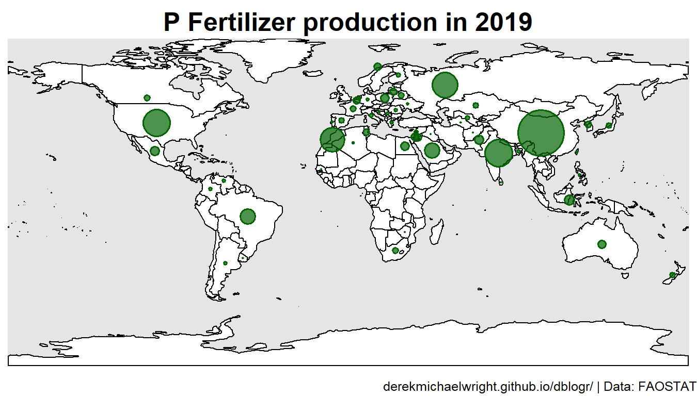

```{r}
# Prep data
xx <- dP %>% 
  filter(Measurement == "Production", Year == 2019,
         Area %in% agData_FAO_Country_Table$Country) %>%
  left_join(agData_FAO_Country_Table, by = c("Area"="Country"))
# Plot
png("fertilizers_1_03.png", width = 1350, height = 770, res = 300)
par(mai = c(0.2,0,0.25,0), xaxs = "i", yaxs = "i")
mapBubbles2(dF = xx, nameX = "Lon", nameY = "Lat", nameZSize = "Value",
            nameZColour = "darkgreen", nameZFill = alpha("darkgreen",0.7),
            symbolSize = 1, lwd = 0.75, addLegend = F,
            oceanCol = "grey90", landCol = "white", borderCol = "black",
            )
title(main = "P Fertilizer production in 2019", line = 0.25, cex.main = 1)
title(sub = myCaption, line = 0, cex.sub = 0.5, adj = 1)
dev.off()
```

---

### K Map

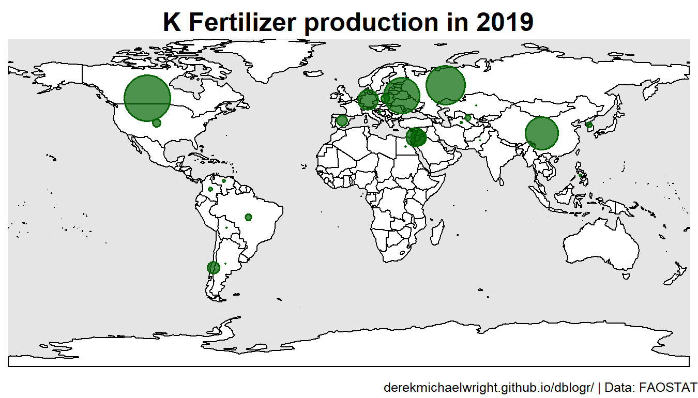

```{r}
# Prep data
xx <- dK %>% 
  filter(Measurement == "Production", Year == 2019,
         Area %in% agData_FAO_Country_Table$Country) %>%
  left_join(agData_FAO_Country_Table, by = c("Area"="Country"))
# Plot
png("fertilizers_1_04.png", width = 1350, height = 770, res = 300)
par(mai = c(0.2,0,0.25,0), xaxs = "i", yaxs = "i")
mapBubbles2(dF = xx, nameX = "Lon", nameY = "Lat", nameZSize = "Value",
            nameZColour = "darkgreen", nameZFill = alpha("darkgreen",0.7),
            symbolSize = 1, lwd = 0.75, addLegend = F,
            oceanCol = "grey90", landCol = "white", borderCol = "black",
            )
title(main = "K Fertilizer production in 2019", line = 0.25, cex.main = 1)
title(sub = myCaption, line = 0, cex.sub = 0.5, adj = 1)
dev.off()
```

---

## Agricultural Use

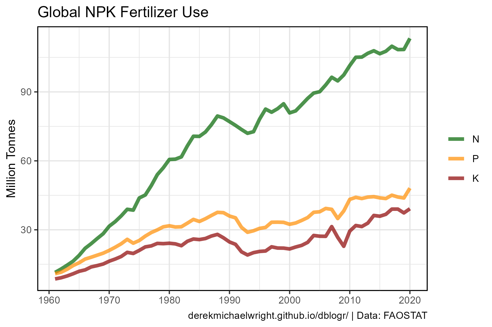

```{r}
# Prep data
myCs <- c("darkgreen", "darkorange", "darkred")
xx <- dd %>% 
  filter(Area == "World", Measurement == "Agricultural Use",
         Item %in% myItems) %>%
  mutate(Item = plyr::mapvalues(Item, myItems, c("N","P","K")),
         Item = factor(Item, levels = c("N","P","K")))
# Plot
mp <- ggplot(xx, aes(x = Year, y = Value / 1000000, color = Item)) + 
  geom_line(size = 1.5, alpha = 0.7) + 
  scale_color_manual(name = NULL, values = myCs) +
  scale_x_continuous(breaks = seq(1960, 2020, by = 10)) + 
  theme_agData() +
  labs(title = "Global NPK Fertilizer Use", 
       y = "Million Tonnes", x = NULL, caption = myCaption)
ggsave("fertilizers_1_05.png", mp, width = 6, height = 4)
```

```{r echo = F}
ggsave("featured.png", mp, width = 6, height = 4)
```

---

## Import & Export {.tabset .tabset-pills}

### Europe

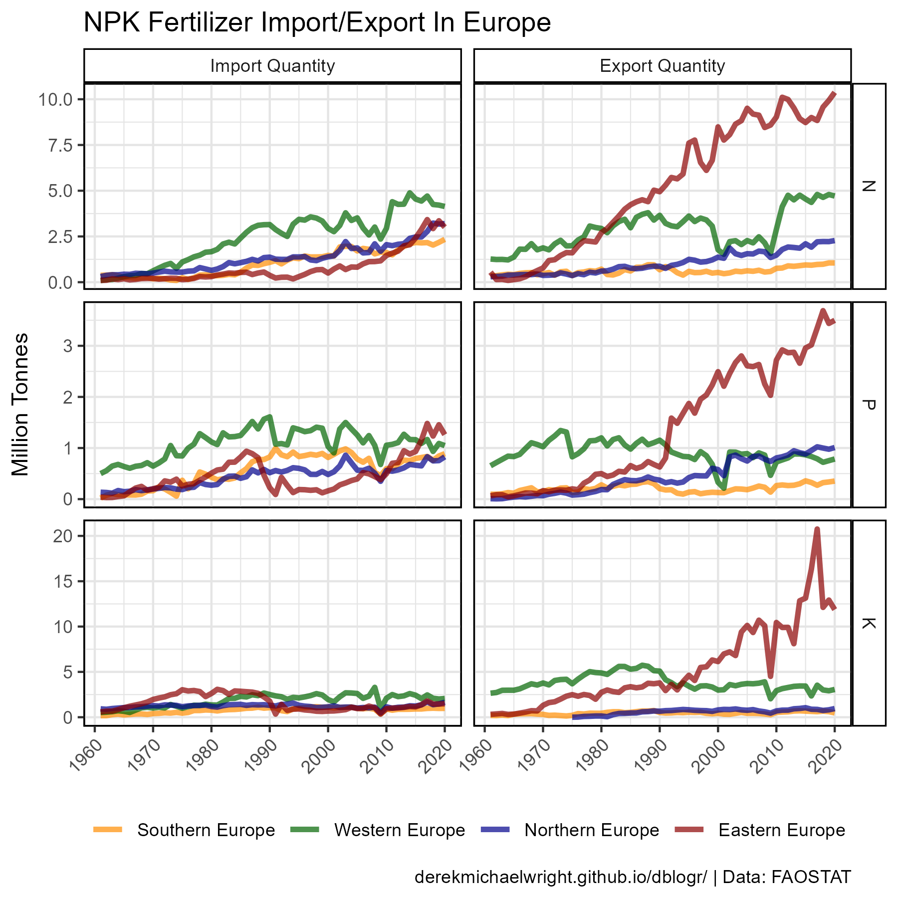

```{r}
# Prep data
myMs <- c("Import Quantity", "Export Quantity")
myAs <- c("Southern Europe", "Western Europe", 
          "Northern Europe", "Eastern Europe")
myCs <- c("darkorange", "darkgreen", "darkblue", "darkred")
xx <- dd %>% 
  filter(Area %in% myAs, Measurement %in% myMs,
         Item %in% myItems) %>%
  mutate(Measurement = factor(Measurement, levels = myMs),
         Area = factor(Area, levels = myAs),
         Item = plyr::mapvalues(Item, myItems, c("N","P","K")),
         Item = factor(Item, levels = c("N","P","K")))
# Plot
mp <- ggplot(xx, aes(x = Year, y = Value / 1000000, color = Area)) + 
  geom_line(size = 1.25, alpha = 0.7) + 
  facet_grid(Item ~ Measurement, scales = "free_y") +
  theme_agData(legend.position = "bottom",
               axis.text.x = element_text(angle = 45, hjust = 1)) +
  scale_x_continuous(breaks = seq(1960, 2020, by = 10)) + 
  scale_color_manual(name = NULL, values = myCs) + 
  labs(title = "NPK Fertilizer Import/Export In Europe",
       y = "Million Tonnes", x = NULL, caption = myCaption)
ggsave("fertilizers_1_06.png", mp, width = 6, height = 6)
```

---

### UK - France - Russia

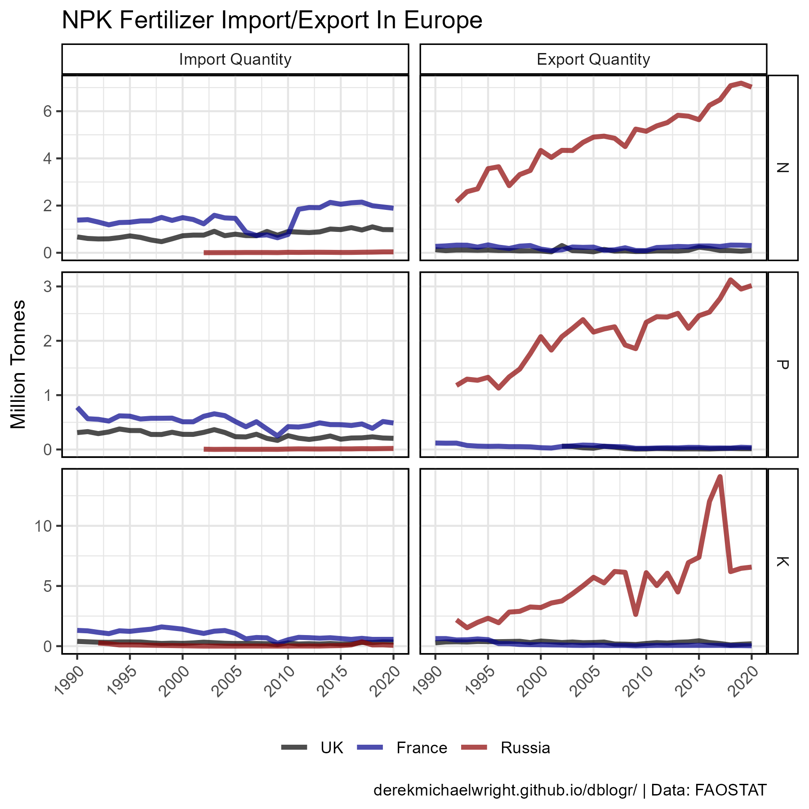

```{r}
# Prep data
myMs <- c("Import Quantity", "Export Quantity")
myAs <- c("UK", "France", "Russia")
myCs <- c("black", "darkblue", "darkred")
xx <- dd %>% 
  filter(Area %in% myAs, Measurement %in% myMs,
         Item %in% myItems, Year > 1989) %>%
  mutate(Measurement = factor(Measurement, levels = myMs),
         Area = factor(Area, levels = myAs),
         Item = plyr::mapvalues(Item, myItems, c("N","P","K")),
         Item = factor(Item, levels = c("N","P","K")))
# Plot
mp <- ggplot(xx, aes(x = Year, y = Value / 1000000, color = Area)) + 
  geom_line(size = 1.25, alpha = 0.7) + 
  facet_grid(Item ~ Measurement, scales = "free_y") +
  theme_agData(legend.position = "bottom",
               axis.text.x = element_text(angle = 45, hjust = 1)) +
  scale_x_continuous(breaks = seq(1990, 2020, by = 5)) + 
  scale_color_manual(name = NULL, values = myCs) + 
  labs(title = "NPK Fertilizer Import/Export In Europe",
       y = "Million Tonnes", x = NULL, caption = myCaption)
ggsave("fertilizers_1_07.png", mp, width = 6, height = 6)
```

---

### Countries {.tabset .tabset-pills}

#### Plotting Function

```{r class.source = 'fold-show'}
# Create plotting function
ggFert <- function(area = "Canada") {
  # Prep data
  myMs <- c("Import Quantity", "Export Quantity")
  myCs <- c("darkred", "steelblue", "darkblue")
  #
  xx <- dd %>% 
    filter(Area == area, Item %in% myItems,
           Measurement %in% myMs) %>%
    mutate(Measurement = factor(Measurement, levels = myMs),
           Item = plyr::mapvalues(Item, myItems, c("N","P","K")),
           Item = factor(Item, levels = c("N","P","K")))
  # Plot
  ggplot(xx, aes(x = Year, y = Value / 1000000, color = Measurement, 
                 group = paste(Area, Measurement))) + 
    geom_line(size = 1.25, alpha = 0.7) + 
    facet_grid(Item ~ ., scale = "free_y") +
    scale_color_manual(name = NULL, values = myCs) +
    scale_x_continuous(breaks = seq(1960, 2020, by = 10)) +
    theme_agData(legend.position = "bottom") +
    labs(title = paste("NPK Fertilizer Import/Export In", area),
         y = "Million Tonnes", x = NULL, caption = myCaption)
}
```

---

#### Canada {.active}

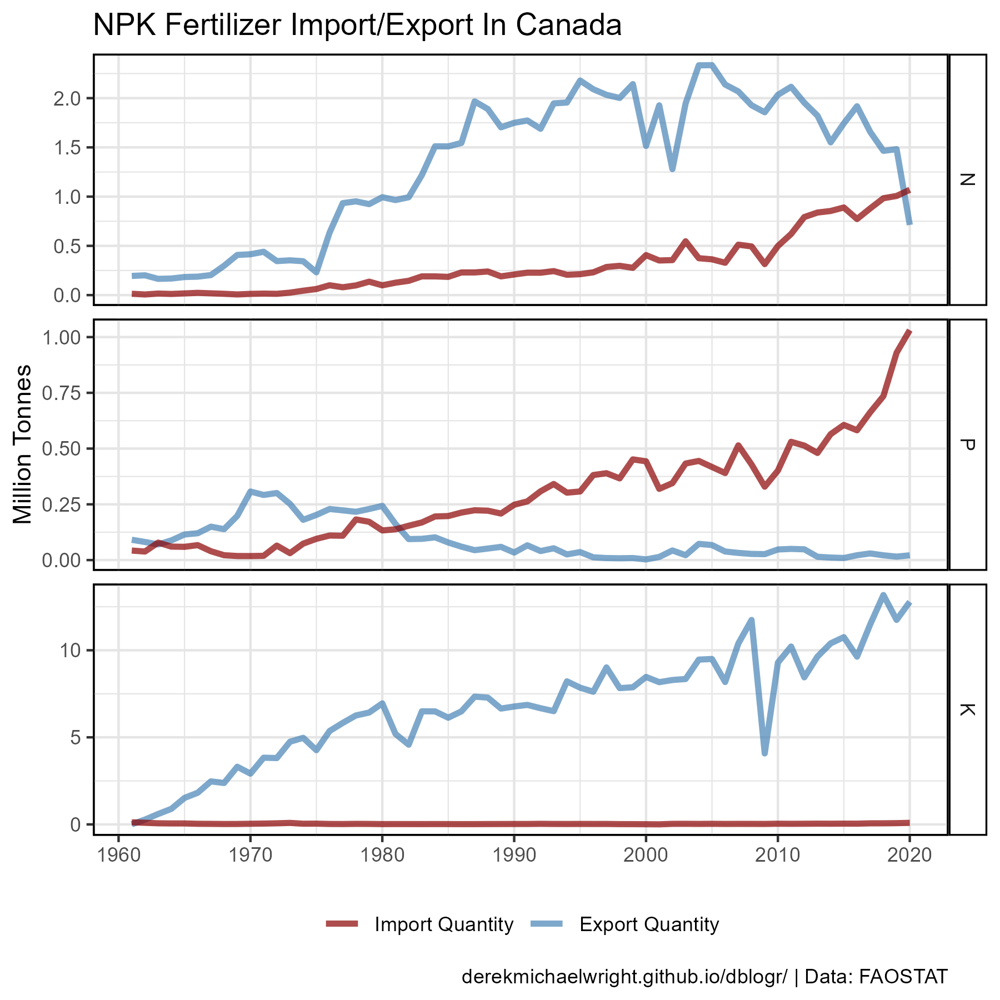

```{r}
# Plot
mp <- ggFert(area = "Canada")
ggsave("fertilizers_2_canada.png", mp, width = 6, height = 6)
```

---

#### China

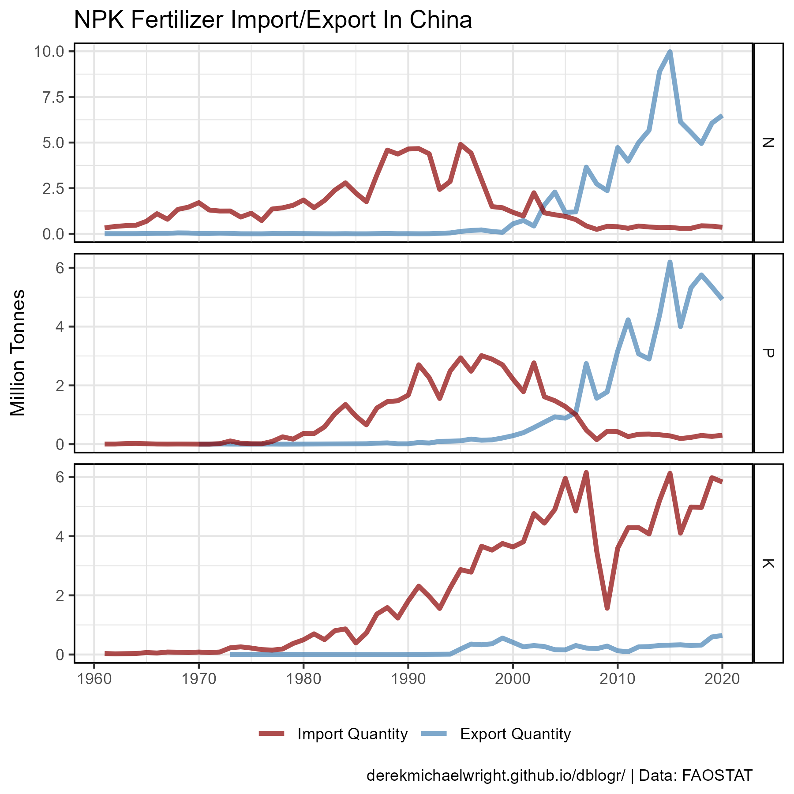

```{r}
# Plot
mp <- ggFert(area = "China")
ggsave("fertilizers_2_china.png", mp, width = 6, height = 6)
```

---

#### USA

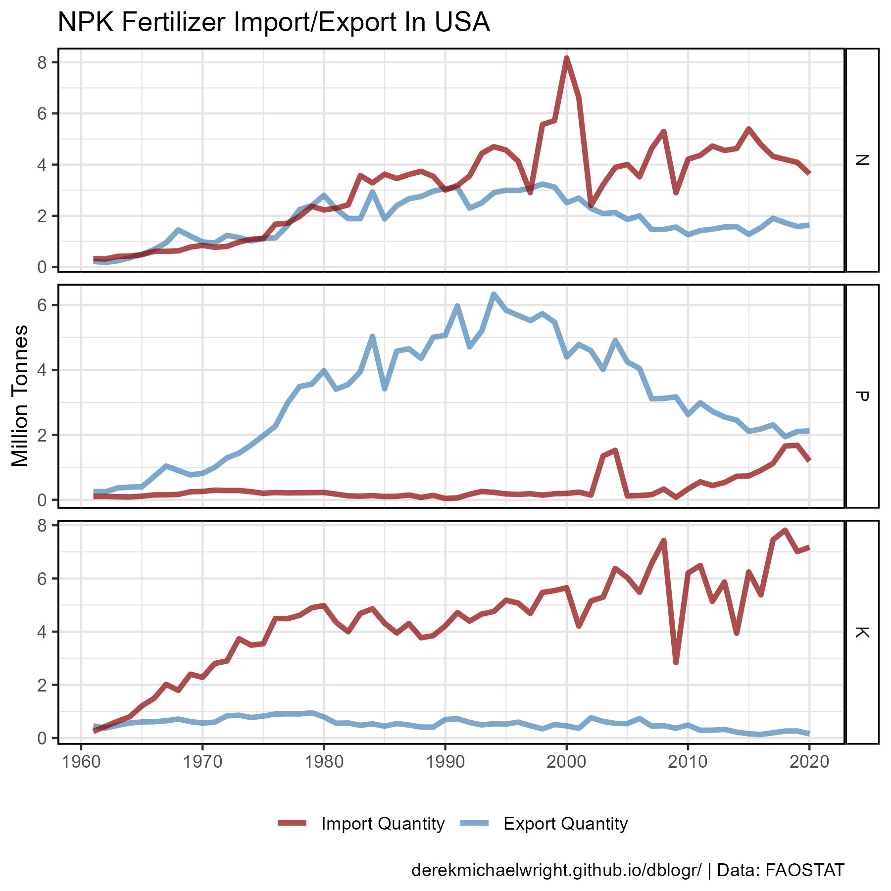

```{r}
# Plot
mp <- ggFert(area = "USA")
ggsave("fertilizers_2_usa.png", mp, width = 6, height = 6)
```

---

#### India

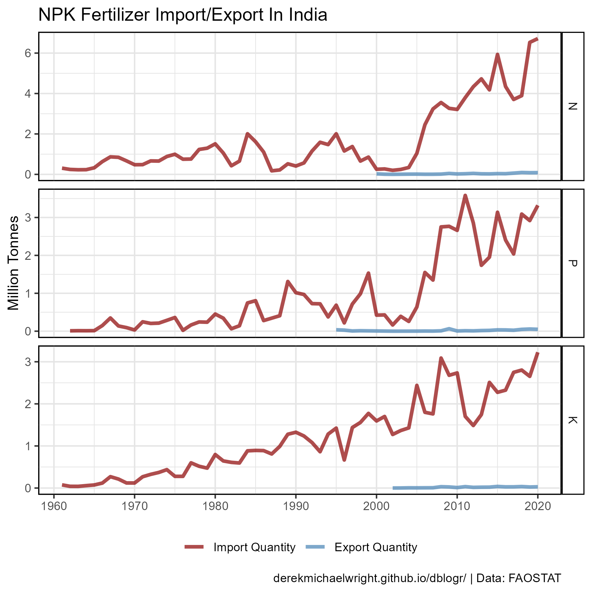

```{r}
# Plot
mp <- ggFert(area = "India")
ggsave("fertilizers_2_india.png", mp, width = 6, height = 6)
```

---

#### Germany

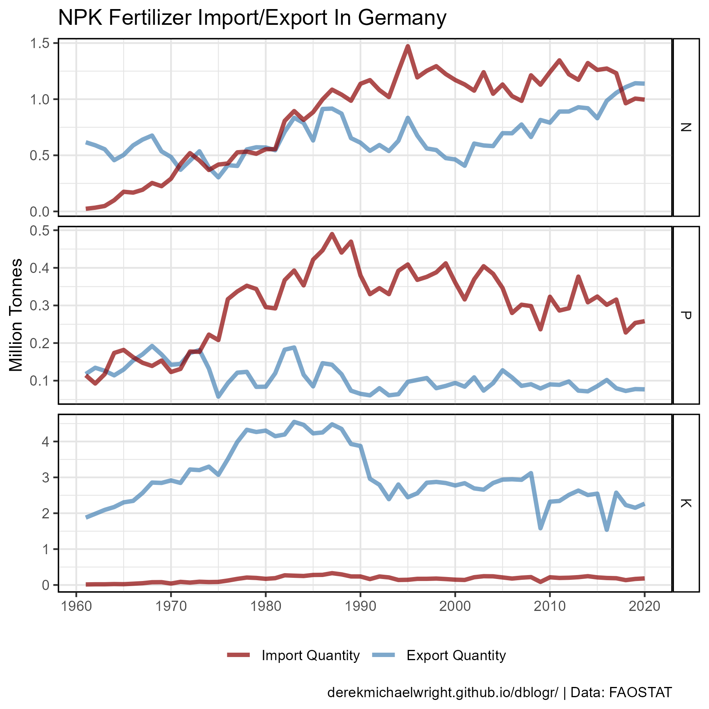

```{r}
# Plot
mp <- ggFert(area = "Germany")
ggsave("fertilizers_2_germany.png", mp, width = 6, height = 6)
```

---

#### Ukraine

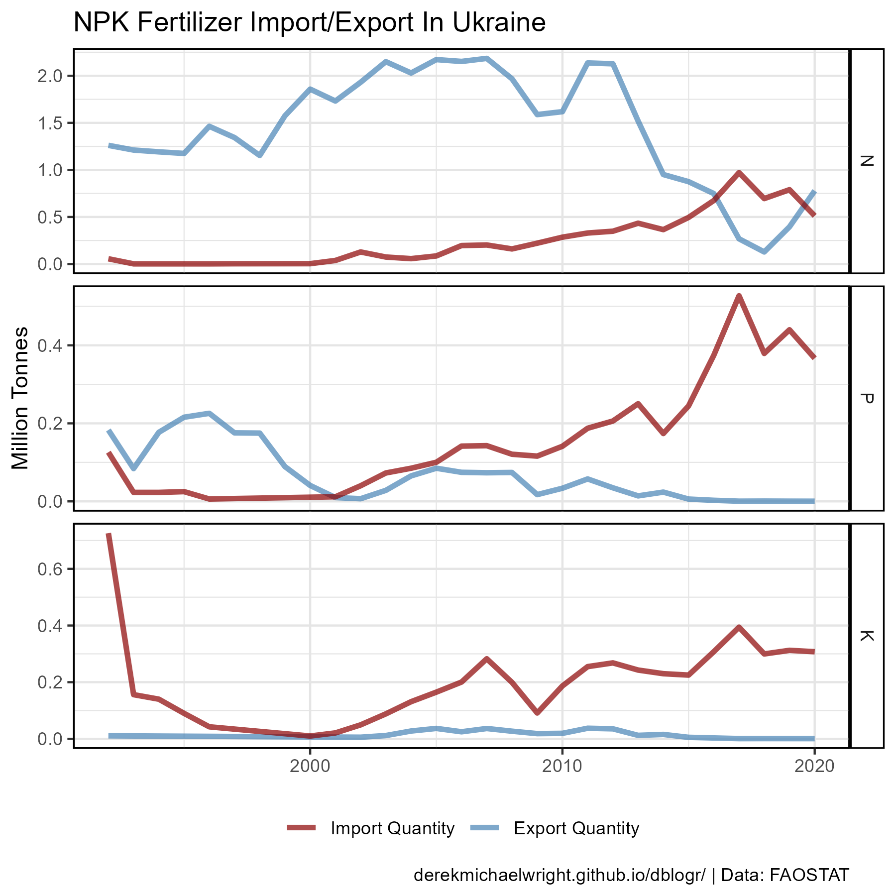

```{r}
# Plot
mp <- ggFert(area = "Ukraine")
ggsave("fertilizers_2_ukraine.png", mp, width = 6, height = 6)
```

---

#### Russia

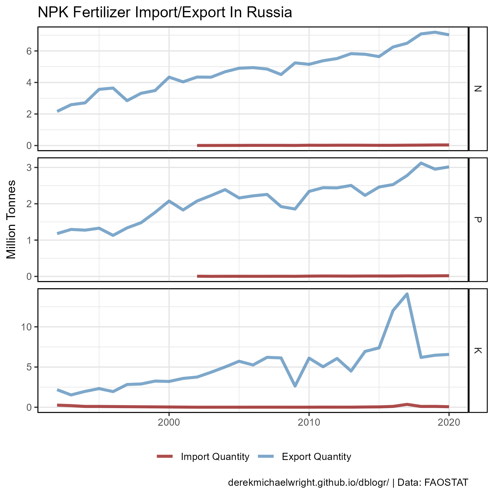

```{r}
# Plot
mp <- ggFert(area = "Russia")
ggsave("fertilizers_2_russia.png", mp, width = 6, height = 6)
```

---

# Nitrogen (N) {.tabset .tabset-pills}

## Production {.tabset .tabset-pills}

### Top 20 {.tabset .tabset-pills}

#### Regions


```{r}
# Prep data
myAs <- c("Asia", "Europe", "Americas", "Africa", "Oceania")
myCs <- c("darkorange", "darkblue", "darkgreen", "darkred", "steelblue")
xx <- dN %>% 
  filter(Measurement == "Production", Year == 2019, Area %in% myAs) %>%
  arrange(desc(Value)) %>%
  slice(1:20) %>%
  mutate(Area = factor(Area, levels = Area))
# Plot
ggplot(xx, aes(x = Area, y = Value / 1000000, fill = Area)) +
  geom_col(color = "black", alpha = 0.7) +
  scale_fill_manual(name = NULL, values = myCs) +
  theme_agData(axis.text.x = element_text(angle = 45, hjust = 1)) +
  labs(title = "Nitrogen Fertilizer Production", 
       y = "Million Tonnes N", x = NULL, caption = myCaption)
ggsave("fertilizers_n_1_01.png", mp, width = 6, height = 4)
```

---

#### Countries

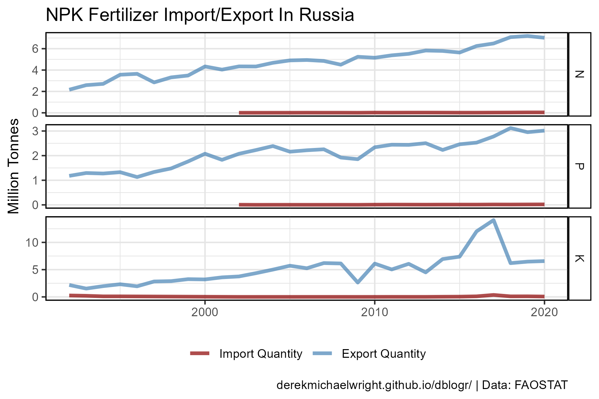

```{r}
# Prep data
myAs <- c("Asia", "Europe", "Americas", "Africa", "Oceania")
myCs <- c("darkorange", "darkblue", "darkgreen", "darkred", "steelblue")
xx <- dN %>% 
  filter(Measurement == "Production", Year == 2019,
         Area %in% agData_FAO_Country_Table$Country) %>%
  left_join(agData_FAO_Country_Table, by = c("Area"="Country")) %>%
  arrange(desc(Value)) %>%
  slice(1:20) %>%
  mutate(Area = factor(Area, levels = Area),
         Region = factor(Region, levels = myAs))
# Plot
ggplot(xx, aes(x = Area, y = Value / 1000000, fill = Region)) +
  geom_col(color = "black", alpha = 0.7) +
  scale_fill_manual(name = NULL, values = myCs) +
  theme_agData(axis.text.x = element_text(angle = 45, hjust = 1)) +
  labs(title = "Nitrogen Fertilizer Production", 
       y = "Million Tonnes N", x = NULL, caption = myCaption)
ggsave("fertilizers_n_1_02.png", mp, width = 6, height = 4)
```

---

### Unfacetted

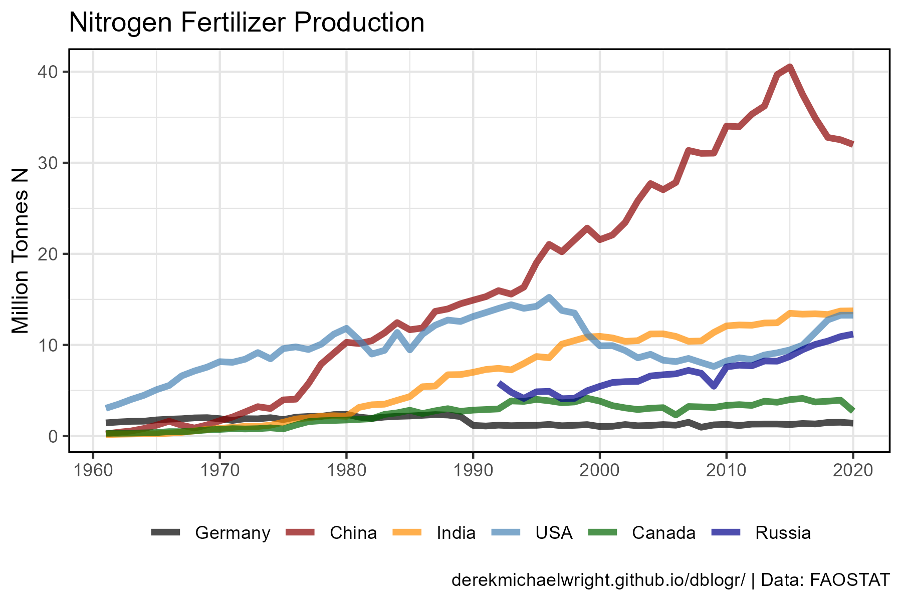

```{r}
# Prep data
myAs  <- c("Germany", "China", "India", "USA", "Canada", "Russia")
myCs <- c("black", "darkred", "darkorange", 
          "steelblue", "darkgreen", "darkblue")
xx <- dN %>% 
  filter(Area %in% myAs, Measurement == "Production") %>%
  mutate(Area = factor(Area, levels = myAs))
# Plot
mp <- ggplot(xx, aes(x = Year, y = Value / 1000000, color = Area)) + 
  geom_line(size = 1.5, alpha = 0.7) + 
  scale_color_manual(name = NULL, values = myCs) +
  scale_x_continuous(breaks = seq(1960, 2020, by = 10)) + 
  guides(col = guide_legend(nrow = 1)) +
  theme_agData(legend.position = "bottom") +
  labs(title = "Nitrogen Fertilizer Production", 
       y = "Million Tonnes N", x = NULL, caption = myCaption)
ggsave("fertilizers_n_1_03.png", mp, width = 6, height = 4)
```

---

### Facetted

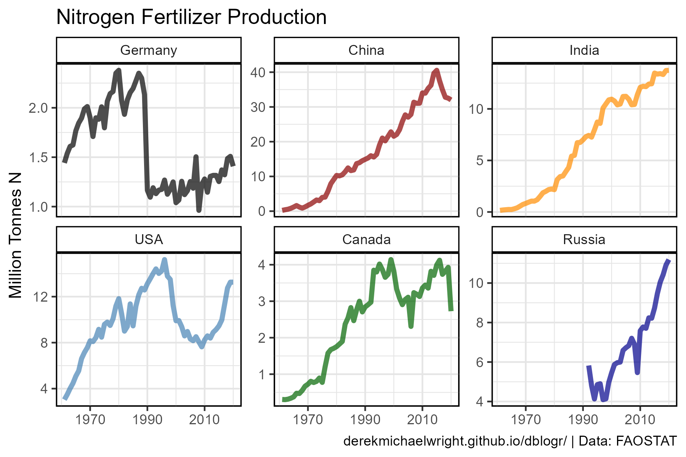

```{r}
# Plot
mp <- mp + 
  facet_wrap(Area ~., ncol = 3, scales = "free_y") +
  scale_x_continuous(breaks = seq(1970, 2010, by = 20)) + 
  theme(legend.position = "none")
ggsave("fertilizers_n_1_04.png", mp, width = 6, height = 4)
```

---

## Production, Use, Import & Export {.tabset .tabset-pills}

### World

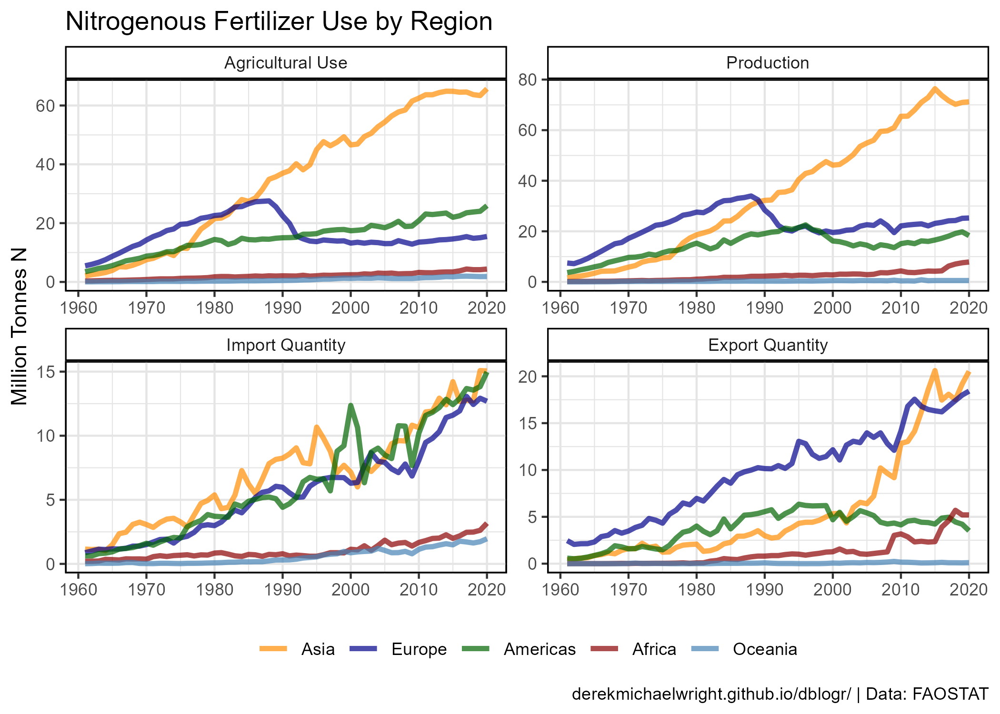

```{r}
# Prep data
myMs <- c("Agricultural Use", "Production", 
          "Import Quantity", "Export Quantity")
myAs <- c("Asia", "Europe", "Americas", "Africa", "Oceania")
myCs <- c("darkorange", "darkblue", "darkgreen", "darkred", "steelblue")
xx <- dN %>% 
  filter(Area %in% myAs, Measurement != "Other Uses") %>%
  mutate(Measurement = factor(Measurement, levels = myMs),
         Area = factor(Area, levels = myAs))
# Plot
mp <- ggplot(xx, aes(x = Year, y = Value / 1000000, color = Area)) + 
  geom_line(size = 1.25, alpha = 0.7) + 
  facet_wrap(Measurement ~ ., scales = "free") +
  theme_agData(legend.position = "bottom") +
  scale_x_continuous(breaks = seq(1960, 2020, by = 10)) + 
  scale_color_manual(name = NULL, values = myCs) + 
  labs(title = "Nitrogenous Fertilizer Use by Region", x = NULL,
       y = "Million Tonnes N", caption = myCaption)
ggsave("fertilizers_n_2_01.png", mp, width = 7, height = 5)
```

---

### Europe

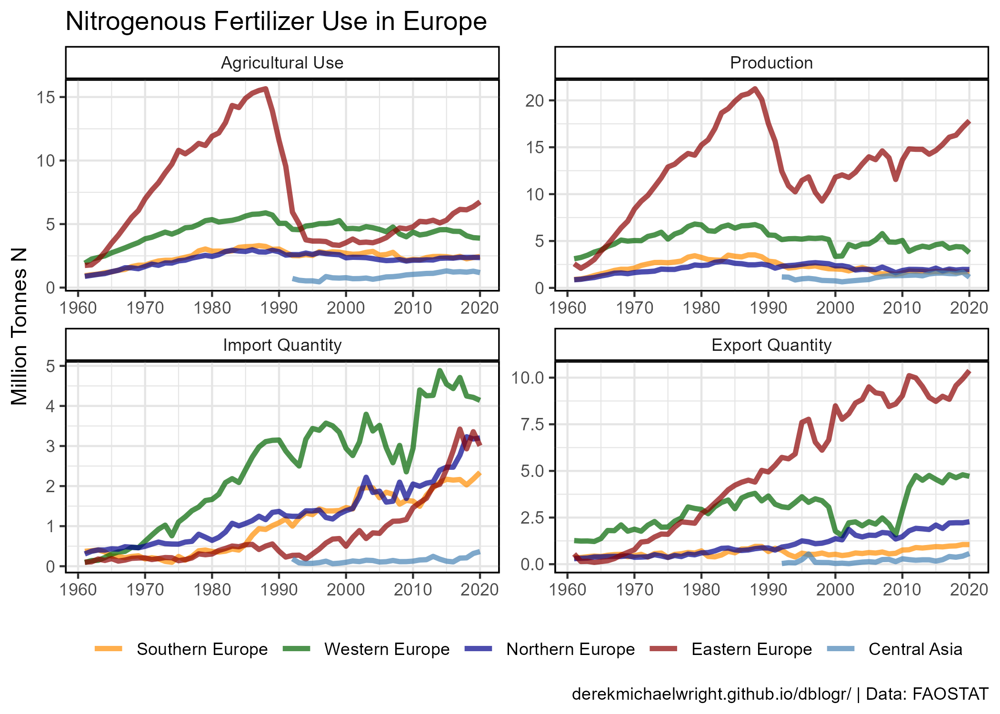

```{r}
# Prep data
myMs <- c("Agricultural Use", "Production", 
          "Import Quantity", "Export Quantity")
myAs <- c("Southern Europe", "Western Europe", "Northern Europe",
          "Eastern Europe", "Central Asia")
myCs <- c("darkorange", "darkgreen", "darkblue", "darkred", "steelblue")
xx <- dd %>% 
  filter(Area %in% myAs, Measurement != "Other Uses",
         Item == "Nutrient nitrogen N (total)") %>%
  mutate(Measurement = factor(Measurement, levels = myMs),
         Area = factor(Area, levels = myAs))
# Plot
mp <- ggplot(xx, aes(x = Year, y = Value / 1000000, color = Area)) + 
  geom_line(size = 1.25, alpha = 0.7) + 
  facet_wrap(Measurement ~ ., scales = "free") +
  theme_agData(legend.position = "bottom") +
  scale_x_continuous(breaks = seq(1960, 2020, by = 10)) + 
  scale_color_manual(name = NULL, values = myCs) + 
  labs(title = "Nitrogenous Fertilizer Use in Europe", x = NULL,
       y = "Million Tonnes N", caption = myCaption)
ggsave("fertilizers_n_2_02.png", mp, width = 7, height = 5)
```

---

### Countries {.tabset .tabset-pills}

#### Plotting Function

```{r class.source = 'fold-show'}
# Create plotting function
ggFertP <- function(area = "Canada") {
  # Prep data
  myGs <- c("Production / Use", "Import / Export")
  myMs <- c("Agricultural Use", "Production", 
                  "Import Quantity", "Export Quantity")
  myCs <- c("darkgreen", "darkred", "steelblue", "darkblue")
  xx <- dN %>% 
    filter(Area %in% area, Measurement != "Other Uses") %>%
    mutate(Measurement = factor(Measurement, levels = myMs),
           Group = ifelse(Measurement %in% myMs[1:2],
                          myGs[1], myGs[2]),
           Group = factor(Group, levels = myGs))
  # Plot
  ggplot(xx, aes(x = Year, y = Value / 1000000, 
                 color = Measurement, group = paste(Area,Measurement))) + 
    geom_line(size = 1.25, alpha = 0.7) + 
    facet_grid(. ~ Group) +
    scale_color_manual(name = NULL, values = myCs) +
    scale_x_continuous(breaks = seq(1960, 2020, by = 10)) +
    theme_agData(legend.position = "bottom") +
    labs(title = paste("Nitrogenous Fertilizer Use In", area),
         y = "Million Tonnes N", x = NULL, caption = myCaption)
}
```

---

#### Canada {.active}

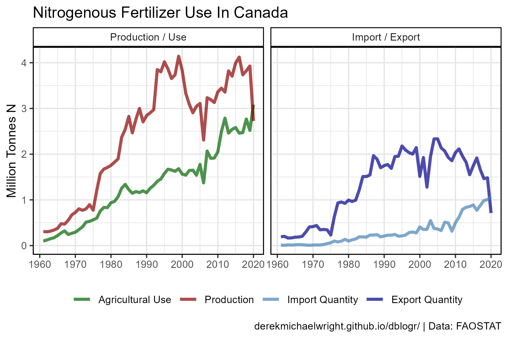

```{r}
# Plot
mp <- ggFertP(area = "Canada")
ggsave("fertilizers_n_3_canada.png", mp, width = 6, height = 4)
```

---

#### China

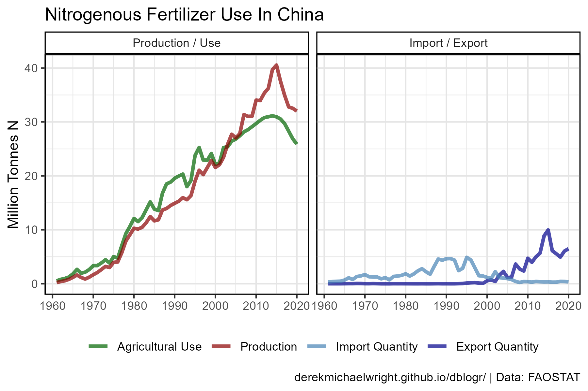

```{r}
# Plot
mp <- ggFertP(area = "China")
ggsave("fertilizers_n_3_china.png", mp, width = 6, height = 4)
```

---

#### USA

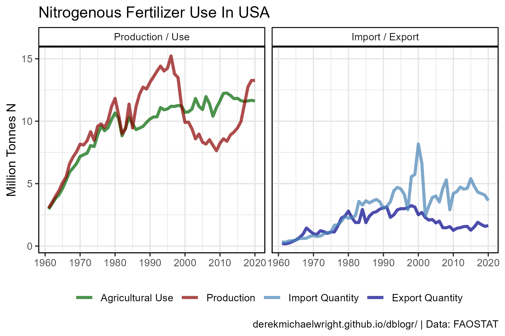

```{r}
# Plot
mp <- ggFertP(area = "USA")
ggsave("fertilizers_n_3_usa.png", mp, width = 6, height = 4)
```

---

#### India

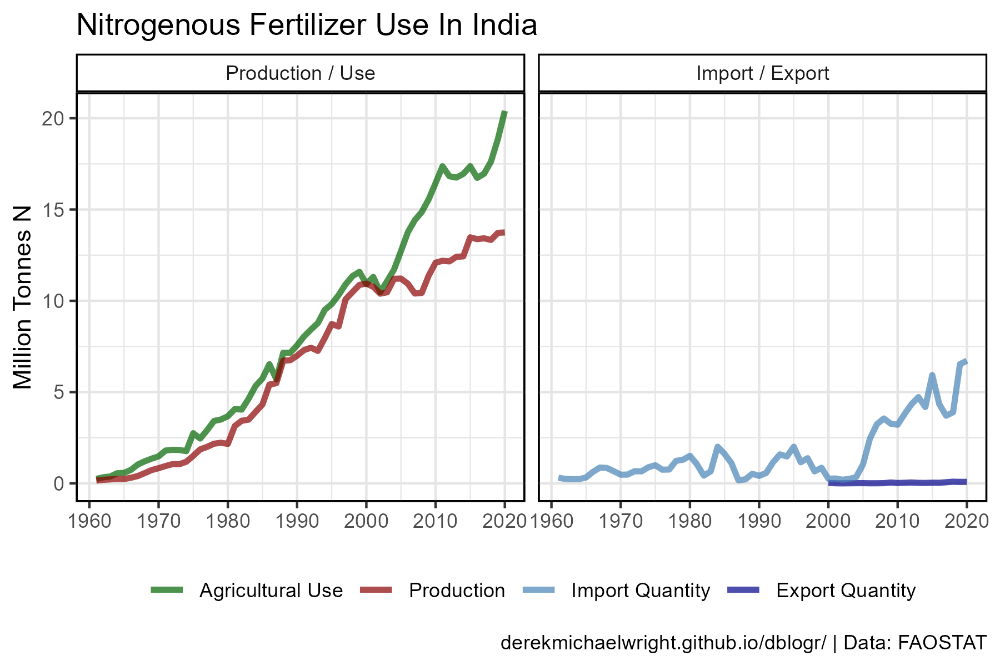

```{r}
# Plot
mp <- ggFertP(area = "India")
ggsave("fertilizers_n_3_india.png", mp, width = 6, height = 4)
```

---

#### Germany

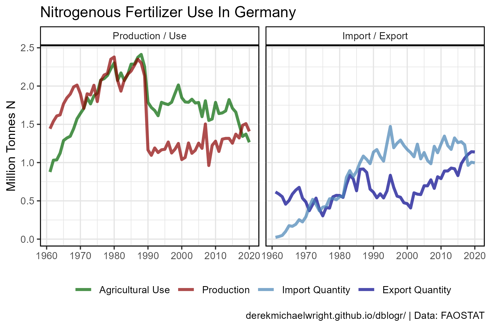

```{r}
# Plot
mp <- ggFertP(area = "Germany")
ggsave("fertilizers_n_3_germany.png", mp, width = 6, height = 4)
```

---

#### Netherlands

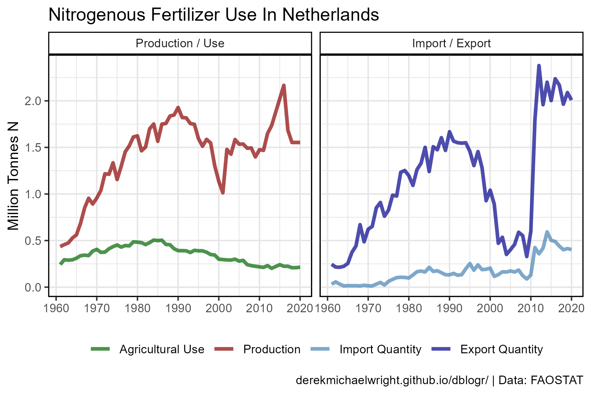

```{r}
# Plot
mp <- ggFertP(area = "Netherlands")
ggsave("fertilizers_n_3_netherlands.png", mp, width = 6, height = 4)
```

---

#### Ukraine

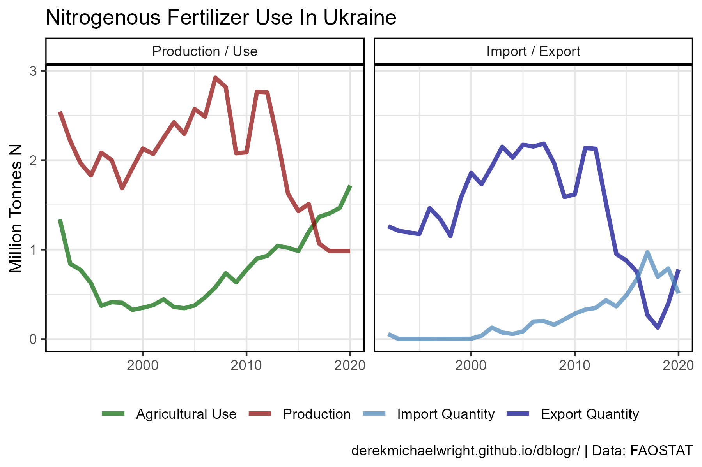

```{r}
# Plot
mp <- ggFertP(area = "Ukraine")
ggsave("fertilizers_n_3_ukraine.png", mp, width = 6, height = 4)
```

---

#### Russia

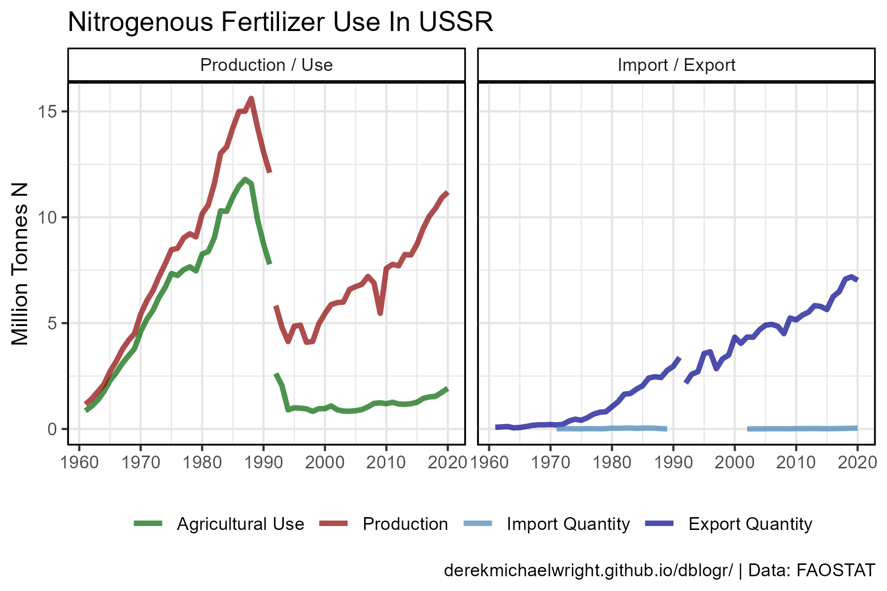

```{r}
# Plot
mp <- ggFertP(area = c("USSR", "Russia"))
ggsave("fertilizers_n_3_russia.png", mp, width = 6, height = 4)
```

---

## Crop Yields {.tabset .tabset-pills}

### Plotting Function

```{r class.source = 'fold-show'}
# Create plotting function
ggFertNYield <- function(area = "World") {
  # Prep data
  myIs <- c("Cereals, primary", "Oilcrops, Oil Equivalent", 
            "Pulses, Total", "Roots and Tubers, Total")
  myCs <- c("darkgreen", "darkorange", "darkred", "darkslategray")
  x1 <- agData_FAO_Crops2 %>% 
    filter(Area == area, Item %in% myIs, Measurement == "Yield") %>%
    select(Year, Crop=Item, Yield=Value)
  x2 <- dN %>% 
    filter(Area == area, Measurement == "Agricultural Use") %>%
    rename(Fertilizer=Value)
  xx <- left_join(x1, x2, by = "Year")
  # Plot
  ggplot(xx, aes(x = Fertilizer / 1000000, y = Yield / 1000, color = Crop)) + 
    geom_point(alpha = 0.7) +
    stat_smooth(geom = "line", method = "loess", se = F, 
                size = 0.75, color = "black", alpha = 0.3) +
    facet_wrap(Crop ~ ., scales = "free_y") +
    scale_color_manual(name = NULL, values = myCs) +
    theme_agData(legend.position = "none") +
    labs(title = area, x = "Million Tonnes of Nitrogen", 
         y = "tonnes / ha", caption = myCaption)
}
```

---

### World {.active}

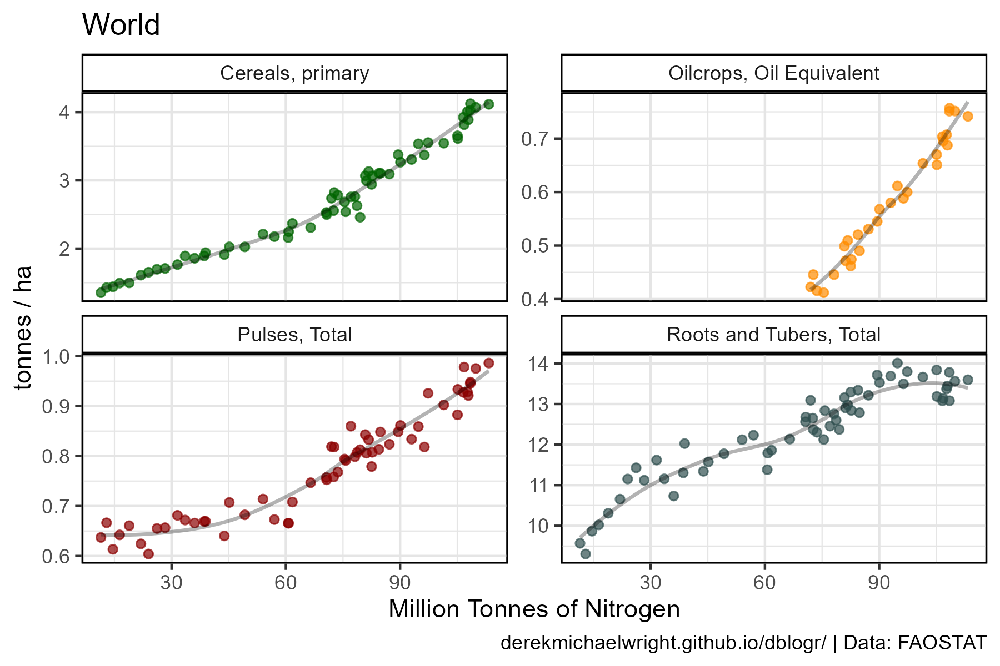

```{r}
mp <- ggFertNYield(area = "World")
ggsave("fertilizers_n_4_01.png", mp, width = 6, height = 4)
```

---

### Countries

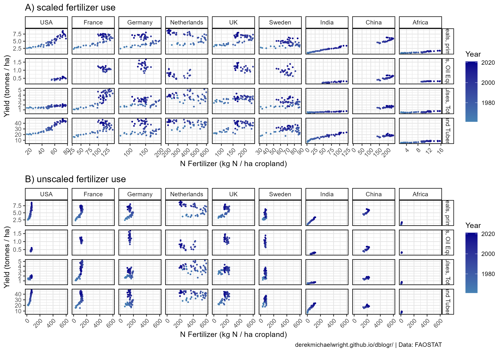

```{r}
myIs <- c("Cereals, primary", "Oilcrops, Oil Equivalent", 
          "Pulses, Total", "Roots and Tubers, Total")
myAs <- c("USA",  "France", "Germany", "Netherlands","UK",
          "Sweden", "India", "China", "Africa")
x1 <- agData_FAO_Crops2 %>% 
  filter(Area %in% myAs, Item %in% myIs, 
         Measurement %in% c("Yield", "Area Harvested")) %>%
  select(-Unit) %>% 
  rename(Crop=Item) %>%
  spread(Measurement, Value) %>% mutate(Yield = Yield / 1000)
x2 <- dN %>% 
  filter(Area %in% myAs, Measurement == "Agricultural Use") %>%
  rename(Fertilizer=Value)
x3 <- agData_FAO_LandUse %>%
  filter(Item == "Cropland", Area %in% myAs) %>%
  select(Area, Year, Cropland=Value)
xx <- left_join(x1, x2, by = c("Year","Area")) %>% 
  left_join(x3, by = c("Year","Area")) %>%
  mutate(Area = factor(Area, levels = myAs),
         NperHa = 1000 * Fertilizer / Cropland)
# Plot
mp1 <- ggplot(xx, aes(x = NperHa, y = Yield, color = Year)) + 
  geom_point(size = 0.5) +
  facet_grid(Crop ~ Area, scales = "free") +
  scale_color_continuous(high = "darkblue", low = "steelblue") +
  theme_agData(legend.position = "right",
               axis.text.x = element_text(angle = 45, hjust = 1)) +
  labs(title = "A) scaled fertilizer use",
       y = "Yield (tonnes / ha)", x = "N Fertilizer (kg N / ha cropland)")
mp2 <- mp1 + facet_grid(Crop ~ Area, scales = "free_y") +
  labs(title = "B) unscaled fertilizer use", caption = myCaption)
mp <- ggarrange(mp1, mp2, ncol = 1, heights = c(1,1.05))
ggsave("fertilizers_n_4_02.png", mp, width = 10, height = 7)
```

---

### Canada

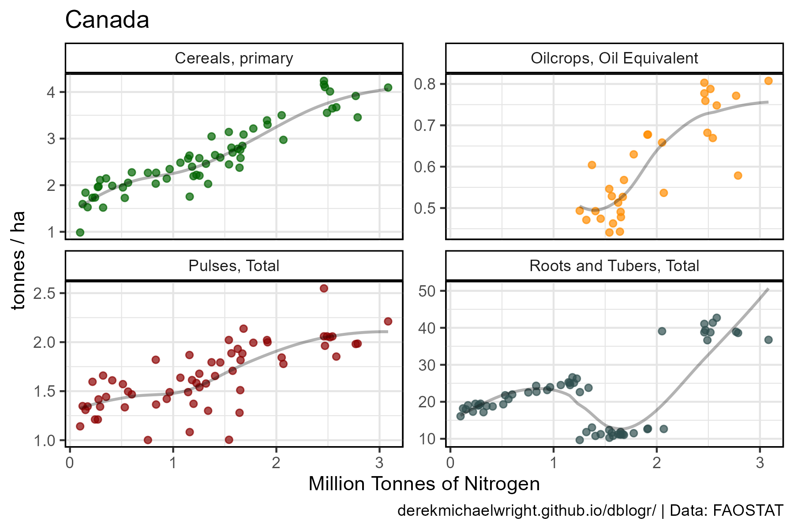

```{r}
mp <- ggFertNYield(area = "Canada")
ggsave("fertilizers_n_4_canada.png", mp, width = 6, height = 4)
```

---

# Phosphate (P) {.tabset .tabset-pills}

## Production {.tabset .tabset-pills}

### Top 20 {.tabset .tabset-pills}

#### Regions


```{r}
# Prep data
myAs <- c("Asia", "Europe", "Americas", "Africa", "Oceania")
myCs <- c("darkorange", "darkblue", "darkgreen", "darkred", "steelblue")
xx <- dP %>% 
  filter(Measurement == "Production", Year == 2019, Area %in% myAs) %>%
  arrange(desc(Value)) %>%
  slice(1:20) %>%
  mutate(Area = factor(Area, levels = Area))
# Plot
ggplot(xx, aes(x = Area, y = Value / 1000000, fill = Area)) +
  geom_col(color = "black", alpha = 0.7) +
  scale_fill_manual(name = NULL, values = myCs) +
  theme_agData(axis.text.x = element_text(angle = 45, hjust = 1)) +
  labs(title = "Phosphate Fertilizer Production", x = NULL,
       y = "Million Tonnes P2O5", caption = myCaption)
ggsave("fertilizers_p_1_01.png", mp, width = 6, height = 4)
```

---

#### Countries


```{r}
# Prep data
myAs <- c("Asia", "Europe", "Americas", "Africa", "Oceania")
myCs <- c("darkorange", "darkblue", "darkgreen", "darkred", "steelblue")
xx <- dP %>% 
  filter(Measurement == "Production", Year == 2019,
         Area %in% agData_FAO_Country_Table$Country) %>%
  left_join(agData_FAO_Country_Table, by = c("Area"="Country")) %>%
  arrange(desc(Value)) %>%
  slice(1:20) %>%
  mutate(Area = factor(Area, levels = Area),
         Region = factor(Region, levels = myAs))
# Plot
ggplot(xx, aes(x = Area, y = Value / 1000000, fill = Region)) +
  geom_col(color = "black", alpha = 0.7) +
  scale_fill_manual(name = NULL, values = myCs) +
  theme_agData(axis.text.x = element_text(angle = 45, hjust = 1)) +
  labs(title = "Phosphate Fertilizer Production", x = NULL,
       y = "Million Tonnes P2O5", caption = myCaption)
ggsave("fertilizers_p_1_02.png", mp, width = 6, height = 4)
```

---

### Unfacetted

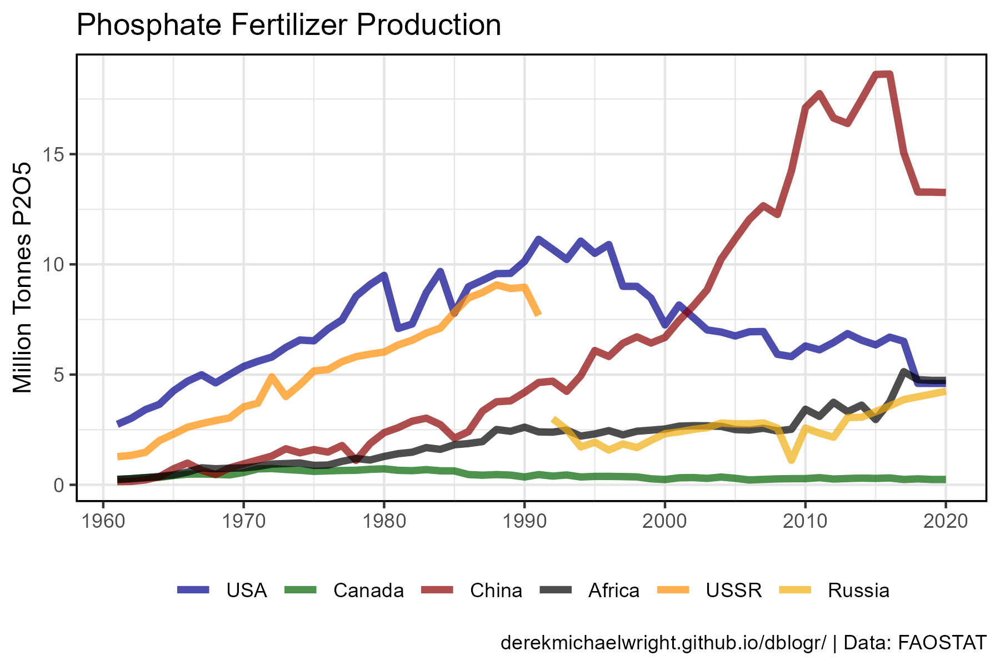

```{r}
# Prep data
myAs  <- c("USA", "Canada", "China", "Africa", "USSR", "Russia")
myCs <- c("darkblue", "darkgreen", "darkred", 
          "black", "darkorange", "darkgoldenrod2")
xx <- dP %>% 
    filter(Area %in% myAs, Measurement == "Production") %>%
    mutate(Area = factor(Area, levels = myAs))
# Plot
mp <- ggplot(xx, aes(x = Year, y = Value / 1000000, color = Area)) + 
  geom_line(size = 1.5, alpha = 0.7) + 
  scale_color_manual(name = NULL, values = myCs) +
  scale_x_continuous(breaks = seq(1960, 2020, by = 10)) + 
  guides(col = guide_legend(nrow = 1)) +
  theme_agData(legend.position = "bottom") +
  labs(title = "Phosphate Fertilizer Production", x = NULL,
       y = "Million Tonnes P2O5", caption = myCaption)
ggsave("fertilizers_p_1_03.png", mp, width = 6, height = 4)
```

---

### Facetted

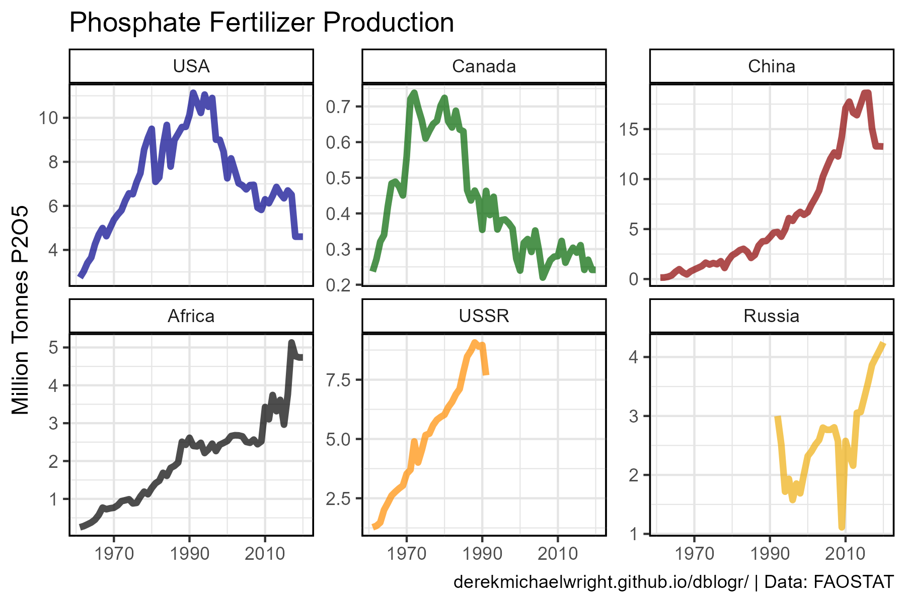

```{r}
# Plot
mp <- mp + 
  facet_wrap(Area ~ ., ncol = 3, scales = "free_y") +
  scale_x_continuous(breaks = seq(1970, 2010, by = 20)) + 
  theme(legend.position = "none")
ggsave("fertilizers_p_1_04.png", mp, width = 6, height = 4)
```

---

## Production, Use, Import & Export {.tabset .tabset-pills}

### World

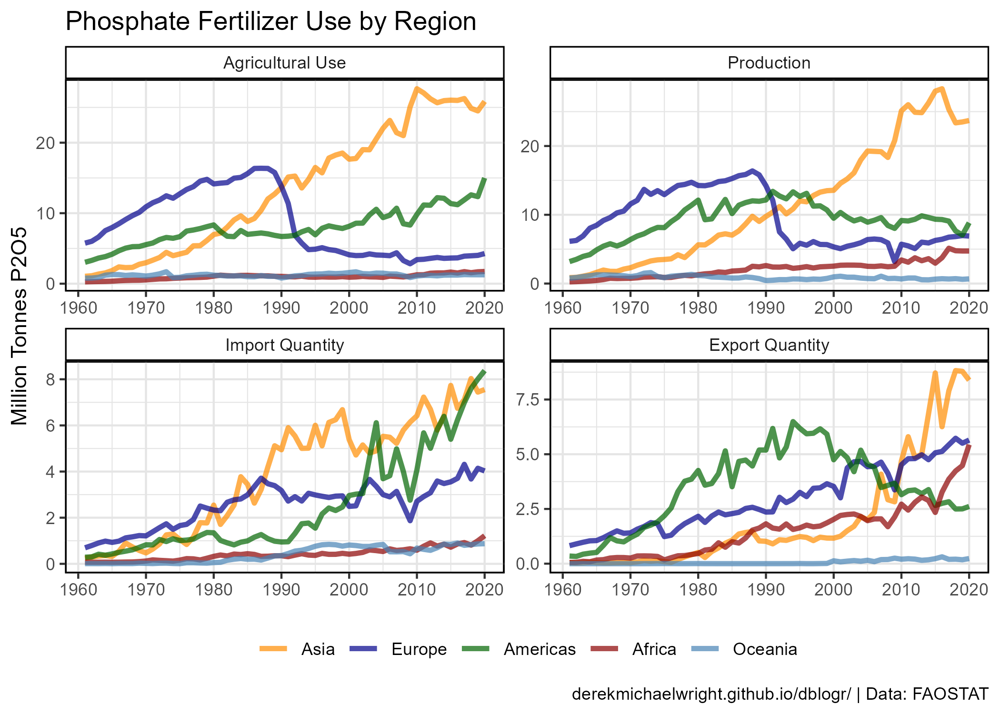

```{r}
# Prep data
myMs <- c("Agricultural Use", "Production", 
          "Import Quantity", "Export Quantity")
myAs <- c("Asia", "Europe", "Americas", "Africa", "Oceania")
myCs <- c("darkorange", "darkblue", "darkgreen", "darkred", "steelblue")
xx <- dP %>% 
  filter(Area %in% myAs, Measurement != "Other Uses") %>%
  mutate(Measurement = factor(Measurement, levels = myMs),
         Area = factor(Area, levels = myAs))
# Plot
mp <- ggplot(xx, aes(x = Year, y = Value / 1000000, color = Area)) + 
  geom_line(size = 1.25, alpha = 0.7) + 
  facet_wrap(Measurement ~ ., scales = "free") +
  theme_agData(legend.position = "bottom") +
  scale_x_continuous(breaks = seq(1960, 2020, by = 10)) + 
  scale_color_manual(name = NULL, values = myCs) + 
  labs(title = "Phosphate Fertilizer Use by Region", x = NULL,
       y = "Million Tonnes P2O5", caption = myCaption)
ggsave("fertilizers_p_2_01.png", mp, width = 7, height = 5)
```

---

### Europe

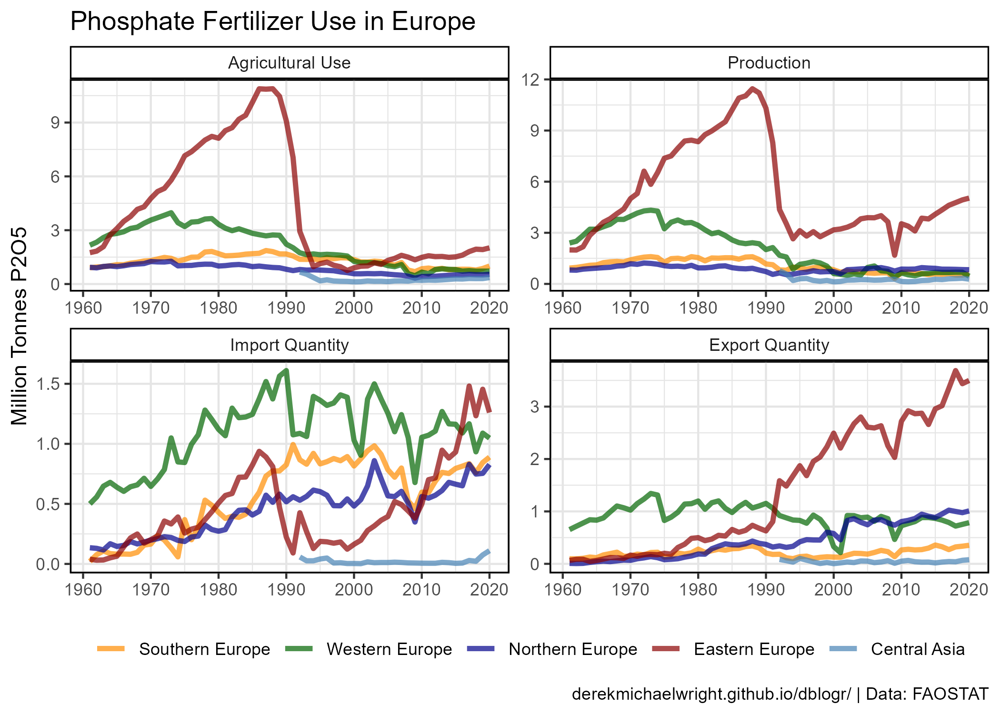

```{r}
# Prep data
myMs <- c("Agricultural Use", "Production", 
          "Import Quantity", "Export Quantity")
myAs <- c("Southern Europe", "Western Europe", "Northern Europe",
          "Eastern Europe", "Central Asia")
myCs <- c("darkorange", "darkgreen", "darkblue", "darkred", "steelblue")
xx <- dP %>% 
  filter(Area %in% myAs, Measurement != "Other Uses") %>%
  mutate(Measurement = factor(Measurement, levels = myMs),
         Area = factor(Area, levels = myAs))
# Plot
mp <- ggplot(xx, aes(x = Year, y = Value / 1000000, color = Area)) + 
  geom_line(size = 1.25, alpha = 0.7) + 
  facet_wrap(Measurement ~ ., scales = "free") +
  theme_agData(legend.position = "bottom") +
  scale_x_continuous(breaks = seq(1960, 2020, by = 10)) + 
  scale_color_manual(name = NULL, values = myCs) + 
  labs(title = "Phosphate Fertilizer Use in Europe", x = NULL,
       y = "Million Tonnes P2O5", caption = myCaption)
ggsave("fertilizers_p_2_02.png", mp, width = 7, height = 5)
```

---

### Countries {.tabset .tabset-pills}

#### Plotting Function 

```{r class.source = 'fold-show'}
# Create plotting function
ggFertN <- function(area = "Canada") {
  # Prep data
  myGs <- c("Production / Use", "Import / Export")
  myMs <- c("Agricultural Use", "Production", 
            "Import Quantity", "Export Quantity")
  myCs <- c("darkgreen", "darkred", "steelblue", "darkblue")
  xx <- dP %>% 
    filter(Area %in% area, Measurement != "Other Uses") %>%
    mutate(Measurement = factor(Measurement, levels = myMs),
           Group = ifelse(Measurement %in% myMs[1:2], myGs[1], myGs[2]),
           Group = factor(Group, levels = myGs))
  # Plot
  ggplot(xx, aes(x = Year, y = Value / 1000000, 
                 color = Measurement, group = paste(Area,Measurement))) + 
    geom_line(size = 1.25, alpha = 0.7) + 
    facet_grid(. ~ Group) +
    scale_color_manual(name = NULL, values = myCs) +
    scale_x_continuous(breaks = seq(1960, 2020, by = 10)) +
    theme_agData(legend.position = "bottom") +
    labs(title = paste("Phosphate Fertilizer Use In", area),
         y = "Million Tonnes P2O5", x = NULL, caption = myCaption)
}
```

---

#### Canada {.active}

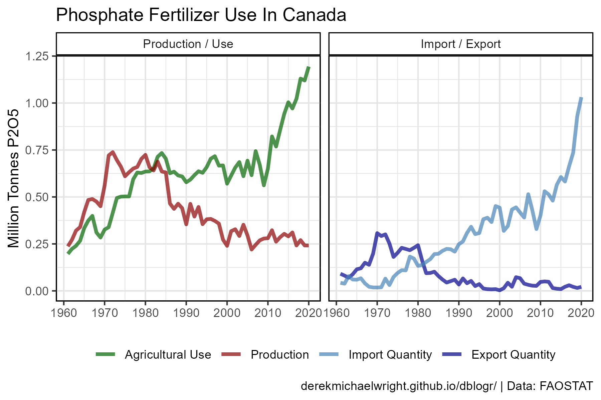

```{r}
# Plot
mp <- ggFertN(area = "Canada")
ggsave("fertilizers_p_3_canada.png", mp, width = 6, height = 4)
```

---

#### China

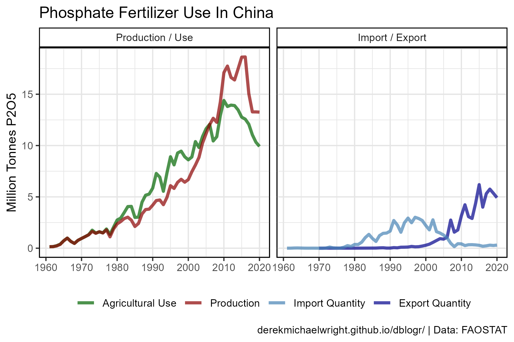

```{r}
# Plot
mp <- ggFertN(area = "China")
ggsave("fertilizers_p_3_china.png", mp, width = 6, height = 4)
```

---

#### USA


```{r}
# Plot
mp <- ggFertN(area = "USA")
ggsave("fertilizers_p_3_usa.png", mp, width = 6, height = 4)
```

---

#### India

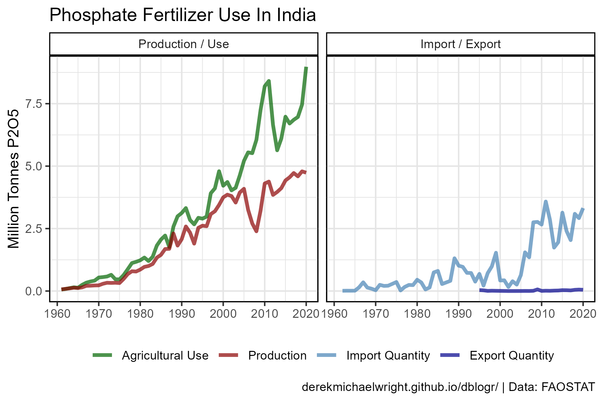

```{r}
# Plot
mp <- ggFertN(area = "India")
ggsave("fertilizers_p_3_india.png", mp, width = 6, height = 4)
```

---

#### Germany

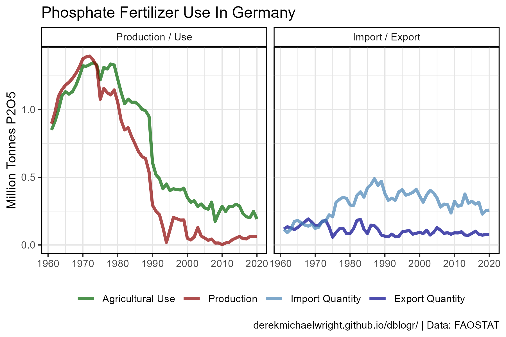

```{r}
# Plot
mp <- ggFertN(area = "Germany")
ggsave("fertilizers_p_3_germany.png", mp, width = 6, height = 4)
```

---

#### Ukraine

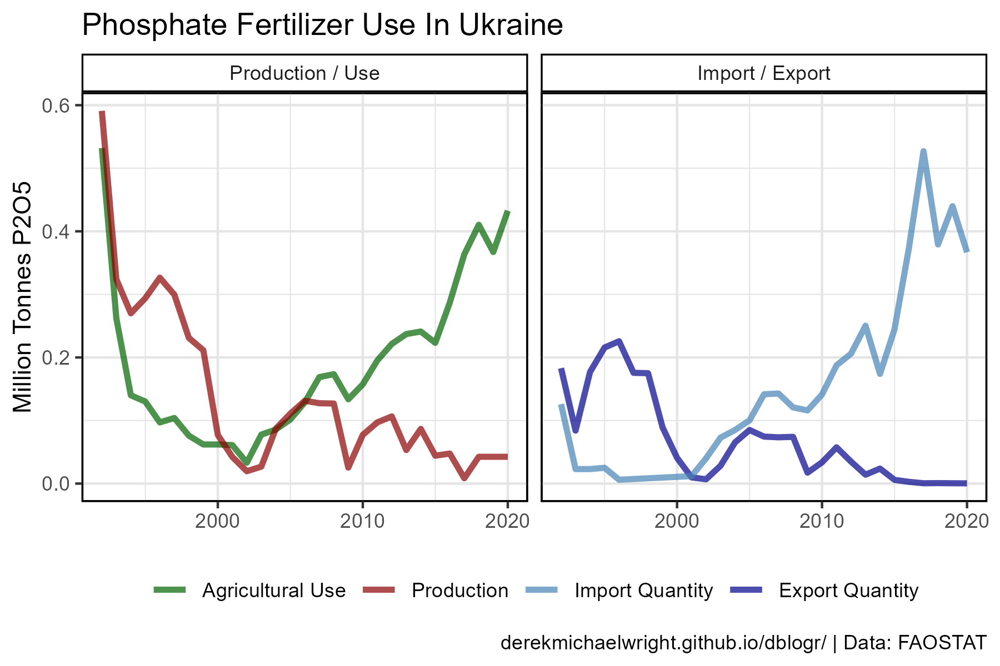

```{r}
# Plot
mp <- ggFertN(area = "Ukraine")
ggsave("fertilizers_p_3_ukraine.png", mp, width = 6, height = 4)
```

---

#### Russia


```{r}
# Plot
mp <- ggFertN(area = c("USSR", "Russia"))
ggsave("fertilizers_p_3_russia.png", mp, width = 6, height = 4)
```

---

# Pottasium (K) {.tabset .tabset-pills}

## Production {.tabset .tabset-pills}

### Top 20 {.tabset .tabset-pills}

#### Regions


```{r}
# Prep data
myAs <- c("Asia", "Europe", "Americas", "Africa", "Oceania")
myCs <- c("darkorange", "darkblue", "darkgreen", "darkred", "steelblue")
xx <- dK %>% 
  filter(Measurement == "Production", Year == 2019, Area %in% myAs) %>%
  arrange(desc(Value)) %>%
  slice(1:20) %>%
  mutate(Area = factor(Area, levels = Area))
# Plot
ggplot(xx, aes(x = Area, y = Value / 1000000, fill = Area)) +
  geom_col(color = "black", alpha = 0.7) +
  scale_fill_manual(name = NULL, values = myCs) +
  theme_agData(axis.text.x = element_text(angle = 45, hjust = 1)) +
  labs(title = "Potash Fertilizer Production", x = NULL,
       y = "Million Tonnes K20", caption = myCaption)
ggsave("fertilizers_k_1_01.png", mp, width = 6, height = 4)
```

---

#### Countries

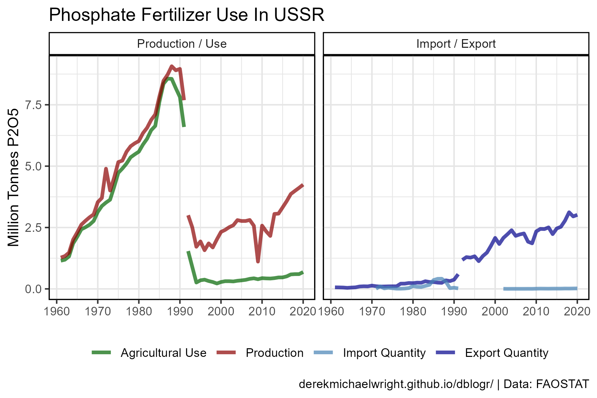

```{r}
# Prep data
myAs <- c("Asia", "Europe", "Americas", "Africa", "Oceania")
myCs <- c("darkorange", "darkblue", "darkgreen", "darkred", "steelblue")
xx <- dK %>% 
  filter(Measurement == "Production", Year == 2019,
         Area %in% agData_FAO_Country_Table$Country) %>%
  left_join(agData_FAO_Country_Table, by = c("Area"="Country")) %>%
  arrange(desc(Value)) %>%
  slice(1:20) %>%
  mutate(Area = factor(Area, levels = Area),
         Region = factor(Region, levels = myAs))
# Plot
ggplot(xx, aes(x = Area, y = Value / 1000000, fill = Region)) +
  geom_col(color = "black", alpha = 0.7) +
  scale_fill_manual(name = NULL, values = myCs) +
  theme_agData(axis.text.x = element_text(angle = 45, hjust = 1)) +
  labs(title = "Potash Fertilizer Production", x = NULL,
       y = "Million Tonnes K20", caption = myCaption)
ggsave("fertilizers_k_1_02.png", mp, width = 6, height = 4)
```

---

### Unfacetted

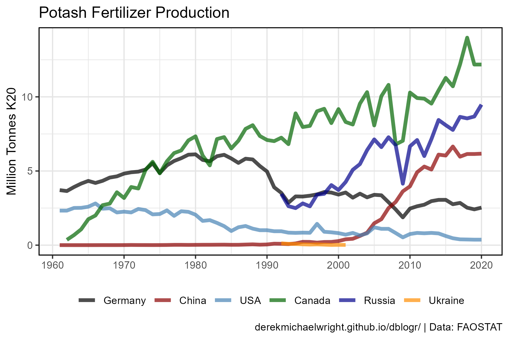

```{r}
# Prep data
myAs  <- c("Germany", "China", "USA", "Canada", "Russia", "Ukraine")
myCs <- c("black", "darkred", "steelblue", 
          "darkgreen", "darkblue", "darkorange")
xx <- dK %>% 
    filter(Area %in% myAs, Measurement == "Production") %>%
    mutate(Area = factor(Area, levels = myAs))
# Plot
mp <- ggplot(xx, aes(x = Year, y = Value / 1000000, color = Area)) + 
  geom_line(size = 1.5, alpha = 0.7) + 
  scale_color_manual(name = NULL, values = myCs) +
  scale_x_continuous(breaks = seq(1960, 2020, by = 10)) + 
  guides(col = guide_legend(nrow = 1)) +
  theme_agData(legend.position = "bottom") +
  labs(title = "Potash Fertilizer Production", x = NULL,
       y = "Million Tonnes K20", caption = myCaption)
ggsave("fertilizers_k_1_03.png", mp, width = 6, height = 4)
```

---

### Facetted

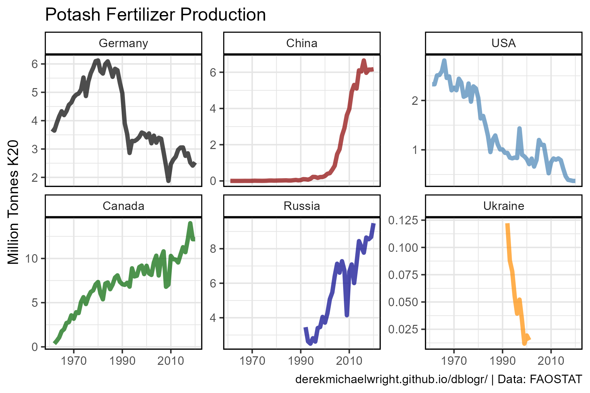

```{r}
# Plot
mp <- mp + 
  facet_wrap(Area ~ ., ncol = 3, scales = "free_y") +
  scale_x_continuous(breaks = seq(1970, 2010, by = 20)) + 
  theme(legend.position = "none")
ggsave("fertilizers_k_1_04.png", mp, width = 6, height = 4)
```

---

## Production, Use, Import & Export {.tabset .tabset-pills}

### World

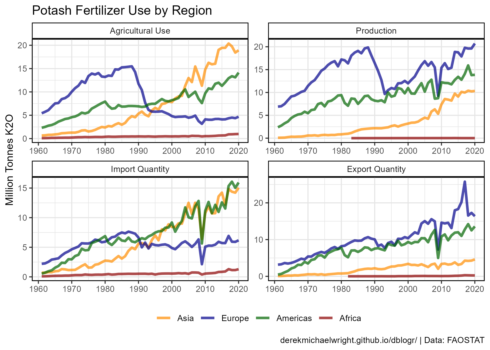

```{r}
# Prep data
myMs <- c("Agricultural Use", "Production", 
          "Import Quantity", "Export Quantity")
myAs <- c("Asia", "Europe", "Americas", "Africa")
colors <- c("darkorange", "darkblue", "darkgreen", "darkred")
xx <- dK %>% 
  filter(Area %in% myAs, Measurement != "Other Uses") %>%
  mutate(Measurement = factor(Measurement, levels = myMs),
         Area = factor(Area, levels = myAs))
# Plot
mp <- ggplot(xx, aes(x = Year, y = Value / 1000000, color = Area)) + 
  geom_line(size = 1.25, alpha = 0.7) + 
  facet_wrap(Measurement ~ ., scales = "free") +
  theme_agData(legend.position = "bottom") +
  scale_x_continuous(breaks = seq(1960, 2020, by = 10)) + 
  scale_color_manual(name = NULL, values = colors) + 
  labs(title = "Potash Fertilizer Use by Region", x = NULL,
       y = "Million Tonnes K2O", caption = myCaption)
ggsave("fertilizers_k_2_01.png", mp, width = 7, height = 5)
```

---

### Europe

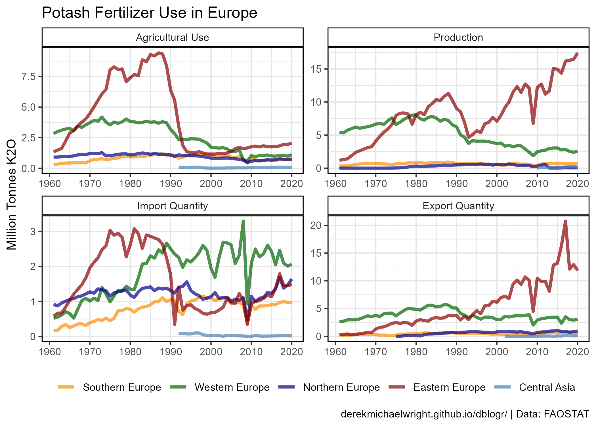

```{r}
# Prep data
myMs <- c("Agricultural Use", "Production", 
          "Import Quantity", "Export Quantity")
myAs <- c("Southern Europe", "Western Europe", "Northern Europe",
          "Eastern Europe", "Central Asia")
colors <- c("darkorange", "darkgreen", "darkblue", "darkred", "steelblue")
xx <- dK %>% 
  filter(Area %in% myAs, Measurement != "Other Uses") %>%
  mutate(Measurement = factor(Measurement, levels = myMs),
         Area = factor(Area, levels = myAs))
# Plot
mp <- ggplot(xx, aes(x = Year, y = Value / 1000000, color = Area)) + 
  geom_line(size = 1.25, alpha = 0.7) + 
  facet_wrap(Measurement ~ ., scales = "free") +
  theme_agData(legend.position = "bottom") +
  scale_x_continuous(breaks = seq(1960, 2020, by = 10)) + 
  scale_color_manual(name = NULL, values = colors) + 
  labs(title = "Potash Fertilizer Use in Europe", x = NULL,
       y = "Million Tonnes K2O", caption = myCaption )
ggsave("fertilizers_k_2_02.png", mp, width = 7, height = 5)
```

---

### Countries {.tabset .tabset-pills}

#### Plotting Function

```{r class.source = 'fold-show'}
# Create plotting function
ggFertK <- function(area = "Canada") {
  # Prep data
  myGs <- c("Production / Use", "Import / Export")
  myMs <- c("Agricultural Use", "Production", 
            "Import Quantity", "Export Quantity")
  myCs <- c("darkgreen", "darkred", "steelblue", "darkblue")
  xx <- dK %>% 
    filter(Area %in% area, Measurement != "Other Uses") %>%
    mutate(Measurement = factor(Measurement, levels = myMs),
           Group = ifelse(Measurement %in% myMs[1:2], myGs[1], myGs[2]),
           Group = factor(Group, levels = myGs))
  # Plot
  ggplot(xx, aes(x = Year, y = Value / 1000000, 
                 color = Measurement, group = paste(Area,Measurement))) + 
    geom_line(size = 1.25, alpha = 0.7) + 
    facet_grid(. ~ Group) +
    scale_color_manual(name = NULL, values = myCs) +
    scale_x_continuous(breaks = seq(1960, 2020, by = 10)) +
    theme_agData(legend.position = "bottom") +
    labs(title = paste("Potash Fertilizer Use In", area),
         y = "Million Tonnes K2O", x = NULL, caption = myCaption)
}
```

---

#### Canada {.active}

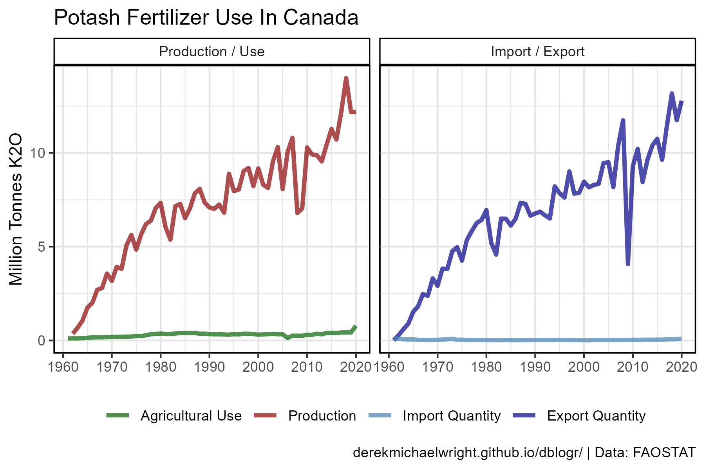

```{r}
# Plot
mp <- ggFertK(area = "Canada")
ggsave("fertilizers_k_3_canada.png", mp, width = 6, height = 4)
```

---

#### China

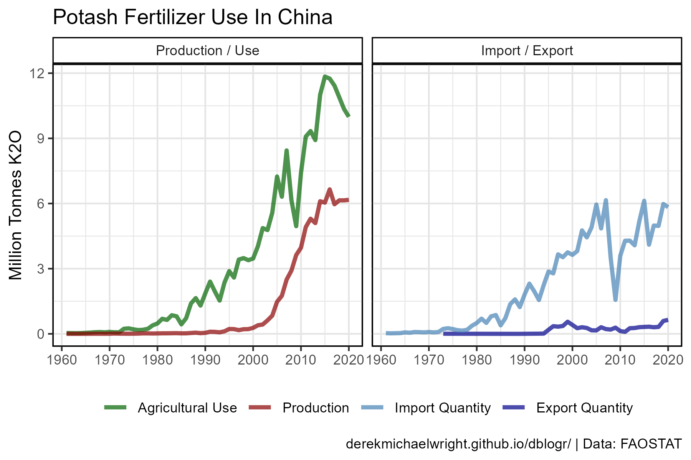

```{r}
# Plot
mp <- ggFertK(area = "China")
ggsave("fertilizers_k_3_china.png", mp, width = 6, height = 4)
```

---

#### USA

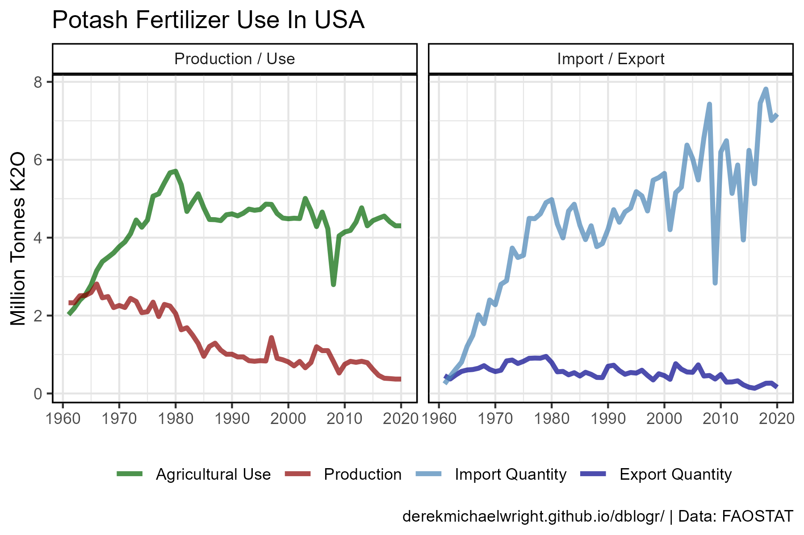

```{r}
# Plot
mp <- ggFertK(area = "USA")
ggsave("fertilizers_k_3_usa.png", mp, width = 6, height = 4)
```

---

#### India

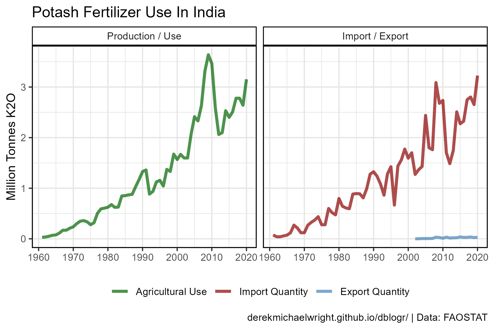

```{r}
# Plot
mp <- ggFertK(area = "India")
ggsave("fertilizers_k_3_india.png", mp, width = 6, height = 4)
```

---

#### Germany

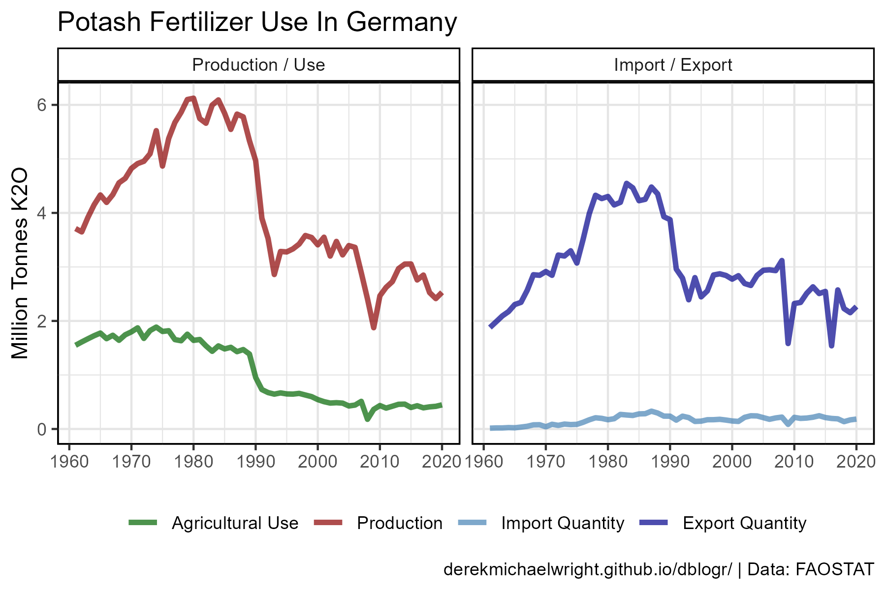

```{r}
# Plot
mp <- ggFertK(area = "Germany")
ggsave("fertilizers_k_3_germany.png", mp, width = 6, height = 4)
```

---

#### Ukraine

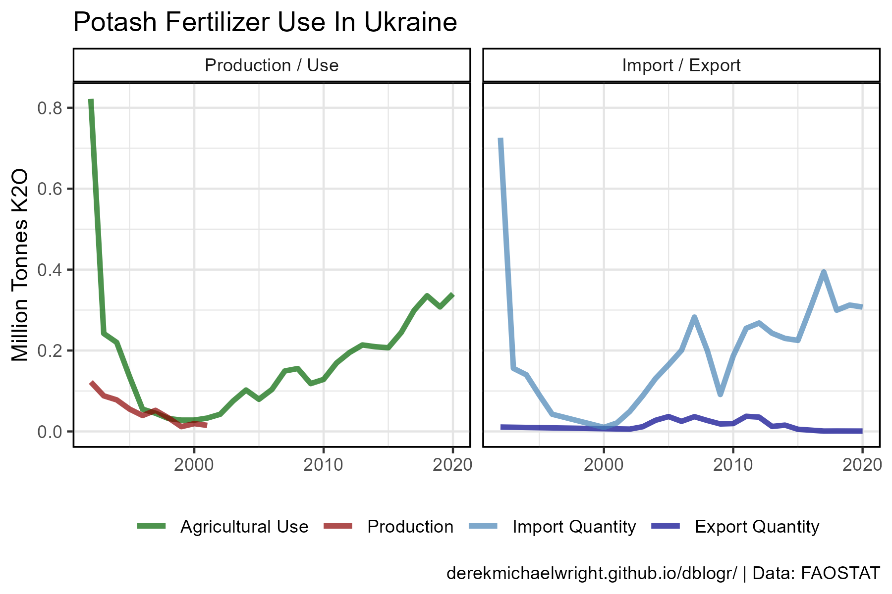

```{r}
# Plot
mp <- ggFertK(area = "Ukraine")
ggsave("fertilizers_k_3_ukraine.png", mp, width = 6, height = 4)
```

---

#### Russia

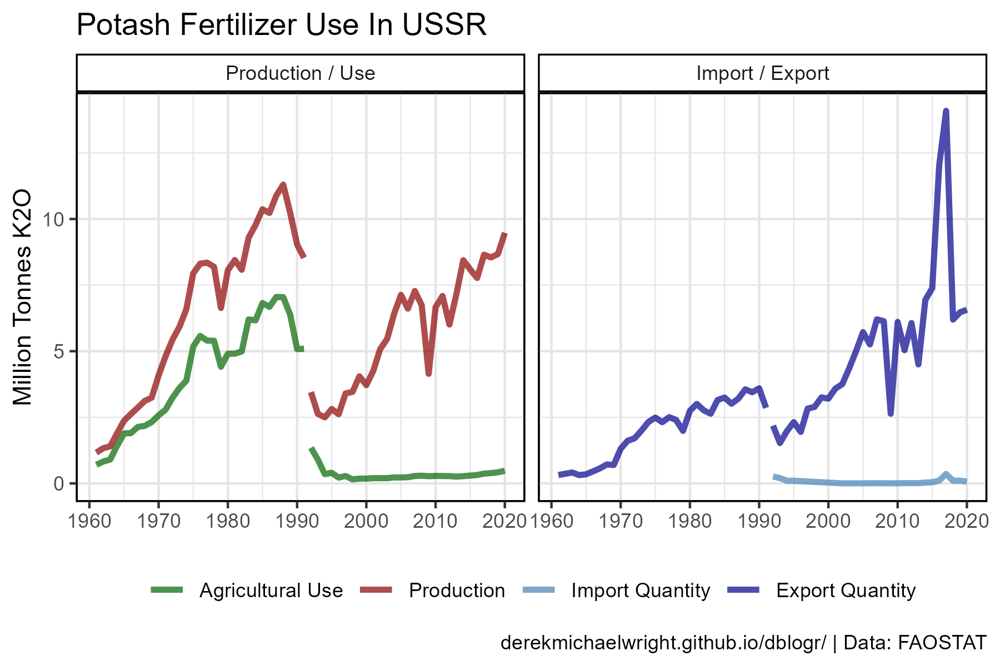

```{r}
# Plot
mp <- ggFertK(area = c("USSR", "Russia"))
ggsave("fertilizers_k_3_russia.png", mp, width = 6, height = 4)
```

---
