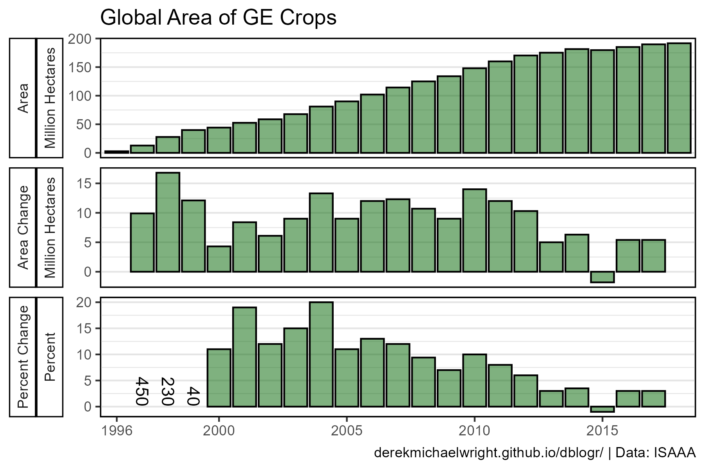
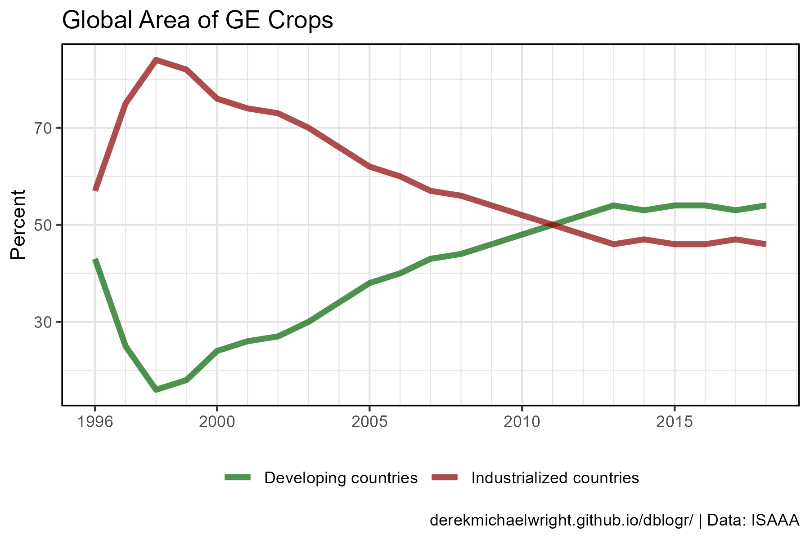
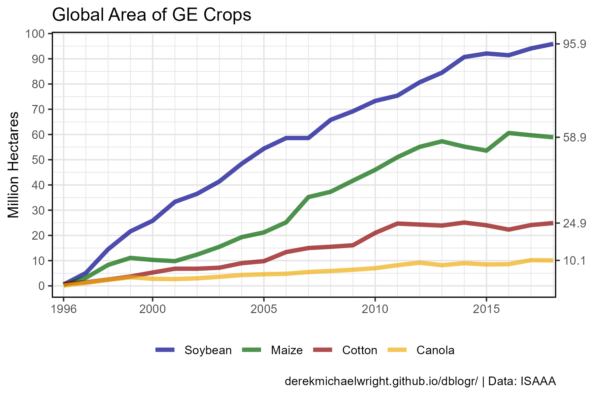
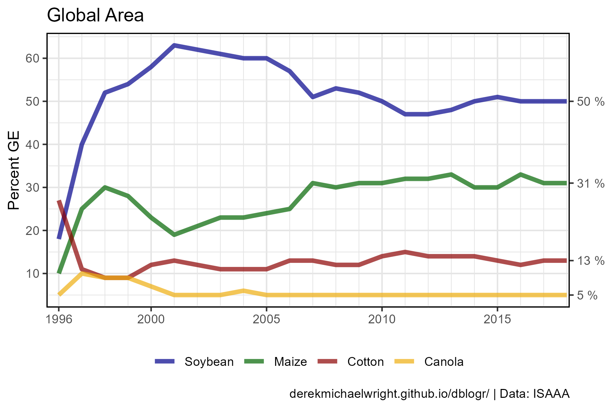
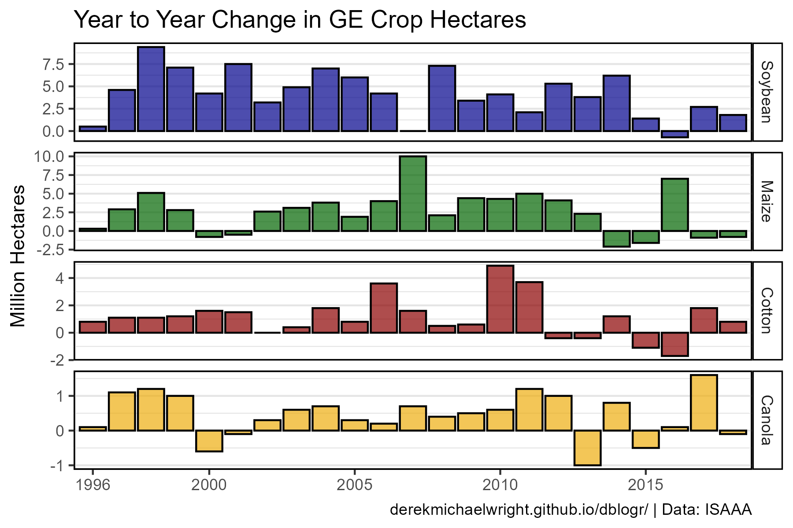
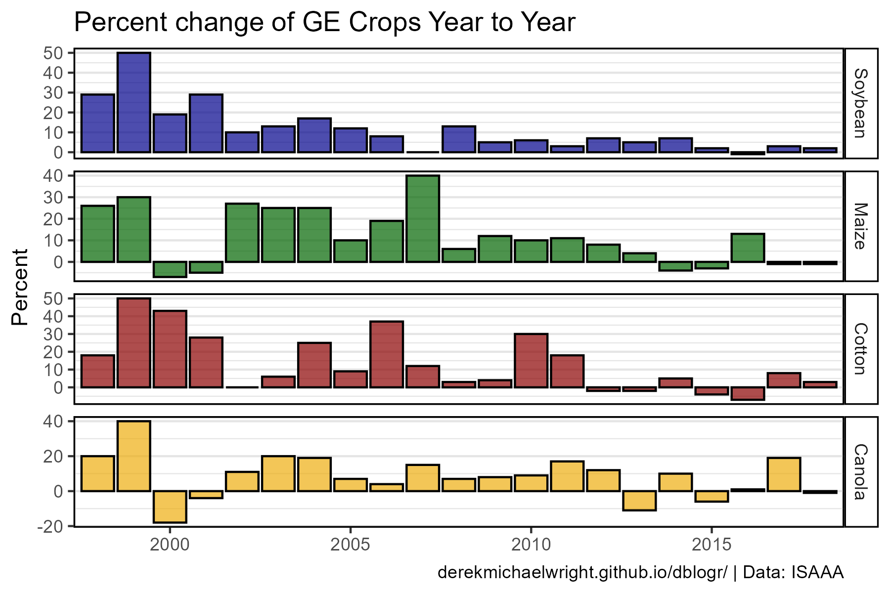
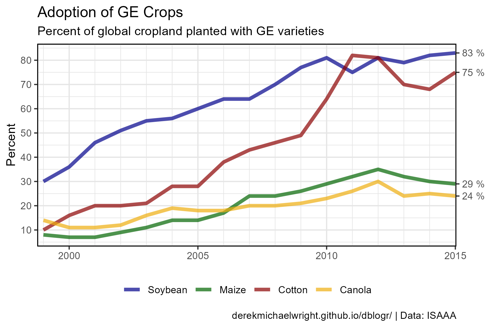
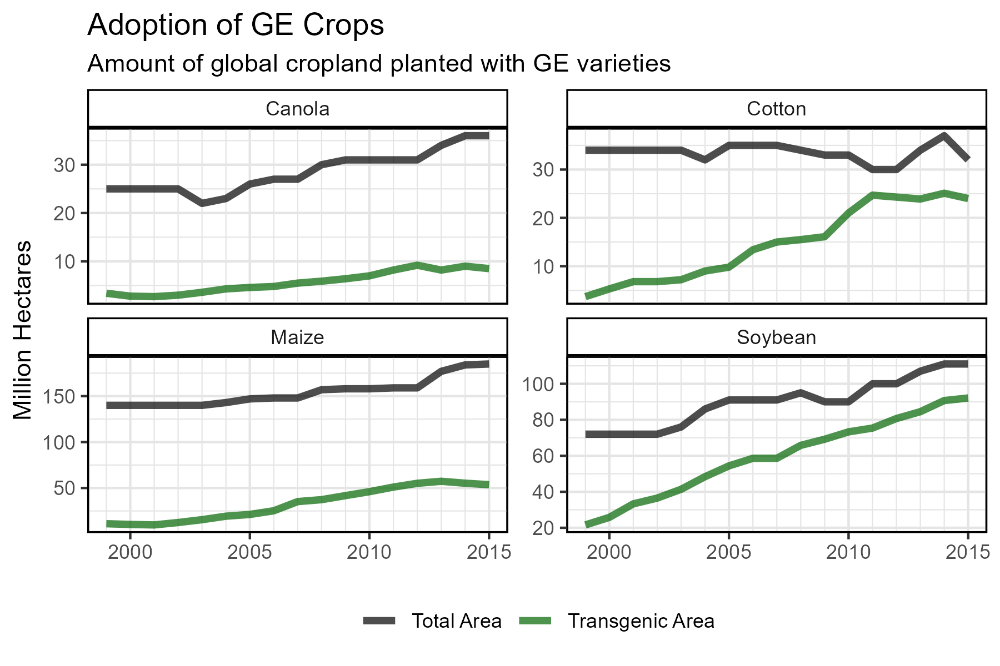
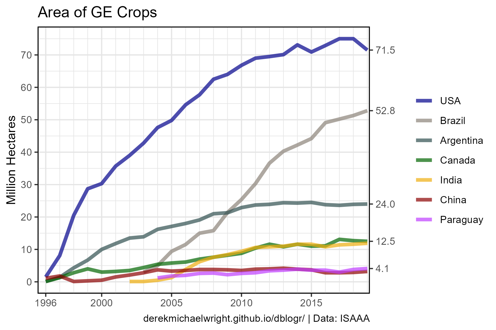
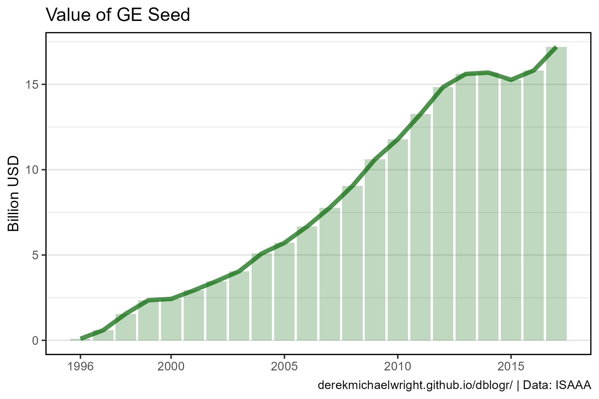

```{r setup, include = FALSE}
knitr::opts_chunk$set(echo = T, message = F, warning = F)
```

---

# Data

`r shiny::icon("globe")` https://www.isaaa.org/

`r shiny::icon("save")` [agData_ISAAA_Area.csv.gz](https://github.com/derekmichaelwright/agData/raw/master/Data/agData_ISAAA_Area.csv.gz)

`r shiny::icon("save")` [agData_ISAAA_Country.csv.gz](https://github.com/derekmichaelwright/agData/raw/master/Data/agData_ISAAA_Country.csv.gz)

`r shiny::icon("save")` [agData_ISAAA_Crop.csv.gz](https://github.com/derekmichaelwright/agData/raw/master/Data/agData_ISAAA_Crop.csv.gz)

`r shiny::icon("save")` [agData_ISAAA_CropPercent.csv.gz](https://github.com/derekmichaelwright/agData/raw/master/Data/agData_ISAAA_CropPercent.csv.gz)

`r shiny::icon("save")` [agData_ISAAA_DVDDVG.csv.gz](https://github.com/derekmichaelwright/agData/raw/master/Data/agData_ISAAA_DVDDVG.csv.gz)

`r shiny::icon("save")` [agData_ISAAA_Value.csv.gz](https://github.com/derekmichaelwright/agData/raw/master/Data/agData_ISAAA_Value.csv.gz)

---

# Prepare Data

```{r class.source = 'fold-show'}
# devtools::install_github("derekmichaelwright/agData")
library(agData)
```

```{r}
# Prep data
myCaption <- "www.dblogr.com/ or derekmichaelwright.github.io/dblogr/ | Data: ISAAA"
myCrops <- c("Soybean", "Maize", "Cotton", "Canola")
myColors_Crops <- c("darkblue", "darkgreen", "darkred", "darkgoldenrod2")
myColors_Areas <- c("darkblue", "antiquewhite4", "darkslategrey", 
                    "darkgreen", "darkgoldenrod2", "darkred", "darkorchid1")
#
d1 <- agData_ISAAA_Area
d2 <- agData_ISAAA_DVDDVG
d3 <- agData_ISAAA_Crop
d4 <- agData_ISAAA_CropPercent
d5 <- agData_ISAAA_Country
d6 <- agData_ISAAA_Value
```

---

# Global Hectares

## Global Area


```{r}
# Prep data
xx <- d1 %>% filter(Measurement == "Area")
# Plot
mp <- ggplot(xx, aes(x = Year, y = Value / 1000000)) +
  geom_bar(stat = "identity", alpha = 0.25, fill = "darkgreen") +
  geom_line(color = "darkgreen", size = 1.5, alpha = 0.7) +
  scale_x_continuous(breaks = c(1996, 2000, 2005, 2010, 2015),
                     minor_breaks = seq(1996, 2020, by = 1)) +
  theme_agData() +
  labs(title = "Global Area of GE Crops", x = NULL,
       y = "Million Hectares", caption = myCaption)
ggsave("ge_crops_01.png", mp, width = 6, height = 4)
```

---

## Year to Year Change



```{r}
# Prep data
xx <- d1 %>% 
  mutate(Value = ifelse(Measurement != "Percent Change", Value / 1000000, Value),
         Unit  = ifelse(Measurement != "Percent Change", paste("Million", Unit), Unit),
         Text  = ifelse((Measurement == "Percent Change" & Year %in% 1997:1999), Value, NA),
         Value = ifelse((Measurement == "Percent Change" & Year %in% 1997:1999), NA, Value))
# Plot
mp <- ggplot(xx, aes(x = Year, y = Value)) + 
  geom_bar(stat = "identity", alpha = 0.5, color = "Black", fill = "darkgreen") + 
  geom_text(aes(label = Text), y = 0, angle = 270, hjust = 1, vjust = 0.5 ) + 
  facet_grid(Measurement + Unit ~ ., scales = "free_y", switch = "y") +
  scale_x_continuous(breaks = c(1996, 2000, 2005, 2010, 2015),
                     minor_breaks = seq(1996, 2020, by = 1)) +
  coord_cartesian(xlim = c(min(xx$Year)+0.4, max(xx$Year)-0.4)) +
  theme_agData(strip.placement = "outside") +
  labs(title = "Global Area of GE Crops", 
       y = NULL, x = NULL, caption = myCaption)
ggsave("ge_crops_02.png", mp, width = 6, height = 4)
```

---

# Devloping vs Developed Countries

## Area


```{r}
# Prep data
xx <- d2 %>% filter(Unit == "Hectares")
xE <- xx %>% top_n(1, Year) %>% pull(Value) / 1000000
# Plot
mp <- ggplot(xx, aes(x = Year, y = Value / 1000000, color = Area)) + 
  geom_line(size = 1.5, alpha = 0.7) + 
  scale_color_manual(name = NULL, values = c("darkgreen", "darkred")) +
  scale_y_continuous(breaks = seq(0, 100, by = 10), 
                     sec.axis = sec_axis(~ ., breaks = xE)) +
  scale_x_continuous(breaks = c(1996, 2000, 2005, 2010, 2015),
                     minor_breaks = seq(1996, 2020, by = 1)) +
  coord_cartesian(xlim = c(min(xx$Year)+0.5, max(xx$Year)-0.9)) +
  theme_agData(legend.position = "bottom") +
  labs(title = "Global Area of GE Crops", x = NULL,
       y = "Million Hectares", caption = myCaption)
ggsave("ge_crops_03.png", mp, width = 6, height = 4)
```

```{r echo = F}
ggsave("featured.png", mp, width = 6, height = 4)
```

---

## Percentage



```{r}
# Prep data
xx <- d2 %>% filter(Unit == "Percent")
# Plot
mp <- ggplot(xx, aes(x = Year, y = Value, color = Area)) + 
  geom_line(size = 1.5, alpha = 0.7) + 
  scale_color_manual(name = NULL, values = c("darkgreen", "darkred")) +
  scale_x_continuous(breaks = c(1996, 2000, 2005, 2010, 2015),
                     minor_breaks = seq(1996, 2020, by = 1)) +
  theme_agData(legend.position = "bottom") +
  labs(title = "Global Area of GE Crops", x = NULL,
       y = "Percent", caption = myCaption)
ggsave("ge_crops_04.png", mp, width = 6, height = 4)
```

---

# Crops

## Area



```{r}
# Prep Data
xx <- d3 %>% 
  filter(Measurement == "Area", Item %in% myCrops) %>%
  mutate(Item = factor(Item, levels = myCrops))
xE <- xx %>% top_n(1, Year) %>% pull(Value) / 1000000
# Plot
mp <- ggplot(xx, aes(x = Year, y = Value / 1000000, color = Item)) +
  geom_line(size = 1.5, alpha = 0.7) +
  scale_color_manual(name = NULL, values = myColors_Crops) +
  scale_y_continuous(breaks = seq(0, 100, by = 10), 
                     sec.axis = sec_axis(~ ., breaks = xE)) +
  scale_x_continuous(breaks = c(1996, 2000, 2005, 2010, 2015),
                     minor_breaks = seq(1996, 2020, by = 1)) +
  coord_cartesian(xlim = c(min(xx$Year)+0.5, max(xx$Year)-0.9)) +
  theme_agData(legend.position = "bottom") +
  labs(title = "Global Area of GE Crops", x = NULL,
       y = "Million Hectares", caption = myCaption)
ggsave("ge_crops_05.png", mp, width = 6, height = 4)
```

---

## Percentage



```{r}
# Prep Data
xx <- d3 %>% 
  filter(Measurement == "Percent of GE Area", Item %in% myCrops) %>%
  mutate(Item = factor(Item, levels = myCrops))
xE <- xx %>% top_n(1, Year) %>% pull(Value)
# Plot
mp <- ggplot(xx, aes(x = Year, y = Value, color = Item)) +
  geom_line(size = 1.5, alpha = 0.7) +
  scale_color_manual(name = NULL, values = myColors_Crops) +
  scale_y_continuous(breaks = seq(0, 60, by = 10), 
                     sec.axis = sec_axis(~ ., breaks = xE, 
                                         labels = paste(xE,"%"))) +
  scale_x_continuous(breaks = c(1996, 2000, 2005, 2010, 2015),
                     minor_breaks = seq(1996, 2020, by = 1)) +
  coord_cartesian(xlim = c(min(xx$Year)+0.5, max(xx$Year)-0.9)) +
  theme_agData(legend.position = "bottom") +
  labs(title = "Percent of GE Area", x = NULL,
       y = "Percent", caption = myCaption)
ggsave("ge_crops_06.png", mp, width = 6, height = 4)
```

---

## Year to Year Change



```{r}
# Prep Data
xx <- d3 %>% 
  filter(Measurement == "Area Change", Item %in% myCrops) %>%
  mutate(Item = factor(Item, levels = myCrops))
# Plot
mp <- ggplot(xx, aes(x = Year, y = Value / 1000000, fill = Item)) +
  geom_bar(stat = "identity", color = "black", alpha = 0.7) +
  facet_grid(Item ~ ., scales = "free_y") +
  scale_fill_manual(values = myColors_Crops) +
  scale_x_continuous(breaks = c(1996, 2000, 2005, 2010, 2015),
                     minor_breaks = seq(1996, 2020, by = 1)) +
  coord_cartesian(xlim = c(min(xx$Year)+0.4, max(xx$Year)-0.4)) +
  theme_agData(legend.position = "none") +
  labs(title = "Year to Year Change in GE Crop Hectares", 
       y = "Million Hectares", x = NULL, caption = myCaption)
ggsave("ge_crops_07.png", mp, width = 6, height = 4)
```

---

## Year to Year Percentage Change



```{r}
# Prep Data
xx <- d3 %>% 
  filter(Measurement == "Percent Change", Year > 1997, Item %in% myCrops) %>%
  mutate(Item = factor(Item, levels = myCrops))
# Plot
mp <- ggplot(xx, aes(x = Year, y = Value, fill = Item)) +
  geom_bar(stat = "identity", color = "black", alpha = 0.7) +
  facet_grid(Item ~ ., scales = "free_y") +
  scale_fill_manual(values = myColors_Crops) +
  scale_x_continuous(breaks = c(1996, 2000, 2005, 2010, 2015),
                     minor_breaks = seq(1996, 2020, by = 1)) +
  coord_cartesian(xlim = c(min(xx$Year)+0.3, max(xx$Year)-0.3)) +
  theme_agData(legend.position = "none") +
  labs(title = "Percent change of GE Crops Year to Year", 
       y = "Percent", x = NULL, caption = myCaption)
ggsave("ge_crops_08.png", mp, width = 6, height = 4)
```

---

# Adoption of Genetically Engineered Crops

## Percentage



```{r}
# Prep Data
xx <- d4 %>% 
  filter(Measurement == "Percent", Item %in% myCrops) %>%
  mutate(Item = factor(Item, levels = myCrops))
xE <- xx %>% top_n(1, Year) %>% pull(Value)
# Plot
mp <- ggplot(xx, aes(x = Year, y = Value, color = Item)) +
  geom_line(size = 1.5, alpha = 0.7) +
  scale_color_manual(name = NULL, values = myColors_Crops) +
  scale_y_continuous(breaks = seq(0, 80, by = 10), 
                     sec.axis = sec_axis(~ ., breaks = xE, 
                                         labels = paste(xE,"%"))) +
  scale_x_continuous(breaks = c(1996, 2000, 2005, 2010, 2015),
                     minor_breaks = seq(1996, 2020, by = 1)) +
  coord_cartesian(xlim = c(min(xx$Year)+0.5, max(xx$Year)-0.7)) +
  theme_agData(legend.position = "bottom") +
  labs(title = "Adoption of GE Crops", 
       subtitle = "Percent of global cropland planted with GE varieties",
       y = "Percent", x = NULL, caption = myCaption)
ggsave("ge_crops_09.png", mp, width = 6, height = 4)
```

---

## Area



```{r}
# Prep Data
xx <- d4 %>% 
  filter(Item != "Others", Measurement != "Percent") %>%
  mutate(Measurement = plyr::mapvalues(Measurement, "Area", "Total Area"))
# Plot
mp <- ggplot(xx, aes(x = Year, y = Value / 1000000, color = Measurement)) +
  geom_line(size = 1.5, alpha = 0.7) +
  facet_wrap(Item ~ ., ncol= 2, scales = "free_y") +
  scale_color_manual(name = NULL, values = c("black", "darkgreen")) +
  scale_x_continuous(breaks = c(2000, 2005, 2010, 2015),
                     minor_breaks = seq(1996, 2020, by = 1)) +
  theme_agData(legend.position = "bottom") +
  labs(title = "Adoption of GE Crops", x = NULL,
       y = "Million Hectares", caption = myCaption)
ggsave("ge_crops_10.png", mp, width = 6, height = 4)
```

---

## Top Countries



```{r}
# Prep Data
xx<- d5 %>% filter(Measurement == "Area")
yy <- xx %>% filter(Value > 3000000) %>% pull(Area) %>% unique()
xx <- xx %>% filter(Area %in% yy) %>%
  arrange(desc(Value)) %>%
  mutate(Area = factor(Area, levels = unique(.$Area)),
         Value = Value / 1000000)
xE <- xx %>% top_n(1, Year) %>% pull(Value)
# Plot
mp <- ggplot(xx, aes(x = Year, y = Value, color = Area)) + 
  geom_line(size = 1.5, alpha = 0.7) + 
  scale_color_manual(name = NULL, values = myColors_Areas) +
  scale_y_continuous(breaks = seq(0, 80, by = 10), 
                     sec.axis = sec_axis(~ ., breaks = xE[c(1:4,6)])) +
  scale_x_continuous(breaks = c(1996, 2000, 2005, 2010, 2015),
                     minor_breaks = seq(1996, 2020, by = 1)) +
  coord_cartesian(xlim = c(min(xx$Year)+0.5, max(xx$Year)-0.9)) +
  theme_agData() +
  labs(title = "Area of GE Crops", x = NULL,
       y = "Million Hectares", caption = myCaption)
ggsave("ge_crops_11.png", mp, width = 6, height = 4)
```

---

## All Countries  


```{r}
# Prep Data
xx<- d5 %>%
  filter(Measurement == "Area") %>%
  arrange(desc(Value)) %>%
  mutate(Area = factor(Area, levels = unique(.$Area)))
# Plot
mp <- ggplot(xx, aes(x = Year, y = Value / 1000000)) + 
  geom_bar(stat = "identity", fill = "darkgreen", 
           alpha = 0.6, color = "black") +
  facet_wrap(Area ~ ., scales = "free_y", ncol = 11) +
  theme_agData() +
  theme(axis.text.x = element_text(angle = 90, hjust = 1, vjust = 0.5)) +
  labs(title = "Area of GE Crop by Country", x = NULL,
       y = "Million Hectares", caption = myCaption)
ggsave("ge_crops_12.png", mp, width = 21, height = 8)
```

---

# Value of GE Seed



```{r}
# Plot 
mp <- ggplot(d6, aes(x = Year, y = Value)) +
  geom_bar(stat = "identity", alpha = 0.25, fill = "darkgreen") +
  geom_line(color = "darkgreen", size = 1.5, alpha = 0.7) +
  scale_x_continuous(breaks = c(1996, 2000, 2005, 2010, 2015),
                     minor_breaks = seq(1996, 2020, by = 1)) +
  theme_agData() +
  labs(title = "Value of GE Seed", x = NULL,
       y = "Billion USD", caption = myCaption)
ggsave("ge_crops_13.png", mp, width = 6, height = 4)
```

---

```{r eval = F, echo = F}
# Regulations of New Breeding Technologies
# under construction...
# Prep data
xx <- agData_NBT_Limits %>% 
  mutate(Limiting.Factor = as.character(Limiting.Factor),
         PercentLabel = paste(Percent, "%"))
xx$Limiting.Factor[9] <- "Inadequate infrastructure"
xx <- xx %>% 
  mutate(Limiting.Factor = factor(Limiting.Factor, levels = rev(Limiting.Factor)))
# Plot
mp <- ggplot(xx, aes(x = Limiting.Factor, y = Percent, label = PercentLabel)) + 
  geom_bar(stat = "identity", alpha = 0.8, color = "black", fill = "darkred") + 
  geom_text(color = "white", nudge_y = -1.5) + 
  theme_agData() + 
  coord_flip() +
  labs(title = "Regulatory Barriers for NBTs", x = NULL,
       caption = "\u00A9 www.dblogr.com/  |  Data: ?") 
ggsave("ge_crops_14.png", mp, width = 6, height = 4)
```

```{r echo = F, eval = F}
xx <- d4 %>% filter(Item == "Others")
ggplot(xx, aes(x = Year, y = Value, color = Item)) +
  geom_line(size = 2) +
  facet_grid(.~) +
  theme_agData() +
  scale_color_manual(values = agData_Colors)
```
