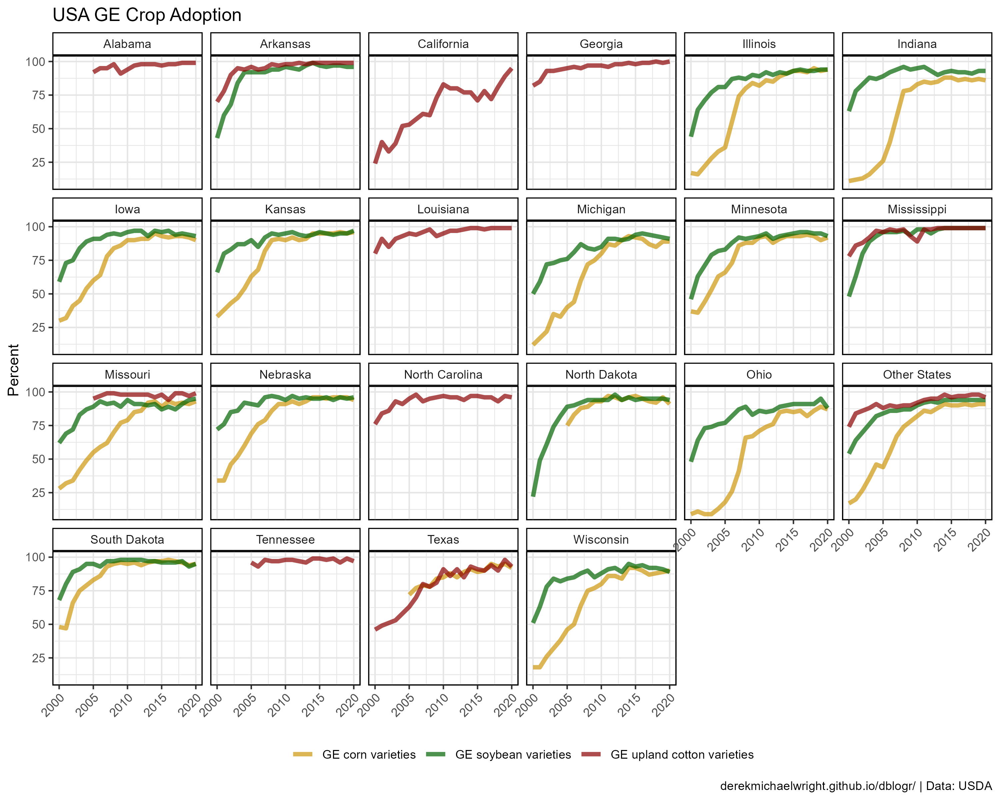
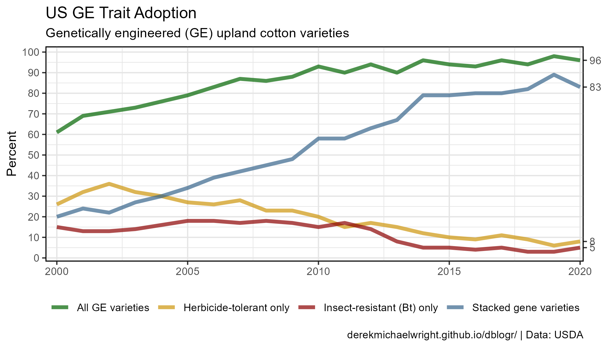
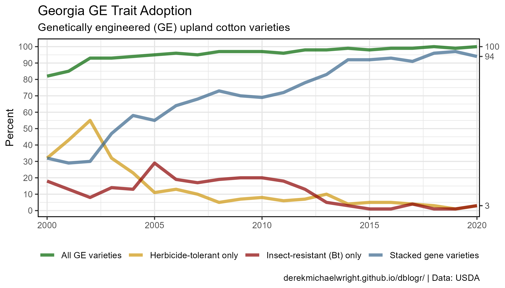

```{r setup, include = FALSE}
knitr::opts_chunk$set(echo = T, message = F, warning = F)
```

---

# Download Data

`r shiny::icon("globe")` https://www.ers.usda.gov/data-products/adoption-of-genetically-engineered-crops-in-the-us/

`r shiny::icon("save")` [agData_USDA_GE_Crops.csv](https://github.com/derekmichaelwright/agData/raw/master/Data/agData_USDA_GE_Crops.csv)

---

# Prepare Data

```{r class.source = 'fold-show'}
# devtools::install_github("derekmichaelwright/agData")
library(agData)
myCaption <- "www.dblogr.com/ or derekmichaelwright.github.io/dblogr/ | Data: USDA"
```

---

# All


```{r}
# Prep data
xx <- agData_USDA_GE_Crops %>% 
  filter(Area == "U.S.", Measurement == "All GE varieties") %>%
  mutate(Crop = gsub("Genetically engineered \\(GE\\)", "GE", Crop),
         Crop = gsub(" varieties", "", Crop))
xE <- xx %>% top_n(1, Year) %>% pull(Value)
# Plot
mp <- ggplot(xx, aes(x = Year, y = Value, color = Crop)) +
  geom_line(size = 1.5, alpha = 0.7) +
  scale_color_manual(name = NULL, values = agData_Colors[c(2,1,3)]) +
  scale_y_continuous(breaks = seq(0, 100, by = 10), 
                     sec.axis = sec_axis(~ ., breaks = xE[c(1,2)])) +
  coord_cartesian(xlim = c(min(xx$Year)+0.5, max(xx$Year)-0.8)) +
  theme_agData(legend.position = "bottom") +
  labs(title = "USA GE Crop Adoption", 
       y = "Percent", x = NULL, caption = myCaption)
ggsave("ge_crops_usa_01.png", mp, width = 6, height = 4)
```

```{r echo = F}
ggsave("featured.png", mp, width = 6, height = 4)
```

---

# States



```{r}
# Prep data
xx <- agData_USDA_GE_Crops %>% 
  filter(Area != "U.S.", Measurement == "All GE varieties") %>%
  mutate(Crop = gsub("Genetically engineered \\(GE\\)", "GE", Crop))
# Plot
mp <- ggplot(xx, aes(x = Year, y = Value, color = Crop)) +
  geom_line(size = 1.5, alpha = 0.7) +
  facet_wrap(Area ~ ., ncol = 6) +
  scale_color_manual(name = NULL, values = agData_Colors[c(2,1,3)]) +
  theme_agData(legend.position = "bottom",
               axis.text.x = element_text(angle = 45, hjust = 1)) +
  labs(title = "USA GE Crop Adoption", 
       y = "Percent", x = NULL, caption = myCaption)
ggsave("ge_crops_usa_02.png", mp, width = 10, height = 8)
```

---

# Maize


```{r}
# Prep data
xx <- agData_USDA_GE_Crops %>% 
  filter(Area == "U.S.", Crop == "Genetically engineered (GE) corn varieties")
xE <- xx %>% top_n(1, Year) %>% pull(Value)
# Plot
mp <- ggplot(xx, aes(x = Year, y = Value, color = Measurement)) +
  geom_line(size = 1.5, alpha = 0.7) +
  scale_color_manual(name = NULL, values = agData_Colors) +
  scale_y_continuous(breaks = seq(0, 100, by = 10), 
                     sec.axis = sec_axis(~ ., breaks = xE)) +
  coord_cartesian(xlim = c(min(xx$Year)+0.5, max(xx$Year)-0.8)) +
  theme_agData(legend.position = "bottom") +
  labs(title = "US GE Trait Adoption", 
       subtitle = "Genetically engineered (GE) corn varieties",
       y = "Percent", x = NULL, caption = myCaption)
ggsave("ge_crops_usa_03.png", mp, width = 7, height = 4)
```

---

# Cotton



```{r}
# Prep data
xx <- agData_USDA_GE_Crops %>% 
  filter(Area == "U.S.", 
         Crop == "Genetically engineered (GE) upland cotton varieties")
xE <- xx %>% top_n(1, Year) %>% pull(Value)
# Plot
mp <- ggplot(xx, aes(x = Year, y = Value, color = Measurement)) +
  geom_line(size = 1.5, alpha = 0.7) +
  scale_color_manual(name = NULL, values = agData_Colors) +
  scale_y_continuous(breaks = seq(0, 100, by = 10), 
                     sec.axis = sec_axis(~ ., breaks = xE)) +
  coord_cartesian(xlim = c(min(xx$Year)+0.5, max(xx$Year)-0.8)) +
  theme_agData(legend.position = "bottom") +
  labs(title = "US GE Trait Adoption", 
       subtitle = "Genetically engineered (GE) upland cotton varieties",
       y = "Percent", x = NULL, caption = myCaption)
ggsave("ge_crops_usa_04.png", mp, width = 7, height = 4)
```

---

# Soybeans


```{r}
# Prep data
xx <- agData_USDA_GE_Crops %>% 
  filter(Area == "U.S.", 
         Crop == "Genetically engineered (GE) soybean varieties")
xE <- xx %>% top_n(1, Year) %>% pull(Value)
# Plot
mp <- ggplot(xx, aes(x = Year, y = Value, 
                     color = Measurement, size = Measurement)) +
  geom_line(alpha = 0.7) +
  scale_color_manual(name = NULL, values = agData_Colors) +
  scale_size_manual(values = c(2,1), guide = F) +
  scale_y_continuous(breaks = seq(0, 100, by = 10), 
                     sec.axis = sec_axis(~ ., breaks = xE)) +
  coord_cartesian(xlim = c(min(xx$Year)+0.5, max(xx$Year)-0.8)) +
  theme_agData(legend.position = "bottom") +
  labs(title = "US GE Trait Adoption", 
       subtitle = "Genetically engineered (GE) soybean varieties",
       y = "Percent", x = NULL, caption = myCaption)
ggsave("ge_crops_usa_05.png", mp, width = 7, height = 4)
```

---

# Georgia



```{r}
# Prep data
xx <- agData_USDA_GE_Crops %>% 
  filter(Area == "Georgia", 
         Crop == "Genetically engineered (GE) upland cotton varieties")
xE <- xx %>% top_n(1, Year) %>% pull(Value)
# Plot
mp <- ggplot(xx, aes(x = Year, y = Value, color = Measurement)) +
  geom_line(size = 1.5, alpha = 0.7) +
  scale_color_manual(name = NULL, values = agData_Colors) +
  scale_y_continuous(breaks = seq(0, 100, by = 10), 
                     sec.axis = sec_axis(~ ., breaks = xE)) +
  coord_cartesian(xlim = c(min(xx$Year)+0.5, max(xx$Year)-0.8)) +
  theme_agData(legend.position = "bottom") +
  labs(title = "Georgia GE Trait Adoption", 
       subtitle = "Genetically engineered (GE) upland cotton varieties",
       y = "Percent", x = NULL, caption = myCaption)
ggsave("ge_crops_usa_06.png", mp, width = 7, height = 4)
```

---
