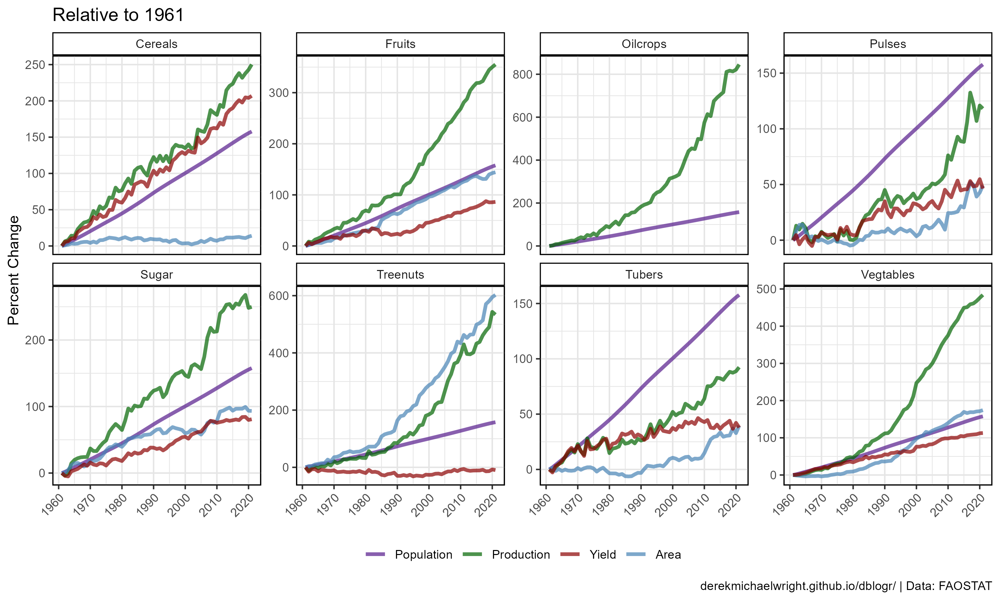
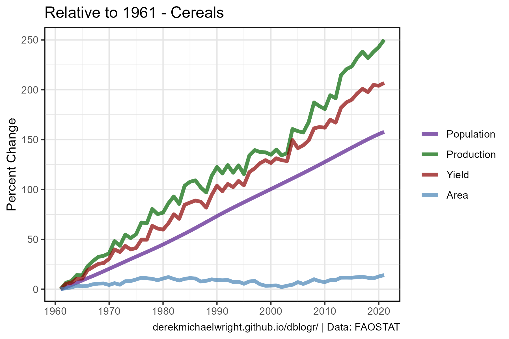
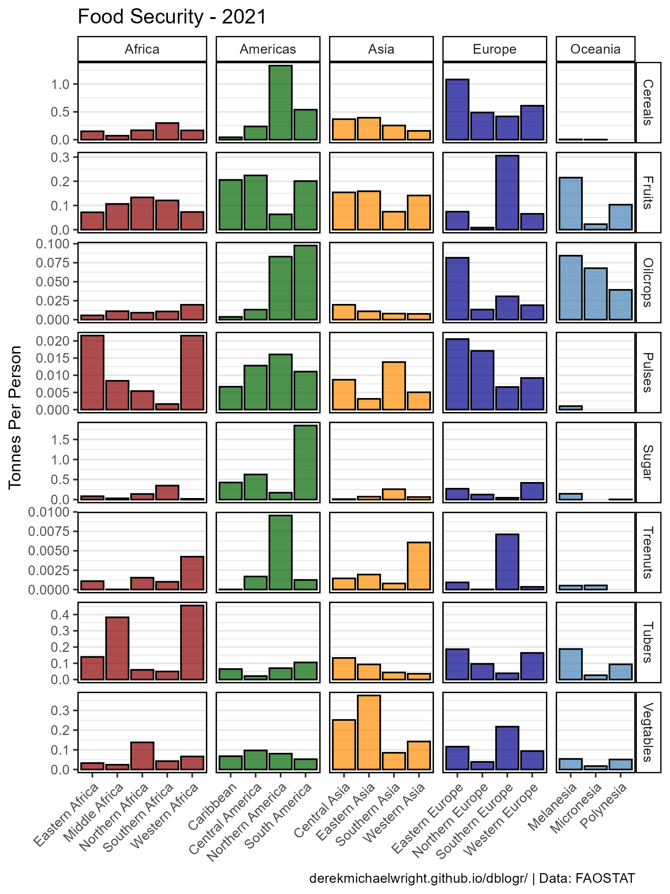
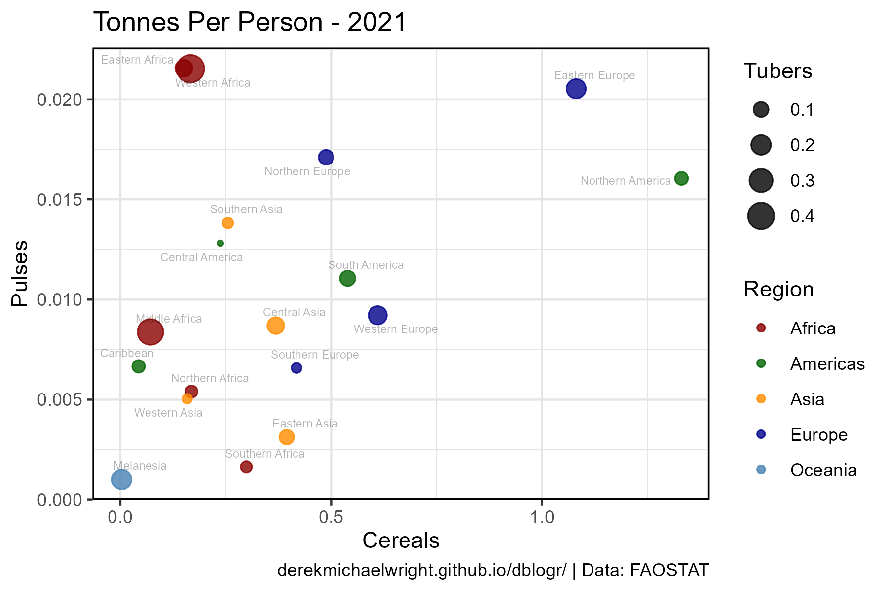
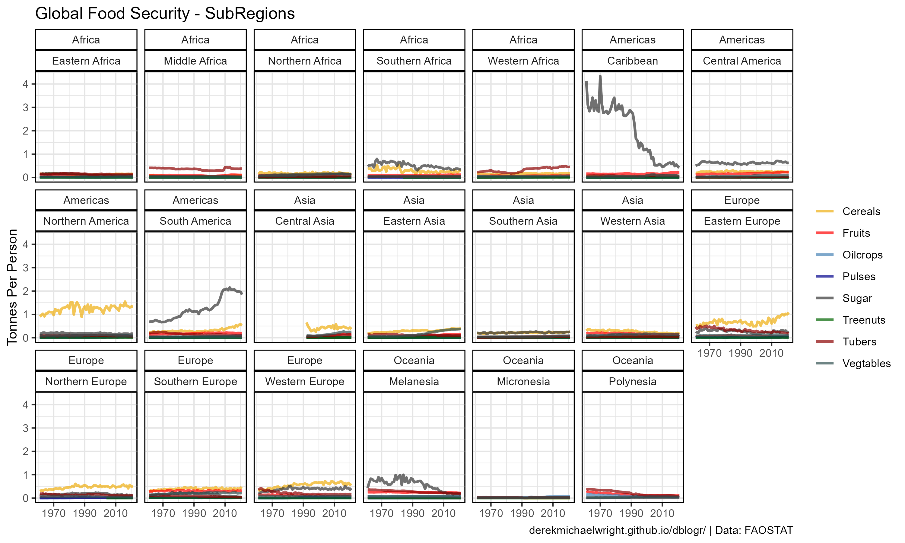
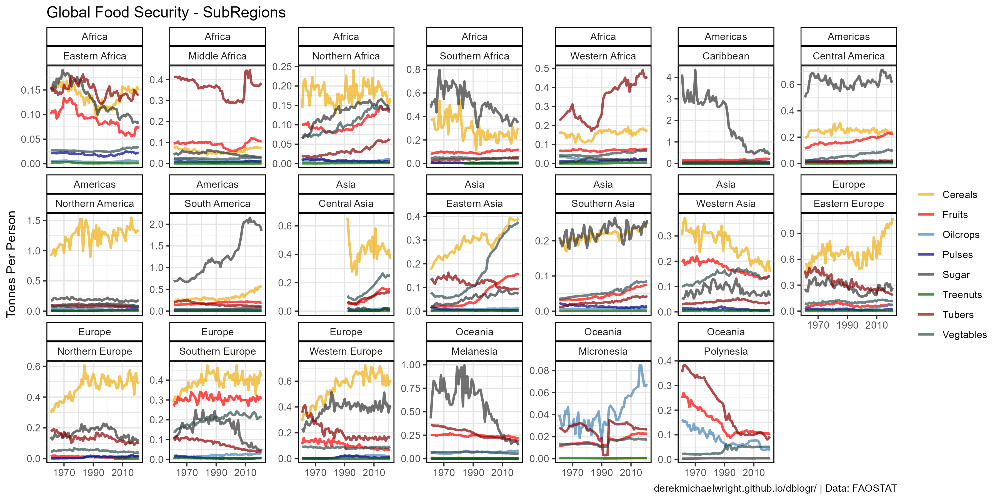
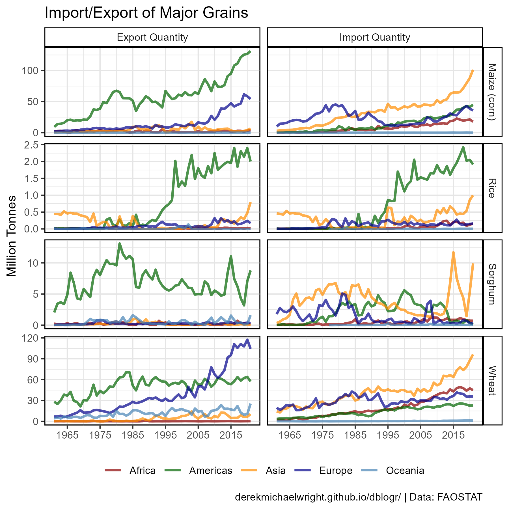
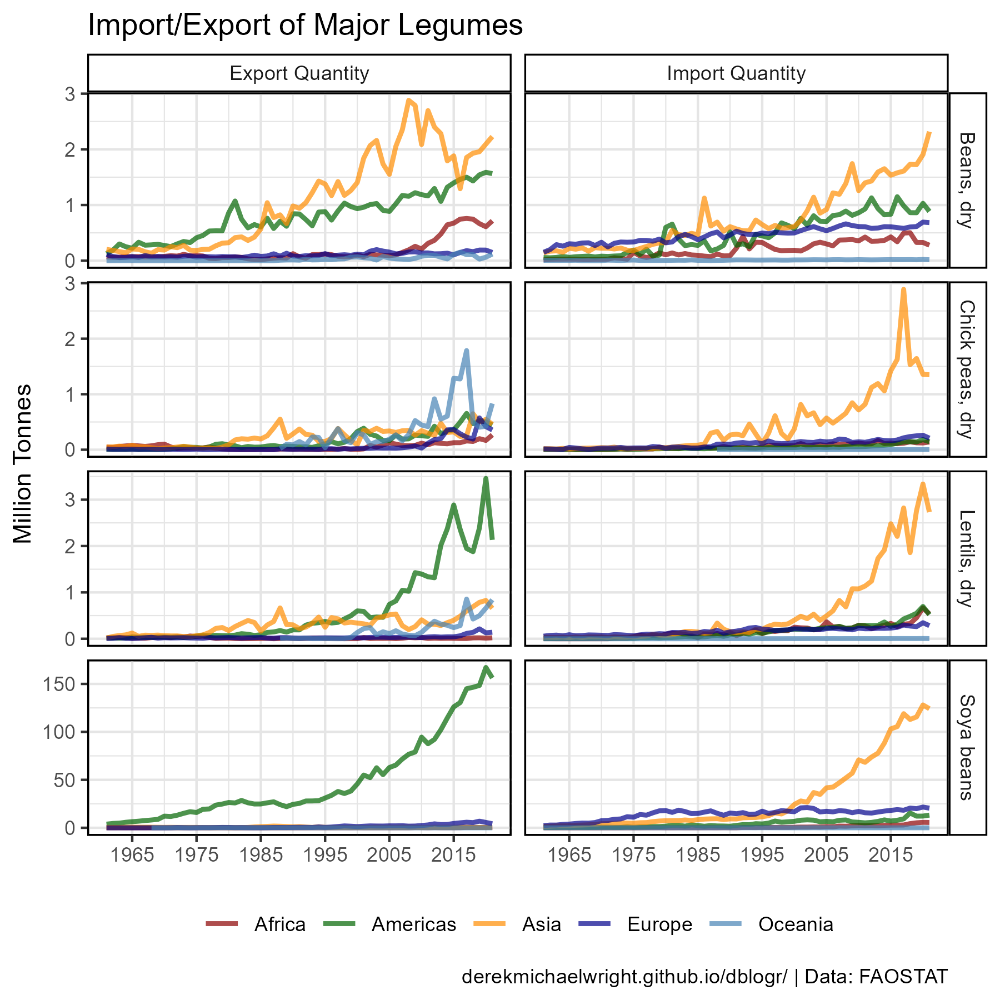

```{r setup, include = FALSE}
knitr::opts_chunk$set(echo = T, message = F, warning = F)
```

---

# Data

`r shiny::icon("save")` [agData_FAO_Country_Table.csv.gz](https://github.com/derekmichaelwright/agData/raw/master/Data/agData_FAO_Country_Table.csv.gz)

`r shiny::icon("globe")` http://www.fao.org/faostat/en/#data/QC

`r shiny::icon("save")` [agData_FAO_Crops2.csv.gz](https://github.com/derekmichaelwright/agData/raw/master/Data/agData_FAO_Crops2.csv.gz)

`r shiny::icon("globe")` http://www.fao.org/faostat/en/#data/TCL

`r shiny::icon("save")` [agData_FAO_Trade_Quantity.csv.gz](https://github.com/derekmichaelwright/agData/raw/master/Data/agData_FAO_Trade_Quantity.csv.gz)

---

# Prepare Data

```{r class.source = 'fold-show'}
# devtools::install_github("derekmichaelwright/agData")
library(agData)
library(gganimate)
```

```{r}
# Prep Data
myCaption <- "www.dblogr.com/ or derekmichaelwright.github.io/dblogr/ | Data: FAOSTAT"
myRegions <- unique(agData_FAO_Country_Table$Region)
mySubRegions <- unique(agData_FAO_Country_Table$SubRegion)
myAreas <- c("World", myRegions, mySubRegions)
myItems1 <- c("Oilcrops, Oil Equivalent", "Treenuts, Total", 
              "Vegetables Primary", "Fruit Primary", "Sugar Crops Primary",
              "Cereals, primary", "Pulses, Total", "Roots and Tubers, Total")
myItems2 <- c("Population", "Oilcrops", "Treenuts", "Vegtables", "Fruits",
              "Sugar", "Cereals", "Pulses", "Tubers")
myColors1 <- c("purple4",  "darkgoldenrod2", "red", "steelblue", "darkblue",
              "grey20", "darkgreen", "darkred", "darkslategray")
myColors2 <- c("purple4",  "darkgreen", "darkred", "steelblue")
myColors3 <- c("darkred", "darkgreen", "darkorange", "darkblue", "steelblue")
dd <- agData_FAO_Crops2 %>% select(-Unit) %>%
  filter(Area %in% myAreas, Item %in% myItems1) %>%
  spread(Measurement, Value)
pp <- agData_FAO_Population %>%
  filter(Measurement == "Total") %>%
  select(Area, Year, Population=Value)
dd <- left_join(dd, pp, by = c("Area", "Year")) %>%
  left_join(agData_FAO_Region_Table, by = c("Area"="SubRegion")) %>%
  mutate(TonnesPerPerson = Production / Population,
         Item = plyr::mapvalues(Item, myItems1, myItems2[-1]),
         Area = plyr::mapvalues(Area, "Australia and New Zealand", "Au and NZ"),
         Population_R1961 = NA, Production_R1961 = NA,
         Area_R1961 = NA, Yield_R1961 = NA)
for(i in unique(dd$Item)) {
  for(j in unique(dd$Area)) {
    # Population
    p1961 <- dd %>% 
      filter(Area == j, Item == i, Year == 1961) %>% pull(Population)
    dd <- dd %>% mutate(Population_R1961 = ifelse(Area == j & Item == i, 
              100*(Population - p1961) / p1961, Population_R1961))
    # Production
    p1961 <- dd %>% 
      filter(Area == j, Item == i, Year == 1961) %>% pull(Production)
    dd <- dd %>% mutate(Production_R1961 = ifelse(Area == j & Item == i, 
              100*(Production - p1961) / p1961, Production_R1961))
    # Area
    p1961 <- dd %>% 
      filter(Area == j, Item == i, Year == 1961) %>% pull(`Area Harvested`)
    dd <- dd %>% mutate(Area_R1961 = ifelse(Area == j & Item == i, 
              100*(`Area Harvested` - p1961) / p1961, Area_R1961))
    # Yield
    p1961 <- dd %>% 
      filter(Area == j, Item == i, Year == 1961) %>% pull(Yield)
    dd <- dd %>% mutate(Yield_R1961 = ifelse(Area == j & Item == i, 
              100*(Yield - p1961) / p1961, Yield_R1961))
  }
}
```

---

# Relative to Population

## Crops


```{r}
# Prep data
xx <- dd %>% filter(Area == "World")
# Plot
mp <- ggplot(xx, aes(x = Year, )) +
  geom_line(aes(y = Population_R1961, color = "Population"), 
            size = 1.75, alpha = 0.8) +
  geom_line(aes(y = Production_R1961, color = Item), 
            size = 0.75, alpha = 0.7) +
  scale_x_continuous(breaks = seq(1960, 2020, by = 10)) +
  scale_color_manual(name = NULL, values = myColors1, breaks = myItems2) +
  theme_agData() +
  labs(title = "Production Relative to 1961", x = NULL,
       y = "Percent Change", caption = myCaption)
ggsave("global_food_security_01.png", mp, width = 6, height = 4)
```

---

## Production, Area & Yield



```{r}
# Prep data
xx <- dd %>% filter(Area == "World")
# Plot
mp <- ggplot(xx, aes(x = Year)) +
  geom_line(aes(y = Population_R1961, color = "Population"),
            size = 1.25, alpha = 0.7) +
  geom_line(aes(y = Production_R1961, color = "Production"),
            size = 1.25, alpha = 0.7) +
  geom_line(aes(y = Area_R1961, color = "Area"),
            size = 1.25, alpha = 0.7) +
  geom_line(aes(y = Yield_R1961, color = "Yield"),
            size = 1.25, alpha = 0.7) +
  facet_wrap(. ~ Item, ncol = 4, scales = "free_y") +
  scale_x_continuous(breaks = seq(1960, 2020, by = 10)) +
  scale_color_manual(name = NULL, values = myColors2,
                     breaks = c("Population","Production", "Yield", "Area")) +
  theme_agData(legend.position = "bottom",
               axis.text.x = element_text(angle = 45, hjust = 1)) +
  labs(title = "Relative to 1961", x = NULL,
       y = "Percent Change", caption = myCaption)
ggsave("global_food_security_02.png", mp, width = 10, height = 6)
```

---

## Cereals



```{r}
# Prep data
xx <- dd %>% filter(Area == "World", Item == "Cereals")
# Plot
mp <- ggplot(xx, aes(x = Year)) +
  geom_line(aes(y = Population_R1961, color = "Population"),
            size = 1.5, alpha = 0.7) +
  geom_line(aes(y = Production_R1961, color = "Production"),
            size = 1.5, alpha = 0.7) +
  geom_line(aes(y = Yield_R1961, color = "Yield"),
            size = 1.5, alpha = 0.7) +
  geom_line(aes(y = Area_R1961, color = "Area"),
            size = 1.5, alpha = 0.7) +
  scale_x_continuous(breaks = seq(1960, 2020, by = 10)) +
  scale_color_manual(name = NULL, values = myColors2,
                     breaks = c("Population","Production", "Yield", "Area")) +
  theme_agData() +
  labs(title = "Relative to 1961 - Cereals", x = NULL,
       y = "Percent Change", caption = myCaption)
ggsave("global_food_security_03.png", mp, width = 6, height = 4)
```

---

## Cereals vs. Pulses


```{r}
# Prep data
xx <- dd %>% filter(Area == "World", Item %in% c("Cereals", "Pulses"))
# Plot
mp <- ggplot(xx, aes(x = Year)) +
  geom_line(aes(y = Population_R1961, color = "Population"),
            size = 1.5, alpha = 0.7) +
  geom_line(aes(y = Production_R1961, color = "Production"),
            size = 1.5, alpha = 0.7) +
  geom_line(aes(y = Yield_R1961, color = "Yield"),
            size = 1.5, alpha = 0.7) +
  geom_line(aes(y = Area_R1961, color = "Area"),
            size = 1.5, alpha = 0.7) +
  facet_grid(. ~ Item) +
  scale_x_continuous(breaks = seq(1960, 2020, by = 10)) +
  scale_color_manual(name = NULL, values = myColors2,
                     breaks = c("Population","Production", "Yield", "Area")) +
  theme_agData(legend.position = "bottom") +
  labs(title = "Relative to 1961", x = NULL,
       y = "Percent Change", caption = myCaption)
ggsave("global_food_security_04.png", mp, width = 6, height = 4)
```

```{r echo = F}
ggsave("featured.png", mp, width = 6, height = 4)
```

---

# Tonnes Per Person

## Regions


```{r}
# Prep data
xx <- dd %>% filter(Area %in% myRegions, Year == max(Year))
# Plot
mp <- ggplot(xx, aes(x = Area, y = TonnesPerPerson, fill = Area)) + 
  geom_bar(stat = "identity", color = "black", alpha = 0.7) +
  facet_wrap(Item ~ ., scales = "free", ncol = 4) +
  scale_fill_manual(values = myColors3) +
  theme_agData(legend.position = "none", 
               axis.text.x = element_text(angle = 45, hjust = 1)) +
  labs(title = paste("Food Security -", max(xx$Year)), 
       y = "Tonnes Per Person", x = NULL, caption = myCaption)
ggsave("global_food_security_05.png", mp, width = 12, height = 6)
```

---

## SubRegions



```{r}
# Prep data
xx <- dd %>% filter(Area %in% mySubRegions, Year == max(Year))
# Plot
mp <- ggplot(xx, aes(x = Area, y = TonnesPerPerson, fill = Region)) + 
  geom_bar(stat = "identity", color = "black", alpha = 0.7) +
  facet_grid(Item ~ Region, scales = "free", space = "free_x") +
  scale_fill_manual(values = myColors3) +
  theme_agData(legend.position = "none", 
               axis.text.x = element_text(angle = 45, hjust = 1)) +
  labs(title = paste("Food Security -", max(xx$Year)), 
       y = "Tonnes Per Person", x = NULL, caption = myCaption)
ggsave("global_food_security_06.png", mp, width = 6, height = 8)
```

```{r eval = F, echo = F}
# Prep data
myColors <- c("darkgreen", "darkblue", "darkred", 
            "darkgoldenrod2", "darkslategrey")
xx <- dd %>% filter(!Area %in% c("World", "Oceania"))
# Plot
mp <- ggplot(xx, aes(x = Area, y = TonnesPerPerson, fill = Region)) + 
  geom_bar(stat = "identity", color = "black") +
  facet_grid(Item ~ Region, scales = "free") +
  scale_fill_manual(values = agData_Colors[c(1,4,3,2,7)]) +
  theme_agData(legend.position = "none", 
               axis.text.x = element_text(angle = 90, hjust = 1, vjust = 0.5)) +
  labs(title = "Food Security - {round(frame_time)}",
       y = "Tonnes Per Person", x = NULL, caption = myCaption) +
  # gganimate specific bits
  transition_reveal(Year) +
  ease_aes('linear')
mp <- animate(mp, end_pause = 20, width = 600, height = 400)
anim_save("global_food_security_gifs_01.gif", mp)
#
```

---

## Scatter Plot



```{r}
# Prep Data
xx <- dd %>% filter(Area %in% mySubRegions, Year == max(Year)) %>%
  select(Area, Region, Item, TonnesPerPerson) %>%
  spread(Item, TonnesPerPerson)
# Plot
mp <- ggplot(xx, aes(x = Cereals, y = Pulses)) + 
  geom_point(aes(size = Tubers, color = Region), alpha = 0.8) + 
  geom_text_repel(aes(label = Area), size = 2, alpha = 0.3) +
  scale_color_manual(values = myColors3) +
  theme_agData() +
  labs(title = paste("Tonnes Per Person -", max(dd$Year)),
       caption = myCaption)
ggsave("global_food_security_07.png", mp, width = 6, height = 4)
```

---

## SubRegions

### Unscaled



```{r}
# Prep data
xx <- dd %>% filter(Area %in% mySubRegions)
# Plot
mp <- ggplot(xx, aes(x = Year, y = TonnesPerPerson, color = Item)) + 
  geom_line(size = 1, alpha = 0.7) +
  facet_wrap(. ~ Region + Area, ncol = 7) +
  scale_x_continuous(breaks = seq(1970,2010, by = 20)) +
  scale_color_manual(name = NULL, values = myColors1[-1]) +
  theme_agData() +
  labs(title = "Global Food Security - SubRegions", x = NULL,
       y = "Tonnes Per Person", caption = myCaption)
ggsave("global_food_security_08.png", mp, width = 10, height = 6)
```

---

### Scaled



```{r}
# Prep data
xx <- dd %>% filter(Area %in% mySubRegions)
# Plot
mp <- ggplot(xx, aes(x = Year, y = TonnesPerPerson, color = Item)) + 
  geom_line(size = 1, alpha = 0.7) +
  facet_wrap(. ~ Region + Area, scales = "free_y", ncol = 7) +
  scale_x_continuous(breaks = seq(1970,2010, by = 20)) +
  scale_color_manual(name = NULL, values = myColors1[-1]) +
  theme_agData() +
  labs(title = "Global Food Security - SubRegions", x = NULL,
       y = "Tonnes Per Person", caption = myCaption)
ggsave("global_food_security_09.png", mp, width = 12, height = 6)
```

---

# Import/Export

## Grains



```{r}
# Prep data
myItems <- c("Wheat", "Maize (corn)", "Rice", "Sorghum")
xx <- agData_FAO_Trade_Quantity %>%
  filter(Item %in% myItems, Area %in% myRegions)# %>%
  #mutate(Area = factor(Area, levels = myAreas))
# Plot
mp <- ggplot(xx, aes(x = Year, y = Value / 1000000, 
                     group = Area, color = Area)) + 
  geom_line(size = 1, alpha = 0.7) + 
  facet_grid(Item ~ Measurement, scales = "free_y") +
  scale_color_manual(name = NULL, values = myColors3) +
  scale_x_continuous(breaks       = seq(1965, 2015, by = 10),
                     minor_breaks = seq(1965, 2015, by = 5))  +
  theme_agData(legend.position = "bottom") + 
  labs(title = "Import/Export of Major Grains", x = NULL, 
       y = "Million Tonnes", caption = myCaption)
ggsave("global_food_security_10.png", mp, width = 6, height = 6)
```

---

## Legumes



```{r}
# Prep data
myItems <- c("Soya beans", "Beans, dry", "Chick peas, dry", "Lentils, dry")
xx <- agData_FAO_Trade_Quantity %>%
  filter(Item %in% myItems, Area %in% myRegions)# %>%
  #mutate(Area = factor(Area, levels = myAreas))
# Plot
mp <- ggplot(xx, aes(x = Year, y = Value / 1000000, 
                     group = Area, color = Area)) + 
  geom_line(size = 1, alpha = 0.7) + 
  facet_grid(Item ~ Measurement, scales = "free_y") +
  scale_color_manual(name = NULL, values = myColors3) +
  scale_x_continuous(breaks       = seq(1965, 2015, by = 10),
                     minor_breaks = seq(1965, 2015, by = 5))  +
  theme_agData(legend.position = "bottom") + 
  labs(title = "Import/Export of Major Legumes", x = NULL, 
       y = "Million Tonnes", caption = myCaption)
ggsave("global_food_security_11.png", mp, width = 6, height = 6)
```

---

```{r echo = F, eval = F}
xx <- agData_FAO_Crops %>% 
  filter(Area == "Sri Lanka", Year %in% 2019:2022,
         Measurement == "Production")
ggplot(xx, aes(x = Year, y = Value)) +
  geom_bar(stat = "identity", fill = "darkgreen", alpha = 0.7) +
  theme_agData() +
  labs(title = "Sri Lanka", x = NULL, y = "tonnes")
```

```{r echo = F, eval = F}
# Famines

#https://ourworldindata.org/famines#the-our-world-in-data-dataset-of-famines

# Prep data
xx <- read.csv("data_global_famines.csv") %>%
  mutate(Deaths.midpoint = as.numeric(gsub(",","",Deaths.midpoint)),
         Deaths.lower = as.numeric(gsub(",","",Deaths.lower)),
         Deaths.upper = as.numeric(gsub(",","",Deaths.upper)))
# Plot
ggplot(xx, aes(Deaths.midpoint))
```

```{r eval = F, echo = F}
## Regions

# 

# Prep data
xx <- dd %>% filter(Area != "World")
# Plot
mp <- ggplot(xx, aes(x = Year, y = TonnesPerPerson, 
                     color = Item, group = Area)) + 
  geom_line(size = 1, alpha = 0.7) +
  facet_grid(Item ~ Region, scales = "free_y") +
  scale_x_continuous(breaks = seq(1970,2010, by = 20)) +
  scale_color_manual(name = NULL, values = myColors1) +
  theme_agData(legend.position = "bottom") +
  labs(title = "Global Food Security - Regions", 
       y = "Tonnes Per Person", x = NULL,
       caption = myCaption)
ggsave("global_food_security_20.png", mp, width = 10, height = 10)
```

```{r eval = F, echo = F}
# Prep Data
xx <- dd %>% 
  filter(Year == 2017, 
         Area %in% c("Canada","USA","India","China","Germany")) %>%
  select(Area, Region, Item, TonnesPerPerson) %>%
  spread(Item, TonnesPerPerson)
# Plot
mp <- ggplot(xx, aes(x = Cereals, y = Pulses)) + 
  geom_point(aes(size = Tubers, color = Region), alpha = 0.5) + 
  geom_text_repel(aes(label = Area), size = 3) +
  scale_color_manual(values = agData_Colors[c(1,4,3,2,7)]) +
  theme_agData(axis.text.x = element_text(angle = 90, hjust = 1, vjust = 0.5)) +
  labs(title = "Food Security - 2017",
       caption = myCaption)
ggsave("global_food_security_20.png", mp, width = 6, height = 4)
```

```{r echo = F, eval = F}
# Bonus - USDA Food Security
downloadthis::download_link(
  link = "https://github.com/derekmichaelwright/agData/raw/master/Data/agData_USDA_Food_Security.csv",
  button_label = "agData_USDA_Food_Security.csv",
  button_type = "success",
  has_icon = TRUE,
  icon = "fa fa-save",
  self_contained = F
)
```

```{r echo = F, eval = F}
d2 <- agData_USDA_Food_Security %>% mutate(Year = factor(Year))
# Prep data
myMeasures <- c("Grain production", "Implied additional supply required")
xx <- d2 %>% filter(grepl("Total", SubRegion), Measurement %in% myMeasures) %>%
  mutate(Measurement = factor(Measurement, levels = rev(myMeasures)))
# Plot
mp <- ggplot(xx, aes(x = Year, y = Value, fill = Measurement)) + 
  geom_bar(stat = "identity", alpha = 0.7, color = "black") +
  facet_grid(. ~ SubRegion, scale = "free_y") +
  #scale_color_manual(values = agData_Colors[c(1,4,3,2,7)]) +
  scale_fill_manual(name = NULL, values = c("darkgreen","darkred"),
                    breaks = myMeasures) +
  theme_agData(legend.position = "bottom") +
  labs(title = "Global Food Security",
       caption = myCaption)
ggsave("global_food_security_20.png", mp, width = 12, height = 8)
```
