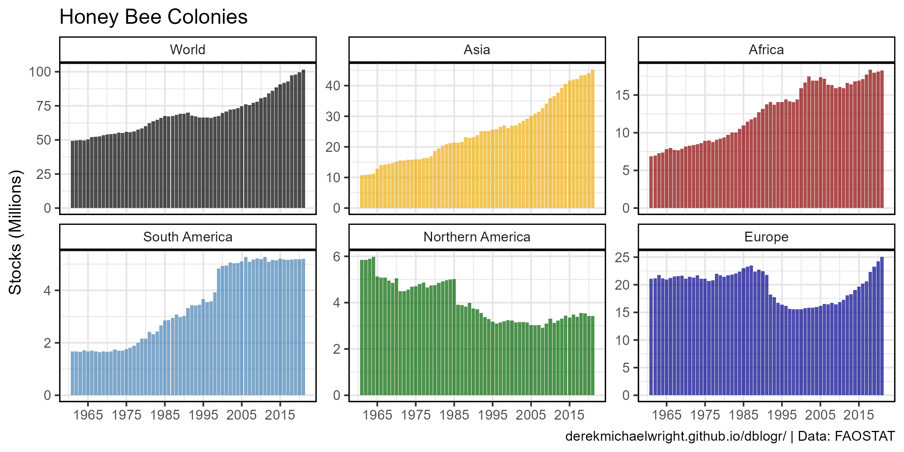
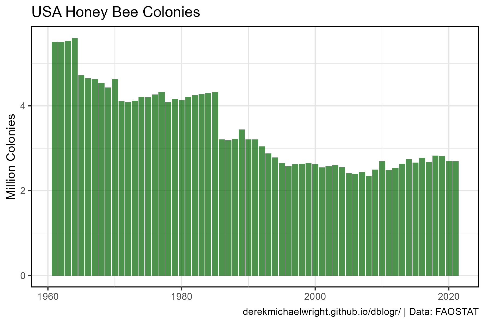
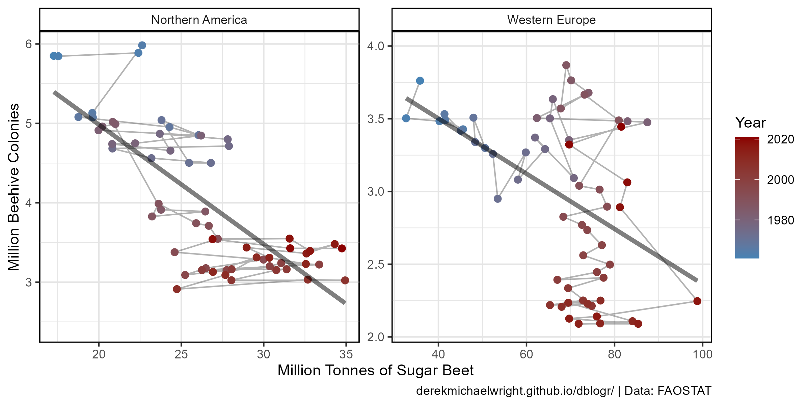

```{r setup, include = FALSE}
knitr::opts_chunk$set(echo = T, message = F, warning = F)
```

---

# Data

`r shiny::icon("globe")` http://www.fao.org/faostat/en/#data/QA

`r shiny::icon("save")` [agData_FAO_Livestock.csv.gz](https://github.com/derekmichaelwright/agData/raw/master/Data/agData_FAO_Livestock.csv.gz)

```{r class.source = 'fold-show'}
# devtools::install_github("derekmichaelwright/agData")
library(agData)
```

---

# Prepare Data

```{r}
# Prep data
myCaption <- "derekmichaelwright.github.io/dblogr/ | Data: FAOSTAT"
#
dd <- agData_FAO_Livestock %>% 
  filter(Animal == "Beehives") %>%
  mutate(Era = ifelse(Year >= 1994, "Post-NeoNic", "Pre-NeoNic"),
         Era = factor(Era, levels = c("Pre-NeoNic", "Post-NeoNic")))
```

---

# Global Colonies


```{r}
# Prep data
xx <- dd %>% filter(Area == "World")
# Plot
mp <- ggplot(data = xx, aes(x = Year, y = Value / 1000000)) + 
  geom_line(size = 1.75, alpha = 0.7, color = "darkgreen") +
  scale_x_continuous(breaks = seq(1960, 2020, by = 5)) + 
  theme_agData() +
  labs(title = "Global Honey Bee Colonies", x = NULL,
       y = "Stocks (Millions)", caption = myCaption)
ggsave("honeybee_01.png", mp, width = 6, height = 4)
```

---

# Regions



```{r}
# Prep data
myAreas <- c("World", "Asia", "Africa", "South America", 
             "Northern America", "Europe")
myColors <- c("black", "darkgoldenrod2", "darkred", "steelblue", 
              "darkgreen", "darkblue")
xx <- dd %>% filter(Area %in% myAreas) %>% 
  mutate(Area = factor(Area, levels = myAreas))
# Plot
mp <- ggplot(xx, aes(x = Year, y = Value / 1000000)) + 
  geom_line(aes(color = Area), size = 1.25, alpha = 0.7) +
  facet_wrap(Area ~ ., scales = "free_y", ncol = 2) +
  scale_x_continuous(breaks = seq(1965, 2015, by = 10)) + 
  scale_color_manual(values = myColors) +
  theme_agData(legend.position = "none") +
  labs(title = "Honey Bee Colonies", x = NULL,
       y = "Stocks (Millions)", caption = myCaption)
ggsave("honeybee_02.png", mp, width = 6, height = 6)
```

```{r echo = F}
ggsave("featured.png", mp, width = 6, height = 6)
```

---

# Neo-Nics



```{r}
# Plot
mp <- ggplot(xx, aes(x = Year, y = Value / 1000000)) + 
  geom_line(aes(color = Era), size = 1.25, alpha = 0.7) +
  facet_wrap(Area ~ ., scales = "free_y", ncol = 2) + 
  theme_agData(legend.position = "bottom") +
  scale_color_manual(values = c("darkgoldenrod2", "darkgreen")) +
  scale_x_continuous(breaks = seq(1965, 2015, by = 10)) + 
  labs(title = "Honey Bee Colonies", x = NULL,
       y = "Stocks (Millions)", caption = myCaption)
ggsave("honeybee_03.png", mp, width = 6, height = 6)
```

---

# Honeybees vs. Sugarbeet



```{r}
# Prep data
x1 <- dd %>% rename(Beehives=Value)
x2 <- agData_FAO_Crops %>% 
  filter(Crop == "Sugar beet", Measurement == "Production") %>%
  rename(Sugar.beet=Value)
xx <- left_join(x1, x2, by = c("Area","Year")) %>%
  filter(Area %in% c("Northern America", "Western Europe"))
# Plot
mp <- ggplot(xx, aes(x = Sugar.beet / 1000000, y = Beehives / 1000000)) +
  geom_path(alpha = 0.3) +
  geom_point(aes(color = Year), size = 2) +
  stat_smooth(geom = "line", method = "lm", size = 1.5, alpha = 0.5) +
  scale_color_gradient(low = "steelblue", high = "darkred") +
  facet_wrap(Area ~ ., scales = "free") +
  theme_agData() +
  labs(y = "Million Beehive Colonies", 
       x = "Million Tonnes of Sugar Beet",
       caption = myCaption)
ggsave("honeybee_04.png", mp, width = 8, height = 4)
```

---
