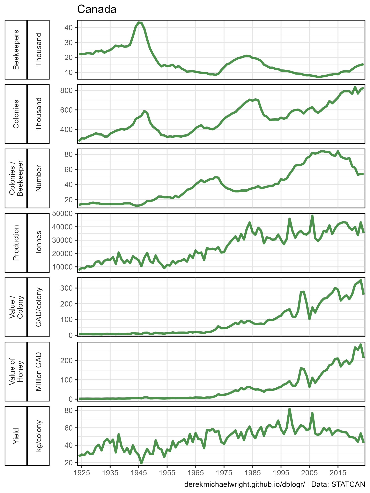
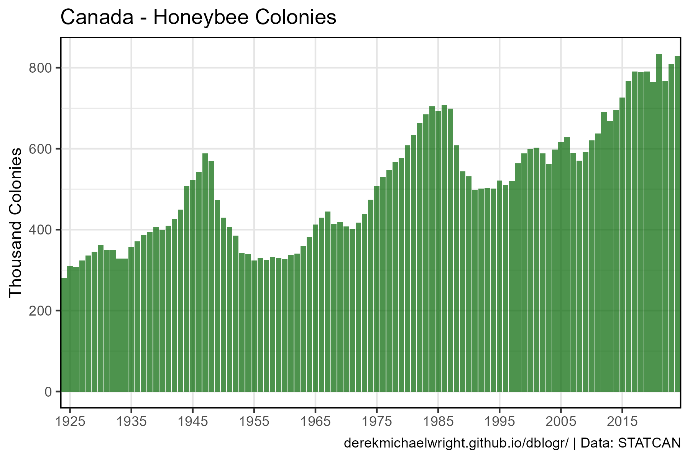
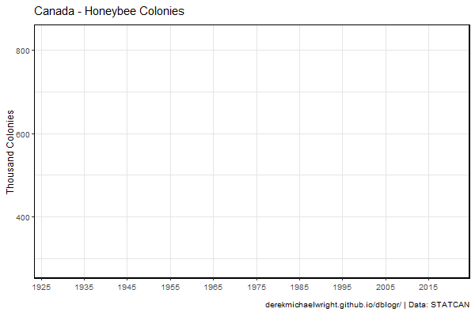
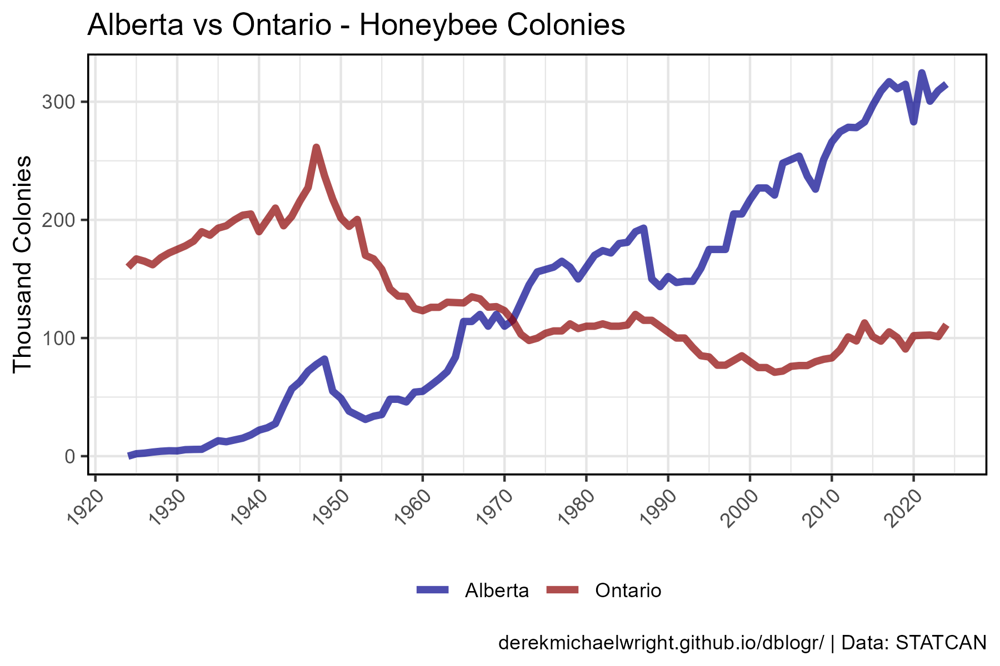
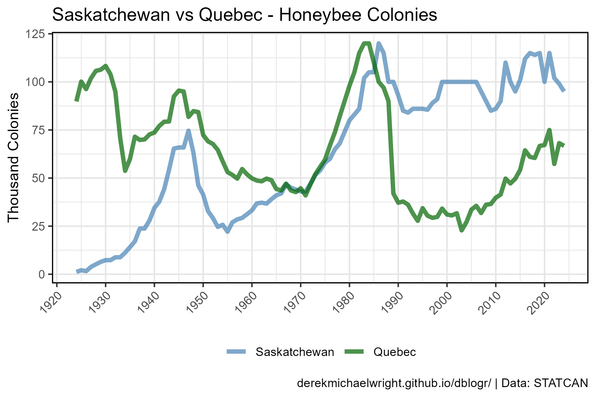
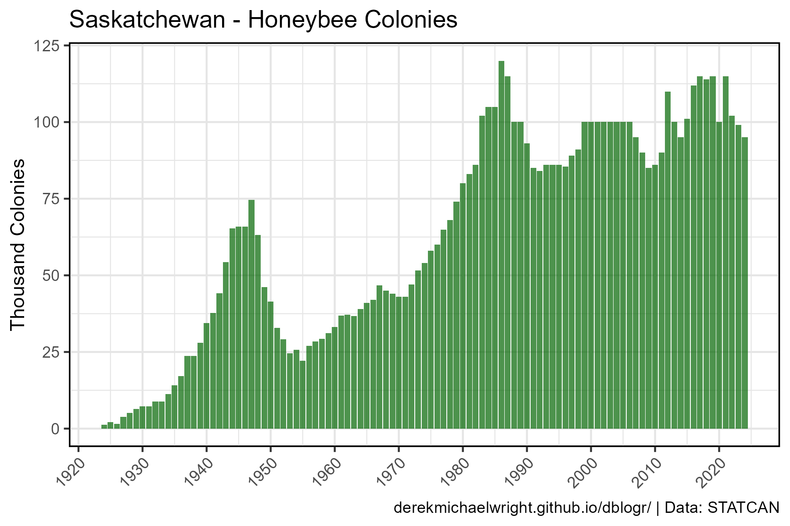

```{r setup, include = FALSE}
knitr::opts_chunk$set(echo = T, message = F, warning = F)
```

---

# Data

- `r shiny::icon("globe")` https://www150.statcan.gc.ca/t1/tbl1/en/cv.action?pid=3210035301
- `r shiny::icon("save")` [agData_STATCAN_Beehives.csv.gz](https://github.com/derekmichaelwright/agData/raw/master/Data/agData_STATCAN_Beehives.csv.gz)

---

# Prepare Data

```{r class.source = 'fold-show'}
# devtools::install_github("derekmichaelwright/agData")
library(agData)
library(gganimate)
```

```{r}
## Prep data
myCaption <- "www.dblogr.com/ or derekmichaelwright.github.io/dblogr/ | Data: STATCAN"
#
dd <- agData_STATCAN_Beehives
```

# All Honeybee Data



```{r}
# Prep data
xx <- dd %>% filter(Area == "Canada", Measurement != "Value of honey and wax")
# Plot
mp <- ggplot(xx, aes(x = Year, y = Value)) + 
  geom_line(size = 1.25, color = "darkgreen", alpha = 0.7) + 
  facet_grid(Measurement + Unit ~ ., scales = "free", switch = "y",
             labeller = label_wrap_gen(width = 14, multi_line = TRUE)) +
  scale_x_continuous(breaks = seq(1925, 2020, 10), minor_breaks = NULL) + 
  coord_cartesian(xlim = c(min(xx$Year)+4, max(xx$Year)-4)) +
  theme_agData(strip.placement = "outside", legend.position = "bottom") + 
  labs(title = "Canada", y = NULL, x = NULL, caption = myCaption)
ggsave("honeybee_canada_01.png", mp, width = 6, height = 8)
```

---

# Colonies



```{r}
# Prep data
xx <- dd %>% filter(Area == "Canada", Measurement == "Colonies")
# Plot
mp <- ggplot(xx, aes(x = Year, y = Value)) + 
  geom_col(fill = "darkgreen", alpha = 0.7) + 
  scale_x_continuous(breaks = seq(1925, 2020, 10), minor_breaks = NULL) + 
  coord_cartesian(xlim = c(min(xx$Year)+4, max(xx$Year)-4)) +
  theme_agData(strip.placement = "outside", legend.position = "none") + 
  labs(title = "Canada - Honeybee Colonies", x = NULL,
       y = "Thousand Colonies", caption = myCaption)
ggsave("honeybee_canada_02.png", mp, width = 6, height = 4)
```

---

## Animation



```{r}
# Plot
mp <- ggplot(xx, aes(x = Year, y = Value)) + 
  geom_line(color = "darkgreen", size = 1.5, alpha = 0.7) + 
  scale_x_continuous(breaks = seq(1925, 2020, 10), minor_breaks = NULL) + 
  coord_cartesian(xlim = c(min(xx$Year)+4, max(xx$Year)-4)) +
  theme_agData(strip.placement = "outside", legend.position = "none") + 
  labs(title = "Canada - Honeybee Colonies", x = NULL,
       y = "Thousand Colonies", caption = myCaption) + 
  transition_reveal(Year) 
anim_save("honeybee_canada_gif_01.gif", mp, 
          nframes = 300, fps = 20, end_pause = 60, 
          width = 900, height = 600, res = 150)
```

---

# Provinces


```{r}
# Prep data
xx <- dd %>% filter(Measurement == "Colonies")
# Plot
mp <- ggplot(xx, aes(x = Year, y = Value, fill = Area)) +
  geom_col(alpha = 0.7) +
  facet_wrap(Area ~ ., scales= "free_y", ncol = 5) +
  scale_fill_manual(values = agData_Colors) +
  scale_x_continuous(breaks = seq(1920, 2020, by = 20)) +
  theme_agData(legend.position = "none",
               axis.text.x = element_text(angle = 45, hjust = 1)) +
  labs(title = "Canada - Honeybee Colonies", x = NULL,
       y = "Thousand Colonies", caption = myCaption)
ggsave("honeybee_canada_03.png", mp, width = 10, height = 4)
```

```{r echo = F}
ggsave("featured.png", mp, width = 10, height = 4)
```

---

# Canada & Ontario

# Alberta vs. Ontario


```{r}
# Prep data
xx <- dd %>% 
  filter(Area %in% c("Canada", "Ontario"), Measurement == "Colonies")
# Plot
mp <- ggplot(xx, aes(x = Year, y = Value, fill = Area)) +
  geom_col(alpha = 0.7) +
  facet_wrap(Area ~ ., ncol = 2, scales = "free_y") +
  scale_fill_manual(name = NULL, values = c("darkred", "darkblue")) +
  scale_x_continuous(breaks = seq(1920, 2020, by = 10)) +
  theme_agData(legend.position = "none",
               axis.text.x = element_text(angle = 45, hjust = 1)) +
  labs(title = "Canada vs Ontario - Honeybee Colonies", x = NULL,
       y = "Thousand Colonies", caption = myCaption)
ggsave("honeybee_canada_04.png", mp, width = 6, height = 4)
```

# Alberta vs. Ontario



```{r}
# Prep data
xx <- dd %>% 
  filter(Area %in% c("Alberta", "Ontario"), Measurement == "Colonies")
# Plot
mp <- ggplot(xx, aes(x = Year, y = Value, color = Area)) +
  geom_line(size = 1.5, alpha = 0.7) +
  scale_color_manual(name = NULL, values = c("darkblue", "darkred")) +
  scale_x_continuous(breaks = seq(1920, 2020, by = 10)) +
  theme_agData(legend.position = "bottom",
               axis.text.x = element_text(angle = 45, hjust = 1)) +
  labs(title = "Alberta vs Ontario - Honeybee Colonies", x = NULL,
       y = "Thousand Colonies", caption = myCaption)
ggsave("honeybee_canada_05.png", mp, width = 6, height = 4)
```

---

# Saskatchewan vs. Quebec



```{r}
# Prep data
xx <- dd %>% filter(Area %in% c("Saskatchewan", "Quebec"), 
                    Measurement == "Colonies")
# Plot
mp <- ggplot(xx, aes(x = Year, y = Value, color = Area)) +
  geom_line(size = 1.5, alpha = 0.7) +
  scale_color_manual(name = NULL, values = c("steelblue", "darkgreen")) +
  scale_x_continuous(breaks = seq(1920, 2020, by = 10)) +
  theme_agData(legend.position = "bottom",
               axis.text.x = element_text(angle = 45, hjust = 1)) +
  labs(title = "Saskatchewan vs Quebec - Honeybee Colonies", 
       y = "Thousand Colonies", x = NULL, caption = myCaption)
ggsave("honeybee_canada_06.png", mp, width = 6, height = 4)
```

---

# Saskatchewan



```{r}
# Prep data
xx <- dd %>% filter(Area == "Saskatchewan", Measurement == "Colonies")
# Plot
mp <- ggplot(xx, aes(x = Year, y = Value)) +
  geom_col(fill = "darkgreen", alpha = 0.7) +
  scale_x_continuous(breaks = seq(1920, 2020, by = 10)) +
  theme_agData(legend.position = "bottom",
               axis.text.x = element_text(angle = 45, hjust = 1)) +
  labs(title = "Saskatchewan - Honeybee Colonies", x = NULL,
       y = "Thousand Colonies", caption = myCaption)
ggsave("honeybee_canada_07.png", mp, width = 6, height = 4)
```

---
