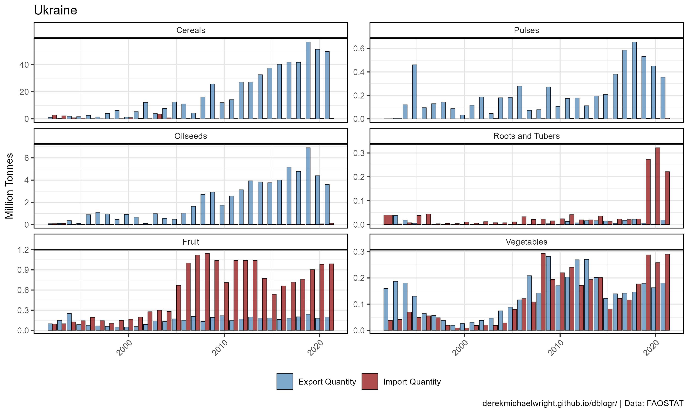
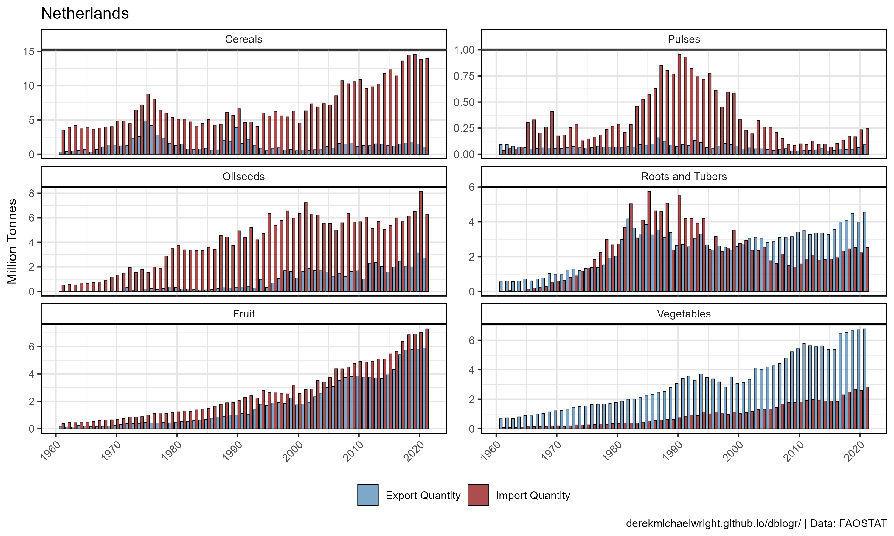
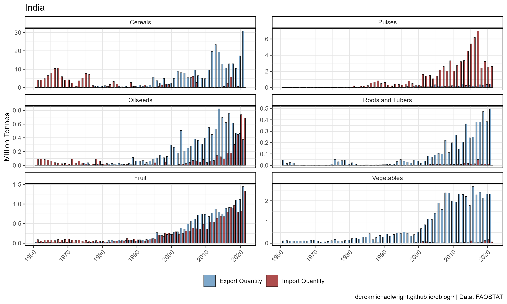
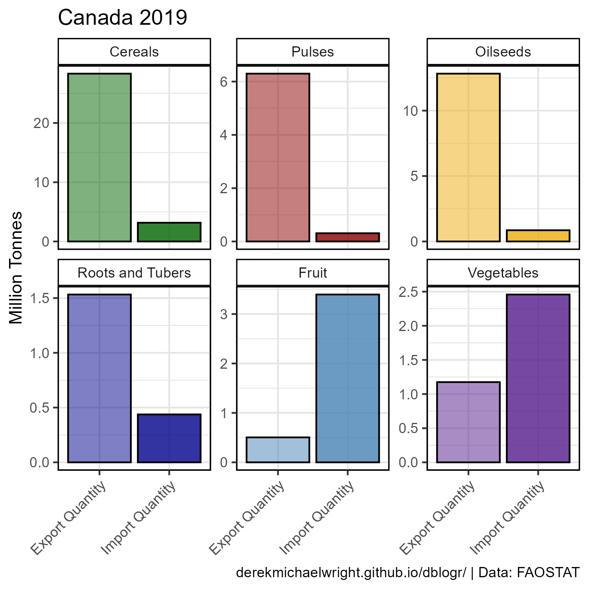
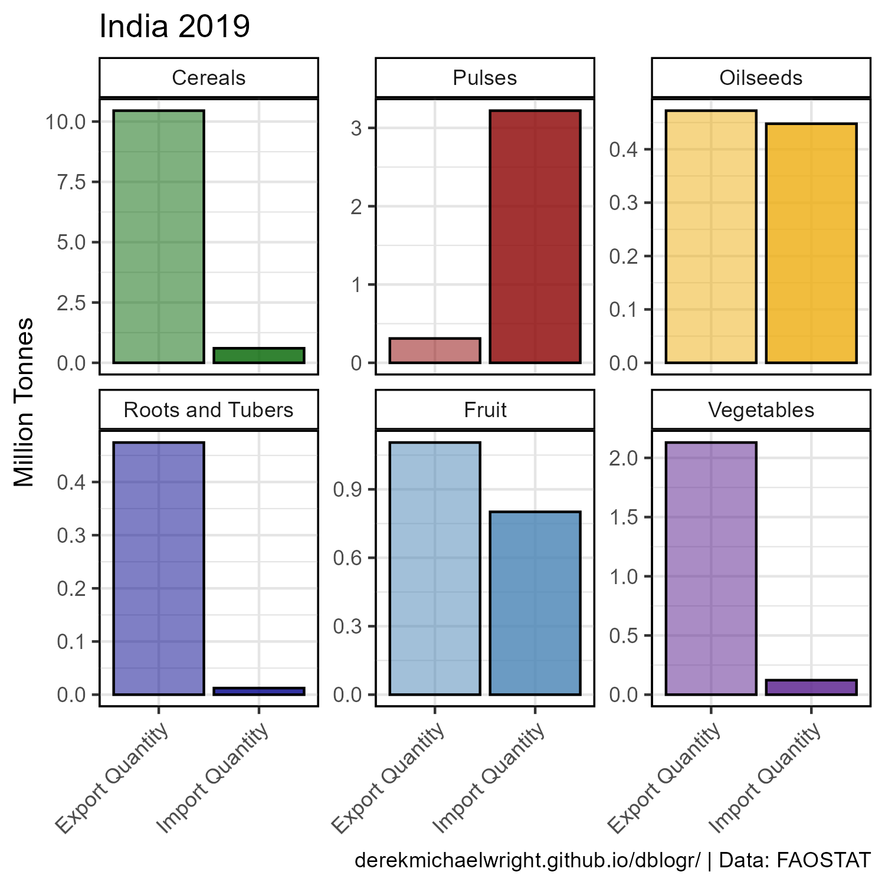

```{r setup, include = FALSE}
knitr::opts_chunk$set(echo = T, message = F, warning = F)
```

---

# Data

> - `r shiny::icon("globe")` [http://www.fao.org/faostat/en/#data/TP](http://www.fao.org/faostat/en/#data/TP){target="_blank"}
> - `r shiny::icon("save")` [agData_FAO_Trade.csv.gz](https://github.com/derekmichaelwright/agData/raw/master/Data/agData_FAO_Trade.csv.gz)

--- 

# Prepare Data {.tabset .tabset-pills}

```{r class.source = 'fold-show'}
# devtools::install_github("derekmichaelwright/agData")
library(agData)
library(gganimate)
#
myCaption <- "www.dblogr.com/ or derekmichaelwright.github.io/dblogr/ | Data: FAOSTAT"
```


## Plot by Area Function

```{r class.source = 'fold-show'}
xx <- agData_FAO_Trade_Quantity %>%
  filter(Area == "Canada")
# Create plotting functions
ggIEA <- function(myArea = "Canada") {
  # Prep data
  myItems <- c("Cereals", "Oilseeds", "Pulses", "Fruit", "Vegetables")
  myColors <- c("steelblue", "darkred")
  xx <- agData_FAO_Trade_Quantity %>%
    filter(Area == myArea, Item %in% myItems) %>%
    mutate(Measurment = gsub(" Quantity", "", Measurement),
           Item = factor(Item, levels = myItems))
  # Plot
  ggplot(xx, aes(x = Year, y = Value / 1000000, fill = Measurement, 
                 group = Measurement)) +
    geom_bar(stat = "identity", position = "dodge", 
             color = "black", lwd = 0.2, alpha = 0.7) +
    facet_grid(Item ~ ., scales = "free_y") +
    scale_fill_manual(name = NULL, values = myColors) +
    scale_x_continuous(breaks = seq(1960, 2020, by = 10)) +
    theme_agData(legend.position = "bottom", 
                 axis.text.x = element_text(angle = 45, hjust = 1)) +
    labs(title = myArea, y = "Million Tonnes", 
         x = NULL, caption = myCaption)
}
```

## Plot by Year Function

```{r class.source = 'fold-show'}
#
ggIEAY <- function(myArea = "Canada", myYear = 2017) {
  # Prep data
  myItems <- c("Cereals", "Oilseeds", "Pulses", "Fruit", "Vegetables")
  myColors <- c("darkgreen", "darkgoldenrod2", "darkred", "steelblue", "purple4")
  xx <- agData_FAO_Trade_Quantity %>%
    filter(Area == myArea, Year == myYear, Item %in% myItems) %>%
    mutate(Measurment = gsub(" Quantity", "", Measurement),
           Item = factor(Item, levels = myItems))
  # Plot
  ggplot(xx, aes(x = Measurement, y = Value / 1000000, 
                 fill = Item, alpha = Measurement)) +
    geom_bar(stat = "identity", color = "black") +
    facet_wrap(. ~ Item, ncol = 5, scale = "free_y") +
    scale_fill_manual(values = myColors) +
    scale_alpha_manual(values = c(0.5,0.8)) +
    theme_agData(legend.position = "none", 
                 axis.text.x = element_text(angle = 45, hjust = 1)) +
    labs(title = paste(myArea, myYear), y = "Million Tonnes", 
         x = NULL, caption = myCaption)
}
```

## Animation function

```{r class.source = 'fold-show'}
ggIEAA <- function(myArea = "Canada") {
  # Prep data
  myItems <- c("Cereals", "Oilseeds", "Pulses", "Fruit", "Vegetables")
  myColors <- c("darkgreen", "darkgoldenrod2", "darkred", "steelblue", "purple4")
  xx <- agData_FAO_Trade_Quantity %>%
    filter(Area == myArea, Item %in% myItems) %>%
    mutate(Item = factor(Item, levels = myItems))
  # Plot
  ggplot(xx, aes(x = Item, y = Value / 1000000000, fill = Item)) +
    geom_bar(stat = "identity", color = "black", alpha = 0.7) +
    facet_grid(. ~ Measurement) +
    scale_fill_manual(values = myColors) +
    theme_agData(legend.position = "none", 
                 axis.text.x = element_text(angle = 45, hjust = 1)) +
    labs(title = "Canada - {round(frame_time)}", y = "Billion Tonnes", 
         x = NULL, caption = myCaption) +
    transition_time(Year)
}
```

---

# Import/Export {.tabset .tabset-pills}

## Canada


```{r}
mp <- ggIEA(myArea = "Canada")
ggsave("import_export_1_canada.png", mp, width = 6, height = 7)
```

```{r echo = F}
ggsave("featured.png", mp, width = 6, height = 7)
```

---

## USA


```{r}
mp <- ggIEA(myArea = "USA")
ggsave("import_export_1_usa.png", mp, width = 6, height = 7)
```

---

## Russia


```{r}
mp <- ggIEA(myArea = "Russia")
ggsave("import_export_1_russia.png", mp, width = 6, height = 7)
```

---

## Ukraine



```{r}
mp <- ggIEA(myArea = "Ukraine")
ggsave("import_export_1_ukraine.png", mp, width = 6, height = 7)
```

---

## Germany


```{r}
mp <- ggIEA(myArea = "Germany")
ggsave("import_export_1_germany.png", mp, width = 6, height = 7)
```

---

## Netherlands



```{r}
mp <- ggIEA(myArea = "Netherlands")
ggsave("import_export_1_netherlands.png", mp, width = 6, height = 7)
```

---

## India



```{r}
mp <- ggIEA(myArea = "India")
ggsave("import_export_1_india.png", mp, width = 6, height = 7)
```

---

# 2019 {.tabset .tabset-pills}

## Canada



```{r}
mp <- ggIEAY(myArea = "Canada", myYear = 2019)
ggsave("import_export_2_canada.png", mp, width = 6, height = 4)
```

---

## USA


```{r}
mp <- ggIEAY(myArea = "USA", myYear = 2019)
ggsave("import_export_2_usa.png", mp, width = 6, height = 3.75)
```

---

## Russia


```{r}
mp <- ggIEAY(myArea = "Russia", myYear = 2019)
ggsave("import_export_2_russia.png", mp, width = 6, height = 3.75)
```

---

## Ukraine


```{r}
mp <- ggIEAY(myArea = "Ukraine", myYear = 2019)
ggsave("import_export_2_ukraine.png", mp, width = 6, height = 3.75)
```

---

## Germany


```{r}
mp <- ggIEAY(myArea = "Germany", myYear = 2019)
ggsave("import_export_2_germany.png", mp, width = 6, height = 3.75)
```

---

## India



```{r}
mp <- ggIEAY(myArea = "India", myYear = 2019)
ggsave("import_export_2_india.png", mp, width = 6, height = 3.75)
```

---

# Animations {.tabset .tabset-pills}

## Canada


```{r}
mp <- ggIEAA(myArea = "Canada")
anim_save("import_export_gif_canada.gif", mp,
          nframes = 300, fps = 20, end_pause = 80, 
          width = 600, height = 400, res = 80, units = "px")
```

---

## Canada


```{r}
mp <- ggIEAA(myArea = "India")
anim_save("import_export_gif_india.gif", mp,
          nframes = 300, fps = 20, end_pause = 80, 
          width = 600, height = 400, res = 80, units = "px")
```

---
