```{r setup, include = FALSE}
knitr::opts_chunk$set(echo = T, message = F, warning = F)
```

---

# Data

> - `r shiny::icon("globe")` [http://www.fao.org/faostat/en/#data/TP](http://www.fao.org/faostat/en/#data/TP){target="_blank"}
> - `r shiny::icon("save")` [agData_FAO_Trade.csv.gz](https://github.com/derekmichaelwright/agData/raw/master/Data/agData_FAO_Trade.csv.gz)

---

# Prepare Data {.tabset .tabset-pills}

```{r class.source = 'fold-show'}
# devtools::install_github("derekmichaelwright/agData")
library(agData)
#
myCaption <- "derekmichaelwright.github.io/dblogr/ | Data: FAOSTAT"
```

---

# Import/Export {.tabset .tabset-pills}

## Ploting function

```{r class.source = 'fold-show'}
xx <- agData_FAO_Trade_Quantity %>%
  filter(Area == "Canada")
# Create plotting functions
ggIEA <- function(myArea = "Canada") {
  # Prep data
  myItems <- c("Cereals", "Pulses", "Oilseeds", "Roots and Tubers", "Fruit", "Vegetables")
  myColors <- c("steelblue", "darkred")
  xx <- agData_FAO_Trade_Quantity %>%
    filter(Area == myArea, Item %in% myItems) %>%
    mutate(Measurment = gsub(" Quantity", "", Measurement),
           Item = factor(Item, levels = myItems))
  # Plot
  ggplot(xx, aes(x = Year, y = Value / 1000000, fill = Measurement, 
                 group = Measurement)) +
    geom_bar(stat = "identity", position = "dodge", 
             color = "black", lwd = 0.2, alpha = 0.7) +
    facet_wrap(Item ~ ., scales = "free_y", ncol = 2) +
    scale_fill_manual(name = NULL, values = myColors) +
    scale_x_continuous(breaks = seq(1960, 2020, by = 10)) +
    theme_agData(legend.position = "bottom", 
                 axis.text.x = element_text(angle = 45, hjust = 1)) +
    labs(title = myArea, y = "Million Tonnes", 
         x = NULL, caption = myCaption)
}
```

---

## Canada {.active}

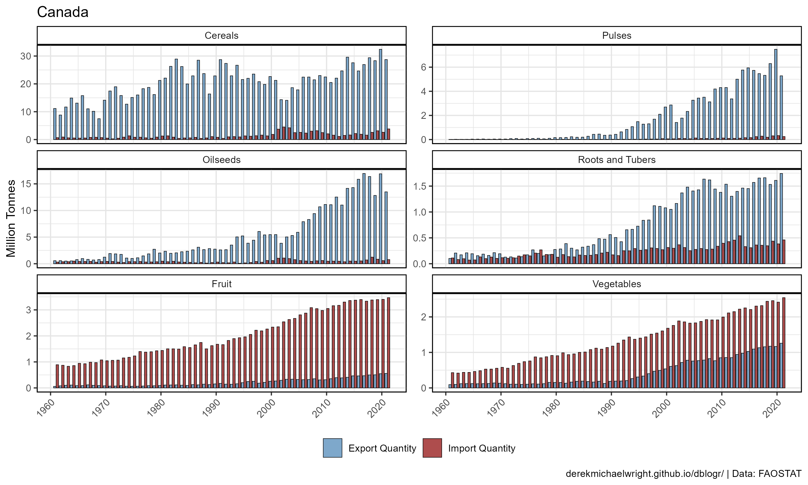

```{r}
mp <- ggIEA(myArea = "Canada")
ggsave("import_export_1_canada.png", mp, width = 10, height = 6)
```

```{r echo = F}
ggsave("featured.png", mp, width = 10, height = 6)
```

---

## USA

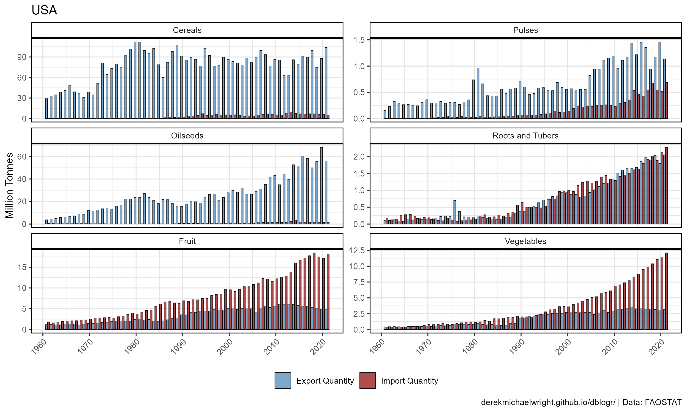

```{r}
mp <- ggIEA(myArea = "USA")
ggsave("import_export_1_usa.png", mp, width = 10, height = 6)
```

---

## Mexico

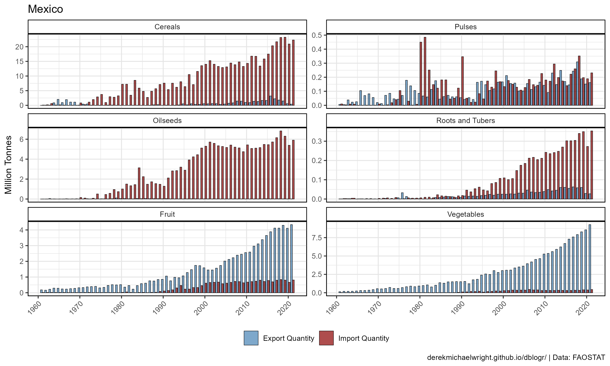

```{r}
mp <- ggIEA(myArea = "Mexico")
ggsave("import_export_1_mexico.png", mp, width = 10, height = 6)
```

---

## Russia


```{r}
mp <- ggIEA(myArea = "Russia")
ggsave("import_export_1_russia.png", mp, width = 10, height = 6)
```

---

## Ukraine


```{r}
mp <- ggIEA(myArea = "Ukraine")
ggsave("import_export_1_ukraine.png", mp, width = 10, height = 6)
```

---

## Germany

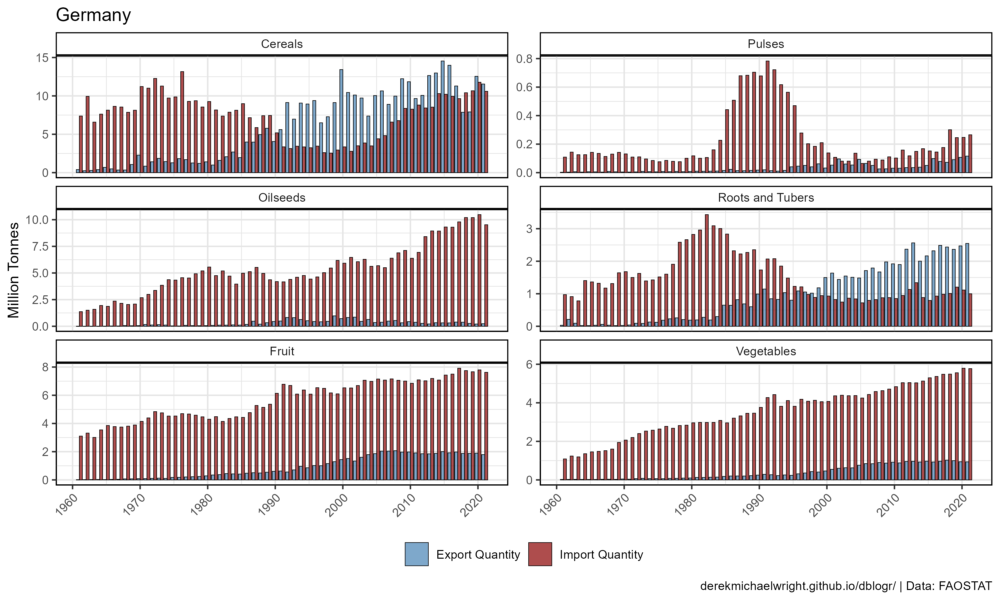

```{r}
mp <- ggIEA(myArea = "Germany")
ggsave("import_export_1_germany.png", mp, width = 10, height = 6)
```

---

## Netherlands


```{r}
mp <- ggIEA(myArea = "Netherlands")
ggsave("import_export_1_netherlands.png", mp, width = 10, height = 6)
```

---

## India


```{r}
mp <- ggIEA(myArea = "India")
ggsave("import_export_1_india.png", mp, width = 10, height = 6)
```

---

## Africa

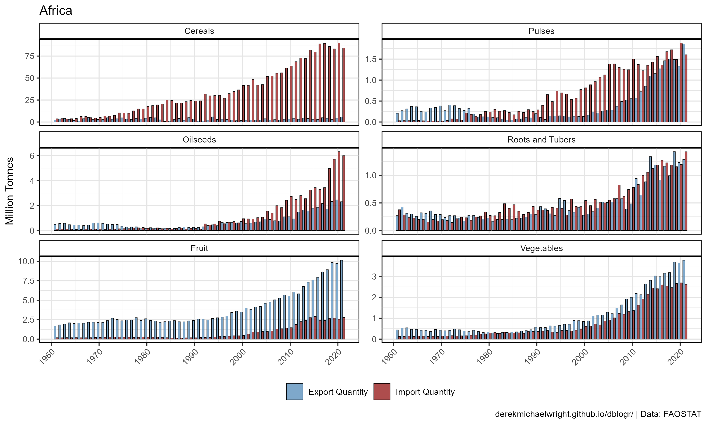

```{r}
mp <- ggIEA(myArea = "Africa")
ggsave("import_export_1_africa.png", mp, width = 10, height = 6)
```

---

## Europe


```{r}
mp <- ggIEA(myArea = "Europe")
ggsave("import_export_1_europe.png", mp, width = 10, height = 6)
```

---

## Asia

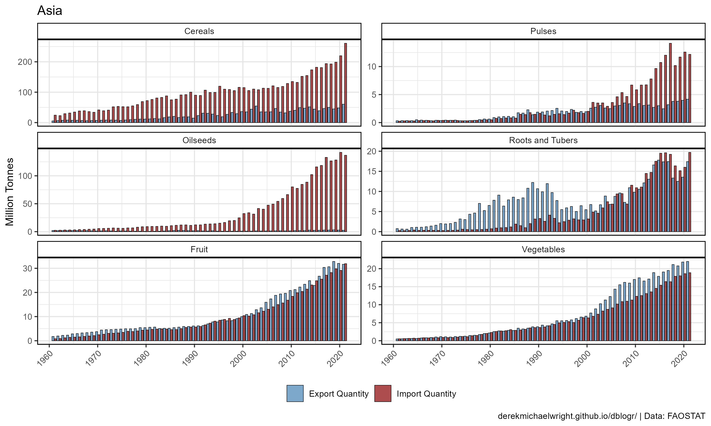

```{r}
mp <- ggIEA(myArea = "Asia")
ggsave("import_export_1_asia.png", mp, width = 10, height = 6)
```

---

## Northern America


```{r}
mp <- ggIEA(myArea = "Northern America")
ggsave("import_export_1_northernamerica.png", mp, width = 10, height = 6)
```

---

## Southern America

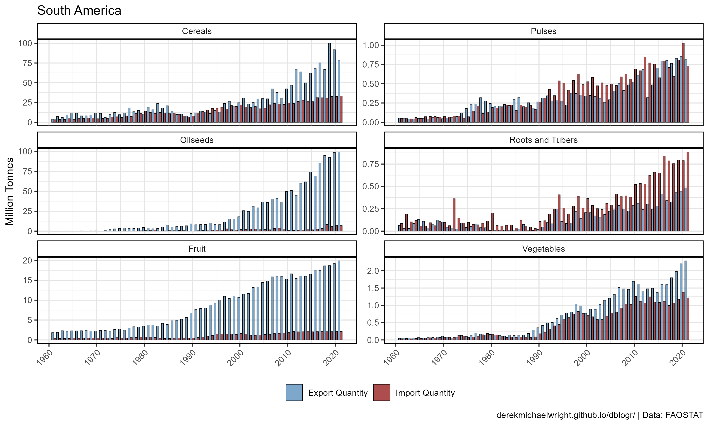

```{r}
mp <- ggIEA(myArea = "South America")
ggsave("import_export_1_southamerica.png", mp, width = 10, height = 6)
```

---

# 2019 {.tabset .tabset-pills}

## Ploting function

```{r class.source = 'fold-show'}
#
ggIEAY <- function(myArea = "Canada", myYear = 2017) {
  # Prep data
  myItems <- c("Cereals", "Pulses", "Oilseeds", "Roots and Tubers", "Fruit", "Vegetables")
  myColors <- c("darkgreen", "darkred", "darkgoldenrod2", "darkblue", "steelblue", "purple4")
  xx <- agData_FAO_Trade_Quantity %>%
    filter(Area == myArea, Year == myYear, Item %in% myItems) %>%
    mutate(Measurment = gsub(" Quantity", "", Measurement),
           Item = factor(Item, levels = myItems))
  # Plot
  ggplot(xx, aes(x = Measurement, y = Value / 1000000, 
                 fill = Item, alpha = Measurement)) +
    geom_bar(stat = "identity", color = "black") +
    facet_wrap(. ~ Item, ncol = 3, scale = "free_y") +
    scale_fill_manual(values = myColors) +
    scale_alpha_manual(values = c(0.5,0.8)) +
    theme_agData(legend.position = "none", 
                 axis.text.x = element_text(angle = 45, hjust = 1)) +
    labs(title = paste(myArea, myYear), y = "Million Tonnes", 
         x = NULL, caption = myCaption)
}
```

---

## Canada {.active}


```{r}
mp <- ggIEAY(myArea = "Canada", myYear = 2019)
ggsave("import_export_2_canada.png", mp, width = 5, height = 5)
```

---

## USA


```{r}
mp <- ggIEAY(myArea = "USA", myYear = 2019)
ggsave("import_export_2_usa.png", mp, width = 5, height = 5)
```

---

## Russia

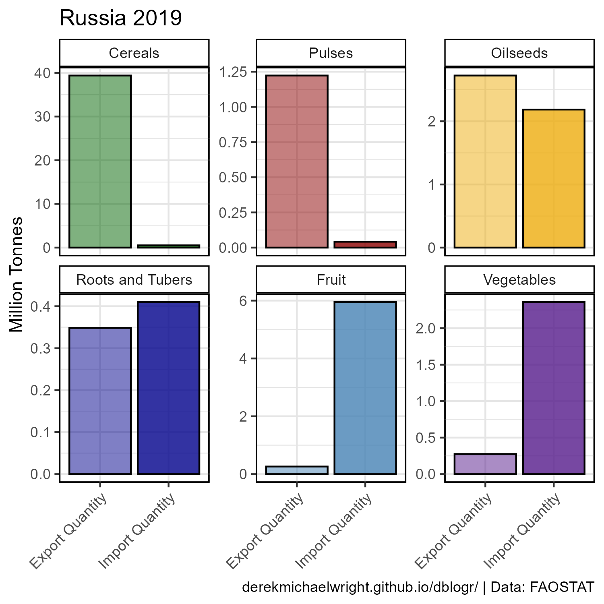

```{r}
mp <- ggIEAY(myArea = "Russia", myYear = 2019)
ggsave("import_export_2_russia.png", mp, width = 5, height = 5)
```

---

## Ukraine


```{r}
mp <- ggIEAY(myArea = "Ukraine", myYear = 2019)
ggsave("import_export_2_ukraine.png", mp, width = 5, height = 5)
```

---

## Germany

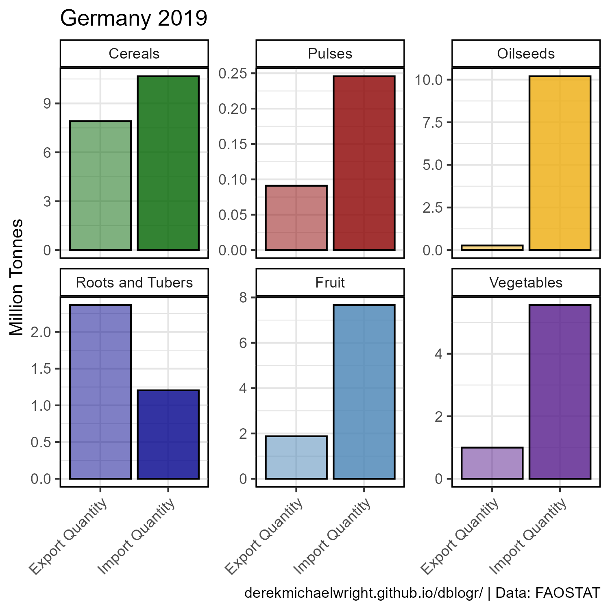

```{r}
mp <- ggIEAY(myArea = "Germany", myYear = 2019)
ggsave("import_export_2_germany.png", mp, width = 5, height = 5)
```

---

## India


```{r}
mp <- ggIEAY(myArea = "India", myYear = 2019)
ggsave("import_export_2_india.png", mp, width = 5, height = 5)
```

---

## Africa

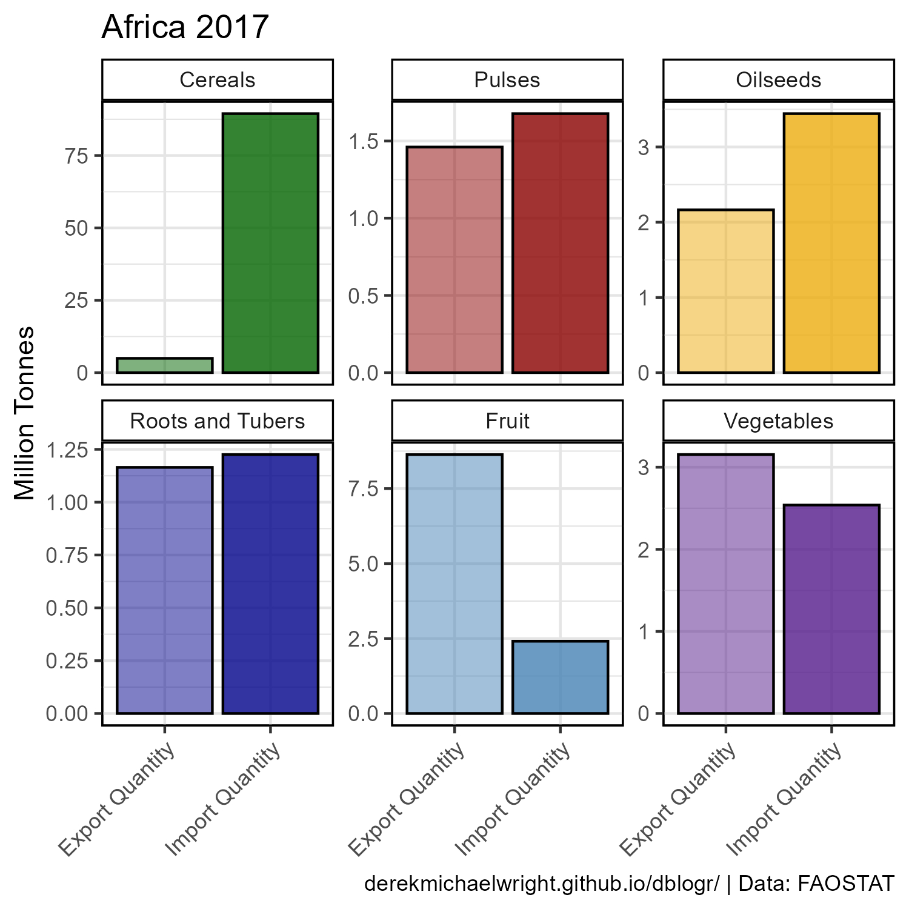

```{r}
mp <- ggIEAY(myArea = "Africa")
ggsave("import_export_2_africa.png", mp, width = 5, height = 5)
```

---

## Europe

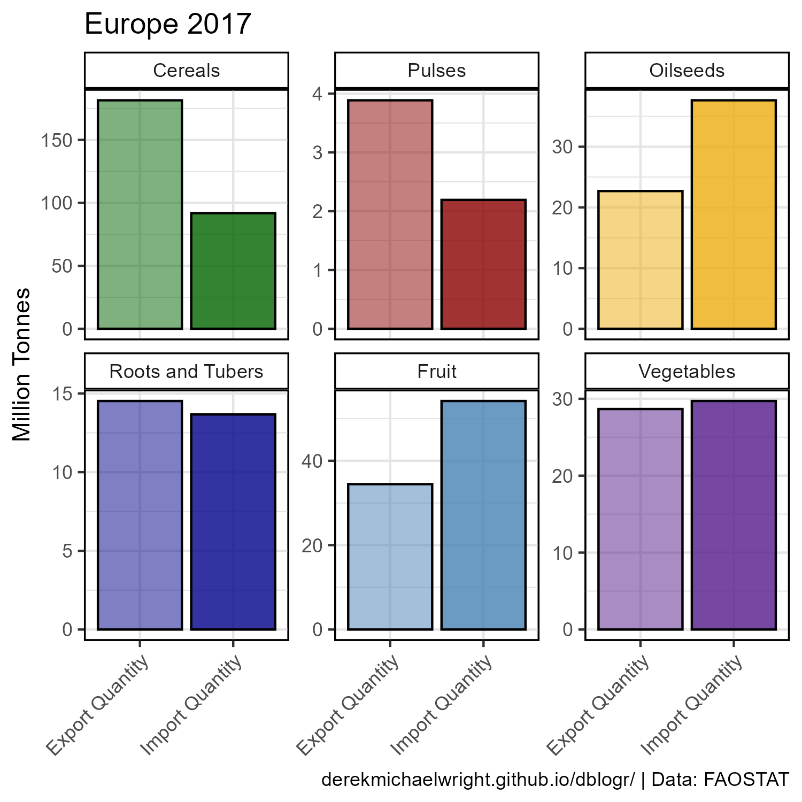

```{r}
mp <- ggIEAY(myArea = "Europe")
ggsave("import_export_2_europe.png", mp, width = 5, height = 5)
```

---

## Asia


```{r}
mp <- ggIEAY(myArea = "Asia")
ggsave("import_export_2_asia.png", mp, width = 5, height = 5)
```

---

## Northern America


```{r}
mp <- ggIEAY(myArea = "Northern America")
ggsave("import_export_2_northernamerica.png", mp, width = 5, height = 5)
```

---

## Southern America


```{r}
mp <- ggIEAY(myArea = "South America")
ggsave("import_export_2_southamerica.png", mp, width = 5, height = 5)
```

---

```{r eval = F, echo = F}
## Animation function

#```{r class.source = 'fold-show'}
ggIEAA <- function(myArea = "Canada") {
  # Prep data
  myItems <- c("Cereals", "Pulses", "Oilseeds", "Roots and Tubers", "Fruit", "Vegetables")
  myColors <- c("darkgreen", "darkred", "darkgoldenrod2", "darkblue", "steelblue", "purple4")
  xx <- agData_FAO_Trade_Quantity %>%
    filter(Area == myArea, Item %in% myItems) %>%
    mutate(Item = factor(Item, levels = myItems))
  # Plot
  ggplot(xx, aes(x = Item, y = Value / 1000000000, fill = Item)) +
    geom_bar(stat = "identity", color = "black", alpha = 0.7) +
    facet_grid(. ~ Measurement) +
    scale_fill_manual(values = myColors) +
    theme_agData(legend.position = "none", 
                 axis.text.x = element_text(angle = 45, hjust = 1)) +
    labs(title = "Canada - {round(frame_time)}", y = "Billion Tonnes", 
         x = NULL, caption = myCaption) +
    transition_time(Year)
}
#```


# Animations {.tabset .tabset-pills}

## Canada

#

#```{r}
mp <- ggIEAA(myArea = "Canada")
anim_save("import_export_gif_canada.gif", mp,
          nframes = 300, fps = 20, end_pause = 80, 
          width = 600, height = 400, res = 80, units = "px")
#```

#---

## Canada

#

#```{r}
mp <- ggIEAA(myArea = "India")
anim_save("import_export_gif_india.gif", mp,
          nframes = 300, fps = 20, end_pause = 80, 
          width = 600, height = 400, res = 80, units = "px")
#```

#---

```
