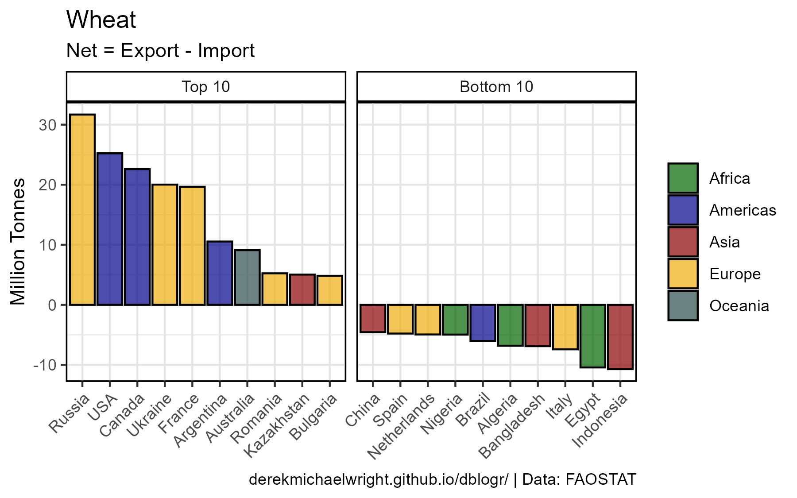
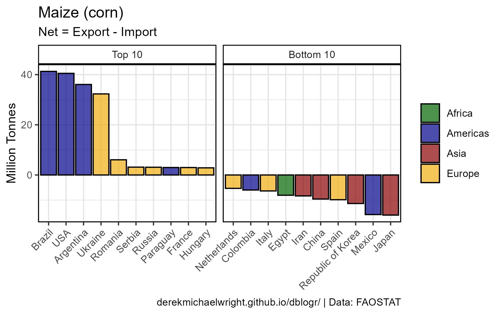
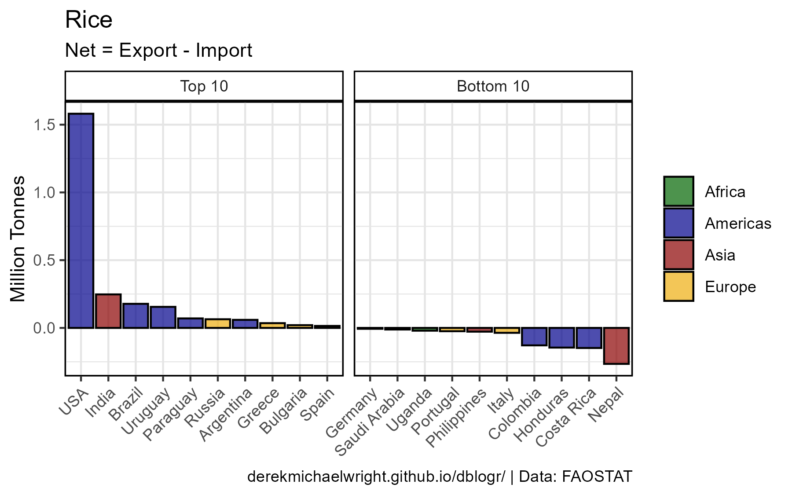
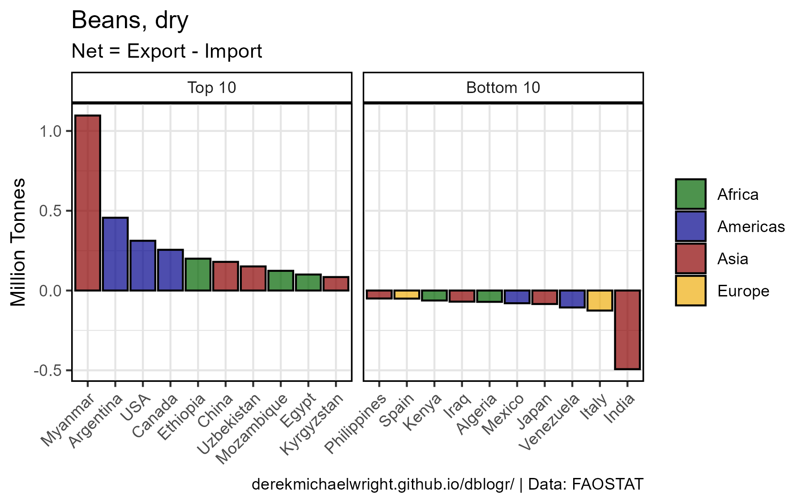
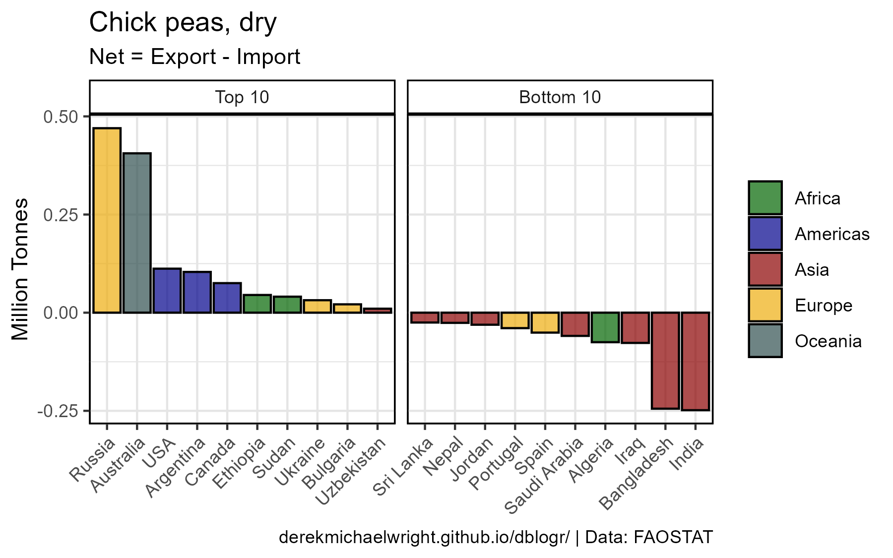
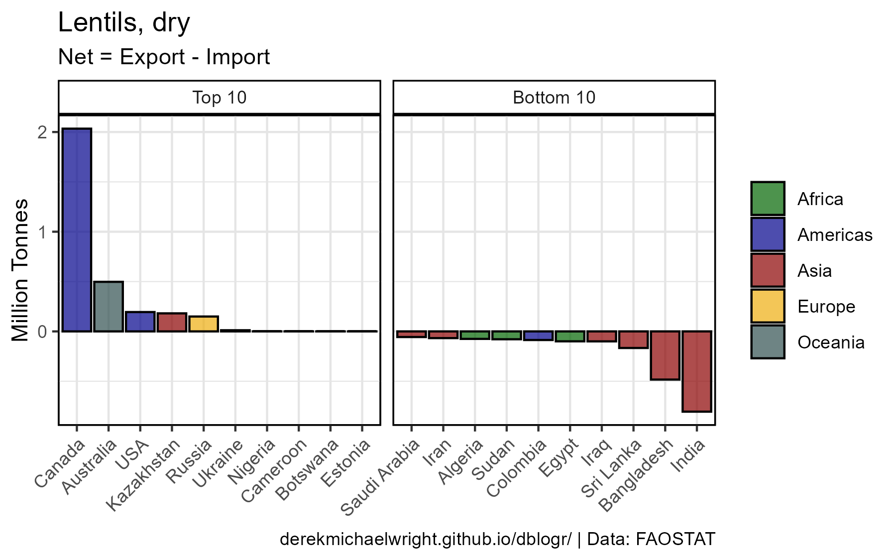
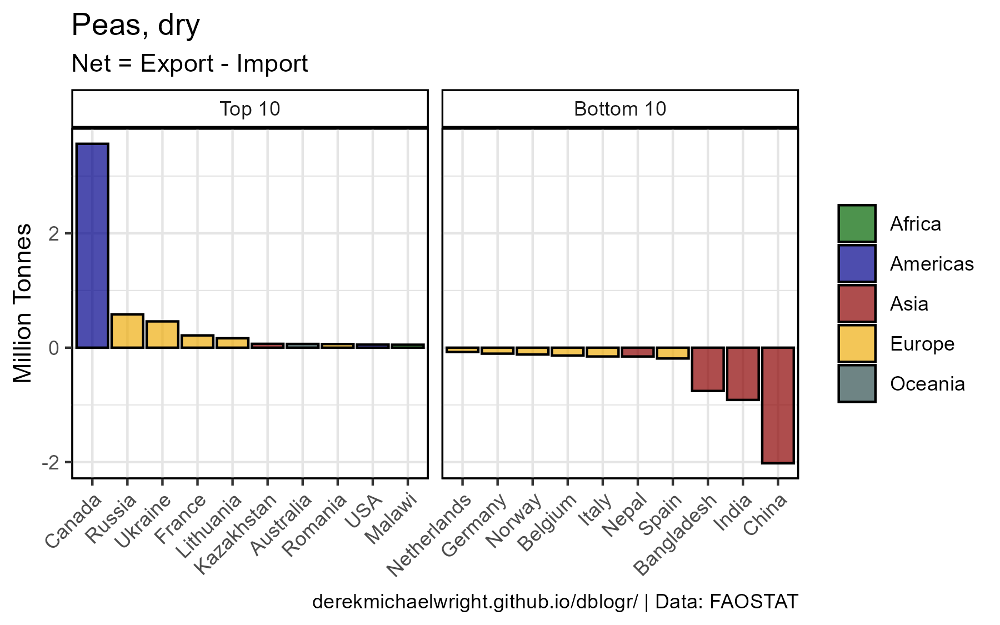

```{r setup, include = FALSE}
knitr::opts_chunk$set(echo = T, message = F, warning = F)
```

---

# Data

> - `r shiny::icon("globe")` [http://www.fao.org/faostat/en/#data/TP](http://www.fao.org/faostat/en/#data/TP){target="_blank"}
> - `r shiny::icon("save")` [agData_FAO_Trade.csv.gz](https://github.com/derekmichaelwright/agData/raw/master/Data/agData_FAO_Trade.csv.gz)

> - `r shiny::icon("save")` [agData_FAO_Country_Table.csv](https://github.com/derekmichaelwright/agData/raw/master/Data/agData_FAO_Country_Table.csv)

---

# Prepare Data {.tabset .tabset-pills}

```{r class.source = 'fold-show'}
# devtools::install_github("derekmichaelwright/agData")
library(agData)
library(gganimate)
#
myCaption <- "www.dblogr.com/ or derekmichaelwright.github.io/dblogr/ | Data: FAOSTAT"
```

---

## Plot Crop Function

```{r class.source = 'fold-show'}
# Create plotting functions
ggIEC <- function(myItem = "Wheat", myYear = 2019) {
  # Prep data
  myAreas <- select(agData_FAO_Country_Table, Area=Country, Region) %>% 
    filter(!duplicated(Area))
  myColors <- c("darkgreen", "darkblue", "darkred", 
              "darkgoldenrod2", "darkslategrey")
  xx <- agData_FAO_Trade_Quantity %>% 
    filter(Area %in% unique(agData_FAO_Country_Table$Country),
           Item == myItem, Year == myYear) %>%
    left_join(myAreas, by = "Area") %>%
    spread(Measurement, Value) %>%
    mutate(Net = `Export Quantity` - `Import Quantity`) %>%
    filter(!is.na(Net)) %>% 
    arrange(Net) %>%
    mutate(Area = factor(Area, levels = rev(unique(.$Area))))
  x1 <- top_n(xx, 10, Net) %>% 
    mutate(Label = "Top 10")
  x2 <- top_n(xx %>% mutate(Net = -Net), 10, Net) %>% 
    mutate(Label = "Bottom 10", Net = -Net)
  xx <- bind_rows(x1, x2) %>% 
    mutate(Label = factor(Label, levels = c("Top 10", "Bottom 10")))
  # Plot
  ggplot(xx, aes(x = Area, y = Net / 1000000, fill = Region)) + 
    geom_bar(stat = "identity", color = "black", alpha = 0.7) +
    facet_grid(. ~ Label, scales = "free_x") +
    scale_fill_manual(name = NULL, values = myColors) +
    theme_agData(axis.text.x = element_text(angle = 45, hjust = 1)) + 
    labs(title = myItem, subtitle = "Net = Export - Import", 
         y = "Million Tonnes", x = NULL, caption = myCaption)
}
```

```{r eval = F, echo = F}
ggIECA <- function(myItem = "Wheat") {
  # Prep data
  myColors <- c("darkgreen", "darkblue", "darkred", 
              "darkgoldenrod2", "darkslategrey")
  xx <- agData_FAO_Trade_Quantity %>% 
    region_Info() %>%
    filter(Area %in% unique(agData_FAO_Country_Table$Country),
           Item == myItem) %>%
    spread(Measurement, Value) %>%
    mutate(Net = `Export Quantity` - `Import Quantity`) %>%
    filter(!is.na(Net)) %>% 
    arrange(Net) %>%
    mutate(Area = factor(Area, levels = rev(unique(.$Area))))
  x1 <- xx %>% group_by(Year) %>% top_n(n=5, Net) %>% 
    mutate(Label = "Top 10") %>% 
    arrange(Net) %>% pull(Area) %>% as.character() %>% unique()
  x2 <- xx %>% group_by(Year) %>% top_n(n=5, -Net) %>% 
    mutate(Label = "Bottom 10") %>% 
    arrange(Net) %>% pull(Area) %>% as.character() %>% unique()
  x1 <- setdiff(x1, x2)
  xx <- xx %>% filter(Area %in% c(x1, x2)) %>% 
    mutate(Label = ifelse(Area %in% x1, "Top", "Bottom"),
           Label = factor(Label, levels = c("Top", "Bottom")))
  # Plot
  ggplot(xx, aes(x = Area, y = Net / 1000000, fill = Region)) + 
    geom_bar(stat = "identity", color = "black", alpha = 0.7) +
    facet_grid(. ~ Label, scales = "free_x") +
    scale_fill_manual(values = myColors) +
    theme_agData(axis.text.x = element_text(angle = 45, hjust = 1)) + 
    labs(title = myItem, y = "Million Tonnes", x = NULL,
         subtitle = "Export - Import {round(frame_time)}",
         caption = myCaption) +
  # gganimate specific bits
  transition_time(Year)
}
```

---

# 2019

## Wheat



```{r}
mp <- ggIEC(myItem = "Wheat", myYear = 2019)
ggsave("import_export_wheat.png", mp, width = 6, height = 3.75)
```

---

## Maize



```{r}
mp <- ggIEC(myItem = "Maize (corn)", myYear = 2019)
ggsave("import_export_maize.png", mp, width = 6, height = 3.75)
```

---

## Rice



```{r}
mp <- ggIEC(myItem = "Rice", myYear = 2019)
ggsave("import_export_rice.png", mp, width = 6, height = 3.75)
```

---

## Soybeans


```{r}
mp <- ggIEC(myItem = "Soya beans", myYear = 2019)
ggsave("import_export_soybeans.png", mp, width = 6, height = 3.75)
```

---

## Sorghum


```{r}
mp <- ggIEC(myItem = "Sorghum", myYear = 2019)
ggsave("import_export_sorghum.png", mp, width = 6, height = 3.75)
```

---

## Rapeseed


```{r}
mp <- ggIEC(myItem = "Rapeseed or canola oil, crude", myYear = 2019)
ggsave("import_export_rapeseed.png", mp, width = 6, height = 3.75)
```

---

## Beans



```{r}
mp <- ggIEC(myItem = "Beans, dry", myYear = 2019)
ggsave("import_export_beans.png", mp, width = 6, height = 3.75)
```

---

## Chickpeas



```{r}
mp <- ggIEC(myItem = "Chick peas, dry", myYear = 2019)
ggsave("import_export_chickpeas.png", mp, width = 6, height = 3.75)
```

---

## Lentils



```{r}
mp <- ggIEC(myItem = "Lentils, dry", myYear = 2019)
ggsave("import_export_lentils.png", mp, width = 6, height = 3.75)
```

```{r echo = F}
ggsave("featured.png", mp, width = 6, height = 3.75)
```

---

## Peas



```{r}
mp <- ggIEC(myItem = "Peas, dry", myYear = 2019)
ggsave("import_export_peas.png", mp, width = 6, height = 3.75)
```

---
