```{r setup, include = FALSE}
knitr::opts_chunk$set(echo = T, message = F, warning = F)
```

---

# Download Data

`r shiny::icon("globe")` http://www.fao.org/faostat/en/#data/QC

`r shiny::icon("save")` [agData_FAO_Crops.csv.gz](https://github.com/derekmichaelwright/agData/raw/master/Data/agData_FAO_Crops.csv.gz)

`r shiny::icon("save")` [agData_FAO_Country_Table.csv](https://github.com/derekmichaelwright/agData/raw/master/Data/agData_FAO_Country_Table.csv)

---

# Prepare Data

```{r class.source = 'fold-show'}
# devtools::install_github("derekmichaelwright/agData")
library(agData)
library(gganimate)
myCaoption <- "www.dblogr.com/ or derekmichaelwright.github.io/dblogr/ | Data: FAOSTAT"
```

---

# PDF - All Lentil Data

`r shiny::icon("file-pdf")` [figures_lentil_fao.pdf"](figures_lentil_fao.pdf")

```{r results="hide"}
# Prep data
myColors <- c("darkgreen", "darkred", "darkgoldenrod2")
myAreas <- c("World",
  unique(agData_FAO_Region_Table$Region),
  unique(agData_FAO_Region_Table$SubRegion),
  unique(agData_FAO_Country_Table$Country))
xx <- agData_FAO_Crops %>% 
  filter(Crop == "Lentils") %>%
  mutate(Value = ifelse(Measurement %in% c("Area Harvested", "Production"),
                        Value / 1000000, Value / 1000),
         Unit = plyr::mapvalues(Unit, c("hectares", "tonnes", "kg/ha"), 
                  c("Million Hectares", "Million Tonnes", "Tonnes/ Hectare")))
myAreas <- myAreas[myAreas %in% xx$Area]
# Plot
pdf("figures_lentil_fao.pdf", width = 12, height = 4)
for(i in myAreas) {
  print(ggplot(xx %>% filter(Area == i)) +
    geom_line(aes(x = Year, y = Value, color = Measurement),
              size = 1.5, alpha = 0.7) +
    facet_wrap(. ~ Measurement + Unit, ncol = 3, scales = "free_y") +
    theme_agData(legend.position = "none", 
                 axis.text.x = element_text(angle = 45, hjust = 1)) +
    scale_color_manual(values = myColors) +
    scale_x_continuous(breaks = seq(1960, 2020, by = 5) ) +
    labs(title = i, y = NULL, x = NULL, caption = myCaption) )
}
dev.off()
```

---

# Bar Chart Racer

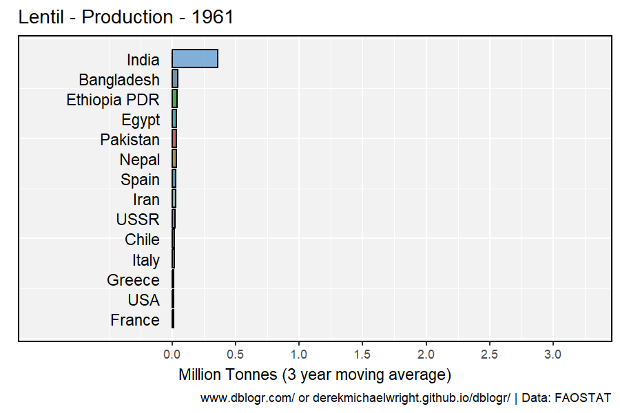

```{r}
# Prep data
xx <- agData_FAO_Crops %>% 
  filter(Crop == "Lentils", Measurement == "Production",
         Area %in% agData_FAO_Country_Table$Country,
         Area != "Slovenia") %>% 
  group_by(Area) %>%
  mutate(Value = movingAverage(Value, n = 3)) %>%
  group_by(Year) %>%
  arrange(Year, -Value) %>%
  mutate(Rank = 1:n()) %>%
  filter(Rank < 15) %>% 
  arrange(desc(Year)) %>%
  mutate(Crop = factor(Crop, levels = unique(.$Crop)))
# Plot
mp <- ggplot(xx, aes(xmin = 0, xmax = Value / 1000000, 
                     ymin = Rank - 0.45, ymax = Rank + 0.45, y = Rank, 
                     fill = Area)) + 
  geom_rect(alpha = 0.7, color = "black") + 
  scale_fill_manual(values = agData_Colors) +
  scale_x_continuous(limits = c(-1,3.25), breaks = seq(0, 3, by=0.5)) +
  geom_text(col = "black", hjust = "right", aes(label = Area), x = -0.1) +
  scale_y_reverse() +
  theme_agData(legend.position = "none",
               axis.text.y = element_blank(), 
               axis.ticks.y = element_blank()) + 
  labs(title = "Lentil - Production - {round(frame_time)}", y = NULL,
       x = "Million Tonnes (3 year moving average)", caption = myCaption) +
  transition_time(Year)
anim_save("lentil_gif_01.gif", mp, 
          nframes = 600, fps = 30, end_pause = 60, 
          width = 900, height = 600, res = 150)
```

---

# Production

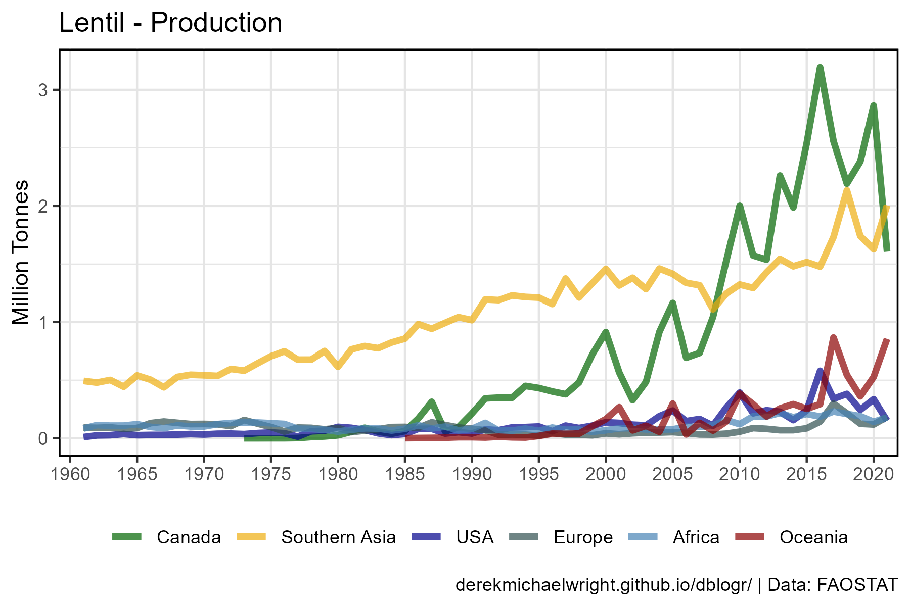

```{r}
# Prep data
myAreas <- c("Canada", "Southern Asia", "USA", "Turkey", 
             "Europe", "Africa", "Oceania")
myColors <- c("darkgreen", "darkgoldenrod2", "darkblue", "darkslategrey", 
              "steelblue", "darkred", "antiquewhite4")
xx <- agData_FAO_Crops %>% 
  filter(Area %in% myAreas, Crop == "Lentils", 
         Measurement == "Production") %>%
  mutate(Area = factor(Area, levels = myAreas) ) 
# Plot
mp <- ggplot(xx, aes(x = Year, y = Value / 1000000, color = Area)) + 
  geom_line(size = 1.5, alpha = 0.7) + 
  scale_color_manual(name = NULL, values = myColors) +
  scale_x_continuous(breaks = seq(1960, 2020, 5), minor_breaks = NULL) +
  coord_cartesian(xlim = c(min(xx$Year)+1, max(xx$Year)-2)) +
  theme_agData(legend.position = "bottom") +
  guides(color = guide_legend(nrow = 1)) +
  labs(title = "Lentil - Production", x = NULL,
       y = "Million Tonnes", caption = myCaption)
ggsave("lentil_01.png", width = 7, height = 5)
```

---

## 2019


```{r}
# Prep data
myColors <- c("darkgreen", "darkgoldenrod2", "steelblue", "antiquewhite4",
              "darkslategrey",  "darkred", "darkblue" )
myRegions <- c("Americas", "Southern Asia", "Oceania", 
               "Western Asia", "Eastern Asia", "Africa", "Europe")
xx <- agData_FAO_Crops %>% region_Info() %>%
  filter(Area %in% agData_FAO_Country_Table$Country,
         Year == 2019, Crop == "Lentils", 
         Measurement == "Production") %>%
  arrange(desc(Value)) %>% 
  slice(1:10) %>%
  mutate(Area = factor(Area, levels = Area),
         Region = ifelse(Region == "Asia", SubRegion, Region),
         Region = factor(Region, levels = myRegions))
# Plot
mp <- ggplot(xx, aes(x = Area, y = Value / 1000000, fill = Region)) + 
  geom_bar(stat = "identity", color = "black", alpha = 0.7) +
  scale_fill_manual(values = myColors) +
  theme_agData(axis.text.x = element_text(angle = 45, hjust = 1)) +
  labs(title = "Lentil - Production - 2019", x = NULL,
       y = "Million Tonnes", caption = myCaption)
ggsave("lentil_02.png", mp, width = 6, height = 4)
```

---

# Area Harvested

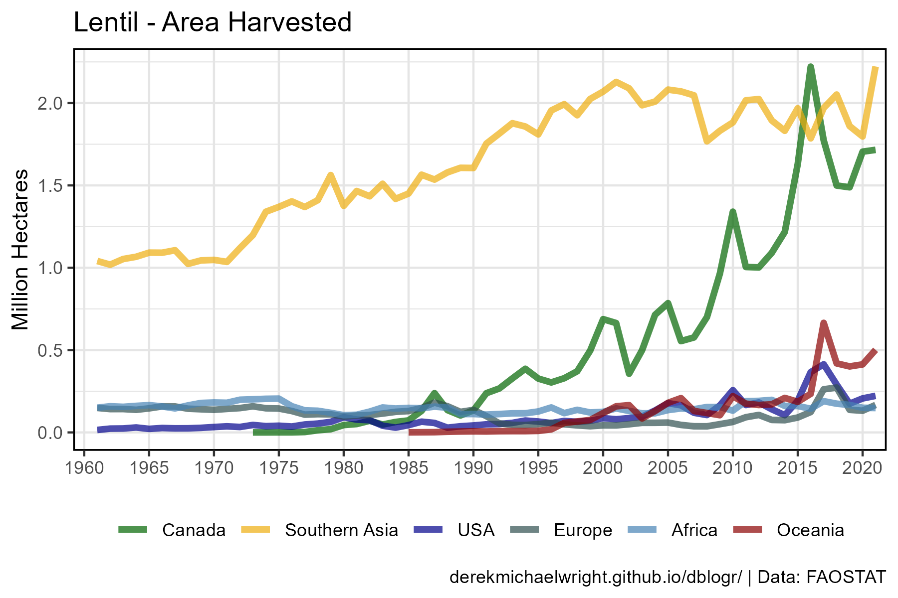

```{r}
# Prep data
myAreas <- c("Canada", "Southern Asia", "USA", "Turkey", 
             "Europe", "Africa", "Oceania")
myColors <- c("darkgreen", "darkgoldenrod2", "darkblue", "darkslategrey", 
              "steelblue", "darkred", "antiquewhite4")
xx <- agData_FAO_Crops %>% 
  filter(Area %in% myAreas, Crop == "Lentils", 
         Measurement == "Area Harvested") %>%
  mutate(Area = factor(Area, levels = myAreas) ) 
# Plot
mp <- ggplot(xx, aes(x = Year, y = Value / 1000000, color = Area)) + 
  geom_line(size = 1.5, alpha = 0.7) + 
  scale_color_manual(name = NULL, values = myColors) +
  scale_x_continuous(breaks = seq(1960, 2020, 5), minor_breaks = NULL) +
  coord_cartesian(xlim = c(min(xx$Year)+1, max(xx$Year)-2)) +
  theme_agData(legend.position = "bottom") +
  guides(color = guide_legend(nrow = 1)) +
  labs(title = "Lentil - Area Harvested", x = NULL, 
       y = "Million Hectares", caption = myCaption)
ggsave("lentil_03.png", width = 7, height = 5)
```

---

## 2019 Top Area Harvested

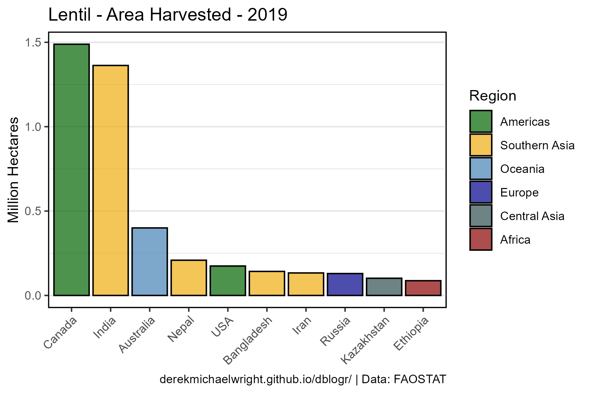

```{r}
# Prep data
myColors <- c("darkgreen", "darkgoldenrod2", "steelblue", "antiquewhite4",  
              "darkblue", "darkslategrey")
myRegions <- c("Americas", "Southern Asia", "Oceania", "Western Asia", 
               "Europe", "Central Asia")
xx <- agData_FAO_Crops %>% region_Info() %>%
  filter(Area %in% agData_FAO_Country_Table$Country,
         Year == 2019, Crop == "Lentils", 
         Measurement == "Area Harvested") %>%
  arrange(desc(Value)) %>% 
  slice(1:10) %>%
  mutate(Area = factor(Area, levels = Area),
         Region = ifelse(Region == "Asia", SubRegion, Region),
         Region = factor(Region, levels = myRegions))
# Plot
mp <- ggplot(xx, aes(x = Area, y = Value / 1000000, fill = Region)) + 
  geom_bar(stat = "identity", color = "black", alpha = 0.7) +
  scale_fill_manual(values = myColors) +
  theme_agData(axis.text.x = element_text(angle = 45, hjust = 1)) +
  labs(title = "Lentil - Area Harvested - 2019", 
       y = "Million Hectares", x = NULL, caption = myCaption)
ggsave("lentil_04.png", mp, width = 6, height = 4)
```

---

# Yields

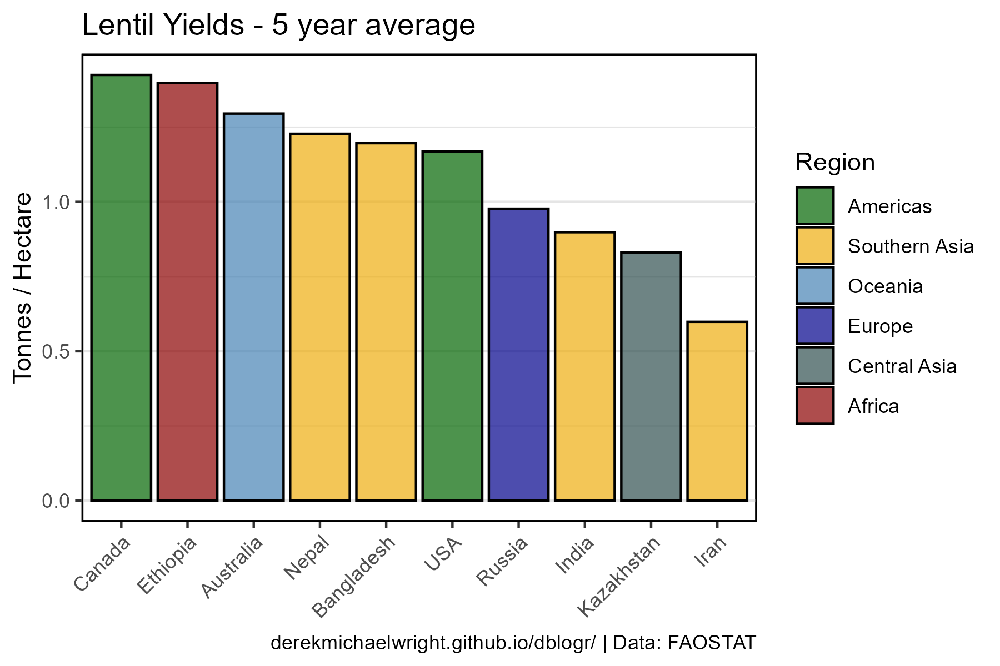

```{r}
# Prep data
myColors <- c("darkgreen", "darkgoldenrod2", "steelblue", "antiquewhite4",  
              "darkblue", "darkslategrey")
myRegions <- c("Americas", "Southern Asia", "Oceania", "Western Asia", 
               "Europe", "Central Asia")
x1 <- agData_FAO_Crops %>% 
  filter(Crop == "Lentils", Measurement == "Area Harvested", Year == max(Year),
         Area %in% agData_FAO_Country_Table$Country) %>%
    top_n(10, Value)
xx <- agData_FAO_Crops %>% 
  filter(Crop == "Lentils", Measurement == "Yield",
         Year > max(Year)-5, Area %in% x1$Area) %>% 
  group_by(Area) %>%
  summarise(Value = mean(Value)) %>% 
  region_Info() %>%
  arrange(desc(Value)) %>%
  mutate(Area = factor(Area, levels = Area),
         Region = ifelse(Region == "Asia", SubRegion, Region),
         Region = factor(Region, levels = myRegions))
# Plot
mp <- ggplot(xx, aes(x = Area, y = Value / 1000, fill = Region)) + 
  geom_bar(stat = "identity", color = "black", alpha = 0.7) + 
  scale_fill_manual(values = myColors) +
  theme_agData(axis.text.x = element_text(angle = 45, hjust = 1)) +
  labs(title = "Lentil Yields - 5 year average",
       y = "Tonnes / Hectare", x = NULL, caption = myCaption)
ggsave("lentil_05.png", mp, width = 6, height = 4)
```

---

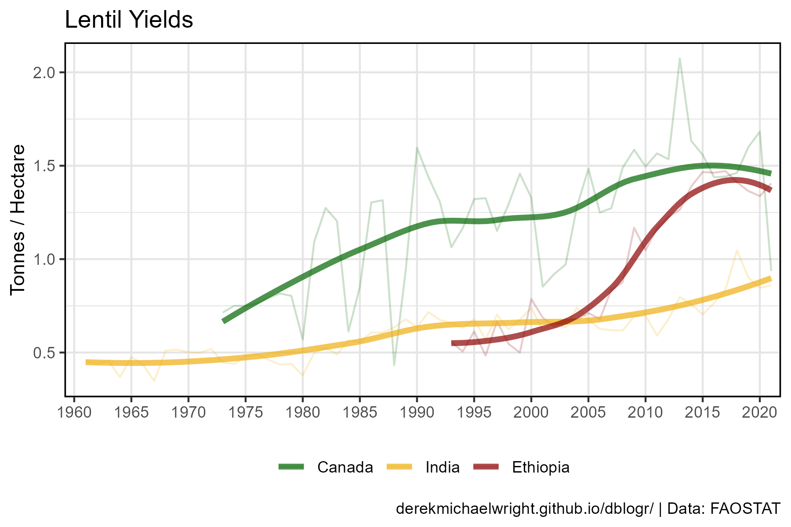

```{r}
# Prep data
myAreas <- c("Canada", "India", "Ethiopia", "Turkey")
myColors <- c("darkgreen", "darkgoldenrod2", "darkred", "darkslategrey")
xx <- agData_FAO_Crops %>%
  filter(Crop == "Lentils", Area %in% myAreas, Measurement == "Yield") %>%
  mutate(Area = factor(Area, levels = myAreas))
# Plot
mp <- ggplot(xx, aes(x = Year, y = Value / 1000, color = Area)) +
  geom_line(alpha = 0.2) +
  stat_smooth(geom = "line", method = "loess", 
              size = 1.5, alpha = 0.7, se = F) +
  scale_x_continuous(breaks = seq(1960, 2020, by = 5), minor_breaks = NULL) +
  coord_cartesian(xlim = c(min(xx$Year)+1, max(xx$Year)-2)) +
  scale_color_manual(name = NULL, values = myColors) +
  theme_agData(legend.position = "bottom") +
  labs(title = "Lentil Yields", x = NULL,
       y = "Tonnes / Hectare", caption = myCaption)
ggsave("lentil_06.png", mp, width = 6, height = 4)
```

---

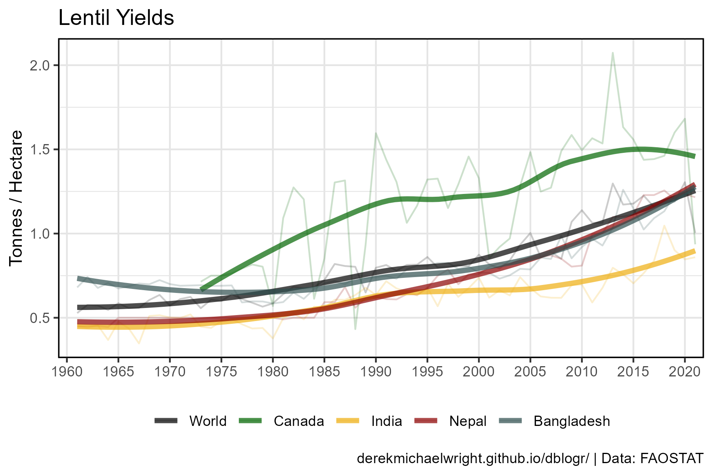

```{r}
# Prep data
myAreas <- c("World", "Canada", "India", "Nepal", "Bangladesh")
myColors <- c("black", "darkgreen", "darkgoldenrod2", "darkred", "darkslategrey")
xx <- agData_FAO_Crops %>%
  filter(Crop == "Lentils", Area %in% myAreas, Measurement == "Yield") %>%
  mutate(Area = factor(Area, levels = myAreas))
# Plot
mp <- ggplot(xx, aes(x = Year, y = Value / 1000, color = Area)) +
  geom_line(alpha = 0.2) +
  stat_smooth(geom = "line", method = "loess", 
              size = 1.5, alpha = 0.7, se = F) +
  scale_x_continuous(breaks = seq(1960, 2020, by = 5), minor_breaks = NULL) +
  coord_cartesian(xlim = c(min(xx$Year)+1, max(xx$Year)-2)) +
  scale_color_manual(name = NULL, values = myColors) +
  theme_agData(legend.position = "bottom") +
  labs(title = "Lentil Yields", x = NULL,
       y = "Tonnes / Hectare", caption = myCaption)
ggsave("lentil_07.png", mp, width = 6, height = 4)
```

---

# Canada's Global Contribution

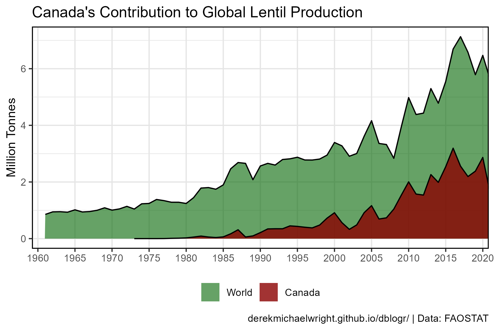

```{r}
# Prep data
xx <- agData_FAO_Crops %>% 
  filter(Crop == "Lentils", Measurement == "Production",
         Area %in% c("Canada", "World") ) %>%
  mutate(Area = factor(Area, levels = c("World", "Canada")))
# Plot
mp <- ggplot(xx, aes(x = Year, y = Value / 1000000, 
                     fill = Area, alpha = Area, color = I("Black"))) +
  geom_area(position = "identity") +
  theme(legend.position = "bottom") +
  scale_fill_manual(name = NULL, values = c("darkgreen", "darkred")) +
  scale_alpha_manual(name = NULL, values = c(0.6, 0.8)) +
  scale_x_continuous(breaks = seq(1960, 2020, 5), minor_breaks = NULL)  +
  coord_cartesian(xlim = c(min(xx$Year)+1, max(xx$Year)-3)) +
  theme_agData() +
  labs(title   = "Canada's Contribution to Global Lentil Production", 
       y = "Million Tonnes", x = NULL, caption = myCaption)
ggsave("lentil_08.png", mp, width = 6, height = 4)
```

---

# Production Pie Charts

```{r}
# Plot function
ggPie_single <- function(crop = "Lentils", measurement = "Production", 
                  years = c(1965,2018), other = 0.03) {
  # Prep data
  xx <- agData_FAO_Crops %>% region_Info() %>%
    filter(Crop == crop, Year %in% years, Measurement == measurement,
           Area %in% agData_FAO_Country_Table$Country)
  limits <- agData_FAO_Crops %>% 
    filter(Area == "World", Year %in% years, Crop == crop, 
           Measurement == measurement) %>%
    select(Year, Total=Value)
  limits$Limit <- limits$Total * other
  xx <- xx %>% left_join(limits, by = "Year")
  x1 <- xx %>% filter(Value > Limit) %>% arrange(desc(Value))
  myAreas <- unique(c(as.character(x1$Area), "Rest of World"))
  x2 <- xx %>% filter(!Area %in% myAreas) %>%
    group_by(Crop, Measurement, Unit, Year, Total, Limit) %>%
    summarise(Value = sum(Value)) %>% ungroup() %>%
    mutate(Area = "Rest of World")
  x2 <- agData_FAO_Crops %>% 
    filter(Area == "World", Year %in% years, Crop == crop, 
           Measurement == measurement)
  xx <- bind_rows(x2, x1 %>% arrange(Value, Year))
  for(i in years) {
    xx$Total[xx$Year==i & xx$Area == "World"] <- xx$Value[xx$Year==i & xx$Area == "World"]
    xx$Value[xx$Year==i & xx$Area == "World"] <- 
      xx$Total[xx$Year==i & xx$Area == "World"] - sum(xx$Value[xx$Year==i & xx$Area != "World"])
    xx$Area[xx$Year==i & xx$Area == "World"] <- "Rest of World"
  }
  xx <- xx %>%
    mutate(Percentage = round(100 * Value / Total), 
           Area = factor(Area, levels = myAreas),
           ISO2 = ifelse(Area == "Rest of World", "", ISO2)) %>%
    group_by(Year) %>%
    mutate(Cummulative_P = cumsum(Percentage)) %>%
    ungroup() %>%
    mutate(Label_y = Cummulative_P - (Percentage / 2))
  # Plot
  ggplot(xx, aes(x = 1, fill = Area)) +
    geom_bar(aes(y = -Percentage), stat = "identity",
             color = "black", alpha = 0.7) +
    coord_polar("y", start = 0) +
    geom_label(aes(label = paste(Percentage, "%"), y = -Label_y), 
               size = 3, fill = "white", alpha = 0.9, nudge_x = 0.275) + 
    facet_grid(. ~ Year) +
    theme_agData_pie() +
    scale_y_continuous(breaks = xx$Label_y, labels = xx$ISO2) +
    xlim(0.545, 1.45) +
    scale_fill_manual(name = NULL, values = agData_Colors[c(1:10,41:50)]) +
    labs(title = paste(crop, measurement), caption = myCaption)
}
#
ggPie_anim <- function(crop = "Lentils", measurement = "Production", 
                       other = 2) {
  # Prep data
  xx <- agData_FAO_Crops %>% region_Info() %>%
    filter(Crop == crop, Measurement == measurement,
           Area %in% agData_FAO_Country_Table$Country) %>%
    group_by(Year) %>%
    mutate(Percent = round(100 * Value / sum(Value, na.rm = T),1))
  myAreas <- c(xx %>% arrange(desc(Percent)) %>%
    filter(Year == max(xx$Year), Percent > other) %>% 
    pull(Area) %>% as.character(), "Other")
  x1 <- xx %>% filter(Area %in% myAreas) %>% arrange(desc(Percent))
  x2 <- xx %>% filter(!Area %in% myAreas) %>% 
    group_by(Crop, Measurement, Unit, Year) %>%
    summarise(Percent = sum(Percent, na.rm = T)) %>% ungroup() %>%
    mutate(Area = "Other")
  xx <- bind_rows(x1, x2) %>%
    arrange(Value) %>%
    mutate(Area = factor(Area, levels = myAreas),
           ISO2 = ifelse(Area == "Other", "", ISO2))
  # Plot
  ggplot(xx, aes(x = 1, fill = Area)) +
    geom_bar(aes(y = -Percent), stat = "identity", 
             position = "fill", color = "black") +
    coord_polar("y", start = 0) +
    theme_agData_pie() +
    scale_fill_manual(values = agData_Colors) +
    xlim(0.545, 1.5) +
    labs(title = paste(crop, "|", measurement, "| {round(frame_time)}"),
         caption = myCaption) +
    transition_time(Year)
}
#
ggPie_multi <- function(crop = "Lentils", measurement = "Production", 
                  years = c(1965,2018), limit = 3) {
  # Prep data
  xx <- agData_FAO_Crops %>% region_Info() %>%
    filter(Crop == crop, Year %in% years, Measurement == measurement,
           Area %in% c(agData_FAO_Country_Table$Country, "World") )
  for(i in years) {
    xx$Total[xx$Year==i] <- xx$Value[xx$Year==i & xx$Area == "World"]
  }
  xx <- xx %>% mutate(Percentage = round(100 * Value / Total)) %>%
    filter(Percentage > limit)
  for(i in years) {
    xx$Value[xx$Year==i & xx$Area == "World"] <- 
      xx$Total[xx$Year==i & xx$Area == "World"] - sum(xx$Value[xx$Year==i & xx$Area != "World"])
    xx$Area[xx$Year==i & xx$Area == "World"] <- "Rest of World"
  }
  xx <- xx %>% group_by(Year) %>%
    mutate(Percentage = ifelse(Area == "Rest of World", 0, Percentage),
           Percentage = ifelse(Area == "Rest of World", 100 - sum(Percentage), Percentage)) %>% 
    arrange(Percentage)
  myAreas <- unique(c("Rest of World", xx$Area))
  xx <- xx %>%
    mutate(Area = factor(Area, levels = rev(myAreas))) %>%
    arrange(Year, Area) %>%
    group_by(Year) %>%
    mutate(Cummulative_P = cumsum(Percentage)) %>%
    ungroup() %>%
    mutate(Label_y = Cummulative_P - (Percentage / 2))
  # Plot
  ggplot(xx, aes(x = 1, fill = Area)) +
    geom_bar(aes(y = -Percentage), stat = "identity",
             color = "black", alpha = 0.7) +
    coord_polar("y", start = 0) +
    facet_grid(. ~ Year) +
    theme_agData_pie() +
    scale_y_continuous(breaks = xx$Label_y, labels = xx$ISO2) +
    xlim(0.545, 1.45) +
    scale_fill_manual(name = NULL, values = agData_Colors[c(1:10,41:50)]) +
    labs(title = paste(crop, measurement), caption = myCaption)
}
```

---

## 1965 vs 2019

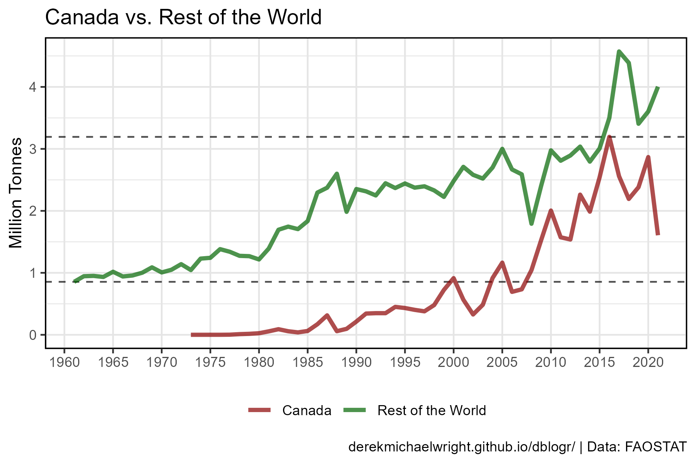

```{r}
# Plot
mp <- ggPie_multi(crop = "Lentils", measurement = "Production", 
                  years = c(1965,2019), limit = 3)
ggsave("lentil_09.png", mp, width = 8, height = 4)
```

---

## 2019


```{r}
# Plot
mp <- ggPie_single(crop = "Lentils", measurement = "Production", 
                   year = 2019, other = 0.03)
ggsave("lentil_10.png", mp, width = 5, height = 4)
```

```{r echo = F}
ggsave("featured.png", mp, width = 6, height = 4)
```

---

## Animation

### Production


```{r}
# Plot function
mp <- ggPie_anim(crop = "Lentils", measurement = "Production", other = 2.5)
anim_save("lentil_gif_02.gif", mp,
          nframes = 300, fps = 10, end_pause = 30, 
          width = 900, height = 600, res = 150)
```

---

### Area Harvested

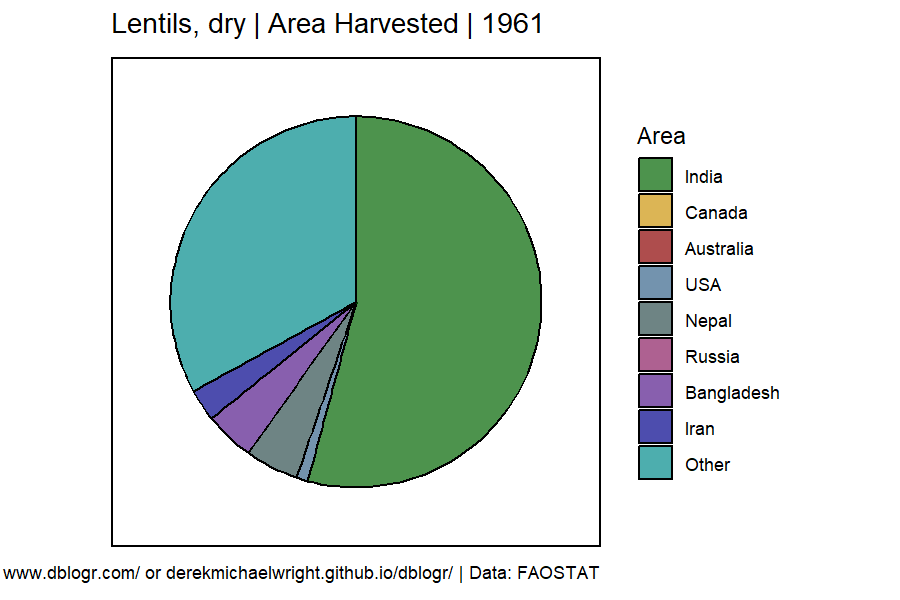

```{r}
# Plot function
mp <- ggPie_anim(crop = "Lentils", measurement = "Area Harvested", other = 2.5)
anim_save("lentil_gif_03.gif", mp,
          nframes = 300, fps = 10, end_pause = 30, 
          width = 900, height = 600, res = 150)
```

---

# Import/Export 

## Canada vs India

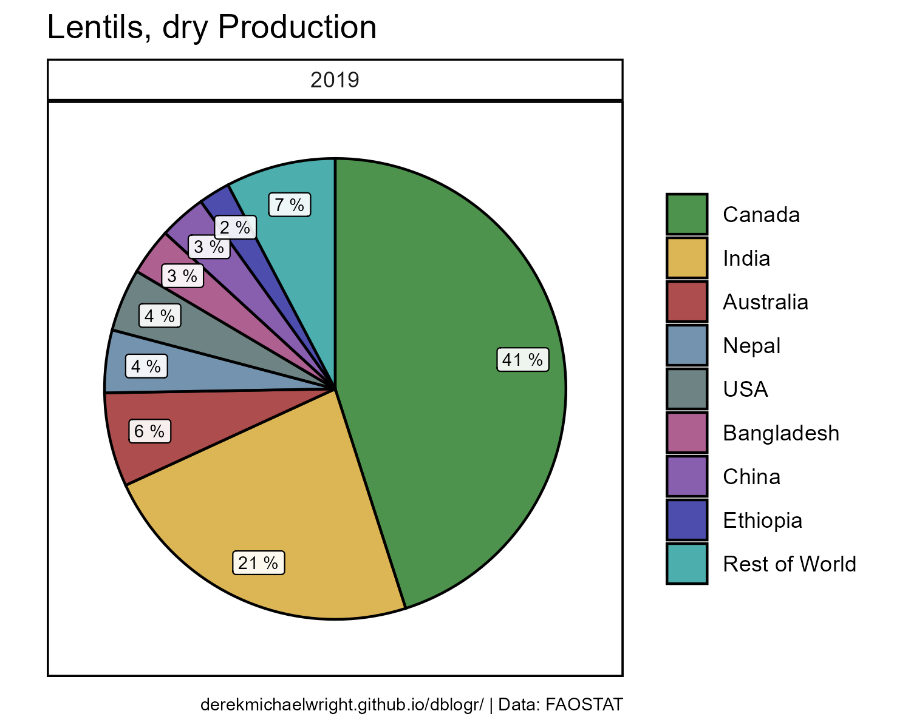

```{r}
# Prep data
xx <- agData_FAO_Trade_Quantity %>%
  filter(Item == "Lentils", Area %in% c("Canada","India") )
# Plot
mp <- ggplot(xx, aes(x = Year, y = Value / 1000000, group = Measurement, 
                     color = Measurement)) + 
  geom_line(size = 1.25, alpha = 0.7) + 
  facet_grid(. ~ Area) +
  theme(legend.position = "bottom") +
  scale_color_manual(name = NULL, values = c("darkgreen", "darkorange")) +
  scale_x_continuous(breaks       = seq(1965, 2015, by = 10),
                     minor_breaks = seq(1965, 2015, by = 5))  +
  theme_agData() +
  labs(title = "Lentil Import/Export", x = NULL,
       y = "Million Tonnes", caption = myCaption)
ggsave("lentil_11.png", mp, width = 6, height = 4)
```

---

## Regions

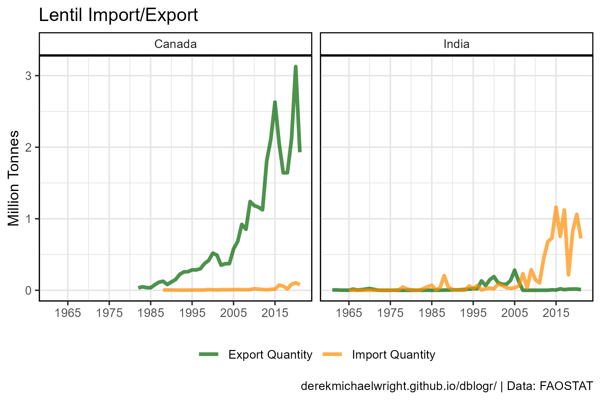

```{r}
# Prep data
myAreas <- c("Americas","Asia","Europe","Africa","Oceania")
myColors <- c("darkgreen","darkorange","darkblue","darkred","steelblue")
xx <- agData_FAO_Trade_Quantity %>%
  region_Info() %>%
  filter(Item == "Lentils", Area %in% agData_FAO_Country_Table$Region) %>%
  mutate(Area = factor(Area, levels = myAreas))
# Plot
mp <- ggplot(xx, aes(x = Year, y = Value / 1000000, 
                     group = Area, color = Area)) + 
  geom_line(size = 1, alpha = 0.7) + 
  facet_grid(. ~ Measurement) +
  scale_x_continuous(breaks       = seq(1965, 2015, by = 10),
                     minor_breaks = seq(1965, 2015, by = 5))  +
  scale_color_manual(name = NULL, values = myColors) +
  theme_agData(legend.position = "bottom") + 
  labs(title = "Lentil Import/Export", x = NULL,
       y = "Million Tonnes", caption = myCaption)
ggsave("lentil_12.png", mp, width = 6, height = 4)
```

---

# Heatmap

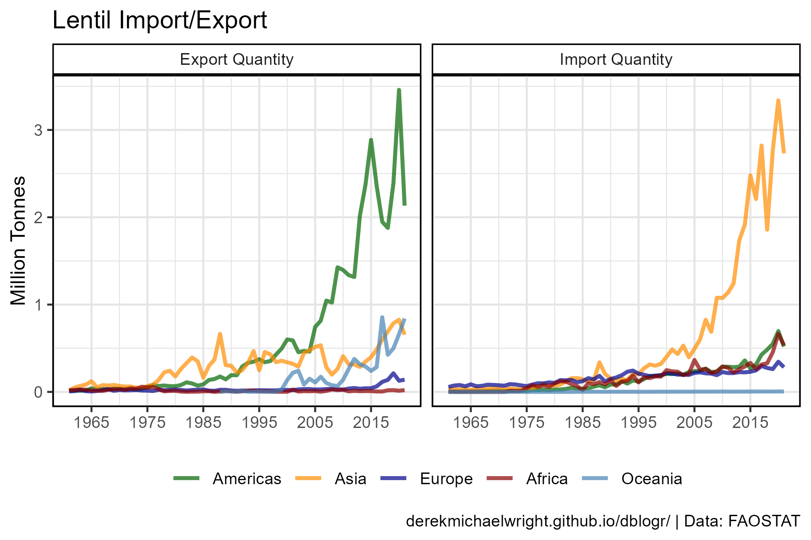

```{r}
# Prep data
x1 <- agData_FAO_Crops %>% 
  filter(Crop == "Lentils", Measurement == "Production", Year == 2018,
         Area %in% agData_FAO_Country_Table$Country) %>%
    top_n(10, Value)
xx <- agData_FAO_Crops %>% 
  filter(Crop == "Lentils", Measurement == "Production", 
         Area %in% x1$Area)
myColors <- c("lightgrey", "darkgreen")
# Plot
mp <- ggplot(xx, aes(x = Year, y = Area, fill = Value / 1000000)) +
  geom_tile(color = "white", size = 0.35) +
  scale_x_continuous(expand = c(0,0)) +
  scale_fill_gradientn(name = "Million Tonnes", colors = myColors, na.value = 'white') +
  theme_agData(legend.position = "bottom", bgFill = "white") +
  labs(title = "Lentil Production", x = NULL, y = NULL, caption = myCaption)
ggsave("lentil_13.png", mp, width = 6, height = 4)
```

---

```{r echo = F, eval = F}
x1 <- agData_STATCAN_Crops %>%
  filter(Crop == "Lentils", Area == "Canada") %>%
  mutate(Source = "STATCAN")
x2 <- agData_FAO_Crops %>% 
  filter(Crop == "Lentils", Area == "Canada") %>%
  mutate(Source = "FAO")
xx <- bind_rows(x1, x2)
ggplot(xx, aes(x = Year, y = Value, color = Source, lty = Source)) +
  geom_line() + facet_wrap(Measurement ~ ., scales = "free_y")
```
