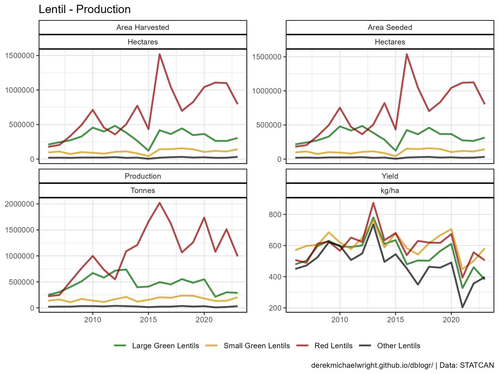
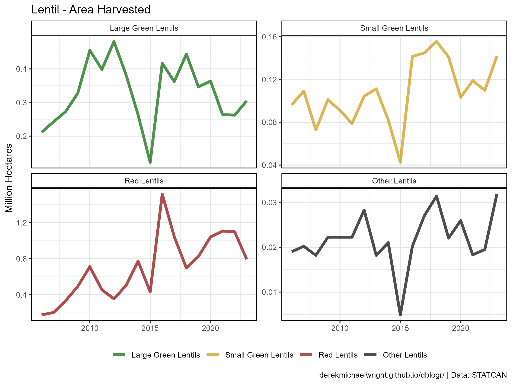
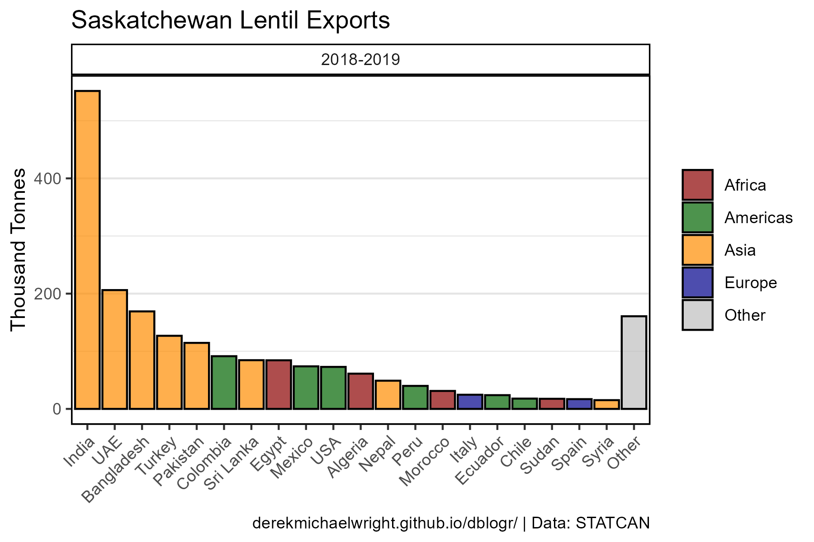
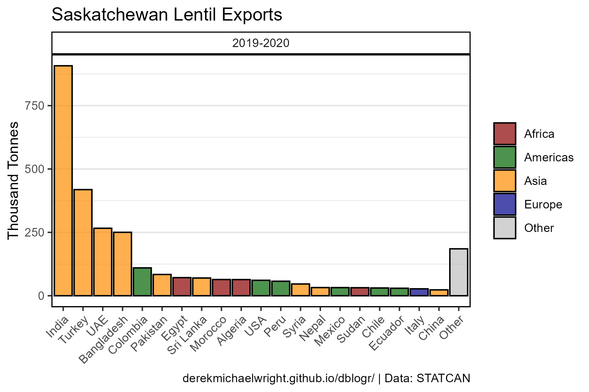

```{r setup, include = FALSE}
knitr::opts_chunk$set(echo = T, message = F, warning = F)
```

---

# Data

https://publications.saskatchewan.ca/#/categories/4426

`r shiny::icon("save")` [agData_SKAG_Specialty_Crops.csv](https://github.com/derekmichaelwright/agData/raw/master/Data/agData_SKAG_Specialty_Crops.csv)

`r shiny::icon("save")` [agData_Lentil_Exports.csv](https://github.com/derekmichaelwright/agData/raw/master/Data/agData_Lentil_Exports.csv)

```{r class.source = 'fold-show'}
# devtools::install_github("derekmichaelwright/agData")
library(agData)
library(gganimate)
```

---

# Prepare Data

```{r}
myColors <- c("darkgreen", "darkgoldenrod3", "darkred", "black")
myCrops <- c("Large Green Lentils","Small Green Lentils",
             "Red Lentils","Other Lentils")
myCaption <- "\u00A9 derekmichaelwright.github.io/dblogr/ | Data: STATCAN"
#
x1 <- agData_STATCAN_Crops %>%
  filter(Crop == "Lentils", Measurement == "Production",
         Area == "Saskatchewan")
x2 <- read.csv("lentil_timeline.csv")
d1 <- full_join(x1, x2, by = "Year") %>%
  mutate(Value = ifelse(is.na(Value), 0, Value))
#
d2 <- agData_SKAG_Specialty_Crops %>%
  filter(grepl("Lentil", Crop), Crop != "Total Lentils") %>%
  mutate(Crop = factor(Crop, levels = myCrops))
#
d3 <- agData_SKAG_Lentil_Exports
```

---

# Timeline

```{r}
# Plot
mp <- ggplot(d1, aes(x = Year)) +
  geom_segment(aes(xend = Year, y = Value / 1000000, yend = Nudge_y), alpha = 0.7) +
  geom_label(aes(label = Event, y = Nudge_y, fill = Type), 
             size = 3, alpha = 0.6, hjust = 1) +
  geom_area(aes(y = Value / 1000000), fill = "darkgreen", alpha = 0.7, color = I("Black")) +
  scale_fill_manual(values = c("darkred", "darkorange", "steelblue")) +
  scale_x_continuous(breaks = seq(1970,2020, by = 10), 
                     limits = c(1935, 2021), expand = c(0,0)) +
  scale_y_continuous(expand = c(0,0), limits = c(0,4)) +
  theme_agData(legend.position = "none",
               panel.grid.major.x = element_blank(),
               panel.grid.minor.x = element_blank()) +
  labs(title = "Canadian Lentil Industry", x = NULL,
       y = "Production (Million Tonnes)", caption = myCaption)
ggsave("lentil_saskatchewan_1.png", mp, width = 6, height = 4)
```

```{r echo = F}
ggsave("featured.png", mp, width = 7, height = 4.5)
```

---

## Bar Chart Racer


```{r}
# Prep data
xx <- d3 %>% 
  filter(Area != "World") %>% 
  mutate(Date = Year,
         Year = as.numeric(substr(Year, 1, 4)))
# Plot
mp <- ggplot(xx, aes(xmin = 0, xmax = Value / 1000000, 
                     ymin = Rank - 0.45, ymax = Rank + 0.45, y = Rank, 
                     fill = Area)) + 
  geom_rect(alpha = 0.7, color = "black") + 
  scale_fill_manual(values = alpha(agData_Colors, 0.75)) +
  scale_x_continuous(limits = c(-0.6,1), breaks = seq(0, 3, by=0.5)) +
  geom_text(col = "black", hjust = "right", aes(label = Area), x = -0.1) +
  scale_y_reverse() +
  theme_agData(legend.position = "none",
               axis.text.y = element_blank(), 
               axis.ticks.y = element_blank()) + 
  labs(title = "Saskatchewan Lentil Exports - {round(frame_time)}", 
       x = "Million Tonnes (3 year moving average)", 
       y = NULL, caption = myCaption) +
  transition_time(Year)
anim_save("lentil_saskatchewan_gif_01.gif", mp, 
          nframes = 600, fps = 30, end_pause = 120, 
          width = 900, height = 600, res = 150)
```

---

# Lentil Production

## All Data



```{r}
# Plot
mp <- ggplot(d2, aes(x = Year, y = Value, color = Crop)) +
  geom_line(size = 1, alpha = 0.7) +
  facet_wrap(Measurement + Unit ~ ., scales = "free_y") +
  theme_agData(legend.position = "bottom") +
  scale_color_manual(name = NULL, values = myColors) +
  labs(title = "Lentil - Production", 
       y = NULL, x = NULL, caption = myCaption)
ggsave("lentil_saskatchewan_2_01.png", width = 8, height = 6)
```


---

## Area Harvested By Type



```{r}
# Prep data
xx <- d2 %>% filter(Measurement == "Area Harvested")
# Plot
mp <- ggplot(xx, aes(x = Year, y = Value / 1000000, color = Crop)) +
  geom_line(size = 1.5, alpha = 0.7) +
  facet_wrap(Crop ~ ., scales = "free_y") +
  scale_color_manual(name = NULL, values = myColors) +
  theme_agData(legend.position = "bottom") +
  labs(title = "Lentil - Area Harvested", 
       y = "Million Hectares", x = NULL, caption = myCaption)
ggsave("lentil_saskatchewan_2_02.png", width = 8, height = 5)
```

---

## Production By Type


```{r}
# Prep data
xx <- d2 %>% filter(Measurement == "Production")
# Plot
mp <- ggplot(xx, aes(x = Year, y = Value / 1000000, color = Crop)) +
  geom_line(size = 1.5, alpha = 0.7) +
  facet_wrap(Crop ~ ., scales = "free_y") +
  scale_color_manual(name = NULL, values = myColors) +
  theme_agData(legend.position = "bottom") +
  labs(title = "Lentil - Production", 
       y = "Million Tonnes", x = NULL, caption = myCaption)
ggsave("lentil_saskatchewan_2_03.png", width = 8, height = 5)
```

---

## Production & Area


```{r}
# Prep data
xx <- d2 %>% filter(Measurement %in% c("Production", "Area Harvested"))
# Plot
mp <- ggplot(xx, aes(x = Year, y = Value / 1000000, fill = Crop)) +
  geom_bar(stat = "identity", position = "stack", 
           color = "black", alpha = 0.7) +
  facet_wrap(Measurement + Unit ~ ., scales = "free_y") +
  scale_fill_manual(name = NULL, values = myColors) +
  theme_agData(legend.position = "bottom") +
  labs(title = "Lentil - Production", 
       y = "Million", x = NULL, caption = myCaption)
ggsave("lentil_saskatchewan_2_04.png", width = 8, height = 5)
```

---

# Exports

## World


```{r}
# Prep data
xx <- d3 %>% filter(Area == "World")
# Plot
mp <- ggplot(xx, aes(x = Year, y = Value / 1000, group = Area)) +
  geom_bar(stat = "identity", color = "black", 
           fill = "darkgreen", alpha = 0.7) + 
  theme_agData(axis.text.x = element_text(angle = 45, hjust = 1)) +
  labs(title = "Saskatchewan Lentil Exports", 
       y = "Thousand Tonnes", x = NULL, caption = myCaption)
ggsave("lentil_saskatchewan_3_01.png", width = 6, height = 4)
```

---

## All Data


```{r}
# Plot
mp <- ggplot(d3, aes(x = Year, y = Value / 1000, group = Area)) +
  geom_bar(stat = "identity", color = "black", 
           fill = "darkgreen", alpha = 0.7) + 
  facet_wrap(Area ~ ., scales = "free_y", ncol = 8) +
  theme_agData(axis.text.x = element_text(angle = 45, hjust = 1)) +
  labs(title = "Saskatchewan Lentil Exports", 
       y = "Thousand Tonnes", x = NULL, caption = myCaption)
ggsave("lentil_saskatchewan_3_02.png", width = 20, height = 8)
```

---

## 2018-2019



```{r}
# Prep data
myColors <- c("darkred","darkgreen","darkorange","darkblue")
xx <- d3 %>% 
  filter(Area != "World", Year == "2018-2019") %>%
  left_join(agData_FAO_Country_Table, by = c("Area"="Country")) %>%
  arrange(desc(Value)) %>%
  mutate(Area = factor(Area, levels = c(.$Area[.$Area!="Other"],"Other")))
# Plot
mp <- ggplot(xx, aes(x = Area, y = Value / 1000, group = Area, fill = Region)) +
  geom_bar(stat = "identity", alpha = 0.7, color = "black") + 
  facet_wrap(Year ~ ., scales = "free_y", ncol = 8) +
  scale_fill_manual(name = NULL, values = myColors) +
  theme_agData(axis.text.x = element_text(angle = 45, hjust = 1)) +
  labs(title = "Saskatchewan Lentil Exports", 
       y = "Thousand Tonnes", x = NULL, caption = myCaption)
ggsave("lentil_saskatchewan_3_03.png", width = 6, height = 4)
```

---

## 2019-2020



```{r}
# Prep data
xx <- d3 %>% 
  filter(Area != "World", Year == "2019-2020") %>%
  left_join(agData_FAO_Country_Table, by = c("Area"="Country")) %>%
  arrange(desc(Value)) %>%
  mutate(Area = factor(Area, levels = c(.$Area[.$Area!="Other"],"Other")))
# Plot
mp <- ggplot(xx, aes(x = Area, y = Value / 1000, group = Area, fill = Region)) +
  geom_bar(stat = "identity", alpha = 0.7, color = "black") + 
  facet_wrap(Year ~ ., scales = "free_y", ncol = 8) +
  scale_fill_manual(name = NULL, values = myColors) +
  theme_agData(axis.text.x = element_text(angle = 45, hjust = 1)) +
  labs(title = "Saskatchewan Lentil Exports", 
       y = "Thousand Tonnes", x = NULL, caption = myCaption)
ggsave("lentil_saskatchewan_3_04.png", width = 6, height = 4)
```

---

## 2021-2022


```{r}
# Prep data
xx <- d3 %>% 
  filter(Area != "World", Year == "2020-2021") %>%
  left_join(agData_FAO_Country_Table, by = c("Area"="Country")) %>%
  arrange(desc(Value)) %>%
  mutate(Area = factor(Area, levels = c(.$Area[.$Area!="Other"],"Other")))
# Plot
mp <- ggplot(xx, aes(x = Area, y = Value / 1000, group = Area, fill = Region)) +
  geom_bar(stat = "identity", alpha = 0.7, color = "black") + 
  facet_wrap(Year ~ ., scales = "free_y", ncol = 8) +
  scale_fill_manual(name = NULL, values = myColors) +
  theme_agData(axis.text.x = element_text(angle = 45, hjust = 1)) +
  labs(title = "Saskatchewan Lentil Exports", x = NULL,
       y = "Thousand Tonnes", caption = myCaption)
ggsave("lentil_saskatchewan_3_05.png", width = 6, height = 4)
```

---
