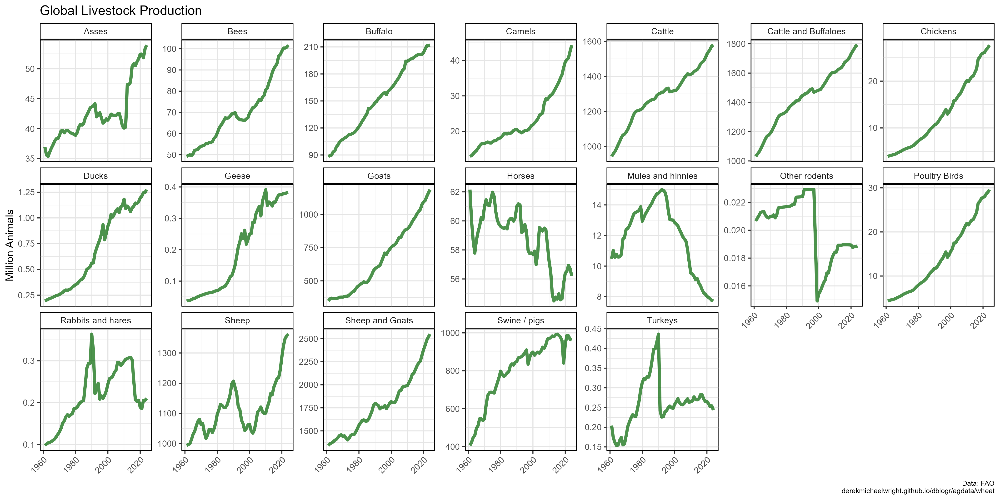
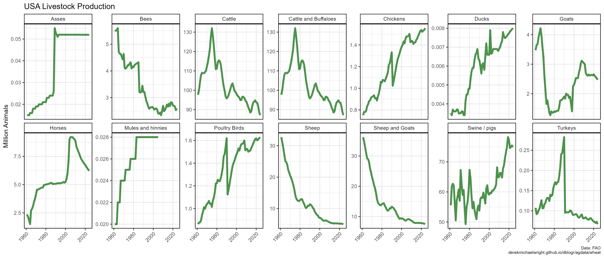
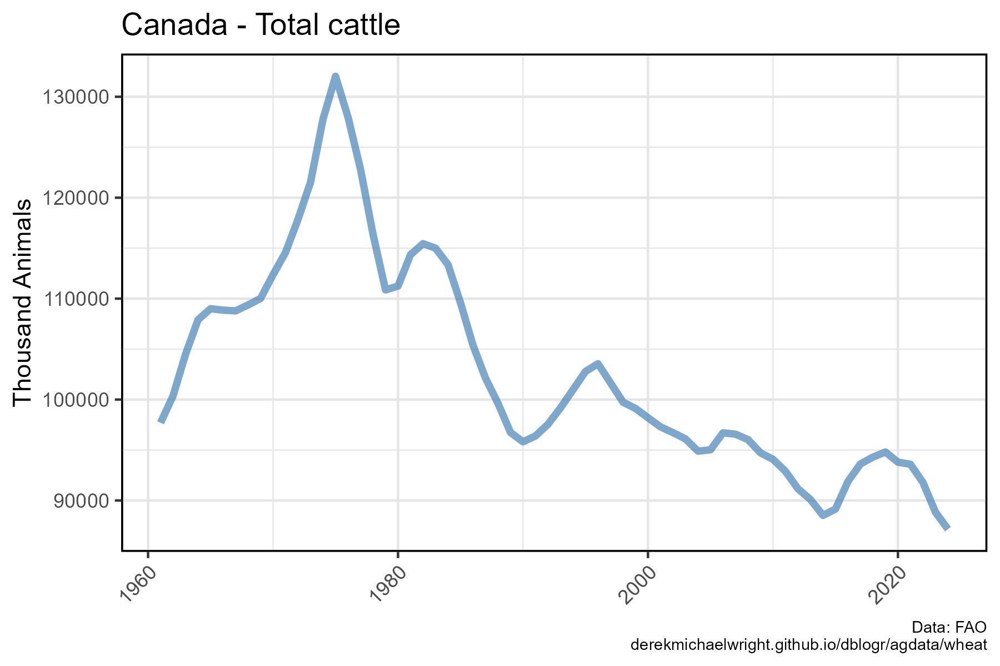

```{r setup, include = FALSE}
knitr::opts_chunk$set(echo = T, warning = F, message = F)
```

---

# Data

> - `r shiny::icon("globe")` [https://www150.statcan.gc.ca/t1/tbl1/en/cv.action?pid=3210015501](https://www150.statcan.gc.ca/t1/tbl1/en/cv.action?pid=3210015501){target="_blank"}
> - `r shiny::icon("save")` [agData_STATCAN_Livestock.csv](https://github.com/derekmichaelwright/agData/raw/master/Data/agData_STATCAN_Livestock.csv){target="_blank"}

# Prepare Data

```{r class.source = 'fold-show'}
# devtools::install_github("derekmichaelwright/agData")
library(agData)
```


```{r}
# Prep data
myCaption <- "Data: FAO\nderekmichaelwright.github.io/dblogr/agdata/wheat"
#
myColors <- c("darkgreen", "darkred", "steelblue", 
              "darkgoldenrod2", "Purple4")
myAnimals <- c("Total cattle", "Total pigs", "Total sheep", 
               "Horses and ponies", "Turkeys")
#
dd <- agData_FAO_Livestock
```

---

# All Livestock {.tabset .tabset-pills}

## World



```{r}
# Prep Data
xx <- dd %>% 
  filter(Area == "World", Measurement == "Stocks")
# Plot Data
mp <- ggplot(xx, aes(x = Year, y = Value / 1000000)) + 
  geom_line(size = 1.5, alpha = 0.7, color = "darkgreen") +
  facet_wrap(Item ~ ., scales = "free_y", ncol = 7) +
  theme_agData(axis.text.x = element_text(angle = 45, hjust = 1)) +
  labs(title = "Global Livestock Production", x = NULL,
       y = "Million Animals", caption = myCaption)
ggsave("livestock_01.png", mp, width = 14, height = 7)
```

---

## USA



```{r}
# Prep Data
xx <- dd %>% 
  filter(Area == "USA", Measurement == "Stocks")
# Plot Data
mp <- ggplot(xx, aes(x = Year, y = Value / 1000000)) + 
  geom_line(size = 1.5, alpha = 0.7, color = "darkgreen") +
  facet_wrap(Item ~ ., scales = "free_y", ncol = 7) +
  theme_agData(axis.text.x = element_text(angle = 45, hjust = 1)) +
  labs(title = "USA Livestock Production", x = NULL,
       y = "Million Animals", caption = myCaption)
ggsave("livestock_02.png", mp, width = 14, height = 6)
```

---

## USA Beef



```{r}
# Prep Data
xx <- dd %>% 
  filter(Area == "USA", Item == "Cattle",
         Measurement == "Stocks")
# Plot
mp <- ggplot(xx, aes(x = Year, y = Value / 1000)) + 
  geom_line(color = "steelblue", size = 1.5, alpha = 0.7) + 
  theme_agData(axis.text.x = element_text(angle = 45, hjust = 1)) +
  labs(title = "Canada - Total cattle", x = NULL,
       y = "Thousand Animals", caption = myCaption)
ggsave("livestock_03.png", mp, width = 6, height = 4)
```

---
