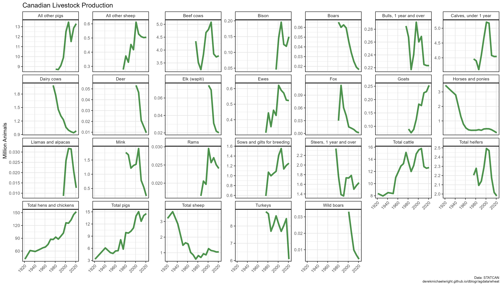
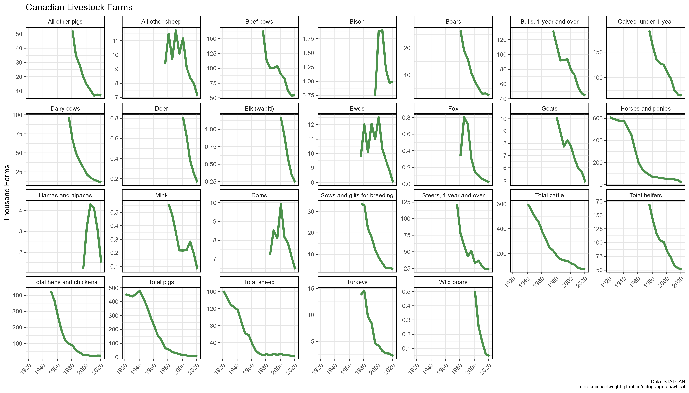
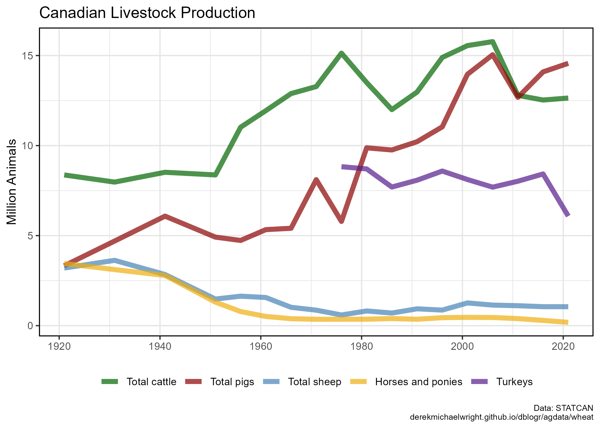
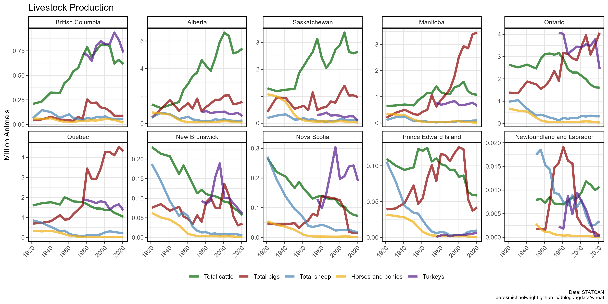
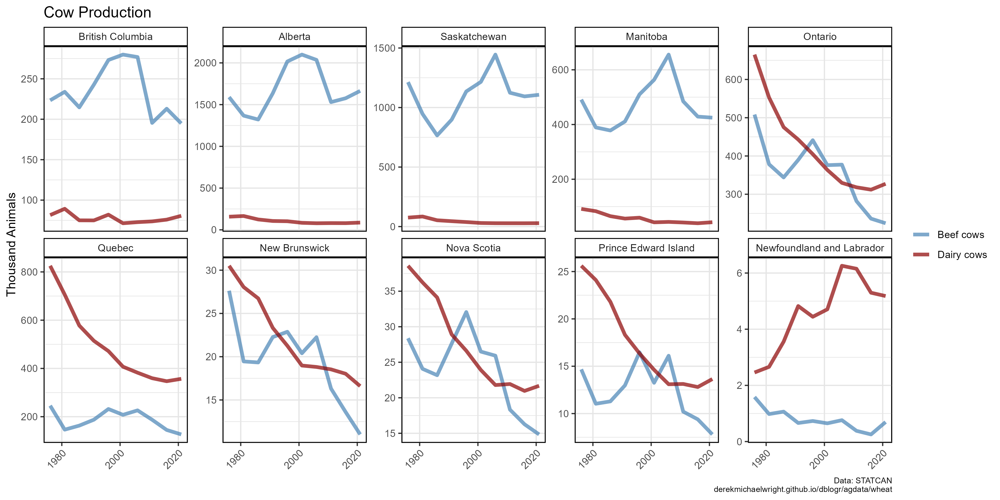
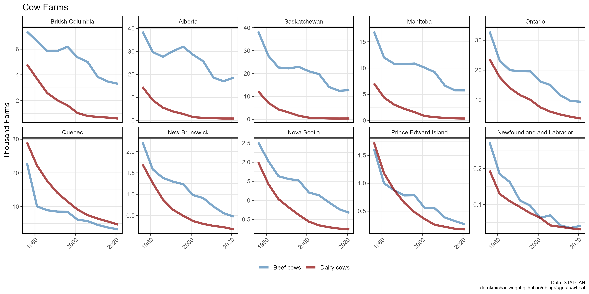
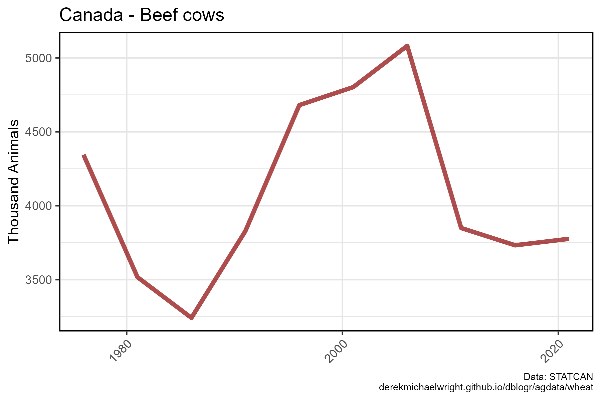

```{r setup, include = FALSE}
knitr::opts_chunk$set(echo = T, warning = F, message = F)
```

---

# Data

> - `r shiny::icon("globe")` [https://www150.statcan.gc.ca/t1/tbl1/en/cv.action?pid=3210015501](https://www150.statcan.gc.ca/t1/tbl1/en/cv.action?pid=3210015501){target="_blank"}
> - `r shiny::icon("save")` [agData_STATCAN_Livestock.csv](https://github.com/derekmichaelwright/agData/raw/master/Data/agData_STATCAN_Livestock.csv){target="_blank"}

# Prepare Data

```{r class.source = 'fold-show'}
# devtools::install_github("derekmichaelwright/agData")
library(agData)
```


```{r}
# Prep data
myCaption <- "Data: STATCAN\nderekmichaelwright.github.io/dblogr/agdata/wheat"
#
myColors <- c("darkgreen", "darkred", "steelblue", 
              "darkgoldenrod2", "Purple4")
myAnimals <- c("Total cattle", "Total pigs", "Total sheep", 
               "Horses and ponies", "Turkeys")
myAreas <- c("British Columbia", "Alberta", "Saskatchewan", "Manitoba", 
             "Ontario", "Quebec","New Brunswick", "Nova Scotia",
             "Prince Edward Island", "Newfoundland and Labrador")
#
dd <- agData_STATCAN_Livestock
```

---

# All Livestock

## Number of Animals



```{r}
# Prep Data
xx <- dd %>% 
  filter(Area == "Canada", Measurement == "Number of animals")
# Plot Data
mp <- ggplot(xx, aes(x = Year, y = Value / 1000000)) + 
  geom_line(size = 1.5, alpha = 0.7, color = "darkgreen") +
  facet_wrap(Item ~ ., scales = "free_y", ncol = 7) +
  scale_x_continuous(breaks = seq(1920, 2020, 20), minor_breaks = NULL) +
  theme_agData(axis.text.x = element_text(angle = 45, hjust = 1)) +
  labs(title = "Canadian Livestock Production", x = NULL,
       y = "Million Animals", caption = myCaption)
ggsave("livestock_canada_01.png", mp, width = 14, height = 8)
```

---

## Number of Farms



```{r}
# Prep Data
xx <- dd %>% 
  filter(Area == "Canada", Measurement == "Number of farms reporting")
# Plot Data
mp <- ggplot(xx, aes(x = Year, y = Value / 1000)) + 
  geom_line(size = 1.5, alpha = 0.7, color = "darkgreen") +
  facet_wrap(Item ~ ., scales = "free_y", ncol = 7) +
  scale_x_continuous(breaks = seq(1920, 2020, 20), minor_breaks = NULL) +
  theme_agData(axis.text.x = element_text(angle = 45, hjust = 1)) +
  labs(title = "Canadian Livestock Farms", x = NULL,
       y = "Thousand Farms", caption = myCaption)
ggsave("livestock_canada_02.png", mp, width = 14, height = 8)
```

---

# Cattle, Pigs, Sheep, Horses, Turkeys

## Canada



```{r}
# Prep Data
xx <- dd %>% 
  filter(Area == "Canada", Item %in% myAnimals,
         Measurement == "Number of animals") %>%
  mutate(Item = factor(Item, levels = myAnimals))
# Plot
mp <- ggplot(xx, aes(x = Year, y = Value / 1000000, color = Item)) + 
  geom_line(size = 2, alpha = 0.7) +
  scale_x_continuous(breaks = seq(1920, 2020, 20), 
                     minor_breaks = seq(1920, 2020, 10)) +
  scale_color_manual(name = NULL, values = myColors) +
  theme_agData(legend.position = "bottom") +
  labs(title = "Canadian Livestock Production", x = NULL, 
       y = "Million Animals", caption = myCaption)
ggsave("livestock_canada_03.png", mp, width = 7, height = 5)
```

```{r echo = F}
ggsave("featured.png", mp, width = 7, height = 5)
```

---

## By Province



```{r}
# Prep Data
xx <- dd %>% 
  filter(Area != "Canada", Item %in% myAnimals,
         Measurement == "Number of animals") %>%
  mutate(Item = factor(Item, levels = myAnimals),
         Area = factor(Area, levels = myAreas))
# Plot
mp <- ggplot(xx, aes(x = Year, y = Value / 1000000, color = Item)) + 
  geom_line(size = 1.5, alpha = 0.7) + 
  facet_wrap(Area ~ ., ncol = 5, scales = "free_y") +
  scale_x_continuous(breaks = seq(1920, 2020, 20), minor_breaks = NULL) +
  scale_color_manual(name = NULL, values = myColors) +
  theme_agData(legend.position = "bottom",
               axis.text.x = element_text(angle = 45, hjust = 1)) +
  labs(title = "Livestock Production", x = NULL,
       y = "Million Animals", caption = myCaption)
ggsave("livestock_canada_04.png", mp, width = 12, height = 6)
```

---

# Cows

## Number of Animals



```{r}
# Prep Data
xx <- dd %>% 
  filter(Area != "Canada", Item %in% c("Dairy cows", "Beef cows"),
         Measurement == "Number of animals") %>%
  mutate(Area = factor(Area, levels = myAreas))
# Plot
mp <- ggplot(xx, aes(x = Year, y = Value / 1000)) + 
  geom_line(aes(color = Item), size = 1.5, alpha = 0.7) + 
  facet_wrap(Area ~ ., ncol = 5, scales = "free_y") +
  scale_x_continuous(breaks = seq(1920, 2020, 20), minor_breaks = NULL) +
  scale_color_manual(name = NULL, values = c("steelblue","darkred")) +
  theme_agData(axis.text.x = element_text(angle = 45, hjust = 1)) +
  labs(title = "Cow Production", x = NULL, 
       y = "Thousand Animals", caption = myCaption)
ggsave("livestock_canada_05.png", mp, width = 12, height = 6)
```

---

## Number of Farms



```{r}
# Prep Data
xx <- dd %>% 
  filter(Area != "Canada", Item %in% c("Dairy cows", "Beef cows"),
         Measurement == "Number of farms reporting") %>%
  mutate(Area = factor(Area, levels = myAreas))
# Plot
mp <- ggplot(xx, aes(x = Year, y = Value / 1000)) + 
  geom_line(aes(color = Item), size = 1.5, alpha = 0.7) + 
  facet_wrap(Area ~ ., ncol = 5, scales = "free_y") +
  scale_x_continuous(breaks = seq(1920, 2020, 20), minor_breaks = NULL) +
  scale_color_manual(name = NULL, values = c("steelblue","darkred")) +
  theme_agData(legend.position = "bottom",
               axis.text.x = element_text(angle = 45, hjust = 1)) +
  labs(title = "Cow Farms", x = NULL, 
       y = "Thousand Farms", caption = myCaption)
ggsave("livestock_canada_06.png", mp, width = 12, height = 6)
```

---

# Beef



```{r}
# Prep Data
xx <- dd %>% 
  filter(Area == "Canada", Item == "Beef cows",
         Measurement == "Number of animals")
# Plot
mp <- ggplot(xx, aes(x = Year, y = Value / 1000)) + 
  geom_line(color = "darkred", size = 1.5, alpha = 0.7) + 
  scale_color_manual(name = NULL, values = myColors) +
  scale_x_continuous(breaks = seq(1920, 2020, 20), minor_breaks = NULL) +
  theme_agData(axis.text.x = element_text(angle = 45, hjust = 1)) +
  labs(title = "Canada - Beef cows", x = NULL,
       y = "Thousand Animals", caption = myCaption)
ggsave("livestock_canada_07.png", mp, width = 6, height = 4)
```
