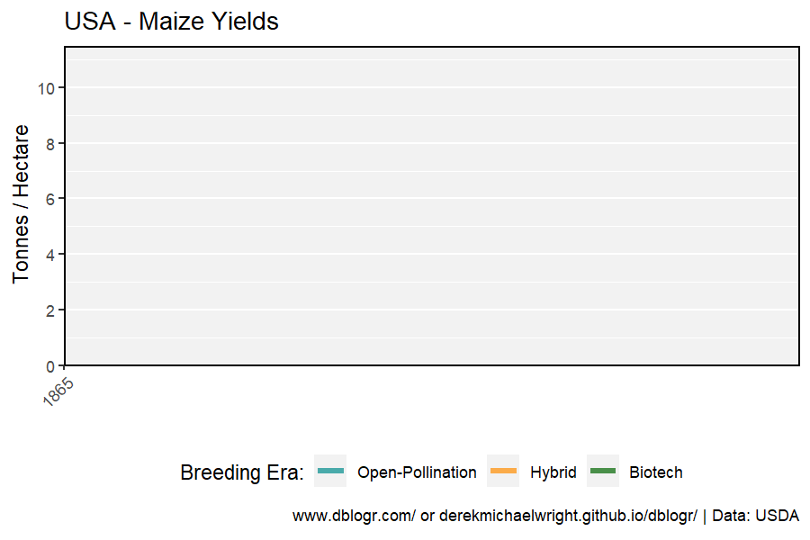
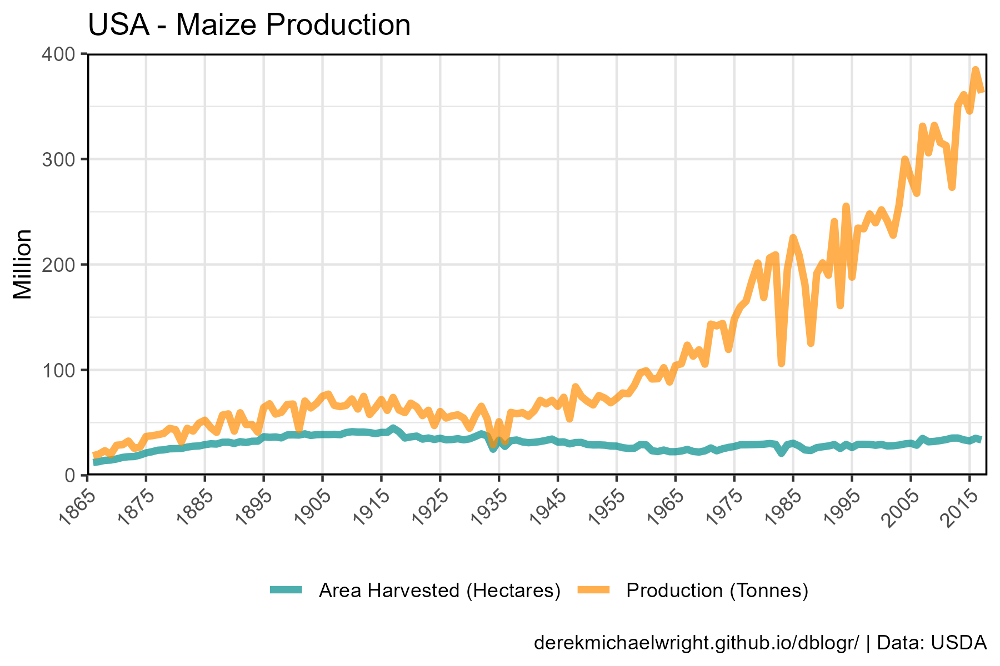
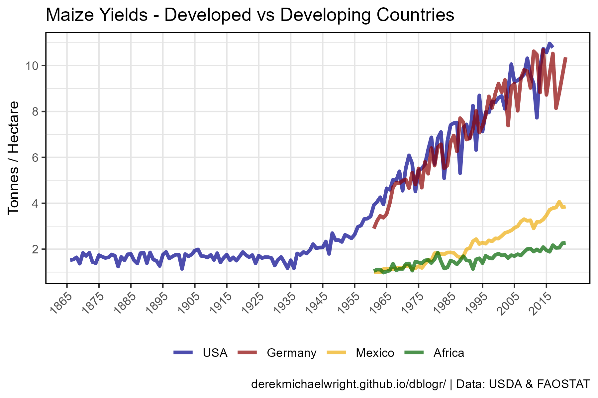
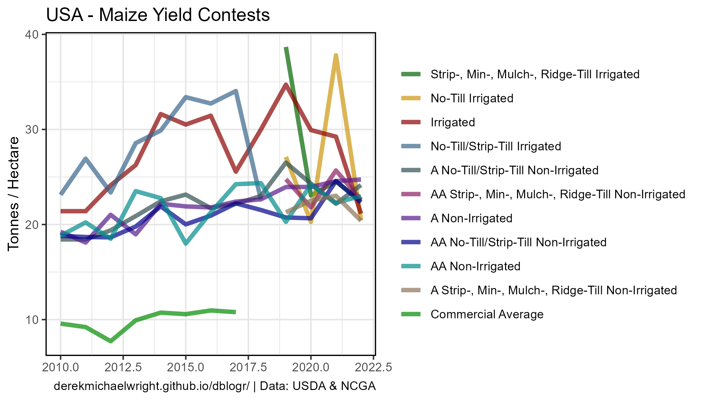
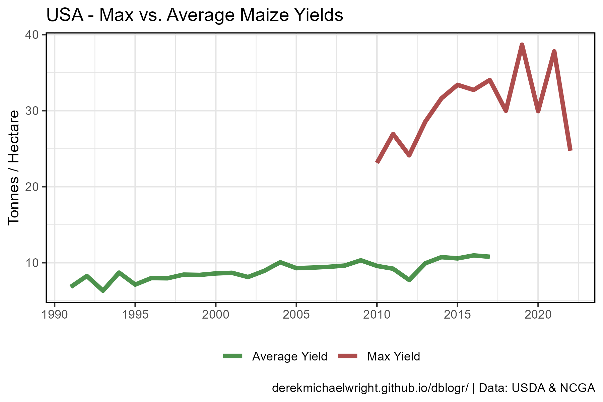
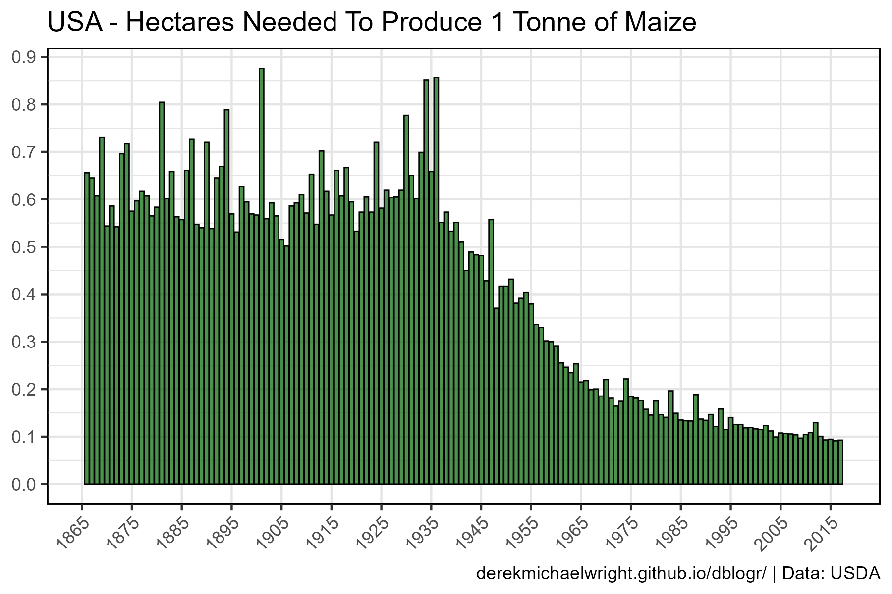
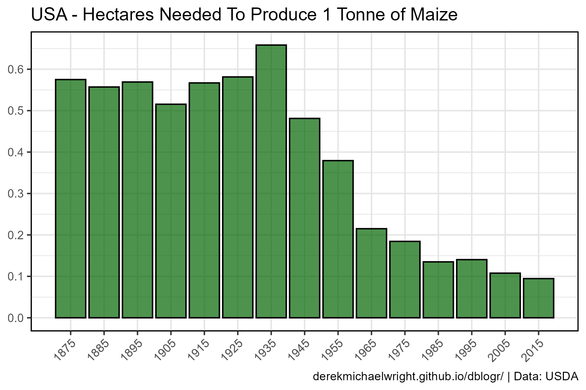
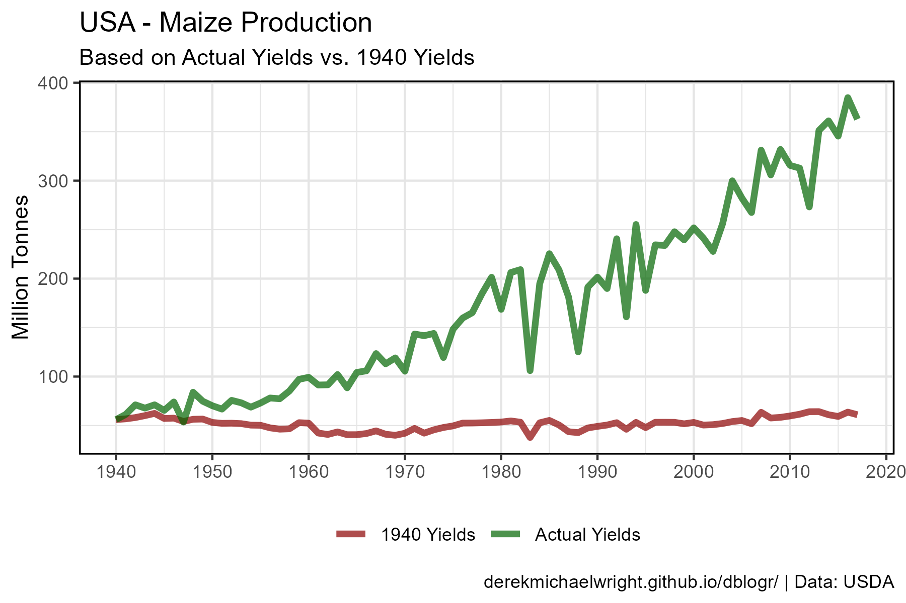
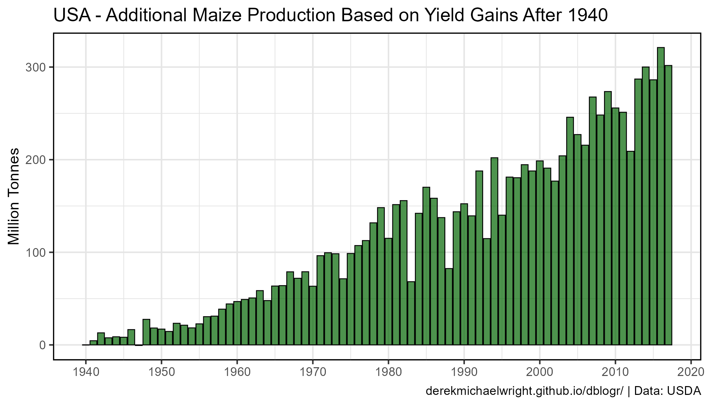
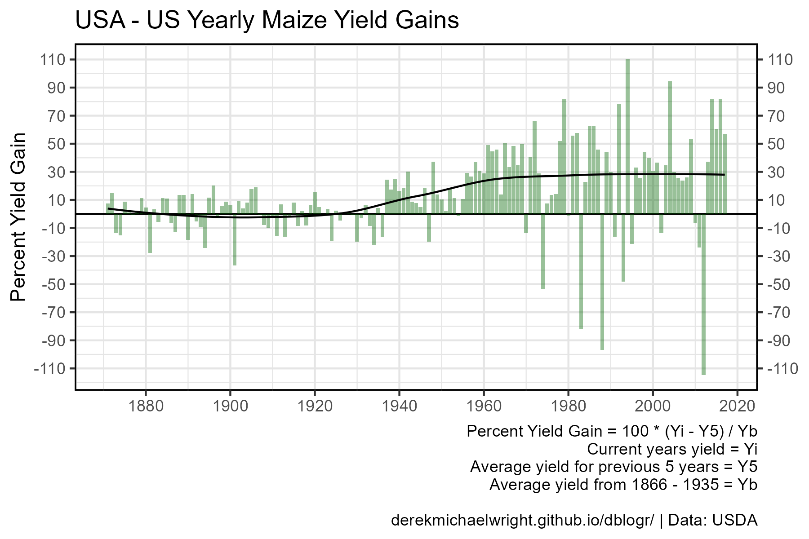

```{r setup, include = F}
knitr::opts_chunk$set(echo = T, message = F, warning = F)
```

---

# Data

`r shiny::icon("globe")` https://www.nass.usda.gov/

`r shiny::icon("globe")` https://www.ncga.com/

`r shiny::icon("globe")` https://www.ers.usda.gov/webdocs/publications/42517/13616_aib786_1_.pdf?v=1689.2

`r shiny::icon("save")` [agData_USDA_Grains.csv](https://github.com/derekmichaelwright/agData/raw/master/Data/agData_USDA_Grains.csv)

`r shiny::icon("save")` [agData_MaizeContest.csv](https://github.com/derekmichaelwright/agData/raw/master/Data/agData_MaizeContest.csv)

```{r class.source = 'fold-show'}
# devtools::install_github("derekmichaelwright/agData")
library(agData)
library(gganimate)
```

---

# Prepare Data

```{r}
# Prep data
myCaption1 = "derekmichaelwright.github.io/dblogr/ | Data: USDA"
myCaption2 = "derekmichaelwright.github.io/dblogr/ | Data: USDA & NCGA"
myCaption3 = "derekmichaelwright.github.io/dblogr/ | Data: USDA & FAOSTAT"
#
myColors <- c("darkcyan", "darkorange", "darkgreen", "darkred")
mylevels <- c("Open-Pollination", "Hybrid", "Biotech", "Yield Contest")
d1 <- agData_USDA_Grains %>% 
  filter(Crop == "Maize") %>%
  mutate(Era = ifelse(Year < 1937, mylevels[1], 
                 ifelse(Year < 1996, mylevels[2], mylevels[3])),
         Era = factor(Era, levels = mylevels))
d2 <- agData_MaizeContest
#
myColors_Areas <- c("darkblue", "darkred", "darkgoldenrod2", "darkgreen")
d3 <- agData_FAO_Crops %>% 
  filter(Crop == "Maize", Measurement == "Yield", 
         Area %in% c("Germany", "Mexico", "Africa"))
```

---

# Heterosis


```{r}
# Prep Data
xx <- d1 %>% filter(Measurement == "Yield")
# Calculate slopes
c1 <- xx %>% filter(Era == mylevels[1])
c2 <- xx %>% filter(Era == mylevels[2])
c3 <- xx %>% filter(Era == mylevels[3])
c1 <- round(summary(lm(data = c1, Value ~ Year))$coefficients[2] / 1000, 3)
c2 <- round(summary(lm(data = c2, Value ~ Year))$coefficients[2] / 1000, 3)
c3 <- round(summary(lm(data = c3, Value ~ Year))$coefficients[2] / 1000, 3)
# Plot Yields
mp <- ggplot(xx, aes(x = Year, y = Value / 1000, color = Era)) +
  geom_line(size = 1, alpha = 0.5, color = "black") +
  geom_line(size = 1.5, alpha = 0.7) + 
  scale_color_manual(name = "Breeding Era:", values = myColors) +
  scale_x_continuous(breaks = seq(1865, 2015, 10), minor_breaks = NULL) +
  scale_y_continuous(breaks = seq(0, 12, 2)) +
  coord_cartesian(xlim = c(1865, 2018), ylim = c(0, 11.5), expand = F) +
  theme_agData(legend.position = "bottom", 
               axis.text.x = element_text(angle = 45, hjust = 1)) + 
  labs(title = "USA - Maize Yields", x = NULL,  
       y = "Tonnes / Hectare", caption = myCaption1)
mp1 <- mp +
  stat_smooth(aes(x = Year, y = Value / 1000, group = Era), 
              geom = "line", method = "lm", se = F, 
              color = "black", alpha = 0.6) +
  annotate("text", x = 1900, y = 2.75, size = 4, label = paste("m =", c1)) +
  annotate("text", x = 1965, y = 6.5,  size = 4, label = paste("m =", c2)) +
  annotate("text", x = 2000, y = 11,   size = 4, label = paste("m =", c3)) 
ggsave("maize_usa_01.png", mp1, width = 6, height = 4)
```

```{r echo = F}
ggsave("featured.png", mp1, width = 6, height = 4)
```

---



```{r}
mp <- mp + transition_reveal(Year) 
anim_save("maize_usa_gif_01.gif", mp,
          nframes = 300, fps = 20, end_pause = 60, 
          width = 900, height = 600, res = 150)
```

---

# Maize Potential


```{r}
# Prep data
x2 <- d2 %>%
  filter(Unit == "kg/ha") %>% 
  mutate(Era = "Yield Contest",
         Measurement = "Yield") %>% 
  group_by(Era, Measurement, Year) %>% 
  summarise(Value = mean(Value))
xx <- bind_rows(d1, x2) %>%
  filter(Measurement == "Yield") %>%
  mutate(Era = factor(Era, levels = mylevels))
# Plot
mp <- ggplot(xx, aes(x = Year, y = Value / 1000, color = Era)) + 
  geom_line(size = 1.5, alpha = 0.7) +
  scale_color_manual(name = "Breeding Era:", values = myColors) +
  scale_x_continuous(breaks = seq(1865, 2015, 10), minor_breaks = NULL) +
  coord_cartesian(xlim = c(1865, 2019), ylim = c(0, 27), expand = F) +
  theme_agData(legend.position = "bottom", 
               axis.text.x = element_text(angle = 45, hjust = 1),
               legend.text=element_text(size = 7)) +
  labs(title = "USA - Maize Yields", x = NULL, 
       y = "Tonnes / Hectare", caption = myCaption2)
ggsave("maize_usa_02.png", mp, width = 6, height = 4)
```

---

# Area vs Production



```{r}
# Prep Data
myLabels <- c("Area Harvested (Hectares)", "Production (Tonnes)")
xx <- d1 %>% filter(Measurement %in% c("Area Harvested", "Production"))
# Plot Production
mp <- ggplot(xx) +
  geom_line(aes(x = Year, y = Value / 1000000, color = Measurement),
            size = 1.5, alpha = 0.7) + 
  scale_color_manual(name = NULL, values = myColors, labels = myColors) +
  scale_x_continuous(breaks = seq(1865, 2015, 10), minor_breaks = NULL) +
  coord_cartesian(xlim = c(1865, 2018), ylim = c(0,400), expand = 0) +
  theme_agData(legend.position = "bottom", 
               axis.text.x = element_text(angle = 45, hjust = 1)) +
  labs(title = "USA - Maize Production", x = NULL,  
       y = "Million", caption = myCaption1) 
ggsave("maize_usa_03.png", mp, width = 6, height = 4)
```

---

# Developed vs Developing Countries



```{r}
# Prep Data
xx <- bind_rows(d1, d3) %>%
  filter(Measurement == "Yield") %>%
  mutate(Area = factor(Area, levels = c("USA", "Germany", "Mexico", "Africa")))
# Plot
mp <- ggplot(xx, aes(x = Year, y = Value / 1000, color = Area)) +
  geom_line(size = 1.25, alpha = 0.7) + 
  scale_color_manual(name = NULL, values = myColors_Areas) +
  scale_x_continuous(breaks = seq(1865, 2015, 10), minor_breaks = NULL) +
  scale_y_continuous(breaks = seq(0, 12, 2)) +
  theme_agData(legend.position = "bottom", 
               axis.text.x = element_text(angle = 45, hjust = 1)) +
  labs(title = "Maize Yields - Developed vs Developing Countries", 
       y = "Tonnes / Hectare", x = NULL, caption = myCaption3)
ggsave("maize_usa_04.png", mp, width = 6, height = 4)
```

---

# Maize Contest



```{r}
# Prep data
x1 <- d1 %>% filter(Measurement == "Yield", Year >= 2010) %>%
  mutate(Measurement = "Commercial Average")
x2 <- d2 %>% filter(Unit == "kg/ha")
#
xx <- bind_rows(x1, x2) %>% 
  arrange(desc(Value)) %>%
  mutate(Measurement = factor(Measurement, levels = unique(Measurement)))
# Plot
mp <- ggplot(xx, aes(x = Year, y = Value / 1000, color = Measurement)) + 
  geom_line(size = 1.5, alpha = 0.7) + 
  scale_color_manual(name = NULL, values = agData_Colors) +
  theme_agData() +
  labs(title = "USA - Maize Yield Contests", x = NULL,
       y = "Tonnes / Hectare", caption = myCaption2)
ggsave("maize_usa_05.png", mp, width = 7, height = 4)
```

---

# Average vs Max Yield



```{r}
# Prep data
x1 <- d1 %>%  
  filter(Year > 1990, Measurement == "Yield") %>% 
  mutate(Measurement = "Average Yield")
x2 <- d2 %>% filter(Unit == "kg/ha") %>% 
  group_by(Year) %>% summarise(Value = max(Value)) %>% 
  mutate(Measurement = "Max Yield", Value = Value)
#
xx <- bind_rows(x1, x2) 
# Plot
mp <- ggplot(xx, aes(x = Year, y = Value / 1000, color = Measurement)) + 
  geom_line(size = 1.5, alpha = 0.7) + 
  scale_x_continuous(breaks = seq(1990, 2020, by = 5)) +
  scale_color_manual(name = NULL, values = c("darkgreen", "darkred")) +
  theme_agData(legend.position = "bottom") +
  labs(title = "USA - Max vs. Average Maize Yields",
       y = "Tonnes / Hectare", x = NULL, caption = myCaption2)
ggsave("maize_usa_06.png", mp, width = 6, height = 4)
```

---

# Hectares per tonne



```{r}
# Prep data
xx <- d1 %>% 
  filter(Measurement == "Yield") %>%
  mutate(Value = 1000 / Value)
# Plot
mp <- ggplot(xx, aes(x = Year, y = Value)) + 
  geom_bar(stat = "identity", color = "black",
           fill = "darkgreen", alpha = 0.7, lwd = 0.3) +
  scale_x_continuous(breaks = seq(1865, 2015, 10), minor_breaks = NULL) +
  scale_y_continuous(breaks = seq(0, 1, 0.1)) +
  theme_agData(axis.text.x = element_text(angle = 45, hjust = 1)) +
  labs(title = "USA - Hectares Needed To Produce 1 Tonne of Maize", 
       y = NULL, x = NULL, caption = myCaption1)
ggsave("maize_usa_07.png", mp, width = 6, height = 4)
```

---



```{r}
# Prep data
xx <- xx %>% filter(Year %in% seq(1875, 2015, by = 10))
# Plot
mp <- ggplot(xx, aes(x = Year, y = Value)) + 
  geom_bar(stat = "identity", color = "black", 
           fill = "darkgreen", alpha = 0.7) +
  scale_x_continuous(breaks = seq(1875, 2015, 10), minor_breaks = NULL) +
  scale_y_continuous(breaks = seq(0, 1, 0.1)) +
  theme_agData(axis.text.x = element_text(angle = 45, hjust = 1)) +
  labs(title = "USA - Hectares Needed To Produce 1 Tonne of Maize", 
       y = NULL, x = NULL, caption = myCaption1)
ggsave("maize_usa_08.png", mp, width = 6, height = 4)
```

---

# Yield Gains



```{r}
# Prep data
xx <- d1 %>% filter(Year >= 1940)
yy <- xx %>% filter(Year == 1940, Measurement == "Yield") %>% pull(Value)
x1 <- xx %>% filter(Measurement == "Area Harvested") %>%
  mutate(Value = Value * yy / 1000, 
         Measurement = "1940 Yields")
xx <- xx %>% filter(Measurement == "Production") %>% 
  mutate(Measurement = "Actual Yields") %>%
  bind_rows(x1)
# Plot
mp <- ggplot(xx, aes(x = Year, y = Value / 1000000, color = Measurement)) + 
  geom_line(size = 1.5, alpha = 0.7) +
  scale_color_manual(name = NULL, values = c("darkred", "darkgreen")) +
  scale_x_continuous(breaks = seq(1940, 2020, 10)) +
  theme_agData(legend.position = "bottom") +
  labs(title = "USA - Maize Production",
       subtitle = "Based on Actual Yields vs. 1940 Yields",
       y = "Million Tonnes", x = NULL, caption = myCaption1)
ggsave("maize_usa_09.png", mp, width = 6, height = 4)
```

---

# Addition Production



```{r}
# Prep data
xx <- xx %>% select(-Unit) %>% 
  spread(Measurement, Value) %>%
  mutate(Difference = `Actual Yields` - `1940 Yields`)
# Plot
mp <- ggplot(xx, aes(x = Year, y = Difference / 1000000)) + 
  geom_bar(stat = "identity",fill = "darkgreen", alpha = 0.7,
           color = "black", lwd = 0.3) +
  scale_x_continuous(breaks = seq(1940, 2020, 10)) +
  theme_agData() +
  labs(title = "USA - Additional Maize Production Based on Yield Gains After 1940",
       y = "Million Tonnes", x = NULL, caption = myCaption1)
ggsave("maize_usa_10.png", mp, width = 6, height = 4)
```

---

# Yield Increases



```{r}
# Prep data
xx <- agData_USDA_Grains %>% arrange(Year) %>%
  filter(Measurement == "Yield", Crop == "Maize")
xb <- mean(xx %>% filter(Year <= 1935) %>% pull(Value))   
# Calculate yield gains compared to 1935
xx$YieldGains <- NA
for(i in 6:nrow(xx)) { 
  xx$YieldGains[i] <- 100 * (xx$Value[i] - mean(xx$Value[(i-1):(i-6)])) / xb
}
#
myCaption4 <- paste("Percent Yield Gain = 100 * (Yi - Y5) / Yb",
                    "Current years yield = Yi", 
                    "Average yield for previous 5 years = Y5",
                    "Average yield from 1866 - 1935 = Yb\n", 
                    myCaption1, sep = "\n")
# Plot
mp <- ggplot(xx, aes(x = Year, y = YieldGains)) + 
  geom_hline(yintercept = 0) +
  geom_bar(stat = "identity", fill = "darkgreen", alpha = 0.4) + 
  stat_smooth(geom = "line", method = "loess", se = F) +
  scale_x_continuous(breaks = seq(1860, 2020, 20)) +
  scale_y_continuous(breaks = seq(-110, 110, 20), 
                     sec.axis = sec_axis(~ ., breaks = seq(-110, 110, 20))) +
  theme_agData() +
  labs(title = "USA - US Yearly Maize Yield Gains", 
       y = "Percent Yield Gain",  x = NULL, caption = myCaption4)
ggsave("maize_usa_11.png", mp, width = 6, height = 4)
```

---

```{r eval = F, echo = F}

  xx %>% filter(Year %in% c(1961, 2017)) %>% spread(Year, Value) %>%
  mutate(Percent = 100 * 2017 / 1961)
# Calculate per year yield gains
myYears <- unique(xx$Year) 
for(i in 1:length(myYears)) { 
  xx$Percent[xx$Year==myYears[i]] <- 100 * 
    (xx$Value[xx$Year==myYears[i]] - xx$Value[xx$Year==myYears[i-1]]) / 
  xx$Value[xx$Year==myYears[i]]
}
xx <- xx %>% mutate(Percent = movingAverage(Percent, n = 10))
# Plot
mp <- ggplot(xx, aes(x = Year, y = Percent)) + 
  geom_hline(yintercept = 0) +
  geom_line(size = 1.5, alpha = 0.7, color = "darkgreen") + 
  theme_agData() +
  labs(title = "Maize - US Yearly Yield Gains", 
       subtitle = "10 year rolling average", x = NULL,
       caption = "\u00A9 www.dblogr.com/  |  Data: USDA")
ggsave("maize_usa_11.png", mp, width = 6, height = 4)
```

```{r eval = F}
# Prep Data
myColors <- c("darkcyan", "darkorange", "darkgreen")
mylevels <- c("Open-Pollination", "Hybrid", "Biotech")
xx <- agData_USDA_Grains %>% 
  filter(Crop == "Maize") %>%
  mutate(Era = ifelse(Year < 1937, mylevels[1], 
                 ifelse(Year < 1996, mylevels[2], mylevels[3])),
         Era = factor(Era, levels = mylevels))
x1 <- xx %>% filter(Measurement == "Yield")
# Calculate slopes
c1 <- x1 %>% filter(Era == mylevels[1])
c2 <- x1 %>% filter(Era == mylevels[2])
c3 <- x1 %>% filter(Era == mylevels[3])
c1 <- round(summary(lm(data = c1, Value ~ Year))$coefficients[2] / 1000, 3)
c2 <- round(summary(lm(data = c2, Value ~ Year))$coefficients[2] / 1000, 3)
c3 <- round(summary(lm(data = c3, Value ~ Year))$coefficients[2] / 1000, 3)
# Plot Yields
mp <- ggplot(x1, aes(x = Year, y = Value / 1000, color = Era)) +
  geom_line(size = 1, alpha = 0.5, color = "black") +
  geom_line(size = 1.5, alpha = 0.7) + 
  scale_color_manual(name = "Breeding Era:", values = myColors) +
  scale_fill_manual(name = "Breeding Era:",  values = myColors) +
  scale_x_continuous(breaks = seq(1865, 2015, 10), minor_breaks = NULL) +
  scale_y_continuous(breaks = seq(0, 12, 2)) +
  coord_cartesian(xlim = c(1865, 2018), ylim = c(0, 11.5), expand = F) +
  theme_agData(legend.position = "bottom", 
               axis.text.x = element_text(angle = 45, hjust = 1)) + 
  labs(title = "Maize Yields in the United States", 
       y = "Tonnes / Hectare", x = NULL, caption = myCaption1)
mp1 <- mp +
  stat_smooth(aes(x = Year, y = Value / 1000, group = Era), 
              geom = "line", method = "lm", se = F, 
              color = "black", alpha = 0.6) +
  annotate("text", x = 1900, y = 2.75, size = 4, label = paste("m =", c1)) +
  annotate("text", x = 1965, y = 6.5,  size = 4, label = paste("m =", c2)) +
  annotate("text", x = 2005, y = 11,   size = 4, label = paste("m =", c3)) 
ggsave("maize_usa_01.png", mp1, width = 6, height = 4)
```
