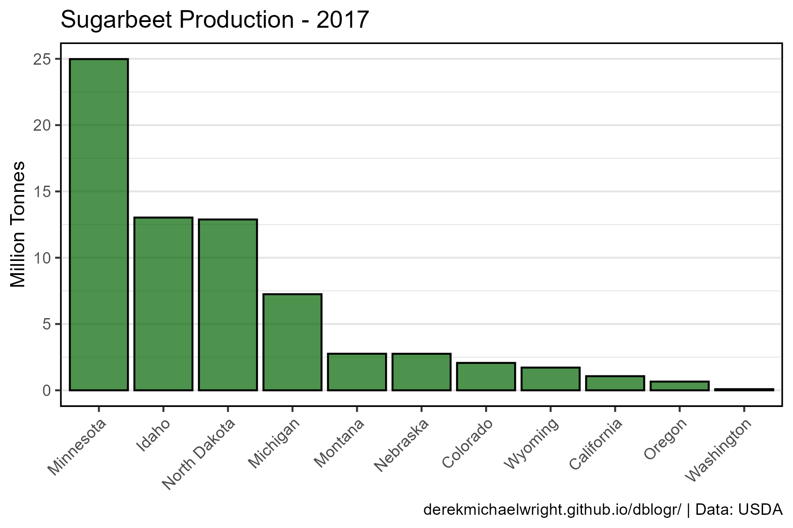
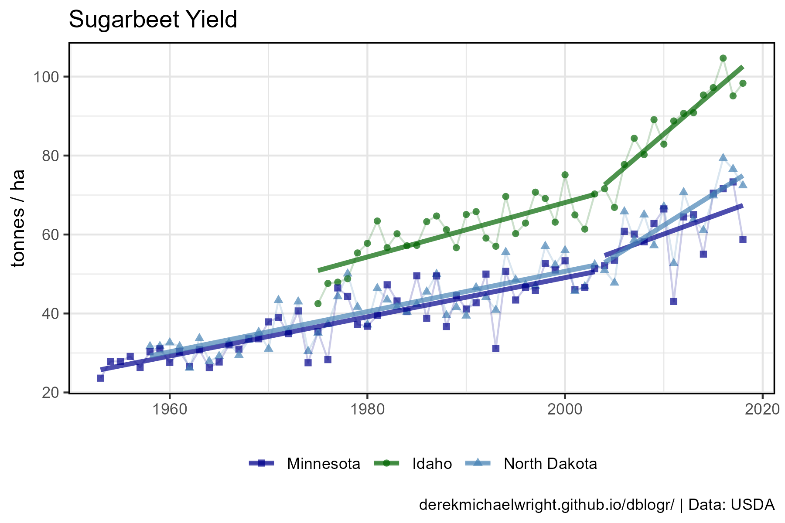

```{r setup, include = FALSE}
knitr::opts_chunk$set(echo = T, warning = F, message = F)
```

---

# Data

> - `r shiny::icon("globe")` [https://www.nass.usda.gov/](https://www.nass.usda.gov/){target="_blank"}
> - `r shiny::icon("save")` [agData_USDA_Sugarbeet.csv](https://github.com/derekmichaelwright/agData/raw/master/Data/agData_USDA_Sugarbeet.csv)

---

# Prepare Data

```{r class.source = "fold-show"}
# devtools::install_github("derekmichaelwright/agData")
library(agData)
```

```{r}
# Prep data
dd <- agData_USDA_Sugarbeet
myCaption <- "derekmichaelwright.github.io/dblogr/ | Data: USDA"
```

---

# Production 

## 2017



```{r}
# Prep data
xx <- dd %>% 
  filter(Measurement == "Production", Year == 2017) %>% 
  group_by(State) %>%
  summarise(Value = sum(Value)) %>%
  ungroup() %>% arrange(desc(Value)) %>%
  mutate(State = factor(State, levels = .$State))
# Plot
mp <- ggplot(xx, aes(x = State, y = Value / 1000000)) + 
  geom_bar(stat = "identity", color = "black", 
           fill = "darkgreen", alpha = 0.7) + 
  theme_agData_col(axis.text.x = element_text(angle = 45, hjust = 1)) +
  labs(title = "Sugarbeet Production - 2017", x = NULL,
       y = "Million Tonnes", caption = myCaption)
ggsave("sugarbeet_usa_01.png", mp, width = 6, height = 4)
```

---

# All Data


```{r}
# Prep data
xx <- agData_USDA_Sugarbeet %>% 
  filter(Measurement == "Production") %>% 
  group_by(Year, State) %>%
  summarise(Value = sum(Value))
# Plot
mp <- ggplot(xx, aes(x = Year, y = Value / 1000000)) + 
  geom_line(color = "darkgreen", alpha = 0.7) + 
  facet_wrap(State ~ ., ncol = 6) +
  theme_agData(axis.text.x = element_text(angle = 45, hjust = 1)) +
  labs(title = "Sugarbeet Production", x = NULL,
       y = "Million Tonnes", caption = myCaption)
ggsave("sugarbeet_usa_02.png", mp, width = 10, height = 6)
```

---

# Yield {.tabset .tabset-pills}

## Minnesota + Idaho + North Dakota



```{r}
# Prep data
myColors <- c("darkblue", "darkgreen", "steelblue")
myStates <- c("Minnesota", "Idaho", "North Dakota")
xx <- agData_USDA_Sugarbeet %>% 
  filter(Measurement == "Yield", State %in% myStates) %>% 
  group_by(Year, State) %>%
  summarise(Value = mean(Value)) %>%
  ungroup() %>% arrange(desc(Value)) %>%
  mutate(State = factor(State, levels = myStates),
         Group = ifelse(Year < 2004, "1", "2"),
         Group = paste(State, Group) )
# Plot
mp <- ggplot(xx, aes(x = Year, y = Value / 1000, 
                     color = State, shape = State)) + 
  geom_point(alpha = 0.7) +
  geom_line(alpha = 0.2) +
  stat_smooth(aes(group = Group), geom = "line", method = "lm", 
              se = F, size = 1.25, alpha = 0.7) +
  scale_color_manual(name = NULL, values = myColors) +
  scale_shape_manual(name = NULL, values = c(15:17)) +
  theme_agData(legend.position = "bottom") +
  labs(title = "Sugarbeet Yield", x = NULL,
       y = "tonnes / ha", caption = myCaption)
ggsave("sugarbeet_usa_03.png", mp, width = 6, height = 4)
```

```{r echo = F}
ggsave("featured.png", mp, width = 6, height = 4)
```

---

## Wyoming + Colorado + Nebraska


```{r}
# Prep data
myColors <- c("darkred", "antiquewhite4", "darkgoldenrod2")
myStates <- c("Wyoming", "Colorado", "Nebraska")
xx <- agData_USDA_Sugarbeet %>% 
  filter(Measurement == "Yield", State %in% myStates) %>% 
  group_by(Year, State) %>%
  summarise(Value = mean(Value)) %>%
  ungroup() %>% arrange(desc(Value)) %>%
  mutate(State = factor(State, levels = myStates),
         Group = ifelse(Year < 2004, "1", "2"),
         Group = paste(State, Group) )
# Plot
mp <- ggplot(xx, aes(x = Year, y = Value / 1000, 
                     color = State, shape = State)) + 
  geom_point(alpha = 0.7) +
  geom_line(alpha = 0.2) +
  stat_smooth(aes(group = Group), geom = "line", method = "lm", 
              se = F, size = 1.25, alpha = 0.7) +
  scale_color_manual(name = NULL, values = myColors) +
  scale_shape_manual(name = NULL, values = c(15:17)) +
  theme_agData(legend.position = "bottom") +
  labs(title = "Sugarbeet Yield", x = NULL,
       y = "tonnes / ha", caption = myCaption)
ggsave("sugarbeet_usa_04.png", mp, width = 6, height = 4)
```

---

```{r eval = F, echo = F}
# Prep data
myColors <- c("darkblue", "darkgreen", "steelblue")
myStates <- c("Minnesota", "Idaho", "North Dakota")
xx <- agData_USDA_Sugarbeet %>% 
  filter(Measurement != "Yield", State == "Minnesota") %>% 
  mutate(Group = ifelse(Year < 2004, "1", "2"),
         Group = paste(County, Group) )
# Plot
mp <- ggplot(xx, aes(x = Year, y = Value / 1000, 
                     color = County, shape = County)) + 
  #geom_point(alpha = 0.7) +
  geom_line(alpha = 0.3) +
  #stat_smooth(aes(group = Group), geom = "line", method = "lm", 
  #            se = F, size = 1.25, alpha = 0.7) +
  facet_grid(Measurement ~ ., scales = "free_y") +
  #scale_color_manual(name = NULL, values = myColors) +
  #scale_shape_manual(name = NULL, values = c(15:17)) +
  theme_agData(legend.position = "none") +
  labs(title = "Sugarbeet Yield", x = NULL,
       y = "tonnes / ha", caption = myCaption)
ggsave("sugarbeet_usa_05.png", mp, width = 6, height = 4)
```
