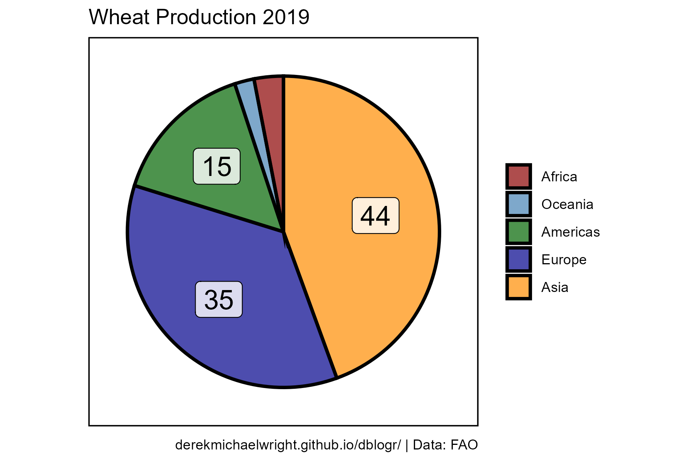
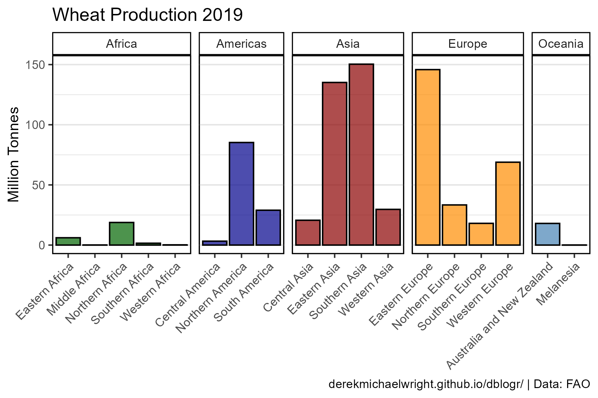
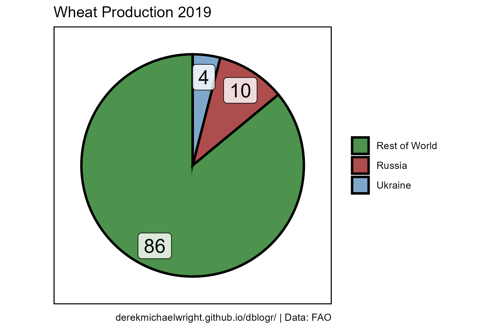
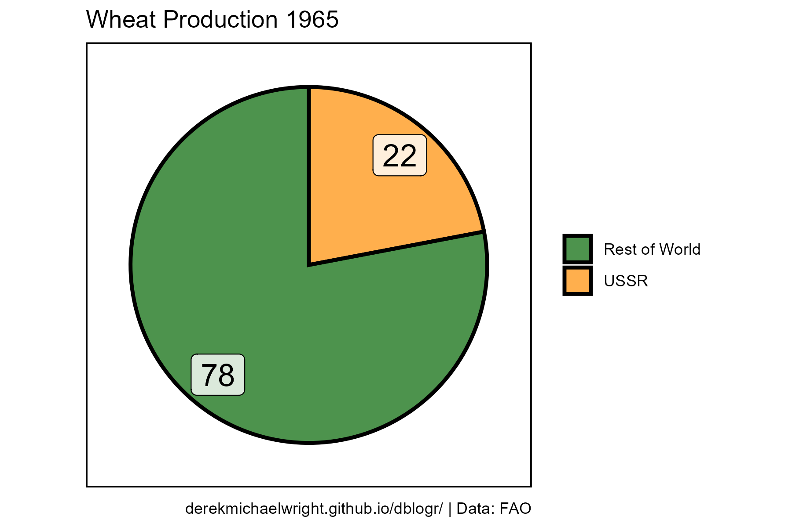

```{r setup, include = FALSE}
knitr::opts_chunk$set(echo = T, message = F, warning = F)
```

---

# Data

> - `r shiny::icon("globe")` [http://www.fao.org/faostat/en/#data/QC](http://www.fao.org/faostat/en/#data/QC){target="_blank"}
> - `r shiny::icon("save")` [agData_FAO_Livestock.csv.gz](https://github.com/derekmichaelwright/agData/raw/master/Data/agData_FAO_Livestock.csv.gz)

> - `r shiny::icon("save")` [agData_FAO_Country_Table.csv.gz](https://github.com/derekmichaelwright/agData/raw/master/Data/agData_FAO_Country_Table.csv.gz)

# Prepare Data

```{r class.source = "fold-show"}
# devtools::install_github("derekmichaelwright/agData")
library(agData)
```

```{r}
# Prep data
myCaption <- "derekmichaelwright.github.io/dblogr/ | Data: FAO"
#
dd <- agData_FAO_Crops %>% filter(Item == "Wheat")
```

---

# PDF - All Wheat Data

> - `r shiny::icon("file-pdf")` [figures_wheat_fao.pdf](https://dblogr.com/agdata/wheat/figures_wheat_fao.pdf)

```{r results="hide"}
# Prep data
myColors <- c("darkgreen", "darkred", "darkgoldenrod2")
myAreas <- c("World",
  unique(agData_FAO_Region_Table$Region),
  unique(agData_FAO_Region_Table$SubRegion),
  unique(agData_FAO_Country_Table$Country))
xx <- dd %>%
  mutate(Value = ifelse(Measurement %in% c("Area Harvested", "Production"),
                        Value / 1000000, Value / 1000),
         Unit = plyr::mapvalues(Unit, c("Hectares", "Tonnes", "kg/ha"), 
                  c("Million Hectares", "Million Tonnes", "Tonnes/ Hectare")))
myAreas <- myAreas[myAreas %in% xx$Area]
# Plot
pdf("figures_wheat_fao.pdf", width = 12, height = 4)
for(i in myAreas) {
  print(ggplot(xx %>% filter(Area == i)) +
    geom_line(aes(x = Year, y = Value, color = Measurement),
              size = 1.5, alpha = 0.7) +
    facet_wrap(. ~ Measurement + Unit, ncol = 3, scales = "free_y") +
    theme_agData(legend.position = "none", 
                 axis.text.x = element_text(angle = 45, hjust = 1)) +
    scale_color_manual(values = myColors) +
    scale_x_continuous(breaks = seq(1960, 2020, by = 5) ) +
    labs(title = i, y = NULL, x = NULL, caption = myCaption) )
}
dev.off()
```

---

# Production {.tabset .tabset-pills}

## Regions



```{r}
# Prep data
myColors <- c("darkred", "steelblue", "darkgreen", "darkblue", "darkorange")
myAreas <- c("Africa", "Oceania", "Americas", "Europe", "Asia" )
xx <- dd %>% 
  filter(Area %in% myAreas, 
         Measurement == "Production", Year == 2019) %>%
  mutate(Area = factor(Area, levels = myAreas)) %>%
  arrange(desc(Area)) %>%
  mutate(Prop = round(100 * Value / sum(Value)),
         Label = ifelse(Prop > 5, Prop, NA),
         ypos = cumsum(Prop) - 0.5 * Prop )
# Plot
mp <- ggplot(xx, aes(x = "", y = Prop, fill = Area)) +
  geom_col(width = 1, color = "black", alpha = 0.7, lwd = 1) +
  coord_polar("y", start = 0) +
  geom_label(aes(y = ypos, label = Label), nudge_x = 0.1,
             fill = "white", color = "black", alpha = 0.8, size = 6) +
  scale_fill_manual(name = NULL, values = myColors) +
  theme_agData_pie() +
  labs(title = "Wheat Production 2019", caption = myCaption) 
ggsave("wheat_01.png", mp, width = 6, height = 4)
```

```{r echo = F}
ggsave("featured.png", mp, width = 6, height = 4)
```

---

## SubRegions



```{r}
# Prep data
myColors <- c("darkgreen", "darkblue", "darkred", "darkorange", "steelblue")
xx <- dd %>% 
  filter(Measurement == "Production", Year == 2019,
         Area %in% agData_FAO_Region_Table$SubRegion) %>%
  left_join(select(agData_FAO_Region_Table, Area=SubRegion, Region), 
            by = "Area")
# Plot
mp <- ggplot(xx, aes(x = Area, y = Value / 1000000, fill = Region)) +
  geom_col(color = "black", alpha = 0.7) +
  facet_grid(. ~ Region, scales = "free_x", space = "free_x") +
  scale_fill_manual(values = myColors) +
  theme_agData_col(legend.position = "none",
                   axis.text.x = element_text(angle = 45, hjust = 1)) +
  labs(title = "Wheat Production 2019", x = NULL,
       y = "Million Tonnes", caption = myCaption) 
ggsave("wheat_02.png", mp, width = 6, height = 4)
```

---

## Russia & Ukraine {.tabset .tabset-pills}

### All Years


```{r}
# Prep data
myColors <- c("darkgreen", "darkred", "steelblue", "darkorange")
myAreas <- c(c("Rest of World", "Russia", "Ukraine", "USSR"))
xx <- dd %>% 
  filter(Measurement == "Production",
         Area %in% agData_FAO_Country_Table$Country)
x1 <- xx %>% filter(Area %in% myAreas)
x2 <- xx %>% filter(!Area %in% myAreas) %>%
  group_by(Year) %>%
  summarise(Value = sum(Value)) %>%
  mutate(Area = "Rest of World")
xx <- bind_rows(x1, x2) %>%
  mutate(Area = factor(Area, levels = myAreas))
# Plot
mp <- ggplot(xx, aes(x = Year, y = Value / 1000000, fill = Area)) +
  geom_col(color = "black", alpha = 0.7) +
  scale_fill_manual(name = NULL, values = myColors) +
  theme_agData() +
  labs(title = "Global Wheat Production", x = NULL, 
       y = "Million Tonnes", caption = myCaption) 
ggsave("wheat_03.png", mp, width = 6, height = 4)
```

---

### 2019



```{r}
# Prep data
x1 <- xx %>% 
  filter(Year == 2019) %>%
  arrange(desc(Area)) %>%
  mutate(Prop = round(100 * Value / sum(Value)),
         ypos = cumsum(Prop) - 0.5 * Prop )
# Plot
mp <- ggplot(x1, aes(x = "", y = Prop, fill = Area)) +
  geom_bar(stat = "identity", width = 1,
           color = "black", alpha = 0.7, lwd = 1) +
  coord_polar("y", start = 0) +
  geom_label(aes(y = ypos, label = Prop), nudge_x = 0.3,
             fill = "white", color = "black", alpha = 0.8, size = 6) +
  scale_fill_manual(name = NULL, values = myColors) +
  theme_agData_pie() +
  labs(title = "Wheat Production 2019", caption = myCaption) 
ggsave("wheat_04.png", mp, width = 6, height = 4)
```

---

### 1965



```{r}
# Prep data
myColors <- c("darkgreen", "darkorange")
x1 <- xx %>% 
  filter(Year == 1965) %>%
  arrange(desc(Area)) %>%
  mutate(Prop = round(100 * Value / sum(Value)),
         ypos = cumsum(Prop) - 0.5 * Prop )
# Plot
mp <- ggplot(x1, aes(x = "", y = Prop, fill = Area)) +
  geom_col(width = 1, color = "black", alpha = 0.7, lwd = 1) +
  coord_polar("y", start = 0) +
  geom_label(aes(y = ypos, label = Prop), nudge_x = 0.3,
             fill = "white", color = "black", alpha = 0.8, size = 6) +
  scale_fill_manual(name = NULL, values = myColors) +
  theme_agData_pie() +
  labs(title = "Wheat Production 1965", caption = myCaption) 
ggsave("wheat_05.png", mp, width = 6, height = 4)
```

---
