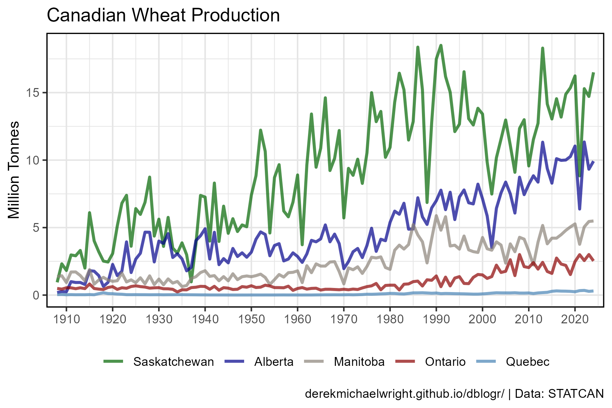
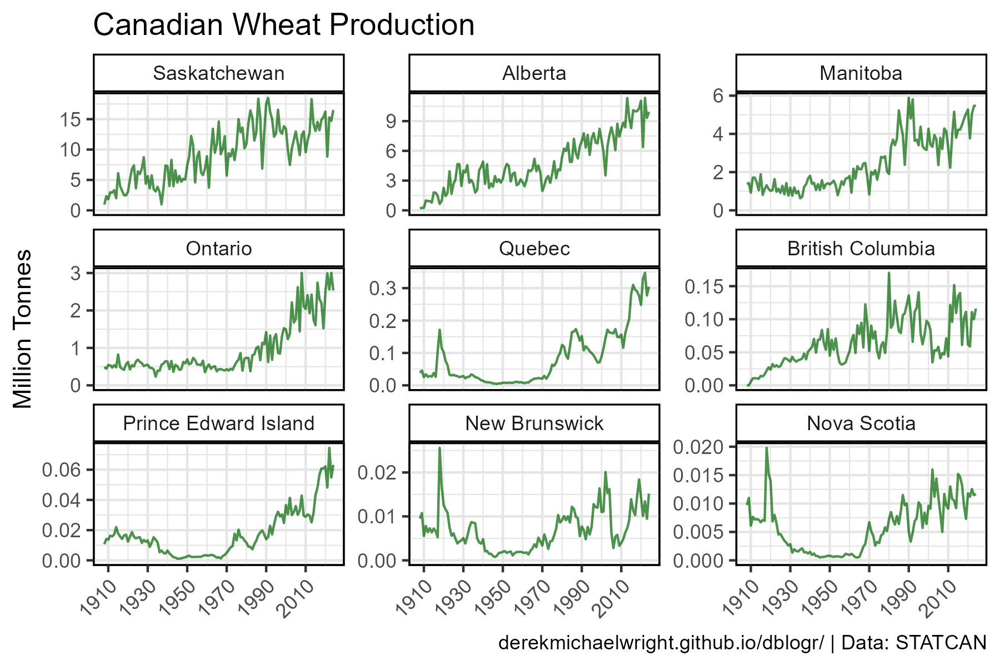
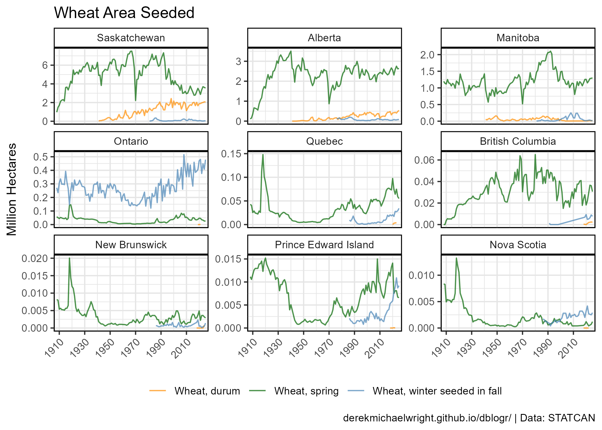
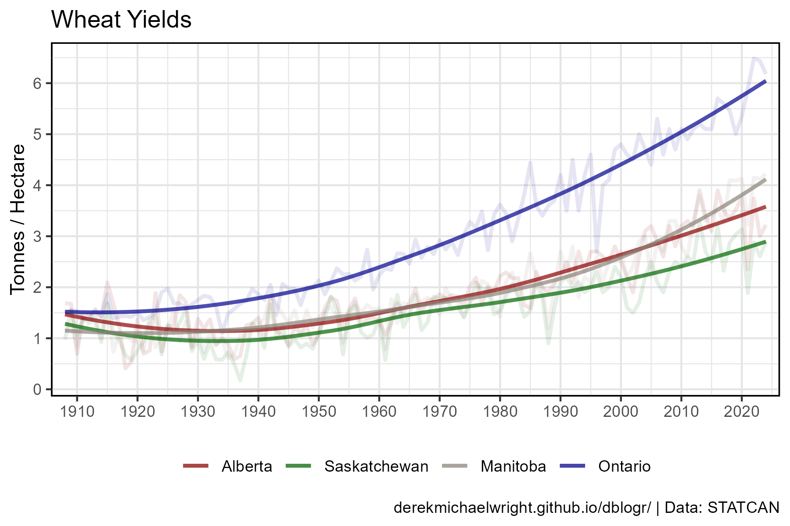
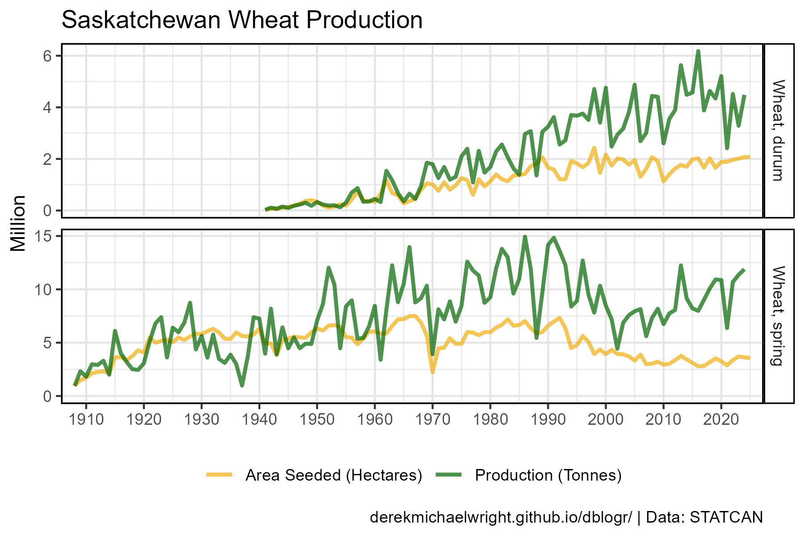

```{r setup, include = FALSE}
knitr::opts_chunk$set(echo = T, message = F, warning = F)
```

---

# Data

> - `r shiny::icon("globe")` https://www150.statcan.gc.ca/t1/tbl1/en/cv.action?pid=3210035901
> - `r shiny::icon("save")` [agData_STATCAN_Crops.csv.gz](https://github.com/derekmichaelwright/agData/raw/master/Data/agData_STATCAN_Crops.csv.gz)
> - `r shiny::icon("save")` [agData_STATCAN_Crops2.csv.gz](https://github.com/derekmichaelwright/agData/raw/master/Data/agData_STATCAN_Crops2.csv.gz)

---

# Prepare Data

```{r class.source = "fold-show"}
# devtools::install_github("derekmichaelwright/agData")
library(agData)
```

```{r}
# Prep data
myCaption <- "www.dblogr.com/ or derekmichaelwright.github.io/dblogr/ | Data: STATCAN"
# 
d1 <- agData_STATCAN_Crops %>% filter(Item == "Wheat")
#
myCrops <- c("Wheat, durum", "Wheat, spring", "Wheat, winter seeded in fall")
d2 <- agData_STATCAN_Crops2 %>% 
  filter(Item %in% myCrops) %>%
  mutate(Item = factor(Item, levels = myCrops))
```

---

# Production {.tabset .tabset-pills}

## Regions



```{r}
# Prep data
myAreas <- c("Saskatchewan", "Alberta", "Manitoba", "Ontario", "Quebec")
myColors <- c("darkgreen", "darkblue", "antiquewhite4", "darkred", "steelblue")
xx <- d1 %>% 
  filter(Measurement == "Production", Area %in% myAreas) %>%
  mutate(Area = factor(Area, levels = myAreas))
# Plot
mp <- ggplot(xx, aes(x = Year, y = Value / 1000000, color = Area)) +
  geom_line(size = 1, alpha = 0.7) +
  scale_color_manual(name = NULL, values = myColors) +
  scale_x_continuous(breaks = seq(1910, 2020, 10), expand = c(0.02,0)) +
  theme_agData(legend.position = "bottom") +
  labs(title = "Canadian Wheat Production", x = NULL,
       y = "Million Tonnes", caption = myCaption)
ggsave("wheat_canada_01.png", mp, width = 6, height = 4)
```

---

## All Provinces



```{r}
# Prep data
myAreas <- c("Saskatchewan", "Alberta", "Manitoba", 
             "Ontario", "Quebec", "British Columbia", 
             "Prince Edward Island", "New Brunswick", "Nova Scotia")
xx <- d1 %>% 
  filter(Measurement == "Production", Area %in% myAreas) %>%
  mutate(Area = factor(Area, levels = myAreas))
# Plot
mp <- ggplot(xx, aes(x = Year, y = Value / 1000000)) +
  geom_line(color = "darkgreen", alpha = 0.7) +
  facet_wrap(Area ~ ., scales = "free_y") +
  scale_x_continuous(breaks = seq(1910, 2010, 20)) +
  expand_limits(y = 0) +
  theme_agData(legend.position = "bottom",
               axis.text.x = element_text(angle = 45, hjust = 1)) +
  labs(title = "Canadian Wheat Production", x = NULL,
       y = "Million Tonnes", caption = myCaption)
ggsave("wheat_canada_02.png", mp, width = 6, height = 4)
```

---

# Wheat Types {.tabset .tabset-pills}

## Regions


```{r}
# Prep data
myColors <- c("darkorange", "darkgreen", "steelblue")
myAreas <- c("Prairie Provinces", "Ontario", "Quebec", "Maritime Provinces")
xx <- d2 %>% 
  filter(Measurement == "Area Seeded", Area %in% myAreas) %>%
  mutate(Area = factor(Area, levels = myAreas))
# Plot
mp <- ggplot(xx, aes(x = Year, y = Value / 1000000, color = Item)) +
  geom_line(size = 0.75, alpha = 0.7) +
  facet_wrap(Area ~ ., scales = "free_y") +
  scale_x_continuous(breaks = seq(1910, 2010, 20), expand = c(0.02,0)) +
  scale_color_manual(name = NULL, values = myColors) +
  theme_agData(legend.position = "bottom") +
  labs(title = "Area Seeded", x = NULL,
       y = "Million Hectares", caption = myCaption) 
ggsave("wheat_canada_03.png", mp, width = 6, height = 4)
```

---

## All Provinces



```{r}
# Prep data
myColors <- c("darkorange", "darkgreen", "steelblue")
myAreas <- c("Saskatchewan", "Alberta", "Manitoba", 
             "Ontario", "Quebec", "British Columbia",
             "New Brunswick", "Prince Edward Island", "Nova Scotia")
xx <- d2 %>% 
  filter(Measurement == "Area Seeded", Area %in% myAreas) %>%
  mutate(Area = factor(Area, levels = myAreas))
# Plot
mp <- ggplot(xx, aes(x = Year, y = Value / 1000000, color = Item)) +
  geom_line(alpha = 0.7) +
  facet_wrap(Area ~ ., scales = "free_y") +
  scale_color_manual(name = NULL, values = myColors) +
  scale_x_continuous(breaks = seq(1910, 2010, 20), expand = c(0.02,0)) +
  theme_agData(legend.position = "bottom",
               axis.text.x = element_text(angle = 45, hjust = 1)) +
  labs(title = "Wheat Area Seeded", x = NULL,
       y = "Million Hectares", caption = myCaption) 
ggsave("wheat_canada_04.png", mp, width = 7, height = 5)
```

---

# Yields {.tabset .tabset-pills}

## Regions



```{r}
# Prep data
myAreas <- c("Alberta", "Saskatchewan", "Manitoba", "Ontario")
myColors <- c("darkred", "darkgreen", "antiquewhite4", "darkblue")
xx <- d1 %>% 
  filter(Measurement == "Yield", Area %in% myAreas) %>%
  mutate(Area = factor(Area, levels = myAreas))
# Plot
mp <- ggplot(xx, aes(x = Year, y = Value / 1000, color = Area)) +
  geom_line(size = 1, alpha = 0.1) +
  stat_smooth(geom = "line", method = "loess", se = F, size = 1, alpha = 0.7) +
  scale_color_manual(name = NULL, values = myColors) +
  scale_x_continuous(breaks = seq(1910, 2020, 10), expand = c(0.02,0)) +
  scale_y_continuous(breaks = seq(0, 6, 1)) +
  theme_agData(legend.position = "bottom") +
  labs(title = "Wheat Yields", x = NULL,
       y = "Tonnes / Hectare", caption = myCaption)
ggsave("wheat_canada_05.png", mp, width = 6, height = 4)
```

```{r echo = F}
ggsave("featured.png", mp, width = 6, height = 4)
```

---

## Saskatchewan 



```{r}
# Prep data
myMeasures <- c("Production", "Area Seeded")
xx <- d2 %>% 
  filter(Area == "Saskatchewan", 
         Item %in% c("Wheat, durum", "Wheat, spring"),
         Measurement %in% myMeasures) %>%
  mutate(Measurement = plyr::mapvalues(Measurement, myMeasures,
                          c("Production (Tonnes)", "Area Seeded (Hectares)")))
# Plot
mp <- ggplot(xx, aes(x = Year, y = Value / 1000000, color = Measurement)) +
  geom_line(size = 1, alpha = 0.7) +
  facet_grid(Item ~ ., scales = "free_y") +
  scale_color_manual(name = NULL, values = c("darkgoldenrod2", "darkgreen")) +
  scale_x_continuous(breaks = seq(1910, 2020, 10), expand = c(0.02,0)) +
  expand_limits(y = 0) +
  theme_agData(legend.position = "bottom") +
  labs(title = "Saskatchewan Wheat Production", x = NULL,
       y = "Million", caption = myCaption) 
ggsave("wheat_canada_06.png", mp, width = 6, height = 4)
```

---

## Ontario 


```{r}
# Prep data
myMeasures <- c("Production", "Area Seeded")
myCrops <- c("Wheat, spring", "Wheat, winter",
             "Wheat, winter seeded in fall", "Wheat, winter remaining")
xx <- agData_STATCAN_Crops2 %>% 
  filter(Area == "Ontario", Item %in% myCrops,
         Measurement %in% myMeasures) %>%
  filter(!(Item == "Wheat, winter remaining" & Measurement == "Area Seeded")) %>%
  mutate(Item = plyr::mapvalues(Item, myCrops[3:4], rep(myCrops[2],2)),
         Measurement = plyr::mapvalues(Measurement, myMeasures,
                          c("Production (Tonnes)", "Area Seeded (Hectares)")))
# Plot
mp <- ggplot(xx, aes(x = Year, y = Value / 1000000, color = Measurement)) +
  geom_line(size = 1, alpha = 0.7) +
  facet_grid(Item ~ ., scales = "free_y") +
  scale_color_manual(name = NULL, values = c("darkgoldenrod2", "darkgreen")) +
  scale_x_continuous(breaks = seq(1910, 2020, 10), expand = c(0.02,0)) +
  theme_agData(legend.position = "bottom") +
  labs(title = "Ontario Wheat Production", x = NULL,
       y = "Million", caption = myCaption) 
ggsave("wheat_canada_07.png", mp, width = 6, height = 4)
```

```{r eval = F, echo = F}
myCrops <- c("Wheat, Canada Eastern Red Spring (CERS)",
             "Wheat, Canada Northern Hard Red (CNHR)",
             "Wheat, Canada Prairie Spring Red (CPSR) and Canada Prairie Spring White (CPSW)",
             "Wheat, Canada Western Extra Strong (CWES)",
             "Wheat, Canada Western Hard White Spring (CWHWS)",
             "Wheat, Canada Western Red Spring (CWRS)",
             "Wheat, Canada Western Soft White Spring (CWSWS)",
             "Wheat, Canada Western Special Purpose (CWSP)")
```

