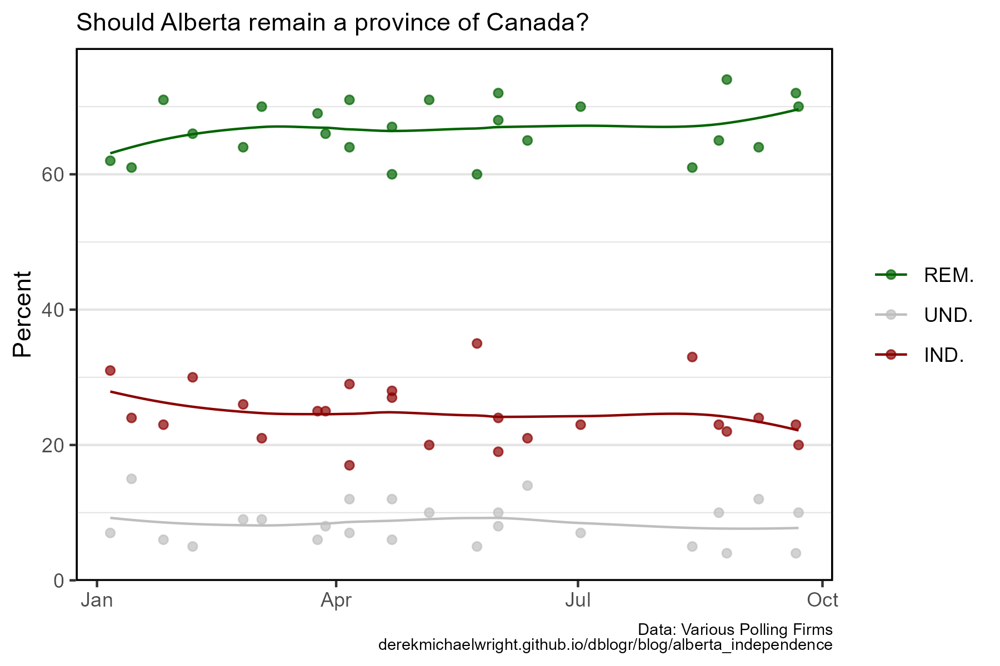
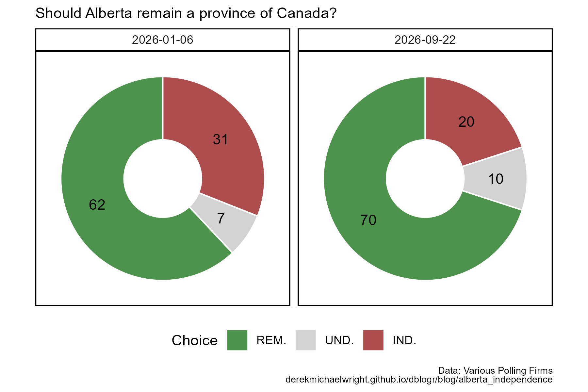

```{r setup, include=FALSE}
knitr::opts_chunk$set(echo = TRUE, message = F, warning = F)
```

---

# Data

> - `r shiny::icon("globe")` [https://www.thewrit.ca/p/alberta-referendum-poll-tracker](https://www.thewrit.ca/p/alberta-referendum-poll-tracker){target="_blank"}
> - `r shiny::icon("save")` [data_alberta_independence.csv](data_alberta_independence.csv)

---

# Prepare Data

```{r class.source = 'fold-show'}
# devtools::install_github("derekmichaelwright/agData")
library(agData)
```

```{r}
# Prep data
myCaption <- "Data: Various Polling Firms<br>derekmichaelwright.github.io/dblogr/blog/alberta_independence"
myTitle <- "Should Alberta remain a province of Canada?"
myChoices <- c("REM.", "UND.", "IND.")
myColors <- c("darkgreen", "grey", "darkred")
#
dd <- read.csv("data_alberta_independence.csv") %>%
  mutate(Firm = substr(Polling.Firm, 2, regexpr("]", Polling.Firm)-1),
         Start = as.Date(Start),
         End = as.Date(End)) %>%
  gather(Choice, Percent, REM., IND., UND.) %>%
  mutate(Choice = factor(Choice, levels = myChoices))
  
```

---

# Nanos Poll {.tabset .tabset-pills}

## Stacked



```{r}
# Plot
mp <- ggplot(dd, aes(x = End, y = Percent, color = Choice)) + 
  geom_point(alpha = 0.7) +
  stat_smooth(geom="line", method = "loess") +
  scale_color_manual(name = NULL, values = myColors) +
  theme_agData_col() +
  labs(subtitle = myTitle, x = NULL, caption = myCaption)
ggsave("alberta_independence_01.png", mp, width = 6, height = 4)
```

```{r echo = F}
ggsave("featured.png", mp, width = 6, height = 4)
```

---

## Pie



```{r}
# Prep data
xx <- dd %>%
  filter(End %in% c("2026-09-22", "2026-01-06"))
# Plot
mp <- ggplot(xx, aes(x = "x", y = Percent, fill = Choice)) + 
  geom_col(color = "white", alpha = 0.7) +
  geom_text(aes(label = Percent), position = position_stack(vjust = 0.5)) +
  coord_polar("y", start = 0) +
  facet_wrap(. ~ End, scales = "free") +
  scale_fill_manual(values = myColors) +
  scale_x_discrete(limits = c("x_empty", "x")) +
  theme_agData_pie(legend.position = "bottom") +
  labs(subtitle = myTitle, x = NULL, caption = myCaption)
ggsave("alberta_independence_02.png", mp, width = 6, height = 4)
```

---
