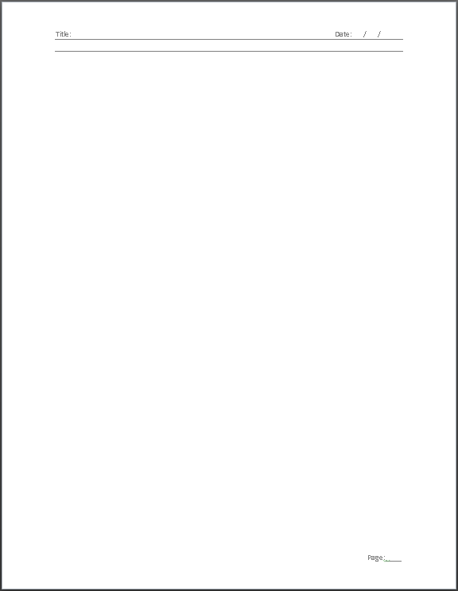
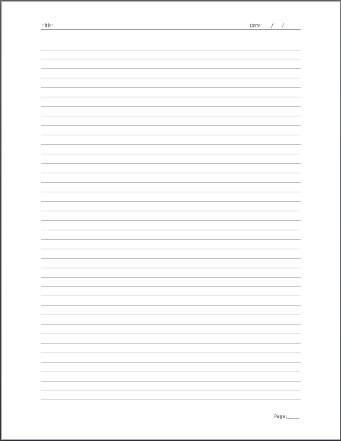
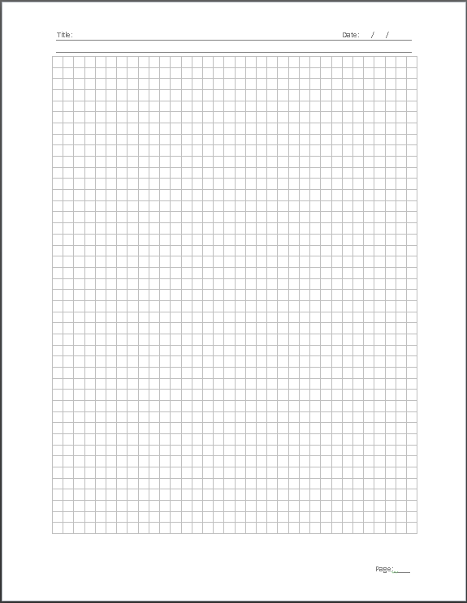

```{r setup, include = FALSE, warning = F, message = F}
knitr::opts_chunk$set(echo = T, message = F, warning = F)
```

# Templates {.tabset .tabset-pills}

## Blank

`r shiny::icon("save")` [page_blank.docx](page_blank.docx)



## Lined

`r shiny::icon("save")` [page_line.docx](page_line.docx)



## Gridded

`r shiny::icon("save")` [page_grid.docx](page_grid.docx)



---
